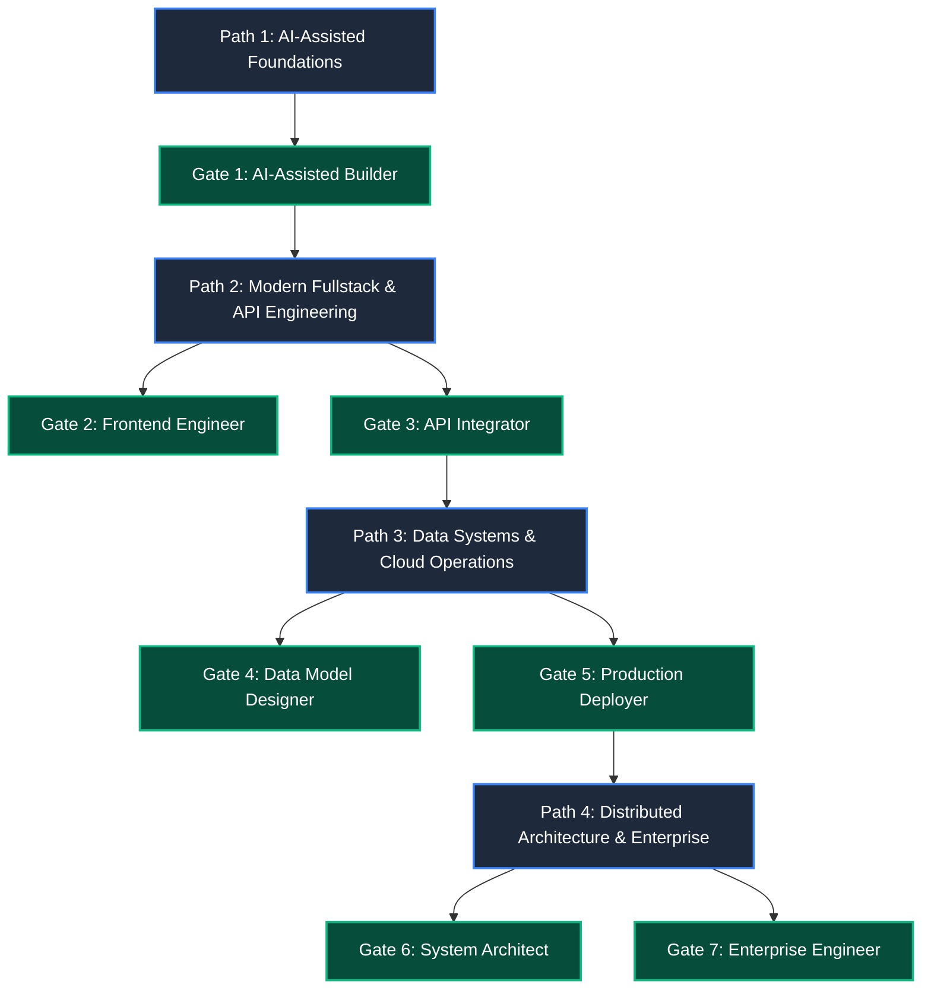
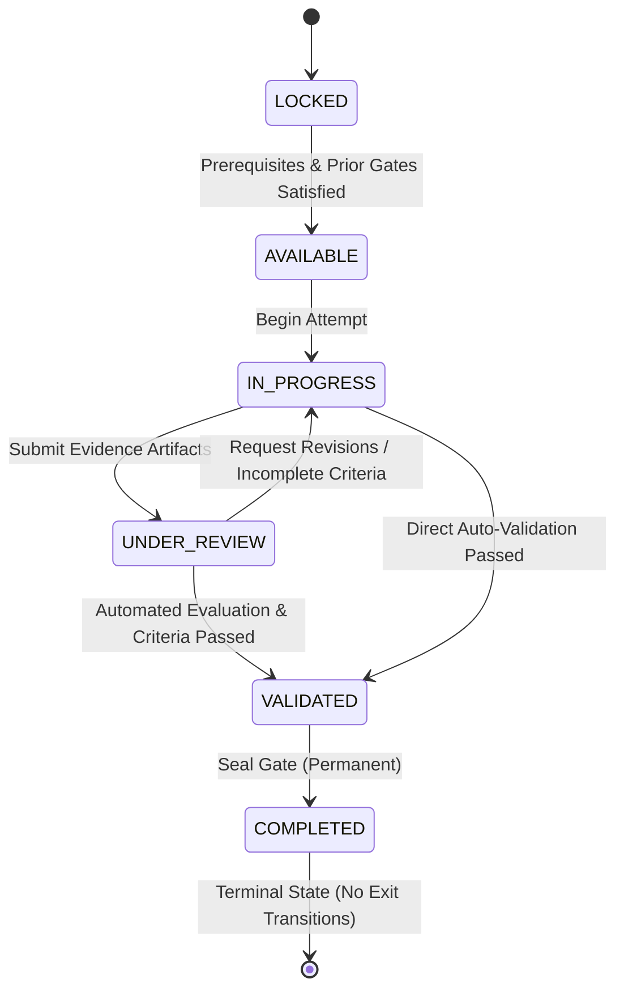
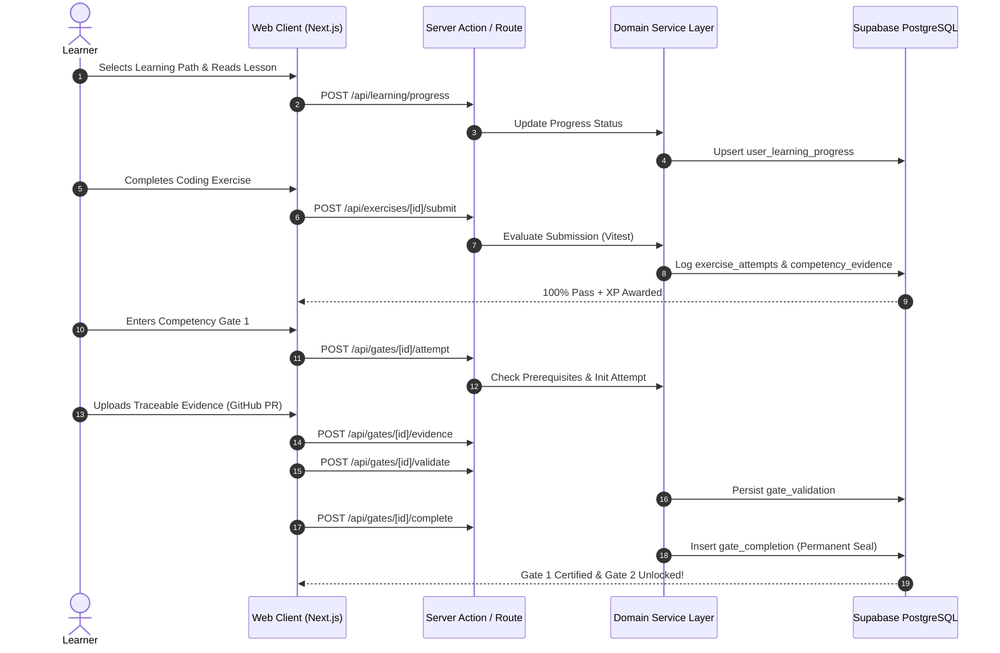

# Product Requirements Document (PRD)
# AI-Native Software Engineering Academy & Mastery Learning Platform

**Document Version:** 1.0.0  
**Status:** Approved / Authoritative Baseline  
**Classification:** Core System Specification  
**Author:** Principal Software Architect & Product Engineering Working Group  
**Target Repository:** `ai-native-lms`

---

## Table of Contents

1. [Vision](#1-vision)
2. [Problem Statement](#2-problem-statement)
3. [Target Audience](#3-target-audience)
4. [Graduate Definition](#4-graduate-definition)
5. [Competency Model](#5-competency-model)
6. [Learning Philosophy](#6-learning-philosophy)
7. [Curriculum Overview](#7-curriculum-overview)
8. [Competency Gates](#8-competency-gates)
9. [Learning System](#9-learning-system)
10. [Exercise System](#10-exercise-system)
11. [Capstone System](#11-capstone-system)
12. [Portfolio System](#12-portfolio-system)
13. [Job Readiness System](#13-job-readiness-system)
14. [User Personas](#14-user-personas)
15. [User Journeys](#15-user-journeys)
16. [Functional Requirements](#16-functional-requirements)
17. [Non-Functional Requirements](#17-non-functional-requirements)
18. [MVP Scope](#18-mvp-scope)
19. [Future Roadmap](#19-future-roadmap)
20. [Risks & Mitigations](#20-risks--mitigations)
21. [Success Metrics](#21-success-metrics)
22. [Acceptance Criteria](#22-acceptance-criteria)

---

## 1. Vision

The **AI-Native Software Engineering Academy** is an industry-grade mastery learning platform engineered to transform aspiring and practicing software developers into **AI-augmented, production-ready software engineers**.

Unlike legacy bootcamps and MOOCs that measure superficial "time-in-seat" or passive video consumption, the platform enforces **evidence-based competency verification**. Learners advance exclusively by demonstrating verifiable mastery across seven capability gates—from AI-assisted code generation through distributed systems architecture and enterprise governance.

```mermaid
graph LR
    classDef step fill:#0f172a,stroke:#3b82f6,stroke-width:2px,color:#fff;
    classDef gate fill:#064e3b,stroke:#10b981,stroke-width:2px,color:#fff;
    classDef outcome fill:#31102f,stroke:#ec4899,stroke-width:2px,color:#fff;

    L1[AI Builder]:::step --> G1[Gate 1: AI-Assisted Builder]:::gate
    G1 --> L2[Frontend & API]:::step
    L2 --> G2[Gate 2 & 3: Web & API Mastery]:::gate
    G2 --> L3[Data & DevOps]:::step
    L3 --> G3[Gate 4 & 5: Data & Production]:::gate
    G3 --> L4[Architecture & Enterprise]:::step
    L4 --> G4[Gate 6 & 7: System & Enterprise]:::gate
    G4 --> CERT[Verified AI Software Engineer]:::outcome
```



---

## 2. Problem Statement

Modern software engineering has been fundamentally disrupted by AI tooling (Cursor, Claude Code, GitHub Copilot, Gemini CLI). However, technical education remains plagued by three systemic failures:

1. **The "Tutorial Illusion" & Vanity Progress**: Traditional platforms award completion for watching videos or filling in trivial snippets. Learners develop a false sense of competence without knowing how to architect, debug, or deploy real software.
2. **Boilerplate-Centric Curricula**: Legacy programs teach manual syntax repetition (e.g. handwriting HTML forms or regex parsing) that AI solves instantaneously, while neglecting critical modern engineering skills: **specification-driven design, context engineering, schema contracts, test harness design, and AI code review**.
3. **Unverifiable Portfolio Claims**: Employers face a flood of generic AI-generated portfolio projects. Hiring managers cannot distinguish between an engineer who orchestrated and verified a complex architecture and someone who blindly copied LLM output.

### The Solution
A platform built on **Domain-Driven Design (DDD)** and **Finite State Mastery Checkpoints** that requires auditable, cryptographic-grade evidence (git commits, architecture diagrams, passing test harnesses, and live production deployments) before allowing progression.

---

## 3. Target Audience

| Segment | Profile | Primary Need |
| :--- | :--- | :--- |
| **Aspiring AI Engineers** | Computer science students, bootcamp graduates, or career switchers with foundational programming literacy. | Fast-track path to modern AI-augmented fullstack development with verified employer credentials. |
| **Mid-Level Engineers** | Professional developers (2–5 years) seeking to modernize their workflow with LLM orchestration and agentic SDLC. | Mastery in context window management, schema-driven architecture, and automated test-driven AI workflows. |
| **Enterprise Upskilling Teams** | Engineering departments transitioning to AI-assisted development tools. | Standardized benchmark to certify that team members write maintainable, secure, and compliant AI-generated code. |
| **Hiring Partners & Recruiters** | Technical recruiters and engineering directors looking for vetted engineering talent. | Tamper-proof competency portfolios with line-by-line evidence traceability. |

---

## 4. Graduate Definition

A graduate of the AI-Native Software Engineering Academy is not merely a coder—they are a **Technical Orchestrator, System Architect, and Verification Specialist**.

### Graduate Profile Standards:
- **AI Toolchain Mastery**: Fluidly pairs with AI agents for architecture, implementation, refactoring, and test generation while maintaining total cognitive control over the codebase.
- **Contract-First Architecture**: Writes unambiguous type contracts (Zod, TypeScript, OpenAPI, SQL schemas) before writing implementations.
- **Verification-Driven Engineering**: Constructs comprehensive unit, integration, and property-based test suites that ruthlessly evaluate AI-generated code.
- **Fullstack Deployment Capability**: Designs relational database schemas with Row-Level Security (RLS), exposes REST/RPC endpoints, and deploys production containers with CI/CD automation.
- **Enterprise Governance**: Audits code for OWASP Top 10 vulnerabilities, data privacy, accessibility (WCAG 2.1 AA), and architectural isolation.

---

## 5. Competency Model

The platform organizes engineering capabilities into a structured, four-tier hierarchy:

```
Category (e.g. Prompt Engineering & AI SDLC)
└── Competency (e.g. Context Grounding & Prompt Optimization - CTX-01)
    └── Mastery States: [ NOT_STARTED -> INTRODUCED -> PRACTICING -> REINFORCED -> MASTERED ]
        └── Evidence Mappings: [ Exercises, Lessons, Artifacts ]
```

### Competency Categories & Standard Codes

| Code | Category | Description | Target Level |
| :--- | :--- | :--- | :---: |
| `CTX-01` | Prompt & Context Engineering | Multi-turn prompting, system instructions, context window optimization | Level 1 |
| `SDD-01` | Schema-Driven Development | Zod/TypeScript schema contracts, runtime validation, API type inference | Level 2 |
| `API-01` | API Design & Integration | REST route handlers, Server Actions, error envelopes, auth middleware | Level 3 |
| `DBM-01` | Relational Modeling & RLS | PostgreSQL schemas, normalization, migrations, Supabase RLS security | Level 4 |
| `OPS-01` | Production CI/CD & Deploy | Containerization, deployment pipelines, preview environments, observability | Level 5 |
| `ARC-01` | Distributed Architecture | Bounded contexts, DDD domain separation, event-driven workflows | Level 6 |
| `GOV-01` | Enterprise Governance | Security compliance, auditability, multi-tenancy, zero-regression policies | Level 7 |

---

## 6. Learning Philosophy

The platform operationalizes **Bloom's Revised Taxonomy** adapted for the AI Era:

```
[ CREATING ]    --> Architecting distributed systems & multi-agent pipelines
[ EVALUATING ]  --> Auditing & verifying AI-generated implementations & test suites
[ ANALYZING ]   --> Deconstructing system bottlenecks, memory leaks, and RLS flaws
[ APPLYING ]    --> Writing schema contracts & driving AI implementation engines
[ UNDERSTANDING]--> Comprehending architecture patterns & state machines
[ REMEMBERING ] --> Foundational syntax (delegated to AI tools)
```

### Core Tenets:
1. **Rule of Evidence**: If an action is not captured as an auditable artifact, it did not happen.
2. **Permanent Gate Sealing**: Completed gates are immutable milestones certifying competence.
3. **Deliberate Failure Injection**: Exercises intentionally inject subtle LLM hallucinations and edge-case bugs that learners must detect and remediate.
4. **Immediate Feedback Loops**: Automated test harnesses evaluate submissions in < 2 seconds.

---

## 7. Curriculum Overview

The syllabus consists of four comprehensive learning paths structured across 7 Capability Gates:



---

## 8. Competency Gates

Competency Gates are the system's irreversible mastery checkpoints.

### Supported Capability Gates

| Level | Gate Name | Slug | Prerequisite Focus |
| :---: | :--- | :--- | :--- |
| **1** | **AI-Assisted Builder** | `gate-1-ai-builder` | Context engineering, cursor workflows, starter code generation |
| **2** | **Frontend Engineer** | `gate-2-frontend-engineer` | Next.js App Router, Zustand stores, responsive UI, component testing |
| **3** | **API Integrator** | `gate-3-api-integrator` | REST routes, Server Actions, Zod validation, auth token security |
| **4** | **Data Model Designer** | `gate-4-data-model-designer` | PostgreSQL relational schemas, Supabase migrations, RLS policies |
| **5** | **Production Deployer** | `gate-5-production-deployer` | CI/CD build scripts, Docker staging, preview deployments, monitoring |
| **6** | **System Architect** | `gate-6-system-architect` | Domain-Driven Design, bounded context isolation, state machines |
| **7** | **Enterprise Engineer** | `gate-7-enterprise-engineer` | Multi-tenancy, compliance audit logs, zero-regression test harnesses |

### Gate Finite State Machine



---

## 9. Learning System

The **Learning Domain** manages sequential educational progressions:
- **Paths**: Long-term career curriculums (e.g. Fullstack AI Software Engineer).
- **Modules**: Thematic instructional units containing 3–8 lessons with defined sequencing.
- **Lessons**: Rich interactive MDX tutorials featuring live code snippets, architecture diagrams, callouts, and key takeaway checkpoints.
- **Progress Tracking**: Real-time state persistence (`not_started`, `in_progress`, `completed`) tracked per user in `user_learning_progress`.

---

## 10. Exercise System

The **Exercise Domain** powers hands-on coding practice and automated assessment:
- **Interactive Sandbox**: Integrated monaco/web code editor with syntax highlighting and instant execution.
- **Automated Validation Engine**: Executes automated test suites (Vitest/Jest) against student submissions in isolated sandboxes.
- **Attempt History**: Every submission logs timestamps, source code, pass/fail status, execution output, and score in `exercise_attempts`.
- **Competency Mapping**: Successful exercises trigger evidence records linked to target competency codes in `competency_evidence_mapping`.

---

## 11. Capstone System

The **Capstone Domain** validates holistic engineering capability:
- **Real-World Project Specs**: End-to-end specifications requiring fullstack implementation (e.g. Real-Time Collaborative Canvas, Multi-Tenant SaaS Billing Engine).
- **Milestone Checkpoints**: Capstones are subdivided into 4 staged deliverables (Architecture RFC &rarr; Database & API &rarr; Frontend & State &rarr; Production Deployment).
- **Automated & Human Review**: Combines automated test verification with peer and instructor rubric evaluations.

---

## 12. Portfolio System

The **Portfolio Domain** transforms verified coursework into an interactive, employer-facing showcase:
- **Live Project Embeds**: Interactive previews of deployed applications with direct links to GitHub repositories and CI/CD runs.
- **Competency Badge Verification**: Digitally verifiable badges linked to cryptographic Supabase verification records.
- **Code Walkthroughs & Architecture Docs**: Public-facing case studies documenting architectural trade-offs, ADRs, and schema decisions.

---

## 13. Job Readiness System

The **Job Readiness Domain** bridges technical mastery and career placement:
- **Technical Interview Simulator**: AI-driven technical deep dives testing architectural decisions, edge cases, and debugging speed.
- **Employability Index**: Algorithmic scoring based on competency depth, gate velocity, test coverage rigor, and code clean-sheet rates.
- **Recruiter Dashboard**: Filterable talent pool allowing partner employers to query candidates by verified competencies (e.g. `DBM-01` + `ARC-01` mastered).

---

## 14. User Personas

### Persona 1: Alex — Career Switcher (Aspiring AI Engineer)
- **Background**: Junior web developer wanting to leapfrog into high-paying AI engineering roles.
- **Pain Points**: Overwhelmed by fragmented YouTube tutorials; cannot prove they didn't just copy code from ChatGPT.
- **Goal**: Follow a structured, rigorous path that certifies their ability to build production systems from scratch.

### Persona 2: Maya — Mid-Level Fullstack Developer
- **Background**: 3 years of React/Node.js experience looking to master architecture and AI tooling.
- **Pain Points**: Stuck writing repetitive boilerplate; uncertain how to design robust database RLS and distributed state machines.
- **Goal**: Master Level 4–7 Competency Gates to qualify for Senior Software Engineer / Technical Lead roles.

### Persona 3: David — Technical Recruiter / Engineering Hiring Manager
- **Background**: VPs of Engineering and recruiters hiring remote software engineers.
- **Pain Points**: Flooded with hundreds of identical, low-quality candidate resumes with unverified GitHub repos.
- **Goal**: Review verified competency scorecards and auditable gate evidence to make confident, fast hiring decisions.

---

## 15. User Journeys



---

## 16. Functional Requirements

### 16.1 Authentication & Profile Management
- **FR-AUTH-01**: Secure email/password and OAuth sign-in via Supabase Auth.
- **FR-AUTH-02**: Role-Based Access Control (`learner`, `instructor`, `admin`) enforced via RLS and middleware.
- **FR-AUTH-03**: User profile management with avatar, bio, and social handles.

### 16.2 Learning & Curriculum Management
- **FR-LRN-01**: Hierarchical navigation: Learning Path &rarr; Module &rarr; Lesson.
- **FR-LRN-02**: Interactive MDX lesson rendering with code blocks, callouts, and diagrams.
- **FR-LRN-03**: Real-time progress synchronization with optimistic UI updates.

### 16.3 Competency Tracking & Evaluation
- **FR-CMP-01**: Multi-category competency matrix tracking 5 distinct mastery states.
- **FR-CMP-02**: Traceable evidence mapping linking exercise submissions to competency codes.
- **FR-CMP-03**: Competency radar visualization on user profile dashboard.

### 16.4 Interactive Exercise Execution
- **FR-EXE-01**: In-browser code editor with starter code templates and instructions.
- **FR-EXE-02**: Automated test execution sandbox evaluating inputs against test harnesses.
- **FR-EXE-03**: Full attempt logging with historical diff and execution stdout/stderr.

### 16.5 Gamification, XP & Rewards
- **FR-ACH-01**: Real-time XP balance updates with animated toast notifications.
- **FR-ACH-02**: Double-entry style immutable audit ledger for all XP credit/debit transactions.
- **FR-ACH-03**: Tiered achievement badges (`bronze`, `silver`, `gold`, `platinum`) unlocked upon meeting criteria.

### 16.6 Competency Gate Mastery Checkpoints
- **FR-GAT-01**: Strict state machine transition enforcement (`LOCKED` &rarr; `AVAILABLE` &rarr; `IN_PROGRESS` &rarr; `UNDER_REVIEW` &rarr; `VALIDATED` &rarr; `COMPLETED`).
- **FR-GAT-02**: Multi-type requirement evaluator (`competency`, `lesson`, `exercise`, `achievement`, `xp`, `artifact`).
- **FR-GAT-03**: Permanent gate completion sealing with zero outgoing transitions.
- **FR-GAT-04**: Evidence upload modal supporting repository URLs, preview links, and architectural documents.

---

## 17. Non-Functional Requirements

### 17.1 Performance & Latency
- **NFR-PERF-01**: Server-Side Rendered (SSR) page load time < 800ms (P95).
- **NFR-PERF-02**: API Route Handler and Server Action response time < 250ms (P95).
- **NFR-PERF-03**: In-browser test execution evaluation < 2.5s.

### 17.2 Security & Data Protection
- **NFR-SEC-01**: 100% of PostgreSQL tables protected by Row-Level Security (RLS) policies.
- **NFR-SEC-02**: Zero exposure of Supabase `service_role` key to client-side bundles.
- **NFR-SEC-03**: Strict input sanitization and validation on all endpoints using Zod.
- **NFR-SEC-04**: Compliance with OWASP Top 10 web security standards.

### 17.3 Reliability & Availability
- **NFR-REL-01**: Platform availability target of 99.9% uptime.
- **NFR-REL-02**: Zero data loss guarantee for gate completion and XP ledger transactions via PostgreSQL ACID transactions.

### 17.4 Accessibility (A11y)
- **NFR-A11Y-01**: Web Content Accessibility Guidelines (WCAG) 2.1 Level AA compliance.
- **NFR-A11Y-02**: Full keyboard navigation support across all modal dialogs, steppers, and code editors.

---

## 18. MVP Scope

The MVP encompasses the core foundational domains required to deliver the complete end-to-end mastery learning loop:

| Module / Domain | In MVP Scope | Notes |
| :--- | :---: | :--- |
| **Foundation & Design System** | ✅ Yes | HSL theme tokens, typography, layout hierarchy |
| **Authentication & Identity** | ✅ Yes | Supabase Auth, profiles, RBAC |
| **Learning Domain** | ✅ Yes | Path / Module / Lesson tree with progress tracking |
| **Competency Domain** | ✅ Yes | 7 standard competencies, 5-state mastery model |
| **Exercise Domain** | ✅ Yes | In-browser validation, attempt history |
| **Achievement & XP Domain** | ✅ Yes | XP balance, transaction ledger, badge catalogue |
| **Competency Gate Domain** | ✅ Yes | 7 Capability Gates, multi-type requirements, permanent seal |
| **Portfolio Domain** | ⏳ Phase 7 | Planned for next milestone |
| **Capstone Domain** | ⏳ Phase 8 | Planned for next milestone |
| **Job Readiness & Recruiter Portal**| ⏳ Phase 9 | Planned for next milestone |

---

## 19. Future Roadmap

```
Phase 1-6 (Current Baseline)  -->  Phase 7: Portfolio Domain  -->  Phase 8: Capstone Domain  -->  Phase 9: Job Readiness
• Foundation & Auth               • Verified Portfolio Builder      • Staged Capstone Specs        • Recruiter Search Dashboard
• Learning & Curriculum           • Custom Domain Hosting           • Automated Code Reviews       • Technical Interview AI Sim
• Competency Tracking             • Employer Verification Links     • Peer Evaluation Engine       • Employability Index Score
• Interactive Exercises           • Social Share Cards              • Capstone Defense Panels      • Direct Job Placement Hooks
• Achievements & XP System
• Competency Gates (Lvl 1-7)
```

---

## 20. Risks & Mitigations

| Risk | Severity | Impact | Mitigation Strategy |
| :--- | :---: | :---: | :--- |
| **LLM Hallucinations in Exercises** | High | Learners receive incorrect feedback | Strict deterministic unit test harnesses (Vitest) run on isolated servers rather than raw LLM text evaluation. |
| **Premature Gate Completion** | Critical | Invalid credentials issued | Database-level `UNIQUE(user_id, gate_id)` constraints, prerequisite checks, and strict server-side policy enforcement. |
| **Performance Degrades on Complex Joins** | Medium | Slow dashboard loads | Strategic database indexing on foreign keys (`user_id`, `gate_id`, `competency_id`) and composite status queries. |
| **Copy-Paste Plagiarism** | Medium | Learners submit unearned code | Multi-type gate requirements demanding live deployment URLs, commit histories, and interactive validation checks. |

---

## 21. Success Metrics

```
+-----------------------------------------------------------------------------------+
|                            KEY PERFORMANCE INDICATORS                             |
+------------------------------------+----------------------------------------------+
| Metric                             | Target Objective                             |
+------------------------------------+----------------------------------------------+
| 1. Gate 1-7 Completion Rate        | > 65% of enrolled learners complete Gate 3+  |
| 2. Zero False Mastery Rate         | 100% verified gate completions pass audit    |
| 3. Test Suite Pass Rate            | 100% green builds on all CI pipelines        |
| 4. Average Time to Gate Clearance  | 14-21 days per capability level              |
| 5. System Latency (SSR / API)      | < 800ms page load / < 250ms API response     |
| 6. Learner Engagement Velocity     | > 4 interactive exercise attempts per week   |
+------------------------------------+----------------------------------------------+
```

---

## 22. Acceptance Criteria

### AC-1: Mastery Verification Enforcement
- A learner cannot advance to Gate $N+1$ until Gate $N$ is in the `COMPLETED` state.
- Attempting to complete a gate without satisfying 100% of defined requirements must return HTTP `400 Bad Request` with detailed failure messages.

### AC-2: Traceable Proof Immutability
- Every gate validation must reference an active gate attempt and at least one verifiable evidence record in `gate_evidence`.
- Completed gate records in `gate_completion` cannot be deleted, updated, or transitioned to any other state.

### AC-3: Code Quality & Zero Regressions
- All TypeScript code must compile with 0 type errors (`npx tsc --noEmit`).
- All code must pass ESLint with 0 warnings (`npm run lint`).
- Full unit and integration test suite must achieve a 100% pass rate across all 18+ test suites (`npx vitest run`).
