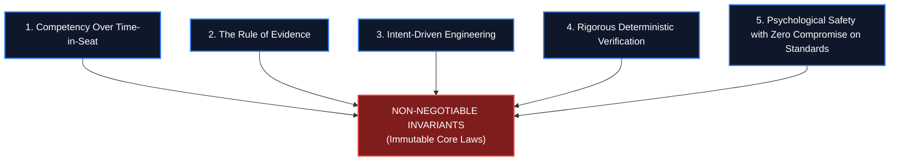
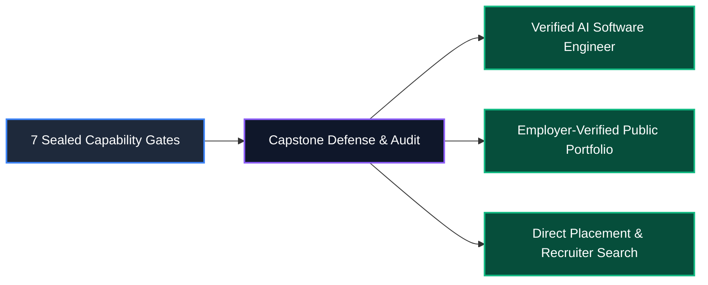

# The Academy Constitution
# AI-Native Software Engineering Academy (`ai-native-lms`)

**Document Version:** 1.0.0  
**Status:** Permanent, Immutable & Legally Binding Governance Specification  
**Authority:** Academy Board of Governors, Principal Systems Architect & Head of Engineering  
**Scope:** 24-Month Self-Paced AI-Native Software Engineering Mastery Program  
**Target Transformation:** Complete Beginner (Zero Knowledge) &rarr; Job-Ready, Production-Verified AI-Native Software Engineer  
**Effective Date:** September 30, 2026

---

## Preamble

We establish this **Academy Constitution** as the supreme governing law of the AI-Native Software Engineering Academy. 

In an era where Artificial Intelligence can generate thousands of lines of boilerplate code in seconds, traditional computer programming pedagogy is obsolete. Memorizing syntax, copying tutorials, and measuring vanity progress (e.g. passive video watching or seat-time) produce an illusion of competence that fails instantly in enterprise environments.

The mission of this Academy is to forge complete novices into **Technical Orchestrators, Systems Architects, and Verification Authorities**. 

This Constitution defines the immutable principles, non-negotiable invariants, and graduation standards that govern all curriculum authors, automated assessment engines, evaluators, and learners.

---

## 1. Academy Core Principles



### Principle 1: Competency Over Time-in-Seat (True Mastery Learning)
Advancement is never granted by the passage of time, course duration, or fee payment. Progression is governed strictly by demonstrated, reproducible mastery. A learner may take 6 months or the full 24-month self-paced window; the terminal standard required for certification remains identical and uncompromised.

### Principle 2: The Rule of Traceable Evidence
In technical education, if capability cannot be proven through an auditable, verifiable artifact, **it did not happen**. Every milestone, competency award, and gate clearance requires concrete digital proof: atomic git commits, automated test execution reports, live deployed preview URLs, schema migrations, and recorded architectural defenses.

### Principle 3: Intent-Driven & Specification-First Engineering
In the AI era, code is no longer the scarce resource; **clear architectural intent, precise domain boundaries, and formal invariant specifications are**. The Academy teaches learners to direct, constrain, and orchestrate AI systems rather than act as manual syntax typists.

### Principle 4: Rigorous Deterministic Verification
Non-deterministic AI models must always be evaluated by deterministic verification harnesses. No student or AI-generated implementation is accepted without automated test suites, type checking, linting, and runtime contract enforcement.

### Principle 5: High Empathy Scaffolding & Zero Compromise on Production Rigor
While we maintain total psychological safety, beginner empathy, and granular scaffolding to onboard learners with zero technical background, we **never lower production engineering standards**. Our graduates must meet the exact standards required of mid-level engineers at world-class technology organizations.

---

## 2. Non-Negotiable Invariants (What May NEVER Be Compromised)

The following twelve laws are permanently sealed and may not be altered, relaxed, or bypassed by any human instructor, autonomous AI agent, or administrative policy:

```
┌────────────────────────────────────────────────────────────────────────────────────────┐
│                          THE TWELVE CONSTITUTIONAL INVARIANTS                         │
├────┬─────────────────────────────┬─────────────────────────────────────────────────────┤
│ #  │ Invariant Name              │ Constitutional Mandate                              │
├────┼─────────────────────────────┼─────────────────────────────────────────────────────┤
│ 1  │ Zero False Mastery Law      │ Substring/regex matching is forbidden as evaluation.│
│ 2  │ Sandboxed Execution Law     │ 100% of code submissions must execute in a VM/test. │
│ 3  │ Permanent Gate Sealing Law  │ Outgoing transitions from completed gates = 0.      │
│ 4  │ Sequential Hierarchy Law    │ Gate N+1 cannot be attempted until Gate N is sealed.│
│ 5  │ Multi-Factor Gate Law       │ Scalar XP alone can NEVER unlock a Capability Gate. │
│ 6  │ Capstone Requirement Law    │ Graduation requires 4 fully implemented capstones.  │
│ 7  │ Zero-Placeholder Law        │ Production lessons/exercises must contain 0 stubs.  │
│ 8  │ Kernel RLS Security Law     │ 100% of user data tables must have RLS active.      │
│ 9  │ Double-Entry XP Law         │ XP transactions are strictly immutable & append-only│
│ 10 │ Production Toolchain Law    │ Learners must use real git, CLI, IDEs, and clouds.  │
│ 11 │ Zero-Regression Domain Law  │ Certified domains cannot be mutated without an ADR. │
│ 12 │ Human Defense Law           │ Level 7 certification requires a live defense panel.│
└────┴─────────────────────────────┴─────────────────────────────────────────────────────┘
```

### Detailed Invariant Specifications:

1. **The Zero False Mastery Law**: The platform is strictly prohibited from using string inclusion (`code.includes()`), length checks, or regex heuristics as a proxy for coding proficiency. Every exercise must be compiled, executed, and evaluated against automated test suites.
2. **The Sandboxed Execution Law**: All code submitted by learners must run within an isolated execution sandbox (Node.js/Vitest container) with strict memory limits, execution timeouts (2.5s), and structured assertion feedback.
3. **The Permanent Gate Sealing Law**: Once a learner satisfies 100% of criteria for a Capability Gate, the gate record in `gate_completion` is permanently sealed. There are zero exit transitions from the `COMPLETED` state.
4. **The Sequential Hierarchy Law**: The platform kernel rejects any attempt to start, validate, or complete Capability Gate $N+1$ unless Capability Gate $N$ has been sealed in `gate_completion`.
5. **The Multi-Factor Gate Requirement Law**: Capability Gates must enforce multi-factor requirements (`competency` mastery, `lesson` completion, `exercise` pass counts, `artifact` submissions). No gate may ever be cleared purely through XP point accumulation.
6. **The Capstone Requirement Law**: No learner may graduate without successfully building, deploying, and defending four end-to-end fullstack Capstone projects that meet defined automated test and evaluator rubrics.
7. **The Zero-Placeholder Standard**: No instructional module or lesson may exist as a stub, outline, or micro-summary (<1,200 words). Every published lesson must provide thorough conceptual depth, architecture diagrams, and runnable code blocks.
8. **The Kernel-Level Security Law**: Every database table in the platform must enforce PostgreSQL Row-Level Security (`ENABLE ROW LEVEL SECURITY`). Application-level filter checks alone are unconstitutional.
9. **The Double-Entry XP Ledger Law**: The `xp_transactions` table is an append-only accounting ledger. Direct updates, manual edits, or row deletions are blocked at the database engine level.
10. **The Production Toolchain Law**: Learners must not be sheltered inside closed proprietary "toy" web sandboxes indefinitely. By Gate 2, all work must be authored in modern IDEs (Cursor/VS Code), committed via Git, and deployed to live cloud infrastructure.
11. **The Zero-Regression Domain Law**: Once a bounded context domain (Auth, Learning, Competency, Exercise, XP, Gates, Portfolio, Capstone) is certified, no agent or engineer may modify its core schema or business invariants without an approved Architectural Decision Record (ADR).
12. **The Verbal Defense & Synthesis Law**: Terminal graduation requires the learner to verbally and conceptually defend their system design, database indexing, threat model, and AI orchestration choices before an assessment panel.

---

## 3. The 24-Month Self-Paced Operational Rhythm

The Academy recognizes that learners enter from diverse socio-economic backgrounds, full-time jobs, and caregiving responsibilities. The 24-month self-paced model provides temporal elasticity while maintaining uncompromised quality:

```
┌────────────────────────────────────────────────────────────────────────────────────────┐
│                              24-MONTH PACING BENCHMARKS                                │
├─────────────────────────┬─────────────────────────┬────────────────────────────────────┤
│ Pacing Mode             │ Target Weekly Velocity  │ Estimated Graduation Timeline      │
├─────────────────────────┼─────────────────────────┼────────────────────────────────────┤
│ Intensive / Full-Time   │ 30–40 hours / week      │ 8–10 months                        │
│ Standard / Part-Time    │ 15–20 hours / week      │ 14–18 months                       │
│ Flexible / Self-Paced   │ 8–12 hours / week       │ 20–24 months (Full Allocation)     │
└─────────────────────────┴─────────────────────────┴────────────────────────────────────┘
```

- **Temporal Flexibility**: A learner may pause, decelerate, or accelerate without penalty.
- **Checkpoint Immutability**: Time away does not decay sealed Competency Gates; earned credentials are cryptographically permanent.
- **Support Guardrails**: Automated drop-off triggers and proactive mentor check-ins activate if a learner is inactive on a single stage for more than 21 days.

---

## 4. Graduation, Employability & Portfolio Mandates



### 4.1 Graduation Standards
To graduate and receive the **Certified AI-Native Software Engineer** credential:
1. All 7 Capability Gates must be permanently sealed in `gate_completion`.
2. All 4 Fullstack Capstone Projects must achieve passing evaluation scores (>85/100) across automated test suites and evaluator rubrics.
3. The learner must complete a recorded 20-minute Capstone Architecture Defense presentation.
4. The candidate must complete the AI Technical Interview Simulation achieving a passing Employability Index rating.

### 4.2 Employability Outcomes
Graduates of the Academy are certified to perform immediately in the following industry roles:
- **AI-Native Fullstack Software Engineer** (Next.js, TypeScript, PostgreSQL, Python, AI APIs)
- **Specification & Prompt Engineer / AI Systems Integrator** (MCP, LLM orchestration, agentic pipelines)
- **Frontend / Fullstack Web Engineer** (React 19, Tailwind, Zustand, Server Actions)
- **Cloud Applications & Data Integrator** (Supabase, PostgreSQL RLS, Docker, GitHub Actions CI/CD)

### 4.3 Portfolio Outcomes
Every graduate receives a publicly verifiable portfolio at `/portfolio/[username]` featuring:
- **4 Live Fullstack Web Applications** hosted on production cloud infrastructure with custom domains and SSL.
- **Direct GitHub Traceability**: Public repositories containing 500+ verified atomic commits, clean PR reviews, and 100% green CI test suites.
- **4 Formally Authored Architectural Decision Records (ADRs)** defending trade-offs, schemas, and security.
- **Cryptographically Verifiable Badges**: Direct verification links validating gate completions against immutable datastore records.

---

## 5. Amendments & Governance Protocol

This Constitution is the foundational document of the Academy. 

- **Amendment Threshold**: Amendments to this Constitution require a formal Architectural Decision Record (ADR) approved unanimously by the Academy Systems Architect, Head of Engineering, and Master Instructional Designer.
- **Inviolability Clause**: No amendment may ever weaken the Twelve Constitutional Invariants or permit the issuance of unearned credentials.
