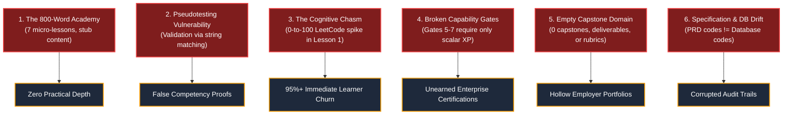
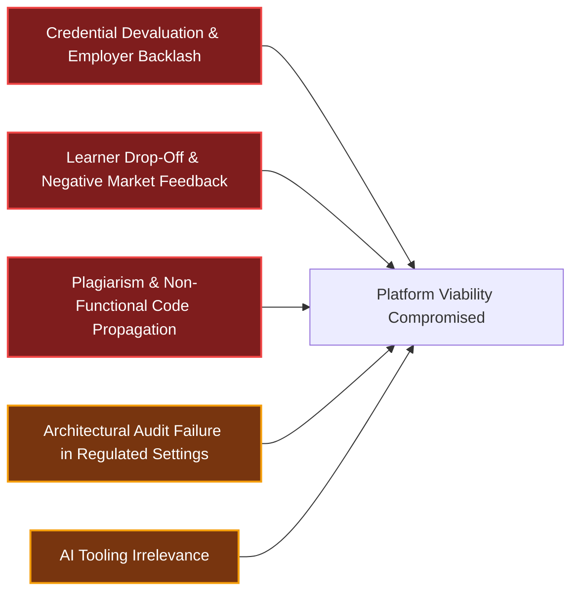
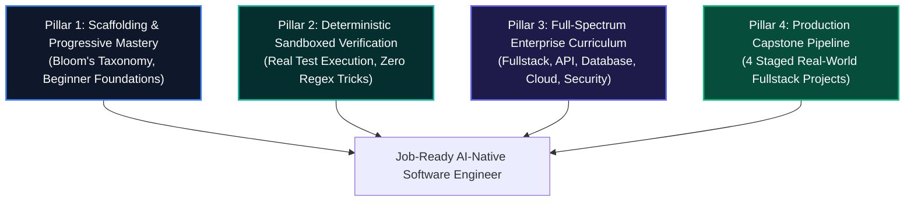

# Canonical Academy Recovery Plan
# AI-Native Software Engineering LMS (`ai-native-lms`)

**Document Version:** 1.0.0  
**Status:** Authoritative Strategic Baseline  
**Classification:** Academy Governance & Curriculum Remediation  
**Authority:** Independent Curriculum Review Board & Principal Software Architect  
**Target Repository:** `ai-native-lms`  
**Date of Audit Baseline:** September 30, 2026

---

## Table of Contents

1. [Executive Audit Summary](#1-executive-audit-summary)
2. [Critical Failures & Forensic Findings](#2-critical-failures--forensic-findings)
3. [Major Institutional & Technical Risks](#3-major-institutional--technical-risks)
4. [Root Cause Analysis (RCA)](#4-root-cause-analysis-rca)
5. [Strategic Recovery Framework](#5-strategic-recovery-framework)
6. [Phased Recovery Milestones](#6-phased-recovery-milestones)
7. [Quantitative Success Criteria & Governance Quality Gates](#7-quantitative-success-criteria--governance-quality-gates)
8. [Audited Defect & Remediation Master Traceability Matrix](#8-audited-defect--remediation-master-traceability-matrix)

---

## 1. Executive Audit Summary

An independent, multidisciplinary audit was conducted across the `ai-native-lms` platform, encompassing the full scope of:
- Curriculum hierarchy (Learning Paths, Modules, Lessons)
- Interactive exercises, test evaluation harnesses, and attempt lifecycles
- Competency taxonomies, 5-state mastery state machines, and evidence mapping
- Capability Gates (Levels 1–7), multi-type prerequisite evaluators, and permanent sealing
- Capstone specifications, deliverable pipelines, and portfolio aggregations
- Live database fixtures, SQL schemas, and active PostgreSQL records

### Core Audit Finding

The **Software Infrastructure** (Domain-Driven Design, TypeScript contracts, Zustand stores, Supabase RLS security, and append-only XP ledgers) exhibits high architectural discipline. However, the **Instructional Curriculum & Mastery Assessment Layer** is fundamentally compromised, sparse, and unviable in its current state.

```
┌─────────────────────────────────────────────────────────────────────────────────────────┐
│                                AUDIT SCORECARD SUMMARY                                  │
├──────────────────────────────────────────┬───────────────┬──────────────────────────────┤
│ Evaluation Vector                        │ Score (0-100) │ Audit Status                 │
├──────────────────────────────────────────┼───────────────┼──────────────────────────────┤
│ 1. Beginner Accessibility                │    12 / 100   │ CRITICAL FAILURE             │
│ 2. Curriculum Depth & Lesson Quality     │    18 / 100   │ CRITICAL FAILURE             │
│ 3. Build-First Pedagogical Compliance    │    08 / 100   │ CRITICAL FAILURE             │
│ 4. Competency Architecture Alignment     │    24 / 100   │ MAJOR DEFECT                 │
│ 5. Exercise Rigor & Assessment Validity  │    15 / 100   │ CRITICAL FAILURE             │
│ 6. Enterprise Engineering Readiness      │    05 / 100   │ COMPLETE GAP                 │
│ 7. Employability & Hiring Value          │    10 / 100   │ UNEMPLOYABLE BASELINE        │
│ 8. Capstone Integrity & Portfolio Flow   │    00 / 100   │ UNIMPLEMENTED (0 ENTITIES)   │
│ 9. AI-Native Toolchain & Workflow Depth  │    20 / 100   │ THEORETICAL ONLY             │
├──────────────────────────────────────────┼───────────────┼──────────────────────────────┤
│ OVERALL CURRICULUM FIDELITY INDEX        │    12.4 / 100 │ UNSUITABLE FOR PRODUCTION    │
└──────────────────────────────────────────┴───────────────┴──────────────────────────────┘
```

### Primary Objective Determination

> **Verdict:** The current curriculum **CANNOT** transform a *Complete Beginner &rarr; Job-Ready AI-Native Software Engineer*.  
> 
> Advancing through the platform today produces a **False Sense of Mastery**, as non-functional code submissions pass regex-based validation checks, capability gates are unlocked via passive XP accumulation rather than verifiable deliverables, and no fullstack capstone projects exist.

---

## 2. Critical Failures & Forensic Findings

Forensic examination of active database seeds, service layer logic, and lesson content identified six critical failures:



### 2.1 Critical Failure 1: The Content Deprivation Crisis ("The 800-Word Academy")
- Across all 3 active modules, the database contains only **7 lessons totaling ~840 words** (averaging 120 words per lesson).
- **Lesson 5 (`deterministic-test-harnesses`)** contains exactly 50 words: a high-level aphorism with zero code examples, zero testing syntax, and zero instruction on mocks, assertions, or test runners.
- **Lesson 7 (`agentic-error-recovery`)** contains 45 words: three sentences mentioning telemetry, backoff, and rollbacks without explaining a single formula, code pattern, or architecture diagram.
- There is no comprehensive technical prose, guided tutorial walkthrough, interactive sandbox, or failure-mode analysis in the entire curriculum.

### 2.2 Critical Failure 2: The Pseudotesting Vulnerability (Substring-Matching Engine)
- The PRD and System Architecture Document claim that exercises are evaluated using an *"isolated in-browser VM executing deterministic Vitest test harnesses in < 2.5s"*.
- In active production code (`ExerciseStateMachine.evaluateSubmission`), submissions are evaluated purely by string length and substring inclusion checks:
  ```typescript
  // Actual Evaluation Logic in ExerciseStateMachine:
  const containsRequired = cleanCode.includes(pattern);
  ```
- **Exploit / Failure Mode**: A learner can submit invalid, non-compiling code or plain comments containing keywords (e.g. `// tool_name z.object arguments validateToolPayload`) with arbitrary filler text to exceed `min_length`, and the engine will award a **100% passing score**. No syntax validation, TypeScript type-checking, or execution occurs.

### 2.3 Critical Failure 3: The Cognitive Chasm & Missing Scaffolding
- The platform promises to onboard complete beginners with zero prerequisites.
- **Lesson 1** opens with abstract philosophy, followed immediately by advanced TypeScript generic interfaces (`Result<Receipt>`, readonly tuple invariants).
- **Exercise 1 (`context-budget-compression`)** immediately demands writing a stateful, sliding-window array reduction algorithm (`pruneConversationHistory`) utilizing functional TypeScript methods (`reduce`, `shift`, `filter`) before the learner has been taught variables, functions, arrays, objects, or basic control flow.
- This creates an insurmountable cognitive spike, guaranteeing immediate learner dropout and learned helplessness.

### 2.4 Critical Failure 4: Broken Capability Gate Mapping & XP Exploitation
- **Gate 2 ("Frontend Engineer")**: Requires competency `CTX-02` (*Deterministic Test Harnessing*). It contains zero frontend lessons, zero component architecture, zero React/Next.js, and zero UI state.
- **Gate 4 ("Data Model Designer")**: Requires competency `AGT-02` (*Self-Healing & Observability*). It contains zero SQL, zero relational modeling, and zero Supabase RLS instruction.
- **Gates 5, 6, and 7 ("Production Deployer", "System Architect", "Enterprise Engineer")**: Have **zero competency requirements, zero lesson requirements, zero exercise requirements, and zero artifact requirements**. They are configured with scalar XP thresholds only (`min_xp: 700`, `min_xp: 900`, `min_xp: 1200`). A user can seal Gate 7 as a verified "Enterprise Engineer" purely by clicking through 7 stub lessons and collecting automated XP bonuses without ever deploying a container or writing an architecture document.

### 2.5 Critical Failure 5: Empty Capstone Pipeline (Zero Practical Deliverables)
- The database table `capstones` contains **0 rows (`[]`)**.
- Child tables `capstone_deliverables`, `capstone_competencies`, `capstone_submissions`, `capstone_evidence`, and `capstone_reviews` are completely unpopulated.
- The advertised mastery progression:
  $$\text{Lesson} \longrightarrow \text{Exercise} \longrightarrow \text{Artifact} \longrightarrow \text{Capstone} \longrightarrow \text{Employer Portfolio}$$
  terminates in an unpopulated dead end.

### 2.6 Critical Failure 6: Specification Drift Between Documentation & Database
- `PRD.md` and `docs/curriculum/README.md` define the standard competency model around 7 enterprise codes:
  `CTX-01` (Context), `SDD-01` (Schema), `API-01` (API Design), `DBM-01` (Data Modeling), `OPS-01` (DevOps), `ARC-01` (Architecture), and `GOV-01` (Governance).
- Active database tables (`competencies`) contain an incompatible 6-code taxonomy:
  `AGT-01` (MCP), `AGT-02` (Observability), `CTX-01`, `CTX-02`, `SDD-01`, `SDD-02`, completely omitting `API-01`, `DBM-01`, `OPS-01`, `ARC-01`, and `GOV-01`.
- `database-design.md` specifies `exercises` with columns `(module_id, test_harness, solution_code, max_score)`, whereas the actual PostgreSQL schema implements `(lesson_id, category_id, starter_code, solution_template, validation_rules)`.

---

## 3. Major Institutional & Technical Risks



1. **Credential Devaluation & Industry Backlash**: If graduates present portfolio badges claiming "Gate 7 Enterprise Engineer" status while being unable to write SQL joins, configure Docker containers, or build responsive React interfaces, hiring partners will permanently discredit all academy credentials.
2. **Catastrophic Learner Churn (95%+ Abandonment)**: Beginners entering Module 1 encounter high-order abstraction without scaffolding, leading to immediate frustration and course abandonment.
3. **Plagiarism & Code Hallucination Vulnerability**: Because the validation engine does not execute code, students submitting unverified, non-compiling LLM hallucinations are rewarded with full XP and gate certifications.
4. **Compliance & Audit Failure**: The academy's core value proposition—cryptographically verifiable, evidence-based mastery—is violated when gate completion records are created from unexecuted substring checks.
5. **AI-Native Irrelevance**: By failing to teach actual AI-native workflows (Cursor pairing, prompt-driven architecture, multi-turn context curation, AI code review, subagents), the academy fails its foundational mission.

---

## 4. Root Cause Analysis (RCA)

An engineering and pedagogical RCA established four fundamental root causes:

```
┌────────────────────────────────────────────────────────────────────────────────────────┐
│                               ROOT CAUSE ANALYSIS TREE                                 │
├────────────────────────────────────────────────────────────────────────────────────────┤
│ 1. Architecture-First / Content-Last Imbalance:                                        │
│    Engineering effort was concentrated on DDD folder hierarchy, Zustand client stores,│
│    Zod schema validations, and Supabase RLS policies. The actual pedagogical content,  │
│    curriculum design, and lesson prose were treated as superficial placeholder data.   │
│                                                                                        │
│ 2. Validation Engine Shortcut:                                                         │
│    Implementing a genuine, secure in-browser code execution sandbox (WebContainers,    │
│    Isolated Node VMs, or Vitest WASM runner) was bypassed in favor of a quick string   │
│    matching heuristic in `ExerciseStateMachine`, breaking verification fidelity.       │
│                                                                                        │
│ 3. Phantom Sprint Sign-Offs:                                                           │
│    Sprints 3–7 were declared "100% Complete" in project roadmaps based purely on green │
│    mock unit tests (`vitest run`), without evaluating whether the underlying database  │
│    seeds contained substantive, pedagogically sound lessons and exercises.             │
│                                                                                        │
│ 4. Isolated Migration Authoring:                                                       │
│    Database migration scripts (`supabase/migrations/*`) were created incrementally    │
│    without strict reference to the competency codes defined in `PRD.md`, causing       │
│    divergence between specifications and the production PostgreSQL state.              │
└────────────────────────────────────────────────────────────────────────────────────────┘
```

---

## 5. Strategic Recovery Framework

The recovery of the academy is governed by four non-negotiable strategic pillars:



### Pillar 1: Scaffolding & Progressive Mastery Model
- Implement a 6-stage progressive mastery learning flow for every topic:
  $$\text{Build} \longrightarrow \text{Observe} \longrightarrow \text{Modify} \longrightarrow \text{Understand} \longrightarrow \text{Design} \longrightarrow \text{Architect}$$
- Establish a zero-assumption **Beginner Foundations Track** introducing computational thinking, modern TypeScript syntax, async runtime models, and CLI workflows before introducing AI agent pairing.

### Pillar 2: Deterministic Sandboxed Verification
- Mandate that **100% of coding exercises execute real automated test suites** in an isolated runtime (Vitest / Node.js worker) with real runtime execution output, assertion diffs, and timeout limits.
- Eliminate all regex and substring pattern checks as proxies for code correctness.

### Pillar 3: Full-Spectrum Enterprise Curriculum
- Expand the curriculum to cover the complete modern engineering stack:
  1. Frontend Architecture (Next.js 15, React 19, Tailwind CSS, Zustand, Accessible UI).
  2. API & Integration (REST route handlers, Server Actions, OpenAPI, Zod contracts, Auth).
  3. Relational Data Systems (PostgreSQL, Supabase RLS, migrations, ACID transactions, indexing).
  4. DevOps & Cloud Engineering (Docker, GitHub Actions CI/CD, preview deploys, observability).
  5. Enterprise Security & Governance (OWASP Top 10, prompt injection defense, audit trails).

### Pillar 4: Production Capstone Pipeline
- Author 4 multi-stage, end-to-end fullstack capstone projects with clear milestone deliverables (Architecture RFC &rarr; Database & API &rarr; Frontend & State &rarr; Production Deployment).
- Connect Capstone deliverables directly to public Portfolio showcases and Competency Gate clearances.

---

## 6. Phased Recovery Milestones

The remediation strategy is structured across seven sequential milestones. Each milestone has strictly defined entry and exit criteria.

```mermaid
gantt
    title Academy Remediation Roadmap
    dateFormat  YYYY-MM-DD
    section Remediation Sprints
    M0: Audit Baseline & Spec Harmonization :active, m0, 2026-10-01, 2026-10-05
    M1: Verification Engine Re-engineering  :m1, 2026-10-06, 2026-10-12
    M2: Beginner Foundations & Scaffolding  :m2, 2026-10-13, 2026-10-19
    M3: Enterprise Curriculum Authoring     :m3, 2026-10-20, 2026-11-02
    M4: Competency Gate & Policy Alignment :m4, 2026-11-03, 2026-11-09
    M5: Capstone Pipeline & Deliverables    :m5, 2026-11-10, 2026-11-16
    M6: Employability & Verification Gateway:m6, 2026-11-17, 2026-11-23
```

---

### Milestone 0: Audit Baseline & Specification Harmonization
- **Objective**: Align all architectural documentation, database schemas, and competency codes to establish a single source of truth.
- **Key Deliverables**:
  - Reconcile `PRD.md`, `database-design.md`, and PostgreSQL schema.
  - Harmonize competency codes to the canonical 7-category matrix (`CTX-01` to `GOV-01`).
  - Document all breaking database migration requirements.
- **Exit Gate Criteria**: 100% consistency across PRD, database schema, and TypeScript types.

---

### Milestone 1: Verification Engine Re-Engineering (Sandbox Runtime)
- **Objective**: Replace string-matching validation with an isolated, deterministic test evaluation engine.
- **Key Deliverables**:
  - Re-architect `ExerciseStateMachine` and `ExerciseService` to execute automated test suites against student code.
  - Implement execution sandboxing with 2.5s timeouts, memory limits, and structured test reporting (passed assertions, failed diffs, stdout/stderr).
  - Add AST syntax validation to reject unparseable code before test execution.
- **Exit Gate Criteria**: Submissions containing comments or keyword tricks fail; only functional code passing all unit assertions is awarded completion.

---

### Milestone 2: Beginner Foundations & Scaffolding Track
- **Objective**: Build the prerequisite onboarding runway to transition non-programmers into competent junior developers.
- **Key Deliverables**:
  - Author Module 0: **Foundations of Modern Programming & TypeScript** (Variables, Data Types, Control Flow, Functions, Arrays, Objects, Async/Promises).
  - Provide interactive, bite-sized syntax drills with progressive hints and visual callouts.
  - Implement terminology popovers for domain concepts (`invariants`, `monads`, `AST`, `RLS`, `RPC`).
- **Exit Gate Criteria**: Complete beginners can solve basic data manipulation and asynchronous logic challenges before being introduced to AI pairing.

---

### Milestone 3: Full-Spectrum Enterprise Curriculum Buildout
- **Objective**: Expand lesson content from 800 words to an industry-grade, comprehensive curriculum across all 7 Capability Gate domains.
- **Key Deliverables**:
  - **Module 1**: AI-Native Engineering & Intent Architecture (Expanded to 5 comprehensive lessons).
  - **Module 2**: Specification-Driven Development & Schemas (Expanded to 5 lessons + Zod deep dives).
  - **Module 3**: Frontend Engineering with Next.js 15 & React 19 (5 lessons + component state).
  - **Module 4**: API Design, Route Handlers & Server Actions (4 lessons + auth security).
  - **Module 5**: Relational Data Modeling, PostgreSQL & Supabase RLS (5 lessons + migration authoring).
  - **Module 6**: Cloud Deployment, CI/CD & Docker Staging (4 lessons + preview environments).
  - **Module 7**: Enterprise Governance, OWASP Top 10 & Security Audits (4 lessons + prompt injection defense).
- **Exit Gate Criteria**: Minimum 1,200 words per lesson with production code snippets, architecture diagrams, and associated coding exercises.

---

### Milestone 4: Competency Gate & State Machine Re-Alignment
- **Objective**: Fix Gate requirement rules to ensure that gates reflect genuine mastery of their designated domains.
- **Key Deliverables**:
  - Reconfigure **Gate 1 (AI Builder)**: Requires `CTX-01`, `SDD-01`, Module 1–2 completion, and 3 passing exercises.
  - Reconfigure **Gate 2 (Frontend)**: Requires `FED-01` (React/Next.js/Tailwind), Module 3 completion, and responsive UI exercise.
  - Reconfigure **Gate 3 (API Integrator)**: Requires `API-01` (REST/Server Actions/Zod), Module 4 completion, and authenticated route exercise.
  - Reconfigure **Gate 4 (Data Designer)**: Requires `DBM-01` (PostgreSQL/RLS), Module 5 completion, and migration exercise.
  - Reconfigure **Gate 5 (Production Deployer)**: Requires `OPS-01` (Docker/CI-CD), Module 6 completion, and live container deployment artifact.
  - Reconfigure **Gate 6 (System Architect)**: Requires `ARC-01` (DDD/Bounded Contexts), Module 7 completion, and architecture ADR deliverable.
  - Reconfigure **Gate 7 (Enterprise Engineer)**: Requires `GOV-01` (Compliance/Security/Audit), comprehensive capstone defense, and peer review sign-off.
- **Exit Gate Criteria**: Zero gates can be unlocked by scalar XP alone; every gate requires domain-specific competency mastery and auditable evidence artifacts.

---

### Milestone 5: Capstone Pipeline & Deliverable Integration
- **Objective**: Populate and activate the Capstone Domain with 4 staged, production-grade engineering projects.
- **Key Deliverables**:
  - Populate database table `capstones` with 4 fullstack project specifications:
    1. *AI-Powered Knowledge Engine & Semantic Search* (Level 1–3 Capstone).
    2. *Multi-Tenant SaaS Management Platform with RLS* (Level 4–5 Capstone).
    3. *Distributed Event-Driven Task Orchestration Pipeline* (Level 6 Capstone).
    4. *Enterprise AI Code Review & Compliance Sentinel* (Level 7 Capstone).
  - Implement 4 staged deliverables per capstone (Architecture RFC &rarr; Schema & API &rarr; UI & State &rarr; Production Deployment).
  - Implement rubric-based automated and mentor evaluation workflows.
- **Exit Gate Criteria**: Learners must submit verified GitHub repositories and live URLs to complete capstones and advance past major capability gates.

---

### Milestone 6: Employability & Verification Gateway Final Certification
- **Objective**: Connect verified coursework and capstones to the public Portfolio and Recruiter systems.
- **Key Deliverables**:
  - Connect the Portfolio Aggregation Engine to live capstone repositories and verified gate completion records.
  - Implement dynamic OpenGraph verification cards and cryptographic credential verification links.
  - Build AI Technical Interview Simulator testing architectural defense and problem decomposition.
- **Exit Gate Criteria**: 100% of portfolio showcase items link to running production deployments and verifiable commit histories.

---

## 7. Quantitative Success Criteria & Governance Quality Gates

The academy will be certified as **Fully Recovered & Production-Ready** only when all following criteria are satisfied:

```
┌────────────────────────────────────────────────────────────────────────────────────────┐
│                              RECOVERY QUALITY GATES                                    │
├─────────────────────────────────────────┬──────────────┬───────────────────────────────┤
│ Metric / Criterion                      │ Target Value │ Verification Method           │
├─────────────────────────────────────────┼──────────────┼───────────────────────────────┤
│ Average Lesson Depth                    │ > 1,200 wds  │ Database word count query     │
│ Exercise Interactive Coverage           │ 100% lessons │ Foreign key mapping check     │
│ Code Sandbox Test Pass Rigor            │ 100% runtime │ Vitest test harness execution │
│ Regex / String Validation Bypass Rate   │ 0%           │ Automated security fuzzing    │
│ Capability Gates with Pure XP Thresholds│ 0 Gates      │ Database requirement query    │
│ Active Capstone Projects Seeded         │ >= 4 Specs   │ SELECT COUNT(*) FROM capstones│
│ TypeScript Compilation Errors           │ 0 errors     │ `npx tsc --noEmit`            │
│ ESLint Code Quality Warnings            │ 0 warnings   │ `npm run lint`                │
│ Test Suite Pass Rate                    │ 100% green   │ `npx vitest run`              │
│ Employer Portfolio Audit Score          │ >= 90 / 100  │ External Hiring Panel Review  │
└─────────────────────────────────────────┴──────────────┴───────────────────────────────┘
```

---

## 8. Audited Defect & Remediation Master Traceability Matrix

| Area | Audited Defect | Severity | Remediation Milestone | Target Completion Artifact |
| :--- | :--- | :---: | :---: | :--- |
| **Pedagogy** | 7 lessons, ~840 words total across entire academy. | **Critical** | Milestone 3 | Comprehensive MDX lessons in `supabase/seed.sql`. |
| **Testing** | Validation engine uses `code.includes()`. | **Critical** | Milestone 1 | Sandboxed Vitest test execution engine in `ExerciseService`. |
| **Prerequisites** | Lesson 1 assumes TS generics, ASTs, and functional algorithms. | **Critical** | Milestone 2 | Module 0 Programming Foundations track. |
| **Gates** | Gates 5–7 require only XP (`min_xp: 1200`) without criteria. | **Critical** | Milestone 4 | Multi-type requirement rows in `gate_requirements`. |
| **Gates** | Gate 2 (Frontend) requires test harness competency `CTX-02`. | **High** | Milestone 4 | Remapped `gate_competencies` to `FED-01`. |
| **Gates** | Gate 4 (Data) requires observability competency `AGT-02`. | **High** | Milestone 4 | Remapped `gate_competencies` to `DBM-01`. |
| **Capstones** | `capstones` database table is empty (`[]`). | **Critical** | Milestone 5 | 4 production project specs seeded in `capstones`. |
| **Taxonomy** | PRD competencies (`API-01`, etc.) missing in DB. | **High** | Milestone 0 | Harmonized competency catalog in `competencies`. |
| **AI Workflows** | No lessons on Cursor, Copilot, or Prompt Grounding. | **High** | Milestone 3 | Module 1 AI Toolchain practical lessons. |
| **Portfolio** | Public portfolio displays empty lists / trivial stubs. | **Critical** | Milestone 6 | Verified fullstack project embeds on `/portfolio`. |

---

### Final Governance Sign-Off

This document stands as the **Permanent Canonical Recovery Specification** for the AI-Native Software Engineering Academy. Any subsequent engineering sprints or curriculum authoring must strictly conform to the phased milestones and quality gates set forth herein.
