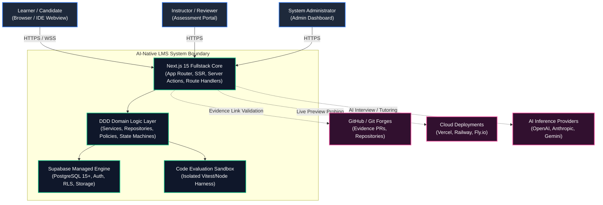
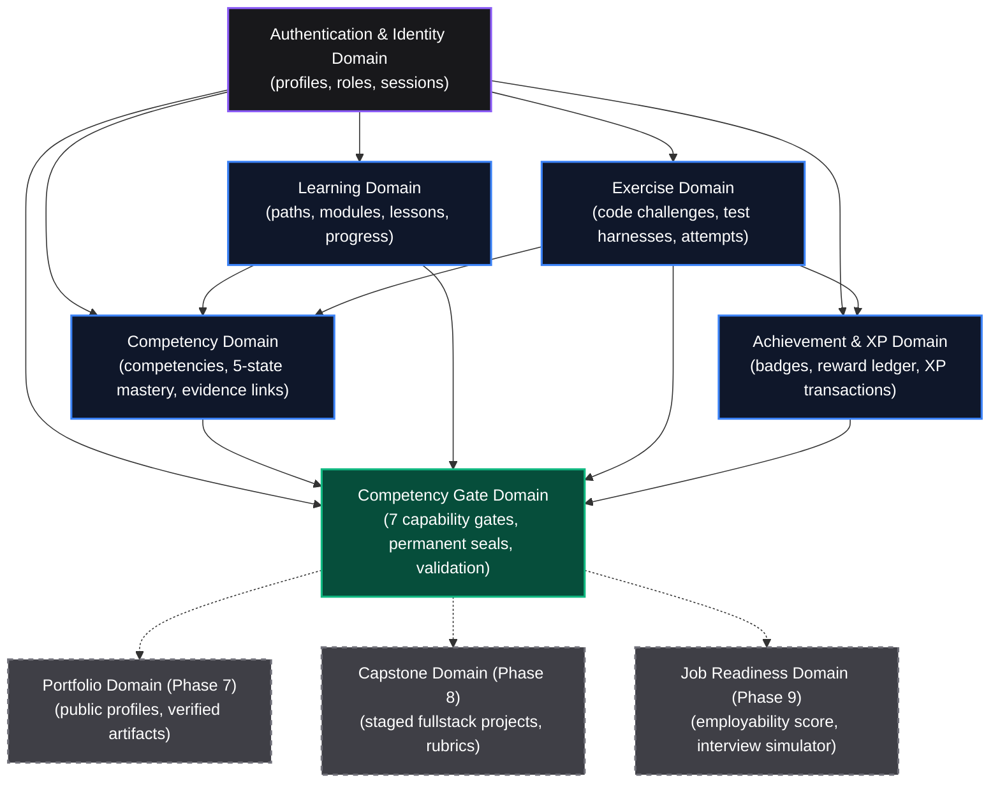
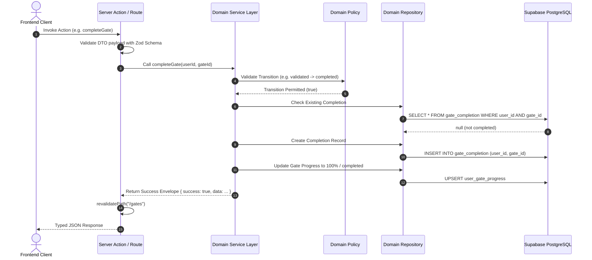
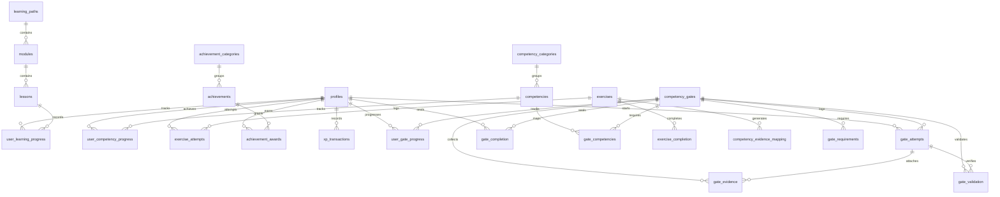
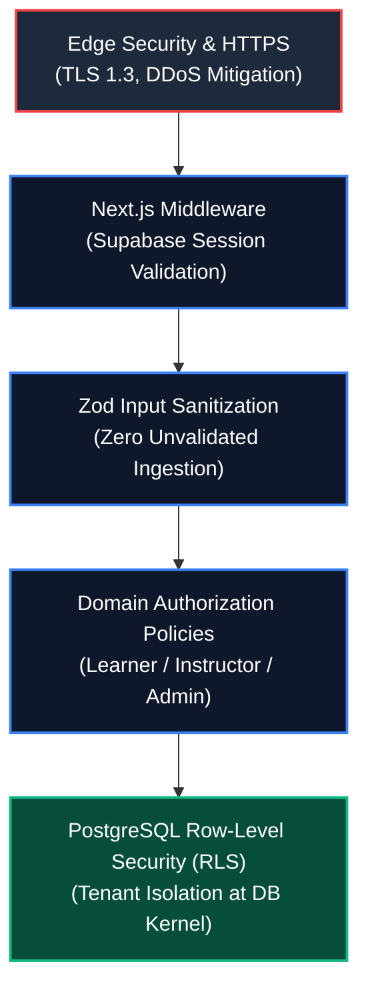
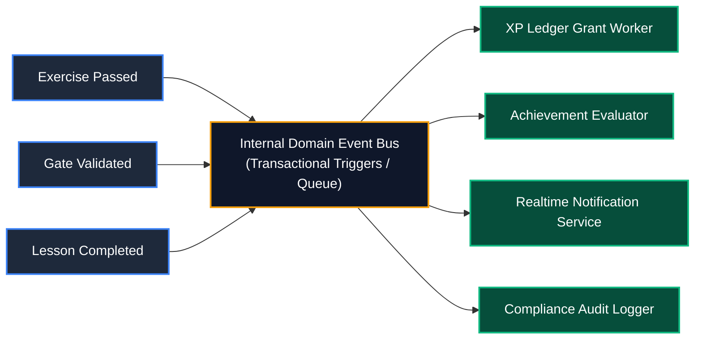
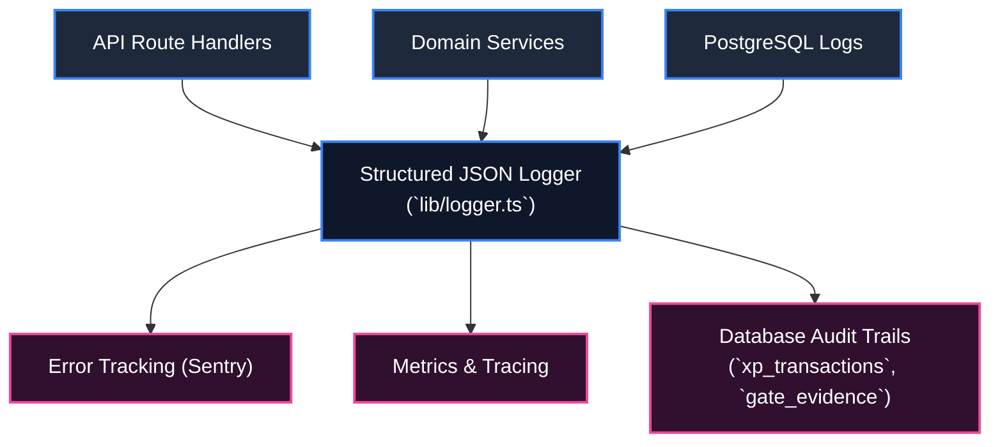

# System Architecture Document (SAD)
# AI-Native Software Engineering LMS & Mastery Learning Platform

**Document Version:** 1.0.0  
**Status:** Approved / Authoritative Engineering Baseline  
**Classification:** Core System Architecture  
**Author:** Principal Software Architect & Lead Systems Engineering Working Group  
**Target Repository:** `ai-native-lms`

---

## Table of Contents

1. [Executive Summary](#1-executive-summary)
2. [System Context](#2-system-context)
3. [Domain Architecture](#3-domain-architecture)
4. [Bounded Contexts](#4-bounded-contexts)
5. [Component Architecture](#5-component-architecture)
6. [Frontend Architecture](#6-frontend-architecture)
7. [Backend Architecture](#7-backend-architecture)
8. [Database Architecture](#8-database-architecture)
9. [API Architecture](#9-api-architecture)
10. [Security Architecture](#10-security-architecture)
11. [Event Architecture](#11-event-architecture)
12. [Scalability Strategy](#12-scalability-strategy)
13. [Reliability Strategy](#13-reliability-strategy)
14. [Observability Strategy](#14-observability-strategy)
15. [Deployment Strategy](#15-deployment-strategy)

---

## 1. Executive Summary

The **AI-Native Software Engineering LMS** is a modern, modular, cloud-native learning and assessment platform. Designed from first principles around **Domain-Driven Design (DDD)** and **Evidence-Based Mastery Learning**, the platform eliminates vanity progress metrics in technical education.

### Architectural Core Pillars:
- **Strict Bounded Context Isolation**: Domain business logic is encapsulated in `domains/*`, eliminating cross-domain database mutations and spaghetti coupling.
- **Permanent Mastery Checkpoints**: Finite State Machines govern progress through 7 progressive capability gates, requiring auditable evidence before permanent sealing.
- **Unified TypeScript Fullstack**: Built with Next.js 15 (App Router), React 19, Tailwind CSS, and Supabase (PostgreSQL 15+), sharing type-safe schema contracts across client, server, and database layers.
- **Zero-Trust Security**: 100% of database tables are governed by PostgreSQL Row-Level Security (RLS) policies, ensuring ironclad multi-tenant data isolation.

---

## 2. System Context

The platform interfaces with learners, instructors, administrators, automated code execution sandboxes, and third-party developer toolchains.



---

## 3. Domain Architecture

The platform is partitioned into autonomous bounded contexts following Domain-Driven Design (DDD) principles. Every domain exposes a public API contract through its service layer and enforces strict internal encapsulation.



---

## 4. Bounded Contexts

Each bounded context maintains its own distinct domain models, repositories, business policies, services, and validation schemas:

| Bounded Context | Root Path | Primary Entities | Key Domain Invariants |
| :--- | :--- | :--- | :--- |
| **Auth & Identity** | `domains/auth/` | `Profile`, `UserSession`, `Role` | Roles (`learner`, `instructor`, `admin`) strictly constrain mutation capabilities. |
| **Learning** | `domains/learning/` | `LearningPath`, `Module`, `Lesson`, `LearningProgress` | Linear sequencing within modules; progress state transitions are idempotent. |
| **Competency** | `domains/competencies/` | `Competency`, `CompetencyCategory`, `UserCompetencyProgress` | 5-state mastery progression (`not_started` &rarr; `mastered`); state increases require validated exercise/gate evidence. |
| **Exercise** | `domains/exercises/` | `Exercise`, `ExerciseAttempt`, `ExerciseCompletion` | Submissions evaluated against deterministic test suites; attempts are immutable. |
| **Achievement & XP** | `domains/achievement/` | `Achievement`, `AchievementAward`, `XPBalance`, `XPTransaction` | Double-entry style append-only transaction ledger; balances are derived and verifiable. |
| **Competency Gates** | `domains/gates/` | `CompetencyGate`, `GateRequirement`, `GateAttempt`, `GateEvidence`, `GateValidation`, `GateCompletion` | 6-state finite state machine; completed gates are sealed permanently with 0 outgoing transitions; `UNIQUE(user_id, gate_id)`. |

---

## 5. Component Architecture

The software architecture follows a clean 4-tier layered architecture:

```
┌────────────────────────────────────────────────────────────────────────┐
│                        PRESENTATION LAYER                              │
│   Next.js App Router Pages (`app/*`) & React Server/Client Components  │
│   Feature Components, Zustand Client Stores & Custom React Hooks       │
└───────────────────────────────────┬────────────────────────────────────┘
                                    │
                                    ▼
┌────────────────────────────────────────────────────────────────────────┐
│                        APPLICATION / API LAYER                         │
│   Next.js Server Actions (`features/*/actions/*`)                      │
│   REST Route Handlers (`app/api/*`)                                    │
│   Zod Input Validation Schemas & Response Serializers                  │
└───────────────────────────────────┬────────────────────────────────────┘
                                    │
                                    ▼
┌────────────────────────────────────────────────────────────────────────┐
│                          DOMAIN LOGIC LAYER                            │
│   Domain Services (`domains/*/services/*`)                             │
│   Domain Authorization & State Machine Policies (`domains/*/policies`) │
│   Domain Models & Data Transfer Objects (`domains/*/dto`)              │
└───────────────────────────────────┬────────────────────────────────────┘
                                    │
                                    ▼
┌────────────────────────────────────────────────────────────────────────┐
│                         INFRASTRUCTURE LAYER                           │
│   Domain Repositories (`domains/*/repositories/*`)                     │
│   Supabase Client / Server SDK (`lib/supabase/*`)                      │
│   PostgreSQL 15+ Database with Row-Level Security (RLS)                │
└────────────────────────────────────────────────────────────────────────┘
```

---

## 6. Frontend Architecture

The frontend is structured around **Feature-Driven Architecture** colocated under `features/`:

```
features/
├── auth/           # Login, registration, profile settings
├── learning/       # Path viewer, module navigator, lesson MDX reader
├── competencies/   # Competency radar, category filters, mastery badges
├── exercises/      # Code sandbox, terminal runner, test feedback
├── achievements/   # Badge catalogue, XP balance widget, reward modal
└── gates/          # 7-level mastery roadmap, gate cards, evidence modal
```

### Frontend Technical Standards:
1. **Hybrid Rendering Strategy**:
   - Static/SSR for marketing, syllabus, and lesson overviews (`force-dynamic` / incremental revalidation where appropriate).
   - Client components (`"use client"`) for interactive editors, state machine action buttons, and modal dialogs.
2. **State Management**:
   - Server State: Managed via Next.js Server Actions with granular cache revalidation (`revalidatePath`).
   - UI State: Isolated per-feature Zustand stores (e.g. `useGateStore`, `useAchievementStore`, `useXPStore`).
   - Data Fetching Hooks: Custom React hooks implementing standard `ignore` cleanup lifecycles to prevent memory leaks and setState-in-effect issues.
3. **Design System**:
   - Dark theme curated HSL color tokens (`card`, `primary`, `accent`, `muted`).
   - Tailwind CSS utility styling with glassmorphism overlays and micro-animations.

---

## 7. Backend Architecture

The backend domain services encapsulate all business rules, orchestration, and transactional invariants:



---

## 8. Database Architecture

The data layer uses **PostgreSQL 15+** managed by Supabase, enforcing schema constraints, relational integrity, and Row-Level Security.

### Entity-Relationship Diagram (ERD)



---

## 9. API Architecture

The API exposes a unified REST and Server Action interface utilizing standardized envelopes:

### Standardized API Envelope Formats

```typescript
// Success Response Envelope
export interface ApiResponse<T> {
  success: true;
  data: T;
  meta?: {
    page?: number;
    limit?: number;
    total?: number;
  };
}

// Error Response Envelope
export interface ApiErrorResponse {
  success: false;
  error: string;
  code?: string;
  details?: Record<string, unknown>;
}
```

### Route Catalogue Summary:
- **Auth**: `/api/auth/callback`, `/api/auth/session`
- **Learning**: `GET /api/paths`, `GET /api/paths/[slug]`, `POST /api/learning/progress`
- **Competencies**: `GET /api/competencies`, `GET /api/users/me/competencies`
- **Exercises**: `GET /api/exercises`, `POST /api/exercises/[id]/attempt`, `POST /api/exercises/[id]/submit`
- **Achievements & XP**: `GET /api/achievements`, `GET /api/users/me/achievements`, `GET /api/users/me/xp/balance`, `GET /api/users/me/xp/transactions`
- **Competency Gates**: `GET /api/gates`, `GET /api/gates/[id]`, `GET /api/users/me/gates`, `POST /api/gates/[id]/attempt`, `POST /api/gates/[id]/evidence`, `POST /api/gates/[id]/validate`, `POST /api/gates/[id]/complete`

---

## 10. Security Architecture

Security is architected in depth across all layers:



### Security Safeguards:
1. **Row-Level Security (RLS)**: Enforced on all 18 tables. Learners can only read/write their own records (`auth.uid() = user_id`), while instructors and admins have elevated evaluation privileges.
2. **Secret Isolation**: `SUPABASE_SERVICE_ROLE_KEY` is strictly confined to server-side environments and never leaked to the client bundle.
3. **Session Management**: Supabase SSR cookie-based authentication with automatic refresh token rotation.

---

## 11. Event Architecture

The platform uses asynchronous event decoupling for non-critical path operations (XP awards, badge notifications, audit logging):



---

## 12. Scalability Strategy

1. **Stateless Compute**: Next.js server instances run statelessly on serverless/edge infrastructure, scaling horizontally based on request volume.
2. **Database Connection Pooling**: Supavisor / pgBouncer manages connection pooling to maintain stable database performance under concurrent loads.
3. **Optimized Read Queries**: Composite B-tree indexes applied on high-frequency query vectors (`(user_id, gate_id)`, `(user_id, status)`).
4. **Static & Cached Assets**: MDX lesson content and static curriculum metadata cached at CDN edge with on-demand tag revalidation.

---

## 13. Reliability Strategy

1. **ACID Transaction Guarantees**: Multi-table state mutations (e.g. gate validation & completion) execute within single transactional boundaries.
2. **Idempotent Operations**: Progress updates and XP transactions are guarded by idempotency keys and unique database constraints.
3. **Zero-Regression Continuous Testing**: All pull requests must pass 100% of unit, integration, and policy test suites (`npx vitest run`) before merge.
4. **Graceful Degradation**: Interactive sandboxes isolate execution errors without crashing the parent learning interface.

---

## 14. Observability Strategy



---

## 15. Deployment Strategy

The application follows an automated **Continuous Delivery (CD)** pipeline using Trunk-Based Development:


---

## 16. Architectural Governance & Invariants

1. **Domain Immutability**: Certified domains (Auth, Learning, Competencies, Exercises, Achievements & XP, Gates) must not have their core invariants or schemas arbitrarily modified.
2. **Contract-First Development**: Any new domain or feature must define its Zod schemas, TypeScript types, and database migration before application code is written.
3. **Auditability by Default**: All score updates, gate completions, and XP awards must write an immutable audit record to the datastore.
