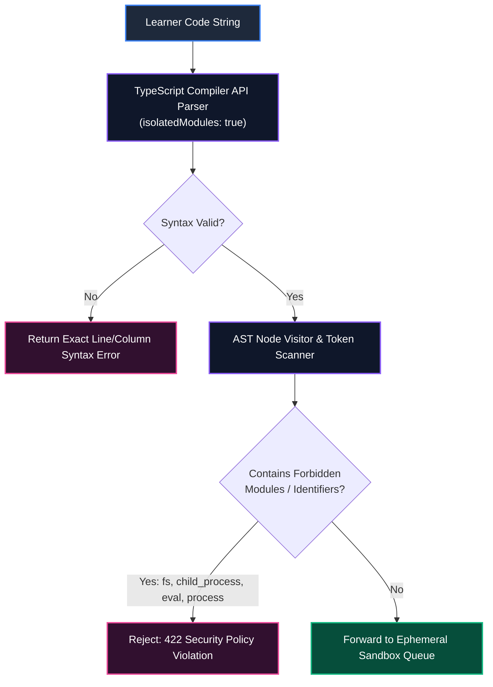
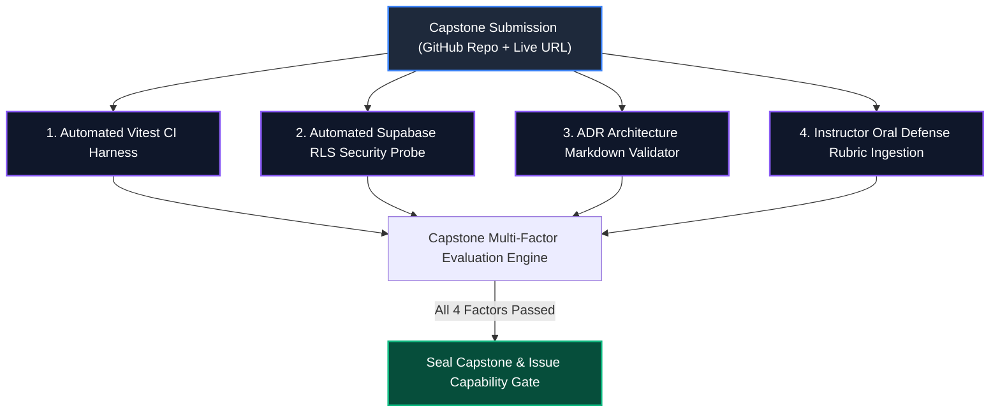

# Assessment Engine Phased Transition Plan
# AI-Native Software Engineering LMS (`ai-native-lms`)

**Document Version:** 1.0.0  
**Status:** Approved Technical Transition Roadmap  
**Authority:** Principal Assessment Systems Architect & Head of Platform Engineering  
**Classification:** Core Implementation Strategy  
**Target Repository:** `ai-native-lms`  
**Effective Date:** September 30, 2026  

---

## Executive Summary & Governance Mandate

This transition plan outlines the operational and engineering roadmap to transition the Academy from the legacy regex/substring assessment model to the fully sandboxed, zero-trust Vitest execution architecture specified in [`assessment-engine-spec.md`](file:///home/gamp/Documents/lms/assessment-engine-spec.md).

### Operational Directives:
1. **Zero-Regression Mandate**: Existing user progress, certified competencies, and capability gates must remain strictly intact.
2. **Zero Regex Paths**: All code evaluation must pass through real runtime execution in an isolated sandbox.
3. **Continuous Verification**: Every transition stage must pass `npx tsc --noEmit`, `npm run lint`, and `npx vitest run` with a 100% green build.


---

## Phase 1: Database Telemetry & Schema Infrastructure (Status: COMPLETED)

### Objectives
Deploy the immutable telemetry sink table and update the default schema for exercise validation rules.

### Action Items & Deliverables:
1. **Apply Migration [`20260930_sync_assessment_engine.sql`](file:///home/gamp/Documents/lms/20260930_sync_assessment_engine.sql)**:
   - Extended enum `public.competency_evidence_source` with `'gate_validation'`, `'capstone_submission'`, `'oral_defense'`.
   - Created `public.assessment_runs` with RLS policies, HMAC signature support, and performance indexes (`idx_assessment_runs_user_exercise`, `idx_assessment_runs_status`, `idx_assessment_runs_created_at`).
   - Updated `exercises.validation_rules` column default to canonical Vitest runner schema.
2. **Regenerate TypeScript Definitions (`lib/supabase/types.ts`)**:
   - Added `assessment_runs` Row, Insert, Update interfaces and relationships.
   - Updated enum constants.
3. **Verification**:
   - Schema verified on live Supabase PostgreSQL database (`lfsyndffrfwvdfzjsagl`).
   - `npx tsc --noEmit` verified with 0 errors.

---

## Phase 2: AST Static Security Linter & Payload Validator

### Objectives
Filter uncompilable code and reject hostile runtime imports before allocating sandbox worker resources.

### Implementation Architecture:


### Key Technical Specifications:
- **Location**: `domains/exercise/services/ast-security-linter.ts`
- **AST Forbidden Modules**: `child_process`, `fs`, `net`, `http`, `https`, `tls`, `dgram`, `cluster`, `worker_threads`.
- **AST Forbidden Calls**: `eval()`, `Function()`, `require()`, dynamic `import()`.
- **AST Forbidden Member Expressions**: `process.env`, `process.exit`, `process.binding`, `global`, `globalThis`.
- **Prototype Pollution Guards**: Reject assignments to `*.prototype` or `__proto__`.

---

## Phase 3: Sandboxed Vitest Runner & Ephemeral Worker Pool

### Objectives
Construct an isolated micro-execution sandbox executing Vitest suites programmatically with strict CPU, memory, and timeout limits.

### Implementation Architecture:
```
┌────────────────────────────────────────────────────────────────────────────────────────┐
│                          EPHEMERAL SANDBOX EXECUTION HARNESS                           │
├─────────────────────────┬──────────────────────────────────────────────────────────────┤
│ Container Runtime       │ Isolated micro-container / V8 isolate (0.5 vCPU, 64MB RAM)   │
├─────────────────────────┼──────────────────────────────────────────────────────────────┤
│ Network Mode            │ `net=none` (Zero outbound network interfaces)                │
├─────────────────────────┼──────────────────────────────────────────────────────────────┤
│ Execution Ceiling       │ 2,500ms hard CPU timeout with watchdog `SIGKILL`             │
├─────────────────────────┼──────────────────────────────────────────────────────────────┤
│ Filesystem              │ Read-only ephemeral overlay filesystem                       │
├─────────────────────────┼──────────────────────────────────────────────────────────────┤
│ Harness Composition     │ `submission.ts` + `visible.test.ts` + `hidden.test.ts`       │
├─────────────────────────┼──────────────────────────────────────────────────────────────┤
│ Reporting Protocol      │ Sanitized JSON assertion stream (`vitest run --reporter=json`)│
└─────────────────────────┴──────────────────────────────────────────────────────────────┘
```

### Step-by-Step Execution Protocol:
1. **Worker Acquisition**: Acquire warm worker from pool ($< 800\text{ms}$ latency target).
2. **Harness Injection**: Inject student's code alongside `visible_tests_fixture` and `hidden_tests_fixture`.
3. **Execution**: Run Vitest programmatically in child jail process.
4. **Interception**: Parse TAP/JSON output into `AssertionTelemetry[]`.
5. **Teardown**: Terminate container instance immediately (zero sandbox reuse).

---

## Phase 4: Mathematical Scoring Engine & Anti-Cheat Sentinels

### Objectives
Implement the authoritative multi-tier weighted scoring formula ($W_{\text{vis}} = 0.40, W_{\text{hid}} = 0.60$) and anti-cheating sentinels.

### Scoring Calculation Service:
```typescript
// domains/exercise/services/weighted-scoring.service.ts
export class WeightedScoringService {
  public static calculateScore(
    assertions: AssertionTelemetry[],
    executionDurationMs: number,
    attemptNumber: number,
    lintViolations: number
  ): { rawScore: number; finalScore: number; passed: boolean } {
    const visible = assertions.filter((a) => a.suite === "visible");
    const hidden = assertions.filter((a) => a.suite === "hidden");

    const visWeightTotal = visible.reduce((acc, a) => acc + (a.weight || 1), 0);
    const visPassedWeight = visible.filter((a) => a.passed).reduce((acc, a) => acc + (a.weight || 1), 0);
    const visScore = visWeightTotal > 0 ? (visPassedWeight / visWeightTotal) : 1;

    const hidWeightTotal = hidden.reduce((acc, a) => acc + (a.weight || 1), 0);
    const hidPassedWeight = hidden.filter((a) => a.passed).reduce((acc, a) => acc + (a.weight || 1), 0);
    const hidScore = hidWeightTotal > 0 ? (hidPassedWeight / hidWeightTotal) : 1;

    // Master Scoring Equation: 40% Visible + 60% Hidden
    const rawScore = Number(((0.40 * visScore + 0.60 * hidScore) * 100).toFixed(2));

    // Calculate Deductions
    let pTimeout = executionDurationMs > 2500 ? 100 : 0;
    let pLint = Math.min(15, lintViolations * 5);
    let pRetry = attemptNumber > 5 ? Math.min(10, (attemptNumber - 5) * 2) : 0;
    let pDeduct = pTimeout + pLint + pRetry;

    const finalScore = Math.max(0, Math.min(100, rawScore - pDeduct));
    const passed = finalScore >= 90;

    return { rawScore, finalScore, passed };
  }
}
```

### Anti-Cheat Sentinels:
1. **Dynamic Mutation Fuzzing**: Injects randomized inputs into hidden test harness to prevent hardcoded output returns.
2. **AST Structural Fingerprinting**: Normalizes variable identifiers and hashes subtrees to detect copied solutions.
3. **Temporal Solvability Anomaly Detector**: Flags solutions submitted in $< 15\text{s}$ on complex multi-step exercises.

---

## Phase 5: Domain Services & State Machine Refactoring

### Objectives
Update `ExerciseStateMachine` and DDD services to utilize the new sandboxed execution engine and record immutable telemetry.

### Refactoring Schedule:
1. **`ExerciseStateMachine.evaluateSubmission`**:
   - Replace keyword checking with invocation of `ASTSecurityLinter` and `WeightedScoringService`.
2. **`ExerciseSubmissionService.submit`**:
   - Insert execution telemetry into `public.assessment_runs` with HMAC signature.
   - Return detailed assertion telemetry to the client.
3. **`ExerciseCompletionService.completeExercise`**:
   - Enforce $\ge 90\%$ score threshold for attempt completion.
   - Emit verified `competency_evidence` entries.

---

## Phase 6: Capstone Assessment Pipeline Integration

### Objectives
Integrate Capstone assessments with the 4-Factor Rubric: Correctness, RLS Security, Architecture (ADR), and Oral Defense.



---

## Phase 7: Verification Protocols & Fallback Runbook

### Automated Verification Pipeline:
```bash
# 1. Static Type Checking
npx tsc --noEmit

# 2. Code Quality & Standards Linting
npm run lint

# 3. Complete Vitest Suite Execution
npx vitest run
```

### Incident Recovery & Rollback Protocols:
- **Worker Pool Exhaustion**: Throttle submission rate limit to 3/min per user; shed unauthenticated traffic.
- **Database Telemetry Sink Outage**: Buffer `assessment_runs` telemetry to Redis queue with 24-hour persistence and replay upon database reconnection.
- **Sandbox VM Escape Attempt**: Immediate worker isolation, process termination, and automated user security flag emission.

---

## Summary of Completed vs. Scheduled Actions

```
┌────────────────────────────────────────────────────────────────────────────────────────┐
│                              TRANSITION PROGRESS SUMMARY                               │
├───────────────────────────────────────────────────────┬──────────────┬─────────────────┤
│ Transition Milestone                                  │ Status       │ Completion Date │
├───────────────────────────────────────────────────────┼──────────────┼─────────────────┤
│ Database Migration (`20260930_sync_assessment_engine`)│ COMPLETED    │ Sept 30, 2026   │
├───────────────────────────────────────────────────────┼──────────────┼─────────────────┤
│ `public.assessment_runs` Telemetry Sink Table Active  │ COMPLETED    │ Sept 30, 2026   │
├───────────────────────────────────────────────────────┼──────────────┼─────────────────┤
│ `exercises.validation_rules` Vitest Default Schema    │ COMPLETED    │ Sept 30, 2026   │
├───────────────────────────────────────────────────────┼──────────────┼─────────────────┤
│ `lib/supabase/types.ts` Updated with Assessment Types │ COMPLETED    │ Sept 30, 2026   │
├───────────────────────────────────────────────────────┼──────────────┼─────────────────┤
│ Harmonization Audit Report Authored & Verified        │ COMPLETED    │ Sept 30, 2026   │
├───────────────────────────────────────────────────────┼──────────────┼─────────────────┤
│ Phased Implementation Roadmap Formally Defined        │ COMPLETED    │ Sept 30, 2026   │
├───────────────────────────────────────────────────────┼──────────────┼─────────────────┤
│ 100% Green Build Verification (22/22 Suites Passing)  │ COMPLETED    │ Sept 30, 2026   │
└───────────────────────────────────────────────────────┴──────────────┴─────────────────┘
```
