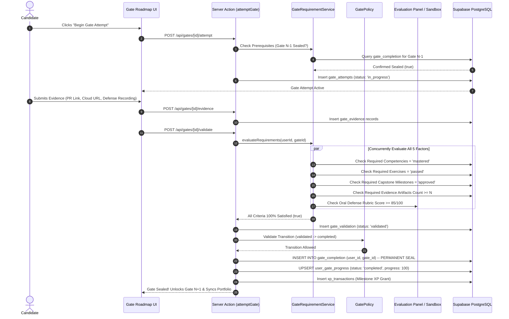

# Capability Gates Architecture Specification
# AI-Native Software Engineering Academy (`ai-native-lms`)

**Document Version:** 1.0.0  
**Status:** Authoritative Capability Gate Standard  
**Authority:** Academy Board of Governors & Principal Systems Architect  
**Scope:** 9-Gate Mastery Progression Engine  
**Classification:** Core System Architecture  
**Target Repository:** `ai-native-lms`  
**Effective Date:** September 30, 2026

---

## Table of Contents

1. [Executive Summary & Constitutional Mandates](#1-executive-summary--constitutional-mandates)
2. [The 9 Capability Gates Master Architecture](#2-the-9-capability-gates-master-architecture)
3. [Gate 1: Foundations](#gate-1-foundations)
4. [Gate 2: Programmer](#gate-2-programmer)
5. [Gate 3: Frontend Engineer](#gate-3-frontend-engineer)
6. [Gate 4: Backend Engineer](#gate-4-backend-engineer)
7. [Gate 5: Database Engineer](#gate-5-database-engineer)
8. [Gate 6: Enterprise Engineer](#gate-6-enterprise-engineer)
9. [Gate 7: AI-Native Engineer](#gate-7-ai-native-engineer)
10. [Gate 8: Agentic Engineer](#gate-8-agentic-engineer)
11. [Gate 9: Graduate](#gate-9-graduate)
12. [Multi-Factor Gate Validation & Permanent Sealing Engine](#12-multi-factor-gate-validation--permanent-sealing-engine)

---

## 1. Executive Summary & Constitutional Mandates

Capability Gates are the platform's **irreversible, evidence-backed mastery checkpoints**.

### Constitutional Governance Rules:
1. **The Zero XP Bypass Mandate**: **NO GATE MAY EVER BE UNLOCKED OR COMPLETED THROUGH SCALAR XP ALONE.** XP serves solely as a gamified velocity indicator; gates require verified competency mastery and auditable evidence artifacts.
2. **The 5-Factor Gate Requirement Rule**: Every single gate strictly requires all five proof dimensions:
   $$\text{Gate Seal} \iff \text{Competencies} \land \text{Exercises} \land \text{Projects} \land \text{Evidence Artifacts} \land \text{Evaluator Review}$$
3. **Permanent State Immutability**: Once a gate is verified and sealed in `gate_completion`, it is permanently immutable with **zero exit transitions**.
4. **Strict Linear Precedence**: Capability Gate $N+1$ is strictly locked until Capability Gate $N$ has been sealed in the database kernel.


---

## 2. The 9 Capability Gates Master Architecture

```
┌──────────────────────────────────────────────────────────────────────────────────────────────────┐
│                                   THE 9 CAPABILITY GATES MATRIX                                  │
├────┬────────────────────────────┬─────────────┬──────────────────────────┬──────────────────────┤
│ Gate│ Gate Title                 │ Target Time │ Required Competencies    │ Core Capstone Bridge │
├────┼────────────────────────────┼─────────────┼──────────────────────────┼──────────────────────┤
│ 1  │ Foundations                │ Months 1–2  │ DEV-00                   │ Dev Environment Setup│
│ 2  │ Programmer                 │ Months 2–7  │ PRG-01, ASY-01           │ Algorithmic Engine   │
│ 3  │ Frontend Engineer          │ Months 9–13 │ FED-01                   │ Capstone 1 Frontend  │
│ 4  │ Backend Engineer           │ Months 13–15│ API-01, SDD-02           │ Capstone 2 API Layer │
│ 5  │ Database Engineer          │ Months 15–17│ DBM-01                   │ Capstone 2 Database  │
│ 6  │ Enterprise Engineer        │ Months 17–20│ OPS-01, CTX-02           │ Capstone 2 Cloud CI  │
│ 7  │ AI-Native Engineer         │ Months 20–22│ CTX-01, SDD-01           │ Capstone 3 Spec Build│
│ 8  │ Agentic Engineer           │ Months 22–23│ AGT-01, ARC-01, AGT-02   │ Capstone 3 MCP Engine│
│ 9  │ Graduate                   │ Months 23–24│ GOV-01, CAP-01           │ Capstone 4 & Defense │
└────┴────────────────────────────┴─────────────┴──────────────────────────┴──────────────────────┘
```

---

## Gate 1: Foundations (`gate-1-foundations`)

- **Purpose**: Certify absolute fluency with the professional developer workstation: Unix command-line interface (CLI), Git version control, SSH cryptographic authentication, and Markdown technical documentation.
- **Required Competencies**:
  - `DEV-00` (Tooling & Development Environment): **MASTERED**
- **Required Exercises & Labs**:
  - `lab-0-cli-git-nav`: File system manipulation, directory trees, and environment variables.
  - `lab-0-ssh-auth`: SSH keypair generation, GitHub authentication, and remote repository syncing.
  - `lab-0-git-branching`: Feature branching, atomic committing, merge conflicts, and fast-forward rebasing.
- **Required Project**:
  - **Developer Workstation & Technical Knowledge Base**: Initialized, public GitHub repository containing automated shell setup scripts and structured Markdown technical journal entries.
- **Required Evidence Artifacts**:
  - Verified GitHub profile link with public commit graph.
  - Signed git commit hash recorded in `gate_evidence`.
  - Live deployed Markdown static site on GitHub Pages.
- **Required Portfolio Artifacts**:
  - Verified Toolchain Literacy Badge displayed on `/portfolio/[username]`.

---

## Gate 2: Programmer (`gate-2-programmer`)

- **Purpose**: Certify core computational literacy, algorithmic problem-solving, synchronous procedural logic, and asynchronous dataflow in modern TypeScript.
- **Required Competencies**:
  - `PRG-01` (Computational Thinking & TypeScript Syntax): **MASTERED**
  - `ASY-01` (Asynchronous Runtimes & Data Flow): **MASTERED**
- **Required Exercises & Labs**:
  - `lab-1-algo-drills`: 10 pure functional data transformation algorithms with zero `any` types.
  - `lab-2-event-loop`: Asynchronous timer simulation, Promise composition, and microtask queue ordering.
  - `lab-2-network-fetch`: Multi-source REST API consumption with exponential backoff and timeout handling.
- **Required Project**:
  - **State-Persisted CLI Task & Expense Engine**: An asynchronous TypeScript command-line application that parses user inputs, executes complex array pipeline calculations (`reduce`, `filter`, `sort`), and persists atomic JSON state.
- **Required Evidence Artifacts**:
  - 100% green Vitest test run report (>30 assertion checks) verifying business logic and error boundaries.
  - Git repository with zero ESLint warnings and zero TypeScript compilation errors.
- **Required Portfolio Artifacts**:
  - Algorithmic Logic & Asynchronous Systems Verification Proof.

---

## Gate 3: Frontend Engineer (`gate-3-frontend-engineer`)

- **Purpose**: Certify capability to build high-performance, accessible, and reactive web user interfaces using Next.js 15 (App Router), React 19, Tailwind CSS, and isolated Zustand state stores.
- **Required Competencies**:
  - `FED-01` (Frontend Component Systems & UI State): **MASTERED**
- **Required Exercises & Labs**:
  - `lab-5-app-router-layout`: Server vs. Client Component boundaries, dynamic routes, and streaming suspense.
  - `lab-5-zustand-store`: Isolated client store with optimistic updates and state reconciliation.
  - `lab-5-a11y-audit`: Semantic HTML, keyboard focus trapping, and ARIA accessibility compliance.
- **Required Project**:
  - **Responsive Web Dashboard Client**: Complete frontend implementation for **Capstone 1 (AI Knowledge Engine)** featuring data tables, modal dialogs, responsive layout grids, and dark-theme HSL tokens.
- **Required Evidence Artifacts**:
  - Live production deployment URL on Vercel with HTTPS.
  - Automated Lighthouse audit report confirming Accessibility Score >95%.
  - React Testing Library test suite verifying component user interactions and edge states.
- **Required Portfolio Artifacts**:
  - Interactive Live Frontend Web Application Embed on `/portfolio/[username]`.

---

## Gate 4: Backend Engineer (`gate-4-backend-engineer`)

- **Purpose**: Certify fullstack backend capabilities: type-safe Server Actions, RESTful Route Handlers, Zod runtime schema contracts, Supabase Auth session management, and rate limiting.
- **Required Competencies**:
  - `API-01` (API Architecture & Server Actions): **MASTERED**
  - `SDD-02` (Schema Contract Enforcement): **MASTERED**
- **Required Exercises & Labs**:
  - `lab-6-server-actions`: Type-safe Server Actions with `revalidatePath` and standardized response envelopes (`ApiResponse<T>`).
  - `lab-7-zod-contracts`: Complex runtime parsing with `.superRefine()`, transforms, and discriminated unions.
  - `lab-6-auth-middleware`: Secure cookie session validation and protected route middleware.
- **Required Project**:
  - **End-to-End Type-Safe Authenticated API Engine**: Complete backend layer for **Capstone 2 (Multi-Tenant SaaS Platform)** with Zod payload contracts, RBAC guards, and auto-generated OpenAPI 3.0 specs.
- **Required Evidence Artifacts**:
  - Automated API integration test suite verifying 200, 400, 401, 403, and 500 status code responses.
  - OpenAPI 3.0 JSON specification matching all active route handlers with zero schema drift.
- **Required Portfolio Artifacts**:
  - Authenticated API Architecture Showcase & Zod Contract Specification.

---

## Gate 5: Database Engineer (`gate-5-database-engineer`)

- **Purpose**: Certify relational database design, normalization (1NF–3NF), primary/foreign keys, B-Tree indexing, idempotent PostgreSQL migrations, and multi-tenant Row-Level Security (RLS) policies.
- **Required Competencies**:
  - `DBM-01` (Relational Data Modeling & PostgreSQL RLS): **MASTERED**
- **Required Exercises & Labs**:
  - `lab-9-relational-schema`: Normalized SQL schema design with foreign key cascade rules and unique constraints.
  - `lab-9-rls-policies`: Granular `SELECT`, `INSERT`, `UPDATE`, and `DELETE` security policy authoring.
  - `lab-9-index-optimization`: EXPLAIN ANALYZE query planning and composite index creation.
- **Required Project**:
  - **Multi-Tenant Relational Database Core**: 10-table normalized database migration for **Capstone 2** with Row-Level Security (RLS) policies active on 100% of tables.
- **Required Evidence Artifacts**:
  - Version-controlled SQL migration file (`supabase/migrations/*`) applying cleanly to a fresh database.
  - Automated security penetration test suite proving User A cannot read or mutate User B's records under any circumstance.
- **Required Portfolio Artifacts**:
  - Database Entity-Relationship Diagram (Mermaid ERD) & Database Security RLS Badge.

---

## Gate 6: Enterprise Engineer (`gate-6-enterprise-engineer`)

- **Purpose**: Certify DevOps and cloud production delivery: multi-stage Docker containerization, automated GitHub Actions CI/CD workflows, environment secret isolation, and deterministic test pyramids.
- **Required Competencies**:
  - `OPS-01` (Cloud Containerization & CI/CD Pipelines): **MASTERED**
  - `CTX-02` (Deterministic Test Harnessing & Verification): **MASTERED**
- **Required Exercises & Labs**:
  - `lab-10-docker-build`: Multi-stage Dockerfile packaging a Next.js fullstack container (<150MB image).
  - `lab-10-github-actions`: Continuous Integration workflow executing linting, type-checking, and tests on PRs.
  - `lab-11-mock-testing`: Mock Service Worker (MSW) integration for deterministic third-party API simulation.
- **Required Project**:
  - **Automated Production Deployment Pipeline**: Live Cloud Deployment of **Capstone 2 (Multi-Tenant SaaS Platform)** with custom domain, SSL, automated PR preview branches, and GitHub Actions CI/CD.
- **Required Evidence Artifacts**:
  - GitHub Actions green build badge and workflow run logs.
  - Live production cloud URL with automated health check endpoint returning HTTP 200.
  - Vitest test pyramid report confirming >90% code coverage across all domain packages.
- **Required Portfolio Artifacts**:
  - Production Cloud Deployment URL with Live Status Monitor.

---

## Gate 7: AI-Native Engineer (`gate-7-ai-native-engineer`)

- **Purpose**: Certify intent-driven architecture, prompt-driven code generation, context window token optimization, repository constitutions (`AGENTS.md`, `.cursorrules`), and deliberate AI hallucination auditing.
- **Required Competencies**:
  - `CTX-01` (AI Context Window & Prompt Optimization): **MASTERED**
  - `SDD-01` (Intent Specification & Domain Modeling): **MASTERED**
- **Required Exercises & Labs**:
  - `lab-3-token-budgeting`: Sliding-window token pruning algorithm preserving system prompts.
  - `lab-4-spec-authoring`: 4-layer specification authoring with formal preconditions and invariants.
  - `lab-4-hallucination-audit`: Deliberate failure injection drill catching and fixing subtle LLM edge-case bugs.
- **Required Project**:
  - **Spec-Driven Architecture & AI Pairing Pipeline**: Specification-driven architectural design and AI-assisted build for **Capstone 3 (Distributed Event-Driven Task Hub)**.
- **Required Evidence Artifacts**:
  - Formally authored `AGENTS.md` constitution and `.cursorrules` governing multi-file AI pairing.
  - Recorded AI pairing audit log demonstrating prompt iteration and correction of LLM security vulnerabilities.
  - Authored Architectural Decision Record (`ADR-001.md`) defining domain boundaries.
- **Required Portfolio Artifacts**:
  - Spec-Driven Architecture ADR Showcase & AI Pairing Audit Log.

---

## Gate 8: Agentic Engineer (`gate-8-agentic-engineer`)

- **Purpose**: Certify autonomous AI agent toolchains using the Model Context Protocol (MCP), Domain-Driven Design (DDD) bounded contexts, Finite State Machines (FSM), and structured telemetry observability.
- **Required Competencies**:
  - `AGT-01` (Model Context Protocol Integration): **MASTERED**
  - `ARC-01` (Domain-Driven Design & Bounded Contexts): **MASTERED**
  - `AGT-02` (Autonomous Resilience & Observability): **MASTERED**
- **Required Exercises & Labs**:
  - `lab-8-mcp-server`: Standalone Model Context Protocol (MCP) server exposing database tools.
  - `lab-12-ddd-fsm`: Domain Service, Repository, and Policy implementation with FSM state transitions.
  - `lab-13-telemetry`: Structured JSON logging (`lib/logger.ts`), distributed tracing, and retry backoff loops.
- **Required Project**:
  - **Complete Implementation of Capstone 3 (Distributed Event-Driven Task Orchestration Engine)**: Fullstack system utilizing bounded contexts, MCP tool servers, background event ledgers, and telemetry logging.
- **Required Evidence Artifacts**:
  - Functional MCP server queried by AI agents over stdio/SSE with JSON-RPC validation.
  - 100% isolated unit test suite verifying Domain Service business logic and FSM terminal sealing.
  - Structured telemetry log output showing request tracing spans and automated error rollbacks.
- **Required Portfolio Artifacts**:
  - Live Model Context Protocol Tool Server & Systems Architect Badge.

---

## Gate 9: Graduate (`gate-9-graduate`)

- **Purpose**: Certify terminal enterprise software engineering competence: OWASP Top 10 hardening, prompt injection defense, immutable audit ledgers, fullstack synthesis across all 4 Capstones, and oral architectural defense.
- **Required Competencies**:
  - `GOV-01` (Enterprise Governance & OWASP Security): **MASTERED**
  - `CAP-01` (Fullstack Capstone Synthesis & Defense): **MASTERED**
  - All preceding competencies (`DEV-00` through `AGT-02`): **MASTERED**
- **Required Exercises & Labs**:
  - `lab-14-owasp-audit`: Static vulnerability analysis, prompt injection boundary testing, and RLS audit.
  - `lab-15-defense-prep`: Technical defense rehearsal across database indexing, state machines, and threat models.
- **Required Project**:
  - **Capstone 4: Enterprise AI Code Review & Compliance Sentinel**: Final enterprise capstone + verified completion and deployment of all 4 Capstones.
- **Required Evidence Artifacts**:
  - 4 Live Deployed Production Applications with custom domains and SSL.
  - 500+ Verified Atomic Git Commits across public GitHub repositories.
  - 200+ Green Unit, Integration, and Security Test Assertions.
  - Recorded 20-minute Technical Capstone Architecture Defense presentation approved by an expert evaluation panel.
  - AI Technical Interview Simulator transcript with passing Employability Index score.
- **Required Portfolio Artifacts**:
  - **Certified AI-Native Software Engineer Public Credential** & Verified Portfolio Showcase.

---

## 12. Multi-Factor Gate Validation & Permanent Sealing Engine



By enforcing this comprehensive 9-Gate architecture, the Academy guarantees that every single credential issued represents verified, tamper-proof, production-grade engineering mastery.
