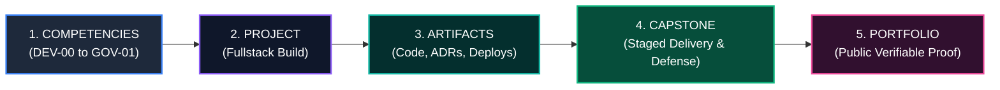
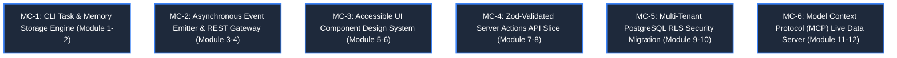
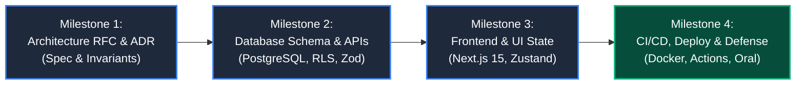
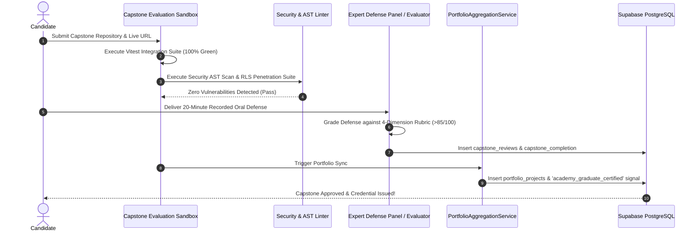

# The Capstone System Architecture Specification
# AI-Native Software Engineering Academy (`ai-native-lms`)

**Document Version:** 1.0.0  
**Status:** Authoritative Capstone System Standard  
**Authority:** Academy Systems Architect, Head of Engineering & Capstone Defense Board  
**Scope:** 3-Tier Capstone Architecture (Module, Phase & Graduation Capstones)  
**Target Repository:** `ai-native-lms`  
**Classification:** Core System Architecture  
**Effective Date:** September 30, 2026

---

## Table of Contents

1. [Executive Summary & Core Capstone Philosophy](#1-executive-summary--core-capstone-philosophy)
2. [The 3-Tier Capstone Hierarchy](#2-the-3-tier-capstone-hierarchy)
3. [Module Capstones Catalogue](#3-module-capstones-catalogue)
4. [Phase Capstones Catalogue](#4-phase-capstones-catalogue)
5. [The Graduation Capstone (Enterprise Sentinel)](#5-the-graduation-capstone-enterprise-sentinel)
6. [The 4-Milestone Staged Deliverable Protocol](#6-the-4-milestone-staged-deliverable-protocol)
7. [Evaluation Engine & Defense Panel Protocol](#7-evaluation-engine--defense-panel-protocol)
8. [Master End-to-End Traceability Mapping](#8-master-end-to-end-traceability-mapping)

---

## 1. Executive Summary & Core Capstone Philosophy

The **Capstone System** is the synthesis and validation engine of the Academy.

In technical education, isolated drills and single-file exercises verify syntax familiarity, but **only end-to-end capstone projects prove true software engineering competence**. 

Every capstone in the Academy is designed to fulfill three mandatory constitutional requirements:
1. **Validate Specific Competencies**: Directly exercise and upgrade mapped competencies to the `MASTERED` state.
2. **Produce Verifiable Portfolio Evidence**: Generate auditable digital artifacts (git commits, architecture ADRs, live cloud deployments, test reports).
3. **Generate High-Confidence Hiring Signals**: Emit algorithmic hiring signals (`gate_completed`, `production_deployed`, `architecture_defended`) for partner recruiters and hiring managers.



---

## 2. The 3-Tier Capstone Hierarchy

The curriculum organizes capstones into three distinct tiers based on scope, integration depth, and evaluation rigor:

```
┌──────────────────────────────────────────────────────────────────────────────────────────────────┐
│                                   THE 3-TIER CAPSTONE HIERARCHY                                  │
├──────────────┬───────────────────┬──────────────┬────────────────────────┬───────────────────────┤
│ Tier         │ Scope & Duration  │ Evaluator    │ Primary Purpose        │ Target Milestone      │
├──────────────┼───────────────────┼──────────────┼────────────────────────┼───────────────────────┤
│ Tier 1:      │ 1–2 Weeks         │ Automated    │ Modular Synthesis:     │ Unlocks Next Module   │
│ Module       │ (10–20 Hours)     │ Vitest VM    │ Validates specific     │ Cluster               │
│ Capstones    │                   │ Runner       │ atomic skill pairs.    │                       │
├──────────────┼───────────────────┼──────────────┼────────────────────────┼───────────────────────┤
│ Tier 2:      │ 3–4 Weeks         │ Automated +  │ System Integration:    │ Unlocks Major         │
│ Phase        │ (30–50 Hours)     │ Peer Code    │ End-to-end fullstack   │ Capability Gates      │
│ Capstones    │                   │ Review       │ applications.          │ (Gates 2, 4, 5, 6)    │
├──────────────┼───────────────────┼──────────────┼────────────────────────┼───────────────────────┤
│ Tier 3:      │ 6–8 Weeks         │ Automated +  │ Terminal Mastery:      │ Gate 9 (Graduate) &   │
│ Graduation   │ (60–100 Hours)    │ Live Expert  │ Enterprise governance, │ Certified Engineer    │
│ Capstone     │                   │ Defense Panel│ security & defense.    │ Credential            │
└──────────────┴───────────────────┴──────────────┴────────────────────────┴───────────────────────┘
```

---

## 3. Module Capstones Catalogue

Module Capstones validate localized skill clusters at the conclusion of specific instructional modules:



### MC-1: CLI Task & Memory Storage Engine
- **Target Phase**: Phase 2 (Programming Foundations).
- **Competencies Validated**: `PRG-01`.
- **Project Deliverable**: Node.js/TypeScript command-line tool with argument parsing, JSON file persistence, and array transformation pipelines.
- **Evidence Produced**: 100% green Vitest test suite with 25+ assertions testing file I/O, error handling, and state mutation.
- **Hiring Signal**: `procedural_logic_verified`.

### MC-2: Asynchronous Event Emitter & REST Gateway
- **Target Phase**: Phase 3 (JavaScript Foundations).
- **Competencies Validated**: `ASY-01`.
- **Project Deliverable**: Decoupled pub/sub event bus with asynchronous retry queues and multi-source API data aggregator.
- **Evidence Produced**: Passing network failure simulation tests handling HTTP 429 rate limits and 500 server errors.
- **Hiring Signal**: `async_resilience_verified`.

### MC-3: Accessible UI Component Design System
- **Target Phase**: Phase 5 (Web Foundations).
- **Competencies Validated**: `FED-01`.
- **Project Deliverable**: Standalone Next.js 15 accessible component library (Modals, Steppers, Data Grids, Forms) styled with Tailwind CSS.
- **Evidence Produced**: Automated axe-core accessibility audit confirming 0 WCAG 2.1 AA violations.
- **Hiring Signal**: `frontend_accessibility_verified`.

### MC-4: Zod-Validated Server Actions API Slice
- **Target Phase**: Phase 7 (Backend Engineering).
- **Competencies Validated**: `API-01`, `SDD-02`.
- **Project Deliverable**: Fullstack authenticated CRUD slice with Zod schemas, Server Actions, and OpenAPI 3.0 export.
- **Evidence Produced**: API integration test suite covering 100% of route branches with zero unvalidated inputs.
- **Hiring Signal**: `contract_first_api_verified`.

### MC-5: Multi-Tenant PostgreSQL RLS Security Migration
- **Target Phase**: Phase 8 (Database Engineering).
- **Competencies Validated**: `DBM-01`.
- **Project Deliverable**: 8-table relational migration script enforcing Row-Level Security policies on all tables.
- **Evidence Produced**: Automated multi-tenant penetration test suite proving zero cross-tenant data leaks.
- **Hiring Signal**: `database_rls_security_verified`.

### MC-6: Model Context Protocol (MCP) Live Data Server
- **Target Phase**: Phase 12 (Agentic Engineering).
- **Competencies Validated**: `AGT-01`.
- **Project Deliverable**: Functional MCP tool server connecting an AI client to a PostgreSQL database over stdio/SSE.
- **Evidence Produced**: JSON-RPC protocol test suite verifying tool declaration and schema validation.
- **Hiring Signal**: `mcp_agentic_tooling_verified`.

---

## 4. Phase Capstones Catalogue

Phase Capstones represent major fullstack milestones that integrate frontend, backend, database, and cloud operations:

---

### Capstone 1: AI-Powered Knowledge Engine & Semantic Search
- **Target Phase**: Months 9–13 (Phase 6: Frontend & Fullstack Integration).
- **Capability Gate Unlocked**: **Gate 2 (Frontend Engineer)** & **Gate 3 (API Integrator)**.
- **Competencies Validated**: `FED-01`, `API-01`, `SDD-02`, `CTX-01`.
- **System Architecture**:
  - Next.js 15 App Router frontend with streaming UI suspense and accessible Tailwind design.
  - Zod-validated Server Actions and REST API routes.
  - Vector embeddings integration for document chunking and semantic similarity search.
  - Isolated Zustand client state store with optimistic document filtering.
- **Artifacts Generated**:
  - Live deployed Vercel application with custom domain.
  - Public GitHub repository with 100+ commits and Vitest component interaction tests.
  - Authored `ADR-001.md` documenting vector search trade-offs.
- **Hiring Signals Emitted**:
  - `gate_completed: Gate 2 (Frontend Engineer)` &mdash; **STRONG**
  - `semantic_search_engine_deployed` &mdash; **HIGH**

---

### Capstone 2: Multi-Tenant SaaS Management Platform with PostgreSQL RLS
- **Target Phase**: Months 13–20 (Phases 7–10: Data, Cloud & Operations).
- **Capability Gate Unlocked**: **Gate 4 (Data Model Designer)** & **Gate 5 (Production Deployer)**.
- **Competencies Validated**: `DBM-01`, `OPS-01`, `CTX-02`, `API-01`.
- **System Architecture**:
  - 12-table normalized PostgreSQL database with strict foreign keys and composite indexing.
  - 100% of tables protected by kernel-level Row-Level Security (RLS) policies.
  - Multi-stage Docker containerization (<150MB production image).
  - Automated GitHub Actions CI/CD pipeline deploying to cloud staging on every PR.
  - Role-Based Access Control (RBAC) supporting `owner`, `admin`, and `member` roles.
- **Artifacts Generated**:
  - Live cloud deployment on Railway/AWS with automated health checks.
  - Version-controlled Supabase migration scripts in `supabase/migrations/`.
  - Automated CI test run report achieving >90% code coverage.
- **Hiring Signals Emitted**:
  - `gate_completed: Gate 4 (Data Model Designer)` &mdash; **STRONG**
  - `gate_completed: Gate 5 (Production Deployer)` &mdash; **STRONG**
  - `production_docker_cicd_verified` &mdash; **HIGH**

---

### Capstone 3: Distributed Event-Driven Task Orchestration Engine
- **Target Phase**: Months 20–23 (Phases 11–12: AI-Native & Agentic Architecture).
- **Capability Gate Unlocked**: **Gate 1 (AI-Assisted Builder)** & **Gate 6 (System Architect)**.
- **Competencies Validated**: `ARC-01`, `AGT-01`, `AGT-02`, `SDD-01`, `CTX-01`.
- **System Architecture**:
  - Domain-Driven Design (DDD) with strict bounded context separation.
  - Finite State Machine (FSM) enforcing unidirectional task lifecycle transitions.
  - Model Context Protocol (MCP) server integration granting AI agents live task management tools.
  - Structured JSON telemetry logging (`lib/logger.ts`) with distributed tracing spans.
  - Formally authored `AGENTS.md` and `.cursorrules` governing multi-file AI pairing.
- **Artifacts Generated**:
  - Authored `ADR-002.md` defending bounded context isolation and FSM invariants.
  - Recorded AI pairing audit log demonstrating prompt iteration and hallucination catching.
  - Live MCP tool server communicating over stdio/SSE.
- **Hiring Signals Emitted**:
  - `gate_completed: Gate 6 (System Architect)` &mdash; **STRONG**
  - `agentic_mcp_orchestration_verified` &mdash; **HIGH**
  - `domain_driven_design_architect_certified` &mdash; **STRONG**

---

## 5. The Graduation Capstone (Enterprise Sentinel)

### Capstone 4: Enterprise AI Code Review & Compliance Sentinel
- **Target Phase**: Months 23–24 (Phase 13: Terminal Synthesis & Defense).
- **Capability Gate Unlocked**: **Gate 7 (Enterprise Engineer)** & **Gate 9 (Official Academy Graduation)**.
- **Competencies Validated**: `GOV-01`, `CAP-01`, and all 15 preceding competencies.
- **System Architecture**:
  - Enterprise-grade platform that ingests GitHub Pull Requests, parses AST trees, audits code against OWASP Top 10 vulnerabilities, and orchestrates AI subagents to detect subtle logic errors.
  - Defends against prompt injection attacks using strict input sandboxing and output schema validation.
  - Maintains an immutable double-entry audit ledger tracking every code review, score grant, and security finding.
  - Fullstack Next.js 15, PostgreSQL RLS, Docker, GitHub Actions, and MCP tool servers.
- **Artifacts Generated**:
  - Production application live on cloud infrastructure with custom domain and SSL.
  - Recorded 20-minute Technical Capstone Architecture Defense presentation.
  - Complete Security Threat Model & OWASP Compliance Audit Report.
  - Public Verified Portfolio live at `/portfolio/[username]` showcasing all 4 Capstones.
- **Hiring Signals Emitted**:
  - `gate_completed: Gate 7 (Enterprise Engineer)` &mdash; **STRONG**
  - `academy_graduate_certified` &mdash; **STRONG (ELITE)**
  - `enterprise_security_governance_certified` &mdash; **STRONG**

---

## 6. The 4-Milestone Staged Deliverable Protocol

Every major Capstone follows a strict 4-milestone staging lifecycle. Advancement from Milestone $M$ to $M+1$ requires passing defined automated and rubric checks:



### Milestone Deliverable Standards:
1. **Milestone 1 (Architecture RFC & ADR)**: Candidate authors a formal `ADR.md` containing Mermaid ERDs, domain boundaries, and Zod contract specifications.
2. **Milestone 2 (Database & API Layer)**: Candidate implements PostgreSQL migrations, Supabase RLS policies, Server Actions, and 100% green integration test suites.
3. **Milestone 3 (Frontend & Client State)**: Candidate builds the responsive Next.js 15 UI with Zustand state flow and WCAG 2.1 AA accessibility verification.
4. **Milestone 4 (Production Deployment & Defense)**: Candidate deploys multi-stage Docker container via GitHub Actions, confirms public URL health checks, and submits oral defense.

---

## 7. Evaluation Engine & Defense Panel Protocol



---

## 8. Master End-to-End Traceability Mapping

```
┌──────────────────────────────────────────────────────────────────────────────────────────────────────────────────────────────────────┐
│                                            MASTER CAPSTONE TRACEABILITY MATRIX                                                       │
├─────────┬────────────────────────────┬─────────────────────────────┬──────────────────────────┬──────────────────────────────────────┤
│ Code    │ Project Deliverable        │ Evidence Artifact           │ Capstone Alignment       │ Portfolio Showcase & Hiring Signal   │
├─────────┼────────────────────────────┼─────────────────────────────┼──────────────────────────┼──────────────────────────────────────┤
│ DEV-00  │ Dotfiles & CLI Workspace   │ Git Profile & SSH Key Proof │ MC-1 / Capstone 1 Setup  │ Toolchain Literacy Badge             │
│ PRG-01  │ Algorithm Problem Solvers  │ 20 Green Vitest Test Suites │ MC-1 (CLI Task Engine)   │ `procedural_logic_verified` (Medium) │
│ ASY-01  │ Asynchronous Event Bus     │ Network Timeout Test Suite  │ MC-2 (Async Aggregator)  │ `async_resilience_verified` (Medium) │
│ CTX-01  │ Repository Constitution    │ `AGENTS.md` + Token Pruner  │ Capstone 3 Spec Build    │ `context_engineering_mastered` (High)│
│ SDD-01  │ Intent Specification Doc   │ Formal Invariant Contract   │ Milestone 1 across 1–4   │ `spec_driven_architect` (High)       │
│ FED-01  │ Responsive Dashboard App   │ Next.js App + A11y >95%     │ Capstone 1 (Knowledge)   │ Live UI Embed + Gate 2 Badge (Strong)│
│ API-01  │ Authenticated CRUD API     │ Server Actions + Zod Suite  │ Capstone 2 (API Layer)   │ OpenAPI Spec + Gate 3 Badge (Strong) │
│ SDD-02  │ Zod Runtime Contract Suite │ `.superRefine()` Test Proof │ Milestone 2 across 1–4   │ `contract_first_architecture` (High) │
│ AGT-01  │ Live MCP Tool Server       │ JSON-RPC MCP Server Protocol│ MC-6 / Capstone 3 (MCP)  │ `mcp_agentic_tooling_verified` (High)│
│ DBM-01  │ Normalized Schema & RLS    │ Idempotent PostgreSQL Mig.  │ Capstone 2 (Database)    │ `database_rls_security` (Strong)     │
│ OPS-01  │ Multi-Stage Dockerfile     │ GitHub Actions CI/CD Run    │ Capstone 2 (Deploy)      │ Production Cloud URL (Strong)        │
│ CTX-02  │ Fullstack Test Pyramid     │ >90% Coverage Vitest Report │ Automated Test Suites 1–4│ `test_engineering_rigor` (High)      │
│ ARC-01  │ Domain Service & FSM       │ `ADR-002.md` + Domain Model │ Capstone 3 (Task Hub)    │ `systems_architect_certified` (Strong│
│ AGT-02  │ Telemetry Task Runner      │ Structured JSON Tracing Log │ Capstone 3 & 4 Telemetry │ Observability & Resilience Badge     │
│ GOV-01  │ Security Threat Model      │ OWASP Audit + Audit Ledger  │ Capstone 4 (Sentinel)    │ `enterprise_governance_sec` (Strong) │
│ CAP-01  │ 4 Fullstack Cloud Projects │ 4 Deployed Apps + Defense   │ Capstone 1, 2, 3, and 4  │ **CERTIFIED AI SOFTWARE ENGINEER**   │
└─────────┴────────────────────────────┴─────────────────────────────┴──────────────────────────┴──────────────────────────────────────┘
```

This Capstone System specification guarantees that every graduate builds, tests, deploys, and defends an enterprise-grade body of work that commands immediate authority in the software engineering market.
