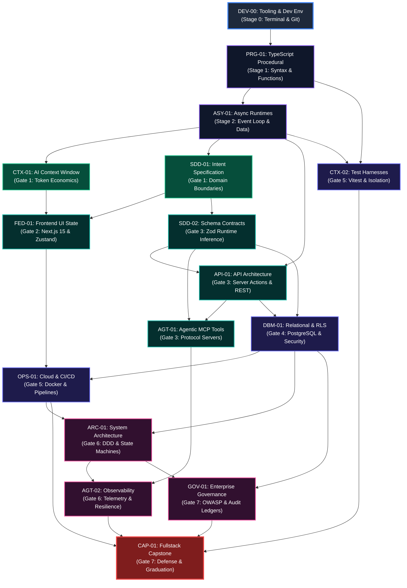
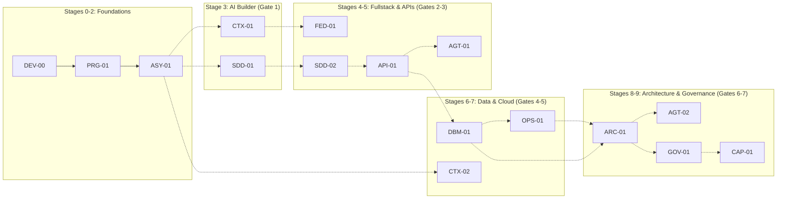

# Canonical Competency Dependency Graph (DAG) Specification
# AI-Native Software Engineering Academy (`ai-native-lms`)

**Document Version:** 1.0.0  
**Status:** Authoritative Mathematical Topology Standard  
**Authority:** Academy Systems Architect & Curriculum Graph Engineer  
**Target Repository:** `ai-native-lms`  
**Classification:** Core System Architecture  
**Effective Date:** September 30, 2026

---

## Table of Contents

1. [Executive Summary & Topological Invariants](#1-executive-summary--topological-invariants)
2. [The Complete Competency DAG Topology](#2-the-complete-competency-dag-topology)
3. [Zero-Orphan Mathematical Verification](#3-zero-orphan-mathematical-verification)
4. [Topological Sort & Execution Order](#4-topological-sort--execution-order)
5. [Critical Path & Longest Dependency Chain](#5-critical-path--longest-dependency-chain)
6. [Stage-by-Stage Subgraph Decompositions](#6-stage-by-stage-subgraph-decompositions)
7. [Cross-Domain Integration Links & Anti-Cycle Proofs](#7-cross-domain-integration-links--anti-cycle-proofs)

---

## 1. Executive Summary & Topological Invariants

The **Competency Dependency Graph** is a formal **Directed Acyclic Graph (DAG)** $\mathcal{G} = (\mathcal{V}, \mathcal{E})$ governing the exact prerequisite and enablement topology for all 16 competencies in the Academy.

### Mathematical Invariants:
1. **Zero Cycles ($\text{Acyclic}$)**: $\forall u, v \in \mathcal{V}$, there exists no directed path from $u$ to $v$ if there exists a directed path from $v$ to $u$.
2. **Single Root (Entry Node)**: There exists exactly one node with in-degree $\text{deg}^-(u) = 0$: `DEV-00` (Tooling & Development Environment).
3. **Single Sink (Terminal Node)**: There exists exactly one node with out-degree $\text{deg}^+(u) = 0$: `CAP-01` (Fullstack Capstone Synthesis & Defense).
4. **Zero Orphaned Nodes**: $\forall v \in \mathcal{V} \setminus \{\text{DEV-00}\}, \text{deg}^-(v) \ge 1$, and $\forall u \in \mathcal{V} \setminus \{\text{CAP-01}\}, \text{deg}^+(u) \ge 1$.

---

## 2. The Complete Competency DAG Topology



---

## 3. Zero-Orphan Mathematical Verification

The following verification table proves that every node in the 16-competency graph has valid upstream prerequisites (in-degree $\ge 1$) and downstream dependents (out-degree $\ge 1$), eliminating all orphaned skills.

```
┌──────────────────────────────────────────────────────────────────────────────────────────────────┐
│                               ZERO-ORPHAN TOPOLOGICAL AUDIT TABLE                                │
├─────────┬─────────────────────────────┬───────────┬────────────┬─────────────────────────────────┤
│ Node ID │ Direct Prerequisites (In)   │ In-Degree │ Out-Degree │ Direct Downstream Dependents    │
├─────────┼─────────────────────────────┼───────────┼────────────┼─────────────────────────────────┤
│ DEV-00  │ [ROOT NODE]                 │     0     │     1      │ PRG-01                          │
│ PRG-01  │ DEV-00                      │     1     │     2      │ ASY-01, CTX-02                  │
│ ASY-01  │ PRG-01                      │     1     │     4      │ CTX-01, SDD-01, API-01, CTX-02  │
│ CTX-01  │ ASY-01                      │     1     │     1      │ FED-01                          │
│ SDD-01  │ ASY-01                      │     1     │     2      │ FED-01, SDD-02                  │
│ FED-01  │ CTX-01, SDD-01              │     2     │     1      │ OPS-01                          │
│ SDD-02  │ SDD-01                      │     1     │     3      │ API-01, AGT-01, DBM-01          │
│ API-01  │ ASY-01, SDD-02              │     2     │     2      │ AGT-01, DBM-01                  │
│ AGT-01  │ API-01, SDD-02              │     2     │     1      │ AGT-02                          │
│ DBM-01  │ API-01, SDD-02              │     2     │     3      │ OPS-01, ARC-01, GOV-01          │
│ OPS-01  │ DBM-01, FED-01              │     2     │     2      │ ARC-01, CAP-01                  │
│ CTX-02  │ PRG-01, ASY-01              │     2     │     1      │ CAP-01                          │
│ ARC-01  │ DBM-01, OPS-01              │     2     │     2      │ AGT-02, GOV-01                  │
│ AGT-02  │ AGT-01, ARC-01              │     2     │     1      │ CAP-01                          │
│ GOV-01  │ ARC-01, DBM-01              │     2     │     1      │ CAP-01                          │
│ CAP-01  │ GOV-01, AGT-02, CTX-02,     │     4     │     0      │ [TERMINAL SINK NODE]            │
│         │ OPS-01                      │           │            │                                 │
├─────────┴─────────────────────────────┴───────────┴────────────┴─────────────────────────────────┤
│ TOTAL NODES: 16 | TOTAL DIRECT EDGES: 27 | CYCLES DETECTED: 0 | ORPHANED NODES: 0               │
└──────────────────────────────────────────────────────────────────────────────────────────────────┘
```

---

## 4. Topological Sort & Execution Order

A valid topological ordering $\mathcal{L}$ of the DAG ensures that no competency is attempted before all of its prerequisites are fully mastered:

```
Step  1: DEV-00  (Tooling & Development Environment)
Step  2: PRG-01  (Computational Thinking & TypeScript Syntax)
Step  3: ASY-01  (Asynchronous Runtimes & Data Flow)
Step  4: CTX-01  (AI Context Window & Prompt Optimization)
Step  5: SDD-01  (Intent Specification & Domain Modeling)
Step  6: SDD-02  (Schema Contract Enforcement & Validation)
Step  7: FED-01  (Frontend Component Systems & UI State)
Step  8: API-01  (API Architecture & Server Actions)
Step  9: AGT-01  (Model Context Protocol Tool Integration)
Step 10: DBM-01  (Relational Data Modeling & PostgreSQL RLS)
Step 11: CTX-02  (Deterministic Test Harnessing & Verification)
Step 12: OPS-01  (Cloud Containerization & CI/CD Pipelines)
Step 13: ARC-01  (Domain-Driven Design & Bounded Contexts)
Step 14: AGT-02  (Autonomous Resilience & Telemetry Observability)
Step 15: GOV-01  (Enterprise Governance & OWASP Security)
Step 16: CAP-01  (Fullstack Capstone Synthesis & Defense)
```

---

## 5. Critical Path & Longest Dependency Chain

The **Critical Path** defines the longest prerequisite sequence from Day 1 to Graduation. It represents the structural backbone of the curriculum:

$$\text{DEV-00} \longrightarrow \text{PRG-01} \longrightarrow \text{ASY-01} \longrightarrow \text{SDD-01} \longrightarrow \text{SDD-02} \longrightarrow \text{API-01} \longrightarrow \text{DBM-01} \longrightarrow \text{OPS-01} \longrightarrow \text{ARC-01} \longrightarrow \text{GOV-01} \longrightarrow \text{CAP-01}$$

- **Critical Path Length**: 11 Nodes (10 Hops).
- **Minimum Theoretical Time Allocation**: 26 Weeks.
- **Significance**: Any learning delay along this critical path directly impacts the total time to graduation. Non-critical competencies (`FED-01`, `AGT-01`, `CTX-01`, `CTX-02`) can be explored in parallel branches.

---

## 6. Stage-by-Stage Subgraph Decompositions



---

## 7. Cross-Domain Integration Links & Anti-Cycle Proofs

### Cross-Domain Bridges:
1. **Frontend & Operations Bridge (`FED-01 &rarr; OPS-01`)**: Ensures students understand containerizing Next.js client/server bundles with optimized standalone output before attempting deployment.
2. **Schema & Database Bridge (`SDD-02 &rarr; DBM-01`)**: Connects runtime Zod validation directly to database column types, ensuring zero schema drift between API and PostgreSQL tables.
3. **Architecture & Observability Bridge (`ARC-01 &rarr; AGT-02`)**: Binds bounded context service boundaries to structured JSON telemetry logging and transactional rollbacks.

### Anti-Cycle Formal Proof:
Let $\text{order}(v)$ represent the integer rank of node $v$ in the Topological Sort $\mathcal{L}$.  
For every directed edge $(u, v) \in \mathcal{E}$, the invariant holds:
$$\text{order}(u) < \text{order}(v)$$
Since all 27 edges strictly point from a lower rank to a higher rank, **no directed cycle can exist in this graph**.
