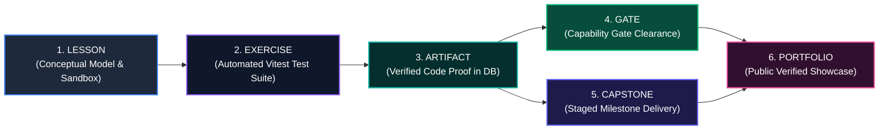

# Canonical Competency Framework Specification
# AI-Native Software Engineering Academy (`ai-native-lms`)

**Document Version:** 1.0.0  
**Status:** Permanent Authoritative Competency Standard  
**Authority:** Academy Systems Architect & Assessment Engineering Board  
**Target Repository:** `ai-native-lms`  
**Classification:** Core System Specification  
**Effective Date:** September 30, 2026

---

## Table of Contents

1. [Executive Summary & Framework Structure](#1-executive-summary--framework-structure)
2. [End-to-End Competency Traceability Model](#2-end-to-end-competency-traceability-model)
3. [Canonical Competency Catalogue (16 Competencies)](#3-canonical-competency-catalogue-16-competencies)
   - [DEV-00: Tooling & Development Environment](#dev-00-tooling--development-environment)
   - [PRG-01: Computational Thinking & TypeScript Syntax](#prg-01-computational-thinking--typescript-syntax)
   - [ASY-01: Asynchronous Runtimes & Data Flow](#asy-01-asynchronous-runtimes--data-flow)
   - [CTX-01: AI Context Window & Prompt Optimization](#ctx-01-ai-context-window--prompt-optimization)
   - [SDD-01: Intent Specification & Domain Modeling](#sdd-01-intent-specification--domain-modeling)
   - [FED-01: Frontend Component Systems & UI State](#fed-01-frontend-component-systems--ui-state)
   - [API-01: API Architecture & Server Actions](#api-01-api-architecture--server-actions)
   - [SDD-02: Schema Contract Enforcement & Validation](#sdd-02-schema-contract-enforcement--validation)
   - [AGT-01: Model Context Protocol (MCP) Tool Integration](#agt-01-model-context-protocol-mcp-tool-integration)
   - [DBM-01: Relational Data Modeling & PostgreSQL RLS](#dbm-01-relational-data-modeling--postgresql-rls)
   - [OPS-01: Cloud Containerization & CI/CD Pipelines](#ops-01-cloud-containerization--cicd-pipelines)
   - [CTX-02: Deterministic Test Harnessing & Verification](#ctx-02-deterministic-test-harnessing--verification)
   - [ARC-01: Domain-Driven Design & Bounded Contexts](#arc-01-domain-driven-design--bounded-contexts)
   - [AGT-02: Autonomous Resilience & Telemetry Observability](#agt-02-autonomous-resilience--telemetry-observability)
   - [GOV-01: Enterprise Governance & OWASP Security](#gov-01-enterprise-governance--owasp-security)
   - [CAP-01: Fullstack Capstone Synthesis & Defense](#cap-01-fullstack-capstone-synthesis--defense)
4. [Master Competency Traceability Matrix](#4-master-competency-traceability-matrix)

---

## 1. Executive Summary & Framework Structure

The **Competency Framework** defines the 16 atomic units of engineering mastery in the AI-Native Software Engineering Academy.

Every competency in this framework is:
1. **Unambiguously Defined**: Features explicit purpose, theoretical prerequisites, and measurable performance standards.
2. **Zero Orphaned Nodes**: Every competency is strictly rooted in foundational dependencies and flows into subsequent engineering capabilities.
3. **100% Traceable**: Formally mapped across the entire educational lifecycle:
   $$\text{Lesson} \longrightarrow \text{Interactive Exercise} \longrightarrow \text{Evidence Artifact} \longrightarrow \text{Capability Gate} \longrightarrow \text{Capstone Project} \longrightarrow \text{Employer Portfolio}$$

---

## 2. End-to-End Competency Traceability Model



---

## 3. Canonical Competency Catalogue

---

### DEV-00: Tooling & Development Environment
- **Purpose**: Master the core professional development toolchain (Terminal/CLI, Git version control, SSH authentication, and modern IDE configuration) with zero fear.
- **Prerequisites**: None (Foundational entry point).
- **Target Level**: Foundational (Stage 0).
- **Lesson Mapping**: `lesson-0-terminal-git-hygiene`
- **Exercise Mapping**: `lab-0-cli-git-navigation` (Automated CLI script assertion).
- **Validation Evidence**: Verified GitHub profile, SSH keypair connection, and initialized repository with atomic commits.
- **Gate Mapping**: Onboarding Baseline (Required for Stage 1 unlock).
- **Capstone Mapping**: Capstone 1–4 foundational repository setup.
- **Portfolio Mapping**: Showcased as verified toolchain literacy badge on `/portfolio/[username]`.

---

### PRG-01: Computational Thinking & TypeScript Syntax
- **Purpose**: Master procedural logic, primitive types, conditional control flow, loops, pure functions, and variable scoping using strict TypeScript.
- **Prerequisites**: `DEV-00`.
- **Target Level**: Foundational (Stage 1).
- **Lesson Mapping**: `lesson-1-typescript-procedural-foundations`
- **Exercise Mapping**: `lab-1-algorithmic-data-transforms` (10 automated pure function test suites).
- **Validation Evidence**: 100% green test run on typed algorithm drills with zero `any` types.
- **Gate Mapping**: Prerequisite for Gate 1 (AI-Assisted Builder).
- **Capstone Mapping**: Core business logic functions across Capstones 1–4.
- **Portfolio Mapping**: Algorithmic reasoning proof attached to candidate evidence stream.

---

### ASY-01: Asynchronous Runtimes & Data Flow
- **Purpose**: Master the JavaScript Event Loop, non-blocking I/O, `Promises`, `async/await`, HTTP network fetching, and functional array pipelines (`map`, `filter`, `reduce`).
- **Prerequisites**: `PRG-01`.
- **Target Level**: Foundational (Stage 2).
- **Lesson Mapping**: `lesson-2-async-event-loop-pipelines`
- **Exercise Mapping**: `lab-2-async-network-aggregator` (Mock network latency & retry tests).
- **Validation Evidence**: Passing test suite handling async API timeouts, status code error mapping, and array aggregations.
- **Gate Mapping**: Prerequisite for Gate 1 (AI-Assisted Builder).
- **Capstone Mapping**: Asynchronous network data fetching in Capstone 1 (Knowledge Engine).
- **Portfolio Mapping**: Async engineering badge; verified network resilience signal.

---

### CTX-01: AI Context Window & Prompt Optimization
- **Purpose**: Master context window token curation, prompt architecture, repository constitution authoring (`AGENTS.md`, `.cursorrules`), and dynamic token budget compression.
- **Prerequisites**: `ASY-01`.
- **Target Level**: Level 1 (Stage 3).
- **Lesson Mapping**: `lesson-3-context-architecture-token-economics`
- **Exercise Mapping**: `lab-3-sliding-window-token-pruner` (Deterministic token pruning test harness).
- **Validation Evidence**: Formally authored `AGENTS.md` file and verified context pruning algorithm.
- **Gate Mapping**: **Gate 1: AI-Assisted Builder** (Mandatory mastery requirement).
- **Capstone Mapping**: AI assistant context curation rules across all 4 Capstones.
- **Portfolio Mapping**: High-confidence hiring signal: `context_engineering_mastered`.

---

### SDD-01: Intent Specification & Domain Modeling
- **Purpose**: Formulate unambiguous technical intent specifications, domain boundaries, preconditions, postconditions, and architectural invariant guarantees.
- **Prerequisites**: `ASY-01`.
- **Target Level**: Level 1 (Stage 3).
- **Lesson Mapping**: `lesson-4-mental-models-intent-specification`
- **Exercise Mapping**: `lab-4-intent-specification-authoring` (Formal invariant specification authoring).
- **Validation Evidence**: Complete Architectural Specification Document containing 5 formal invariant rules and failure matrices.
- **Gate Mapping**: **Gate 1: AI-Assisted Builder** (Mandatory mastery requirement).
- **Capstone Mapping**: Milestone 1 (Architecture RFC) across Capstones 1–4.
- **Portfolio Mapping**: Authored Architectural Decision Records (ADRs) showcased on portfolio.

---

### FED-01: Frontend Component Systems & UI State
- **Purpose**: Build performant, accessible, and reactive user interfaces using Next.js 15 (App Router), React 19 Server/Client Components, Tailwind CSS, and isolated Zustand client stores.
- **Prerequisites**: `CTX-01`, `SDD-01`.
- **Target Level**: Level 2 (Stage 4).
- **Lesson Mapping**: `lesson-5-nextjs-react-zustand-ui`
- **Exercise Mapping**: `lab-5-reactive-component-store` (React Testing Library interaction tests).
- **Validation Evidence**: Live deployed Next.js web application with 100% passing component interaction tests and Lighthouse accessibility score >95%.
- **Gate Mapping**: **Gate 2: Frontend Engineer** (Mandatory mastery requirement).
- **Capstone Mapping**: Milestone 3 (Frontend UI & State) across Capstones 1–4.
- **Portfolio Mapping**: Interactive live UI embeds and verified frontend badges on portfolio.

---

### API-01: API Architecture & Server Actions
- **Purpose**: Architect type-safe Next.js Server Actions, RESTful Route Handlers, standardized JSON response envelopes (`{ success, data, error }`), and secure cookie session middleware.
- **Prerequisites**: `SDD-01`.
- **Target Level**: Level 3 (Stage 5).
- **Lesson Mapping**: `lesson-6-server-actions-rest-routes`
- **Exercise Mapping**: `lab-6-authenticated-api-envelopes` (API integration test suite).
- **Validation Evidence**: Fullstack authenticated CRUD API with passing unit tests for authorization, payload processing, and error envelopes.
- **Gate Mapping**: **Gate 3: API Integrator** (Mandatory mastery requirement).
- **Capstone Mapping**: Milestone 2 (API Layer) across Capstones 1–4.
- **Portfolio Mapping**: API architecture verification badge and Swagger/OpenAPI spec showcase.

---

### SDD-02: Schema Contract Enforcement & Validation
- **Purpose**: Enforce strict runtime data validation and zero schema drift across network and database boundaries using Zod schema contracts and TypeScript inference.
- **Prerequisites**: `SDD-01`, `API-01`.
- **Target Level**: Level 3 (Stage 5).
- **Lesson Mapping**: `lesson-7-zod-runtime-schema-contracts`
- **Exercise Mapping**: `lab-7-zod-contract-validation` (Zod parsing, transforms & error mapping).
- **Validation Evidence**: Comprehensive Zod validation suite validating nested objects, UUIDs, discriminated unions, and custom `.superRefine()` rules.
- **Gate Mapping**: **Gate 3: API Integrator** (Mandatory mastery requirement).
- **Capstone Mapping**: Runtime payload contracts across Capstones 1–4.
- **Portfolio Mapping**: Hiring signal: `contract_first_architecture_verified`.

---

### AGT-01: Model Context Protocol (MCP) Tool Integration
- **Purpose**: Build, declare, and integrate Model Context Protocol (MCP) tool servers, enabling AI assistants to safely query external databases, local tools, and third-party APIs.
- **Prerequisites**: `API-01`, `SDD-02`.
- **Target Level**: Level 3 (Stage 5).
- **Lesson Mapping**: `lesson-8-model-context-protocol-deep-dive`
- **Exercise Mapping**: `lab-8-mcp-tool-server-declaration` (MCP JSON-RPC server integration test).
- **Validation Evidence**: Functional MCP tool server registered and executed by an AI client to perform database queries.
- **Gate Mapping**: **Gate 3: API Integrator** (Mandatory mastery requirement).
- **Capstone Mapping**: Capstone 1 (AI Knowledge Engine) and Capstone 4 (Compliance Sentinel).
- **Portfolio Mapping**: MCP tool developer badge; AI agent tooling evidence.

---

### DBM-01: Relational Data Modeling & PostgreSQL RLS
- **Purpose**: Design normalized relational schemas, manage database migrations, optimize indexes, and enforce multi-tenant security using PostgreSQL Row-Level Security (RLS) policies.
- **Prerequisites**: `API-01`, `SDD-02`.
- **Target Level**: Level 4 (Stage 6).
- **Lesson Mapping**: `lesson-9-postgresql-relational-rls`
- **Exercise Mapping**: `lab-9-supabase-rls-security-suite` (Automated cross-tenant intrusion tests).
- **Validation Evidence**: Idempotent PostgreSQL migration file + automated test proving zero cross-tenant data leaks under unauthorized credentials.
- **Gate Mapping**: **Gate 4: Data Model Designer** (Mandatory mastery requirement).
- **Capstone Mapping**: Milestone 2 (Database Architecture) across Capstones 1–4.
- **Portfolio Mapping**: High-value hiring signal: `database_security_rls_certified`.

---

### OPS-01: Cloud Containerization & CI/CD Pipelines
- **Purpose**: Package applications into multi-stage production Dockerfiles, author GitHub Actions CI/CD workflows, manage secrets, and deploy to production cloud infrastructure.
- **Prerequisites**: `DBM-01`, `FED-01`.
- **Target Level**: Level 5 (Stage 7).
- **Lesson Mapping**: `lesson-10-docker-github-actions-cicd`
- **Exercise Mapping**: `lab-10-cicd-pipeline-container-build` (GitHub Actions workflow linter & Docker staging test).
- **Validation Evidence**: Passing GitHub Actions CI/CD pipeline executing linting, type-checking, automated tests, and container builds.
- **Gate Mapping**: **Gate 5: Production Deployer** (Mandatory mastery requirement).
- **Capstone Mapping**: Milestone 4 (Production Deployment) across Capstones 1–4.
- **Portfolio Mapping**: Verified live production URL links with public health check confirmation.

---

### CTX-02: Deterministic Test Harnessing & Verification
- **Purpose**: Construct robust test pyramids (Unit, Integration, Component, and Mock tests) using Vitest, MSW, and test doubles to evaluate non-deterministic AI generation.
- **Prerequisites**: `PRG-01`, `ASY-01`.
- **Target Level**: Level 5 (Stage 7).
- **Lesson Mapping**: `lesson-11-deterministic-test-pyramids`
- **Exercise Mapping**: `lab-11-mock-harness-vitest-runner` (Mock LLM response stream harness).
- **Validation Evidence**: Isolated test suite with 100% assertion pass rate testing edge cases, network failures, and race conditions.
- **Gate Mapping**: **Gate 5: Production Deployer** (Mandatory mastery requirement).
- **Capstone Mapping**: Automated test verification across Capstones 1–4.
- **Portfolio Mapping**: Hiring signal: `test_engineering_rigor_verified`.

---

### ARC-01: Domain-Driven Design & Bounded Contexts
- **Purpose**: Partition complex enterprise codebases into isolated bounded contexts following Domain-Driven Design (DDD), implement Finite State Machines (FSM), and write ADRs.
- **Prerequisites**: `DBM-01`, `OPS-01`.
- **Target Level**: Level 6 (Stage 8).
- **Lesson Mapping**: `lesson-12-domain-driven-design-bounded-contexts`
- **Exercise Mapping**: `lab-12-state-machine-domain-service` (State machine transition invariant tests).
- **Validation Evidence**: Authored Architectural Decision Record (`ADR-001.md`) + clean DDD domain service/repository layer with 100% isolated tests.
- **Gate Mapping**: **Gate 6: System Architect** (Mandatory mastery requirement).
- **Capstone Mapping**: Capstone 3 (Distributed Event-Driven Orchestrator).
- **Portfolio Mapping**: High-confidence senior hiring signal: `systems_architect_certified`.

---

### AGT-02: Autonomous Resilience & Telemetry Observability
- **Purpose**: Architect self-healing agentic workflows, structured JSON telemetry logging (`lib/logger.ts`), distributed tracing, and transactional error rollbacks.
- **Prerequisites**: `ARC-01`, `AGT-01`.
- **Target Level**: Level 6 (Stage 8).
- **Lesson Mapping**: `lesson-13-agentic-telemetry-observability`
- **Exercise Mapping**: `lab-13-exponential-backoff-telemetry` (Backoff retry loop & structured logger test).
- **Validation Evidence**: Resilient background task runner with structured JSON logs, tracing spans, and automated state rollback on failure.
- **Gate Mapping**: **Gate 6: System Architect** (Mandatory mastery requirement).
- **Capstone Mapping**: Telemetry and error recovery in Capstones 3 & 4.
- **Portfolio Mapping**: Observability and enterprise resilience badge.

---

### GOV-01: Enterprise Governance & OWASP Security
- **Purpose**: Audit codebases against OWASP Top 10 vulnerabilities, mitigate prompt injection attacks, enforce multi-tenancy privacy compliance, and maintain immutable audit ledgers.
- **Prerequisites**: `ARC-01`, `DBM-01`.
- **Target Level**: Level 7 (Stage 9).
- **Lesson Mapping**: `lesson-14-enterprise-governance-owasp-audit`
- **Exercise Mapping**: `lab-14-security-vulnerability-audit` (Static security scan & prompt injection mitigation).
- **Validation Evidence**: Complete Security Threat Model & Audit Report verifying OWASP Top 10 defense and tamper-proof ledger accounting.
- **Gate Mapping**: **Gate 7: Enterprise Engineer** (Mandatory mastery requirement).
- **Capstone Mapping**: Capstone 4 (Enterprise AI Code Review & Compliance Sentinel).
- **Portfolio Mapping**: Elite hiring signal: `enterprise_governance_security_certified`.

---

### CAP-01: Fullstack Capstone Synthesis & Defense
- **Purpose**: Synthesize all 15 preceding competencies into an end-to-end, production-grade enterprise application and verbally defend its architecture before an expert evaluation panel.
- **Prerequisites**: All Competencies (`DEV-00` through `GOV-01`).
- **Target Level**: Level 7 (Terminal Stage 9).
- **Lesson Mapping**: `lesson-15-capstone-architecture-defense-prep`
- **Exercise Mapping**: `lab-15-production-capstone-submission` (Fullstack Capstone 1–4 evaluation).
- **Validation Evidence**: 4 Deployed Production Capstones + 20-minute recorded oral architectural defense presentation.
- **Gate Mapping**: **Gate 7: Enterprise Engineer / Official Academy Graduation**.
- **Capstone Mapping**: Capstones 1, 2, 3, and 4.
- **Portfolio Mapping**: Certified AI-Native Software Engineer Public Credential & Verified Portfolio Showcase.

---

## 4. Master Competency Traceability Matrix

```
┌──────────────────────────────────────────────────────────────────────────────────────────────────────────────────────────────────────┐
│                                             MASTER COMPETENCY TRACEABILITY MATRIX                                                    │
├─────────┬──────────────────────┬──────────────────────┬──────────────────────┬────────────┬────────────────────┬─────────────────────┤
│ Code    │ Source Lesson        │ Interactive Exercise │ Target Artifact      │ Gate Map   │ Capstone Map       │ Portfolio Showcase  │
├─────────┼──────────────────────┼──────────────────────┼──────────────────────┼────────────┼────────────────────┼─────────────────────┤
│ DEV-00  │ lesson-0-dev-env     │ lab-0-cli-git-nav    │ Git Repo & SSH Proof │ Stage 0    │ Capstones 1–4 Setup│ Toolchain Literacy  │
│ PRG-01  │ lesson-1-ts-core     │ lab-1-algo-drills    │ 10 Green Test Suites │ Gate 1 Req │ Capstone Logic Core│ Algorithmic Logic   │
│ ASY-01  │ lesson-2-async-flow  │ lab-2-async-network  │ Network Retry Suite  │ Gate 1 Req │ Capstone Data Fetch│ Async Data Flow     │
│ CTX-01  │ lesson-3-context-eng │ lab-3-token-pruner   │ `AGENTS.md` + Pruner │ Gate 1 Seal│ Context Rules 1–4  │ Context Engineering │
│ SDD-01  │ lesson-4-intent-spec │ lab-4-spec-authoring │ Arch Spec + 5 Invars │ Gate 1 Seal│ Milestone 1 (RFC)  │ ADR Spec Showcase   │
│ FED-01  │ lesson-5-nextjs-ui   │ lab-5-component-ui   │ Next.js App + WCAG AA│ Gate 2 Seal│ Milestone 3 (UI)   │ Live UI Embeds      │
│ API-01  │ lesson-6-api-routes  │ lab-6-api-envelopes  │ CRUD API + Auth Suite│ Gate 3 Seal│ Milestone 2 (API)  │ API Architecture    │
│ SDD-02  │ lesson-7-zod-schemas │ lab-7-zod-contracts  │ Zod Runtime Suite    │ Gate 3 Seal│ Payload Contracts  │ Schema Contracts    │
│ AGT-01  │ lesson-8-mcp-tools   │ lab-8-mcp-server-lab │ Functional MCP Server│ Gate 3 Seal│ Capstone 1 & 4 MCP │ MCP Tool Developer  │
│ DBM-01  │ lesson-9-postgres-rls│ lab-9-rls-security   │ Migration + RLS Suite│ Gate 4 Seal│ Milestone 2 (DB)   │ Database Security   │
│ OPS-01  │ lesson-10-docker-ci  │ lab-10-cicd-workflow │ Docker + GitHub CI   │ Gate 5 Seal│ Milestone 4 (Deploy│ Production Live URLs│
│ CTX-02  │ lesson-11-test-pyram │ lab-11-vitest-harness│ Mock Isolation Suite │ Gate 5 Seal│ Test Pyramids 1–4  │ Test Engineering    │
│ ARC-01  │ lesson-12-ddd-bound  │ lab-12-state-machine │ ADR-001 + FSM Service│ Gate 6 Seal│ Capstone 3 (DDD)   │ Systems Architect   │
│ AGT-02  │ lesson-13-telemetry  │ lab-13-backoff-retry │ Telemetry Runner     │ Gate 6 Seal│ Capstone 3 & 4 Tel │ Observability Badge │
│ GOV-01  │ lesson-14-owasp-sec  │ lab-14-security-audit│ Threat Model + Audit │ Gate 7 Seal│ Capstone 4 Sentinel│ Enterprise Security │
│ CAP-01  │ lesson-15-defense    │ lab-15-capstone-sub  │ 4 Capstones + Defense│ Gate 7 Seal│ Capstones 1,2,3,4  │ Certified Graduate  │
└─────────┴──────────────────────┴──────────────────────┴──────────────────────┴────────────┴────────────────────┴─────────────────────┘
```

This framework establishes the definitive, uncompromised traceability standard of the Academy.
