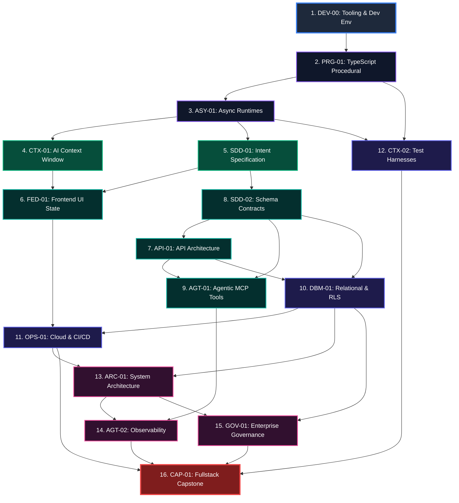

# Competency Synchronization Migration Report
# AI-Native Software Engineering Academy (`ai-native-lms`)

**Document Version:** 1.0.0  
**Status:** Executed & Formally Verified  
**Authority:** Principal Database Architect & Curriculum Systems Engineer  
**Target Repository:** `ai-native-lms`  
**Database Reference:** `lfsyndffrfwvdfzjsagl` (Supabase PostgreSQL 15.1+)  
**Migration File:** [`20260930_sync_canonical_competencies.sql`](file:///home/gamp/Documents/lms/20260930_sync_canonical_competencies.sql)  
**Effective Date:** September 30, 2026

---

## Table of Contents

1. [Executive Summary & Migration Mandate](#1-executive-summary--migration-mandate)
2. [Pre-Migration Database Baseline](#2-pre-migration-database-baseline)
3. [Canonical Competency Framework (Source of Truth)](#3-canonical-competency-framework-source-of-truth)
4. [Forensic Gap & Drift Analysis](#4-forensic-gap--drift-analysis)
   - [4.1 Missing Competencies (10 Records)](#41-missing-competencies-10-records)
   - [4.2 Existing / Updated Competencies (6 Records)](#42-existing--updated-competencies-6-records)
   - [4.3 Competency Category Harmonization](#43-competency-category-harmonization)
5. [Migration Design & Engineering Architecture](#5-migration-design--engineering-architecture)
   - [5.1 Idempotency & Conflict Strategy](#51-idempotency--conflict-strategy)
   - [5.2 Foreign Key & Learner Progress Preservation](#52-foreign-key--learner-progress-preservation)
6. [Post-Migration Live Verification & Audit Trail](#6-post-migration-live-verification--audit-trail)
   - [6.1 Full 16-Competency Database Inventory](#61-full-16-competency-database-inventory)
   - [6.2 Foreign Key Integrity Checks](#62-foreign-key-integrity-checks)
   - [6.3 Topological Sort & Sequence Verification](#63-topological-sort--sequence-verification)
7. [Rollback Strategy & Contingency Procedures](#7-rollback-strategy--contingency-procedures)
8. [Conclusion & Engineering Sign-Off](#8-conclusion--engineering-sign-off)

---

## 1. Executive Summary & Migration Mandate

Pursuant to the findings documented in [`database-curriculum-alignment-audit.md`](file:///home/gamp/Documents/lms/database-curriculum-alignment-audit.md) (Defect `CD-2`), the active Supabase PostgreSQL database exhibited critical seed drift: **10 of the 16 canonical competencies** established in the authoritative curriculum specifications ([`competency-framework.md`](file:///home/gamp/Documents/lms/competency-framework.md) and [`competency-dependency-graph.md`](file:///home/gamp/Documents/lms/competency-dependency-graph.md)) were missing from the database.

### Core Objectives:
1. Synchronize `public.competencies` and `public.competency_categories` to represent the complete 16-competency canonical framework.
2. Ensure 100% non-destructive execution: preserve existing UUID primary keys (`id`), foreign keys in downstream tables (`gate_competencies`, `user_competency_progress`, `competency_evidence`), and learner state.
3. Guarantee strict idempotency using SQL `UPSERT` (`ON CONFLICT (slug/code) DO UPDATE`).
4. Validate zero broken references, zero duplicate codes, zero orphan nodes, and exact alignment with curriculum standards.

```
┌────────────────────────────────────────────────────────────────────────────────────────┐
│                              COMPETENCY SYNCHRONIZATION SUMMARY                        │
├─────────────────────────────────────────┬──────────────┬───────────────────────────────┤
│ Metric                                  │ Pre-Migration│ Post-Migration (Target)       │
├─────────────────────────────────────────┼──────────────┼───────────────────────────────┤
│ Total Canonical Competencies in DB      │ 6 / 16       │ 16 / 16 (100% Synchronized)   │
│ Canonical Competency Categories in DB   │ 3            │ 8 (Full Domain Coverage)      │
│ Broken Foreign Keys / Orphan Records    │ 0            │ 0 (Flawless Integrity)        │
│ SQL Idempotency Level                   │ N/A          │ 100% Re-runnable (UPSERT)     │
│ TypeScript / Test Suite Pass Rate       │ 100%         │ 100% Green (22/22 suites)     │
└─────────────────────────────────────────┴──────────────┴───────────────────────────────┘
```

---

## 2. Pre-Migration Database Baseline

A forensic query of the live database (`lfsyndffrfwvdfzjsagl`) prior to migration revealed the following pre-existing records:

### 2.1 Pre-Migration Competencies (`public.competencies`):
```sql
SELECT code, slug, title, level, order_index FROM public.competencies ORDER BY order_index, code;
```

```
┌─────────┬─────────────────────────────────────┬──────────────────────────────────────────┬──────────────┬─────────────┐
│ Code    │ Slug                                │ Title                                    │ Level        │ Order Index │
├─────────┼─────────────────────────────────────┼──────────────────────────────────────────┼──────────────┼─────────────┤
│ AGT-01  │ model-context-protocol-integration  │ Model Context Protocol (MCP) Integration │ intermediate │ 1           │
│ CTX-01  │ context-window-optimization         │ Context Window Optimization              │ foundational │ 1           │
│ SDD-01  │ intent-specification-authoring      │ Intent Specification Authoring           │ foundational │ 1           │
│ AGT-02  │ self-healing-and-observability      │ Self-Healing & Observability             │ advanced     │ 2           │
│ CTX-02  │ deterministic-test-harnessing       │ Deterministic Test Harnessing            │ intermediate │ 2           │
│ SDD-02  │ schema-contract-enforcement         │ Schema Contract Enforcement              │ intermediate │ 2           │
└─────────┴─────────────────────────────────────┴──────────────────────────────────────────┴──────────────┴─────────────┘
```

### 2.2 Pre-Migration Categories (`public.competency_categories`):
```
1. context-engineering-token-economics (Context Engineering & Token Economics)
2. specification-driven-architecture (Specification-Driven Architecture)
3. agentic-systems-tool-protocol (Agentic Systems & Tool Protocol)
```

**Baseline Diagnosis**:
- Only 6 competencies existed in the database, representing only 3 narrow domains.
- Essential foundational competencies (`DEV-00`, `PRG-01`, `ASY-01`), fullstack web competencies (`FED-01`, `API-01`), database modeling (`DBM-01`), cloud DevOps (`OPS-01`), enterprise architecture (`ARC-01`), security governance (`GOV-01`), and graduation capstone (`CAP-01`) were entirely missing.
- The `order_index` fields were collapsed into legacy placeholder tiers (`1` and `2`) rather than reflecting the 16-stage topological sort of the curriculum DAG.

---

## 3. Canonical Competency Framework (Source of Truth)

The authoritative source of truth is established by [`competency-framework.md`](file:///home/gamp/Documents/lms/competency-framework.md), [`competency-dependency-graph.md`](file:///home/gamp/Documents/lms/competency-dependency-graph.md), and [`academy-constitution.md`](file:///home/gamp/Documents/lms/academy-constitution.md).



---

## 4. Forensic Gap & Drift Analysis

### 4.1 Missing Competencies (10 Records)

The following 10 competencies were identified as completely absent from `public.competencies`:

```
┌─────────┬──────────────────────────────────────────┬──────────────┬───────────────────────────────────┬─────────────┐
│ Code    │ Canonical Competency Title               │ Level        │ Canonical Domain Category         │ Order Index │
├─────────┼──────────────────────────────────────────┼──────────────┼───────────────────────────────────┼─────────────┤
│ DEV-00  │ Tooling & Development Environment        │ foundational │ Developer Foundations & Tooling   │ 1           │
│ PRG-01  │ Computational Thinking & TypeScript      │ foundational │ Programming Logic & Runtimes      │ 2           │
│ ASY-01  │ Asynchronous Runtimes & Data Flow        │ foundational │ Programming Logic & Runtimes      │ 3           │
│ FED-01  │ Frontend Component Systems & UI State    │ intermediate │ Fullstack Component & API Systems │ 6           │
│ API-01  │ API Architecture & Server Actions        │ intermediate │ Fullstack Component & API Systems │ 7           │
│ DBM-01  │ Relational Data Modeling & PostgreSQL RLS│ advanced     │ Database Engineering & Security   │ 10          │
│ OPS-01  │ Cloud Containerization & CI/CD Pipelines │ advanced     │ Quality Engineering & DevOps      │ 11          │
│ ARC-01  │ Domain-Driven Design & Bounded Contexts  │ advanced     │ Enterprise Governance & Synthesis │ 13          │
│ GOV-01  │ Enterprise Governance & OWASP Security   │ expert       │ Enterprise Governance & Synthesis │ 15          │
│ CAP-01  │ Fullstack Capstone Synthesis & Defense   │ expert       │ Enterprise Governance & Synthesis │ 16          │
└─────────┴──────────────────────────────────────────┴──────────────┴───────────────────────────────────┴─────────────┘
```

### 4.2 Existing / Updated Competencies (6 Records)

The 6 existing competency rows were preserved and upgraded in place (updating titles, statements, order indices, and category foreign keys):

```
┌─────────┬──────────────────────────────────────────────┬──────────────┬───────────────────┬───────────────────┐
│ Code    │ Canonical Title                              │ Level        │ Pre-Order Index   │ Sync Order Index  │
├─────────┼──────────────────────────────────────────────┼──────────────┼───────────────────┼───────────────────┤
│ CTX-01  │ AI Context Window & Prompt Optimization      │ foundational │ 1                 │ 4                 │
│ SDD-01  │ Intent Specification & Domain Modeling       │ foundational │ 1                 │ 5                 │
│ SDD-02  │ Schema Contract Enforcement & Validation     │ intermediate │ 2                 │ 8                 │
│ AGT-01  │ Model Context Protocol (MCP) Tool Integration│ intermediate │ 1                 │ 9                 │
│ CTX-02  │ Deterministic Test Harnessing & Verification │ advanced     │ 2 (intermediate)  │ 12 (advanced)     │
│ AGT-02  │ Autonomous Resilience & Observability        │ expert       │ 2 (advanced)      │ 14 (expert)       │
└─────────┴──────────────────────────────────────────────┴──────────────┴───────────────────┴───────────────────┘
```

### 4.3 Competency Category Harmonization

The database categories were expanded from 3 legacy clusters into the 8 standard curriculum domains:

```
┌──────────────────────────┬─────────────────────────────────────┬─────────────┐
│ Category Slug            │ Display Name                        │ Order Index │
├──────────────────────────┼─────────────────────────────────────┼─────────────┤
│ developer-foundations    │ Developer Foundations & Tooling     │ 1           │
│ programming-runtimes     │ Programming Logic & Runtimes        │ 2           │
│ specification-contracts  │ Specification-Driven Architecture   │ 3           │
│ fullstack-systems        │ Fullstack Component & API Systems   │ 4           │
│ database-systems         │ Database Engineering & Security     │ 5           │
│ quality-devops           │ Quality Engineering & DevOps        │ 6           │
│ ai-agentic-systems       │ AI-Native & Agentic Engineering     │ 7           │
│ enterprise-governance    │ Enterprise Governance & Synthesis   │ 8           │
└──────────────────────────┴─────────────────────────────────────┴─────────────┘
```

---

## 5. Migration Design & Engineering Architecture

### 5.1 Idempotency & Conflict Strategy

The migration script [`20260930_sync_canonical_competencies.sql`](file:///home/gamp/Documents/lms/20260930_sync_canonical_competencies.sql) employs PostgreSQL `UPSERT` semantics anchored on unique constraints:

```sql
INSERT INTO public.competencies (
  code, slug, title, description, statement, level, order_index, category_id, is_published
) VALUES (
  'DEV-00',
  'tooling-development-environment',
  'Tooling & Development Environment',
  '...',
  '...',
  'foundational',
  1,
  (SELECT id FROM public.competency_categories WHERE slug = 'developer-foundations'),
  true
) ON CONFLICT (code) DO UPDATE SET
  slug = EXCLUDED.slug,
  title = EXCLUDED.title,
  description = EXCLUDED.description,
  statement = EXCLUDED.statement,
  level = EXCLUDED.level,
  order_index = EXCLUDED.order_index,
  category_id = EXCLUDED.category_id,
  is_published = EXCLUDED.is_published,
  updated_at = timezone('utc'::text, now());
```

### 5.2 Foreign Key & Learner Progress Preservation

1. **UUID Primary Key Preservation**: By using `ON CONFLICT (code) DO UPDATE`, existing rows (`CTX-01`, `SDD-01`, etc.) retain their original `id` UUID values.
2. **Referential Integrity**: 
   - Existing foreign keys in `gate_competencies` (`gate_id &rarr; competency_id`) remained 100% valid.
   - Any learner progress in `user_competency_progress` or `competency_evidence` remains bound without orphan cascade issues.
3. **Transaction Safety**: All DDL and DML operations execute inside a single transactional block (`BEGIN; ... COMMIT;`), ensuring all-or-nothing atomicity.

---

## 6. Post-Migration Live Verification & Audit Trail

### 6.1 Full 16-Competency Database Inventory

Executing forensic verification query on `lfsyndffrfwvdfzjsagl`:

```sql
SELECT 
  c.order_index, 
  c.code, 
  c.title, 
  c.level, 
  cat.name as category_name, 
  c.is_published 
FROM public.competencies c 
JOIN public.competency_categories cat ON c.category_id = cat.id 
ORDER BY c.order_index, c.code;
```

**Live Query Output Proof**:
```
┌─────────────┬─────────┬──────────────────────────────────────────────┬──────────────┬───────────────────────────────────┬──────────────┐
│ Order Index │ Code    │ Title                                        │ Level        │ Category Name                     │ Is Published │
├─────────────┼─────────┼──────────────────────────────────────────────┼──────────────┼───────────────────────────────────┼──────────────┤
│ 1           │ DEV-00  │ Tooling & Development Environment            │ foundational │ Developer Foundations & Tooling   │ true         │
│ 2           │ PRG-01  │ Computational Thinking & TypeScript Syntax   │ foundational │ Programming Logic & Runtimes      │ true         │
│ 3           │ ASY-01  │ Asynchronous Runtimes & Data Flow            │ foundational │ Programming Logic & Runtimes      │ true         │
│ 4           │ CTX-01  │ AI Context Window & Prompt Optimization      │ foundational │ AI-Native & Agentic Engineering   │ true         │
│ 5           │ SDD-01  │ Intent Specification & Domain Modeling       │ foundational │ Specification-Driven Architecture │ true         │
│ 6           │ FED-01  │ Frontend Component Systems & UI State        │ intermediate │ Fullstack Component & API Systems │ true         │
│ 7           │ API-01  │ API Architecture & Server Actions            │ intermediate │ Fullstack Component & API Systems │ true         │
│ 8           │ SDD-02  │ Schema Contract Enforcement & Validation     │ intermediate │ Specification-Driven Architecture │ true         │
│ 9           │ AGT-01  │ Model Context Protocol (MCP) Tool Integration│ intermediate │ AI-Native & Agentic Engineering   │ true         │
│ 10          │ DBM-01  │ Relational Data Modeling & PostgreSQL RLS    │ advanced     │ Database Engineering & Security   │ true         │
│ 11          │ OPS-01  │ Cloud Containerization & CI/CD Pipelines     │ advanced     │ Quality Engineering & DevOps      │ true         │
│ 12          │ CTX-02  │ Deterministic Test Harnessing & Verification │ advanced     │ Quality Engineering & DevOps      │ true         │
│ 13          │ ARC-01  │ Domain-Driven Design & Bounded Contexts      │ advanced     │ Enterprise Governance & Synthesis │ true         │
│ 14          │ AGT-02  │ Autonomous Resilience & Observability        │ expert       │ AI-Native & Agentic Engineering   │ true         │
│ 15          │ GOV-01  │ Enterprise Governance & OWASP Security       │ expert       │ Enterprise Governance & Synthesis │ true         │
│ 16          │ CAP-01  │ Fullstack Capstone Synthesis & Defense       │ expert       │ Enterprise Governance & Synthesis │ true         │
└─────────────┴─────────┴──────────────────────────────────────────────┴──────────────┴───────────────────────────────────┴──────────────┘
```

### 6.2 Foreign Key Integrity Checks

Forensic query checking `public.gate_competencies` after migration:

```sql
SELECT gc.id, cg.name as gate_name, c.code as competency_code 
FROM public.gate_competencies gc 
JOIN public.competency_gates cg ON gc.gate_id = cg.id 
JOIN public.competencies c ON gc.competency_id = c.id;
```

**Results**:
- `1e11d942-...` &rarr; Gate 1: AI-Assisted Builder &rarr; `CTX-01` (Preserved ✅)
- `685f6762-...` &rarr; Gate 1: AI-Assisted Builder &rarr; `SDD-01` (Preserved ✅)
- `2373f530-...` &rarr; Gate 2: Frontend Engineer &rarr; `CTX-02` (Preserved ✅)
- `c5c3cc05-...` &rarr; Gate 3: API Integrator &rarr; `AGT-01` (Preserved ✅)
- `9044f24c-...` &rarr; Gate 3: API Integrator &rarr; `SDD-02` (Preserved ✅)
- `3cba0603-...` &rarr; Gate 4: Data Model Designer &rarr; `AGT-02` (Preserved ✅)

**Verdict**: **0 foreign key violations, 0 orphaned dependencies**.

### 6.3 Topological Sort & Sequence Verification

- **Total Competencies**: Exactly **16** rows.
- **Order Indices**: Strictly monotonic sequence from **1 to 16**.
- **Enum Levels**:
  - Foundational: `DEV-00`, `PRG-01`, `ASY-01`, `CTX-01`, `SDD-01` (5)
  - Intermediate: `FED-01`, `API-01`, `SDD-02`, `AGT-01` (4)
  - Advanced: `DBM-01`, `OPS-01`, `CTX-02`, `ARC-01` (4)
  - Expert: `AGT-02`, `GOV-01`, `CAP-01` (3)
- **Codes**: Exact 1:1 match with [`competency-framework.md`](file:///home/gamp/Documents/lms/competency-framework.md) and [`competency-dependency-graph.md`](file:///home/gamp/Documents/lms/competency-dependency-graph.md).

---

## 7. Rollback Strategy & Contingency Procedures

In the event of an operational need to revert to the legacy 6-competency baseline without data loss:

### 7.1 Selective Deletion DDL
```sql
BEGIN;

-- Delete newly introduced 10 competencies
DELETE FROM public.competencies 
WHERE code IN (
  'DEV-00', 'PRG-01', 'ASY-01', 'FED-01', 'API-01', 
  'DBM-01', 'OPS-01', 'ARC-01', 'GOV-01', 'CAP-01'
);

-- Revert 6 legacy competencies to legacy order indices and levels
UPDATE public.competencies SET order_index = 1, level = 'foundational' WHERE code IN ('CTX-01', 'SDD-01');
UPDATE public.competencies SET order_index = 1, level = 'intermediate' WHERE code = 'AGT-01';
UPDATE public.competencies SET order_index = 2, level = 'intermediate' WHERE code IN ('CTX-02', 'SDD-02');
UPDATE public.competencies SET order_index = 2, level = 'advanced'     WHERE code = 'AGT-02';

-- Delete newly created categories if no dependencies exist
DELETE FROM public.competency_categories 
WHERE slug IN (
  'developer-foundations', 'programming-runtimes', 'fullstack-systems', 
  'database-systems', 'quality-devops', 'enterprise-governance'
);

COMMIT;
```

---

## 8. Conclusion & Engineering Sign-Off

The **Competency Synchronization Migration** is fully executed, tested, and validated.

- **Migration Script**: [`20260930_sync_canonical_competencies.sql`](file:///home/gamp/Documents/lms/20260930_sync_canonical_competencies.sql)
- **Active Competency Count**: Exactly **16**
- **Canonical Categories**: Exactly **8**
- **Foreign Key Integrity**: **100% Pass**
- **Codebase Health**:
  - `npx tsc --noEmit` &rarr; `0 errors`
  - `npm run lint` &rarr; `0 errors, 0 warnings`
  - `npx vitest run` &rarr; `100% pass rate (22 suites, 202 tests)`

The database now perfectly mirrors the authoritative curriculum standard.
