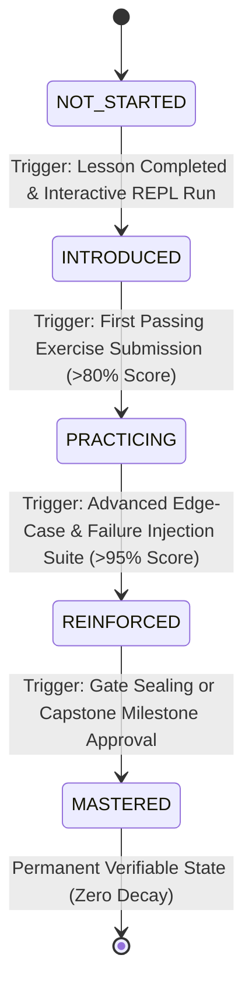
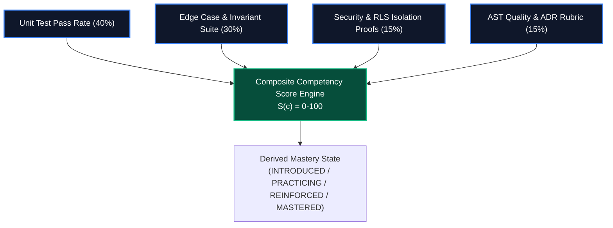
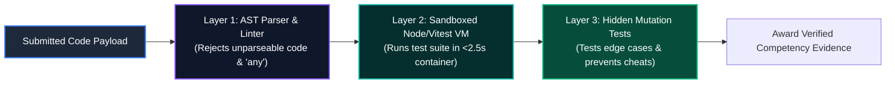
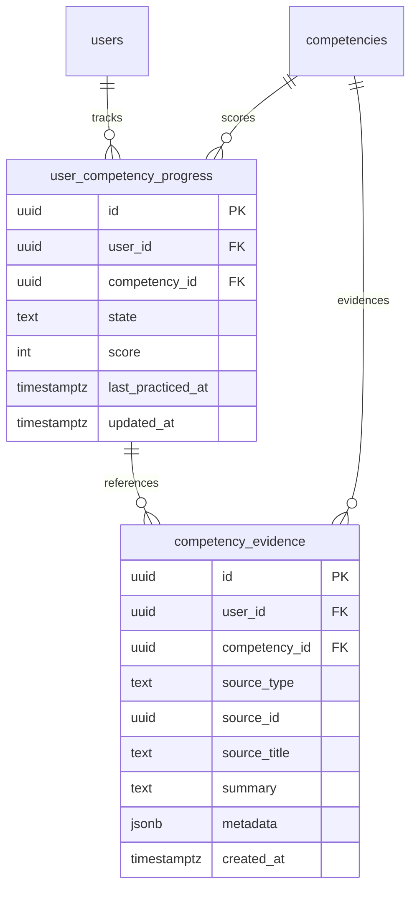
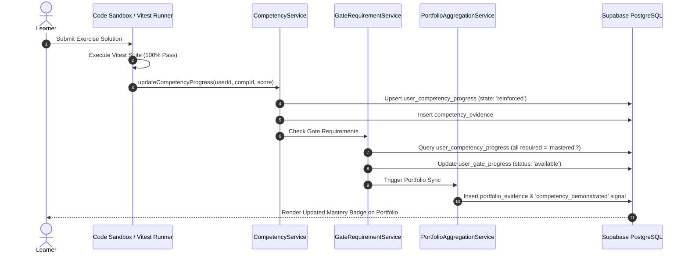

# Canonical Competency Validation Model & Assessment Rubrics
# AI-Native Software Engineering Academy (`ai-native-lms`)

**Document Version:** 1.0.0  
**Status:** Authoritative Assessment Engineering Standard  
**Authority:** Academy Assessment Engineering Board & Principal Systems Architect  
**Target Repository:** `ai-native-lms`  
**Classification:** Core System Specification  
**Effective Date:** September 30, 2026

---

## Table of Contents

1. [Executive Summary](#1-executive-summary)
2. [The 5-State Mastery Finite State Machine](#2-the-5-state-mastery-finite-state-machine)
3. [Quantitative Promotion Formulas & State Thresholds](#3-quantitative-promotion-formulas--state-thresholds)
4. [Multi-Dimensional Assessment Rubric Matrix](#4-multi-dimensional-assessment-rubric-matrix)
5. [Anti-Gaming, AST Analysis & Sandboxed Evaluation Pipeline](#5-anti-gaming-ast-analysis--sandboxed-evaluation-pipeline)
6. [Cryptographic Audit Trail & Evidence Data Model](#6-cryptographic-audit-trail--evidence-data-model)
7. [Capability Gate & Portfolio Synchronization Protocol](#7-capability-gate--portfolio-synchronization-protocol)

---

## 1. Executive Summary

The **Competency Validation Model** is the mathematical and evidentiary engine that determines when a learner has genuinely mastered a technical capability.

To eliminate the "illusion of competence" prevalent in legacy coding education, the Academy enforces a **Zero-Heuristic, Multi-Factor Verification Model**. A learner can never achieve mastery through passive reading, unverified multiple-choice quizzes, or simple substring regex checks.

Every competency score and state transition is derived from **deterministic unit test assertion passes, static AST security analysis, automated cross-tenant penetration tests, and human-evaluated architectural defenses**.

---

## 2. The 5-State Mastery Finite State Machine

Learner progression through every competency is governed by a strict **Finite State Machine (FSM)** tracked in `user_competency_progress`:



### State Definitions & Mathematical Invariants:

```
┌────────────────────────────────────────────────────────────────────────────────────────┐
│                              THE 5-STATE MASTERY MODEL                                 │
├─────────────┬───────────────────────────┬──────────────────────────────────────────────┤
│ State Name  │ Minimum Score Threshold   │ Required Evidentiary Proof                   │
├─────────────┼───────────────────────────┼──────────────────────────────────────────────┤
│ NOT_STARTED │ Score = 0                 │ Default initialization state in database.    │
│ INTRODUCED  │ Score >= 25               │ Lesson read + interactive REPL preview run.  │
│ PRACTICING  │ Score >= 60               │ Verified pass on primary coding exercise lab.│
│ REINFORCED  │ Score >= 85               │ Verified pass on failure-injection suite.    │
│ MASTERED    │ Score >= 95 (Evaluator)   │ Approved Capability Gate artifact / Capstone.│
└─────────────┴───────────────────────────┴──────────────────────────────────────────────┘
```

---

## 3. Quantitative Promotion Formulas & State Thresholds

A learner's score $S(c)$ for a given competency $c$ is a weighted composite score calculated deterministically:

$$S(c) = w_{\text{unit}} \cdot S_{\text{unit}} + w_{\text{edge}} \cdot S_{\text{edge}} + w_{\text{sec}} \cdot S_{\text{sec}} + w_{\text{arch}} \cdot S_{\text{arch}}$$

Where:
- $S_{\text{unit}}$: Pass rate of functional unit test assertions ($w_{\text{unit}} = 0.40$).
- $S_{\text{edge}}$: Pass rate of boundary edge cases and failure injection tests ($w_{\text{edge}} = 0.30$).
- $S_{\text{sec}}$: Pass rate of security and RLS multi-tenant isolation tests ($w_{\text{sec}} = 0.15$).
- $S_{\text{arch}}$: Static code quality, AST validation, and ADR specification rubric ($w_{\text{arch}} = 0.15$).



---

## 4. Multi-Dimensional Assessment Rubric Matrix

When evaluating Capstone milestones, architectural specifications, and Capability Gate submissions, evaluators and automated engines grade across four objective dimensions:

```
┌──────────────────────────────────────────────────────────────────────────────────────────────────┐
│                               MULTI-DIMENSIONAL ASSESSMENT RUBRICS                               │
├────────────────────┬──────────────────────────────────┬──────────────────────────────────────────┤
│ Dimension          │ Evaluation Criteria              │ Unacceptable / Passing Thresholds        │
├────────────────────┼──────────────────────────────────┼──────────────────────────────────────────┤
│ 1. Code Correctness│ • 100% assertions pass in Vitest │ • Unacceptable: Any test assertion fails.│
│    & Invariants    │ • Zero unhandled Promise errors  │ • Passing: 100% assertions green with    │
│                    │ • Zero runtime `any` type casts  │   proper domain error typing.            │
├────────────────────┼──────────────────────────────────┼──────────────────────────────────────────┤
│ 2. Security & RLS  │ • PostgreSQL RLS active on all DB│ • Unacceptable: User A can view User B's │
│    Isolation       │ • Zero token/secret client leaks │   data under any API parameter change.   │
│                    │ • Strict Zod input sanitization  │ • Passing: Automated penetration tests   │
│                    │ • OWASP Top 10 compliance        │   confirm complete tenant isolation.     │
├────────────────────┼──────────────────────────────────┼──────────────────────────────────────────┤
│ 3. Architecture &  │ • Bounded context isolation (DDD)│ • Unacceptable: Ad-hoc spaghetti calls  │
│    ADR Quality     │ • Formal ADR written with trade-off│   bypassing service/repository layer.    │
│                    │ • Finite State Machine invariants│ • Passing: Approved ADR-001.md with      │
│                    │ • Idempotent database migrations │   Mermaid ERD and sequence diagrams.     │
├────────────────────┼──────────────────────────────────┼──────────────────────────────────────────┤
│ 4. Oral Defense &  │ • Verbal articulation of trade-off│ • Unacceptable: Learner cannot explain   │
│    Synthesis       │ • Explaining indexing & schema   │   why code was generated in a specific way│
│                    │ • Explaining AI prompt iteration │ • Passing: Confident 20-min defense      │
│                    │ • Threat modeling defense        │   explaining threat model & database RLS.│
└────────────────────┴──────────────────────────────────┴──────────────────────────────────────────┘
```

---

## 5. Anti-Gaming, AST Analysis & Sandboxed Evaluation Pipeline

To ensure that no student or malicious agent can bypass validation via regex exploitation or copy-pasted LLM hallucinations, the validation pipeline enforces a **3-Layer Verification Gauntlet**:



### Layer 1: Abstract Syntax Tree (AST) Validation
- Submissions are parsed into an AST using the TypeScript compiler API.
- Rejects unparseable syntax, raw `eval()`, prohibited `any` casts, or submissions containing only comments.

### Layer 2: Sandboxed Node.js / Vitest Execution Container
- The submitted code is injected into an isolated execution sandbox.
- Automated Vitest test suites execute against the submission with a **2.5-second execution timeout** and a **64MB memory cap** to prevent infinite loops.

### Layer 3: Hidden Mutation & Invariant Testing
- In addition to visible starter tests, the evaluation runner executes hidden test cases (e.g. empty arrays, unexpected nulls, SQL injection strings) to ensure the learner has implemented a robust solution rather than hardcoding return values.

---

## 6. Cryptographic Audit Trail & Evidence Data Model

Every competency advancement creates an immutable evidence row in the database:



- **`user_competency_progress`**: Enforces `UNIQUE(user_id, competency_id)` and check constraints on `state IN ('not_started', 'introduced', 'practicing', 'reinforced', 'mastered')`.
- **`competency_evidence`**: Append-only log capturing the exact commit SHA, test execution output, or evaluator rubric ID that justified the state advancement.

---

## 7. Capability Gate & Portfolio Synchronization Protocol



By enforcing this mathematical, sandboxed, and tamper-proof validation model, the Academy guarantees that every single competency badge and Capability Gate represents **unquestionable, industry-grade software engineering capability**.
