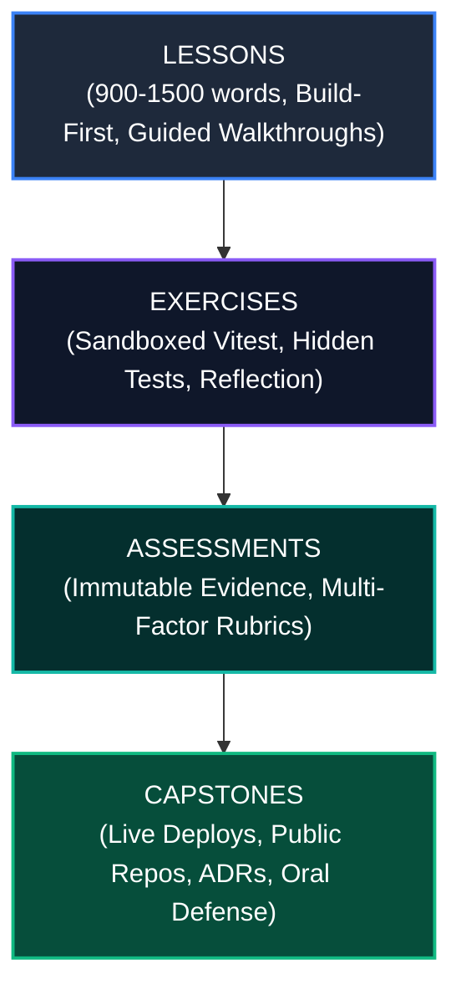
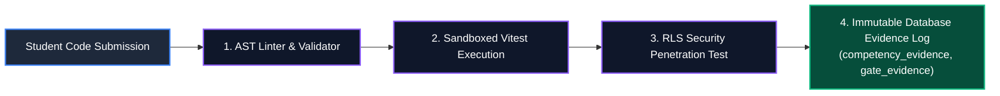

# Content & Assessment Engineering Standards
# AI-Native Software Engineering Academy (`ai-native-lms`)

**Document Version:** 1.0.0  
**Status:** Permanent Authoritative Content Specification  
**Authority:** Academy Content Engineering Lead & Master Instructional Designer  
**Scope:** Curriculum Lessons, Interactive Exercises, Competency Assessments & Capstone Projects  
**Classification:** Core System Standard  
**Target Repository:** `ai-native-lms`  
**Effective Date:** September 30, 2026

---

## Table of Contents

1. [Executive Summary & Quality Charter](#1-executive-summary--quality-charter)
2. [Lesson Authoring Standards](#2-lesson-authoring-standards)
3. [Interactive Exercise Standards](#3-interactive-exercise-standards)
4. [Competency Assessment & Evidence Standards](#4-competency-assessment--evidence-standards)
5. [Capstone Project & Portfolio Deliverable Standards](#5-capstone-project--portfolio-deliverable-standards)
6. [Content Quality Assurance (QA) & Publishing Gate](#6-content-quality-assurance-qa--publishing-gate)

---

## 1. Executive Summary & Quality Charter

The **Content & Assessment Engineering Standards** govern the creation, review, and publication of all instructional content, coding labs, evaluation harnesses, and capstone specifications across the Academy.

### The Zero-Placeholder Law:
- **No Stub Lessons**: No published lesson may contain placeholder text, summaries, or under-developed prose.
- **No Regex Hacks**: No exercise may use string matching (`code.includes()`) as a substitute for real test execution.
- **No Phantom Credentials**: Every assessment and gate clearance requires verifiable, cryptographically stored digital evidence.



---

## 2. Lesson Authoring Standards

Every lesson published in the LMS must strictly adhere to the following quantitative and structural standards:

```
┌────────────────────────────────────────────────────────────────────────────────────────┐
│                              LESSON QUALITY BENCHMARKS                                 │
├────────────────────────────┬───────────────────────────────────────────────────────────┤
│ Length & Depth Standard    │ 900 to 1,500 words minimum of substantive technical prose.│
├────────────────────────────┼───────────────────────────────────────────────────────────┤
│ Mandatory Visualization    │ Minimum 1 Mermaid diagram or SVG architectural dataflow.  │
├────────────────────────────┼───────────────────────────────────────────────────────────┤
│ Code Walkthrough Density   │ Minimum 2 complete, annotated, production-grade snippets. │
├────────────────────────────┼───────────────────────────────────────────────────────────┤
│ Prerequisite Gating        │ Explicit prerequisite checklist and self-diagnostic check.│
├────────────────────────────┼───────────────────────────────────────────────────────────┤
│ Pedagogical Sequence       │ Strict 6-Stage "Build-First" instructional progression.   │
├────────────────────────────┼───────────────────────────────────────────────────────────┤
│ Interactive Terminology    │ Tooltip popovers for all technical jargon and domain terms│
└────────────────────────────┴───────────────────────────────────────────────────────────┘
```

### 2.1 The Mandatory 6-Part Lesson Structure:


1. **Section 1: Prerequisite Check & The Industrial Hook (150–200 words)**
   - *Prerequisite Self-Check*: Explicit bulleted list of concepts and competencies required.
   - *The Industrial Hook*: Real-world enterprise context explaining why this topic matters and what catastrophic outage or security breach occurs when it is ignored.
2. **Section 2: Interactive Sandbox Preview (100–150 words)**
   - An embedded, working code component or live REPL sandbox. The learner interacts with working software before reading abstract syntax.
3. **Section 3: Step-by-Step Guided Walkthrough (300–450 words)**
   - Complete production code implementation with line-by-line annotations.
   - Accompanying Mermaid sequence or state diagram illustrating dataflow and component boundaries.
4. **Section 4: Core Mental Models & Underlying Mechanics (250–350 words)**
   - Deconstructs the *why*: runtime memory models, event loops, compiler checks, or database indexing mechanics.
5. **Section 5: Failure Modes, Edge Cases & Hallucination Analysis (150–200 words)**
   - Demonstrates common junior mistakes, anti-patterns, and typical AI hallucination patterns in this domain.
6. **Section 6: Key Takeaways & Lab Challenge Bridge (50–100 words)**
   - Summary synthesis and direct transition into the associated coding exercise.

---

## 3. Interactive Exercise Standards

Coding exercises must be authentic engineering challenges evaluated by **real runtime execution environments**:

```
┌────────────────────────────────────────────────────────────────────────────────────────┐
│                             EXERCISE ENGINEERING STANDARDS                             │
├────────────────────────────┬───────────────────────────────────────────────────────────┤
│ Execution Environment      │ Isolated Node.js / Vitest VM container. Zero regex mocks. │
├────────────────────────────┼───────────────────────────────────────────────────────────┤
│ Execution Latency & Memory │ Maximum execution timeout: 2.5s | Memory ceiling: 64MB.   │
├────────────────────────────┼───────────────────────────────────────────────────────────┤
│ Test Suite Composition     │ Minimum 3 Visible Starter Tests + 3 Hidden Mutation Tests.│
├────────────────────────────┼───────────────────────────────────────────────────────────┤
│ AST Syntax Gating          │ TypeScript AST validation: rejects syntax errors & `any`. │
├────────────────────────────┼───────────────────────────────────────────────────────────┤
│ Cognitive Reflection       │ Mandatory 2-question post-submission architectural prompt.│
├────────────────────────────┼───────────────────────────────────────────────────────────┤
│ Granular Assertion Scoring │ Multi-assertion weighted scoring (0–100%).                │
└────────────────────────────┴───────────────────────────────────────────────────────────┘
```

### 3.1 Executable Test Harness Specification
Every exercise must define a complete, executable test suite adhering to standard Vitest syntax:

```typescript
import { describe, it, expect } from "vitest";
import { solveChallenge } from "./submission";

describe("Exercise Validation Suite", () => {
  // VISIBLE TESTS (Learner sees these in the editor)
  describe("Visible Baseline Invariants", () => {
    it("satisfies standard happy-path inputs", async () => {
      const result = await solveChallenge({ input: "valid_payload" });
      expect(result.success).toBe(true);
    });
  });

  // HIDDEN MUTATION TESTS (Guards against hardcoded outputs)
  describe("Hidden Edge-Case Invariants", () => {
    it("handles empty arrays, null values, and boundary conditions", async () => {
      await expect(solveChallenge({ input: "" })).rejects.toThrow();
    });

    it("rejects malicious injection and unauthorized tenant queries", async () => {
      const result = await solveChallenge({ input: "DROP TABLE users;" });
      expect(result.sanitized).toBe(true);
    });
  });
});
```

### 3.2 Mandatory Post-Exercise Reflection Prompt
Upon passing an exercise, the UI prompts the learner with two mandatory cognitive reflection questions before awarding XP:
1. *Architectural Trade-Off*: "Why is this solution preferable to a simpler brute-force approach?"
2. *Failure-Mode Diagnosis*: "Under what high-scale or concurrency scenario would this implementation fail?"

---

## 4. Competency Assessment & Evidence Standards

Assessments must produce **permanent, traceable digital evidence**:



### 4.1 Evidentiary Record Requirements
Every assessment recorded in `competency_evidence` and `gate_evidence` must store:
- `source_id`: Foreign key reference to the exercise or capstone deliverable.
- `source_type`: One of `exercise_completion`, `gate_validation`, `capstone_submission`, `oral_defense`.
- `metadata`: JSON payload capturing git commit SHA, test execution duration (ms), test assertion pass count, and evaluator rubric scores.
- `evidence_reference`: Public URL or cryptographic hash verifying artifact existence.

### 4.2 Multi-Factor Assessment Rubric

```
┌──────────────────────────────────────────────────────────────────────────────────────────────────┐
│                               4-FACTOR ASSESSMENT RUBRIC MATRIX                                  │
├────────────────────┬──────────────────────────────────┬──────────────────────────────────────────┤
│ Evaluation Factor  │ Required Evidence                │ Passing Standard                         │
├────────────────────┼──────────────────────────────────┼──────────────────────────────────────────┤
│ 1. Correctness     │ 100% assertions green in Vitest  │ Zero failed tests; zero `any` types.     │
├────────────────────┼──────────────────────────────────┼──────────────────────────────────────────┤
│ 2. Security & RLS  │ Automated penetration test run   │ Complete tenant data isolation under RLS.│
├────────────────────┼──────────────────────────────────┼──────────────────────────────────────────┤
│ 3. Architecture    │ Authored ADR Markdown document   │ Clear boundaries, FSM invariants & ERD.  │
├────────────────────┼──────────────────────────────────┼──────────────────────────────────────────┤
│ 4. Oral Defense    │ 20-minute video defense recording│ Evaluator rubric score >= 85 / 100.      │
└────────────────────┴──────────────────────────────────┴──────────────────────────────────────────┘
```

---

## 5. Capstone Project & Portfolio Deliverable Standards

Every Capstone Project must produce **four verified public portfolio deliverables**:

```
┌────────────────────────────────────────────────────────────────────────────────────────┐
│                              CAPSTONE DELIVERABLE STANDARDS                            │
├────┬─────────────────────────────┬─────────────────────────────────────────────────────┤
│ 1  │ Public GitHub Repository    │ Clean Git history with 100+ atomic verified commits.│
├────┼─────────────────────────────┼─────────────────────────────────────────────────────┤
│ 2  │ Live Cloud Deployment URL   │ Hosted on Vercel/AWS/Railway with SSL & health check│
├────┼─────────────────────────────┼─────────────────────────────────────────────────────┤
│ 3  │ Architectural Decision Rec. │ Formal `ADR-001.md` documenting trade-offs & schemas│
├────┼─────────────────────────────┼─────────────────────────────────────────────────────┤
│ 4  │ Recorded Technical Defense  │ 20-minute video defending system architecture & RLS.│
└────┴─────────────────────────────┴─────────────────────────────────────────────────────┘
```

### Staged Milestone Progression:
- **Milestone 1 (Architecture RFC)**: Architectural design, Mermaid ERD, OpenAPI/Zod contracts.
- **Milestone 2 (Database & API)**: Supabase PostgreSQL migration, RLS policies, Server Actions, integration test suites.
- **Milestone 3 (Frontend UI & State)**: Next.js 15 App Router, Tailwind CSS, Zustand state stores, WCAG AA accessibility.
- **Milestone 4 (Production Deploy & Defense)**: Multi-stage Docker container, GitHub Actions CI/CD, live deployment, oral defense recording.

---

## 6. Content Quality Assurance (QA) & Publishing Gate

Before any lesson, exercise, or capstone specification is merged into production seeds (`supabase/seed.sql`), it must pass the **Automated Content QA Gate**:

```
┌────────────────────────────────────────────────────────────────────────────────────────┐
│                               CONTENT QA VERIFICATION GATE                             │
├─────────────────────────┬─────────────────────────┬────────────────────────────────────┤
│ QA Check Vector         │ Standard Threshold      │ Automated Tool / Command           │
├─────────────────────────┼─────────────────────────┼────────────────────────────────────┤
│ Word Count Audit        │ >= 900 and <= 1,500 wds │ Automated Word Count Linter Script │
│ Diagram Inclusion Check │ >= 1 Mermaid / SVG block│ Markdown AST Structure Validator   │
│ Code Snippet Annotation │ >= 2 Annotated snippets │ Code Block Comment Linter          │
│ Vitest Test Execution   │ 100% Pass Rate          │ `npx vitest run`                   │
│ TypeScript Compilation  │ 0 Errors                │ `npx tsc --noEmit`                 │
│ ESLint Code Quality     │ 0 Errors, 0 Warnings    │ `npm run lint`                     │
│ RLS Security Compliance │ 100% Tables Protected   │ Supabase RLS Policy Linter         │
└─────────────────────────┴─────────────────────────┴────────────────────────────────────┘
```

By enforcing these uncompromising standards, the Academy ensures that every lesson provides deep instructional value, every exercise executes real verification, and every graduate produces an undeniable portfolio of enterprise software engineering mastery.
