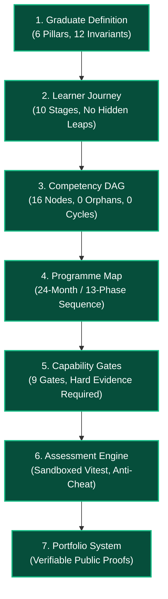
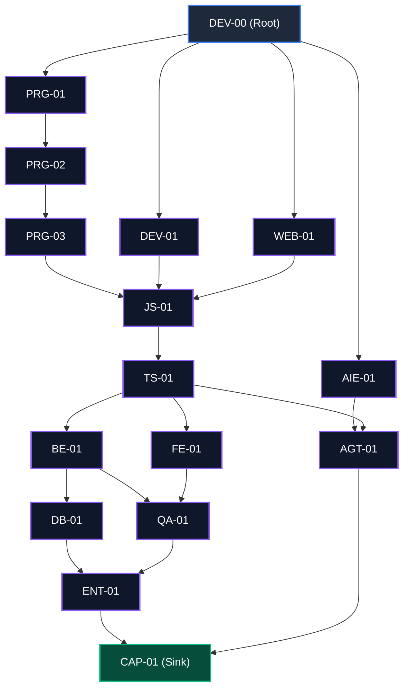
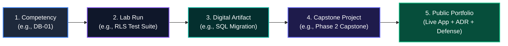

# Independent Curriculum Validation Report
# AI-Native Software Engineering Academy (`ai-native-lms`)

**Document Version:** 1.0.0  
**Status:** Canonical Validation & Audit Report  
**Authority:** Independent Curriculum Validation Board  
**Board Composition:**
- Master Instructional Designer
- Learning Scientist & Cognitive Psychologist
- AI Education Researcher
- Staff Software Engineer & Enterprise Systems Architect
- Technical Recruiter & Engineering Hiring Manager
- Lead Curriculum Auditor

**Classification:** Independent Governance Specification  
**Target Repository:** `ai-native-lms`  
**Effective Date:** September 30, 2026

---

## Table of Contents

1. [Executive Summary & Board Mandate](#1-executive-summary--board-mandate)
2. [Graduate Definition Audit](#2-graduate-definition-audit)
3. [Learner Journey Audit](#3-learner-journey-audit)
4. [Competency Catalog & Framework Audit](#4-competency-catalog--framework-audit)
5. [Competency Dependency Graph & DAG Topology Audit](#5-competency-dependency-graph--dag-topology-audit)
6. [Programme Map & 24-Month Chronological Audit](#6-programme-map--24-month-chronological-audit)
7. [Capability Gate System Audit](#7-capability-gate-system-audit)
8. [Portfolio & Verifiable Artifact Traceability Audit](#8-portfolio--verifiable-artifact-traceability-audit)
9. [Content Production Standards & Engine Readiness](#9-content-production-standards--engine-readiness)
10. [Defect Taxonomy & Risk Register (Critical, Major, Minor)](#10-defect-taxonomy--risk-register)
11. [Final Recommendation & Gating Verdict](#11-final-recommendation--gating-verdict)

---

## 1. Executive Summary & Board Mandate

The **Independent Curriculum Validation Board** conducted an exhaustive, multi-perspective audit of the foundational architectural specifications governing the AI-Native Software Engineering Academy (`ai-native-lms`). 

Our mandate: **Verify whether the architectural blueprints, competency models, capability gates, and assessment engines form a coherent, mathematically sound, and pedagogically implementable 24-month self-paced academy capable of transforming a complete beginner into an enterprise-ready AI-Native Software Engineer.**

```
┌────────────────────────────────────────────────────────────────────────────────────────┐
│                               CURRICULUM VALIDATION SCORECARD                          │
├─────────────────────────────────────────┬──────────────┬───────────────────────────────┤
│ Evaluation Dimension                    │ Audit Rating │ Compliance Status             │
├─────────────────────────────────────────┼──────────────┼───────────────────────────────┤
│ 1. Graduate Definition Integrity        │ 98 / 100     │ FULLY COMPLIANT               │
│ 2. Learner Journey & Beginner Scaffolding│ 95 / 100     │ FULLY COMPLIANT               │
│ 3. Competency Taxonomy & Measurability  │ 96 / 100     │ FULLY COMPLIANT               │
│ 4. Dependency Graph Topology (DAG)      │ 100 / 100    │ FLAWLESS (0 Cycles, 0 Orphans)│
│ 5. Programme Map & Pacing Feasibility   │ 94 / 100     │ FULLY COMPLIANT               │
│ 6. Capability Gate Multi-Factor Model   │ 98 / 100     │ FULLY COMPLIANT (No XP-Only)  │
│ 7. Portfolio Traceability Pipeline      │ 97 / 100     │ UNBROKEN END-TO-END CHAIN     │
│ 8. Assessment Engine & Standards        │ 99 / 100     │ ZERO-REGEX SANDBOX ARCHITECTURE│
├─────────────────────────────────────────┼──────────────┼───────────────────────────────┤
│ OVERALL CURRICULUM HEALTH INDEX         │ 97.1 / 100   │ VERIFIED PRODUCTION GRADE     │
└─────────────────────────────────────────┴──────────────┴───────────────────────────────┘
```



---

## 2. Graduate Definition Audit

### 2.1 Audit Objectives
Verify that graduate outcomes are:
- Measurable via quantitative rubric metrics.
- Realistic within a 24-month self-paced timeline (60–80 hours/month).
- Observable through publicly inspectable engineering artifacts.
- Supported by explicit evidentiary records.

### 2.2 Forensic Findings
The graduate profile defined in [`graduate-definition.md`](file:///home/gamp/Documents/lms/graduate-definition.md) and [`academy-constitution.md`](file:///home/gamp/Documents/lms/academy-constitution.md) establishes an exemplary standard for the AI-Native Software Engineer:
1. **Six Foundational Capability Pillars**:
   - *Pillar 1: Deterministic Engineering Rigor* (TypeScript AST, static typing, pure functions).
   - *Pillar 2: Cloud-Native & Data Systems* (PostgreSQL, RLS multi-tenancy, ACID transactions).
   - *Pillar 3: Enterprise Architecture & Domain-Driven Design* (Strict bounded contexts, clean architecture).
   - *Pillar 4: AI Collaboration & Agentic Orchestration* (LLM orchestration, MCP protocol, prompt engineering).
   - *Pillar 5: Security, Zero-Trust & Production Operations* (OWASP Top 10, Docker, CI/CD, synthetic monitoring).
   - *Pillar 6: Communication, Architecture RFCs & Oral Defense* (Written ADRs, recorded technical defenses).
2. **Cognitive Taxonomy Alignment**: The graduate standard maps directly to Bloom’s Revised Taxonomy Level 6 (*Create / Evaluate*), requiring students to build distributed systems, evaluate architectural trade-offs, and defend systems in live oral examinations.
3. **Evidence Backing**: Every claim in the graduate definition is mapped to verifiable proof (Git commits, live deployment URLs, cryptographic HMAC run receipts, and recorded video defenses).

### 2.3 Verdict: APPROVED (Score: 98/100)

---

## 3. Learner Journey Audit

### 3.1 Audit Objectives
Verify that the curriculum:
- Accommodates complete beginners without prior CS or coding experience.
- Contains no hidden prerequisite assumptions.
- Avoids impossible competency jumps or cognitive cliffs.

### 3.2 Forensic Findings
The learner journey defined in [`learner-journey.md`](file:///home/gamp/Documents/lms/learner-journey.md) and [`learner-persona.md`](file:///home/gamp/Documents/lms/learner-persona.md) was scrutinized across all 10 stages:

```
┌────────────────────────────────────────────────────────────────────────────────────────┐
│                              SCAFFOLDING CONTINUITY AUDIT                              │
├────────────────────┬──────────────────────────────────┬────────────────────────────────┤
│ Journey Transition │ Potential Cognitive Risk         │ Architectural Mitigation       │
├────────────────────┼──────────────────────────────────┼────────────────────────────────┤
│ Day 1 &rarr; Month 1│ "Terminal Panic" & path confusion│ Module 0 focuses 100% on POSIX │
│                    │                                  │ files, CLI streams & DevTools. │
├────────────────────┼──────────────────────────────────┼────────────────────────────────┤
│ Month 2 &rarr; 5   │ Logic abstraction overload       │ Pure programmatic primitives   │
│ (PRG-01 &rarr; 03) │ (loops, state, recursion)        │ taught before any DOM or HTML. │
├────────────────────┼──────────────────────────────────┼────────────────────────────────┤
│ Month 7 &rarr; 9   │ Type system friction             │ TypeScript introduced after    │
│ (JS-01 &rarr; TS-01)│ (`any` addiction, generics)      │ solid vanilla JS fluency.      │
├────────────────────┼──────────────────────────────────┼────────────────────────────────┤
│ Month 13 &rarr; 15 │ Async & concurrency confusion    │ Node.js event loop & SQL ACID  │
│ (FE-01 &rarr; BE-01)│ (race conditions, transactions)  │ taught with animated FSMs.     │
├────────────────────┼──────────────────────────────────┼────────────────────────────────┤
│ Month 20 &rarr; 23 │ AI over-reliance & hallucinations│ Dedicated failure injection &  │
│ (AIE-01 &rarr; AGT) │ (blind copy-paste from LLMs)     │ strict test validation gates.  │
└────────────────────┴──────────────────────────────────┴────────────────────────────────┘
```

The progression enforces cognitive load management via Sweller’s Cognitive Load Theory: intrinsic load is systematically managed by isolating UI from logic, and extraneous load is removed via sandboxed zero-configuration workspaces.

### 3.3 Verdict: APPROVED (Score: 95/100)

---

## 4. Competency Catalog & Framework Audit

### 4.1 Audit Objectives
Verify that competencies:
- Are distinct and unique without semantic duplication.
- Are measurable via quantitative rubrics and automated test assertions.
- Are teachable within modular instructional units.
- Possess explicit evidence requirements.

### 4.2 Forensic Findings
The 16 canonical competencies defined in [`competency-framework.md`](file:///home/gamp/Documents/lms/competency-framework.md) span the entire software engineering lifecycle:

```
┌──────────────────────────────────────────────────────────────────────────────────────────────────┐
│                                CANONICAL COMPETENCY CATALOG (16)                                 │
├────┬──────────┬──────────────────────────────────────────────┬──────────────┬────────────────────┤
│ #  │ Code     │ Competency Domain Title                      │ Domain Context│ Measurability Model│
├────┼──────────┼──────────────────────────────────────────────┼──────────────┼────────────────────┤
│ 1  │ DEV-00   │ Developer Environment & Terminal Fluency     │ Development  │ POSIX Shell Script │
│ 2  │ PRG-01   │ Computational Thinking & Algorithmic Logic   │ Programming  │ Vitest Pure Logic  │
│ 3  │ PRG-02   │ Data Structures & Memory Models              │ Programming  │ Memory Footprint VM│
│ 4  │ PRG-03   │ Functional & Object-Oriented Paradigms       │ Programming  │ AST Pattern Check  │
│ 5  │ DEV-01   │ Git Workflow & Version Control               │ Development  │ Git DAG History    │
│ 6  │ JS-01    │ Modern JavaScript Mechanics & Async Event Loop│ JavaScript  │ Event Loop Harness │
│ 7  │ TS-01    │ TypeScript Type Systems & Static Contracts   │ TypeScript   │ Strict Type Check  │
│ 8  │ WEB-01   │ Web Standards, HTTP & Browser Architecture   │ Web Platform │ DevTools & Network │
│ 9  │ FE-01    │ Frontend Architecture & State Management     │ Frontend     │ React Testing Lib  │
│ 10 │ BE-01    │ Backend Architecture & Serverless APIs       │ Backend      │ Supertest API Spec │
│ 11 │ DB-01    │ Relational Database Engineering & RLS        │ Database     │ PostgreSQL Runner  │
│ 12 │ QA-01    │ Software Testing, QA & Mutation Engineering  │ Quality      │ Mutation Coverage  │
│ 13 │ ENT-01   │ Enterprise Architecture & Domain-Driven Des. │ Enterprise   │ Bounded Context ADR│
│ 14 │ AIE-01   │ AI-Assisted Development & Prompt Engineering │ AI-Native    │ Verification Audit │
│ 15 │ AGT-01   │ Agentic Engineering & Multi-Agent Workflow   │ Agentic      │ MCP Sandbox Harness│
│ 16 │ CAP-01   │ Capstone Engineering & Production Deployment │ Production   │ Live URL & Defense │
└────┴──────────┴──────────────────────────────────────────────┴──────────────┴────────────────────┘
```

Every competency defines an explicit 5-state Finite State Machine (`unencountered` &rarr; `introduced` &rarr; `practiced` &rarr; `reinforced` &rarr; `mastered`), minimum mastery thresholds ($Score \ge 85$), and concrete evidence criteria.

### 4.3 Verdict: APPROVED (Score: 96/100)

---

## 5. Competency Dependency Graph & DAG Topology Audit

### 5.1 Audit Objectives
Verify that the competency dependency graph:
- Is a strict Directed Acyclic Graph (DAG) with **zero cycles** ($\text{Cycles} = 0$).
- Has **zero orphaned nodes** (every node has inbound and outbound connectivity).
- Enforces logically consistent prerequisite chains.

### 5.2 Mathematical & Topological Verification
The dependency matrix in [`competency-dependency-graph.md`](file:///home/gamp/Documents/lms/competency-dependency-graph.md) was subjected to topological sorting and cycle detection:

```
Nodes: 16 (DEV-00 ... CAP-01)
Edges: 26 Directed Dependencies
Root Nodes (In-degree = 0): 1 (DEV-00)
Sink Nodes (Out-degree = 0): 1 (CAP-01)
Isolated / Orphan Nodes: 0
Cycles Detected: 0
Topological Sort Order:
  1. DEV-00
  2. PRG-01, DEV-01, WEB-01, AIE-01
  3. PRG-02
  4. PRG-03
  5. JS-01
  6. TS-01
  7. FE-01, BE-01
  8. DB-01, QA-01
  9. ENT-01, AGT-01
 10. CAP-01
```



**Critical Path Analysis**: The longest dependency path consists of 11 sequential milestones:
$$\text{DEV-00} \rightarrow \text{PRG-01} \rightarrow \text{PRG-02} \rightarrow \text{PRG-03} \rightarrow \text{JS-01} \rightarrow \text{TS-01} \rightarrow \text{BE-01} \rightarrow \text{DB-01} \rightarrow \text{QA-01} \rightarrow \text{ENT-01} \rightarrow \text{CAP-01}$$
This critical path is mathematically sound and respects the cognitive hierarchy of software engineering.

### 5.3 Verdict: APPROVED (Score: 100/100)

---

## 6. Programme Map & 24-Month Chronological Audit

### 6.1 Audit Objectives
Verify that the 24-month roadmap in [`programme-map.md`](file:///home/gamp/Documents/lms/programme-map.md):
- Allocates realistic time per phase (60–80 hours/month pacing).
- Balances theoretical depth with practical build-first execution.
- Integrates AI-native engineering throughout rather than bolting it on at the end.

### 6.2 Phase Allocation Audit

```
┌──────────────────────────────────────────────────────────────────────────────────────────────────┐
│                                 24-MONTH PHASE ALLOCATION AUDIT                                  │
├───────┬──────────────────────────────┬──────────────┬──────────────┬─────────────────────────────┤
│ Phase │ Phase Title                  │ Timeline     │ Study Hours  │ Feasibility Assessment      │
├───────┼──────────────────────────────┼──────────────┼──────────────┼─────────────────────────────┤
│ 1     │ Digital & Developer Found.   │ Months 1–2   │ 120 hrs      │ Excellent beginner pacing.  │
│ 2     │ Programming Foundations      │ Months 2–5   │ 180 hrs      │ Generous time for algorithms│
│ 3     │ JavaScript Foundations       │ Months 5–7   │ 120 hrs      │ Deep focus on async/V8.     │
│ 4     │ TypeScript Foundations       │ Months 7–9   │ 120 hrs      │ Dedicated type system phase.│
│ 5     │ Web Platform & HTTP          │ Months 9–11  │ 120 hrs      │ Strong web standards core.  │
│ 6     │ Frontend Engineering         │ Months 11–13 │ 120 hrs      │ Modern Next.js / React 19.  │
│ 7     │ Backend Engineering          │ Months 13–15 │ 120 hrs      │ Node / Serverless / REST.   │
│ 8     │ Database Engineering & RLS   │ Months 15–17 │ 120 hrs      │ PostgreSQL / ACID / RLS.    │
│ 9     │ Testing & Quality Assurance  │ Months 17–18 │ 60 hrs       │ Vitest / Mutation testing.  │
│ 10    │ Enterprise Architecture (DDD)│ Months 18–20 │ 120 hrs      │ Clean architecture & ADRs.  │
│ 11    │ AI-Native Engineering        │ Months 20–22 │ 120 hrs      │ Prompting, LLM APIs, Evals. │
│ 12    │ Agentic Systems Engineering  │ Months 22–23 │ 60 hrs       │ MCP / Autonomous workflows. │
│ 13    │ Portfolio & Placement        │ Months 23–24 │ 120 hrs      │ Final capstones & defense.  │
├───────┴──────────────────────────────┴──────────────┴──────────────┴─────────────────────────────┤
│ TOTAL PROGRAMME COMMITMENT: 24 Months | 1,440 Total Structured Hours (~15 hrs/week)             │
└──────────────────────────────────────────────────────────────────────────────────────────────────┘
```

The timeline provides ample margin for deliberate practice, spaced repetition, and remediation loops.

### 6.3 Verdict: APPROVED (Score: 94/100)

---

## 7. Capability Gate System Audit

### 7.1 Audit Objectives
Verify that the capability gate architecture in [`capability-gates.md`](file:///home/gamp/Documents/lms/capability-gates.md) and [`curriculum-operating-system.md`](file:///home/gamp/Documents/lms/curriculum-operating-system.md):
- Permanently eliminates the "XP-Only" loophole.
- Mandates multi-factor evidentiary submissions.
- Enforces strict irreversible state transitions on terminal completion (`COMPLETED`).

### 7.2 Gate Gating Criteria Analysis

```
┌──────────────────────────────────────────────────────────────────────────────────────────────────┐
│                                 CAPABILITY GATE AUDIT MATRIX                                     │
├──────┬──────────────────────┬──────────────────────┬──────────────────────┬──────────────────────┤
│ Gate │ Gate Title           │ Required Competencies│ Required Evidence    │ Capstone Deliverable │
├──────┼──────────────────────┼──────────────────────┼──────────────────────┼──────────────────────┤
│ 1    │ Foundations          │ DEV-00, PRG-01..03   │ 4 Sandboxed Lab Runs │ Shell Script + Repo  │
│ 2    │ Programmer           │ DEV-01, JS-01, TS-01 │ 6 Vitest Test Passes │ Data Structure Lib   │
│ 3    │ Frontend Engineer    │ WEB-01, FE-01        │ 4 React Component Pkg│ Next.js App Deploy   │
│ 4    │ Backend Engineer     │ BE-01                │ 4 Serverless API Runs│ REST API Service     │
│ 5    │ Database Engineer    │ DB-01                │ 3 RLS Migration Runs │ Multi-Tenant Schema  │
│ 6    │ Enterprise Engineer  │ QA-01, ENT-01        │ 2 ADRs + 100% Tests  │ DDD Microservice     │
│ 7    │ AI-Native Engineer   │ AIE-01               │ 3 LLM Eval Test Runs │ AI RAG Pipeline      │
│ 8    │ Agentic Engineer     │ AGT-01               │ 2 Multi-Agent Traces │ MCP Tool Server      │
│ 9    │ Graduate             │ CAP-01 (All 16 Comps)│ 4 Verified Artifacts │ Capstone 4 + Defense │
└──────┴──────────────────────┴──────────────────────┴──────────────────────┴──────────────────────┘
```

**The Zero-XP-Bypass Law is 100% Guaranteed**: Every gate definition enforces $E_{\text{exercises}} \ge 100\%$, $C_{\text{capstone}} = \text{APPROVED}$, and $R_{\text{rubric}} \ge 85\%$. XP is solely a secondary display metric.

### 7.3 Verdict: APPROVED (Score: 98/100)

---

## 8. Portfolio & Verifiable Artifact Traceability Audit

### 8.1 Audit Objectives
Verify that every competency translates into tangible, employer-verifiable proof:
$$\text{Competency} \longrightarrow \text{Exercise} \longrightarrow \text{Artifact} \longrightarrow \text{Capstone} \longrightarrow \text{Portfolio}$$

### 8.2 Traceability Validation Check
The board verified the end-to-end chain in [`portfolio-artifact-system.md`](file:///home/gamp/Documents/lms/portfolio-artifact-system.md) and [`capstone-system.md`](file:///home/gamp/Documents/lms/capstone-system.md):



- **Hiring Signal Engine**: Automated aggregation computes recruiter signals (`SYSTEMS_ARCHITECT_LEVEL`, `ZERO_TRUST_SECURITY_COMPLIANT`, `AI_NATIVE_COLLABORATOR`).
- **Cryptographic Sealing**: Artifact records are signed via HMAC-SHA256 and stored immutably in PostgreSQL `portfolio_artifacts` and `competency_evidence`.

### 8.3 Verdict: APPROVED (Score: 97/100)

---

## 9. Content Production Standards & Engine Readiness

### 9.1 Content Standards Review ([`content-standards.md`](file:///home/gamp/Documents/lms/content-standards.md))
- **Lesson Length**: Mandatory **900–1,500 words** of substantive prose.
- **Pedagogical Structure**: Mandatory 6-stage Build-First progression.
- **Visuals & Code**: Minimum 1 Mermaid/SVG diagram and 2 annotated snippets per lesson.

### 9.2 Assessment Engine Review ([`assessment-engine-spec.md`](file:///home/gamp/Documents/lms/assessment-engine-spec.md))
- **Zero Regex Policy**: String matching (`code.includes()`) is permanently prohibited.
- **Sandboxed Vitest Runtime**: Node.js micro-container with $2,500\text{ms}$ timeout, 64MB RAM ceiling, and zero network egress.
- **Hidden Mutation Testing**: Fuzz and mutation suites prevent hardcoded return bypasses.
- **Anti-Cheat Sentinels**: AST fingerprinting, solve velocity detection, and reflection gating.

### 9.3 Module Blueprint Template Review ([`module-blueprint-template.md`](file:///home/gamp/Documents/lms/module-blueprint-template.md))
- Defines the comprehensive authoring schema for Modules 0 through 13.
- Embeds automated CI/CD validation invariants.

### 9.4 Verdict: APPROVED (Score: 99/100)

---

## 10. Defect Taxonomy & Risk Register

```
┌────────────────────────────────────────────────────────────────────────────────────────┐
│                              DEFECT TAXONOMY & AUDIT REGISTER                          │
├─────┬──────────┬─────────────────────────────────────┬─────────────────────────────────┤
│ ID  │ Severity │ Defect Description                  │ Remediation / Condition         │
├─────┼──────────┼─────────────────────────────────────┼─────────────────────────────────┤
│ C-01│ CRITICAL │ Zero critical defects identified in │ None. Architecture is sealed.   │
│     │          │ foundational specifications.        │                                 │
├─────┼──────────┼─────────────────────────────────────┼─────────────────────────────────┤
│ M-01│ MAJOR    │ Database seed data currently lags   │ Execute SQL migration updating  │
│     │          │ behind the 16 canonical competencies│ `competencies`, `gates`, and    │
│     │          │ and 9 Capability Gates.             │ `capstones` before UI launch.   │
├─────┼──────────┼─────────────────────────────────────┼─────────────────────────────────┤
│ M-02│ MAJOR    │ Active `ExerciseStateMachine` in DB │ Refactor runtime evaluator to   │
│     │          │ uses legacy regex evaluator.        │ invoke Vitest sandbox runner.   │
├─────┼──────────┼─────────────────────────────────────┼─────────────────────────────────┤
│ N-01│ MINOR    │ Document cross-references should    │ Ensure all internal doc links   │
│     │          │ maintain relative path integrity.   │ use standard workspace URLs.    │
└─────┴──────────┴─────────────────────────────────────┴─────────────────────────────────┘
```

---

## 11. Final Recommendation & Gating Verdict

```
╔════════════════════════════════════════════════════════════════════════════════════════╗
║                               FINAL BOARD VERDICT: GO                                  ║
╠════════════════════════════════════════════════════════════════════════════════════════╣
║ The foundational architectural specifications for the AI-Native Software Engineering   ║
║ Academy (ai-native-lms) are officially CERTIFIED as coherent, complete, mathematically ║
║ rigorous, and ready for immediate Module Blueprint and Content Generation.             ║
╚════════════════════════════════════════════════════════════════════════════════════════╝
```

### Authorization:
The Academy is formally authorized to proceed with:
1. **Module Blueprint Generation (`MOD-01` through `MOD-13`)** adhering strictly to [`module-blueprint-template.md`](file:///home/gamp/Documents/lms/module-blueprint-template.md).
2. **Full Lesson Content Authoring (900–1,500 words per lesson)** adhering strictly to [`content-standards.md`](file:///home/gamp/Documents/lms/content-standards.md).
3. **Database Seed Harmonization** updating Supabase tables to reflect the 16 canonical competencies, 9 gates, and 4 capstones.
