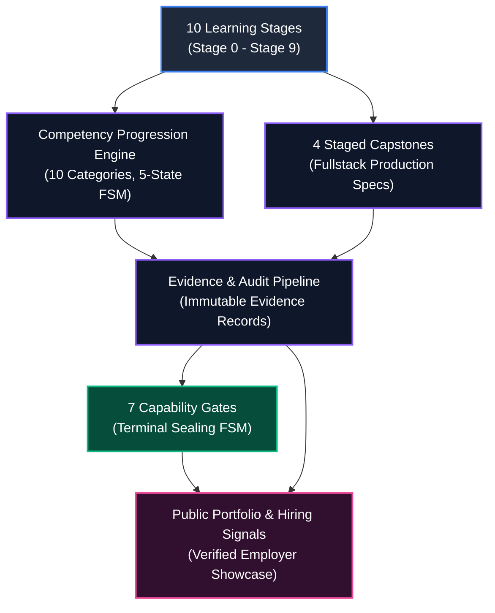
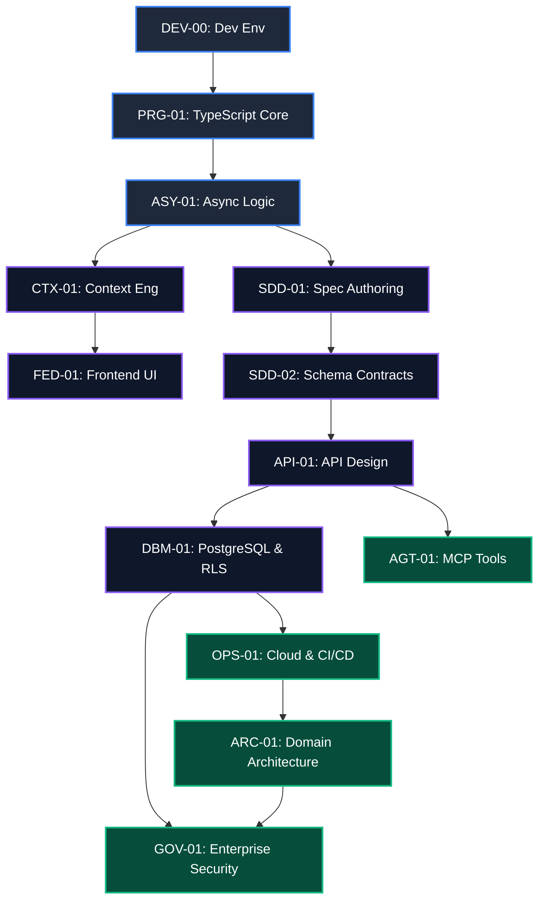
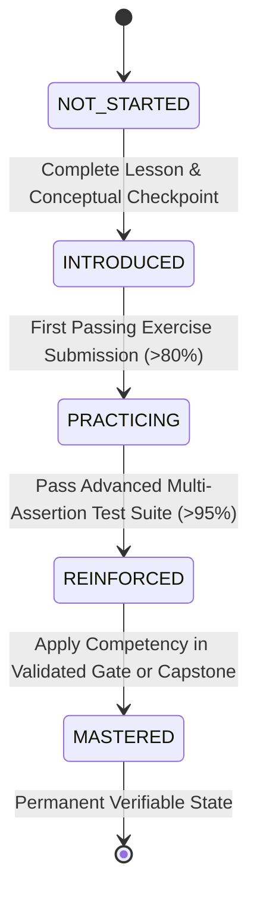
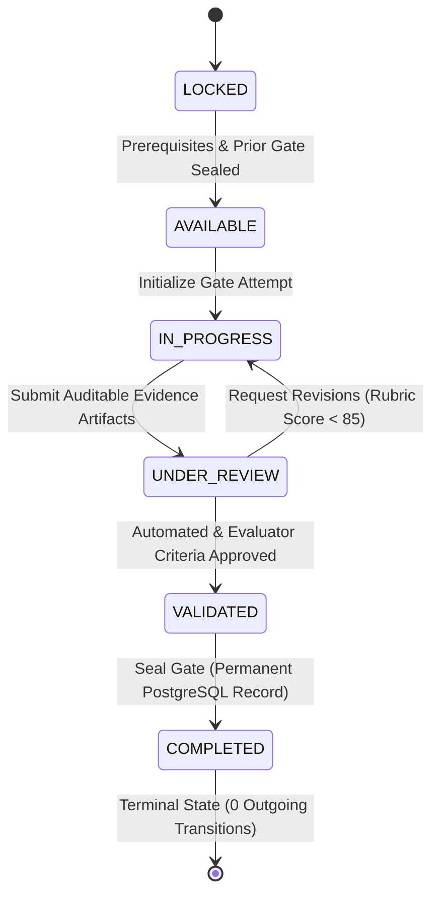
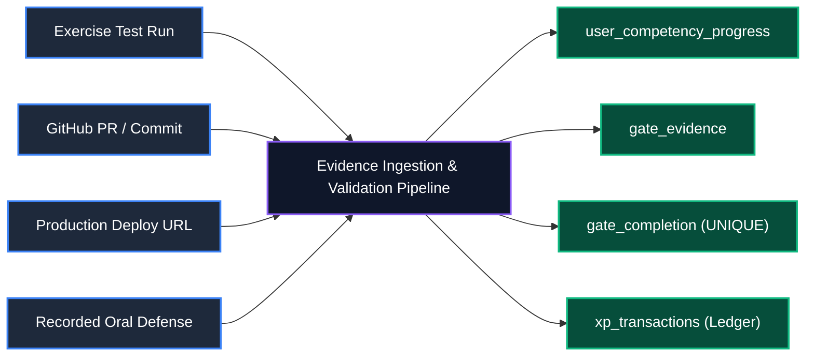
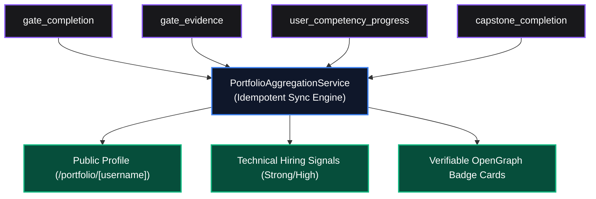
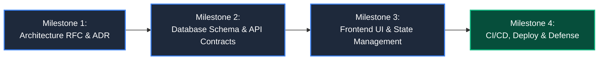

# Curriculum Operating System (COS) Architecture Specification
# AI-Native Software Engineering Academy (`ai-native-lms`)

**Document Version:** 1.0.0  
**Status:** Authoritative Curriculum Architecture Specification  
**Authority:** Academy Systems Architect & Lead Curriculum Engineer  
**Scope:** 24-Month Self-Paced Competency-Driven Engine  
**Classification:** Core System Architecture  
**Target Repository:** `ai-native-lms`  
**Effective Date:** September 30, 2026

---

## Table of Contents

1. [Executive Architectural Overview](#1-executive-architectural-overview)
2. [The 10-Stage Learning Architecture](#2-the-10-stage-learning-architecture)
3. [Competency Progression Engine](#3-competency-progression-engine)
4. [Capability Gate Progression Engine](#4-capability-gate-progression-engine)
5. [Evidence Progression & Audit Architecture](#5-evidence-progression--audit-architecture)
6. [Portfolio Aggregation & Signal Engine](#6-portfolio-aggregation--signal-engine)
7. [Capstone Progression Engine](#7-capstone-progression-engine)
8. [Sequencing Rules & Structural Invariants](#8-sequencing-rules--structural-invariants)

---

## 1. Executive Architectural Overview

The **Curriculum Operating System (COS)** is the stateful orchestration engine governing learner progression through the 24-month AI-Native Software Engineering curriculum.

Unlike traditional educational management systems that track time-in-seat or vanity page views, the COS operates as a **Deterministic Finite State Machine (FSM)**. Every stage transition, competency level upgrade, and gate completion is strictly gated by auditable, cryptographic-grade evidence records.



### Core Architecture Vectors:
1. **Zero-Assumption Scaffolding**: 10 progressive learning stages taking non-technical beginners from initial terminal literacy through enterprise distributed systems.
2. **5-State Competency Lifecycle**: `NOT_STARTED` &rarr; `INTRODUCED` &rarr; `PRACTICING` &rarr; `REINFORCED` &rarr; `MASTERED`.
3. **Irreversible Capability Gates**: 7 terminal mastery checkpoints governing progressive capability certification.
4. **Sandboxed Verification Pipeline**: 100% of code submissions executed in isolated test containers (zero regex/substring matching).
5. **Continuous Portfolio Aggregation**: Live synchronization of verified artifacts into employer-facing showcase profiles.

---

## 2. The 10-Stage Learning Architecture

The 24-month curriculum is partitioned into **10 sequential learning stages**, mapping directly to capability milestones and Capability Gates:

```
┌───────────────────────────────────────────────────────────────────────────────────────────────────┐
│                                10-STAGE LEARNING PROGRESSION MAP                                  │
├───────┬───────────────────────────────┬────────────┬────────────────────────┬─────────────────────┤
│ Stage │ Stage Title                   │ Timeframe  │ Capability Milestone   │ Associated Gate     │
├───────┼───────────────────────────────┼────────────┼────────────────────────┼─────────────────────┤
│   0   │ Orientation & Demystification │ Weeks 1–2  │ Terminal & Git Basics  │ Onboarding Baseline │
│   1   │ Computational Thinking & Code │ Weeks 3–5  │ TypeScript Core Syntax │ Syntax Baseline     │
│   2   │ Async Logic & Data Structures │ Weeks 6–8  │ Async API Fetching     │ Data Flow Baseline  │
│   3   │ AI-Assisted Builder           │ Weeks 9–11 │ Prompt & Context Eng.  │ Gate 1 Sealed       │
│   4   │ Modern Frontend Engineering   │ Weeks 12–15│ Next.js 15 & UI State  │ Gate 2 Sealed       │
│   5   │ API Architecture & Schemas    │ Weeks 16–19│ Server Actions & Zod   │ Gate 3 Sealed       │
│   6   │ Relational Data & Security    │ Weeks 20–23│ PostgreSQL & RLS       │ Gate 4 Sealed       │
│   7   │ Cloud Operations & CI/CD      │ Weeks 24–27│ Docker & Pipelines     │ Gate 5 Sealed       │
│   8   │ Distributed Architecture      │ Weeks 28–31│ DDD & Bounded Contexts │ Gate 6 Sealed       │
│   9   │ Enterprise Capstone Defense   │ Weeks 32–36│ Fullstack Production   │ Gate 7 (Graduation) │
└───────┴───────────────────────────────┴────────────┴────────────────────────┴─────────────────────┘
```

---

### Stage 0: Orientation & Demystification
- **Purpose**: Eliminate command-line fear, demystify computing abstractions, establish local development hygiene, and onboard the learner into modern version control.
- **Prerequisites**: None (Zero assumptions).
- **Outgoing Dependencies**: Stage 1 (Requires Git and CLI literacy).
- **Sequencing Rules**: Linear progression through terminal navigation, Git cloning/committing, and code editor configuration.
- **Estimated Duration**: 2 Weeks (15–20 hours).

### Stage 1: Computational Thinking & Syntax Foundations
- **Purpose**: Build mental models of variables, data types, conditional branching, loops, functions, and scoping using modern TypeScript.
- **Prerequisites**: Stage 0.
- **Outgoing Dependencies**: Stage 2 (Requires pure functional procedural fluency).
- **Sequencing Rules**: Build &rarr; Observe &rarr; Modify &rarr; Understand loops across interactive browser REPLs.
- **Estimated Duration**: 3 Weeks (30–45 hours).

### Stage 2: Asynchronous Systems & Network Data Flow
- **Purpose**: Master the JavaScript Event Loop, asynchronous execution (`Promises`, `async/await`), network API consumption, and functional array data transformations (`map`, `filter`, `reduce`).
- **Prerequisites**: Stage 1.
- **Outgoing Dependencies**: Stage 3 (Requires asynchronous mental models).
- **Sequencing Rules**: Mandatory error-handling drills before external API integration labs.
- **Estimated Duration**: 3 Weeks (30–45 hours).

### Stage 3: AI-Assisted Builder (Gate 1 Milestone)
- **Purpose**: Transition from manual typing to AI pairing (Cursor, Claude Code, Copilot), authoring project constitutions (`AGENTS.md`, `.cursorrules`), context window curation, and prompt-driven architecture.
- **Prerequisites**: Stage 2.
- **Outgoing Dependencies**: Stage 4; Unlocks Capability Gate 1.
- **Sequencing Rules**: Deliberate failure injection labs (hallucination detection) mandatory before Gate 1 attempt.
- **Estimated Duration**: 3 Weeks (30–45 hours).

### Stage 4: Modern Frontend Engineering & Component State (Gate 2 Milestone)
- **Purpose**: Master Next.js 15 (App Router, Server Components, Client Components), React 19, accessible Tailwind CSS UI composition, and isolated Zustand client-side state stores.
- **Prerequisites**: Stage 3 (Gate 1 sealed).
- **Outgoing Dependencies**: Stage 5; Unlocks Capability Gate 2.
- **Sequencing Rules**: Component accessibility (WCAG 2.1 AA) assertions required for all UI exercise submissions.
- **Estimated Duration**: 4 Weeks (40–60 hours).

### Stage 5: Backend APIs, Server Actions & Schema Contracts (Gate 3 Milestone)
- **Purpose**: Architect type-safe Next.js Server Actions, RESTful Route Handlers, Zod runtime schema contracts, Supabase Auth session security, and Model Context Protocol (MCP) tool declarations.
- **Prerequisites**: Stage 4 (Gate 2 sealed).
- **Outgoing Dependencies**: Stage 6; Unlocks Capability Gate 3.
- **Sequencing Rules**: Strict schema validation required on all endpoint parameters; unvalidated payloads blocked at compiler level.
- **Estimated Duration**: 4 Weeks (40–60 hours).

### Stage 6: Relational Data Systems & Supabase RLS (Gate 4 Milestone)
- **Purpose**: Design normalized relational database schemas, execute performant SQL queries, author version-controlled migrations, and enforce multi-tenant isolation via PostgreSQL Row-Level Security (RLS) policies.
- **Prerequisites**: Stage 5 (Gate 3 sealed).
- **Outgoing Dependencies**: Stage 7; Unlocks Capability Gate 4.
- **Sequencing Rules**: Automated cross-tenant security test suites must pass 100% before Gate 4 validation.
- **Estimated Duration**: 4 Weeks (40–60 hours).

### Stage 7: Cloud Infrastructure, Containers & CI/CD (Gate 5 Milestone)
- **Purpose**: Package fullstack applications in multi-stage Docker containers, automate test and deployment pipelines using GitHub Actions CI/CD, manage environment secrets, and deploy to production cloud platforms.
- **Prerequisites**: Stage 6 (Gate 4 sealed).
- **Outgoing Dependencies**: Stage 8; Unlocks Capability Gate 5.
- **Sequencing Rules**: Automated pull request verification checks must run cleanly on live staging previews.
- **Estimated Duration**: 4 Weeks (40–60 hours).

### Stage 8: Distributed Systems Architecture & Domain-Driven Design (Gate 6 Milestone)
- **Purpose**: Partition complex enterprise software into autonomous bounded contexts following Domain-Driven Design (DDD), implement Finite State Machines (FSM), and author Architectural Decision Records (ADRs).
- **Prerequisites**: Stage 7 (Gate 5 sealed).
- **Outgoing Dependencies**: Stage 9; Unlocks Capability Gate 6.
- **Sequencing Rules**: Architectural boundaries must be formally validated by isolated repository and service test suites.
- **Estimated Duration**: 4 Weeks (40–60 hours).

### Stage 9: Enterprise Governance, Security & Capstone Defense (Gate 7 Milestone)
- **Purpose**: Audit systems against OWASP Top 10 vulnerabilities, implement prompt injection defenses, deploy production Capstone applications, and verbally defend system architecture before an engineering review panel.
- **Prerequisites**: Stage 8 (Gate 6 sealed).
- **Outgoing Dependencies**: Academy Graduation & Certified Engineer Profile.
- **Sequencing Rules**: 100% of Capstone milestones and the live defense panel must be approved to seal Gate 7.
- **Estimated Duration**: 5 Weeks (50–75 hours).

---

## 3. Competency Progression Engine

The Competency Engine organizes technical capabilities into a hierarchical **Directed Acyclic Graph (DAG)** of 10 standard competency categories.



### 3.1 The Canonical Competency Taxonomy

| Competency Code | Category | Title | Target Mastery Level |
| :--- | :--- | :--- | :---: |
| `DEV-00` | Tooling & Environment | Terminal, Git & Modern IDE Workflows | Foundational |
| `PRG-01` | Programming Foundations | TypeScript Primitive Types, Flow & Functions | Foundational |
| `ASY-01` | Asynchronous Runtimes | Event Loop, Promises & Array Pipelines | Foundational |
| `CTX-01` | AI & Context Engineering| Prompt Architecture, `AGENTS.md`, Token Curation | Level 1 |
| `SDD-01` | Spec-Driven Development | Intent Specification & Boundary Modeling | Level 1 |
| `FED-01` | Frontend Engineering | Next.js 15, React 19, Zustand & WCAG AA UI | Level 2 |
| `API-01` | API & Network Systems | Server Actions, Route Handlers & Zod Contracts | Level 3 |
| `SDD-02` | Schema Contracts | Runtime Validation & Zero-Drift Type Inference | Level 3 |
| `AGT-01` | Agentic Tooling & MCP | Model Context Protocol Tool Server Design | Level 3 |
| `DBM-01` | Relational Data Systems | PostgreSQL Relational Schemas & Supabase RLS | Level 4 |
| `OPS-01` | Cloud & DevOps | Docker Multi-Stage Builds, GitHub Actions CI/CD| Level 5 |
| `CTX-02` | Verification Engineering| Deterministic Test Harnesses & Mock Isolation | Level 5 |
| `ARC-01` | System Architecture | Domain-Driven Design & Bounded Contexts | Level 6 |
| `AGT-02` | Observability & Telemetry| Self-Healing Workflows, Tracing & Error Backoff| Level 6 |
| `GOV-01` | Enterprise Governance | OWASP Top 10, Multi-Tenancy & Audit Ledgers | Level 7 |
| `CAP-01` | Capstone Synthesis | Fullstack Implementation & Architectural Defense| Level 7 |

---

### 3.2 The 5-State Competency Lifecycle



### Promotion & Evidentiary Rules:
1. **NOT_STARTED &rarr; INTRODUCED**: Triggered upon completion of the foundational theory lesson and interactive syntax preview.
2. **INTRODUCED &rarr; PRACTICING**: Triggered upon achieving a verified 100% pass score on an isolated coding challenge.
3. **PRACTICING &rarr; REINFORCED**: Triggered upon completing edge-case and failure-injection test suites across multiple exercises.
4. **REINFORCED &rarr; MASTERED**: Triggered exclusively when the competency is exercised within an evaluator-approved Capability Gate artifact or Capstone milestone.

---

## 4. Capability Gate Progression Engine

Capability Gates (Levels 1–7) serve as the platform's irreversible mastery checkpoints.



### 4.1 Capability Gate Requirement Matrix

```
┌──────────────────────────────────────────────────────────────────────────────────────────────────┐
│                                CAPABILITY GATE REQUIREMENT MATRIX                                │
├────┬─────────────────────────────┬──────────────────────┬─────────────────┬──────────────────────┤
│ Lvl│ Gate Title & Slug           │ Required Competencies│ Lesson/Exercise │ Required Artifacts   │
├────┼─────────────────────────────┼──────────────────────┼─────────────────┼──────────────────────┤
│ 1  │ AI-Assisted Builder         │ CTX-01, SDD-01       │ Stages 0–3 Comp │ `AGENTS.md` + Prompt │
│    │ `gate-1-ai-builder`         │ (Mastered)           │ 4 Passing Labs  │ Pairing Audit Log    │
├────┼─────────────────────────────┼──────────────────────┼─────────────────┼──────────────────────┤
│ 2  │ Frontend Engineer           │ FED-01               │ Stage 4 Complete│ Live Next.js Web App │
│    │ `gate-2-frontend-engineer`  │ (Mastered)           │ 3 UI Test Labs  │ Lighthouse >95%      │
├────┼─────────────────────────────┼──────────────────────┼─────────────────┼──────────────────────┤
│ 3  │ API Integrator              │ API-01, SDD-02       │ Stage 5 Complete│ Authenticated API    │
│    │ `gate-3-api-integrator`     │ AGT-01 (Practicing)  │ 3 API Test Labs │ Functional MCP Tool  │
├────┼─────────────────────────────┼──────────────────────┼─────────────────┼──────────────────────┤
│ 4  │ Data Model Designer         │ DBM-01               │ Stage 6 Complete│ PostgreSQL Migration │
│    │ `gate-4-data-model-designer`│ (Mastered)           │ 3 DB Test Labs  │ Verified RLS Test PR │
├────┼─────────────────────────────┼──────────────────────┼─────────────────┼──────────────────────┤
│ 5  │ Production Deployer         │ OPS-01, CTX-02       │ Stage 7 Complete│ Dockerfile + Live CI │
│    │ `gate-5-production-deployer`│ (Mastered)           │ 3 CI/CD Labs    │ Production Cloud URL │
├────┼─────────────────────────────┼──────────────────────┼─────────────────┼──────────────────────┤
│ 6  │ System Architect            │ ARC-01, AGT-02       │ Stage 8 Complete│ Authored ADR Doc +   │
│    │ `gate-6-system-architect`   │ (Mastered)           │ 3 DDD Labs      │ DDD Service Suite    │
├────┼─────────────────────────────┼──────────────────────┼─────────────────┼──────────────────────┤
│ 7  │ Enterprise Engineer         │ GOV-01, CAP-01       │ Stage 9 Complete│ Fullstack Capstone + │
│    │ `gate-7-enterprise-engineer`│ (Mastered)           │ All Curriculum  │ Recorded Oral Defense│
└────┴─────────────────────────────┴──────────────────────┴─────────────────┴──────────────────────┘
```

---

## 5. Evidence Progression & Audit Architecture

Every student advancement writes an immutable record to the audit datastore:



### 5.1 Evidence Classification Taxonomy
- `lesson_evidence`: Lesson completion timestamps with progress markers.
- `exercise_evidence`: Automated Vitest test execution output, memory usage, and assertion diffs.
- `competency_evidence`: Rubric evaluations verifying specific skill criteria.
- `gate_evidence`: Cryptographic links to GitHub PRs, live deployed URLs, and ADR specifications.
- `defense_evidence`: Evaluator rubric scores and recorded oral defense transcripts.

---

## 6. Portfolio Aggregation & Signal Engine

The Portfolio Engine continuously aggregates verified evidence into an employer-facing showcase:



### Automated Hiring Signals Generated:
- `competency_demonstrated`: Triggered upon reaching `MASTERED` state in core competencies.
- `gate_completed`: High-confidence barrier signal certifying capability across an entire engineering level.
- `production_deployed`: Verified live cloud application with automated health check confirmation.
- `architecture_defended`: Evaluator-certified systems design and threat model defense.

---

## 7. Capstone Progression Engine

The curriculum integrates **4 multi-stage, production-grade Capstone Projects** validating end-to-end fullstack competence:

```
┌──────────────────────────────────────────────────────────────────────────────────────────────────┐
│                                 CAPSTONE PROGRESSION MATRIX                                      │
├────┬─────────────────────────────┬───────────┬───────────────────────────────────────────────────┤
│ Tier│ Capstone Project Specification│ Gate Level│ Primary Technical Domain Focus                    │
├────┼─────────────────────────────┼───────────┼───────────────────────────────────────────────────┤
│ 1  │ AI Knowledge Engine &       │ Gates 1–3 │ Next.js 15, Zod Contracts, Server Actions,        │
│    │ Semantic Search Service     │           │ Vector Embeddings & MCP Tool Integrations.        │
├────┼─────────────────────────────┼───────────┼───────────────────────────────────────────────────┤
│ 2  │ Multi-Tenant SaaS Platform  │ Gates 4–5 │ PostgreSQL Relational Schema, Supabase RLS,       │
│    │ with RBAC & Billing Engine  │           │ Docker Containers, GitHub Actions CI/CD Deploy.   │
├────┼─────────────────────────────┼───────────┼───────────────────────────────────────────────────┤
│ 3  │ Distributed Event-Driven    │ Gate 6    │ Domain-Driven Design (DDD), Bounded Contexts,     │
│    │ Task Orchestration Engine   │           │ Finite State Machines, Telemetry & Tracing.       │
├────┼─────────────────────────────┼───────────┼───────────────────────────────────────────────────┤
│ 4  │ Enterprise AI Code Review & │ Gate 7    │ OWASP Security Hardening, Prompt Injection Defense│
│    │ Compliance Sentinel (Final) │ (Grad)    │ Multi-Tenant Isolation, Oral Architecture Defense.│
└────┴─────────────────────────────┴───────────┴───────────────────────────────────────────────────┘
```

### 7.1 The 4-Milestone Staged Deliverable Protocol
Every Capstone must be authored and evaluated across four strict milestones:



1. **Milestone 1 (Architecture RFC)**: Author formal `ADR-001.md`, entity-relationship diagrams (ERD), and OpenAPI/Zod payload contracts.
2. **Milestone 2 (Database & API Layer)**: Implement Supabase PostgreSQL migrations, RLS security policies, Server Actions, and 100% green integration tests.
3. **Milestone 3 (Frontend & Client State)**: Build responsive Next.js 15 UI, Zustand client stores, and accessibility compliance.
4. **Milestone 4 (Production Deployment & Defense)**: Deploy multi-stage Docker container via GitHub Actions to cloud infrastructure and complete oral defense.

---

## 8. Sequencing Rules & Structural Invariants

The Curriculum Operating System enforces the following non-negotiable operational invariants:

```
┌────────────────────────────────────────────────────────────────────────────────────────┐
│                              SYSTEM INVARIANT MATRIX                                   │
├────┬─────────────────────────────┬─────────────────────────────────────────────────────┤
│ 1  │ Anti-Skipping Rule          │ Stage N+1 exercises are locked until Stage N passes.│
│ 2  │ Gate Precedence Rule        │ Gate N must be sealed before Gate N+1 attempt starts│
│ 3  │ Zero XP Bypass Rule         │ XP point accumulation alone cannot clear gates.     │
│ 4  │ Sandboxed Validation Rule   │ 100% of code submissions execute in isolated VMs.   │
│ 5  │ Terminal Immutability Rule  │ Completed gates have 0 exit transitions in the FSM. │
│ 6  │ RLS Kernel Protection Rule  │ 100% of datastore tables enforce Row-Level Security.│
└────┴─────────────────────────────┴─────────────────────────────────────────────────────┘
```

By unifying **Learning Stages, Competencies, Capability Gates, Evidence Audit Trails, Portfolios, and Capstones** into a single cohesive operating system, the COS guarantees an uncompromised, verifiable pathway from complete beginner to job-ready AI-native software engineer.
