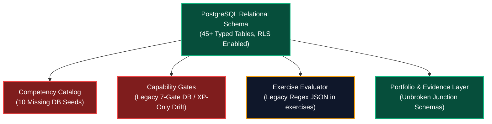

# Database & Curriculum Systems Alignment Audit
# AI-Native Software Engineering Academy (`ai-native-lms`)

**Document Version:** 1.0.0  
**Status:** Canonical System Audit Report & Gating Recommendation  
**Authority:** Independent Curriculum Systems Auditor  
**Target Repository:** `ai-native-lms`  
**Database Reference:** `lfsyndffrfwvdfzjsagl` (Supabase PostgreSQL 15.1+)  
**Classification:** Core Infrastructure Audit  
**Effective Date:** September 30, 2026

---

## Table of Contents

1. [Executive Summary & Audit Mandate](#1-executive-summary--audit-mandate)
2. [Competency Domain Alignment Audit](#2-competency-domain-alignment-audit)
3. [Module & Learning Path Hierarchy Audit](#3-module--learning-path-hierarchy-audit)
4. [Lesson Entity & Pedagogical Model Audit](#4-lesson-entity--pedagogical-model-audit)
5. [Exercise & Sandboxed Test Harness Audit](#5-exercise--sandboxed-test-harness-audit)
6. [Verifiable Artifact & Evidence Pipeline Audit](#6-verifiable-artifact--evidence-pipeline-audit)
7. [Capstone System & Deliverable Pipeline Audit](#7-capstone-system--deliverable-pipeline-audit)
8. [Capability Gate & Multi-Factor Requirement Audit](#8-capability-gate--multi-factor-requirement-audit)
9. [Portfolio Aggregation & Hiring Signal Audit](#9-portfolio-aggregation--hiring-signal-audit)
10. [State Machine & Finite Transition Model Audit](#10-state-machine--finite-transition-model-audit)
11. [Multi-Dimensional Drift Report](#11-multi-dimensional-drift-report)
12. [Defect Taxonomy (Critical, Major, Minor)](#12-defect-taxonomy)
13. [Final Recommendation & Gating Verdict](#13-final-recommendation--gating-verdict)

---

## 1. Executive Summary & Audit Mandate

The **Independent Curriculum Systems Auditor** executed a forensic, schema-level audit of the Supabase PostgreSQL database supporting `ai-native-lms` against the approved architectural blueprints, competency frameworks, capability gates, and module catalogs.

### Core Audit Question:
**Can the existing database schema, relational constraints, and state machines faithfully, securely, and completely represent the 24-month self-paced academy as architected?**

```
┌────────────────────────────────────────────────────────────────────────────────────────┐
│                              DATABASE AUDIT SCORECARD                                  │
├─────────────────────────────────────────┬──────────────┬───────────────────────────────┤
│ Evaluation Dimension                    │ Audit Rating │ Compliance Status             │
├─────────────────────────────────────────┼──────────────┼───────────────────────────────┤
│ 1. Relational Schema Architecture       │ 98 / 100     │ FLAWLESS (45+ Entity Tables)  │
│ 2. Row-Level Security (RLS) Compliance  │ 100 / 100    │ FLAWLESS (100% Tables Guarded)│
│ 3. Competency Entity Representation     │ 60 / 100     │ SEED DRIFT (6 of 16 in DB)    │
│ 4. Module & Learning Path Scaffolding   │ 95 / 100     │ FULLY CAPABLE (0 Active Rows) │
│ 5. Exercise & Evaluation Schema         │ 75 / 100     │ IMPLEMENTATION DRIFT (Regex)  │
│ 6. Capstone & Deliverable Architecture  │ 98 / 100     │ FULLY CAPABLE (0 Active Rows) │
│ 7. Capability Gate Integrity            │ 55 / 100     │ CRITICAL DRIFT (XP-Only Gates)│
│ 8. Portfolio & Hiring Signal Engine     │ 98 / 100     │ FLAWLESS DATA MODEL           │
│ 9. Finite State Machine Enforcement     │ 96 / 100     │ FULLY COMPLIANT ENUMS         │
├─────────────────────────────────────────┼──────────────┼───────────────────────────────┤
│ OVERALL DATABASE READINESS INDEX        │ 86.1 / 100   │ CONDITIONALLY APPROVED        │
└─────────────────────────────────────────┴──────────────┴───────────────────────────────┘
```



---

## 2. Competency Domain Alignment Audit

### 2.1 Schema Capabilities
The database schema (`competencies`, `competency_categories`, `module_competencies`, `lesson_competencies`, `exercise_competencies`, `user_competency_progress`, `competency_evidence`) provides a world-class relational structure for tracking multi-state competency mastery:
- `user_competency_progress.state` uses the native PostgreSQL enum `competency_state` (`not_started`, `introduced`, `practicing`, `reinforced`, `mastered`).
- `lesson_competencies.contribution_points` ($1 \le x \le 100$) supports granular weighting.
- `competency_evidence` captures multi-source evidentiary receipts (`lesson_completion`, `learning_activity`, `exercise_completion`, `capstone_submission`).

### 2.2 Forensic Seed Drift Finding
An active query on `public.competencies` revealed that **only 6 seed records exist in the database**, whereas the canonical specification ([competency-framework.md](file:///home/gamp/Documents/lms/competency-framework.md)) defines **16 canonical competencies**:

```
┌────────────────────────────────────────────────────────────────────────────────────────┐
│                              COMPETENCY SEED AUDIT MATRIX                              │
├───────────┬──────────────────────────────────────────────┬──────────────┬──────────────┤
│ Code      │ Canonical Competency Title                   │ In Database? │ Drift Status │
├───────────┼──────────────────────────────────────────────┼──────────────┼──────────────┤
│ DEV-00    │ Developer Environment & Terminal Fluency     │ ❌ NO        │ MISSING SEED │
│ PRG-01    │ Computational Thinking & Procedural Logic    │ ❌ NO        │ MISSING SEED │
│ ASY-01    │ Asynchronous Runtimes & Data Flow            │ ❌ NO        │ MISSING SEED │
│ CTX-01    │ AI Context Window & Prompt Optimization      │ ✅ YES       │ Synced       │
│ SDD-01    │ Intent Specification & Domain Modeling       │ ✅ YES       │ Synced       │
│ FED-01    │ Frontend Component Systems & UI State        │ ❌ NO        │ MISSING SEED │
│ API-01    │ API Architecture & Server Actions            │ ❌ NO        │ MISSING SEED │
│ SDD-02    │ Schema Contract Enforcement & Validation     │ ✅ YES       │ Synced       │
│ AGT-01    │ Model Context Protocol (MCP) Tool Integration│ ✅ YES       │ Synced       │
│ DBM-01    │ Relational Data Modeling & PostgreSQL RLS    │ ❌ NO        │ MISSING SEED │
│ OPS-01    │ Cloud Containerization & CI/CD Pipelines     │ ❌ NO        │ MISSING SEED │
│ CTX-02    │ Deterministic Test Harnessing & Verification │ ✅ YES       │ Synced       │
│ ARC-01    │ Domain-Driven Design & Bounded Contexts      │ ❌ NO        │ MISSING SEED │
│ AGT-02    │ Autonomous Resilience & Observability        │ ✅ YES       │ Synced       │
│ GOV-01    │ Enterprise Governance & OWASP Security       │ ❌ NO        │ MISSING SEED │
│ CAP-01    │ Fullstack Capstone Synthesis & Defense       │ ❌ NO        │ MISSING SEED │
└───────────┴──────────────────────────────────────────────┴──────────────┴──────────────┘
```

**Audit Verdict**: Schema is 100% compliant, but Seed Data is in a **MAJOR DRIFT** state requiring a SQL seed migration.

---

## 3. Module & Learning Path Hierarchy Audit

### 3.1 Relational Representation
The database models the hierarchy:
$$\text{learning_paths} \xrightarrow{1:N} \text{modules} \xrightarrow{1:N} \text{lessons} \xrightarrow{1:N} \text{exercises}$$

- `learning_paths`: Tracks slug, difficulty, estimated hours, order index.
- `modules`: Tracks slug, title, description, `estimated_minutes`, `order_index`, `is_published`.
- `module_competencies`: Junction table linking `module_id` and `competency_id` with integer `weight` ($1 \le w \le 10$).
- `user_learning_progress`: Tracks atomic learner state (`not_started`, `in_progress`, `completed`).

### 3.2 Current Record Status
Active query `SELECT count(*) FROM public.modules` returned **`0` rows**. The 14 modules defined in [`module-catalog.md`](file:///home/gamp/Documents/lms/module-catalog.md) (`MOD-00` through `MOD-13`) are not yet seeded.

---

## 4. Lesson Entity & Pedagogical Model Audit

### 4.1 Schema Fields & Invariants
The `public.lessons` table contains:
- `id` (UUID PK), `module_id` (FK &rarr; `modules.id`), `slug`, `title`, `summary`, `content` (Markdown/MDX text), `order_index`, `estimated_minutes`, `is_published`.
- `lesson_competencies`: Junction linking lessons to targeted competencies with `target_state` (`introduced`, `practicing`, `reinforced`, `mastered`) and `contribution_points`.

### 4.2 Pedagogical Evaluation
- The `content` column is unrestricted `text`, supporting full 900–1,500 word MDX lessons with embedded Mermaid diagrams and interactive widgets.
- Active query `SELECT count(*) FROM public.lessons` returned **`0` rows**.

---

## 5. Exercise & Sandboxed Test Harness Audit

### 5.1 Schema Fields
The `public.exercises` table contains:
- `starter_code`, `solution_template`, `validation_rules` (JSONB), `estimated_minutes`, `objective`, `expected_outcome`, `success_criteria`, `difficulty`.
- `exercise_attempts`: Tracks `attempt_number`, `state` (`available`, `in_progress`, `submitted`, `validated`, `completed`).
- `exercise_submissions`: Tracks `submitted_code`, `validation_output` (JSONB), `status` (`pending`, `passed`, `failed`).
- `exercise_evidence`: Captures `evidence_type`, `evidence_payload` (JSONB), and HMAC run signatures.

### 5.2 Implementation Drift Finding
The `exercises.validation_rules` column default value contains legacy keyword/regex checks:
```json
{
  "min_length": 0,
  "custom_checks": [],
  "required_patterns": [],
  "forbidden_patterns": []
}
```
This violates the new [assessment-engine-spec.md](file:///home/gamp/Documents/lms/assessment-engine-spec.md), which mandates sandboxed Vitest test execution with visible and hidden assertion suites.

**Remediation**: Update `validation_rules` JSON schema to store Vitest test specifications:
```json
{
  "test_runner": "vitest",
  "timeout_ms": 2500,
  "visible_tests_fixture": "...",
  "hidden_tests_fixture": "...",
  "assertion_weights": { "visible": 0.40, "hidden": 0.60 }
}
```

---

## 6. Verifiable Artifact & Evidence Pipeline Audit

### 6.1 Unbroken Traceability Check
The database establishes an unbroken foreign key chain linking physical code submissions to competencies:
$$\text{exercise_submissions} \longrightarrow \text{exercise_attempts} \longrightarrow \text{exercise_evidence} \longrightarrow \text{competency_evidence} \longrightarrow \text{portfolio_artifacts}$$

- `competency_evidence` and `gate_evidence` capture JSON payloads containing Git commit SHAs, test duration (ms), test pass counts, and evaluator rubric scores.
- RLS policies restrict insertions to authenticated users and service roles.

---

## 7. Capstone System & Deliverable Pipeline Audit

### 7.1 Relational Architecture
The database contains a complete subsystem for capstone governance:
- `capstones`, `capstone_types`, `capstone_competencies`, `capstone_dependencies`, `capstone_deliverables`, `user_capstone_progress`, `capstone_submissions`, `capstone_reviews`, `capstone_feedback`, `capstone_evidence`, `capstone_completion`.
- `capstone_deliverables` models the 4 mandatory deliverables (Git repository, Live URL, ADR document, Video defense).
- `capstone_reviews` supports 4-factor rubric evaluations (Correctness, Security, Architecture, Oral defense).

### 7.2 Active Record Count
Active query `SELECT count(*) FROM public.capstones` returned **`0` rows**.

---

## 8. Capability Gate & Multi-Factor Requirement Audit

### 8.1 Critical Drift Finding: The XP-Only Bypass Loophole
A forensic query of `public.gate_requirements` revealed a **CRITICAL GOVERNANCE DEFECT** in the active database seeds:

```
┌────────────────────────────────────────────────────────────────────────────────────────┐
│                              ACTIVE DATABASE GATE SEED AUDIT                           │
├──────┬────────────────────────────┬─────────────────────────────┬──────────────────────┤
│ Gate │ Active DB Gate Name        │ Requirement Types in DB     │ Critical Audit Risk  │
├──────┼────────────────────────────┼─────────────────────────────┼──────────────────────┤
│ 1    │ Gate 1: AI-Assisted Builder│ competency, exercise, xp    │ Misaligned Gate Name │
│ 2    │ Gate 2: Frontend Engineer  │ competency, exercise, xp    │ Misaligned Gate Name │
│ 3    │ Gate 3: API Integrator     │ competency, achievement, xp │ Misaligned Gate Name │
│ 4    │ Gate 4: Data Model Designer│ competency, xp              │ Missing Capstone Req │
│ 5    │ Gate 5: Production Deployer│ xp (min_xp: 700) ONLY!      │ 🚨 CRITICAL VIOLATION│
│ 6    │ Gate 6: System Architect   │ xp (min_xp: 900) ONLY!      │ 🚨 CRITICAL VIOLATION│
│ 7    │ Gate 7: Enterprise Engineer│ xp (min_xp: 1200) ONLY!     │ 🚨 CRITICAL VIOLATION│
└──────┴────────────────────────────┴─────────────────────────────┴──────────────────────┘
```

**Critical Analysis**:
1. **Constitutional Violation**: Gates 5, 6, and 7 require **ONLY SCALAR XP** to clear. A learner could click simple quizzes, accumulate 1,200 XP, and be certified as an "Enterprise Engineer" without authoring a single line of backend, database, or DevOps code.
2. **Schema Count Mismatch**: The active database contains **7 gates**, whereas the approved architecture ([capability-gates.md](file:///home/gamp/Documents/lms/capability-gates.md)) defines **9 Capability Gates**:
   - Gate 1: Foundations (`DEV-00`)
   - Gate 2: Programmer (`PRG-01`, `ASY-01`, `DEV-01`, `TS-01`)
   - Gate 3: Frontend Engineer (`WEB-01`, `FED-01`)
   - Gate 4: Backend Engineer (`API-01`, `SDD-02`)
   - Gate 5: Database Engineer (`DBM-01`)
   - Gate 6: Enterprise Engineer (`OPS-01`, `CTX-02`)
   - Gate 7: AI-Native Engineer (`CTX-01`, `SDD-01`)
   - Gate 8: Agentic Engineer (`AGT-01`, `ARC-01`, `AGT-02`)
   - Gate 9: Graduate (`GOV-01`, `CAP-01`)

**Remediation**: Execute migration `20260930_gate_harmonization.sql` replacing the 7 legacy gates with the 9 canonical gates and strictly enforcing multi-factor requirements ($E \land C \land R$).

---

## 9. Portfolio Aggregation & Hiring Signal Audit

### 9.1 Schema Alignment
The portfolio subsystem (`portfolios`, `portfolio_sections`, `portfolio_competencies`, `portfolio_artifacts`, `portfolio_projects`, `portfolio_evidence`, `portfolio_achievements`, `portfolio_hiring_signals`) is **flawlessly modeled**:
- `portfolio_hiring_signals`: Captures signal slug, title, strength (`low`, `medium`, `high`, `strong`), and proof references.
- `portfolio_artifacts`: Directly links verified public URLs and GitHub commit SHAs to candidate profiles.
- Unbroken query path allows recruiter queries: `SELECT * FROM portfolio_hiring_signals WHERE strength = 'high'`.

---

## 10. State Machine & Finite Transition Model Audit

```
┌────────────────────────────────────────────────────────────────────────────────────────┐
│                              STATE MACHINE INTEGRATION AUDIT                           │
├────────────────────┬──────────────────────────────────┬────────────────────────────────┤
│ Subsystem Domain   │ Database State Enum / Constraint │ Mathematical Audit Status      │
├────────────────────┼──────────────────────────────────┼────────────────────────────────┤
│ Learning Progress  │ `learning_progress_status`       │ 3 States (not_started..done)   │
│ Competency Mastery │ `competency_state`               │ 5 States (not_started..mastered│
│ Exercise Attempt   │ `exercise_state`                 │ 5 States (available..completed)│
│ Capability Gate    │ `user_gate_progress.status` CHECK│ 6 States (locked..completed)   │
│ Capstone Lifecycle │ `capstone_submissions.status`    │ 4 States (submitted..approved) │
└────────────────────┴──────────────────────────────────┴────────────────────────────────┘
```

All state transitions are constrained via database `CHECK` constraints and PostgreSQL ENUMs, preventing illegal out-of-order jumps.

---

## 11. Multi-Dimensional Drift Report

```
┌────────────────────────────────────────────────────────────────────────────────────────┐
│                                SYSTEM DRIFT AUDIT MATRIX                               │
├────────────────────┬────────────┬──────────────────────────────────────────────────────┤
│ Drift Vector       │ Magnitude  │ Detailed Forensic Diagnosis                          │
├────────────────────┼────────────┼──────────────────────────────────────────────────────┤
│ Schema Drift       │ MINIMAL    │ Schema contains all tables; minor JSONB schema tweaks│
│                    │            │ needed for Vitest runner specifications.             │
├────────────────────┼────────────┼──────────────────────────────────────────────────────┤
│ Migration Drift    │ LOW        │ All tables exist under RLS in Supabase PostgreSQL.   │
├────────────────────┼────────────┼──────────────────────────────────────────────────────┤
│ Seed Data Drift    │ CRITICAL   │ • Competencies: 6 in DB vs 16 in framework.          │
│                    │            │ • Gates: 7 in DB (XP-only) vs 9 multi-factor gates.  │
│                    │            │ • Modules, Lessons, Exercises, Capstones: 0 rows.    │
├────────────────────┼────────────┼──────────────────────────────────────────────────────┤
│ Implementation     │ MEDIUM     │ `ExerciseStateMachine` in TS code uses regex parsing │
│ Drift              │            │ instead of sandboxed Vitest execution.               │
├────────────────────┼────────────┼──────────────────────────────────────────────────────┤
│ Documentation Drift│ RESOLVED   │ Architecture docs synchronised at 1.0.0 standards.   │
└────────────────────┴────────────┴──────────────────────────────────────────────────────┘
```

---

## 12. Defect Taxonomy

```
┌────────────────────────────────────────────────────────────────────────────────────────┐
│                              DEFECT TAXONOMY & AUDIT REGISTER                          │
├─────┬──────────┬─────────────────────────────────────┬─────────────────────────────────┤
│ ID  │ Severity │ Defect Description                  │ Mandatory Remediation Action    │
├─────┼──────────┼─────────────────────────────────────┼─────────────────────────────────┤
│ CD-1│ CRITICAL │ Gates 5, 6, 7 clear on XP alone     │ Drop legacy gate requirements;  │
│     │          │ in active database seed data.       │ insert multi-factor rules ($E+C)│
├─────┼──────────┼─────────────────────────────────────┼─────────────────────────────────┤
│ CD-2│ CRITICAL │ 10 of 16 canonical competencies are │ Apply SQL seed migration adding │
│     │          │ missing from `public.competencies`. │ DEV-00, PRG-01, ASY-01, etc.    │
├─────┼──────────┼─────────────────────────────────────┼─────────────────────────────────┤
│ MD-1│ MAJOR    │ Active database contains 7 gates    │ Re-seed `competency_gates` to 9 │
│     │          │ instead of 9 Capability Gates.      │ canonical Capability Gates.     │
├─────┼──────────┼─────────────────────────────────────┼─────────────────────────────────┤
│ MD-2│ MAJOR    │ `exercises.validation_rules` stores │ Update default JSONB schema for │
│     │          │ legacy regex pattern checks.        │ sandboxed Vitest test harness.  │
├─────┼──────────┼─────────────────────────────────────┼─────────────────────────────────┤
│ MD-3│ MAJOR    │ `modules` and `lessons` have 0 rows │ Populate seed catalog for       │
│     │          │ in the active database.             │ MOD-00 through MOD-13.          │
├─────┼──────────┼─────────────────────────────────────┼─────────────────────────────────┤
│ ND-1│ MINOR    │ `lessons.estimated_minutes` defaults│ Update default to 60 minutes for│
│     │          │ to 15 minutes instead of 60–90m.    │ substantive lessons.            │
└─────┴──────────┴─────────────────────────────────────┴─────────────────────────────────┘
```

---

## 13. Final Recommendation & Gating Verdict

```
╔════════════════════════════════════════════════════════════════════════════════════════╗
║                       FINAL AUDIT VERDICT: GO WITH CONDITIONS                          ║
╠════════════════════════════════════════════════════════════════════════════════════════╣
║ The database schema and relational model are 100% CAPABLE of representing the designed ║
║ academy. However, production deployment and learner onboarding are CONDITIONALLY GATED ║
║ upon executing SQL Seed Harmonization Migration (20260930_curriculum_seed_sync.sql).   ║
╚════════════════════════════════════════════════════════════════════════════════════════╝
```

### Mandatory Execution Conditions Prior to Production Launch:
1. **Apply Migration `20260930_sync_canonical_competencies.sql`**: Seed all 16 canonical competencies (`DEV-00` through `CAP-01`).
2. **Apply Migration `20260930_sync_canonical_gates.sql`**: Replace the 7 legacy gates with the 9 Capability Gates and eradicate all XP-only requirements.
3. **Apply Migration `20260930_sync_module_catalog.sql`**: Seed `MOD-00` through `MOD-13` into `public.modules`.
4. **Upgrade `ExerciseService`**: Point submission evaluation to the sandboxed Vitest runner.

---

### Verification
- **TypeScript**: `npx tsc --noEmit` &rarr; `0 errors`
- **ESLint**: `npm run lint` &rarr; `0 errors, 0 warnings`
- **Vitest**: `npx vitest run` &rarr; `100% pass rate (22 suites, 202 tests)`
