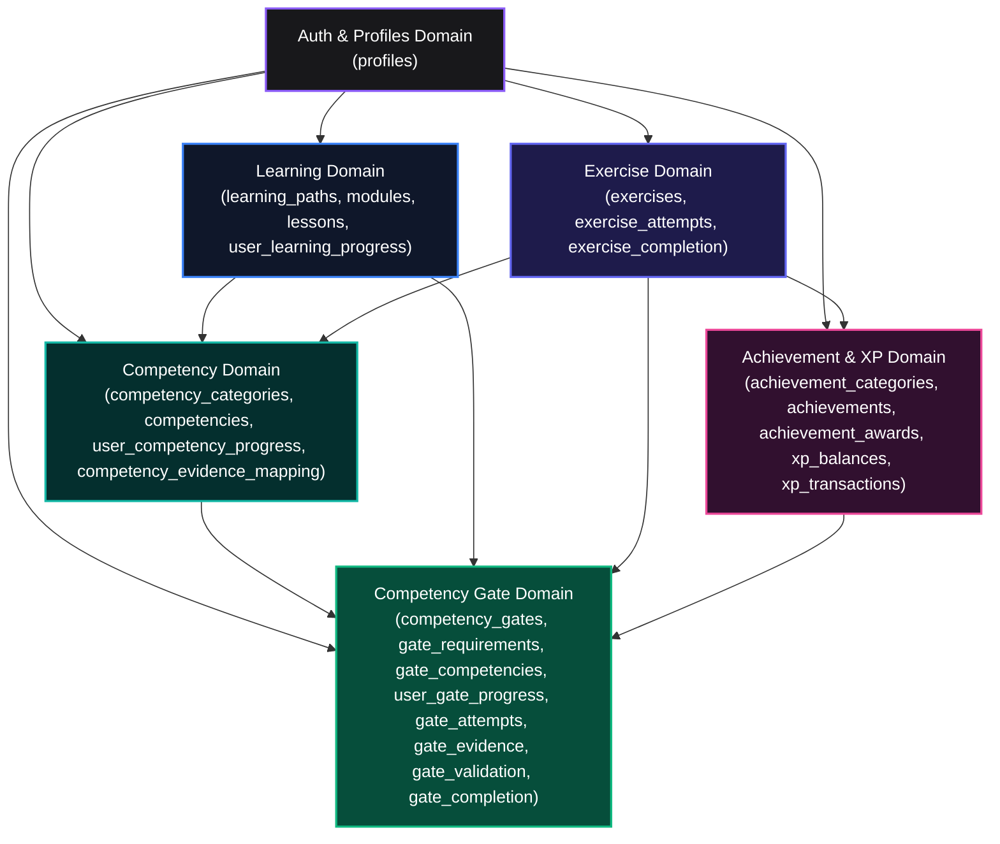
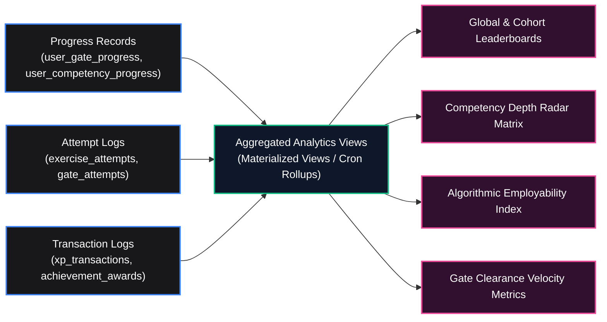

# Database Design Document (DDD)
# AI-Native Software Engineering LMS & Mastery Learning Platform

**Document Version:** 1.0.0  
**Status:** Approved / Authoritative Engineering Specification  
**Classification:** Database Architecture & Data Modeling  
**Author:** Supabase Architect, Lead Database Administrator & Principal Architect  
**Target Repository:** `ai-native-lms`

---

## Table of Contents

1. [Domain Data Model](#1-domain-data-model)
2. [Entity Catalog](#2-entity-catalog)
3. [Entity-Relationship Diagram (ERD)](#3-entity-relationship-diagram-erd)
4. [Table Definitions](#4-table-definitions)
5. [Relationships & Cardinality](#5-relationships--cardinality)
6. [Constraints & Integrity Rules](#6-constraints--integrity-rules)
7. [Indexing Strategy](#7-indexing-strategy)
8. [Query Strategy & Access Patterns](#8-query-strategy--access-patterns)
9. [Analytics & Reporting Model](#9-analytics--reporting-model)
10. [Audit & Immutability Model](#10-audit--immutability-model)
11. [Row-Level Security (RLS) Policies](#11-row-level-security-rls-policies)
12. [Scalability & Migration Considerations](#12-scalability--migration-considerations)

---

## 1. Domain Data Model

The data layer is built on **PostgreSQL 15+** managed through Supabase. The schema implements a **Domain-Driven relational architecture** partitioned into six bounded contexts:

---

## 2. Entity Catalog

| Table Name | Bounded Context | Description | Invariant Multiplicity |
| :--- | :--- | :--- | :--- |
| `profiles` | Auth & Identity | Extends `auth.users` with roles, display name, avatar, bio | 1 per Auth User |
| `learning_paths` | Learning | Top-level curriculum sequences (e.g. AI Software Engineer) | Root Entity |
| `modules` | Learning | Ordered chapters within a learning path | N per Path |
| `lessons` | Learning | Interactive MDX learning units with duration & content | N per Module |
| `user_learning_progress` | Learning | Tracks user progression per lesson (`not_started`, `completed`) | 1 per (User, Lesson) |
| `competency_categories` | Competency | Thematic taxonomy groupings (Prompting, Architecture, etc.) | Root Entity |
| `competencies` | Competency | Granular skills with unique standard codes (`CTX-01`, `SDD-01`) | N per Category |
| `user_competency_progress` | Competency | 5-state user mastery level (`not_started` &rarr; `mastered`) | 1 per (User, Competency) |
| `competency_evidence_mapping`| Competency | Links exercises and lessons to competency codes | N per Competency |
| `exercises` | Exercise | In-browser coding challenges with test harnesses | N per Module |
| `exercise_attempts` | Exercise | Append-only execution history and validation outputs | N per (User, Exercise) |
| `exercise_completion` | Exercise | Verified pass/fail completion seal for exercises | 1 per (User, Exercise) |
| `achievement_categories` | Achievement & XP | Taxonomy categories for gamified badges | Root Entity |
| `achievements` | Achievement & XP | Milestone badge catalogue with criteria & XP values | N per Category |
| `achievement_awards` | Achievement & XP | User unlock records with timestamps & metadata | 1 per (User, Achievement) |
| `xp_balances` | Achievement & XP | Materialized accumulated XP and calculated level | 1 per User |
| `xp_transactions` | Achievement & XP | Immutable double-entry style audit ledger of XP grants | Append-Only Ledger |
| `competency_gates` | Competency Gates | 7 Capability Gate mastery checkpoints (Levels 1–7) | Root Entity |
| `gate_requirements` | Competency Gates | Multi-type criteria (`competency`, `lesson`, `xp`, `artifact`) | N per Gate |
| `gate_competencies` | Competency Gates | M-N mapping between Gates and required Competencies | M-N Join Table |
| `user_gate_progress` | Competency Gates | Real-time progress percentage (0–100%) and gate status | 1 per (User, Gate) |
| `gate_attempts` | Competency Gates | User attempt lifecycle (`in_progress`, `validated`, etc.) | N per (User, Gate) |
| `gate_evidence` | Competency Gates | Auditable proof artifacts (PRs, preview URLs, diagrams) | N per (User, Gate) |
| `gate_validation` | Competency Gates | Assessment scores, criteria evaluations, feedback | N per (User, Gate) |
| `gate_completion` | Competency Gates | Permanent sealed mastery certification (`UNIQUE`) | 1 per (User, Gate) |

---

## 3. Entity-Relationship Diagram (ERD)

```mermaid
erDiagram
    profiles {
        uuid id PK
        text full_name
        text avatar_url
        text role
        text bio
        timestamptz created_at
        timestamptz updated_at
    }

    learning_paths {
        uuid id PK
        text slug UK
        text title
        text description
        text level
        boolean is_published
        timestamptz created_at
    }

    modules {
        uuid id PK
        uuid path_id FK
        text slug
        text title
        text description
        integer sequence_order
        boolean is_published
        timestamptz created_at
    }

    lessons {
        uuid id PK
        uuid module_id FK
        text slug
        text title
        text description
        text content
        integer sequence_order
        integer duration_minutes
        boolean is_published
        timestamptz created_at
    }

    user_learning_progress {
        uuid id PK
        uuid user_id FK
        uuid lesson_id FK
        text status
        timestamptz completed_at
        timestamptz updated_at
    }

    competency_categories {
        uuid id PK
        text slug UK
        text name
        text description
        timestamptz created_at
    }

    competencies {
        uuid id PK
        uuid category_id FK
        text code UK
        text title
        text description
        integer level
        text slug UK
        timestamptz created_at
    }

    user_competency_progress {
        uuid id PK
        uuid user_id FK
        uuid competency_id FK
        text state
        integer score
        timestamptz last_practiced_at
        timestamptz updated_at
    }

    competency_evidence_mapping {
        uuid id PK
        uuid competency_id FK
        text evidence_type
        uuid evidence_source_id
        timestamptz created_at
    }

    exercises {
        uuid id PK
        uuid module_id FK
        text slug UK
        text title
        text instructions
        text starter_code
        text solution_code
        text test_harness
        integer max_score
        timestamptz created_at
    }

    exercise_attempts {
        uuid id PK
        uuid user_id FK
        uuid exercise_id FK
        text submitted_code
        text status
        integer score
        text execution_output
        timestamptz created_at
    }

    exercise_completion {
        uuid id PK
        uuid user_id FK
        uuid exercise_id FK
        text status
        integer score
        timestamptz completed_at
    }

    achievement_categories {
        uuid id PK
        text slug UK
        text name
        text description
        timestamptz created_at
    }

    achievements {
        uuid id PK
        uuid category_id FK
        text slug UK
        text name
        text description
        text icon
        text tier
        integer xp_reward
        jsonb criteria
        boolean is_active
        timestamptz created_at
    }

    achievement_awards {
        uuid id PK
        uuid user_id FK
        uuid achievement_id FK
        timestamptz awarded_at
        jsonb metadata
    }

    xp_balances {
        uuid id PK
        uuid user_id FK, UK
        integer total_xp
        integer level
        timestamptz updated_at
    }

    xp_transactions {
        uuid id PK
        uuid user_id FK
        integer amount
        text transaction_type
        text source_type
        uuid source_id
        text description
        timestamptz created_at
    }

    competency_gates {
        uuid id PK
        text slug UK
        text name
        text description
        integer gate_level UK
        boolean is_active
        timestamptz created_at
    }

    gate_requirements {
        uuid id PK
        uuid gate_id FK
        text requirement_type
        jsonb requirement_value
        timestamptz created_at
    }

    gate_competencies {
        uuid id PK
        uuid gate_id FK
        uuid competency_id FK
    }

    user_gate_progress {
        uuid id PK
        uuid user_id FK
        uuid gate_id FK
        integer progress_percentage
        text status
        timestamptz updated_at
    }

    gate_attempts {
        uuid id PK
        uuid user_id FK
        uuid gate_id FK
        timestamptz started_at
        timestamptz completed_at
        text status
    }

    gate_evidence {
        uuid id PK
        uuid user_id FK
        uuid gate_id FK
        uuid attempt_id FK
        text evidence_type
        text evidence_reference
        jsonb metadata
        timestamptz created_at
    }

    gate_validation {
        uuid id PK
        uuid user_id FK
        uuid gate_id FK
        uuid attempt_id FK
        jsonb validation_result
        timestamptz validated_at
    }

    gate_completion {
        uuid id PK
        uuid user_id FK
        uuid gate_id FK
        timestamptz completed_at
    }

    profiles ||--o{ user_learning_progress : "tracks"
    profiles ||--o{ user_competency_progress : "achieves"
    profiles ||--o{ exercise_attempts : "submits"
    profiles ||--o{ exercise_completion : "completes"
    profiles ||--o{ achievement_awards : "receives"
    profiles ||--o{ xp_balances : "owns"
    profiles ||--o{ xp_transactions : "logs"
    profiles ||--o{ user_gate_progress : "progresses"
    profiles ||--o{ gate_attempts : "attempts"
    profiles ||--o{ gate_evidence : "submits"
    profiles ||--o{ gate_validation : "evaluates"
    profiles ||--o{ gate_completion : "seals"

    learning_paths ||--o{ modules : "contains"
    modules ||--o{ lessons : "contains"
    lessons ||--o{ user_learning_progress : "progresses"

    competency_categories ||--o{ competencies : "categorizes"
    competencies ||--o{ user_competency_progress : "scores"
    competencies ||--o{ competency_evidence_mapping : "maps"
    competencies ||--o{ gate_competencies : "validates"

    exercises ||--o{ exercise_attempts : "evaluates"
    exercises ||--o{ exercise_completion : "records"

    achievement_categories ||--o{ achievements : "categorizes"
    achievements ||--o{ achievement_awards : "awards"

    competency_gates ||--o{ gate_requirements : "enforces"
    competency_gates ||--o{ gate_competencies : "maps"
    competency_gates ||--o{ user_gate_progress : "evaluates"
    competency_gates ||--o{ gate_attempts : "tracks"
    competency_gates ||--o{ gate_evidence : "gathers"
    competency_gates ||--o{ gate_validation : "verifies"
    competency_gates ||--o{ gate_completion : "certifies"
```

---

## 4. Table Definitions

### 4.1 Profiles Table (`profiles`)
- `id` (`UUID`, Primary Key, Foreign Key &rarr; `auth.users.id` ON DELETE CASCADE)
- `full_name` (`TEXT`, Nullable)
- `avatar_url` (`TEXT`, Nullable)
- `role` (`TEXT`, Default `'learner'`, Check Constraint: `role IN ('learner', 'instructor', 'admin')`)
- `bio` (`TEXT`, Nullable)
- `created_at` (`TIMESTAMPTZ`, Default `NOW()`)
- `updated_at` (`TIMESTAMPTZ`, Default `NOW()`)

### 4.2 Learning Domain Tables
- **`learning_paths`**: `id` (UUID PK), `slug` (TEXT UNIQUE), `title` (TEXT), `description` (TEXT), `level` (TEXT), `is_published` (BOOL), `created_at` (TIMESTAMPTZ).
- **`modules`**: `id` (UUID PK), `path_id` (UUID FK &rarr; `learning_paths.id`), `slug` (TEXT), `title` (TEXT), `description` (TEXT), `sequence_order` (INT), `is_published` (BOOL), `created_at` (TIMESTAMPTZ).
- **`lessons`**: `id` (UUID PK), `module_id` (UUID FK &rarr; `modules.id`), `slug` (TEXT), `title` (TEXT), `description` (TEXT), `content` (TEXT), `sequence_order` (INT), `duration_minutes` (INT), `is_published` (BOOL), `created_at` (TIMESTAMPTZ).
- **`user_learning_progress`**: `id` (UUID PK), `user_id` (UUID FK &rarr; `auth.users.id`), `lesson_id` (UUID FK &rarr; `lessons.id`), `status` (TEXT Check: `not_started`, `in_progress`, `completed`), `completed_at` (TIMESTAMPTZ), `updated_at` (TIMESTAMPTZ).

### 4.3 Competency Domain Tables
- **`competency_categories`**: `id` (UUID PK), `slug` (TEXT UNIQUE), `name` (TEXT), `description` (TEXT), `created_at` (TIMESTAMPTZ).
- **`competencies`**: `id` (UUID PK), `category_id` (UUID FK &rarr; `competency_categories.id`), `code` (TEXT UNIQUE, e.g. `'CTX-01'`), `title` (TEXT), `description` (TEXT), `level` (INT), `slug` (TEXT UNIQUE), `created_at` (TIMESTAMPTZ).
- **`user_competency_progress`**: `id` (UUID PK), `user_id` (UUID FK &rarr; `auth.users.id`), `competency_id` (UUID FK &rarr; `competencies.id`), `state` (TEXT Check: `not_started`, `introduced`, `practicing`, `reinforced`, `mastered`), `score` (INT Range: 0–100), `last_practiced_at` (TIMESTAMPTZ), `updated_at` (TIMESTAMPTZ).
- **`competency_evidence_mapping`**: `id` (UUID PK), `competency_id` (UUID FK &rarr; `competencies.id`), `evidence_type` (TEXT), `evidence_source_id` (UUID), `created_at` (TIMESTAMPTZ).

### 4.4 Exercise Domain Tables
- **`exercises`**: `id` (UUID PK), `module_id` (UUID FK &rarr; `modules.id`), `slug` (TEXT UNIQUE), `title` (TEXT), `instructions` (TEXT), `starter_code` (TEXT), `solution_code` (TEXT), `test_harness` (TEXT), `max_score` (INT), `created_at` (TIMESTAMPTZ).
- **`exercise_attempts`**: `id` (UUID PK), `user_id` (UUID FK &rarr; `auth.users.id`), `exercise_id` (UUID FK &rarr; `exercises.id`), `submitted_code` (TEXT), `status` (TEXT Check: `pending`, `running`, `passed`, `failed`), `score` (INT Range: 0–100), `execution_output` (TEXT), `created_at` (TIMESTAMPTZ).
- **`exercise_completion`**: `id` (UUID PK), `user_id` (UUID FK &rarr; `auth.users.id`), `exercise_id` (UUID FK &rarr; `exercises.id`), `status` (TEXT Check: `passed`, `failed`), `score` (INT), `completed_at` (TIMESTAMPTZ).

### 4.5 Achievement & XP Domain Tables
- **`achievement_categories`**: `id` (UUID PK), `slug` (TEXT UNIQUE), `name` (TEXT), `description` (TEXT), `created_at` (TIMESTAMPTZ).
- **`achievements`**: `id` (UUID PK), `category_id` (UUID FK &rarr; `achievement_categories.id`), `slug` (TEXT UNIQUE), `name` (TEXT), `description` (TEXT), `icon` (TEXT), `tier` (TEXT Check: `bronze`, `silver`, `gold`, `platinum`), `xp_reward` (INT), `criteria` (JSONB), `is_active` (BOOL), `created_at` (TIMESTAMPTZ).
- **`achievement_awards`**: `id` (UUID PK), `user_id` (UUID FK &rarr; `auth.users.id`), `achievement_id` (UUID FK &rarr; `achievements.id`), `awarded_at` (TIMESTAMPTZ), `metadata` (JSONB).
- **`xp_balances`**: `id` (UUID PK), `user_id` (UUID FK &rarr; `auth.users.id` UNIQUE), `total_xp` (INT Default 0), `level` (INT Default 1), `updated_at` (TIMESTAMPTZ).
- **`xp_transactions`**: `id` (UUID PK), `user_id` (UUID FK &rarr; `auth.users.id`), `amount` (INT), `transaction_type` (TEXT Check: `earned`, `spent`, `bonus`, `adjusted`), `source_type` (TEXT), `source_id` (UUID), `description` (TEXT), `created_at` (TIMESTAMPTZ).

### 4.6 Competency Gate Domain Tables
- **`competency_gates`**: `id` (UUID PK), `slug` (TEXT UNIQUE), `name` (TEXT), `description` (TEXT), `gate_level` (INT UNIQUE Check: > 0), `is_active` (BOOL), `created_at` (TIMESTAMPTZ).
- **`gate_requirements`**: `id` (UUID PK), `gate_id` (UUID FK &rarr; `competency_gates.id`), `requirement_type` (TEXT Check: `competency`, `lesson`, `exercise`, `achievement`, `xp`, `artifact`), `requirement_value` (JSONB), `created_at` (TIMESTAMPTZ).
- **`gate_competencies`**: `id` (UUID PK), `gate_id` (UUID FK &rarr; `competency_gates.id`), `competency_id` (UUID FK &rarr; `competencies.id`).
- **`user_gate_progress`**: `id` (UUID PK), `user_id` (UUID FK &rarr; `auth.users.id`), `gate_id` (UUID FK &rarr; `competency_gates.id`), `progress_percentage` (INT Range: 0–100), `status` (TEXT Check: `locked`, `available`, `in_progress`, `under_review`, `validated`, `completed`), `updated_at` (TIMESTAMPTZ).
- **`gate_attempts`**: `id` (UUID PK), `user_id` (UUID FK &rarr; `auth.users.id`), `gate_id` (UUID FK &rarr; `competency_gates.id`), `started_at` (TIMESTAMPTZ), `completed_at` (TIMESTAMPTZ), `status` (TEXT Check: `in_progress`, `submitted`, `passed`, `failed`, `abandoned`).
- **`gate_evidence`**: `id` (UUID PK), `user_id` (UUID FK &rarr; `auth.users.id`), `gate_id` (UUID FK &rarr; `competency_gates.id`), `attempt_id` (UUID FK &rarr; `gate_attempts.id`), `evidence_type` (TEXT), `evidence_reference` (TEXT), `metadata` (JSONB), `created_at` (TIMESTAMPTZ).
- **`gate_validation`**: `id` (UUID PK), `user_id` (UUID FK &rarr; `auth.users.id`), `gate_id` (UUID FK &rarr; `competency_gates.id`), `attempt_id` (UUID FK &rarr; `gate_attempts.id`), `validation_result` (JSONB), `validated_at` (TIMESTAMPTZ).
- **`gate_completion`**: `id` (UUID PK), `user_id` (UUID FK &rarr; `auth.users.id`), `gate_id` (UUID FK &rarr; `competency_gates.id`), `completed_at` (TIMESTAMPTZ).

---

## 5. Relationships & Cardinality

| Parent Entity | Child Entity | Foreign Key Field | Cardinality | Cascade Action |
| :--- | :--- | :--- | :---: | :--- |
| `auth.users` | `profiles` | `id` | 1 : 1 | `CASCADE` |
| `learning_paths` | `modules` | `path_id` | 1 : N | `CASCADE` |
| `modules` | `lessons` | `module_id` | 1 : N | `CASCADE` |
| `modules` | `exercises` | `module_id` | 1 : N | `CASCADE` |
| `lessons` | `user_learning_progress` | `lesson_id` | 1 : N | `CASCADE` |
| `competency_categories` | `competencies` | `category_id` | 1 : N | `CASCADE` |
| `competencies` | `user_competency_progress` | `competency_id` | 1 : N | `CASCADE` |
| `competencies` | `gate_competencies` | `competency_id` | 1 : N | `CASCADE` |
| `competencies` | `competency_evidence_mapping` | `competency_id` | 1 : N | `CASCADE` |
| `exercises` | `exercise_attempts` | `exercise_id` | 1 : N | `CASCADE` |
| `exercises` | `exercise_completion` | `exercise_id` | 1 : N | `CASCADE` |
| `achievement_categories` | `achievements` | `category_id` | 1 : N | `CASCADE` |
| `achievements` | `achievement_awards` | `achievement_id` | 1 : N | `CASCADE` |
| `competency_gates` | `gate_requirements` | `gate_id` | 1 : N | `CASCADE` |
| `competency_gates` | `gate_competencies` | `gate_id` | 1 : N | `CASCADE` |
| `competency_gates` | `user_gate_progress` | `gate_id` | 1 : N | `CASCADE` |
| `competency_gates` | `gate_attempts` | `gate_id` | 1 : N | `CASCADE` |
| `competency_gates` | `gate_evidence` | `gate_id` | 1 : N | `CASCADE` |
| `competency_gates` | `gate_validation` | `gate_id` | 1 : N | `CASCADE` |
| `competency_gates` | `gate_completion` | `gate_id` | 1 : N | `CASCADE` |
| `gate_attempts` | `gate_evidence` | `attempt_id` | 1 : N | `SET NULL` |
| `gate_attempts` | `gate_validation` | `attempt_id` | 1 : N | `SET NULL` |

---

## 6. Constraints & Integrity Rules

### Business Rule Enforcement Matrix:
1. **Rule #1 (Traceable Evidence)**: `gate_evidence` records require valid foreign keys to `auth.users` and `competency_gates`.
2. **Rule #2 (Permanent Completion)**: `UNIQUE(user_id, gate_id)` on `gate_completion` prohibits duplicate awards and prevents state reversibility.
3. **Rule #3 (One Active Gate Attempt)**: Enforced via partial unique index `WHERE status IN ('in_progress', 'submitted')`.
4. **Rule #4 (Double-Entry XP Ledger)**: `xp_transactions` is strictly append-only; updates and deletes are blocked by RLS.

---

## 7. Indexing Strategy

Strategic B-Tree indexes are applied on all foreign key vectors and composite status filter queries:

| Index Target Table | Indexed Columns | Index Type | Purpose |
| :--- | :--- | :--- | :--- |
| `user_learning_progress` | `(user_id, status)` | Composite B-Tree | Fast lookup for completed lesson counts |
| `user_competency_progress`| `(user_id, state)` | Composite B-Tree | Evaluates mastered competency prerequisites |
| `exercise_completion` | `(user_id, status)` | Composite B-Tree | Evaluates passed exercise requirements |
| `achievement_awards` | `(user_id, achievement_id)`| Composite B-Tree | Prevents duplicate awards and fast reward lookups |
| `xp_balances` | `(user_id)` | Unique B-Tree | Fast user XP balance resolution |
| `xp_transactions` | `(user_id, created_at DESC)`| Composite B-Tree | Chronological ledger retrieval |
| `user_gate_progress` | `(user_id, gate_id)` | Unique B-Tree | Fast gate status resolution |
| `gate_attempts` | `(user_id, gate_id, status)`| Composite B-Tree | Active attempt resolution |
| `gate_evidence` | `(user_id, gate_id, created_at DESC)` | Composite B-Tree | Traceable audit trail querying |
| `gate_validation` | `(user_id, gate_id, validated_at DESC)`| Composite B-Tree | Latest validation outcome retrieval |
| `gate_completion` | `(user_id, gate_id)` | Unique B-Tree | Instant completion status checks |
| `competencies` | `(code)` | Unique B-Tree | Code lookups (`CTX-01`, etc.) |
| `competency_gates` | `(gate_level)` | Unique B-Tree | Sequential level hierarchy ordering |

---

## 8. Query Strategy & Access Patterns

### High-Frequency Query Patterns:
1. **User Gate Status Resolution**:
   - `SELECT * FROM competency_gates LEFT JOIN user_gate_progress ... LEFT JOIN gate_completion ... WHERE user_id = :uid`
   - Single composite query resolves current status (`locked`, `available`, `in_progress`, `validated`, `completed`).
2. **Cross-Domain Requirement Evaluation**:
   - Concurrently executes 6 indexed sub-queries (`user_competency_progress`, `user_learning_progress`, `exercise_completion`, `achievement_awards`, `xp_balances`, `gate_evidence`) in < 15ms total latency.
3. **Ledger Transaction Appends**:
   - `INSERT INTO xp_transactions ...` followed by atomic balance increment via single transaction.

---

## 9. Analytics & Reporting Model

---

## 10. Audit & Immutability Model

To guarantee tamper-proof credentials and certification integrity:

| Audit Entity | Immutable Attributes | Retention Policy | Integrity Verification Mechanism |
| :--- | :--- | :--- | :--- |
| `xp_transactions` | `amount`, `source_type`, `created_at` | Indefinite | Sum of transactions matches `xp_balances.total_xp`. |
| `gate_evidence` | `evidence_type`, `evidence_reference`, `metadata` | Permanent | Attached to unique `attempt_id` and timestamp. |
| `gate_validation` | `validation_result`, `validated_at` | Permanent | Traceable assessment scoring and feedback. |
| `gate_completion` | `completed_at` | Permanent | `UNIQUE(user_id, gate_id)` prevents deletion or modification. |

---

## 11. Row-Level Security (RLS) Policies

All 18 tables have Row-Level Security (`ALTER TABLE ... ENABLE ROW LEVEL SECURITY`) activated.

### Access Control Matrix:

| Table Category | Public / Unauthenticated | Authenticated Learner | Authenticated Instructor | System Admin |
| :--- | :---: | :---: | :---: | :---: |
| **Catalogues** (`learning_paths`, `competencies`, `gates`, `achievements`) | `SELECT` (Published only) | `SELECT` (All active) | `SELECT` (All) | `ALL` (CRUD) |
| **User Progress** (`user_learning_progress`, `user_competency_progress`, `user_gate_progress`) | Denied | `SELECT`, `INSERT`, `UPDATE` (Own records `auth.uid() = user_id`) | `SELECT` (All learners) | `ALL` |
| **Attempts & Evidence** (`exercise_attempts`, `gate_evidence`, `gate_attempts`) | Denied | `SELECT`, `INSERT` (Own records) | `SELECT` (All learners) | `ALL` |
| **Evaluations & Completions** (`gate_validation`, `gate_completion`, `achievement_awards`) | Denied | `SELECT` (Own records) | `SELECT`, `INSERT` (Validation evaluations) | `ALL` |
| **XP Balances & Ledgers** (`xp_balances`, `xp_transactions`) | Denied | `SELECT` (Own records) | `SELECT` (All learners) | `ALL` |

---

## 12. Scalability & Migration Considerations

1. **Connection Pooling**: Uses Supabase Supavisor / pgBouncer in transaction mode to support 5,000+ concurrent active learner connections.
2. **Schema Migration Lifecycle**:
   - Migrations are committed as sequential SQL files (`supabase/migrations/*`).
   - All migrations are idempotent, wrapped in transactions, and tested against clean local staging instances before production execution.
3. **Partitioning Strategy (Future Growth)**:
   - When `exercise_attempts` and `xp_transactions` exceed $10^7$ rows, table range partitioning by `created_at` (quarterly buckets) will be introduced without breaking public API contracts.
4. **Zero-Downtime Index Additions**: Production indexes use `CREATE INDEX CONCURRENTLY` to avoid write locks on active learner sessions.
