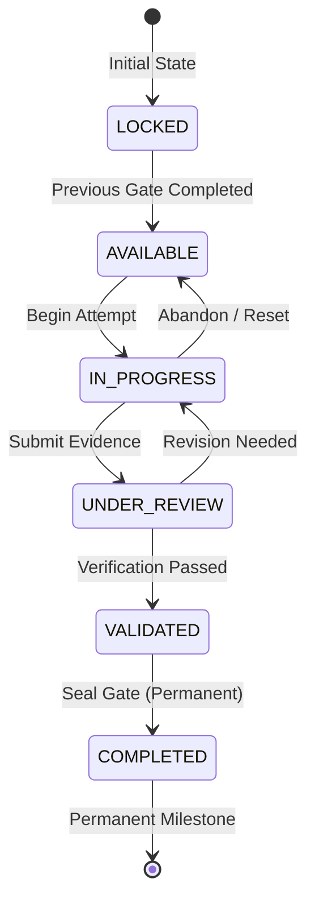

# Competency Gate Domain Documentation

## 1. Domain Architecture & Purpose

The **Competency Gate Domain** serves as the system's mastery checkpoint layer. In this AI-Native Software Engineering Academy, learners do not advance through learning tiers merely by consuming content, finishing exercises, or accumulating XP. A learner advances because **competency requirements have been evaluated, evidence has been audited, and competency gates have been validated**.

### Non-Goals (Strict Negative Scope)
- Does NOT build Portfolio Domain.
- Does NOT build Capstone Domain.
- Does NOT build Analytics Domain.
- Does NOT build Employability / Job Readiness Domain.

---

## 2. Supported Capability Gates

| Level | Slug | Gate Name | Focus Area |
|---|---|---|---|
| **Level 1** | `gate-1-ai-assisted-builder` | **AI-Assisted Builder** | Grounding, context management, test harnesses, code generation |
| **Level 2** | `gate-2-frontend-engineer` | **Frontend Engineer** | Component composition, responsive UI design systems, reactive state |
| **Level 3** | `gate-3-api-integrator` | **API Integrator** | REST / RPC endpoint contracts, MCP protocol implementations |
| **Level 4** | `gate-4-data-model-designer` | **Data Model Designer** | Relational schemas, migrations, row-level security (RLS) policies |
| **Level 5** | `gate-5-production-deployer` | **Production Deployer** | Cloud infra provisioning, secrets management, CI/CD automation |
| **Level 6** | `gate-6-system-architect` | **System Architect** | End-to-end Domain-Driven Design (DDD), multi-tier boundaries |
| **Level 7** | `gate-7-enterprise-engineer` | **Enterprise Engineer** | High-scale fault tolerance, audit compliance, production resilience |

*The platform natively supports arbitrary dynamic future gates.*

---

## 3. State Machine & Transition Rules

### Valid Transition Invariants:
1. `LOCKED` &rarr; `AVAILABLE`
2. `AVAILABLE` &rarr; `IN_PROGRESS`
3. `IN_PROGRESS` &rarr; `UNDER_REVIEW`
4. `UNDER_REVIEW` &rarr; `VALIDATED`
5. `UNDER_REVIEW` &rarr; `IN_PROGRESS` (Revision loop)
6. `VALIDATED` &rarr; `COMPLETED`
7. `COMPLETED` is **immutable and permanent** (transitions out of `COMPLETED` are rejected).

---

## 4. Business Rules Enforced

* **Rule #1: A gate requires evidence**: Every attempt requires verifiable proof (PR link, deployment URL, test run output).
* **Rule #2: A gate requires competency validation**: Passing evaluation result required before sealing.
* **Rule #3: A gate cannot be completed without meeting requirements**: All prerequisite competency, lesson, exercise, achievement, and XP thresholds must be satisfied.
* **Rule #4: Gate completion is permanent**: Enforced via `UNIQUE(user_id, gate_id)` on `gate_completion`.
* **Rule #5: Gate evidence must be auditable**: Stored with timestamps and metadata in `gate_evidence`.
* **Rule #6: Gates determine readiness for future learning**: Higher-tier gates remain locked until lower-tier prerequisite gates are completed.

---

## 5. Database Schema & Tables

1. `competency_gates`: Gate definitions, levels, slugs, descriptions.
2. `gate_requirements`: Multi-type criteria requirements (competency, lesson, exercise, achievement, xp, artifact).
3. `gate_competencies`: Relational mapping connecting gates to specific platform competencies.
4. `user_gate_progress`: User progress percentages (0-100%) and current lifecycle status.
5. `gate_attempts`: Active and past learner attempts.
6. `gate_evidence`: Auditable evidence proofs submitted by learners.
7. `gate_validation`: Validation scores, criterion checklists, and feedback.
8. `gate_completion`: Immutable record of verified completion.

---

## 6. Services & Responsibilities

- **`GateQueryService`**: `getGates`, `getGateById`, `getUserGateStatus`, `getUserGatesOverview`.
- **`GateProgressService`**: `calculateProgress`, `updateProgress`.
- **`GateRequirementService`**: `evaluateRequirements` across learning, competency, exercise, achievement, and XP domains.
- **`GateEvidenceService`**: `collectEvidence`, `retrieveEvidence`.
- **`GateValidationService`**: `validateGate`.
- **`GateCompletionService`**: `completeGate`.
