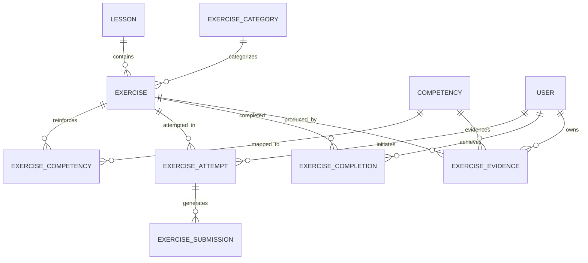
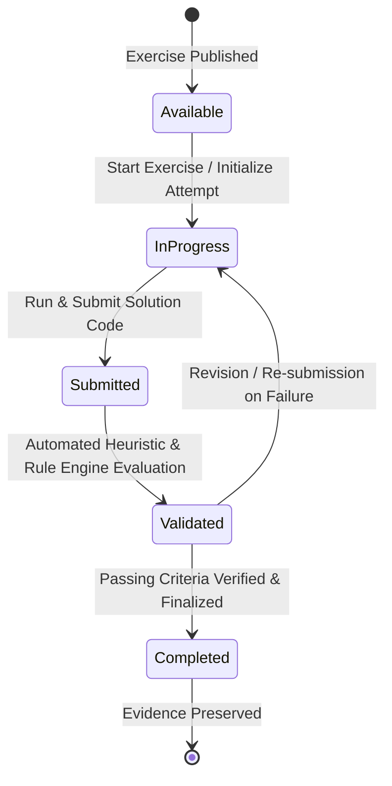

# Exercise Domain Architecture & Specification

## 1. Domain Overview

The **Exercise Domain** (`features/exercises`) is the practical assessment and verification subsystem of the AI-Native Software Engineering LMS. It provides learners with deterministic, hands-on coding challenges designed to reinforce concepts taught in lessons and produce auditable competency evidence.

### Core Responsibilities
- **Hands-on Reinforcement**: Provides code-level implementation challenges mapped directly to lessons.
- **Competency Demonstration**: Maps multi-dimensional competency reinforcement weights to each exercise.
- **Automated Validation**: Executes heuristic and pattern-based verification against submitted solutions.
- **Evidence Generation**: Automatically records auditable evidence of practical mastery upon verified completion.

---

## 2. Domain Model & Entities

### Entity Specifications

1. **`exercise_categories`**: Logical groupings of exercises (e.g. Specification Engineering, Agentic Tooling, Deterministic Testing).
2. **`exercises`**: Core exercise definitions, instructions, starter code, solution templates, estimated time, and validation rules.
3. **`exercise_competencies`**: Weighted mappings between exercises and the competencies they reinforce.
4. **`exercise_attempts`**: Discrete learner sessions with sequential attempt numbering and state tracking.
5. **`exercise_submissions`**: Immutable code submissions with automated validation scores and rule feedback.
6. **`exercise_completion`**: User-level record of highest performance and verified completion timestamp.
7. **`exercise_evidence`**: Auditable evidence records preserving competency demonstration for downstream governance.

---

## 3. State Machine & Lifecycle Transitions

Exercises follow a deterministic 5-stage state machine:

### Transition Rules

| From State | To State | Trigger | Validation Rules |
| :--- | :--- | :--- | :--- |
| `available` | `in_progress` | `startExercise` | Asserts user authentication; verifies attempt limit if configured. |
| `in_progress` | `submitted` | `submitExercise` | Asserts non-empty code buffer within 50KB size ceiling. |
| `submitted` | `validated` | Rule Evaluator | Executes length, prohibited keyword, required token, and AST checks. |
| `validated` | `completed` | `completeExercise` | Asserts latest submission status is `passed` (100% score or threshold). |
| `validated` | `in_progress` | Code Re-edit | Permitted if user wants to iterate or if validation failed. |
| `completed` | *Any* | **ILLEGAL** | Completed attempts are immutable terminal records. |

---

## 4. Business Rules

- **Rule #1: Curriculum Alignment**: Every exercise strictly belongs to a lesson within an active module.
- **Rule #2: Multi-Competency Reinforcement**: An exercise can reinforce multiple competencies with explicit decimal weights (1.0x to 5.0x).
- **Rule #3: Multiple Attempts**: Learners may attempt exercises multiple times. Max attempts are optionally enforceable per exercise.
- **Rule #4: Mandatory Validation**: An exercise cannot be marked as completed without a verified passing submission.
- **Rule #5: Complete Audit Trail**: All attempts, submissions, evaluation outputs, and timestamps are immutable and auditable.
- **Rule #6: Evidence Preservation**: Finalizing exercise completion writes immutable evidence records linking the user, exercise, and reinforced competencies.

---

## 5. API Reference

All endpoints conform to the LMS standard JSON envelope (`{ "data": ... }` or `{ "error": ... }`).

| Method | Endpoint | Description | Auth Required |
| :--- | :--- | :--- | :--- |
| `GET` | `/api/exercises` | List published exercises (supports `?lessonId=` and `?categoryId=`) | Optional |
| `GET` | `/api/exercises/:id` | Get exercise details, active attempt, and latest submission | Optional |
| `GET` | `/api/lessons/:id/exercises` | Get all exercises mapped to a specific lesson | Optional |
| `GET` | `/api/users/me/exercises` | Get authenticated user's exercise progress | Yes |
| `POST` | `/api/exercises/:id/start` | Start a new attempt session for an exercise | Yes |
| `POST` | `/api/exercises/:id/submit` | Submit code solution for automated validation | Yes |
| `POST` | `/api/exercises/:id/complete` | Finalize completion and generate competency evidence | Yes |
| `GET` | `/api/users/me/exercise-history` | Get full chronological attempt and submission history | Yes |

---

## 6. Security & Row-Level Security (RLS)

- **Exercise Definitions & Categories**: Globally readable for published items (`is_published = true`); modifications restricted to service role / admin.
- **Attempts & Submissions**: Strictly isolated via `auth.uid() = user_id`. Learners cannot read or mutate another learner's attempts.
- **Validation Results**: Submissions are created by the authenticated user, but validation outputs are calculated deterministically on the server.
- **Completion & Evidence**: Read and insert restricted to `auth.uid() = user_id`.
