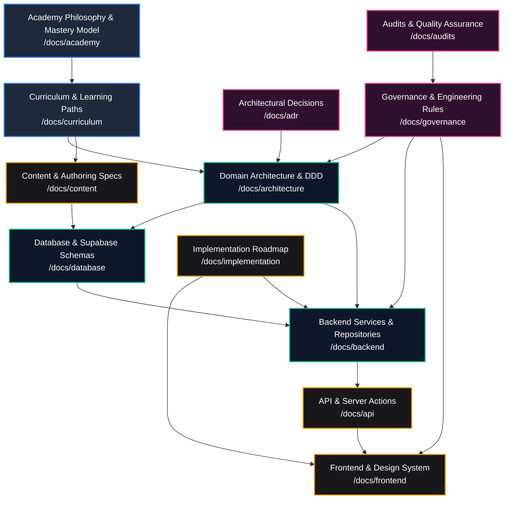

# AI Software Engineering Academy — Documentation Hub

Welcome to the central documentation hub for the **AI-Native Software Engineering LMS & Mastery Learning Platform**. This repository of technical and educational documentation serves as the single source of truth for engineering teams, curriculum architects, instructors, auditors, and technical program managers.

---

## 1. Documentation Hierarchy

The documentation is organized into 12 specialized domains, ensuring modularity, clear ownership, and traceable dependency relationships:

```
docs/
├── README.md                   # Central Navigation Hub (You are here)
├── academy/                    # Pedagogical philosophy, learner journey & mastery model
│   └── README.md
├── curriculum/                 # Syllabus specs, module roadmaps & exercise taxonomy
│   └── README.md
├── architecture/               # Domain-Driven Design (DDD), bounded contexts & system invariants
│   └── README.md
├── database/                   # Supabase PostgreSQL schemas, ERDs, migrations & RLS policies
│   └── README.md
├── api/                        # REST API routes, Server Actions, DTOs & status taxonomy
│   └── README.md
├── frontend/                   # UI design system, App Router architecture, stores & components
│   └── README.md
├── backend/                    # Domain services, repository patterns & business logic
│   └── README.md
├── content/                    # MDX authoring standards, challenge specs & media guidelines
│   └── README.md
├── governance/                 # Engineering standards, zero-regression rules & compliance
│   └── README.md
├── audits/                     # Evidence audit trails, security scans & QA benchmarks
│   └── README.md
├── implementation/             # Phase rollout tracker, technical roadmap & runbooks
│   └── README.md
└── adr/                        # Architectural Decision Records (ADRs) & decision logs
    └── README.md
```

---

## 2. Reading Order & Recommended Pathways

Depending on your role and objective, follow these curated reading paths:

### 🎓 Pathway A: Curriculum Designer & Educational Architect
1. [`docs/academy/README.md`](file:///home/gamp/Documents/lms/docs/academy/README.md) — Understand the mastery learning philosophy and competency taxonomy.
2. [`docs/curriculum/README.md`](file:///home/gamp/Documents/lms/docs/curriculum/README.md) — Review learning paths, module specs, and lesson progressions.
3. [`docs/content/README.md`](file:///home/gamp/Documents/lms/docs/content/README.md) — Follow authoring standards for lessons, exercises, and rubrics.
4. [`docs/audits/README.md`](file:///home/gamp/Documents/lms/docs/audits/README.md) — Understand evidence traceability and validation checks.

### 🏛️ Pathway B: Software Architect & Technical Lead
1. [`docs/architecture/README.md`](file:///home/gamp/Documents/lms/docs/architecture/README.md) — Review bounded contexts, domain invariants, and DDD boundaries.
2. [`docs/adr/README.md`](file:///home/gamp/Documents/lms/docs/adr/README.md) — Read Architectural Decision Records for historical rationale and trade-offs.
3. [`docs/database/README.md`](file:///home/gamp/Documents/lms/docs/database/README.md) — Inspect entity-relationship models, schemas, and RLS rules.
4. [`docs/governance/README.md`](file:///home/gamp/Documents/lms/docs/governance/README.md) — Enforce zero-regression rules and strict boundary policies.

### ⚙️ Pathway C: Backend & Platform Engineer
1. [`docs/architecture/README.md`](file:///home/gamp/Documents/lms/docs/architecture/README.md) — Understand bounded context boundaries and services.
2. [`docs/database/README.md`](file:///home/gamp/Documents/lms/docs/database/README.md) — Check Supabase migrations, triggers, and table structures.
3. [`docs/backend/README.md`](file:///home/gamp/Documents/lms/docs/backend/README.md) — Review repositories, domain services, and transaction invariants.
4. [`docs/api/README.md`](file:///home/gamp/Documents/lms/docs/api/README.md) — Implement and test route handlers and Server Actions.

### 💻 Pathway D: Frontend & UI Engineer
1. [`docs/frontend/README.md`](file:///home/gamp/Documents/lms/docs/frontend/README.md) — Explore the Next.js App Router, design tokens, and components.
2. [`docs/api/README.md`](file:///home/gamp/Documents/lms/docs/api/README.md) — Review data contracts, Server Action responses, and error shapes.
3. [`docs/implementation/README.md`](file:///home/gamp/Documents/lms/docs/implementation/README.md) — Follow local setup instructions and dev guidelines.

---

## 3. Documentation Map

| Directory | Core Purpose | Primary Owner | Update Cadence |
| :--- | :--- | :--- | :--- |
| [`/docs/academy`](file:///home/gamp/Documents/lms/docs/academy/README.md) | Educational mission, mastery model & graduate profile | Academy Dean / Lead Architect | Quarterly |
| [`/docs/curriculum`](file:///home/gamp/Documents/lms/docs/curriculum/README.md) | Syllabus roadmaps, lesson specs & competency mapping | Curriculum Architect | Monthly / Sprint |
| [`/docs/architecture`](file:///home/gamp/Documents/lms/docs/architecture/README.md) | DDD bounded contexts, state machines & invariants | Principal Architect | Continuous |
| [`/docs/database`](file:///home/gamp/Documents/lms/docs/database/README.md) | Supabase schemas, ERDs, RLS policies & migrations | Supabase Architect | Continuous / Migration |
| [`/docs/api`](file:///home/gamp/Documents/lms/docs/api/README.md) | REST routes, Server Actions, DTOs & status codes | Staff Backend Engineer | Continuous |
| [`/docs/frontend`](file:///home/gamp/Documents/lms/docs/frontend/README.md) | Design system, stores, hooks, App Router pages | Staff Frontend Engineer | Continuous |
| [`/docs/backend`](file:///home/gamp/Documents/lms/docs/backend/README.md) | Domain services, repositories & business rules | Staff Backend Engineer | Continuous |
| [`/docs/content`](file:///home/gamp/Documents/lms/docs/content/README.md) | MDX authoring specs, exercise templates & assets | Content Engineering Lead | Sprint |
| [`/docs/governance`](file:///home/gamp/Documents/lms/docs/governance/README.md) | Quality gates, zero-regression rules & compliance | Technical Program Manager | Quarterly |
| [`/docs/audits`](file:///home/gamp/Documents/lms/docs/audits/README.md) | Security reports, test coverage & evidence audits | QA / Security Lead | Monthly |
| [`/docs/implementation`](file:///home/gamp/Documents/lms/docs/implementation/README.md) | Phased domain roadmap & environment runbooks | Technical Program Manager | Sprint |
| [`/docs/adr`](file:///home/gamp/Documents/lms/docs/adr/README.md) | Architectural Decision Records (ADRs) | Architecture Review Board | As Decided |

---

## 4. Dependency Map

The following diagram illustrates the flow of specifications, technical contracts, and implementation dependencies across all documentation sections:



---

## 5. Maintenance & Contribution Rules

1. **Single Source of Truth**: All architectural designs, database migrations, and pedagogical rules must be documented here before or during implementation.
2. **Zero Inconsistency Rule**: Never create or modify application code that conflicts with specifications documented in this directory.
3. **ADR Requirement**: Any fundamental architectural change (e.g. database schema paradigm, state machine transitions, authentication provider) must be accompanied by an Architectural Decision Record in [`/docs/adr`](file:///home/gamp/Documents/lms/docs/adr/README.md).
4. **Link Integrity**: All cross-references must use valid relative links or GitHub-style file links.
