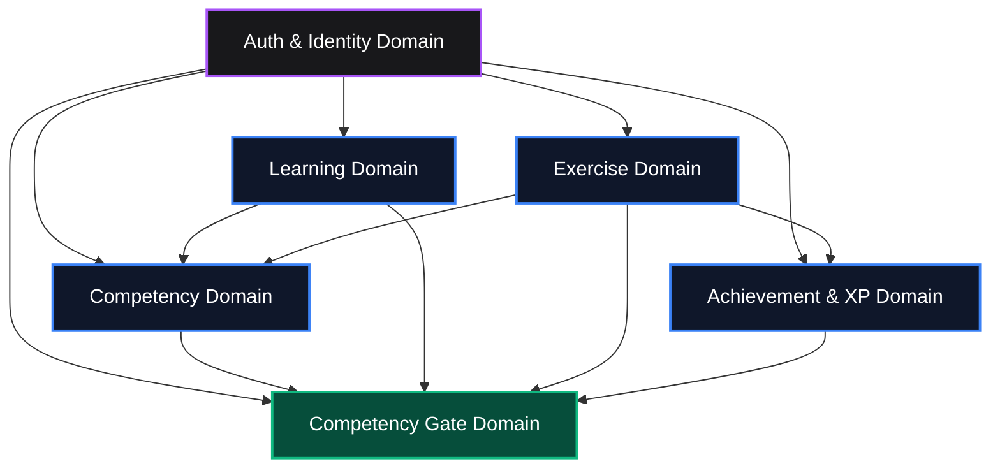

# System Architecture & Domain-Driven Design (DDD)

## 1. Purpose

The `/docs/architecture` documentation domain establishes the technical architecture, bounded contexts, domain invariants, state machines, communication patterns, and non-functional requirements for the AI-Native Learning Management Platform.

This is the central architectural blueprint ensuring strict domain isolation, zero regressions across releases, and high maintainability.

---

## 2. Ownership

- **Lead Owner:** Principal Software Architect
- **Secondary Stakeholders:** Staff Backend Engineers, Staff Frontend Engineers, Architecture Review Board
- **Review Cadence:** Continuous architecture governance & RFC review

---

## 3. Contents & Documentation Index

| Document | Topic | Description | Status |
| :--- | :--- | :--- | :--- |
| `domain-boundary-map.md` | Bounded Contexts | Domain boundaries, context maps, anti-corruption layers, upstream/downstream flow | Active |
| `domain-invariants.md` | Business Invariants | Core invariant rules enforced across all backend services and database schemas | Active |
| `state-machines.md` | State Lifecycle | Formal state machines for Learning, Exercises, Competencies, and Competency Gates | Active |
| `security-architecture.md` | Auth & Isolation | Supabase JWT authentication, Row-Level Security (RLS) policies, RBAC access model | Active |
| `data-flow.md` | System Topography | End-to-end request lifecycle: Client &rarr; Server Action/Route Handler &rarr; Service &rarr; Repository &rarr; PostgreSQL | Active |
| `performance-benchmarks.md` | Scalability & SLOs | Latency targets, query budgets, cache invalidation protocols, and scalability goals | Planned |

---

## 4. Bounded Context Map

---

## 5. Domain Responsibilities & Isolation Rules

1. **Authentication & Identity Domain (`domains/auth`)**: Identity, roles (learner, instructor, admin), profile management.
2. **Learning Domain (`domains/learning`)**: Paths, modules, lessons, sequencing, user learning progress tracking.
3. **Competency Domain (`domains/competencies`)**: Competency taxonomy, state transitions (`not_started` &rarr; `introduced` &rarr; `practicing` &rarr; `reinforced` &rarr; `mastered`), progress scores.
4. **Exercise Domain (`domains/exercises`)**: Interactive code challenges, validation engines, submission evaluation, attempt history.
5. **Achievement & XP Domain (`domains/achievement`)**: Gamification ledger, XP transactions, milestone badges, reward rules.
6. **Competency Gate Domain (`domains/gates`)**: Multi-type requirement checkpoints, evidence artifact archives, validation sealing, permanent completion.

---

## 6. Dependencies & Relationships

- **Upstream Inputs:**
  - [`/docs/academy`](file:///home/gamp/Documents/lms/docs/academy/README.md) & [`/docs/curriculum`](file:///home/gamp/Documents/lms/docs/curriculum/README.md) — Pedagogical requirements.
  - [`/docs/adr`](file:///home/gamp/Documents/lms/docs/adr/README.md) — Architectural decisions and trade-offs.
- **Downstream Consumers:**
  - [`/docs/database`](file:///home/gamp/Documents/lms/docs/database/README.md) — Schema definitions.
  - [`/docs/backend`](file:///home/gamp/Documents/lms/docs/backend/README.md) & [`/docs/frontend`](file:///home/gamp/Documents/lms/docs/frontend/README.md) — Code implementation.
  - [`/docs/governance`](file:///home/gamp/Documents/lms/docs/governance/README.md) — Quality gate validation.
