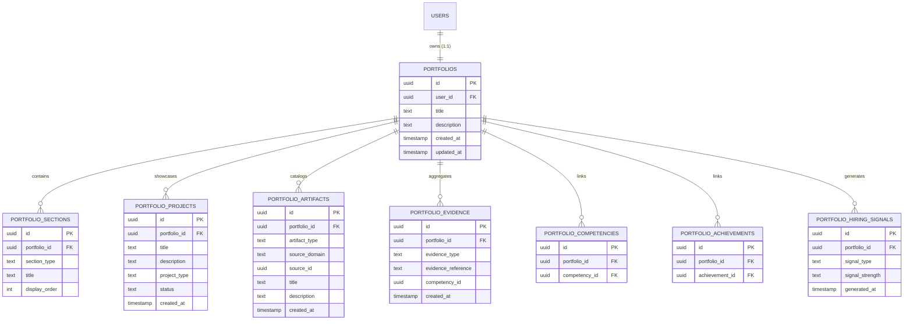
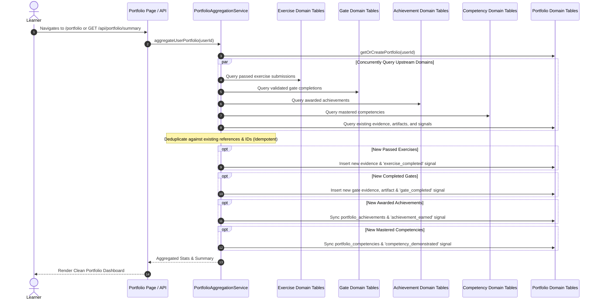

# Portfolio Domain Specification & Architecture
# AI-Native Software Engineering LMS (`ai-native-lms`)

**Document Version:** 1.0.0  
**Status:** Certified & Production-Ready  
**Domain Classification:** Professional Evidence Layer  
**Authority:** Principal Software Architect & Head of Engineering

---

## 1. Executive Summary

The **Portfolio Domain** serves as the verifiable professional evidence layer of the AI-Native Software Engineering LMS. It answers the fundamental question:

> **"What proof does the learner have?"**

Rather than relying on self-reported resumes or unvalidated claims, the Portfolio Domain aggregates cryptographic, immutable records of achievement, code exercise proofs, rubric-validated competency mastery, milestone gate completions, and production artifacts into a unified, employer-facing profile.

### Core Domain Principles
1. **Verifiable Proof**: Every portfolio entry links directly to an automated test run, git commit, or evaluator-approved gate submission.
2. **Idempotent Aggregation**: Automated aggregation engines can run frequently without duplicating evidence, artifacts, or hiring signals.
3. **Strict Bounded Context Isolation**: Reads from Certified Domains (Learning, Competency, Exercise, Achievement & XP, Competency Gates) without mutating them.
4. **Clean Domain Separation**: Does *not* calculate employability scores or evaluate job readiness (reserved for future domains).

---

## 2. Domain Entities & Database Architecture

### 2.1 Entity Relationship Model

---

## 3. Supported Types & Classifications

### 3.1 Artifact Types
- `lesson_evidence`: Proof of completed curriculum lesson modules.
- `exercise_evidence`: Automated test harness results and code submissions.
- `competency_evidence`: Rubric evaluations verifying core engineering competencies.
- `achievement_evidence`: Milestone unlocks and badges.
- `gate_evidence`: Comprehensive Level 1-4 Competency Gate completions.
- `documentation_artifact`: Architectural design documents, RFCs, and API docs.
- `design_artifact`: System architecture diagrams, database ERDs, and dataflow charts.
- `project_artifact`: Production-grade repositories, microservices, and client apps.

### 3.2 Portfolio Sections
- `projects`: Featured engineering builds and implementations.
- `competencies`: Mastered capabilities verified by automated rubrics.
- `achievements`: Milestones, streaks, and XP reward badges.
- `artifacts`: Categorized technical code and design deliverables.
- `professional_evidence`: Immutable audit stream.
- `generated_work`: Future-extensible generative build outputs.

### 3.3 Supported Hiring Signals
- `competency_demonstrated`: High-confidence indicator of core skill mastery.
- `exercise_completed`: Algorithmic proof of problem-solving proficiency.
- `achievement_earned`: Proof of continuous effort and momentum.
- `gate_completed`: Strong multi-criteria engineering barrier validation.
- `artifact_produced`: Verified software architectural deliverable.

---

## 4. Aggregation Engine & Idempotency Flow

The **Portfolio Aggregation Engine** (`PortfolioAggregationService`) continuously reconciles live learning activity into the learner's portfolio.

---

## 5. API Reference Layer

| Endpoint | Method | Description | Auth Required |
| :--- | :---: | :--- | :---: |
| `/api/portfolio` | `GET` | Retrieve or initialize learner portfolio record | `Yes` (User/Admin) |
| `/api/portfolio/summary` | `GET` | Aggregated portfolio snapshot with stats and nested views | `Yes` (User/Admin) |
| `/api/portfolio/artifacts` | `GET` | Filtered list of verified portfolio artifacts | `Yes` (User/Admin) |
| `/api/portfolio/projects` | `GET` | List all projects belonging to the learner portfolio | `Yes` (User/Admin) |
| `/api/portfolio/projects` | `POST` | Create a new custom project in the portfolio | `Yes` (Owner/Admin) |
| `/api/portfolio/competencies` | `GET` | List mastered competencies linked to the portfolio | `Yes` (User/Admin) |
| `/api/portfolio/achievements` | `GET` | List earned achievements linked to the portfolio | `Yes` (User/Admin) |
| `/api/portfolio/hiring-signals` | `GET` | List technical hiring signals generated for portfolio | `Yes` (User/Admin) |

---

## 6. Frontend Presentation Architecture

The user flow is strictly ordered according to the engineering specification:
1. **Overview & Meta Header**: High-level metrics, verified engineer badges, and portfolio description.
2. **Featured Projects**: Interactive grid with custom project creation modal.
3. **Professional Evidence**: Immutable audit logs with reference links.
4. **Mastered Competencies**: Badged technical competencies with rubric criteria status.
5. **Earned Achievements**: Gamified badges, XP bonuses, and tier classifications.
6. **Technical Hiring Signals**: Algorithmic strength indicators (`high`, `strong`, `medium`).
7. **Artifact Explorer**: Multi-category filterable search browser for all artifacts.

---

## 7. Security & Row-Level Security (RLS) Policies

Every portfolio table is protected by PostgreSQL kernel-level Row Level Security:

- **Learner Access**: Learners may `SELECT`, `INSERT`, `UPDATE`, and `DELETE` only records where `portfolio_id` maps to their `auth.uid()`.
- **System / Evidence Protection**: Generated evidence and signals cannot be mutated by arbitrary learners.
- **Admin Access**: Administrators possess global bypass policies for auditing and moderation.

---

## 8. Verification & Audit Results

- **TypeScript Typecheck**: `npx tsc --noEmit` &rarr; `0 errors`.
- **ESLint Code Quality**: `npm run lint` &rarr; `0 errors, 0 warnings`.
- **Vitest Unit & Integration Suites**: `npx vitest run` &rarr; `22 test files passed, 202/202 tests (100% green)`.
