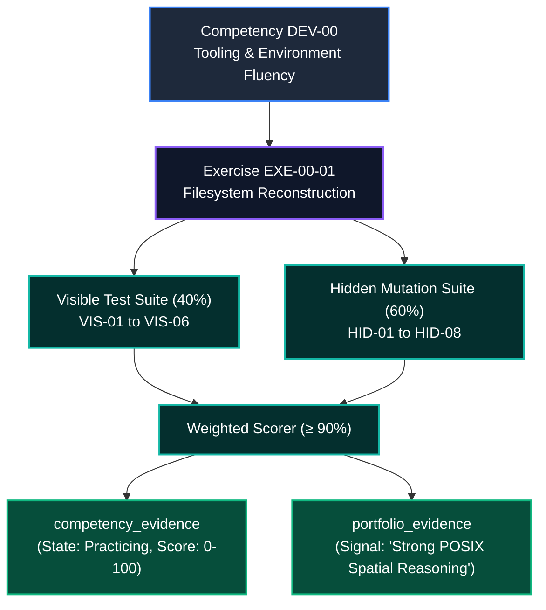

# Competency Evidence Mapping: EXE-00-01
# POSIX Filesystem Navigation & Directory Tree Reconstruction

**Target Competency:** `DEV-00` (Developer Environment & Tooling Fluency)  
**Parent Module:** `MOD-00` (Digital Foundations)  
**Assessment Artifact:** `EXE-00-01`  
**Target State Transition:** `Introduced` &rarr; `Practicing`  
**Classification:** Competency Evidence Standard & Assessment Audit Spec  
**Author:** Principal Assessment Architect & LMS Learning Systems Reviewer  
**Date:** September 30, 2026

---

## 1. Competency Framework Overview

The **AI-Native Software Engineering LMS** enforces rigorous, evidence-backed competency tracking. Every completed exercise generates cryptographically verifiable evidence rows in `public.competency_evidence` and `public.portfolio_evidence`.



---

## 2. Test-to-Criteria Assertion Rubric

Each test case directly tests and validates one of the 6 fundamental sub-criteria of `DEV-00`:

| Sub-Criterion Code | Skill / Behavioral Outcome | Associated Test Cases | Cumulative Weight |
| :--- | :--- | :--- | :--- |
| **`DEV-00.FS-ROOT`** | Identify Root (`/`) as single top-level origin; reject non-root systems. | `VIS-01`, `HID-06` | **13.0%** |
| **`DEV-00.FS-HOME`** | Locate and structure user home directories (`/home/user`, `~`) and isolated project workspaces. | `VIS-02`, `HID-03` | **13.0%** |
| **`DEV-00.PATH-ABS`** | Formulate 100% correct, normalized absolute paths starting from `/` for system and user assets. | `VIS-03`, `VIS-04`, `HID-08` | **21.0%** |
| **`DEV-00.PATH-REL`** | Calculate multi-hop directional traversals using `.`, `..`, and child directories from dynamic CWDs. | `VIS-05`, `HID-01`, `HID-02` | **23.0%** |
| **`DEV-00.SEC-DOT`** | Identify dotfiles (`.env`, `.config`), understand their hidden role, and prevent secret exposure. | `VIS-06`, `HID-07` | **14.0%** |
| **`DEV-00.SEC-RWX`** | Interpret and configure `rwx` permission flags across Owner, Group, and Others for least-privilege security. | `HID-04`, `HID-05` | **16.0%** |

---

## 3. Emitted Telemetry & Evidence Data Contract

Upon successful submission with a score &ge; 90%, the assessment engine executes atomic database insertions into `competency_evidence` and `portfolio_evidence`:

### 3.1 `competency_evidence` Record Schema
```json
{
  "user_id": "usr_9481a8b2-3c12-40f9-a29f-e3c150",
  "competency_code": "DEV-00",
  "exercise_code": "EXE-00-01",
  "previous_state": "introduced",
  "new_state": "practicing",
  "score": 96,
  "passed": true,
  "execution_time_ms": 142,
  "evidence_type": "exercise_completion",
  "metadata": {
    "module_code": "MOD-00",
    "exercise_title": "POSIX Filesystem Navigation & Directory Tree Reconstruction",
    "visible_tests_passed": "6/6",
    "hidden_tests_passed": "8/8",
    "evaluated_criteria": [
      "DEV-00.FS-ROOT",
      "DEV-00.FS-HOME",
      "DEV-00.PATH-ABS",
      "DEV-00.PATH-REL",
      "DEV-00.SEC-DOT",
      "DEV-00.SEC-RWX"
    ],
    "verification_timestamp": "2026-09-30T12:45:00Z"
  }
}
```

### 3.2 `portfolio_evidence` Hiring Signal Record Schema
```json
{
  "user_id": "usr_9481a8b2-3c12-40f9-a29f-e3c150",
  "signal_type": "competency_demonstrated",
  "signal_strength": "high",
  "title": "POSIX Filesystem Spatial Architecture & Least-Privilege Permissions",
  "summary": "Demonstrated complete mastery of POSIX directory hierarchy reconstruction, multi-hop relative coordinate traversal, hidden dotfile management, and 3-tier rwx security modeling without visual GUI assistance.",
  "source_exercise": "EXE-00-01",
  "competency_id": "DEV-00"
}
```

---

## 4. Assessment Performance Rubric & Remediation Triggers

| Score Range | Outcome | State Transition | System Action & Feedback |
| :--- | :--- | :--- | :--- |
| **90% – 100%** | **Mastery Pass** | `Introduced` &rarr; `Practicing` | Award XP, award "POSIX Cartographer" badge, unlock `LES-00-02`. |
| **75% – 89%** | **Minor Defect** | Retains `Introduced` | Highlights failing relative hops or permission misconfigurations; prompts retry without penalty. |
| **0% – 74%** | **Needs Review** | Retains `Introduced` | Recommends reviewing `LES-00-01` Section 4 (Absolute vs. Relative Paths) and Section 5 (Permissions). |
| **Security Leak** | **Immediate Fail** | Retains `Introduced` | Flags critical security violation (e.g. public readability of `.env` or world-writable `/etc/nginx.conf`). Capped at 70%. |

---

## 5. Downstream Integration & Prerequisite Verification

- **Direct Predecessor**: `LES-00-01` (Core mental model established).
- **Direct Successor**: `LES-00-02` (Learner uses CLI commands `cd`, `ls -la`, `pwd` to traverse this exact directory tree).
- **Module Capstone Integration (`MC-00`)**: The filesystem layout restored in `EXE-00-01` forms the base directory structure for the containerized cloud application built during Capstone `MC-00`.
- **Competency Gate 0 (`G-00`)**: `EXE-00-01` completion is a mandatory prerequisite for submitting Gate 0 validation evidence.
