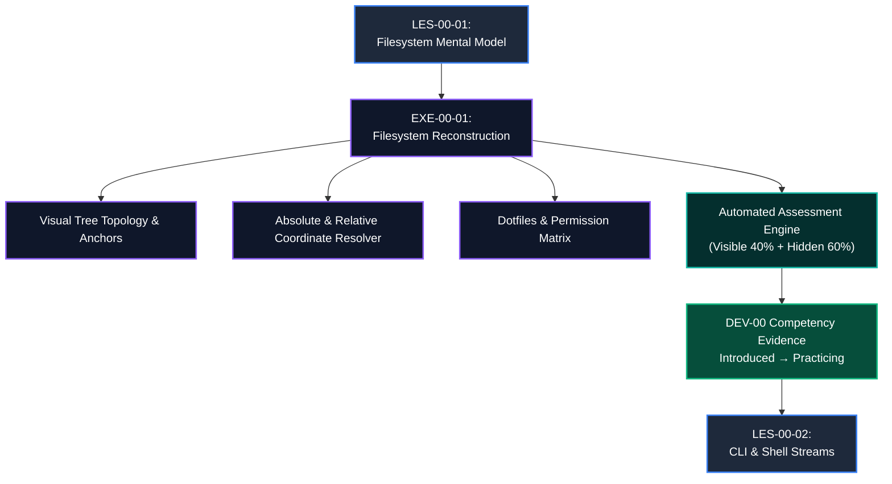

# Exercise Blueprint: EXE-00-01
# POSIX Filesystem Navigation & Directory Tree Reconstruction

**Exercise ID:** `EXE-00-01`  
**Title:** POSIX Filesystem Navigation & Directory Tree Reconstruction  
**Parent Module:** `MOD-00` (Digital Foundations)  
**Prerequisite Lesson:** `LES-00-01` (Files, Folders & The POSIX Filesystem Mental Model)  
**Next Step:** `LES-00-02` (The Command-Line Interface & Shell Streams)  
**Target Competency:** `DEV-00` (Developer Environment & Tooling Fluency)  
**Competency Transition:** `Introduced` &rarr; `Practicing`  
**Estimated Time:** 45–60 Minutes  
**Pass Threshold:** Score &ge; 90% (Weighted Assertions)  
**Assessment Engine:** Zero-Trust Vitest / Structural Evaluation Engine (Visible 40% + Hidden 60%)  
**Author:** Principal Assessment Architect & Senior Software Engineering Educator  
**Version:** 1.0.0 (Production Blueprint)

---

## 1. Pedagogical Rationale & Cognitive Design

### 1.1 The Bridge from Theory to Interactive Practice
In `LES-00-01`, complete beginners acquired the conceptual mental model of the POSIX filesystem:
- The Inverted Tree topology with Root (`/`) as the single absolute origin.
- User workspace isolation in `/home/username` (`~`).
- The coordinate difference between **Absolute Paths** (global, starts with `/`) and **Relative Paths** (local directions using `.`, `..`).
- Hidden configuration files (dotfiles like `.env` and `.config`).
- The three fundamental permission rights (`r`ead, `w`rite, e`x`ecute) across `owner`, `group`, and `others`.

Learners have **NOT** yet been introduced to the command-line interface, terminal emulators, or shell syntax (`cd`, `ls`, `mkdir`, `chmod`). Introducing CLI commands in this exercise would introduce severe extraneous cognitive load and violate syllabus sequencing.

### 1.2 Interactive Paradigm: Declarative Filesystem Reconstruction
`EXE-00-01` tests pure filesystem spatial reasoning and structural coordinate resolution through a **Visual & Declarative Filesystem Manifest**.

Learners act as the **Infrastructure Architect** for a broken cloud web application server. They must reconstruct the corrupt directory hierarchy, define exact absolute path coordinates, map relative multi-hop navigational vectors, and configure the security permission matrix using a clean, structured visual configuration schema.



---

## 2. Core Learning & Assessment Objectives

Upon completing `EXE-00-01`, the learner will have demonstrated measurable mastery across six specific competency criteria:

| Objective ID | Competency Criterion | Assessment Method | Weight |
| :--- | :--- | :--- | :--- |
| **OBJ-01** | **Root Directory Origin Identification**: Correctly identify `/` as the absolute ancestor of all system files and reject non-root top-level anchors. | Topology Manifest & Node Parent Mapping | 15% |
| **OBJ-02** | **User Home Workspace Anchoring**: Correctly map `/home/alex` and resolve the `~` shorthand alias in directory coordinates. | Path Resolution Table | 15% |
| **OBJ-03** | **Absolute Path Coordinate Resolution**: Formulate 100% valid, unambiguous global path strings starting from `/` to reach arbitrary nested target files. | Absolute Coordinate Resolver | 20% |
| **OBJ-04** | **Relative Multi-Hop Path Resolution**: Formulate step-by-step directional paths using `.`, `..`, and child folder tokens from varying working directories. | Relative Vector Matrix | 25% |
| **OBJ-05** | **Hidden Dotfile Recognition & Placement**: Correctly flag, name, and position configuration dotfiles (`.env`, `.config`, `.gitignore`) in personal vs. project scopes. | Node Attribute Classifier | 10% |
| **OBJ-06** | **3-Tier Permission Matrix Interpretation**: Apply correct `rwx` permissions across `owner`, `group`, and `others` to satisfy least-privilege security constraints. | Permission Matrix Validator | 15% |

---

## 3. Structural Challenge Architecture

The exercise presents four sequential, interconnected challenge stages in an interactive visual workbench:

```
┌─────────────────────────────────────────────────────────────────────────────────────────────────┐
│                               EXE-00-01 CHALLENGE STRUCTURE                                      │
├─────────┬───────────────────────────────┬───────────────────────────────────────────────────────┤
│ Stage   │ Challenge Focus               │ Pedagogical Task                                      │
├─────────┼───────────────────────────────┼───────────────────────────────────────────────────────┤
│ Stage 1 │ Tree Topology Reconstruction  │ Rebuild the upside-down tree starting from Root (`/`).│
│         │ & Anchor Placement            │ Position system directories (`/etc`, `/var`, `/tmp`)  │
│         │                               │ and the user home tree (`/home/alex/projects`).       │
├─────────┼───────────────────────────────┼───────────────────────────────────────────────────────┤
│ Stage 2 │ Absolute Path Mapping         │ Compute exact absolute paths for server logs, system  │
│         │                               │ configuration, database dumps, and application code.  │
├─────────┼───────────────────────────────┼───────────────────────────────────────────────────────┤
│ Stage 3 │ Relative Navigation Vectors   │ Compute relative directional vectors between sibling  │
│         │ (Up `..`, Here `.`, Down `/`) │ and deeply nested directories from 4 different CWDs.  │
├─────────┼───────────────────────────────┼───────────────────────────────────────────────────────┤
│ Stage 4 │ Dotfiles & Security Matrix    │ Assign appropriate `rwx` permissions (read/write/exec)│
│         │ Configuration                 │ for production secrets, executable tools, and logs.   │
└─────────┴───────────────────────────────┴───────────────────────────────────────────────────────┘
```

---

## 4. Assessment Engine Specification

### 4.1 Test Suite Breakdown
The exercise is evaluated by an automated testing suite comprising **14 distinct test cases** divided into two tiers:

- **Visible Tests (40% Weight / 6 Tests)**: 
  Exposed directly in the learner's test runner tab. Provides immediate, actionable diagnostic feedback when baseline structural invariants fail.
- **Hidden Tests (60% Weight / 8 Tests)**:
  Evaluated upon submission. Tests deep multi-hop traversal (`../../../`), edge-case path canonicalization, boundary conditions (attempting to `..` above root), whitespace safety, and strict least-privilege security validation.

### 4.2 Scoring Formula
$$\text{Final Score} = \sum_{i=1}^{N_{\text{visible}}} \left(w_i \cdot \text{passed}_i\right) + \sum_{j=1}^{N_{\text{hidden}}} \left(w_j \cdot \text{passed}_j\right)$$

- Total Available Points: **100.0**
- Passing Threshold: **&ge; 90.0**
- Hard Gate: A failure on any critical security permission test (e.g. leaking write permissions on `/etc` to `others`) caps the maximum achievable score at 75%, requiring remediation before passing.

---

## 5. Competency State Transition: `DEV-00`

```
┌─────────────────────────────────────────────────────────────────────────────────────────────────┐
│                                DEV-00 COMPETENCY PROGRESSION                                    │
├─────────────────────┬─────────────────────────────────┬─────────────────────────────────────────┤
│ State               │ Criteria                        │ Evidence Generated by EXE-00-01         │
├─────────────────────┼─────────────────────────────────┼─────────────────────────────────────────┤
│ **Introduced**      │ Passed LES-00-01 reading & quiz │ Conceptual awareness of `/`, `~`, `rwx`.│
├─────────────────────┼─────────────────────────────────┼─────────────────────────────────────────┤
│ **Practicing**      │ **Passed EXE-00-01 (&ge; 90%)** │ • Reconstructed multi-tier tree.        │
│ (Target State)      │                                 │ • 100% accuracy on relative navigation. │
│                     │                                 │ • Correct security permission matrix.   │
├─────────────────────┼─────────────────────────────────┼─────────────────────────────────────────┤
│ **Reinforced**      │ Completed EXE-00-02 & EXE-00-03 │ Live CLI shell streams & log grepping.  │
├─────────────────────┼─────────────────────────────────┼─────────────────────────────────────────┤
│ **Mastered**        │ Validated Gate G-00             │ End-to-end autonomous environment build.│
└─────────────────────┴─────────────────────────────────┴─────────────────────────────────────────┘
```

---

## 6. Pre-Flight Verification Checklist

- [x] **Zero CLI Prerequisites**: No bash commands, shell scripting, or terminal prompts required.
- [x] **Zero Programming Syntax**: Uses intuitive declarative structure and coordinate tables.
- [x] **Direct Alignment with LES-00-01**: Every tested concept was taught in LES-00-01.
- [x] **Syllabus Continuity**: Perfectly primes the learner for LES-00-02 (where they will navigate this same tree using terminal commands like `pwd`, `cd`, and `ls`).
