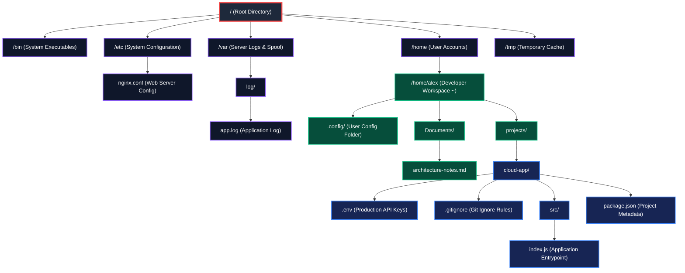

# Exercise Specification: EXE-00-01
# POSIX Filesystem Navigation & Directory Tree Reconstruction

**Exercise Code:** `EXE-00-01`  
**Target Competency:** `DEV-00` (Tooling & Development Environment)  
**Parent Module:** `MOD-00` (Digital Foundations)  
**Estimated Time:** 45–60 Minutes  
**Prerequisites:** Completed [LES-00-01: Files, Folders & The POSIX Filesystem Mental Model](file:///home/gamp/Documents/lms/lessons/les-00-01.md)  
**Pass Criteria:** Automated Score &ge; 90% (100% Green on all critical security assertions)

---

## 1. Mission Briefing: The Corrupted Cloud Server

You have just joined the infrastructure team at **NovaCloud**. 

A junior administrator attempted to reconfigure a production server hosting an e-commerce web application. In the process, the server's directory configuration manifest was corrupted:
1. Directory parent-child relationships were scrambled.
2. Several critical system files lost their absolute path references.
3. Automated backup scripts are failing because relative navigation paths (`..`, `.`) are broken.
4. Production secrets (`.env`) and configuration dotfiles are misplaced.
5. Insecure file permissions were applied, leaving sensitive configuration files editable by anyone.

### Your Mission
As the Developer Environment Engineer, you must restore the server to working order by completing the **Filesystem Manifest & Coordinate Table** below. 

You do **not** need to type terminal commands or write code. You will define the filesystem topology, resolve path coordinates, identify hidden dotfiles, and set safe permissions using the declarative structure provided.

---

## 2. Server Architecture Overview

The target server runs a standard POSIX-compliant operating system. When correctly assembled, the directory tree must match this architectural layout:



---

## 3. Step-by-Step Exercise Instructions

The exercise requires completing four specific configuration sections inside your submission manifest:

### Section 1: Directory Tree Topology & Anchors
Reconstruct the hierarchy by mapping each folder to its exact parent directory:
- The top-level **Root Directory** has path `"/"` and parent `null`.
- Top-level system folders (`/bin`, `/etc`, `/home`, `/var`, `/tmp`) have parent `"/"`.
- User workspace folder `/home/alex` has parent `"/home"`.
- Application workspace `/home/alex/projects/cloud-app` has parent `"/home/alex/projects"`.

### Section 2: Absolute Path Resolution
Provide the exact, unambiguous **Absolute Path** starting from Root (`/`) for the following 5 target files:
1. **The Web Server Configuration**: `nginx.conf` inside `/etc`
2. **The Production Application Log**: `app.log` inside `/var/log`
3. **The Developer Architecture Notes**: `architecture-notes.md` inside `alex`'s `Documents` folder
4. **The Application Secret Keys**: `.env` inside the `cloud-app` project
5. **The Application Source Code**: `index.js` inside the `src` folder of `cloud-app`

### Section 3: Relative Path Traversal (Navigational Vectors)
Given a specific **Current Working Directory (CWD)** where you are standing, calculate the exact **Relative Path** to reach the specified target without starting with `/`:

| Scenario ID | You Are Standing Inside (CWD) | Target File to Reach | Required Relative Path |
| :--- | :--- | :--- | :--- |
| `REL-01` | `/home/alex/projects/cloud-app` | `package.json` in current folder | `./package.json` or `package.json` |
| `REL-02` | `/home/alex/projects/cloud-app` | `index.js` in the `src` subfolder | `src/index.js` or `./src/index.js` |
| `REL-03` | `/home/alex/projects/cloud-app` | `architecture-notes.md` in sibling `Documents` | `../../Documents/architecture-notes.md` |
| `REL-04` | `/home/alex/projects/cloud-app/src` | `app.log` in `/var/log` | `../../../../var/log/app.log` |
| `REL-05` | `/home/alex` | `.env` inside `cloud-app` | `projects/cloud-app/.env` |

### Section 4: Hidden Files & Security Permission Matrix
Configure the dotfile flag and standard `rwx` permission triplets (`owner`, `group`, `others`) for each of the 4 critical files according to the **Principle of Least Privilege**:

1. **`nginx.conf` (System Server Config)**:
   - Is Hidden: `false`
   - Owner (root): `read`, `write`, `no-execute` (`rw-`)
   - Group (admin): `read`, `no-write`, `no-execute` (`r--`)
   - Others (public): `read`, `no-write`, `no-execute` (`r--`)
2. **`.env` (Application API Keys & Secrets)**:
   - Is Hidden: `true` (starts with `.`)
   - Owner (alex): `read`, `write`, `no-execute` (`rw-`)
   - Group: `no-read`, `no-write`, `no-execute` (`---`)
   - Others: `no-read`, `no-write`, `no-execute` (`---`) *(Must NOT be readable by others!)*
3. **`index.js` (Server Execution Script)**:
   - Is Hidden: `false`
   - Owner (alex): `read`, `write`, `execute` (`rwx`)
   - Group: `read`, `no-write`, `execute` (`r-x`)
   - Others: `read`, `no-write`, `execute` (`r-x`)
4. **`.config/` (User Configuration Directory)**:
   - Is Hidden: `true` (starts with `.`)
   - Owner (alex): `read`, `write`, `execute` (`rwx`)
   - Group: `no-read`, `no-write`, `no-execute` (`---`)
   - Others: `no-read`, `no-write`, `no-execute` (`---`)

---

## 4. Starter Template (`submission.json`)

Learners are provided with the following initial template with `TODO` placeholders to complete:

```json
{
  "exercise_code": "EXE-00-01",
  "learner_workspace": "/home/alex",
  "section_1_topology": [
    { "path": "/", "parent": null, "type": "directory" },
    { "path": "/bin", "parent": "/", "type": "directory" },
    { "path": "/etc", "parent": "/", "type": "directory" },
    { "path": "/home", "parent": "/", "type": "directory" },
    { "path": "/var", "parent": "/", "type": "directory" },
    { "path": "/tmp", "parent": "/", "type": "directory" },
    { "path": "/var/log", "parent": "TODO", "type": "directory" },
    { "path": "/home/alex", "parent": "TODO", "type": "directory" },
    { "path": "/home/alex/Documents", "parent": "TODO", "type": "directory" },
    { "path": "/home/alex/projects", "parent": "TODO", "type": "directory" },
    { "path": "/home/alex/projects/cloud-app", "parent": "TODO", "type": "directory" },
    { "path": "/home/alex/projects/cloud-app/src", "parent": "TODO", "type": "directory" }
  ],
  "section_2_absolute_paths": {
    "nginx_config": "TODO",
    "application_log": "TODO",
    "architecture_notes": "TODO",
    "production_env_secrets": "TODO",
    "application_entrypoint": "TODO"
  },
  "section_3_relative_paths": {
    "from_cloud_app_to_package_json": "TODO",
    "from_cloud_app_to_index_js": "TODO",
    "from_cloud_app_to_architecture_notes": "TODO",
    "from_src_to_application_log": "TODO",
    "from_home_to_env_secrets": "TODO"
  },
  "section_4_permissions_and_dotfiles": {
    "nginx_config": {
      "is_hidden": false,
      "owner": { "read": true, "write": true, "execute": false },
      "group": { "read": true, "write": false, "execute": false },
      "others": { "read": true, "write": false, "execute": false }
    },
    "env_secrets": {
      "is_hidden": "TODO: boolean",
      "owner": { "read": true, "write": true, "execute": false },
      "group": { "read": "TODO: boolean", "write": false, "execute": false },
      "others": { "read": "TODO: boolean", "write": false, "execute": false }
    },
    "application_entrypoint": {
      "is_hidden": false,
      "owner": { "read": true, "write": true, "execute": "TODO: boolean" },
      "group": { "read": true, "write": false, "execute": "TODO: boolean" },
      "others": { "read": true, "write": false, "execute": "TODO: boolean" }
    }
  }
}
```

---

## 5. Reference Solution Specification

A 100% compliant submission contains:

```json
{
  "exercise_code": "EXE-00-01",
  "learner_workspace": "/home/alex",
  "section_1_topology": [
    { "path": "/", "parent": null, "type": "directory" },
    { "path": "/bin", "parent": "/", "type": "directory" },
    { "path": "/etc", "parent": "/", "type": "directory" },
    { "path": "/home", "parent": "/", "type": "directory" },
    { "path": "/var", "parent": "/", "type": "directory" },
    { "path": "/tmp", "parent": "/", "type": "directory" },
    { "path": "/var/log", "parent": "/var", "type": "directory" },
    { "path": "/home/alex", "parent": "/home", "type": "directory" },
    { "path": "/home/alex/Documents", "parent": "/home/alex", "type": "directory" },
    { "path": "/home/alex/projects", "parent": "/home/alex", "type": "directory" },
    { "path": "/home/alex/projects/cloud-app", "parent": "/home/alex/projects", "type": "directory" },
    { "path": "/home/alex/projects/cloud-app/src", "parent": "/home/alex/projects/cloud-app", "type": "directory" }
  ],
  "section_2_absolute_paths": {
    "nginx_config": "/etc/nginx.conf",
    "application_log": "/var/log/app.log",
    "architecture_notes": "/home/alex/Documents/architecture-notes.md",
    "production_env_secrets": "/home/alex/projects/cloud-app/.env",
    "application_entrypoint": "/home/alex/projects/cloud-app/src/index.js"
  },
  "section_3_relative_paths": {
    "from_cloud_app_to_package_json": "package.json",
    "from_cloud_app_to_index_js": "src/index.js",
    "from_cloud_app_to_architecture_notes": "../../Documents/architecture-notes.md",
    "from_src_to_application_log": "../../../../var/log/app.log",
    "from_home_to_env_secrets": "projects/cloud-app/.env"
  },
  "section_4_permissions_and_dotfiles": {
    "nginx_config": {
      "is_hidden": false,
      "owner": { "read": true, "write": true, "execute": false },
      "group": { "read": true, "write": false, "execute": false },
      "others": { "read": true, "write": false, "execute": false }
    },
    "env_secrets": {
      "is_hidden": true,
      "owner": { "read": true, "write": true, "execute": false },
      "group": { "read": false, "write": false, "execute": false },
      "others": { "read": false, "write": false, "execute": false }
    },
    "application_entrypoint": {
      "is_hidden": false,
      "owner": { "read": true, "write": true, "execute": true },
      "group": { "read": true, "write": false, "execute": true },
      "others": { "read": true, "write": false, "execute": true }
    }
  }
}
```

---

## 6. Success Feedback & Next Step

When your submission achieves &ge; 90% and passes all security checks:
- You earn the **POSIX Cartographer** micro-credential badge.
- Your competency rating for **`DEV-00`** transitions from **Introduced &rarr; Practicing**.
- You are unlocked to begin **`LES-00-02: The Command-Line Interface (CLI) & Shell Streams`**, where you will use real terminal commands (`pwd`, `cd`, `ls -la`) to navigate this very filesystem in live sandbox terminals.
