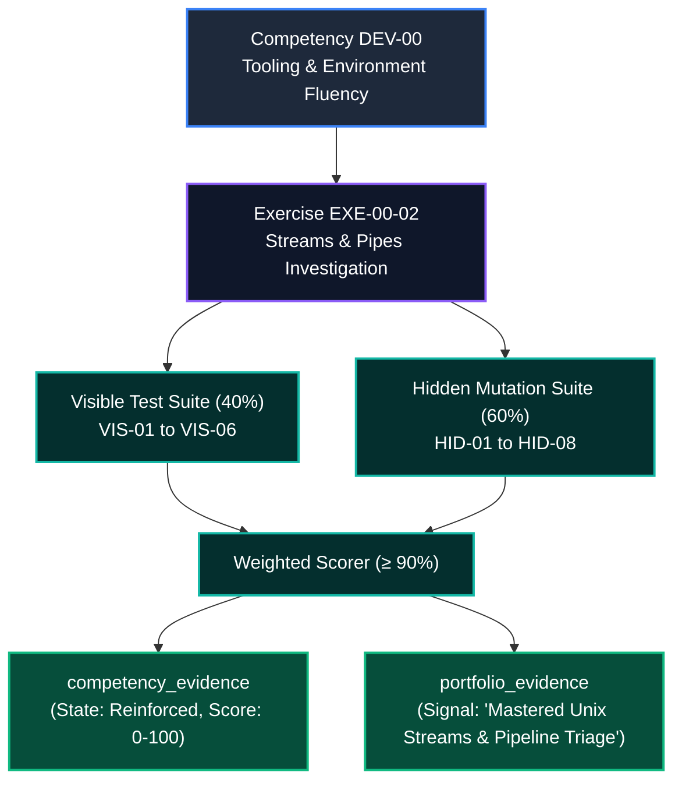

# Competency Evidence Mapping: EXE-00-02
# Shell Streams, Pipes & Command Flow Investigation

**Target Competency:** `DEV-00` (Developer Environment & Tooling Fluency)  
**Parent Module:** `MOD-00` (Digital Foundations)  
**Assessment Artifact:** `EXE-00-02`  
**Target State Transition:** `Practicing` &rarr; `Reinforced`  
**Classification:** Competency Evidence Standard & Assessment Audit Spec  
**Author:** Principal Assessment Architect & LMS Learning Systems Reviewer  
**Date:** September 30, 2026

---

## 1. Competency Framework Overview

The **AI-Native Software Engineering LMS** enforces rigorous, evidence-backed competency tracking. Every completed exercise generates cryptographically verifiable evidence records in `public.competency_evidence` and `public.portfolio_evidence`.



---

## 2. Test-to-Criteria Assertion Rubric

Each test case directly evaluates one of the 6 fundamental sub-criteria of `DEV-00`:

| Sub-Criterion Code | Skill / Behavioral Outcome | Associated Test Cases | Cumulative Weight |
| :--- | :--- | :--- | :--- |
| **`DEV-00.CLI-ENV`** | Distinguish terminal emulator window from shell interpreter execution engine. | `VIS-01` | **5.0%** |
| **`DEV-00.CLI-ANAT`** | Deconstruct complex CLI strings into program executable, options/flags, and positional operands. | `VIS-02`, `VIS-03` | **15.0%** |
| **`DEV-00.STRM-FD`** | Identify standard streams (`stdin 0`, `stdout 1`, `stderr 2`) and predict default routing. | `VIS-04`, `HID-01` | **13.0%** |
| **`DEV-00.STRM-REDIR`** | Apply file redirection operators (`>`, `>>`, `2>`, `2>&1`) to isolate diagnostic output and prevent log loss. | `VIS-05`, `HID-02` | **13.0%** |
| **`DEV-00.PIPE-COMP`** | Compose multi-stage Unix pipelines connecting upstream `stdout` to downstream `stdin` (`cat \| grep \| sort \| uniq \| head`). | `VIS-06`, `HID-03`, `HID-04`, `HID-05` | **36.0%** |
| **`DEV-00.PIPE-DIAG`** | Triage and debug pipeline bugs including stream leakage, redirect vs. pipe confusion, and accidental truncation. | `HID-06`, `HID-07`, `HID-08` | **18.0%** |

---

## 3. Emitted Telemetry & Evidence Data Contract

Upon successful submission with a score &ge; 90%, the assessment engine executes atomic database insertions into `competency_evidence` and `portfolio_evidence`:

### 3.1 `competency_evidence` Record Schema
```json
{
  "user_id": "usr_9481a8b2-3c12-40f9-a29f-e3c150",
  "competency_code": "DEV-00",
  "exercise_code": "EXE-00-02",
  "previous_state": "practicing",
  "new_state": "reinforced",
  "score": 98,
  "passed": true,
  "execution_time_ms": 118,
  "evidence_type": "exercise_completion",
  "metadata": {
    "module_code": "MOD-00",
    "exercise_title": "Shell Streams, Pipes & Command Flow Investigation",
    "visible_tests_passed": "6/6",
    "hidden_tests_passed": "8/8",
    "evaluated_criteria": [
      "DEV-00.CLI-ENV",
      "DEV-00.CLI-ANAT",
      "DEV-00.STRM-FD",
      "DEV-00.STRM-REDIR",
      "DEV-00.PIPE-COMP",
      "DEV-00.PIPE-DIAG"
    ],
    "verification_timestamp": "2026-09-30T13:00:00Z"
  }
}
```

### 3.2 `portfolio_evidence` Hiring Signal Record Schema
```json
{
  "user_id": "usr_9481a8b2-3c12-40f9-a29f-e3c150",
  "signal_type": "competency_demonstrated",
  "signal_strength": "strong",
  "title": "Unix Shell Streams, Pipeline Composition & Triage Mastery",
  "summary": "Demonstrated complete mastery of Unix command anatomy deconstruction, three-stream routing (stdin/stdout/stderr), file redirection mechanics, multi-stage log analysis pipeline construction, and production stream debugging.",
  "source_exercise": "EXE-00-02",
  "competency_id": "DEV-00"
}
```

---

## 4. Mastery Gate Progression Impact

`EXE-00-02` serves as the final required exercise in `MOD-00` for transitioning `DEV-00` from `Practicing` to `Reinforced`. Completing this exercise unlocks `LES-00-03` (*How the Web Works: HTTP, Networks & Browser DevTools*) and provides the prerequisite command fluency required for Capstone Gate 1 (*Foundation Mastery*).
