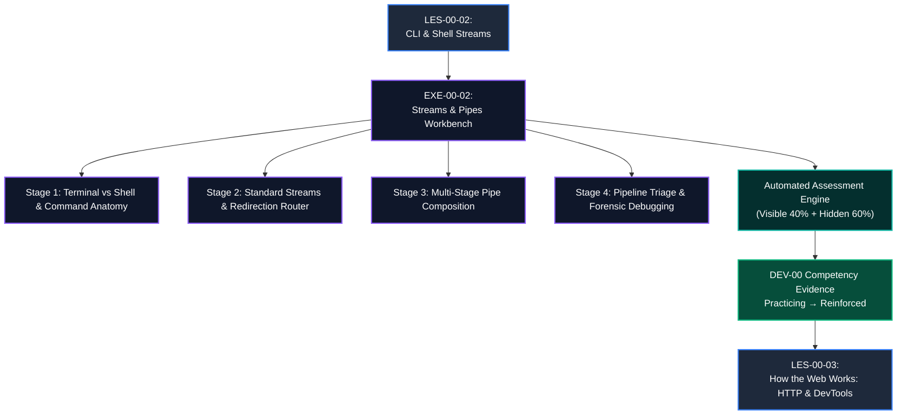

# Exercise Blueprint: EXE-00-02
# Shell Streams, Pipes & Command Flow Investigation

**Exercise ID:** `EXE-00-02`  
**Title:** Shell Streams, Pipes & Command Flow Investigation  
**Parent Module:** `MOD-00` (Digital Foundations)  
**Prerequisite Lesson:** `LES-00-02` (The Command-Line Interface (CLI) & Shell Streams)  
**Successor Lesson:** `LES-00-03` (How the Web Works: HTTP, Networks & Browser DevTools)  
**Target Competency:** `DEV-00` (Developer Environment & Tooling Fluency)  
**Competency Transition:** `Practicing` &rarr; `Reinforced`  
**Estimated Time:** 45–60 Minutes  
**Pass Threshold:** Score &ge; 90% (Weighted Assertions)  
**Assessment Engine:** Zero-Trust Vitest / Structural Evaluation Engine (Visible 40% + Hidden 60%)  
**Author:** Principal Assessment Architect & Senior Software Engineering Educator  
**Version:** 1.0.0 (Production Blueprint)

---

## 1. Pedagogical Rationale & Cognitive Design

### 1.1 The Bridge from CLI Mental Model to Stream Investigation
In `LES-00-02`, learners transitioned from static filesystem hierarchy into dynamic command execution:
- The distinction between the **Terminal Emulator** (visual input/output window) and the **Shell** (the command interpreter program).
- The three-part **Command Anatomy**: Executable program name, Options/Flags (modifying behavior), and Arguments (operands/targets).
- The three Standard Unix Streams:
  - **Standard Input (`stdin`, File Descriptor 0)**: The default data inlet.
  - **Standard Output (`stdout`, File Descriptor 1)**: The normal data outlet.
  - **Standard Error (`stderr`, File Descriptor 2)**: The unbuffered diagnostic/error channel.
- **Redirection Operators**: Writing to files (`>`, `>>`), capturing error messages (`2>`, `2>&1`), and reading file input (`<`).
- **Pipes (`|`)**: Connecting the `stdout` of an upstream program directly into the `stdin` of a downstream program to create linear Unix processing pipelines.

Learners have **NOT** yet learned shell scripting, Bash programming, loops, variables, functions, or programming languages (JavaScript/Python). Requiring code writing or script authoring in this exercise is strictly forbidden.

### 1.2 Interactive Paradigm: Visual Stream Composer & Diagnostic Triage
`EXE-00-02` evaluates command anatomy reasoning, standard stream routing, pipe composition, and pipeline failure triage through an **Interactive Terminal Simulation & Visual Stream Workbench**.

Learners act as the **Site Reliability & Triage Engineer** investigating an active production outage on a cloud application server (`gateway-prod-01`). They must:
1. Deconstruct failing command strings into executable, flags, and arguments.
2. Route standard output (`stdout`) and standard error (`stderr`) streams to isolate incident diagnostics from healthy metrics.
3. Assemble a multi-stage forensic log analysis pipeline using Unix stream primitives (`cat`, `grep`, `sort`, `uniq`, `head`).
4. Diagnose and fix broken command pipelines where stream routing errors cause silent data loss or corrupted telemetry.



---

## 2. Core Learning & Assessment Objectives

Upon completing `EXE-00-02`, the learner will have demonstrated measurable mastery across six specific competency criteria:

| Objective ID | Competency Criterion | Assessment Method | Weight |
| :--- | :--- | :--- | :--- |
| **OBJ-01** | **Terminal vs. Shell Distinction**: Correctly distinguish between GUI terminal emulators (display/input layer) and shell interpreters (execution/stream layer). | Structural Concept Matrix | 10% |
| **OBJ-02** | **Command Anatomy Deconstruction**: Accurately isolate executable programs, option flags (short and long form), and positional target arguments without syntax confusion. | Token Decomposition Matrix | 15% |
| **OBJ-03** | **Standard Stream Routing**: Correctly identify and route `stdin (0)`, `stdout (1)`, and `stderr (2)` channels under normal execution and failure conditions. | Stream Routing Workbench | 20% |
| **OBJ-04** | **File Redirection Mechanics**: Differentiate destructive overwrite (`>`), safe append (`>>`), error capture (`2>`), and stream merging (`2>&1`). | Redirection Resolver | 20% |
| **OBJ-05** | **Linear Pipe Composition**: Assemble multi-command pipelines connecting upstream `stdout` to downstream `stdin` to solve log processing challenges. | Visual Pipeline Composer | 20% |
| **OBJ-06** | **Pipeline Failure Diagnosis**: Identify common pipeline bugs including stream leakage, redirect vs. pipe confusion, and accidental file truncation. | Diagnostic Triage Workbench | 15% |

---

## 3. Structural Challenge Architecture

The exercise is structured into four sequential, interconnected challenge stages in an interactive visual workbench:

```
┌─────────────────────────────────────────────────────────────────────────────────────────────────┐
│                               EXE-00-02 CHALLENGE STRUCTURE                                      │
├─────────┬───────────────────────────────┬───────────────────────────────────────────────────────┤
│ Stage   │ Challenge Focus               │ Pedagogical Task                                      │
├─────────┼───────────────────────────────┼───────────────────────────────────────────────────────┤
│ Stage 1 │ Command Anatomy & Terminal    │ Classify terminal vs. shell roles. Deconstruct 3       │
│         │ Environment Deconstruction    │ production CLI commands into Executable, Flags, and   │
│         │                               │ Arguments.                                            │
├─────────┼───────────────────────────────┼───────────────────────────────────────────────────────┤
│ Stage 2 │ Standard Streams &            │ Route standard output (`1`) and standard error (`2`)  │
│         │ Redirection Router            │ streams from failing application commands to log files│
│         │                               │ using `>`, `>>`, `2>`, and `2>&1`.                    │
├─────────┼───────────────────────────────┼───────────────────────────────────────────────────────┤
│ Stage 3 │ Multi-Stage Pipe Composition  │ Assemble a 5-step log investigation pipeline:         │
│         │ & Stream Flow Engine          │ `cat` → `grep` → `sort` → `uniq -c` → `head -n 5`      │
│         │                               │ to extract the top 5 failing API endpoints.           │
├─────────┼───────────────────────────────┼───────────────────────────────────────────────────────┤
│ Stage 4 │ Pipeline Debugging &          │ Triage and correct 3 broken command pipelines with    │
│         │ Failure Mode Triage           │ pipe vs. redirect confusion and stderr leakage bugs.  │
└─────────┴───────────────────────────────┴───────────────────────────────────────────────────────┘
```

---

## 4. Assessment Engine Specification

### 4.1 Test Suite Breakdown
The exercise is evaluated by an automated evaluation engine comprising **14 distinct invariant test assertions** divided into two tiers:
- **Visible Tests (6 assertions / 40% weight)**: Real-time feedback in the workspace workbench.
- **Hidden Invariant Tests (8 assertions / 60% weight)**: Boundary conditions, stream leak edge cases, and failure mode verification.

### 4.2 Mathematical Scoring & Pass Threshold
$$\text{Total Score} = \sum_{i=1}^{6} (\text{Visible Test}_i \times W_i) + \sum_{j=1}^{8} (\text{Hidden Test}_j \times W_j)$$

- **Pass Threshold**: $\text{Total Score} \ge 90.0\%$
- **Submission Output**: A deterministic, structured JSON payload synthesized by visual UI interactions.

---

## 5. Security, Invariant & Zero-Regression Guardrails

1. **Zero Raw Code Writing**: Complete beginners interact through visual command tokens, stream routing switches, and pipeline connector blocks.
2. **Deterministic Evaluation**: All assertion checks run against deterministic stream contracts with zero external network dependencies.
3. **Traceable Telemetry**: Validation runs are recorded in `public.assessment_runs` and generate verifiable competency evidence in `public.competency_evidence` for `DEV-00`.
