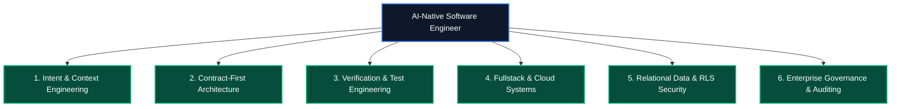

# Graduate Definition & Engineering Profile Standard
# AI-Native Software Engineering Academy (`ai-native-lms`)

**Document Version:** 1.0.0  
**Status:** Authoritative Graduate Competency Standard  
**Authority:** Academy Systems Architect & Engineering Hiring Advisory Board  
**Target Profile:** The Certified AI-Native Software Engineer  
**Classification:** Core Academy Specification  
**Effective Date:** September 30, 2026

---

## 1. Who Is the Graduate?

A graduate of the AI-Native Software Engineering Academy is not merely a coder or syntax memorizer. A graduate is a **Technical Orchestrator, Systems Architect, and Verification Authority**.

In an industry transformed by generative AI, the bottleneck of software engineering is no longer typing syntax—it is **problem decomposition, architectural specification, context curation, and ruthless verification**. 

Our graduates possess the cognitive rigor, systems literacy, and practical toolchain mastery to take ambiguous human requirements, translate them into formal executable specifications, drive AI code generation engines with high precision, audit outputs for subtle bugs and security vulnerabilities, and ship resilient, multi-tenant cloud applications to production.

```
┌────────────────────────────────────────────────────────────────────────────────────────┐
│                          THE AI-NATIVE GRADUATE SPECTRUM                               │
├────────────────────────────────┬───────────────────────────────────────────────────────┤
│ The Traditional Legacy Coder   │ Spends 80% of time manually writing boilerplate syntax;│
│ (Vulnerable to AI Obsolescence)│ slow velocity, struggles with architecture & context. │
├────────────────────────────────┼───────────────────────────────────────────────────────┤
│ The "Vibe Coder" / Copy-Paster │ Blindly copies LLM outputs without understanding;     │
│ (High Security & Quality Risk) │ produces brittle apps, cannot debug or defend code.   │
├────────────────────────────────┼───────────────────────────────────────────────────────┤
│ THE AI-NATIVE SOFTWARE ENGINEER│ Formulates precise specifications, orchestrates AI    │
│ (Academy Certified Graduate)   │ agent pairing, enforces strict schema contracts,      │
│                                │ validates with deterministic test harnesses, secures  │
│                                │ data with PostgreSQL RLS, and ships to production.    │
└────────────────────────────────┴───────────────────────────────────────────────────────┘
```

---

## 2. Core Pillars of Graduate Capability



### 2.1 Intent & Context Engineering
- **Symbiotic AI Pairing**: Masterfully pairs with AI IDEs (Cursor, Claude Code, Copilot, Windsurf) to execute multi-file refactors, generate starter scaffolding, and diagnose complex stack traces.
- **Context Window Management**: Designs project constitutions (`AGENTS.md`, `.cursorrules`), localized Knowledge Items (KIs), and dynamic MCP tool schemas to maintain dense, relevant token context and eliminate model hallucination.
- **Prompt-Driven Architecture**: Formulates structured, multi-turn technical prompts with explicit preconditions, postconditions, and invariant constraints.

### 2.2 Contract-First Architecture
- **Executable Specifications**: Writes unambiguous runtime schema contracts using Zod and TypeScript before writing application logic.
- **Zero Schema Drift**: Synchronizes database schemas, API route envelopes, and client-side presentation models through strict type inference (`z.infer<T>`).
- **Domain-Driven Design (DDD)**: Partitions complex systems into autonomous bounded contexts with isolated Domain Services, Repositories, and Policies.

### 2.3 Verification & Test Engineering
- **Deterministic Verification**: Constructs comprehensive test pyramids (Unit, Integration, Component, and Contract tests) using Vitest, React Testing Library, and Mock Service Worker (MSW).
- **Hallucination Detection**: Ruthlessly audits AI-generated code for edge cases, off-by-one errors, memory leaks, and subtle logical fallacies.
- **Invariant Enforcement**: Implements automated assertions that enforce business rules at the domain kernel level.

### 2.4 Fullstack & Cloud Systems
- **Modern Web Application Core**: Builds high-performance, accessible web applications using Next.js 15 (App Router, Server Components, Server Actions), React 19, and Tailwind CSS.
- **State Management Architecture**: Designs predictable client-side state flow using isolated Zustand stores with optimistic UI updates.
- **Continuous Delivery**: Containerizes applications with Docker and automates production deployments via GitHub Actions CI/CD pipelines.

### 2.5 Relational Data Modeling & PostgreSQL Security
- **Relational Schema Design**: Models complex relational domains using PostgreSQL 15+, foreign keys, composite unique constraints, and optimized indexes.
- **Row-Level Security (RLS)**: Enforces multi-tenant data isolation at the database kernel layer, ensuring zero cross-tenant data leakage under any application-layer failure.
- **Idempotent Migrations**: Authors version-controlled, reversible database migrations using the Supabase CLI.

### 2.6 Enterprise Governance & Auditing
- **Application Security**: Hardens applications against the OWASP Top 10 vulnerabilities (SQL Injection, XSS, CSRF, SSRF, Broken Access Control).
- **Prompt Injection Defense**: Implements boundary guards, output schema validation, and tool execution sandboxes to protect AI systems against malicious prompt manipulation.
- **Immutable Ledger Accounting**: Architects double-entry transaction ledgers and audit logs for compliance, financial integrity, and user tracking.

---

## 3. Graduate Cognitive Taxonomy (Bloom's Revised for AI)

```
┌────────────────────────────────────────────────────────────────────────────────────────┐
│                        AI-NATIVE COGNITIVE TAXONOMY PROFILE                            │
├─────────────────┬──────────────────────────────────┬───────────────────────────────────┤
│ Cognitive Level │ Engineering Responsibility       │ Graduate Behavioral Profile       │
├─────────────────┼──────────────────────────────────┼───────────────────────────────────┤
│ 6. CREATING     │ System Architecture & Pipelines  │ Architects distributed micro-apps,│
│                 │                                  │ MCP tool ecosystems, & dataflows. │
├─────────────────┼──────────────────────────────────┼───────────────────────────────────┤
│ 5. EVALUATING   │ Code Review & Threat Modeling    │ Audits AI code, detects security  │
│                 │                                  │ vulnerabilities & race conditions.│
├─────────────────┼──────────────────────────────────┼───────────────────────────────────┤
│ 4. ANALYZING    │ Performance & Telemetry Profiling│ Identifies database bottlenecks,  │
│                 │                                  │ query full-scans, & memory leaks. │
├─────────────────┼──────────────────────────────────┼───────────────────────────────────┤
│ 3. APPLYING     │ Schema Contracts & Tool Coupling │ Drives AI generation engines with │
│                 │                                  │ strict Zod schemas & type systems.│
├─────────────────┼──────────────────────────────────┼───────────────────────────────────┤
│ 2. UNDERSTANDING│ Domain Models & State Machines   │ Comprehends FSM state transitions │
│                 │                                  │ and bounded context boundaries.   │
├─────────────────┼──────────────────────────────────┼───────────────────────────────────┤
│ 1. REMEMBERING  │ Syntax Boilerplate & APIs        │ DELEGATED TO AI TOOLS             │
│                 │                                  │ (Zero human memory tax)           │
└─────────────────┴──────────────────────────────────┴───────────────────────────────────┘
```

---

## 4. Graduation Outcomes

To achieve official graduation and earn the **Certified AI-Native Software Engineer** credential, a candidate must demonstrate mastery across five mandatory outcome gates:

```
┌────────────────────────────────────────────────────────────────────────────────────────┐
│                                GRADUATION OUTCOME GATES                                │
├────┬─────────────────────────────┬─────────────────────────────────────────────────────┤
│ 1  │ 7 Capability Gates Sealed   │ Permanent completion of Gates 1 through 7 in DB.    │
│ 2  │ 4 Fullstack Capstones Passed│ >85/100 across automated tests & evaluator rubrics. │
│ 3  │ Live Production Deployments │ 4 live cloud-hosted applications with custom domains│
│ 4  │ Verbal Capstone Defense     │ Recorded 20-min technical defense before an SME.    │
│ 5  │ AI Interview Benchmark      │ Passing score on AI Technical Interview Simulator.  │
└────┴─────────────────────────────┴─────────────────────────────────────────────────────┘
```

---

## 5. Employability Outcomes

Graduates of the Academy are engineered to achieve immediate productivity in modern engineering teams without requiring extensive onboarding or remediation.

### 5.1 Day-One Job Readiness Standard
On their first day at an employer, a graduate can:
- Clone a complex monorepo, install dependencies, and run local staging environments.
- Read and understand existing TypeScript schemas, API route handlers, and database migrations.
- Set up an effective AI pairing environment with repository context rules (`.cursorrules`, `AGENTS.md`).
- Author a new fullstack feature end-to-end: database migration &rarr; RLS policy &rarr; Server Action &rarr; React UI &rarr; Vitest test suite.
- Open a clean GitHub Pull Request with descriptive ADR notes, passing CI checks, and zero lint warnings.

### 5.2 Target Career Pathways & Roles
- **AI-Native Fullstack Software Engineer** (Next.js, TypeScript, Supabase, AI APIs)
- **Frontend / UI Systems Engineer** (React 19, Tailwind, Zustand, Component Libraries)
- **API & Cloud Integration Engineer** (Server Actions, REST, Zod, Docker, CI/CD)
- **AI Tooling & MCP Integration Engineer** (Model Context Protocol, LLM Orchestration)
- **Junior Systems & Database Architect** (PostgreSQL Relational Modeling, RLS Security)

---

## 6. Portfolio Outcomes

The graduate's proof of mastery is encapsulated in an employer-facing, cryptographically verifiable public portfolio (`/portfolio/[username]`):

```
┌────────────────────────────────────────────────────────────────────────────────────────┐
│                          GRADUATE PORTFOLIO ARTIFACT MATRIX                            │
├────────────────────────────┬───────────────────────────────────────────────────────────┤
│ 4 Production Applications  │ Live interactive web apps deployed on Vercel / Railway.   │
│                            │ • Capstone 1: AI Knowledge Engine & Semantic Search       │
│                            │ • Capstone 2: Multi-Tenant SaaS Engine with PostgreSQL RLS │
│                            │ • Capstone 3: Distributed Event Task Orchestration Hub    │
│                            │ • Capstone 4: Enterprise AI Code Compliance Sentinel      │
├────────────────────────────┼───────────────────────────────────────────────────────────┤
│ Auditable Git History      │ 500+ atomic, verified commits across public repositories. │
├────────────────────────────┼───────────────────────────────────────────────────────────┤
│ Test Coverage Proofs       │ 200+ green unit, integration, and security assertions.    │
├────────────────────────────┼───────────────────────────────────────────────────────────┤
│ 4 Architecture ADRs        │ Authored Architectural Decision Records defending designs.│
├────────────────────────────┼───────────────────────────────────────────────────────────┤
│ 7 Verifiable Gate Badges   │ Tamper-proof verification links backed by Supabase records│
└────────────────────────────┴───────────────────────────────────────────────────────────┘
```

This profile establishes an unassailable record of engineering competence, ensuring our graduates stand head and shoulders above legacy bootcamp attendees and unverified prompt hobbyists.
