# The Complete Learner Journey: Zero to AI-Native Software Engineer
# AI-Native Software Engineering Academy (`ai-native-lms`)

**Document Version:** 1.0.0  
**Target Learner Profile:** Complete Beginner (Zero coding experience, no Computer Science background, no engineering or technical math prerequisites)  
**Pedagogical Blueprint:** Cognitive Load-Managed, Evidence-Based Mastery Progression  
**Ultimate Transformation:** Complete Beginner &rarr; Job-Ready, Production-Verified AI-Native Software Engineer  
**Classification:** Academy Core Pedagogical Framework  
**Authority:** Master Instructional Designer, Learning Scientist & Principal Software Architect

---

## 1. Journey Architecture Overview

The transformation from complete novice to production software engineer spans **10 progressive, scaffolded stages across 36 weeks**. Progression is strictly evidence-driven, advancing through the platform's **7 Capability Gates**.

```mermaid
graph TD
    classDef beg fill:#1e293b,stroke:#3b82f6,stroke-width:2px,color:#fff;
    classDef fnd fill:#0f172a,stroke:#8b5cf6,stroke-width:2px,color:#fff;
    classDef gate fill:#064e3b,stroke:#10b981,stroke-width:2px,color:#fff;
    classDef cap fill:#31102f,stroke:#ec4899,stroke-width:2px,color:#fff;

    S0["Stage 0: Orientation & Demystification<br/>(Weeks 1-2)"]:::beg --> S1["Stage 1: Computational Thinking & Syntax<br/>(Weeks 3-5)"]:::beg
    S1 --> S2["Stage 2: Asynchronous Logic & Data Flow<br/>(Weeks 6-8)"]:::beg
    S2 --> S3["Stage 3: AI-Assisted Builder<br/>(Weeks 9-11)"]:::fnd
    S3 --> G1["Gate 1: AI-Assisted Builder Sealed"]:::gate
    G1 --> S4["Stage 4: Frontend & Component Systems<br/>(Weeks 12-15)"]:::fnd
    S4 --> G2["Gate 2: Frontend Engineer Sealed"]:::gate
    G2 --> S5["Stage 5: API Contracts & Schema Validation<br/>(Weeks 16-19)"]:::fnd
    S5 --> G3["Gate 3: API Integrator Sealed"]:::gate
    G3 --> S6["Stage 6: Relational Data Modeling & RLS<br/>(Weeks 20-23)"]:::fnd
    S6 --> G4["Gate 4: Data Model Designer Sealed"]:::gate
    G4 --> S7["Stage 7: Production Cloud Operations & CI/CD<br/>(Weeks 24-27)"]:::fnd
    S7 --> G5["Gate 5: Production Deployer Sealed"]:::gate
    G5 --> S8["Stage 8: Systems Architecture & DDD<br/>(Weeks 28-31)"]:::fnd
    S8 --> G6["Gate 6: System Architect Sealed"]:::gate
    G6 --> S9["Stage 9: Enterprise Governance & Capstone Defense<br/>(Weeks 32-36)"]:::cap
    S9 --> G7["Gate 7: Enterprise Engineer Sealed<br/>GRADUATION & JOB READINESS"]:::gate
```



---

## 2. The 10-Stage Progression Matrix

```
┌───────────────────────────────────────────────────────────────────────────────────────────────────┐
│                                   LEARNER PROGRESSION ROADMAP                                     │
├───────┬───────────────────────────────┬────────────┬────────────────────────┬─────────────────────┤
│ Stage │ Stage Title                   │ Timeframe  │ Capability Milestone   │ Milestone Seal      │
├───────┼───────────────────────────────┼────────────┼────────────────────────┼─────────────────────┤
│   0   │ Orientation & Demystification │ Weeks 1-2  │ Terminal & Web Literacy│ Onboarding Badge    │
│   1   │ Computational Thinking & Code │ Weeks 3-5  │ TypeScript Core Basics │ Junior Coder        │
│   2   │ Async Logic & Data Structures │ Weeks 6-8  │ Async API Fetching     │ Data Flow Badge     │
│   3   │ AI-Assisted Builder           │ Weeks 9-11 │ Prompt & Context Eng.  │ Gate 1 Sealed       │
│   4   │ Modern Frontend Engineering   │ Weeks 12-15│ Next.js 15 & UI State  │ Gate 2 Sealed       │
│   5   │ API Architecture & Schemas    │ Weeks 16-19│ Server Actions & Zod   │ Gate 3 Sealed       │
│   6   │ Relational Data & Security    │ Weeks 20-23│ PostgreSQL & RLS       │ Gate 4 Sealed       │
│   7   │ Cloud Operations & CI/CD      │ Weeks 24-27│ Docker & Pipelines     │ Gate 5 Sealed       │
│   8   │ Distributed Architecture      │ Weeks 28-31│ DDD & Bounded Contexts │ Gate 6 Sealed       │
│   9   │ Enterprise Capstone Defense   │ Weeks 32-36│ Fullstack Production   │ Gate 7 (Graduation) │
└───────┴───────────────────────────────┴────────────┴────────────────────────┴─────────────────────┘
```

---

# Stage 0: Orientation & Demystification (Weeks 1–2)

### 1. Emotional State
- **Primary Affective Tone**: High Intimidation & Imposter Anxiety mixed with Eager Curiosity.
- **Internal Monologue**: *"I've never written a line of code. Is a black terminal window going to break my computer? Am I smart enough for this?"*
- **Anxiety Triggers**: Fear of command-line interfaces (CLI), complex syntax errors, and cryptic technical acronyms.
- **Pedagogical Support**: Radical simplification, immediate visual feedback, guilt-free error messages, and psychological safety.

### 2. Capabilities (What the Learner Can DO)
- Navigate directories and manage files using standard command-line commands (`cd`, `ls`, `mkdir`, `touch`).
- Clone, branch, commit, and push repositories using Git and GitHub.
- Edit files in modern code editors (VS Code / Cursor) with syntax highlighting.
- Inspect elements and read console error logs using Chrome Developer Tools.

### 3. Knowledge (Mental Models & Concepts)
- **The Anatomy of a Computer Program**: Inputs &rarr; Processing Logic &rarr; State Mutation &rarr; Outputs.
- **Client vs. Server Mental Model**: How a browser requests HTML/CSS/JS across the internet and renders a visual webpage.
- **Version Control as a Time Machine**: How Git tracks snapshots of code history without fear of losing working work.

### 4. Competencies
- `DEV-00` (Foundational Development Environment): *Introduced*
- `GIT-00` (Version Control & Git Basics): *Introduced*

### 5. Expected Evidence
- **Artifact 1**: Personal GitHub profile configured with SSH keys and a committed `README.md`.
- **Artifact 2**: Verified terminal history screenshot showing directory navigation and file creation.
- **Artifact 3**: First live static HTML/CSS page deployed to GitHub Pages.

---

# Stage 1: Computational Thinking & Syntax Foundations (Weeks 3–5)

### 1. Emotional State
- **Primary Affective Tone**: Frustration with Syntax Strictness &rarr; First Dopamine Hits of Autonomy.
- **Internal Monologue**: *"Why does missing a single bracket break everything? Wait... it worked! I made it calculate the discount automatically!"*
- **Anxiety Triggers**: Syntax errors, unhandled `undefined`, confusion between assignment (`=`) and equality (`===`).
- **Pedagogical Support**: Build-first code sandboxes, interactive step-through debuggers, visual execution flowcharts.

### 2. Capabilities
- Write functional TypeScript programs utilizing variables (`const`, `let`), primitive types (`string`, `number`, `boolean`), and type annotations.
- Model business rules using conditional control flow (`if/else`, `switch`, ternary operators).
- Encapsulate reusable logic in pure functions with typed parameters and return types.
- Manipulate collections of data using arrays and objects (indexing, looping, property access).

### 3. Knowledge
- **Variables as Memory Boxes**: How values are stored, typed, and referenced in memory.
- **Determinism**: Given identical inputs, a pure function always produces identical outputs.
- **Scope & Lifetime**: Global scope vs. block scope and lexical variable visibility.

### 4. Competencies
- `PRG-01` (Procedural & Functional Programming Basics): *Practicing*
- `TYP-01` (TypeScript Primitive Types & Contracts): *Introduced*

### 5. Expected Evidence
- **Artifact 1**: Passing test harness (100% green assertions) on 10 foundational algorithm drills (e.g. tax calculator, string formatter, cart price calculator).
- **Artifact 2**: Pure TypeScript CLI utility (e.g. Expense Tracker) committed to GitHub.

---

# Stage 2: Asynchronous Logic & Data Flow (Weeks 6–8)

### 1. Emotional State
- **Primary Affective Tone**: Cognitive Disorientation &rarr; Structured Mental Clarity.
- **Internal Monologue**: *"Why did the console log print before the data finished loading? Oh! The browser doesn't freeze while waiting for the server!"*
- **Anxiety Triggers**: The JavaScript Event Loop, Promise rejection errors, deeply nested callbacks ("callback hell").
- **Pedagogical Support**: Animated visualizations of the Call Stack, Web APIs, and Microtask Queue.

### 2. Capabilities
- Consume external REST APIs using `fetch` and modern `async/await` syntax.
- Transform and aggregate complex nested datasets using modern functional array methods (`map`, `filter`, `reduce`, `find`).
- Handle network failures, timeouts, and HTTP error codes gracefully using structured `try/catch/finally` blocks.
- Parse, validate, and serialize JSON payloads.

### 3. Knowledge
- **The Event Loop Mental Model**: Non-blocking I/O, synchronous vs. asynchronous execution timelines.
- **Immutability Principle**: Transforming arrays and objects by returning new copies rather than mutating original state in place.
- **HTTP Fundamentals**: Requests, Responses, Headers, JSON payloads, and HTTP Status Codes (200, 400, 401, 404, 500).

### 4. Competencies
- `ASY-01` (Asynchronous Runtime & Network Programming): *Practicing*
- `TYP-01` (TypeScript Interface & Object Types): *Practicing*

### 5. Expected Evidence
- **Artifact 1**: Weather Dashboard CLI that queries live open APIs, parses JSON, and calculates 7-day temperature averages via `reduce`.
- **Artifact 2**: Vitest unit test suite validating error-handling behavior when remote APIs return 500 or network timeouts.

---

# Stage 3: AI-Assisted Builder (Weeks 9–11) &mdash; [GATE 1 SEAL]

### 1. Emotional State
- **Primary Affective Tone**: The "10x Awakening" &mdash; Shift from Manual Typist to Cognitive Orchestrator.
- **Internal Monologue**: *"I don't have to memorize every syntax detail. But if I don't give the AI a clear specification, it writes plausible garbage. I am the architect!"*
- **Anxiety Triggers**: Over-relying on LLM suggestions without understanding them; debugging hallucinated library methods.
- **Pedagogical Support**: Deliberate failure injection exercises where LLMs produce subtle bugs that learners must catch and correct.

### 2. Capabilities
- Drive AI coding assistants (Cursor, Claude Code, Copilot) using multi-turn conversational context and structured specifications.
- Author clear project constitution files (`AGENTS.md`, `.cursorrules`) defining boundaries, coding standards, and forbidden patterns.
- Optimize context windows by curating relevant files and pruning extraneous tokens.
- Review and audit AI-generated code line-by-line, detecting hallucinations and off-by-one errors before committing.

### 3. Knowledge
- **The Specification-First Law**: Natural language ambiguity equals software defects; formal invariants yield deterministic code.
- **Token Economics & Context Degradation**: How LLM attention windows work and why smaller, typed context yields higher accuracy.
- **The Human-in-the-Loop Imperative**: AI generates candidates; the engineer provides verification and architectural authority.

### 4. Competencies
- `CTX-01` (Context Window & Prompt Optimization): **Mastered**
- `SDD-01` (Intent Specification Authoring): **Mastered**

### 5. Expected Evidence
- **Artifact 1 (Gate 1 Evidence)**: Verified `AGENTS.md` and `.cursorrules` authored for an algorithmic repository.
- **Artifact 2 (Gate 1 Evidence)**: Recorded AI pairing session log showing deliberate prompt iteration, rejection of an incorrect hallucinated implementation, and final passing test run.
- **Milestone Seal**: **Competency Gate 1 (AI-Assisted Builder) permanently sealed in database.**

---

# Stage 4: Modern Frontend Engineering & Component Systems (Weeks 12–15) &mdash; [GATE 2 SEAL]

### 1. Emotional State
- **Primary Affective Tone**: Visual Satisfaction & Creative Pride &rarr; Confronting State Complexity.
- **Internal Monologue**: *"I built an actual interactive web app! But why is this component re-rendering 50 times when I click a button?"*
- **Anxiety Triggers**: Uncontrolled re-renders, prop drilling, conflicting component states, responsive layout breakage on mobile.
- **Pedagogical Support**: Component hierarchy trees, unidirectional data flow diagrams, isolated UI component sandboxes.

### 2. Capabilities
- Build responsive, accessible user interfaces using Next.js 15 (App Router), React 19 Server/Client Components, and Tailwind CSS.
- Manage shared client-side application state cleanly using isolated Zustand stores without prop drilling.
- Implement accessible interactive components (modals, dropdowns, steppers, forms) compliant with WCAG 2.1 AA standards.
- Write component unit tests using React Testing Library to verify user interactions and edge-case rendering.

### 3. Knowledge
- **Component Lifecycle & Unidirectional Data Flow**: Props down, events up, reactive state rendering.
- **Server Components vs. Client Components**: SSR performance benefits vs. client interactivity boundaries (`"use client"`).
- **Accessibility (A11y)**: Semantic HTML (`<nav>`, `<main>`, `<article>`), ARIA attributes, keyboard navigation, and screen reader compatibility.

### 4. Competencies
- `FED-01` (Frontend Component Architecture & UI State): **Mastered**
- `A11Y-01` (Accessible Web Interface Design): *Practicing*

### 5. Expected Evidence
- **Artifact 1 (Gate 2 Evidence)**: Production-grade responsive Next.js web application deployed to Vercel with clean Lighthouse accessibility score (>95%).
- **Artifact 2 (Gate 2 Evidence)**: Zustand state store test suite verifying synchronous and asynchronous state transitions.
- **Milestone Seal**: **Competency Gate 2 (Frontend Engineer) permanently sealed in database.**

---

# Stage 5: Backend, API Contracts & Schema Validation (Weeks 16–19) &mdash; [GATE 3 SEAL]

### 1. Emotional State
- **Primary Affective Tone**: Empowerment through Fullstack Autonomy.
- **Internal Monologue**: *"I control the entire vertical slice. The frontend talks to the API, the API validates the contract, and invalid data is rejected at the front door."*
- **Anxiety Triggers**: Security vulnerabilities, unvalidated user input crashes, CORS errors, authentication token expiration.
- **Pedagogical Support**: Visual request/response sequence diagrams, contract testing harnesses, structured error handling patterns.

### 2. Capabilities
- Author type-safe Next.js API Route Handlers and Server Actions with standardized response envelopes (`{ success, data, error }`).
- Build runtime-validated schema contracts using Zod, enforcing strict input sanitization on all endpoints.
- Authenticate users and guard sensitive routes using Supabase Auth, HTTP-only secure session cookies, and Next.js middleware.
- Connect AI tools to external systems via Model Context Protocol (MCP) tool declarations.

### 3. Knowledge
- **Zero-Trust Input Validation**: Never trust client inputs; validate every payload at runtime boundary before execution.
- **Type Invariance across Network**: Using Zod schema inference (`z.infer<T>`) to synchronize frontend and backend types without duplication.
- **Session & Auth Architecture**: Stateful vs. Stateless sessions, JWTs, HTTP-only cookies, and CSRF protection.

### 4. Competencies
- `API-01` (API Design & Server Actions): **Mastered**
- `SDD-02` (Schema Contract Enforcement): **Mastered**
- `AGT-01` (Model Context Protocol Integration): *Practicing*

### 5. Expected Evidence
- **Artifact 1 (Gate 3 Evidence)**: Fullstack authenticated CRUD API with Zod contract validation and unit tests for valid/invalid payloads.
- **Artifact 2 (Gate 3 Evidence)**: Functional Model Context Protocol (MCP) tool server registered and consumed by an AI assistant to query data.
- **Milestone Seal**: **Competency Gate 3 (API Integrator) permanently sealed in database.**

---

# Stage 6: Relational Data Modeling & PostgreSQL Security (Weeks 20–23) &mdash; [GATE 4 SEAL]

### 1. Emotional State
- **Primary Affective Tone**: Deep Respect for Data Integrity & Multi-Tenant Security.
- **Internal Monologue**: *"Code is ephemeral, but data lives forever. A bad schema or missing foreign key can corrupt an entire company's records."*
- **Anxiety Triggers**: Data corruption, destructive migrations, accidental cross-tenant data leaks, unindexed slow queries.
- **Pedagogical Support**: Interactive ERD builders, SQL sandbox visualizers, step-by-step RLS policy security simulators.

### 2. Capabilities
- Design normalized relational database schemas with Primary Keys, Foreign Keys, unique indexes, and check constraints.
- Author idempotent, version-controlled database migrations using Supabase CLI and PostgreSQL 15+.
- Enforce ironclad multi-tenant data isolation at the database kernel level using PostgreSQL Row-Level Security (RLS) policies.
- Execute performant SQL queries with proper composite indexing, preventing full table scans.

### 3. Knowledge
- **ACID Transaction Invariants**: Atomicity, Consistency, Isolation, and Durability in transactional systems.
- **Relational Integrity**: `CASCADE` vs. `SET NULL` on foreign key deletions; preventing orphaned rows.
- **Security-in-Depth via RLS**: Why application-level `WHERE user_id = :uid` checks are insufficient without database kernel-level enforcement.

### 4. Competencies
- `DBM-01` (Relational Schema Design & Supabase RLS): **Mastered**
- `SQL-01` (PostgreSQL Query Optimization & Indexing): *Practicing*

### 5. Expected Evidence
- **Artifact 1 (Gate 4 Evidence)**: Production PostgreSQL migration script containing 5+ related tables with RLS policies and foreign key constraints.
- **Artifact 2 (Gate 4 Evidence)**: Automated security test suite proving that User A cannot query or mutate User B's records under any circumstance.
- **Milestone Seal**: **Competency Gate 4 (Data Model Designer) permanently sealed in database.**

---

# Stage 7: Production Cloud Operations, CI/CD & Testing (Weeks 24–27) &mdash; [GATE 5 SEAL]

### 1. Emotional State
- **Primary Affective Tone**: Professional Identity Shift &mdash; *"I am a software engineer."*
- **Internal Monologue**: *"My code doesn't just run on my laptop. It builds in a clean Docker container, passes 100 tests on GitHub Actions, and deploys automatically."*
- **Anxiety Triggers**: Broken CI pipelines, merge conflicts, environment secret leaks, production deployment downtime.
- **Pedagogical Support**: Automated pre-commit linters, staging preview environments, step-by-step CI/CD pipeline builders.

### 2. Capabilities
- Containerize fullstack applications using multi-stage, production-optimized Dockerfiles.
- Author automated Continuous Integration & Continuous Delivery (CI/CD) pipelines using GitHub Actions (`lint`, `typecheck`, `test`, `deploy`).
- Build comprehensive test pyramids combining unit tests, integration test suites, and mock service workers (MSW).
- Manage production environment variables and secrets securely without leaking credentials to client bundles or git history.

### 3. Knowledge
- **The Reproducible Build Principle**: If software cannot be built reproducibly in an isolated container, it is not production-ready.
- **Trunk-Based Development & Git Flow**: Feature branches, atomic commits, automated PR verification checks, and zero-downtime rollouts.
- **The Test Pyramid**: Unit tests for business logic &rarr; Integration tests for database/API contracts &rarr; E2E tests for critical user flows.

### 4. Competencies
- `OPS-01` (Containerization & CI/CD Deployment): **Mastered**
- `CTX-02` (Deterministic Test Harnessing): **Mastered**

### 5. Expected Evidence
- **Artifact 1 (Gate 5 Evidence)**: GitHub Actions workflow configuration executing automated test suites, linting, and Docker staging builds on every PR.
- **Artifact 2 (Gate 5 Evidence)**: Live, production application deployed to cloud infrastructure with SSL, domain configuration, and automated preview branch URLs.
- **Milestone Seal**: **Competency Gate 5 (Production Deployer) permanently sealed in database.**

---

# Stage 8: Distributed Architecture & Domain-Driven Design (Weeks 28–31) &mdash; [GATE 6 SEAL]

### 1. Emotional State
- **Primary Affective Tone**: High-Level Systems Thinking & Architectural Maturity.
- **Internal Monologue**: *"I don't just write code; I design boundaries. By isolating domains, I ensure that changes in one module cannot break the rest of the system."*
- **Anxiety Triggers**: Spaghetti code coupling, circular dependencies, race conditions across asynchronous microservices.
- **Pedagogical Support**: Enterprise architecture case studies, ADR (Architectural Decision Record) templates, domain boundary workshops.

### 2. Capabilities
- Architect modular applications following Domain-Driven Design (DDD) principles with strict bounded context separation.
- Design and enforce Finite State Machines (FSM) for complex lifecycle transitions (e.g. order lifecycles, approval gates).
- Author formal Architectural Decision Records (ADRs) evaluating trade-offs, scalability constraints, and technology choices.
- Implement structured telemetry, distributed logging, and self-healing error recovery boundaries.

### 3. Knowledge
- **Bounded Context Isolation**: Presentation Layer &rarr; Application Layer &rarr; Domain Service Layer &rarr; Domain Repository Layer.
- **State Machine Invariants**: Unidirectional state transitions, terminal state immutability, and rejection of illegal state jumps.
- **Event-Driven Decoupling**: Asynchronous domain event emitters and background ledger workers for non-blocking operations.

### 4. Competencies
- `ARC-01` (Domain-Driven Design & Bounded Contexts): **Mastered**
- `AGT-02` (Self-Healing Systems & Observability): **Mastered**

### 5. Expected Evidence
- **Artifact 1 (Gate 6 Evidence)**: Comprehensive Architectural Decision Record (`ADR-001.md`) documenting a multi-domain system architecture with Mermaid ERD and sequence diagrams.
- **Artifact 2 (Gate 6 Evidence)**: Implemented Domain Service and Repository layer with 100% isolated unit tests verifying state machine transition invariants.
- **Milestone Seal**: **Competency Gate 6 (System Architect) permanently sealed in database.**

---

# Stage 9: Enterprise Governance, Security & Capstone Defense (Weeks 32–36) &mdash; [GATE 7 SEAL / GRADUATION]

### 1. Emotional State
- **Primary Affective Tone**: Unshakeable Professional Competence, Resilience & Job-Ready Pride.
- **Internal Monologue**: *"I took an ambiguous enterprise problem, architected the solution, paired with AI to implement it, secured the database with RLS, deployed it with CI/CD, and proved it with 200 green tests. I can defend every line of code."*
- **Anxiety Triggers**: Live technical defense panel, edge-case probing by senior engineering reviewers.
- **Pedagogical Support**: Mock interview simulations, peer code review circles, rubric-guided defense preparation.

### 2. Capabilities
- Audit codebases for OWASP Top 10 security vulnerabilities, prompt injection attacks, and multi-tenant isolation compliance.
- Implement immutable audit trails, double-entry financial/XP transaction ledgers, and compliance telemetry.
- Build and deploy an end-to-end, fullstack, production-grade Capstone application from scratch.
- Verbally defend architectural trade-offs, database indexing decisions, and security posture before an engineering evaluation panel.

### 3. Knowledge
- **Enterprise Governance & Compliance**: GDPR privacy isolation, SOC2 auditability, immutable record retention policies.
- **AI Safety & Prompt Injection Mitigation**: Defending LLM tool-calling boundaries against untrusted user input manipulation.
- **Technical Communication**: Articulating engineering trade-offs, cost-benefit analyses, and post-mortem incident analyses to stakeholders.

### 4. Competencies
- `GOV-01` (Enterprise Governance, Compliance & Security): **Mastered**
- `CAP-01` (Fullstack Capstone Implementation & Defense): **Mastered**

### 5. Expected Evidence
- **Artifact 1 (Gate 7 Capstone Deliverable)**: Production Fullstack Application featuring:
  - Multi-tenant PostgreSQL database with verified RLS policies.
  - Next.js 15 App Router frontend with accessible Tailwind UI.
  - Zod-validated Server Actions and REST API contracts.
  - AI Agent pairing orchestration with MCP tool integration.
  - Automated CI/CD pipeline with 100% green unit/integration test coverage.
  - Live cloud deployment with custom domain and SSL.
- **Artifact 2 (Gate 7 Evidence)**: Recorded 20-minute Capstone Architecture Defense presentation defending system design, database indexing, and threat model.
- **Milestone Seal**: **Competency Gate 7 (Enterprise Engineer) permanently sealed & Certified Graduate Profile activated.**

---

## 3. The Evidence-Based Graduation Portfolio

Upon completing Stage 9 and sealing all 7 Capability Gates, the graduate's public portfolio (`/portfolio/[username]`) is cryptographically compiled:

```
┌────────────────────────────────────────────────────────────────────────────────────────┐
│                          VERIFIED GRADUATE CREDENTIAL RECORD                           │
├────────────────────────────────────────────────────────────────────────────────────────┤
│ Candidate: Complete Beginner ➔ Verified AI-Native Software Engineer                    │
│ Status: 100% Evidence-Backed & Evaluator-Certified                                     │
├────────────────────────────────────────────────────────────────────────────────────────┤
│ VERIFIED CAPABILITY GATES:                                                             │
│  [✔] Gate 1: AI-Assisted Builder       (Context Engineering, Spec Authoring)           │
│  [✔] Gate 2: Frontend Engineer         (Next.js 15, React 19, Zustand, WCAG AA)        │
│  [✔] Gate 3: API Integrator            (Server Actions, Zod Contracts, MCP)            │
│  [✔] Gate 4: Data Model Designer       (PostgreSQL, Schema Migrations, RLS Security)   │
│  [✔] Gate 5: Production Deployer       (Docker, GitHub Actions CI/CD, Cloud Deploy)    │
│  [✔] Gate 6: System Architect          (Domain-Driven Design, Finite State Machines)   │
│  [✔] Gate 7: Enterprise Engineer       (Governance, OWASP Audits, Capstone Defense)    │
├────────────────────────────────────────────────────────────────────────────────────────┤
│ AUDITABLE ARTIFACT TRAIL:                                                              │
│  • 4 Fullstack Git Repositories with 500+ Atomic Verified Commits                     │
│  • 200+ Green Unit, Integration, and Security Test Assertions                         │
│  • 2 Live Deployed Production Applications with Public Health Checks                   │
│  • 4 Formally Authored Architectural Decision Records (ADRs)                           │
│  • 1 Recorded Technical Capstone Defense Panel Presentation                            │
└────────────────────────────────────────────────────────────────────────────────────────┘
```

This journey provides the pedagogical, psychological, and technical scaffolding necessary to transform a complete beginner into an engineering professional who can walk into any engineering organization on Day 1 and build, test, secure, and deploy production software.
