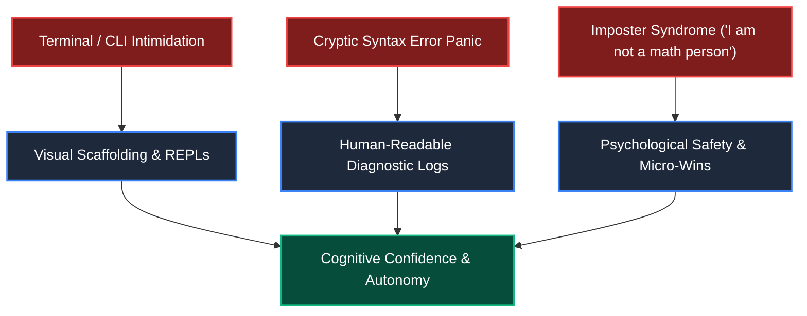
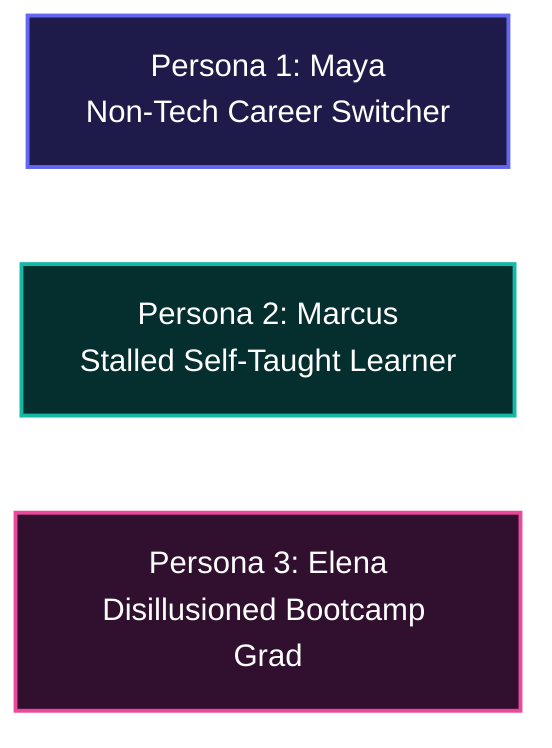

# Canonical Learner Persona & Demographic Profile
# AI-Native Software Engineering Academy (`ai-native-lms`)

**Document Version:** 1.0.0  
**Status:** Authoritative Pedagogical Profile  
**Target Learner Profile:** The Complete Beginner (Zero Prior Experience)  
**Authority:** Master Instructional Designer, Cognitive Psychologist & Academy Dean  
**Program Model:** 24-Month Self-Paced Mastery Track  
**Classification:** Core Academy Specification  
**Effective Date:** September 30, 2026

---

## 1. Primary Target Learner Archetype

The Academy is architected from the ground up for the **Complete Beginner**. 

We explicitly assume **zero prior programming experience, zero computer science background, no engineering training, and no advanced mathematical education**.

```
┌────────────────────────────────────────────────────────────────────────────────────────┐
│                          TARGET LEARNER BASELINE PROFILE                               │
├────────────────────────────┬───────────────────────────────────────────────────────────┤
│ Prior Coding Background    │ ZERO. Has never written or compiled code.                 │
├────────────────────────────┼───────────────────────────────────────────────────────────┤
│ Prior Computer Science     │ ZERO. Does not know how compilers, memory, or APIs work.  │
├────────────────────────────┼───────────────────────────────────────────────────────────┤
│ Mathematical Foundation    │ Basic Arithmetic & Elementary Logic. No Calculus/Discrete.│
├────────────────────────────┼───────────────────────────────────────────────────────────┤
│ Technical Tooling Fluency  │ Web browser & word processor only. Intimidated by the CLI.│
├────────────────────────────┼───────────────────────────────────────────────────────────┤
│ Time Allocation & Cadence  │ 24-Month Self-Paced (8–25 hours/week alongside life duties)│
├────────────────────────────┼───────────────────────────────────────────────────────────┤
│ Primary Aspiration         │ Transition into a high-paying, future-proof AI Eng career.│
└────────────────────────────┴───────────────────────────────────────────────────────────┘
```

---

## 2. Psychological & Cognitive Baseline

Understanding the emotional and cognitive reality of a novice learner is essential to designing effective pedagogical scaffolding:



### 2.1 The Novice Mental Model
To a beginner, a computer is a consumer appliance with graphical buttons. The concept of **text as an executable instruction set** is foreign and intimidating.
- **The "Black Box" Anxiety**: Beginners fear that typing an incorrect command in a terminal or running a script will permanently crash their computer or delete operating system files.
- **Syntax Shock**: A beginner views a missing semicolon or unmatched curly brace as a personal intellectual failure rather than a trivial parser complaint.
- **Cognitive Overload Threshold**: Introducing more than 2–3 new conceptual abstractions simultaneously triggers cognitive shutdown and immediate abandonment.

### 2.2 Imposter Syndrome & Affective Vulnerability
- Most adult career switchers carry negative self-perceptions regarding their technical or mathematical capability (*"I wasn't good at math in high school, so I can't be an engineer"*).
- When confronted with unexplained industry jargon (`monads`, `AST`, `invariants`, `idempotency`), beginners do not assume the material is poorly explained; **they assume they are inherently inadequate**.
- The Academy counters this with radical demystification: breaking every complex concept down into physical analogies, interactive visual sandboxes, and progressive micro-challenges.

---

## 3. Real-World Constraints of the 24-Month Self-Paced Model

Our learners do not exist in academic vacuums. They balance ambitious career transformations against intense real-world constraints:

```
┌────────────────────────────────────────────────────────────────────────────────────────┐
│                              LIFE CONSTRAINT MATRIX                                    │
├────────────────────────────┬───────────────────────────────────────────────────────────┤
│ Professional Employment    │ 75% work full-time jobs (40+ hrs/week) in non-tech fields.│
├────────────────────────────┼───────────────────────────────────────────────────────────┤
│ Caregiving & Family        │ 50% manage family, childcare, or eldercare duties.        │
├────────────────────────────┼───────────────────────────────────────────────────────────┤
│ Financial Constraints      │ Cannot afford full-time unpaid bootcamps or quit work.    │
├────────────────────────────┼───────────────────────────────────────────────────────────┤
│ Irregular Study Windows    │ Study occurs late nights, early mornings, and weekends.    │
├────────────────────────────┼───────────────────────────────────────────────────────────┤
│ Learning Energy Variance   │ High mental fatigue after workday; low tolerance for fluff│
└────────────────────────────┴───────────────────────────────────────────────────────────┘
```

### Pacing Dynamics:
- **Elastic Acceleration & Deceleration**: A learner may dedicate 25 hours during a holiday week, followed by 5 hours during a work crunch. The platform must never penalize temporal gaps or reset earned progress.
- **Non-Linear Retention**: Adult learners require frequent retrieval practice and spaced reinforcement to retain concepts across multi-week gaps.
- **The 21-Day Risk Window**: Inactivity exceeding 21 days is the primary indicator of course abandonment. Proactive, encouraging diagnostic check-ins must activate to re-engage the learner.

---

## 4. Exemplar Learner Personas



### Persona 1: Maya — The Non-Tech Career Switcher
- **Age**: 32 | **Current Role**: Retail Operations Supervisor | **Location**: Remote / Suburban
- **Background**: Degree in Communications; no technical background. Daily computer use limited to Excel, email, and internal inventory GUIs.
- **Pain Points**: Terrified of being trapped in low-wage retail management; overwhelmed by fragmented YouTube tutorials that assume prior programming knowledge; intimidated by the command line.
- **Goal**: Transition to an entry-level AI-Native Fullstack Developer role ($85k–$110k) within 18–24 months while continuing to work full-time.
- **Academy Experience**: Starts at Stage 0 with guided CLI demystification; gains confidence through visual REPL drills; pairs with AI to build her first fullstack inventory app; graduates with 4 live capstones.

### Persona 2: Marcus — The Stalled Self-Taught Learner
- **Age**: 26 | **Current Role**: Customer Support Specialist | **Location**: Urban Metro
- **Background**: Completed a few free online Python tutorials, but hits a brick wall whenever trying to build a real project from scratch ("Tutorial Hell").
- **Pain Points**: Can copy code from a video, but freezes when staring at a blank editor; doesn't know how to connect a frontend to a database; cannot explain why his code works.
- **Goal**: Master modern architecture, TypeScript, and AI-assisted workflows to land a Junior Software Engineer position at a high-growth tech startup.
- **Academy Experience**: Uses the Build-First and Spec-Driven models to break out of tutorial dependency; learns to write formal Zod contracts and deterministic Vitest test suites; clears all 7 Capability Gates.

### Persona 3: Elena — The Disillusioned Legacy Bootcamp Graduate
- **Age**: 29 | **Current Role**: Unemployed Tech Job Seeker | **Location**: Tech Hub
- **Background**: Attended a traditional 12-week coding bootcamp that taught manual React boilerplate and MERN stack.
- **Pain Points**: Graduated with generic todo-app projects; resumes rejected by ATS screeners; struggles to use modern AI tools (Cursor, Copilot) effectively; lacks understanding of PostgreSQL RLS, CI/CD, and system architecture.
- **Goal**: Fast-track upskilling to modern AI-native engineering, build production-grade multi-tenant capstones, and establish an employer-verified evidence portfolio.
- **Academy Experience**: Accelerates through Stages 0–2 in 4 weeks; focuses heavily on Stages 3–9 (AI Pairing, Next.js 15, PostgreSQL RLS, Docker, DDD); builds a standout verified portfolio and passes technical interviews.

---

## 5. The Academy–Learner Covenant

The relationship between the Academy and the Learner is governed by a reciprocal covenant:

```
┌────────────────────────────────────────────────────────────────────────────────────────┐
│                              THE PEDAGOGICAL COVENANT                                  │
├─────────────────────────────────────────┬──────────────────────────────────────────────┤
│ WHAT THE ACADEMY GUARANTEES THE LEARNER │ WHAT THE ACADEMY DEMANDS OF THE LEARNER      │
├─────────────────────────────────────────┼──────────────────────────────────────────────┤
│ 1. Zero-Assumption Onboarding: We never │ 1. Active Construction: No passive video     │
│    assume prior knowledge or jargon.    │    watching; you must write and verify code.│
│                                         │                                              │
│ 2. Psychological Safety: Errors are safe│ 2. Honest Struggle: You must embrace error   │
│    learning data, never moral failures. │    diagnostics rather than copy-pasting.     │
│                                         │                                              │
│ 3. Instant Deterministic Feedback: Real │ 3. Evidence-Based Advancement: You must prove│
│    test feedback in < 2.5 seconds.      │    competence with live code and artifacts.  │
│                                         │                                              │
│ 4. Permanent Mastery Sealing: Progress  │ 4. Verbal & Architectural Defense: You must  │
│    is cryptographically permanent.      │    be able to explain and defend your work.  │
│                                         │                                              │
│ 5. Real-World Engineering Rigor: Real   │ 5. Commitment to Professionalism: Adhering to│
│    Git, real IDEs, real cloud databases.│    clean code, testing, and security ethics. │
└─────────────────────────────────────────┴──────────────────────────────────────────────┘
```

This persona specification ensures that all curriculum design, exercise authoring, user interface flows, and pedagogical interventions are calibrated precisely to the needs, fears, and ultimate empowerment of the complete beginner.
