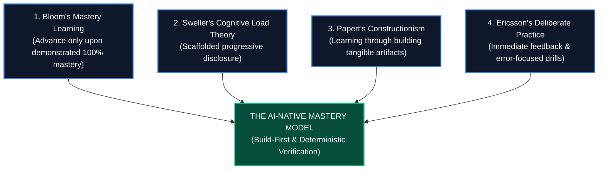
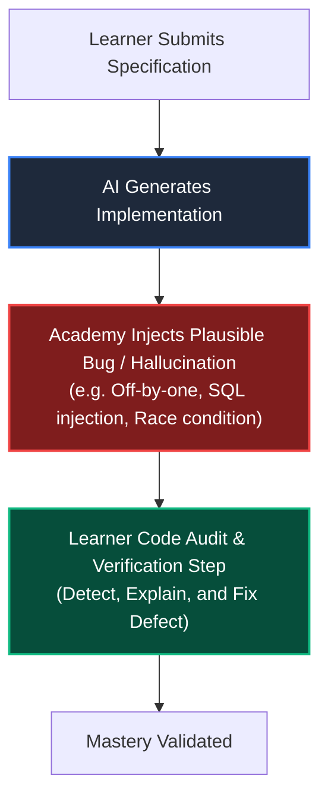

# The Academy Learning Philosophy & Pedagogical Framework
# AI-Native Software Engineering Academy (`ai-native-lms`)

**Document Version:** 1.0.0  
**Status:** Authoritative Pedagogical Doctrine  
**Authority:** Master Instructional Designer, Learning Scientist & Cognitive Psychologist  
**Scope:** 24-Month Self-Paced AI-Native Mastery Learning Model  
**Classification:** Core Academy Specification  
**Effective Date:** September 30, 2026

---

## 1. Philosophical & Epistemological Foundations

The AI-Native Software Engineering Academy rejects the two dominant historical failures of technical education:
1. **The Traditional Academic Model**: Front-loading months of dry syntax memorization, compiler theory, and manual boilerplate typing before building anything real.
2. **The "Copy-Paste Tutorial" Bootcamp Model**: Encouraging students to blindly copy video tutorials or unverified AI outputs, creating a fragile illusion of competence that crumbles in technical interviews and production codebases.

Our educational philosophy is grounded in four scientifically proven learning theories:



### 1.1 Bloom's Mastery Learning Model (Temporal Elasticity)
Benjamin Bloom's foundational research established that under one-on-one mastery tutoring, **95% of students achieve the top 2% performance tier** of traditional classrooms. 
- In our 24-month self-paced model, **Time is a Variable, and Mastery is a Constant**.
- A learner is never rushed past a concept they do not fully understand.
- Progression is strictly gated by automated, objective verification of competence.

### 1.2 Cognitive Load Theory (Scaffolding & Schema Formation)
Working memory can only process $4 \pm 1$ novel information chunks simultaneously.
- **Intrinsic Load Management**: Complex topics are decomposed into atomic, single-concept micro-drills.
- **Extraneous Load Elimination**: IDE setup friction, esoteric compiler error flags, and unexplained jargon are stripped away in early stages using interactive browser REPLs and term popovers.
- **Germane Load Activation**: Students invest their cognitive bandwidth in building robust mental models of dataflow, state mutation, and system boundaries.

### 1.3 Papert's Constructionism (Tangible Digital Artifacts)
Learners do not absorb knowledge by reading abstract lectures; they construct knowledge by **building external, tangible software artifacts**. Every lesson must produce a working function, API endpoint, component, or verified test suite.

### 1.4 Deliberate Practice & Immediate Feedback Loops
Expertise is built not through passive repetition, but through focused practice at the frontier of capability with immediate feedback. Our automated test runner evaluates submissions within **< 2.5 seconds**, turning every error into rich diagnostic learning data.

---

## 2. The 6-Stage Progressive Mastery Cycle ("Build-First")

Every technical topic in the curriculum is taught through a strict **Build-First** pedagogical progression:

```mermaid
graph LR
    classDef s1 fill:#1e293b,stroke:#3b82f6,stroke-width:2px,color:#fff;
    classDef s2 fill:#0f172a,stroke:#8b5cf6,stroke-width:2px,color:#fff;
    classDef s3 fill:#042f2e,stroke:#14b8a6,stroke-width:2px,color:#fff;
    classDef s4 fill:#1e1b4b,stroke:#6366f1,stroke-width:2px,color:#fff;
    classDef s5 fill:#31102f,stroke:#ec4899,stroke-width:2px,color:#fff;
    classDef s6 fill:#064e3b,stroke:#10b981,stroke-width:2px,color:#fff;

    S1["1. BUILD<br/>(Working Sandbox)"]:::s1 --> S2["2. OBSERVE<br/>(Data Flow & State)"]:::s2
    S2 --> S3["3. MODIFY<br/>(Break & Repair)"]:::s3
    S3 --> S4["4. UNDERSTAND<br/>(Mental Model & Why)"]:::s4
    S4 --> S5["5. DESIGN<br/>(Schemas & Contracts)"]:::s5
    S5 --> S6["6. ARCHITECT<br/>(Scale & Production)"]:::s6
```



### Stage 1: BUILD (Experience Before Theory)
The learner is immediately placed in front of a working, runnable software component. They press a button, run a script, and witness the system functioning in real time. We provide the "Aha!" moment of working software before introducing syntactic rules.

### Stage 2: OBSERVE (Trace the Invisible)
The learner uses step-through debuggers, console logs, and visual flowcharts to watch data flow through variables, functions, network requests, and database tables. They see *how* state changes across time.

### Stage 3: MODIFY (Deliberate Destruction & Repair)
The learner is prompted to change variables, alter conditions, inject invalid data, and break the code intentionally. By observing the resulting error messages and repairing the breakage, they develop robust error-diagnosis intuition.

### Stage 4: UNDERSTAND (Deconstruct the Principles)
Only after the learner has built, observed, and broken the system do we introduce formal conceptual definitions, terminology, and underlying computational principles. The theory now attaches to direct experiential memory.

### Stage 5: DESIGN (Contract-First Specification)
The learner writes formal Zod schemas, TypeScript interface types, and database table contracts from scratch, defining domain invariants and edge-case boundaries without implementing the internal logic.

### Stage 6: ARCHITECT (AI-Assisted Scaling & Production)
The learner orchestrates AI assistants to generate the implementation governed by their formal contracts, constructs comprehensive Vitest test harnesses to verify correctness, hardens security with RLS, and deploys the artifact to production.

---

## 3. The AI-Native Pedagogical Paradigm Shift

Generative AI fundamentally inverts the software engineering value chain:

```
┌────────────────────────────────────────────────────────────────────────────────────────┐
│                        THE AI-NATIVE PARADIGM INVERSION                                │
├────────────────────────────────┬───────────────────────────────────────────────────────┤
│ CLASSICAL CODING PEDAGOGY      │ AI-NATIVE ENGINEERING PEDAGOGY                        │
├────────────────────────────────┼───────────────────────────────────────────────────────┤
│ • Focus: Manual syntax typing  │ • Focus: Intent specification & domain modeling       │
│ • Bottleneck: Keystroke speed  │ • Bottleneck: Architectural clarity & context curation│
│ • Memory: Memorizing API calls │ • Memory: Comprehending system failure modes & RLS    │
│ • Testing: Optional afterthought│ • Testing: Mandatory deterministic ground truth       │
│ • Role: Construction Worker    │ • Role: Architect, Orchestrator & Quality Inspector   │
└────────────────────────────────┴───────────────────────────────────────────────────────┘
```

### The Three Pillars of AI-Native Instruction:

1. **Intent-Driven Specification**: Students are taught to express software requirements as formal, unambiguous constraints. They learn that prompt engineering is not casual chatting; it is the discipline of specifying boundary conditions, preconditions, postconditions, and invariant rules.
2. **Context Window Curation**: Students learn how Large Language Models process tokens, how attention degrades over large file trees, and how to craft dense, typed project constitutions (`AGENTS.md`, `.cursorrules`) that guide AI assistants toward zero-defect generation.
3. **Deterministic Verification Harnesses**: Because AI models are probabilistic and non-deterministic, students are trained to construct rigid, deterministic test suites (unit, integration, and contract tests) that act as the infallible objective ground truth.

---

## 4. Deliberate Failure Injection & Hallucination Auditing

A cornerstone of our pedagogical method is **Deliberate Failure Injection**:



- Throughout the curriculum, exercises intentionally present learners with AI-generated code containing subtle defects: hallucinated library methods, missing authorization checks, edge-case null pointer crashes, or unindexed database queries.
- Learners are evaluated on their ability to **spot the hallucination, articulate why it fails, and command the AI to fix it under strict test assertions**.
- This immunizes our graduates against blind copy-pasting, transforming them into vigilant verification authorities.

---

## 5. Instructional Design Standards for All Content

Every lesson, module, and exercise authored for the Academy must strictly adhere to the following structural rubric:

```
┌────────────────────────────────────────────────────────────────────────────────────────┐
│                             LESSON AUTHORING STANDARDS                                 │
├────┬─────────────────────────────┬─────────────────────────────────────────────────────┤
│ 1  │ Word Count Standard         │ Minimum 1,200 words of substantive instruction.     │
│ 2  │ Architecture Visualization  │ Minimum 1 Mermaid or SVG diagram per lesson.        │
│ 3  │ Interactive Sandboxes       │ Embedded live code playground in every lesson.      │
│ 4  │ Step-by-Step Code Walk      │ Every snippet must have annotated line-by-line notes│
│ 5  │ Interactive Terminology     │ Complex terms must feature interactive popover tips.│
│ 6  │ Mandatory Exercise Pairing  │ 100% of lessons must have an associated coding lab. │
│ 7  │ Deterministic Test Harness  │ Every exercise must execute against a Vitest suite. │
│ 8  │ Progressive Hint Scaffold   │ Exercises must provide 3 tiers of structured hints. │
└────┴─────────────────────────────┴─────────────────────────────────────────────────────┘
```

### The 6-Part Lesson Anatomy:
1. **The Hook & Problem Statement**: Why does this topic matter? What real-world production disaster occurs if you don't know this?
2. **Interactive Preview**: A working sandbox component the student can interact with immediately.
3. **The Core Mental Model**: Conceptual explanation using physical analogies and architecture diagrams.
4. **Annotated Implementation**: Production TypeScript / SQL / React code with deep architectural commentary.
5. **Failure Mode & Edge Case Breakdown**: What happens when this fails? How do you debug it?
6. **Hands-On Coding Challenge**: Direct transition into the sandboxed exercise engine to prove mastery.

---

## 6. The Permanent Mastery Checkpoint Philosophy

Capability Gates (Levels 1–7) are the platform's irreversible mastery checkpoints.

- **Non-Reversibility**: Completed gates are permanently sealed in `gate_completion` with zero exit transitions.
- **Multifactor Validation**: Advancing requires satisfying all four evidence dimensions:
  1. *Theoretical Comprehension* (Lesson completions)
  2. *Syntactic & Algorithmic Fluency* (100% green test assertions on coding exercises)
  3. *Domain Skill Mastery* (Verified competency progress in `user_competency_progress`)
  4. *Production Artifacts* (Live deployed cloud URLs, git commit histories, ADRs, and Capstone deliverables)

By enforcing this uncompromising learning philosophy, the Academy guarantees that every single graduate, regardless of their starting point on Day 1, emerges as an elite, production-ready, AI-native software engineer.
