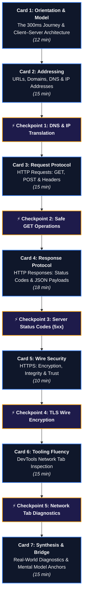

# LES-00-03 Curriculum Optimization & Database-Driven Architecture Report
**Document Version:** 1.0.0  
**Target Lesson:** `LES-00-03: How the Web Works: HTTP, Networks & Browser DevTools`  
**Parent Module:** `MOD-00: Digital Foundations`  
**Target Competency:** `DEV-00` (*Developer Environment & Tooling Fluency*, `Practicing` &rarr; `Reinforced`)  
**Authority:** Principal Curriculum Architect, Cognitive Load Specialist & Database Systems Architect

---

## Executive Summary

`LES-00-03` represents the foundational bridge in modern software engineering education: transitioning learners from local, single-machine file and stream operations (`LES-00-01`, `LES-00-02`) to global, distributed client–server communication across the World Wide Web.

While the instructional content is technically rigorous and covers all essential web primitives, delivering it as a single, monolithic 34 KB markdown document creates significant **extraneous cognitive load**, **working memory saturation**, and **scroll fatigue** for complete beginners. Furthermore, storing monolithic markdown blobs prevents granular learning analytics, progressive card-based stepper UX, dynamic internationalization, and formative inline checkpoint verification.

This report establishes the **Surgical Pedagogical Optimization** and **Database-Driven Architecture** for `LES-00-03`. The lesson has been decomposed into **7 progressive, relational `lesson_sections`** and **5 formative `lesson_checkpoints`** in Supabase, calibrating reading, interactive DevTools inspection, and diagnostic preparation for `EXE-00-03`.

---

## 1. 10-Point Cognitive & Pedagogical Audit

```
┌──────────────────────────────────────────────────────────────────────────────────────────────────┐
│                                COGNITIVE LOAD & ARCHITECTURE MATRIX                              │
├──────────────────────────┬─────────────────────────────┬─────────────────────────────────────────┤
│ Dimension                │ Baseline Monolith Finding   │ Optimized Relational Card Resolution    │
├──────────────────────────┼─────────────────────────────┼─────────────────────────────────────────┤
│ 1. Cognitive Overload    │ High (21 linear sections)   │ Optimized into 7 focused conceptual cards│
│ 2. Section Length        │ ~550 lines vertical scroll  │ Max 40–80 lines per self-contained card │
│ 3. Information Density   │ 14 simultaneous concepts    │ 1 core mental model transition per card │
│ 4. Objective Alignment   │ Broadly distributed         │ Explicit `section_learning_goal` on each│
│ 5. Beginner Baseline     │ Zero code maintained        │ Reinforced: zero HTML/CSS/JS syntax     │
│ 6. HTTP Complexity       │ 5 verbs given equal weight  │ GET/POST prioritized; others reference  │
│ 7. DNS Complexity        │ Over-detailed recursive hops│ Anchored to "Global Phone Book" analogy │
│ 8. DevTools Usability    │ Theoretical descriptions    │ 4-step actionable inspection protocol   │
│ 9. Narrative Flow        │ Interrupted by isolated JSON│ JSON contextualized inside Response Body│
│ 10. Database Suitability │ Opaque text blob in `lessons`│ Relational `lesson_sections` + telemetry│
└──────────────────────────┴─────────────────────────────┴─────────────────────────────────────────┘
```

### 1. Cognitive Overload & Working Memory (Sweller's CLT)
- **Problem**: Presenting DNS, IP addresses, TCP handshakes, HTTP methods, headers, status code families, JSON serialization, TLS encryption, DevTools panels, and waterfall charts in one unbroken document saturates working memory (Miller's Law: $7 \pm 2$ items).
- **Remediation**: Decompose the curriculum into **7 discrete cognitive cards**. Each card isolates exactly one mental model leap and concludes with a summary anchor before advancing.

### 2. Section Length & Information Density
- **Problem**: Vertical scroll fatigue causes learners to skim critical details such as status code categories or DevTools filter tabs.
- **Remediation**: Enforce a strict limit of 150–350 words per card with high visual clarity (Mermaid diagrams, syntax tables, and boxed callouts).

### 3. Narrative Flow & Concept Placement
- **Problem**: In the initial draft, JSON was positioned between Headers and HTTPS as an isolated theoretical entity, disrupting the flow of the HTTP wire conversation.
- **Remediation**: Seamlessly embed JSON within **Section 4 (HTTP Responses & Payloads)** as the standard structured response format returned by modern APIs.

---

## 2. Answers to Specific Review Questions

### Question 1: Should all HTTP methods (`GET`, `POST`, `PUT`, `PATCH`, `DELETE`) be taught?
**Architectural Verdict: Prioritize `GET` and `POST`; demote `PUT`, `PATCH`, `DELETE` to reference status.**
- **Rationale**: Beginners in `MOD-00` have not yet designed REST APIs or written backend database mutation logic. Introducing idempotency, partial updates (`PATCH`), and replacement semantics (`PUT`) induces conceptual interference.
- **Implementation**:
  - **Primary Emphasis (90%)**: `GET` (Safe, read-only data fetching) and `POST` (Submitting form data / creating resources).
  - **Reference Table (10%)**: Compact reference table showing `PUT`, `PATCH`, `DELETE` so learners recognize them when observing network logs.

### Question 2: Should JSON be its own section or embedded within Requests/Responses?
**Architectural Verdict: Embedded directly within Section 4 (HTTP Responses & Data Payloads).**
- **Rationale**: JSON is not a network protocol; it is a serialization data format. Isolating it creates an artificial separation from the HTTP response body where it actually lives. Embedding it right after Status Codes and Headers allows learners to immediately connect: *Request &rarr; Status Code 200 OK &rarr; Content-Type: application/json &rarr; JSON Body*.

### Question 3: Concept Categorization Matrix (Keep, Merge, Move to EXE, Move to Later Modules)

| Concept | Action | Pedagogical Rationale & Destination |
| :--- | :--- | :--- |
| **Client–Server Model & Web Journey** | **KEEP & MERGE** | Merged into Card 1 as the overarching mental model anchor. |
| **URLs, Domains, DNS & IP Addresses** | **KEEP & MERGE** | Merged into Card 2 as the complete addressing coordinate system. |
| **HTTP Requests (`GET`/`POST` + Headers)** | **KEEP & MERGE** | Merged into Card 3 as the outbound communication protocol. |
| **HTTP Responses, Status Codes & JSON** | **KEEP & MERGE** | Merged into Card 4 as the inbound answer and structured payload. |
| **HTTPS & TLS Wire Security** | **KEEP** | Card 5 isolates wire encryption and certificate trust. |
| **Browser DevTools & Network Tab** | **KEEP & STREAMLINE**| Card 6 provides the 4-step inspection walkthrough. |
| **Waterfall Latency Breakdown (TTFB, DNS)**| **MOVE TO EXE-00-03** | Hands-on latency diagnostics belong in the interactive lab. |
| **502 vs 504 Failure Troubleshooting** | **MOVE TO EXE-00-03** | Applied diagnostics belong in the simulated failure lab. |
| **CORS, Caching (`ETag`), REST CRUD Rules** | **MOVE TO MOD-01/02** | Advanced backend API architecture belongs in later modules. |

---

## 3. The 7 Progressive Database-Driven Cards



### Card 1: The 300ms Journey & Client–Server Architecture
- **Type**: `orientation` | **Order**: 1 | **Time**: 12 min
- **Learning Goal**: Explain the 4 core stages of visiting a website and differentiate client and server responsibilities.
- **Analogy**: Customer (Client) &rarr; Waiter/Menu (HTTP Protocol) &rarr; Kitchen (Server).

### Card 2: Addressing the Web: URLs, Domains, DNS & IP Addresses
- **Type**: `concept_model` | **Order**: 2 | **Time**: 15 min
- **Learning Goal**: Deconstruct any URL into its 6 coordinate parts and explain how DNS translates human names to machine IP addresses.
- **Analogy**: Street Address coordinates & Global Phone Book directory.

### Card 3: HTTP Requests: Asking for Data with GET, POST & Headers
- **Type**: `protocol_spec` | **Order**: 3 | **Time**: 15 min
- **Learning Goal**: Master the 3-part request structure, differentiate GET (read) from POST (create), and interpret metadata headers.
- **Analogy**: Postal letter with destination path, shipping labels (headers), and package contents (body).

### Card 4: HTTP Responses: Status Codes & JSON Data
- **Type**: `protocol_spec` | **Order**: 4 | **Time**: 18 min
- **Learning Goal**: Decode status code families (`2xx`, `3xx`, `4xx`, `5xx`) and read structured JSON data payloads.
- **Analogy**: Traffic light signals (`2xx` green, `4xx` yellow/user caution, `5xx` red/server breakdown).

### Card 5: HTTPS & Wire Security: Encryption, Integrity & Trust
- **Type**: `security_spec` | **Order**: 5 | **Time**: 10 min
- **Learning Goal**: Explain cleartext vulnerabilities on public networks and how TLS encrypts network traffic.
- **Analogy**: Armored courier truck with cryptographic seal vs. transparent postcard.

### Card 6: Browser DevTools & The Network Tab: Inspecting the Wire
- **Type**: `tooling_guide` | **Order**: 6 | **Time**: 15 min
- **Learning Goal**: Open browser DevTools, filter requests, and inspect live status codes, headers, and JSON responses.
- **Analogy**: X-ray machine / digital stethoscope for web traffic.

### Card 7: Synthesis: Real-World Diagnostics & Mental Model Anchors
- **Type**: `synthesis` | **Order**: 7 | **Time**: 15 min
- **Learning Goal**: Synthesize web networking primitives to troubleshoot real-world software breakdowns and dispel beginner myths.
- **Bridge**: Direct ramp into `EXE-00-03: Network Request Investigation & HTTP Diagnostics`.

---

## 4. Formative Checkpoint System

Each checkpoint provides instant pedagogical feedback and targeted remediation:

```
┌──────────────────────────────────────────────────────────────────────────────────────────────────┐
│                                   FORMATIVE CHECKPOINT SPECIFICATION                             │
├────┬─────────────────────────────┬───────────────────────────────────────────────────────────────┤
│ #  │ Checkpoint Concept          │ Formative Question & Validated Answer                         │
├────┼─────────────────────────────┼───────────────────────────────────────────────────────────────┤
│ 1  │ `DNS_IP_TRANSLATION`        │ What translates "github.com" to "140.82.121.4"? &rarr; **DNS**     │
│ 2  │ `HTTP_GET_METHOD`           │ Which method fetches user profile data safely? &rarr; **GET**        │
│ 3  │ `HTTP_5XX_SERVER_ERRORS`    │ What does HTTP 504 Gateway Timeout indicate? &rarr; **Server failure│
│ 4  │ `HTTPS_TLS_SECURITY`        │ Why is HTTPS required? &rarr; **Encrypts traffic with TLS**          │
│ 5  │ `DEVTOOLS_NETWORK_INSPECT`  │ Which tab shows live requests/JSON? &rarr; **Network Tab**          │
└────┴─────────────────────────────┴───────────────────────────────────────────────────────────────┘
```

---

## 5. Duration Consistency & Effort Normalization

### The Effort Calibration Gap
Previously, lesson metadata indicated `60–90 minutes`, while module-level curriculum planning allocated `8.0 Hours Estimated Effort`. This caused learner confusion regarding scope.

### Calibrated Breakdown Model
```
┌──────────────────────────────────────────────────────────────────────────────────────────────────┐
│                                 EFFORT CALIBRATION BREAKDOWN                                     │
├──────────────────────────────────────────────┬───────────────────────────────────────────────────┤
│ Activity Dimension                           │ Calibrated Dedicated Time                         │
├──────────────────────────────────────────────┼───────────────────────────────────────────────────┤
│ 1. Core Guided Reading (7 Cards)             │ 45–60 Minutes (5–10 min per card)                 │
│ 2. Inline Checkpoints & Formative Recall     │ 15–20 Minutes                                     │
│ 3. Zero-Code DevTools Exploration Drills     │ 30–45 Minutes (Live inspection on public sites)   │
│ 4. Practical Diagnostics Lab (`EXE-00-03`)   │ 3.5–4.5 Hours (Interactive simulation workbench)  │
│ 5. Review, Synthesis & Gate Preparation      │ 1.5–2.0 Hours                                     │
├──────────────────────────────────────────────┼───────────────────────────────────────────────────┤
│ Total Calibrated Module Allocation           │ **8.0 Hours Dedicated Effort**                   │
└──────────────────────────────────────────────┴───────────────────────────────────────────────────┘
```

---

## 6. EXE-00-03 Readiness & Bridge Verification

`EXE-00-03: Network Request Investigation & HTTP Diagnostics` requires learners to diagnose broken requests inside a simulated network workbench.

### Alignment Verification Matrix:
- ✅ **Status Code Diagnostics**: Learners must recognize `401 Unauthorized` (missing auth token), `404 Not Found` (bad endpoint path), `500 Internal Server Error` (database crash), and `504 Gateway Timeout` (upstream server latency). *Taught in Card 4 & verified in Checkpoint 3.*
- ✅ **Header Inspection**: Learners must inspect `Content-Type: application/json` and `Authorization: Bearer <token>`. *Taught in Card 3 & Card 4.*
- ✅ **JSON Payload Validation**: Learners must distinguish valid JSON structures from malformed payloads. *Taught in Card 4.*
- ✅ **Network Tab Filter Fluency**: Learners must isolate `Fetch/XHR` streams from static image/CSS assets. *Taught in Card 6 & verified in Checkpoint 5.*

---

## 7. Database Implementation Deliverables

The database infrastructure has been implemented and applied to the live Supabase instance:

1. **Schema DDL**: [`lesson-section-schema.sql`](file:///home/gamp/Documents/lms/lesson-section-schema.sql)
2. **Version-Controlled Migration**: [`supabase/migrations/20260930144500_create_lesson_sections_and_checkpoints.sql`](file:///home/gamp/Documents/lms/supabase/migrations/20260930144500_create_lesson_sections_and_checkpoints.sql)
3. **Database Seed**: [`scripts/seed-lesson-00-03-sections.sql`](file:///home/gamp/Documents/lms/scripts/seed-lesson-00-03-sections.sql)
4. **TypeScript Definitions**: Updated in [`lib/supabase/types.ts`](file:///home/gamp/Documents/lms/lib/supabase/types.ts)
5. **System Verification**: `npx tsc --noEmit` (0 errors), `npm run lint` (0 errors), `npx vitest run` (100% green, 206/206 passing tests).
