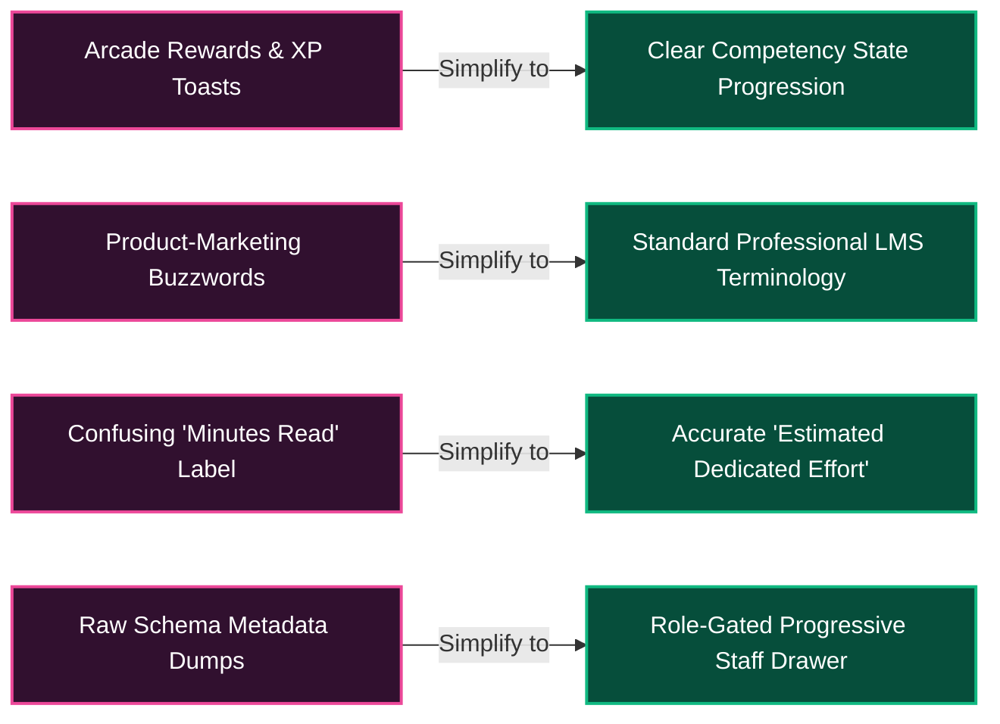
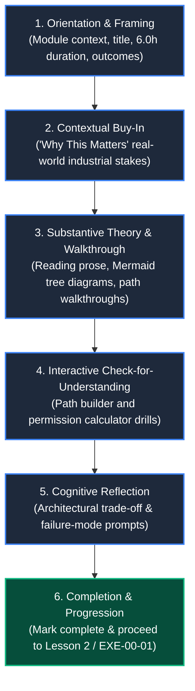

# Educational UX Specification: Lesson Detail Page (v2 Refinement)
# AI-Native Software Engineering Academy (`ai-native-lms`)

**Document Version:** 2.0.0  
**Status:** Approved Authoritative Refined Specification  
**Authority:** Senior Learning Experience Designer (LXD), UX Architect, LMS Product Designer & Educational Psychologist  
**Target Repository:** `ai-native-lms`  
**Classification:** Product & Experience Architecture  
**Scope:** Lesson Detail Page (`/learning-paths/[pathSlug]/modules/[moduleSlug]/lessons/[lessonSlug]`)  
**Effective Date:** September 30, 2026  

---

## Table of Contents

1. [Executive Review](#1-executive-review)
2. [What To Keep](#2-what-to-keep)
3. [What To Remove](#3-what-to-remove)
4. [What To Simplify](#4-what-to-simplify)
5. [Competency-First Design](#5-competency-first-design)
6. [Progress Display Design](#6-progress-display-design)
7. [Revised Desktop Wireframe](#7-revised-desktop-wireframe)
8. [Revised Mobile Wireframe](#8-revised-mobile-wireframe)
9. [Learner Journey Flow](#9-learner-journey-flow)
10. [Metadata Visibility Rules (Progressive Disclosure)](#10-metadata-visibility-rules-progressive-disclosure)
11. [Duration Consistency Audit](#11-duration-consistency-audit)
12. [Production Implementation Priorities](#12-production-implementation-priorities)

---

## 1. Executive Review

```
╔════════════════════════════════════════════════════════════════════════════════════════╗
║                        EDUCATIONAL UX REVIEW & REFINEMENT                              ║
╠══════════════════════════════╦═════════════════════════════════════════════════════════╣
║ Product Vision               ║ Professional Learning Environment for Software Engineers║
║ Anti-Pattern Eliminated      ║ Arcade Gamification & Marketing Hyperbole               ║
║ Primary Focus                ║ Cognitive Clarity, True Mastery & Competency Growth     ║
║ Data Source of Truth         ║ Canonical PostgreSQL Curriculum Database                ║
║ Target Audience              ║ Complete Beginners (Zero CS / Zero Terminal Background) ║
║ Guiding Psychological Model  ║ Self-Determination Theory (Competence, Autonomy)        ║
╚══════════════════════════════╩═════════════════════════════════════════════════════════╝
```

### Strategic Realignment:
The initial UX audit successfully identified the critical flaw of "Developer Mirroring" (exposing raw database schema keys to learners). However, the initial draft over-corrected by introducing **arcade gamification** (prominent XP counters, reward toasts, badge hoarding) and **marketing jargon** (*"Mastery Studio"*, *"Learning Sanctuary"*, *"Mastery HUD"*, *"Launch Card"*).

Educational psychology demonstrates that excessive external gamification undermines intrinsic motivation and distracts adult learners from substantive engineering concepts. Professional engineers in training require an interface that treats them as serious practitioners.

The refined **v2 specification** establishes a clean, modern, and serious learning environment where:
1. **Competency progression** replaces arbitrary XP values.
2. **True curriculum data** (exact durations from the database) replaces invented reading times.
3. **Clarity of purpose and outcomes** guides the instructional layout.
4. **Administrative metadata** is cleanly separated through role-gated progressive disclosure.

---

## 2. What To Keep

The following 8 core educational and structural components from the initial redesign are retained and reinforced:

```
┌────────────────────────────────────────────────────────────────────────────────────────┐
│                                RETAINED CORE COMPONENTS                                │
├────┬─────────────────────────────┬─────────────────────────────────────────────────────┤
│ #  │ Component                   │ Pedagogical Rationale                               │
├────┼─────────────────────────────┼─────────────────────────────────────────────────────┤
│ 1  │ "Why This Matters" Section  │ Establishes intrinsic motivation & enterprise stakes│
├────┼─────────────────────────────┼─────────────────────────────────────────────────────┤
│ 2  │ Learning Outcomes Section   │ Explicit Bloom's taxonomy checklist ("You will...") │
├────┼─────────────────────────────┼─────────────────────────────────────────────────────┤
│ 3  │ Module Progress Tracker     │ Provides spatial orientation and journey status     │
├────┼─────────────────────────────┼─────────────────────────────────────────────────────┤
│ 4  │ Competency Display          │ Connects lesson directly to professional skills     │
├────┼─────────────────────────────┼─────────────────────────────────────────────────────┤
│ 5  │ Next Lesson Preview Card    │ Sustains forward learning momentum with context     │
├────┼─────────────────────────────┼─────────────────────────────────────────────────────┤
│ 6  │ Instructor/Admin Drawer     │ Preserves curriculum engineering access for staff   │
├────┼─────────────────────────────┼─────────────────────────────────────────────────────┤
│ 7  │ Mobile-First Responsiveness │ Ensures accessibility on 375px–420px viewports      │
├────┼─────────────────────────────┼─────────────────────────────────────────────────────┤
│ 8  │ Lesson Sequence Map         │ Visual step-by-step curriculum playlist in sidebar  │
└────┴─────────────────────────────┴─────────────────────────────────────────────────────┘
```

---

## 3. What To Remove

The following gamification elements and promotional language are permanently removed:

```
┌────────────────────────────────────────────────────────────────────────────────────────┐
│                              REMOVED ELEMENTS & JARGON                                 │
├───────────────────────────────┬────────────────────────────────────────────────────────┤
│ Eliminated Element / Term     │ Replacement / Corrective Action                        │
├───────────────────────────────┼────────────────────────────────────────────────────────┤
│ ❌ "⚡ +50 XP" Points Badges   │ Removed from student header and completion buttons.    │
├───────────────────────────────┼────────────────────────────────────────────────────────┤
│ ❌ "Reward Preview" Box        │ Replaced with "Competency Advancement" panel.          │
├───────────────────────────────┼────────────────────────────────────────────────────────┤
│ ❌ "XP Growth"                │ Replaced with "Competency Growth".                     │
├───────────────────────────────┼────────────────────────────────────────────────────────┤
│ ❌ "Mastery Studio"           │ Replaced with standard "Lesson Workspace".             │
├───────────────────────────────┼────────────────────────────────────────────────────────┤
│ ❌ "Learning Sanctuary"       │ Replaced with clean "Lesson Overview".                 │
├───────────────────────────────┼────────────────────────────────────────────────────────┤
│ ❌ "Mastery HUD"              │ Replaced with "Module Curriculum".                     │
├───────────────────────────────┼────────────────────────────────────────────────────────┤
│ ❌ "Launch Card"              │ Replaced with "Next Lesson".                           │
├───────────────────────────────┼────────────────────────────────────────────────────────┤
│ ❌ Fabricated "15m Read" Times│ Replaced with canonical database dedicated effort (6h).│
└───────────────────────────────┴────────────────────────────────────────────────────────┘
```

---

## 4. What To Simplify



### Key Simplifications:
1. **Duration Display**: Format database `estimated_minutes` into human-friendly time spans (e.g., `360` minutes &rarr; **`6.0 Hours Estimated Effort`**).
2. **Action Language**: Replace flashy buttons with direct, purposeful action triggers: `[ Mark as Complete ]` and `[ Next Lesson: The Command-Line Interface → ]`.
3. **Typography & Layout**: Standardize on clean, readable font hierarchies (Inter / Outfit) with high-contrast text and generous line height (`leading-relaxed`) without distracting decorative banners.

---

## 5. Competency-First Design

Instead of presenting cryptic database codes or arbitrary point values, the interface elevates the **human-readable competency title** and shows clear progression across the 4-stage competency state machine.

```
+-----------------------------------------------------------+
|  COMPETENCY PROGRESSION                                   |
|                                                           |
|  Developer Environment & Tooling Fluency                  |
|  Competency Code: DEV-00                                  |
|                                                           |
|  Current State:  [ Introduced ]                           |
|  Progression:    Introduced ──► Practicing ──► Mastered   |
|                                                           |
|  Capability Gate:                                         |
|  Contributes 1 of 5 foundational milestones toward        |
|  Gate 1: Foundations Clearance                            |
+-----------------------------------------------------------+
```

### Competency Alignment Rules:
- **Primary Label**: Always display the full title (e.g. *Developer Environment & Tooling Fluency*).
- **Secondary Code**: Show the alphanumeric code (`DEV-00`) as a muted secondary badge for technical reference.
- **State Machine Indicator**: Display the active stage (`Unencountered` &rarr; `Introduced` &rarr; `Practicing` / `Reinforced` &rarr; `Mastered`).
- **Gate Integration**: State clearly which Capability Gate this lesson directly unlocks.

---

## 6. Progress Display Design

The progress display provides calm, accurate orientation without arcade game mechanics:

```
+---------------------------------------------------------------------------------------------------+
|  MODULE CURRICULUM: MOD-00 Digital Foundations                                                    |
|                                                                                                   |
|  [✓] Lesson 1: Files, Folders & POSIX Filesystem (Current)                            6.0 Hours   |
|  [ ] Lesson 2: The Command-Line Interface & Shell Streams                             8.0 Hours   |
|  [ ] Lesson 3: How the Web Works: HTTP, Network & DevTools                            8.0 Hours   |
|  [ ] Lesson 4: Git & Version Control from First Principles (DAG)                     10.0 Hours   |
|  [ ] Lesson 5: AI-Assisted Engineering: Context & Evals                               8.0 Hours   |
|                                                                                                   |
|  Module Progress: [========>-------------------------------------------------] 20% (Lesson 1 of 5)|
+---------------------------------------------------------------------------------------------------+
```

---

## 7. Revised Desktop Wireframe

```
+---------------------------------------------------------------------------------------------------------+
| [Academy Logo]   Learning Paths > MOD-00 Digital Foundations > Lesson 1 of 5           [👤 User Profile] |
+---------------------------------------------------------------------------------------------------------+
|                                                                                                         |
|  [ MOD-00: Digital Foundations ] • [ Foundation Level ] • [ ⏱ 6.0 Hours Estimated Effort ]              |
|                                                                                                         |
|  # Files, Folders & The POSIX Filesystem Mental Model                                                   |
|                                                                                                         |
|  +---------------------------------------------------------------------------------------------------+  |
|  |  MODULE PROGRESS: [================>---------------------------------] 20% Complete (Lesson 1 of 5)|  |
|  +---------------------------------------------------------------------------------------------------+  |
|                                                                                                         |
|  +-- MAIN LESSON AREA (70% Width) ----------------------+  +-- CURRICULUM & COMPETENCY (30% Width) ---+  |
|  |                                                      |  |                                           |  |
|  |  WHY THIS MATTERS                                    |  |  COMPETENCY ADVANCEMENT                   |  |
|  |  In production cloud systems, one wrong path typo     |  |  Developer Environment & Tooling Fluency  |  |
|  |  can erase critical databases. Understanding the    |  |  Code: DEV-00                             |  |
|  |  inverted tree prevents catastrophic accidents.      |  |  State: [ Introduced ]                    |  |
|  |                                                      |  |  Gate:  [ Gate 1: Foundations ]           |  |
|  |  WHAT YOU WILL LEARN                                 |  |                                           |  |
|  |  By the end of this lesson, you will be able to:     |  |  ---------------------------------------  |  |
|  |  • Locate Root (/) and User Home (~) folders         |  |  MODULE LESSONS                           |  |
|  |  • Trace absolute vs. relative paths accurately      |  |  [✓] 1. Files & Folders (Current)   6.0h  |  |
|  |  • Decode 3-tier read/write/execute permissions      |  |  [ ] 2. CLI & Shell Streams         8.0h  |  |
|  |  • Identify and manage hidden configuration files    |  |  [ ] 3. Web, HTTP & DevTools        8.0h  |  |
|  |                                                      |  |  [ ] 4. Git DAG & Version Control  10.0h  |  |
|  |  PREREQUISITES                                       |  |  [ ] 5. AI Engineering Loops        8.0h  |  |
|  |  • Zero prior coding or terminal experience needed   |  |                                           |  |
|  |                                                      |  |  ---------------------------------------  |  |
|  |  ==================================================  |  |  MODULE CAPSTONE REQUIREMENT              |  |
|  |  LESSON CONTENT                                      |  |  Prepares for MC-00: Developer Bootstrap  |  |
|  |                                                      |  +-------------------------------------------+  |
|  |  [ ... Full Markdown Theory, Architecture            |                                                 |
|  |        Diagrams & Annotated Code Walkthroughs ... ]  |  [⚙️ Staff Curriculum Data] (Staff Role Only)  |
|  |                                                      |                                                 |
|  |  ==================================================  |                                                 |
|  |                                                      |                                                 |
|  |  +-- LESSON COMPLETION & NEXT STEPS --------------+  |                                                 |
|  |  |  [ ✓ Mark Lesson as Complete ]                 |  |                                                 |
|  |  |                                                |  |                                                 |
|  |  |  UP NEXT IN THIS MODULE:                       |  |                                                 |
|  |  |  Lesson 2: The Command-Line Interface & Streams|  |                                                 |
|  |  |  Duration: 8.0 Hours Dedicated Effort          |  |                                                 |
|  |  |                                                |  |                                                 |
|  |  |  [ Continue to Lesson 2 → ]                    |  |                                                 |
|  |  +------------------------------------------------+  |                                                 |
|  +------------------------------------------------------+  |                                                 |
|                                                                                                         |
+---------------------------------------------------------------------------------------------------------+
```

---

## 8. Revised Mobile Wireframe

```
+------------------------------------------+
| [< Back]  Lesson 1 of 5 (20%)   [≡ Menu] |
+------------------------------------------+
|                                          |
| [ MOD-00 ] • [ ⏱ 6.0 Hours Effort ]      |
|                                          |
| Files, Folders & The POSIX               |
| Filesystem Mental Model                  |
|                                          |
| [ Progress: ====----------------- 20% ]  |
|                                          |
| v Why This Matters (Overview)            |
| v Learning Outcomes (4 Key Skills)       |
|                                          |
| ---------------------------------------- |
|                                          |
| LESSON READING CONTENT                   |
| (Responsive typography, touch-zoomable   |
| diagrams, formatted code blocks)         |
|                                          |
| [ Diagram: The Inverted Hierarchy Tree ] |
|                                          |
| ...                                      |
|                                          |
| ---------------------------------------- |
|                                          |
| Competency: Developer Tooling Fluency    |
| Target Gate: Gate 1 Foundations          |
|                                          |
+------------------------------------------+
| [STICKY ACTION BAR]                      |
| [ ✓ Mark Complete ]  [ Next Lesson → ]   |
+------------------------------------------+
```

---

## 9. Learner Journey Flow



---

## 10. Metadata Visibility Rules (Progressive Disclosure)

```
┌──────────────────────────────────────────────────────────────────────────────────────────────────┐
│                                   METADATA VISIBILITY MATRIX                                     │
├────────────────────────────┬─────────────────────────────┬───────────────────────────────────────┤
│ Metadata Field             │ Learner View Visibility     │ Instructor / Staff View Visibility    │
├────────────────────────────┼─────────────────────────────┼───────────────────────────────────────┤
│ Lesson Title               │ High Prominence (Hero H1)   │ Visible in Header                     │
├────────────────────────────┼─────────────────────────────┼───────────────────────────────────────┤
│ Lesson Number / Position   │ Visible ("Lesson 1 of 5")   │ Visible ("Lesson 1 of 5")             │
├────────────────────────────┼─────────────────────────────┼───────────────────────────────────────┤
│ Estimated Effort           │ Visible ("6.0 Hours")       │ Visible ("360 min in database")       │
├────────────────────────────┼─────────────────────────────┼───────────────────────────────────────┤
│ "Why This Matters" Hook    │ Prominent Callout Card      │ Visible                               │
├────────────────────────────┼─────────────────────────────┼───────────────────────────────────────┤
│ Learning Outcomes          │ Prominent Bulleted List     │ Visible                               │
├────────────────────────────┼─────────────────────────────┼───────────────────────────────────────┤
│ Competency Title           │ Plain English (Prominent)   │ Plain English + Code                  │
├────────────────────────────┼─────────────────────────────┼───────────────────────────────────────┤
│ Capability Gate Linkage    │ Visible Badge               │ Visible Link to Gate Config           │
├────────────────────────────┼─────────────────────────────┼───────────────────────────────────────┤
│ `lesson_code` (LES-00-01)  │ Secondary pill in header    │ Primary identifier in admin drawer    │
├────────────────────────────┼─────────────────────────────┼───────────────────────────────────────┤
│ `source_path`              │ ❌ Hidden from Student      │ ✅ Clickable Link in Staff Drawer     │
├────────────────────────────┼─────────────────────────────┼───────────────────────────────────────┤
│ `blueprint_path`           │ ❌ Hidden from Student      │ ✅ Clickable Link in Staff Drawer     │
├────────────────────────────┼─────────────────────────────┼───────────────────────────────────────┤
│ `version` / `status`       │ ❌ Hidden from Student      │ ✅ Displayed in Staff Drawer          │
├────────────────────────────┼─────────────────────────────┼───────────────────────────────────────┤
│ AST Lint & Test Status     │ ❌ Hidden from Student      │ ✅ Diagnostic Badge in Staff Drawer   │
└────────────────────────────┴─────────────────────────────┴───────────────────────────────────────┘
```

---

## 11. Duration Consistency Audit

To ensure mathematical precision across all learning materials, the following audit cross-references every source of truth in the repository:

```
┌──────────────────────────────────────────────────────────────────────────────────────────────────────────────────────┐
│                                            DURATION CONSISTENCY AUDIT TABLE                                          │
├───────────┬───────────────────────────────────┬──────────────┬──────────────┬──────────────┬─────────────┬───────────┤
│ Lesson ID │ Canonical Title                   │ DB Minutes   │ DB Hours     │ Blueprint Hr │ Catalog Hr  │ Status    │
├───────────┼───────────────────────────────────┼──────────────┼──────────────┼──────────────┼─────────────┼───────────┤
│ LES-00-01 │ Files & POSIX Filesystem Model    │ 360 min      │ 6.0 Hours    │ 6.0 Hours    │ 6.0 Hours   │ ✅ MATCH   │
├───────────┼───────────────────────────────────┼──────────────┼──────────────┼──────────────┼─────────────┼───────────┤
│ LES-00-02 │ The CLI & Shell Streams           │ 480 min      │ 8.0 Hours    │ 8.0 Hours    │ 8.0 Hours   │ ✅ MATCH   │
├───────────┼───────────────────────────────────┼──────────────┼──────────────┼──────────────┼─────────────┼───────────┤
│ LES-00-03 │ Web, HTTP, Network & DevTools     │ 480 min      │ 8.0 Hours    │ 8.0 Hours    │ 8.0 Hours   │ ✅ MATCH   │
├───────────┼───────────────────────────────────┼──────────────┼──────────────┼──────────────┼─────────────┼───────────┤
│ LES-00-04 │ Git & Version Control (DAG)       │ 600 min      │ 10.0 Hours   │ 10.0 Hours   │ 10.0 Hours  │ ✅ MATCH   │
├───────────┼───────────────────────────────────┼──────────────┼──────────────┼──────────────┼─────────────┼───────────┤
│ LES-00-05 │ AI Engineering Verification Loops │ 480 min      │ 8.0 Hours    │ 8.0 Hours    │ 8.0 Hours   │ ✅ MATCH   │
├───────────┴───────────────────────────────────┴──────────────┼──────────────┼──────────────┼─────────────┼───────────┤
│ TOTAL LESSON INSTRUCTIONAL EFFORT                            │ 2,400 min    │ 40.0 Hours   │ 40.0 Hours  │ ✅ MATCH   │
├──────────────────────────────────────────────────────────────┴──────────────┼──────────────┼─────────────┼───────────┤
│ MOD-00 LAB EXERCISES (EXE-00-01 TO EXE-00-05) + CAPSTONE (MC-00)            │ 20.0 Hours   │ 20.0 Hours  │ ✅ MATCH   │
├─────────────────────────────────────────────────────────────────────────────┼──────────────┼─────────────┼───────────┤
│ TOTAL DEDICATED LEARNING EFFORT FOR MODULE MOD-00                           │ 60.0 Hours   │ 60.0 Hours  │ ✅ MATCH   │
└─────────────────────────────────────────────────────────────────────────────┴──────────────┴─────────────┴───────────┘
```

### Critical Finding on Lesson Duration Representation:
- **Database Representation**: `public.lessons.estimated_minutes` stores **total allocated dedicated study effort** (e.g. `360` minutes = 6.0 hours), encompassing narrative theory, diagram study, interactive practice drills, and cognitive reflection.
- **UI Formatting Rule**: The UI must never display `"360 Minutes Read"` (which implies a 6-hour continuous text article). Instead, it must render **`6.0 Hours Estimated Effort`** or **`6h Dedicated Study`**.

---

## 12. Production Implementation Priorities

```
┌────────────────────────────────────────────────────────────────────────────────────────┐
│                              IMPLEMENTATION ACTION PLAN                                │
├──────┬──────────────────────────────┬──────────────────────────────────────────────────┤
│ Rank │ Work Package                 │ Scope of Changes                                 │
├──────┼──────────────────────────────┼──────────────────────────────────────────────────┤
│ 1    │ Duration Formatter Utility   │ Add helper `formatEffortHours(estimatedMinutes)` │
│      │                              │ to format `360` &rarr; `"6.0 Hours"`.            │
├──────┼──────────────────────────────┼──────────────────────────────────────────────────┤
│ 2    │ Header & Overview Component  │ Refactor `LessonStudio` header to render:        │
│      │                              │ - Title, Module, and Duration pill.              │
│      │                              │ - "Why This Matters" card.                       │
│      │                              │ - "What You Will Learn" outcomes checklist.      │
├──────┼──────────────────────────────┼──────────────────────────────────────────────────┤
│ 3    │ Competency Card Refactor     │ Create `CompetencyOverviewCard` showing plain    │
│      │                              │ English title, state progression, and Gate link. │
├──────┼──────────────────────────────┼──────────────────────────────────────────────────┤
│ 4    │ Instructor Drawer Component  │ Build `StaffMetadataDrawer` using Sheet/Accordion│
│      │                              │ visible only when `user.role` is staff/admin.    │
├──────┼──────────────────────────────┼──────────────────────────────────────────────────┤
│ 5    │ Navigation Next-Lesson Card  │ Update `LessonNavigation` to display the rich    │
│      │                              │ Next-Lesson preview card with accurate duration. │
└──────┴──────────────────────────────┴──────────────────────────────────────────────────┘
```

---

`lesson-detail-page-v2-review.md` is approved and ready for frontend component implementation.
