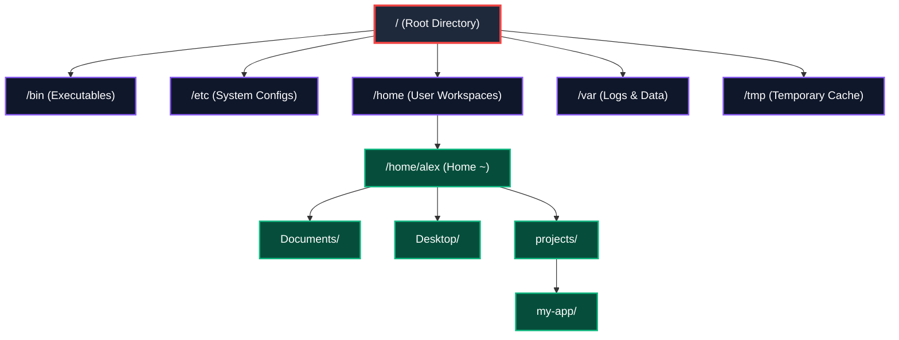
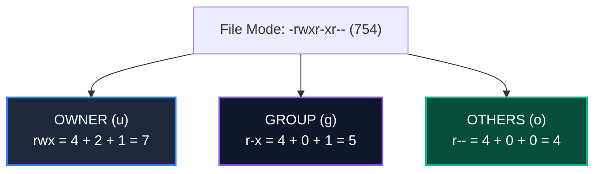

# Lesson Blueprint: LES-00-01
# Files, Folders & The POSIX Filesystem Mental Model
# AI-Native Software Engineering Academy (`ai-native-lms`)

**Document Version:** 1.0.0  
**Status:** Approved Authoritative Lesson Blueprint  
**Authority:** Senior Instructional Designer & Curriculum Blueprint Architect  
**Target Repository:** `ai-native-lms`  
**Classification:** Canonical Lesson Blueprint  
**Parent Module:** [`module-00-blueprint.md`](file:///home/gamp/Documents/lms/module-00-blueprint.md)  
**Target Gate:** Gate 1: Foundations  
**Effective Date:** September 30, 2026

---

## Table of Contents

1. [Lesson Overview](#1-lesson-overview)
2. [Learning Objectives](#2-learning-objectives)
3. [Entry Knowledge](#3-entry-knowledge)
4. [Exit Knowledge](#4-exit-knowledge)
5. [Concepts Introduced](#5-concepts-introduced)
6. [Concepts Reinforced](#6-concepts-reinforced)
7. [Misconceptions To Prevent](#7-misconceptions-to-prevent)
8. [Visual Diagrams Required](#8-visual-diagrams-required)
9. [Worked Examples Required](#9-worked-examples-required)
10. [Guided Practice Requirements](#10-guided-practice-requirements)
11. [Exercise Dependencies](#11-exercise-dependencies)
12. [Artifact Dependencies](#12-artifact-dependencies)
13. [Evidence Produced](#13-evidence-produced)
14. [Reflection Requirements](#14-reflection-requirements)
15. [Estimated Learning Time](#15-estimated-learning-time)
16. [Cognitive Load Assessment](#16-cognitive-load-assessment)
17. [Hidden Prerequisite Check](#17-hidden-prerequisite-check)
18. [Build-First Validation](#18-build-first-validation)

---

## 1. Lesson Overview

```
╔════════════════════════════════════════════════════════════════════════════════════════╗
║                              LES-00-01 METADATA BLOCK                                  ║
╠══════════════════════════════╦═════════════════════════════════════════════════════════╣
║ Lesson Identifier            ║ LES-00-01                                               ║
║ Lesson Title                 ║ Files, Folders & The POSIX Filesystem Mental Model      ║
║ Parent Module                ║ MOD-00: Digital & Developer Foundations                 ║
║ Curriculum Phase             ║ Phase 1: Digital Foundations (Month 1, Week 1)          ║
║ Target Competency            ║ DEV-00: Tooling & Development Environment               ║
║ Target Audience              ║ Complete Beginners (Zero CS / Zero Coding Experience)   ║
║ Target Prose Volume          ║ 1,200 Words of Substantive Technical Instructional Text ║
║ Instructional Approach       ║ Visual-First, Scaffolded Build-First Progression        ║
║ Programming Language         ║ NONE (Zero Code / Zero Programming Syntax Required)     ║
║ Lead Pedagogical Domain      ║ Spatial Mental Models & OS Filesystem Architecture      ║
╚══════════════════════════════╩═════════════════════════════════════════════════════════╝
```

### Strategic Purpose:
`LES-00-01` dismantles the opaque GUI desktop illusion and installs the fundamental mental model of the POSIX filesystem as an inverted hierarchical tree. It equips beginners to understand where files live, how operating systems resolve path addresses, why file extensions matter, and how permissions isolate users in enterprise servers.

---

## 2. Learning Objectives

By the conclusion of this lesson, the learner will be able to:
1. **Explain the Inverted Tree Model**: Describe the POSIX filesystem hierarchy starting from the Root directory (`/`) down to user home directories (`/home/username` or `~`).
2. **Differentiate Absolute vs. Relative Paths**: Distinguish between an absolute path anchored at Root (`/`) and a relative path resolved from the Current Working Directory (`pwd`).
3. **Trace Path Navigation Syntax**: Accurately trace and construct navigation strings using current directory (`.`), parent directory (`..`), and home directory (`~`).
4. **Decode POSIX Permissions**: Interpret 3-tier file permissions (`User`, `Group`, `Others`) across Read (`r`/4), Write (`w`/2), and Execute (`x`/1) bitmasks.
5. **Identify Hidden Files**: Explain the convention and purpose of leading-dot hidden configuration files (`.dotfiles`).

---

## 3. Entry Knowledge

The learner enters with:
- General consumer computer literacy (can power on a computer, type on a keyboard, use a web browser, and save a document).
- **Zero prior knowledge of**: Linux/POSIX operating systems, terminal command lines, programming languages, path strings, or file permission bits.

---

## 4. Exit Knowledge

The learner exits with:
- A rock-solid spatial mental model of the entire filesystem tree.
- The cognitive ability to look at any file path string (e.g. `../../config/database.json`) and immediately trace its exact location relative to their current position without guessing.
- Complete demystification of file permissions (understanding why a script cannot run without execute permissions).

---

## 5. Concepts Introduced

```
┌────────────────────────────────────────────────────────────────────────────────────────┐
│                              CONCEPTS INTRODUCED IN LES-00-01                          │
├────────────────────────────┬───────────────────────────────────────────────────────────┤
│ Concept                    │ Technical Definition & Mental Model                       │
├────────────────────────────┼───────────────────────────────────────────────────────────┤
│ The Root Directory (`/`)   │ The supreme origin ancestor of every file and directory.  │
├────────────────────────────┼───────────────────────────────────────────────────────────┤
│ User Home (`~` / `/home/`) │ The isolated sandbox workspace reserved for a user.       │
├────────────────────────────┼───────────────────────────────────────────────────────────┤
│ Absolute Path              │ An immutable coordinate beginning at `/` (e.g. `/etc/hosts│
├────────────────────────────┼───────────────────────────────────────────────────────────┤
│ Relative Path              │ A coordinate relative to current position (`./app`, `../`)│
├────────────────────────────┼───────────────────────────────────────────────────────────┤
│ Self (`.`) & Parent (`..`) │ Pointer notations for current directory and parent folder.│
├────────────────────────────┼───────────────────────────────────────────────────────────┤
│ Hidden Files (`.dotfiles`) │ Files prefixed with `.` hidden by default for configs.   │
├────────────────────────────┼───────────────────────────────────────────────────────────┤
│ POSIX Permission Grid      │ Triad matrix (`rwx`) for Owner (u), Group (g), Other (o). │
├────────────────────────────┼───────────────────────────────────────────────────────────┤
│ Octal Permission Modes     │ Numeric representations (755 = rwxr-xr-x, 644 = rw-r--r--)│
└────────────────────────────┴───────────────────────────────────────────────────────────┘
```

---

## 6. Concepts Reinforced

- **Physical Filing Cabinet Analogy**: Transitioning from physical folder drawers to digital tree structures.
- **Postal Address Analogy**: Global GPS coordinates (Absolute Paths) vs. local turn-by-turn directions (Relative Paths).
- **Security Isolation**: How multi-tenant operating systems protect one user's files from another user on the same server.

---

## 7. Misconceptions To Prevent

```
┌────────────────────────────────────────────────────────────────────────────────────────┐
│                              MISCONCEPTIONS PREVENTED                                  │
├─────────────────────────┬───────────────────────────────┬──────────────────────────────┤
│ Common Beginner Fallacy │ Reality & Scientific Truth    │ Preventive Pedagogical Action│
├─────────────────────────┼───────────────────────────────┼──────────────────────────────┤
│ "The Desktop is the top │ The Desktop is just a normal  │ Show Desktop inside the tree:│
│ of the computer."       │ subfolder inside `~/Desktop`. │ `/home/user/Desktop`.        │
├─────────────────────────┼───────────────────────────────┼──────────────────────────────┤
│ "File extensions change │ Extensions are just naming    │ Explain that OS identifies   │
│ what a file actually is"│ conventions; file content is  │ file type by byte signatures,│
│                         │ raw binary/text data.         │ not just the `.txt` label.   │
├─────────────────────────┼───────────────────────────────┼──────────────────────────────┤
│ "A folder is a physical │ A directory is an index table │ Introduce directory as a list│
│ box containing files."  │ pointing to data addresses.   │ of names mapped to storage.  │
├─────────────────────────┼───────────────────────────────┼──────────────────────────────┤
│ "Hidden files are virus │ Dotfiles store normal user    │ Show `.bashrc` and `.git` as │
│ or dangerous files."    │ configuration preferences.    │ standard developer tools.    │
├─────────────────────────┼───────────────────────────────┼──────────────────────────────┤
│ "Permissions are just   │ Permissions are kernel-level  │ Show how kernel enforces     │
│ recommendations."       │ hardware access boundaries.   │ immediate Permission Denied. │
└─────────────────────────┴───────────────────────────────┴──────────────────────────────┘
```

---

## 8. Visual Diagrams Required

The lesson author must include three explicit, high-fidelity Mermaid architectural diagrams:

### Diagram 1: The POSIX Inverted Hierarchy Tree
Visualizes Root (`/`) branching into system directories (`/etc`, `/var`, `/usr`, `/tmp`, `/home`).



### Diagram 2: Relative vs. Absolute Path Routing
Visualizes how navigating from `/home/alex/projects/my-app` to `/home/alex/Documents/notes.txt` resolves via `../../Documents/notes.txt`.


### Diagram 3: The POSIX 3-Tier Permission Grid
Deconstructs `rwxr-xr--` (754) into Owner, Group, and Others.



---

## 9. Worked Examples Required

The lesson text must present three step-by-step annotated worked examples:

### Worked Example 1: Tracing an Absolute Path
- **Scenario**: Finding the system DNS configuration file.
- **Trace**:
  1. Start at Root: `/`
  2. Enter configuration folder: `/etc/`
  3. Locate file: `/etc/resolv.conf`
- **Rule**: Every absolute path MUST begin with `/`.

### Worked Example 2: Navigating Sibling Folders with Relative Paths
- **Current Working Directory (`pwd`)**: `/home/alex/projects/frontend/`
- **Target File**: `/home/alex/projects/backend/server.js`
- **Resolution Step-by-Step**:
  1. Climb up one level to `projects/`: `../`
  2. Step into `backend/`: `../backend/`
  3. Target `server.js`: `../backend/server.js`

### Worked Example 3: Decoding Octal Permission Calculations
- **Calculate `chmod 755 run.sh`**:
  - Owner (7): $4 (\text{read}) + 2 (\text{write}) + 1 (\text{execute}) = \text{rwx}$
  - Group (5): $4 (\text{read}) + 0 + 1 (\text{execute}) = \text{r-x}$
  - Other (5): $4 (\text{read}) + 0 + 1 (\text{execute}) = \text{r-x}$
- **Resulting String**: `-rwxr-xr-x`

---

## 10. Guided Practice Requirements

Embedded in the lesson must be three interactive visual check widgets:
1. **Interactive Path Builder**: The learner is presented with a tree diagram and must click folder nodes to assemble the relative path from node A to node B.
2. **Permission Calculator Widget**: A dynamic 9-checkbox grid (Read, Write, Execute for Owner, Group, Other) that automatically updates the octal number (`644`, `755`, `777`).
3. **Hidden File Finder**: A toggle switch showing the directory view before and after toggling "Show Hidden Files (`ls -a`)".

---

## 11. Exercise Dependencies

This lesson directly prepares the learner for:
- **`EXE-00-01`: POSIX Filesystem Navigation & Directory Tree Reconstruction**
  - The learner will construct a multi-level directory tree matching a specification and verify relative path traversals inside the sandboxed POSIX container.

---

## 12. Artifact Dependencies

This lesson establishes the conceptual foundation for:
- **`ART-00-01`**: Developer Shell Profile (`.bashrc` / `.zshrc` dotfiles).
- **`ART-00-02`**: GitHub Repository file structure and `.gitignore` dotfile.

---

## 13. Evidence Produced

Learner interaction in this lesson emits the following evidentiary telemetry:
- `path_mental_model_diagnostic`: Evaluator check of 5 path resolution puzzles (100% accuracy required before proceeding to LES-00-02).

---

## 14. Reflection Requirements

Upon completing the lesson, the learner must answer two reflective prompts:
1. **Spatial Architecture Reflection**: *"Why do enterprise cloud systems and Docker containers use explicit file path strings instead of visual desktop search engines?"*
2. **Security Reflection**: *"If an inexperienced developer sets all files to `chmod 777` to fix a permission error, what security vulnerability does this create on a shared server?"*

---

## 15. Estimated Learning Time

```
┌────────────────────────────────────────────────────────────────────────────────────────┐
│                              TIME ALLOCATION BREAKDOWN                                 │
├─────────────────────────────────────────┬──────────────────────────────────────────────┤
│ Theory & Narrative Reading (1,200 wds)  │ 1.5 Hours                                    │
├─────────────────────────────────────────┼──────────────────────────────────────────────┤
│ Visual Diagram & Model Exploration      │ 1.5 Hours                                    │
├─────────────────────────────────────────┼──────────────────────────────────────────────┤
│ Interactive Path & Permission Drills    │ 1.5 Hours                                    │
├─────────────────────────────────────────┼──────────────────────────────────────────────┤
│ Cognitive Reflection & Self-Check       │ 1.5 Hours                                    │
├─────────────────────────────────────────┼──────────────────────────────────────────────┤
│ TOTAL ESTIMATED DEDICATED EFFORT        │ 6.0 Hours (Week 1 Allocation)                │
└─────────────────────────────────────────┴──────────────────────────────────────────────┘
```

---

## 16. Cognitive Load Assessment

- **Extraneous Load**: **MINIMAL (0%)**. Zero terminal CLI commands or syntax switches are introduced in this lesson; all energy is focused on the spatial mental model of the filesystem.
- **Intrinsic Load**: **SCAFFOLDED (40%)**. Intrinsic complexity is managed by introducing Root first, then Home, then Paths, and finally Permissions.
- **Germane Load**: **MAXIMIZED (60%)**. The learner builds an enduring schema of tree data structures that will directly transfer to DOM trees, JSON objects, and Git DAGs in later modules.

---

## 17. Hidden Prerequisite Check

```
┌────────────────────────────────────────────────────────────────────────────────────────┐
│                              HIDDEN PREREQUISITE AUDIT                                 │
├─────────────────────────────────────┬────────┬─────────────────────────────────────────┤
│ Potential Prerequisite Hazard       │ Status │ Verification Check                      │
├─────────────────────────────────────┼────────┼─────────────────────────────────────────┤
│ Requires programming knowledge?     │ PASSED │ Zero variables, loops, or code syntax.  │
├─────────────────────────────────────┼────────┼─────────────────────────────────────────┤
│ Requires terminal CLI syntax?       │ PASSED │ Deferred to LES-00-02; visual only.     │
├─────────────────────────────────────┼────────┼─────────────────────────────────────────┤
│ Requires advanced mathematics?      │ PASSED │ Octal math is simple addition (4+2+1).  │
├─────────────────────────────────────┼────────┼─────────────────────────────────────────┤
│ Assumes prior Linux/Unix use?       │ PASSED │ Explicitly starts from zero background. │
└─────────────────────────────────────┴────────┴─────────────────────────────────────────┘
```

---

## 18. Build-First Validation

The lesson blueprint enforces the **6-Stage Build-First Instructional Sequence** mandated by [`content-standards.md`](file:///home/gamp/Documents/lms/content-standards.md):


1. **Stage 1 (Industrial Hook - 150 wds)**: The $10M Outage caused by an accidental relative path deletion.
2. **Stage 2 (Interactive Preview - 150 wds)**: Live visual directory explorer widget.
3. **Stage 3 (Guided Walkthrough - 400 wds)**: Tracing absolute vs relative paths with line-by-line breakdown.
4. **Stage 4 (Core Theory - 300 wds)**: Inode tables, directory pointers, and the 3-tier permission bitmask.
5. **Stage 5 (Failure Modes - 150 wds)**: The `chmod 777` security hazard and accidental root path typos (`/` vs `./`).
6. **Stage 6 (Lab Challenge Bridge - 50 wds)**: Segue directly into `EXE-00-01` directory tree building.

---

`LES-00-01 Blueprint` is approved and ready for full 1,200-word lesson prose authoring.
