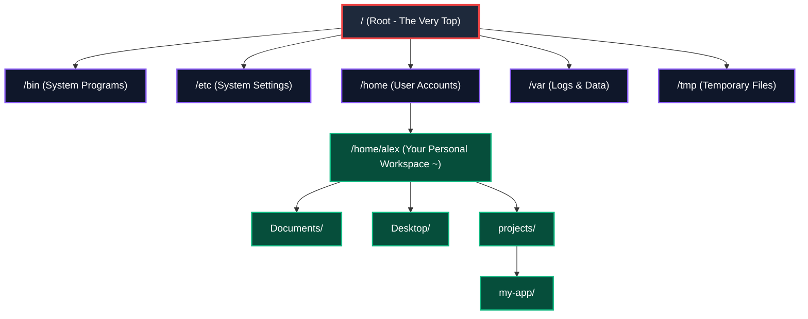

# LES-00-01: Files, Folders & The POSIX Filesystem Mental Model

**Module:** MOD-00 Digital Foundations  
**Phase:** Phase 1 (Month 1, Week 1)  
**Target Competency:** `DEV-00` (Tooling & Development Environment)  
**Estimated Total Effort:** 6.0 Hours Total Dedicated Effort (60–90 min core reading + interactive sandbox drills & reflection)  
**Prerequisites:** None (Complete Beginner Baseline)

---

### Why This Matters

Every modern technology you will build or work with—from cloud servers running on AWS to Docker containers packaging applications, Git repositories tracking project code, and deployment environments serving millions of users—relies on the exact same underlying filesystem rules.

In production environments, a substantial number of cloud deployment failures, container startup crashes, and build errors trace directly back to misspelled path coordinates or misconfigured file permissions.

Understanding how files and folders are structured gives you the foundational map of the computer. Once you understand this map, working with servers, containers, and codebases will feel intuitive and natural instead of intimidating.

---

### What You Will Learn

- **Explain the root directory (`/`)**: Understand the single origin point where every file and folder in the entire computer begins.
- **Locate your home directory (`~`)**: Confidently find and manage your private personal workspace.
- **Distinguish absolute and relative paths**: Give exact global addresses or step-by-step directions to find any file from anywhere.
- **Identify hidden configuration files**: Recognize dotfiles (like `.config` or `.env`) that store background application settings.
- **Interpret read, write, and execute permissions (`rwx`)**: Read security settings to know who can view, edit, or run any file.

---

### Prerequisites

- ✅ **No coding experience required**: You do not need to know any programming language.
- ✅ **No terminal or command-line experience required**: We start from a visual baseline before typing commands.
- ✅ **No Linux experience required**: Everything is explained clearly with everyday analogies and visual diagrams.
- ✅ **Just your computer and a web browser**: A working keyboard, screen, and curiosity about how software works under the hood.

---

## 1. The Story of the Missing Slash

In 2019, an automated cleanup program on a large payment server was instructed to delete temporary junk files located in a folder written as `temp/logs`.

The person who wrote the instruction forgot a single leading forward slash (`/`).

Because the slash was missing, the computer did not look at the main system storage. Instead, it looked inside the folder where it was currently standing—which happened to be the core system folder of the computer. The computer followed the instruction faithfully and erased crucial operating system files.

The resulting outage lasted 14 hours and prevented millions of people from buying groceries or paying bills.

The computer did not make a mistake. It followed an exact address instruction.

Understanding how files, folders, and path addresses work is the very first step to becoming a confident software engineer.

---

## 2. The Inverted Tree: Moving Beyond Desktop Icons

When you look at your computer screen, you see files scattered on your "Desktop." This often makes it feel like the Desktop is the top or center of your computer.

In reality, your Desktop is just an ordinary folder tucked away inside your personal user account.

Computers organize all files and folders in a structure called an **Inverted Tree** (an upside-down tree). Unlike a natural tree that grows upward from the ground, the computer's tree starts at the very top with a single origin point and branches downward into more and more folders.



---

## 3. The Three Fundamental Anchors of the Filesystem

To find your way around the filesystem tree, you only need to know three core anchors:

1. **The Root Directory (`/`)**: 
   The single forward slash represents the absolute top of the entire computer. Every single file, folder, program, and connected drive lives underneath `/`. There is nothing above Root.
2. **The User Home Directory (`~` or `/home/yourname`)**: 
   Computers are built so multiple people can use the same machine safely. Each person gets their own private workspace inside `/home/`. The tilde symbol (`~`) is a convenient universal shortcut that always stands for "my home folder."
3. **The Current Working Directory**: 
   At any given moment, the computer is "standing" inside one specific folder. The folder you are currently inside is called your **Current Working Directory**.

---

## 4. Absolute vs. Relative Paths: Finding Any File

To open, read, or change a file, you must tell the computer its **Path**—the address coordinates that guide the computer through the branches of the tree.

There are two ways to write any address: **Absolute Paths** and **Relative Paths**.

```
┌────────────────────────────────────────────────────────────────────────────────────────┐
│                              PATH TYPES AT A GLANCE                                    │
├───────────────────┬──────────────────────────────────┬─────────────────────────────────┤
│ Path Type         │ How It Starts                    │ Everyday Analogy                │
├───────────────────┼──────────────────────────────────┼─────────────────────────────────┤
│ Absolute Path     │ Always starts with a slash (`/`) │ A Global Postal Address         │
│                   │                                  │ (Country, City, Street, Number) │
├───────────────────┼──────────────────────────────────┼─────────────────────────────────┤
│ Relative Path     │ Starts with a folder name,       │ Local Directions                │
│                   │ `.` (here), or `..` (up one level│ ("Walk two doors down the hall")│
└───────────────────┴──────────────────────────────────┴─────────────────────────────────┘
```

### 4.1 Absolute Paths: The Global Address
An **Absolute Path** gives the complete, exact address of a file starting all the way from the top Root (`/`). Because it starts at Root, an absolute path points to the exact same file no matter where you are currently standing.

- **Example 1**: `/etc/settings.txt`  
  *Meaning*: Start at Root (`/`), open the `etc` folder, and find `settings.txt`.
- **Example 2**: `/home/alex/projects/my-app/index.html`  
  *Meaning*: Start at Root (`/`), open `home`, open `alex`, open `projects`, open `my-app`, and find `index.html`.

> [!TIP]
> If a path starts with a forward slash (`/`), it is an **Absolute Path** anchored directly to Root.

---

### 4.2 Relative Paths: Directions from Where You Are Standing
A **Relative Path** gives directions to a file starting from your **Current Working Directory**. If you move to a different folder, the directions must change.

To write relative directions, you use three special shorthand symbols:
- `.` (Single Dot): "The folder I am currently inside."
- `..` (Double Dot): "The parent folder one level directly above me."
- `~` (Tilde): "My personal home folder."

```mermaid
graph LR
    classDef curr fill:#1e293b,stroke:#3b82f6,stroke-width:2px,color:#fff;
    classDef step fill:#0f172a,stroke:#f59e0b,stroke-width:2px,color:#fff;
    classDef targ fill:#064e3b,stroke:#10b981,stroke-width:2px,color:#fff;

    C["You Are Standing Here:<br/>/home/alex/projects/my-app"]:::curr -->|1. Step Up (..)| P["Parent Folder:<br/>/home/alex/projects"]:::step
    P -->|2. Step Up (..)| H["Your Home Folder:<br/>/home/alex"]:::step
    H -->|3. Enter Folder| D["Documents Folder:<br/>/home/alex/Documents"]:::step
    D -->|4. Target File| T["Target File:<br/>notes.txt"]:::targ
```

### 4.3 Step-by-Step Worked Example: Visiting a Sibling Folder

Imagine you are currently working inside this folder:  
`/home/alex/projects/my-app/`

You need to access a file called `notes.txt` inside your `Documents` folder:  
`/home/alex/Documents/notes.txt`

How do you give step-by-step relative directions?

1. **Step 1 (`..`)**: Step up one level out of `my-app` into `projects`. (Current path: `..`)
2. **Step 2 (`..`)**: Step up one more level out of `projects` into your home folder `alex`. (Current path: `../..`)
3. **Step 3 (`Documents/`)**: Step down into the `Documents` folder. (Current path: `../../Documents`)
4. **Step 4 (`notes.txt`)**: Target the file. (Final Relative Path: `../../Documents/notes.txt`)

---

## 5. Folders, Hidden Files & Basic Permissions

### What is a Folder Really?
Think of a folder as a labeled divider in a physical filing cabinet. It does not change the files inside it; it simply groups them together under a helpful name so both you and the computer can locate them quickly.

---

### Hidden Files (Dotfiles)
Sometimes you will see a file or folder whose name begins with a period, such as `.config` or `.my-settings`.

These are called **Dotfiles** or **Hidden Files**. 

They are not locked, dangerous, or secret. The computer simply hides them from everyday views so your workspace stays clean and free of background configuration settings.

---

### Basic Permissions: Read, Write, and Execute

In any computer shared by teams or connected to the internet, files need protection. The operating system provides three simple permission rights:

```
┌────────────────────────────────────────────────────────────────────────────────────────┐
│                              THE THREE BASIC PERMISSIONS                               │
├────────────────────┬──────────┬────────────────────────────────────────────────────────┤
│ Permission Right   │ Symbol   │ What It Allows You To Do                               │
├────────────────────┼──────────┼────────────────────────────────────────────────────────┤
│ Read               │ `r`      │ Look inside the file and view its contents.            │
├────────────────────┼──────────┼────────────────────────────────────────────────────────┤
│ Write              │ `w`      │ Edit, modify, save changes, or delete the file.        │
├────────────────────┼──────────┼────────────────────────────────────────────────────────┤
│ Execute            │ `x`      │ Run the file as a program, tool, or script.            │
└────────────────────┴──────────┴────────────────────────────────────────────────────────┘
```

These three rights can be granted separately to:
- **The Owner**: The person who created the file.
- **The Group**: Teammates who share access.
- **Others**: Anyone else on the system.

For example, a normal document might allow the **Owner** to Read and Write (`rw`), while allowing **Others** only to Read (`r`). This prevents other people from accidentally deleting or altering your work.

*(In the next lesson, you will practice viewing and adjusting these permissions using the terminal).*

---

## 6. Common Beginner Traps & How to Avoid Them

### Trap 1: Forgetting the Leading Slash
When you want to point to a system folder at the top of the computer, forgetting the starting `/` changes the meaning completely:
- `etc/settings.txt` (Relative) &rarr; Looks for an `etc` folder inside *wherever you are right now*. If it is not there, you get an error.
- `/etc/settings.txt` (Absolute) &rarr; Accurately targets the settings file at the top of the computer every time.

---

### Trap 2: Spaces in File and Folder Names
In ordinary everyday use, you might name a file `My Project Notes 2026.txt`. 

To engineering tools and cloud servers, spaces look like separators between separate commands. This can confuse the system into thinking `My`, `Project`, `Notes`, and `2026.txt` are four different things.

Software engineers use hyphens or underscores instead of spaces:
- ✅ `my-project-notes-2026.txt` (Clear and reliable)
- ❌ `My Project Notes 2026.txt` (Can cause unexpected errors)

---

### Trap 3: Panic When Seeing "Permission Denied"
If you try to open or save a file and see `Permission Denied`, do not panic. It simply means the operating system is doing its job to protect a system file or another user's workspace. You will learn how to handle permissions smoothly as you build your developer toolkit.

---

## 7. Key Takeaways & Coding Lab Bridge

```
┌────────────────────────────────────────────────────────────────────────────────────────┐
│                                   CORE LESSON TAKEAWAYS                                │
├────────────────────────────────────────────────────────────────────────────────────────┤
│ 1. Files and folders form an Inverted Tree starting at the top Root (`/`).             │
│ 2. An Absolute Path begins with `/` and gives an exact global address from Root.       │
│ 3. A Relative Path gives directions from where you are currently standing.             │
│ 4. `.` means "current folder", `..` means "parent folder above", and `~` means "home". │
│ 5. Files starting with `.` are hidden setting files (Dotfiles).                        │
│ 6. Permissions control who can Read (`r`), Write (`w`), and Execute (`x`) a file.     │
└────────────────────────────────────────────────────────────────────────────────────────┘
```

---

### Cognitive Self-Reflection

Take a moment to answer these two questions in your mind to confirm your mental model:

1. **Tree Hierarchy Question**: *If you are standing inside `/home/alex/projects`, what is the name of the folder directly one level above you (`..`)?*  
   *(Hint: Look at the path backwards—what folder contains `projects`?)*

2. **Path Addressing Question**: *Why does an absolute path like `/home/alex/notes.txt` always work from anywhere, while a relative path like `notes.txt` only works if you are already inside the `alex` folder?*

---

### Next Step: Your First Sandboxed Lab Challenge

You now have the complete mental map of the filesystem. It is time to see it in action.

Proceed to **`EXE-00-01: POSIX Filesystem Navigation & Directory Tree Reconstruction`**, where you will enter an interactive sandbox to explore folders and construct your first real directory tree.
