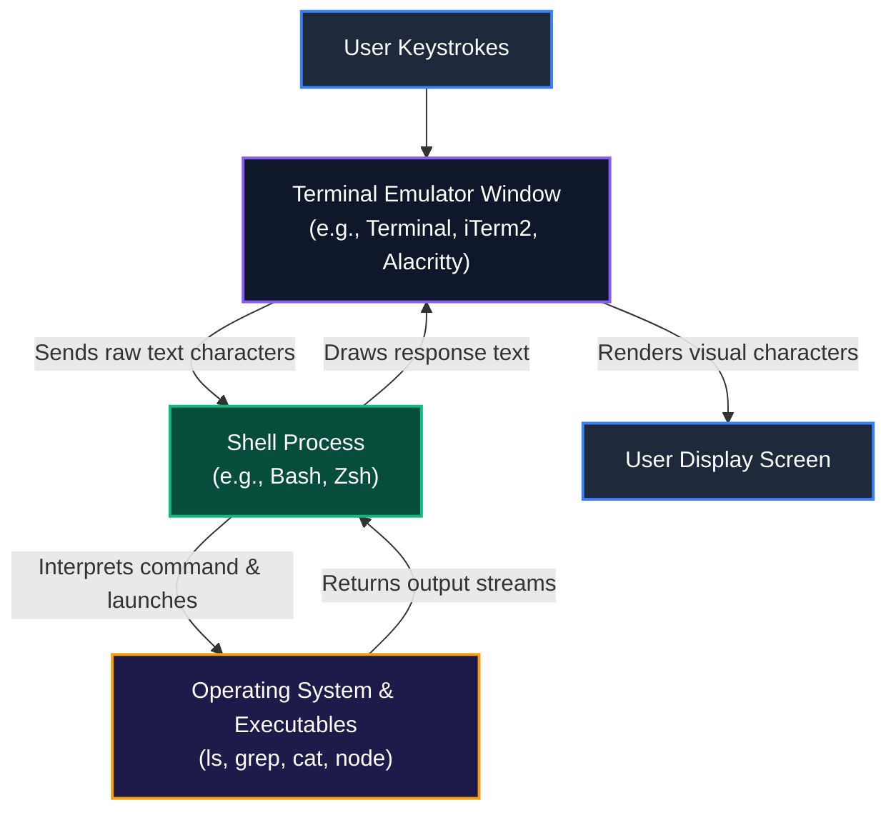
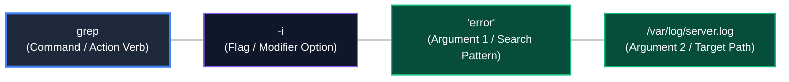
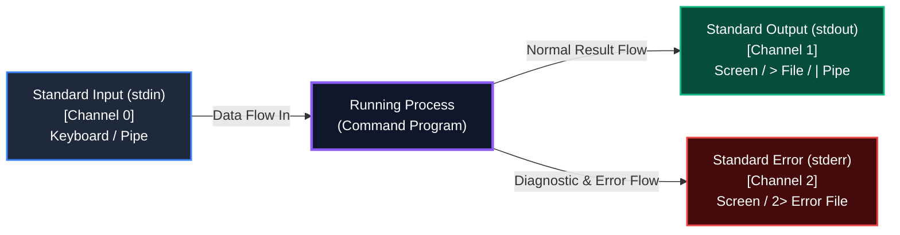

# Lesson Blueprint: LES-00-02
# The Command-Line Interface (CLI) & Shell Streams
# AI-Native Software Engineering Academy (`ai-native-lms`)

**Document Version:** 1.0.0  
**Status:** Approved Authoritative Lesson Blueprint  
**Authority:** Senior Instructional Designer & Curriculum Blueprint Architect  
**Target Repository:** `ai-native-lms`  
**Classification:** Canonical Lesson Blueprint  
**Parent Module:** [`module-00-blueprint.md`](file:///home/gamp/Documents/lms/module-00-blueprint.md)  
**Target Gate:** Gate 1: Foundations  
**Effective Date:** September 30, 2026

---

## Table of Contents

1. [Lesson Overview](#1-lesson-overview)
2. [Learning Objectives](#2-learning-objectives)
3. [Entry Knowledge](#3-entry-knowledge)
4. [Exit Knowledge](#4-exit-knowledge)
5. [Concepts Introduced](#5-concepts-introduced)
6. [Concepts Reinforced](#6-concepts-reinforced)
7. [Misconceptions To Prevent](#7-misconceptions-to-prevent)
8. [Visual Diagrams Required](#8-visual-diagrams-required)
9. [Worked Examples Required](#9-worked-examples-required)
10. [Guided Practice Requirements](#10-guided-practice-requirements)
11. [Exercise Dependencies](#11-exercise-dependencies)
12. [Artifact Dependencies](#12-artifact-dependencies)
13. [Evidence Produced](#13-evidence-produced)
14. [Reflection Requirements](#14-reflection-requirements)
15. [Estimated Learning Time](#15-estimated-learning-time)
16. [Cognitive Load Assessment](#16-cognitive-load-assessment)
17. [Hidden Prerequisite Audit](#17-hidden-prerequisite-audit)
18. [Build-First Validation](#18-build-first-validation)

---

## 1. Lesson Overview

```
╔════════════════════════════════════════════════════════════════════════════════════════╗
║                              LES-00-02 METADATA BLOCK                                  ║
╠══════════════════════════════╦═════════════════════════════════════════════════════════╣
║ Lesson Identifier            ║ LES-00-02                                               ║
║ Lesson Title                 ║ The Command-Line Interface (CLI) & Shell Streams        ║
║ Parent Module                ║ MOD-00: Digital & Developer Foundations                 ║
║ Curriculum Phase             ║ Phase 1: Digital Foundations (Month 1, Weeks 1–2)       ║
║ Target Competency            ║ DEV-00: Tooling & Development Environment               ║
║ Target Audience              ║ Complete Beginners (Zero CS / Zero Terminal Experience) ║
║ Target Prose Volume          ║ 1,200 to 1,500 Words of Technical Instructional Text    ║
║ Instructional Approach       ║ Visual-First, Dataflow Plumbing Model, Build-First      ║
║ Programming Language         ║ NONE (Zero Code / Zero Scripting / Zero Variables/Loops)║
║ Lead Pedagogical Domain      ║ Stream I/O Architecture & Command-Line Mechanics        ║
╚══════════════════════════════╩═════════════════════════════════════════════════════════╝
```

### Strategic Purpose:
`LES-00-02` transitions the beginner from static filesystem spatial models (`LES-00-01`) to active, dynamic command execution and stream data processing. It demystifies the terminal window versus the underlying shell process, breaks down command syntax grammar into an approachable anatomy (Command, Flags, Arguments), and establishes the fundamental UNIX paradigm of data streams (`stdin`, `stdout`, `stderr`) and composability via pipes (`|`) and redirection (`>`, `>>`, `2>`).

---

## 2. Learning Objectives

By the conclusion of this lesson, the learner will be able to:

1. **Distinguish Terminal from Shell**: Articulate the functional difference between a terminal emulator (the GUI presentation window and display screen) and a shell interpreter (the underlying program that parses commands, such as Bash or Zsh).
2. **Deconstruct CLI Command Anatomy**: Identify and parse any standard command invocation into its three constituent elements: the Command binary (action/verb), Flags/Options (modifiers/switches), and Arguments (operands/path targets).
3. **Trace Standard I/O Streams**: Trace the flow of the three standard POSIX data streams—Standard Input (`stdin` / FD 0), Standard Output (`stdout` / FD 1), and Standard Error (`stderr` / FD 2)—into and out of executing processes.
4. **Apply Stream Redirection Operators**: Divert output streams using file redirection operators to overwrite files (`>`), append records (`>>`), and isolate diagnostic error messages (`2>`) without corrupting clean data.
5. **Construct Linear Stream Pipelines**: Chain standalone command utilities using the pipe operator (`|`) to direct the `stdout` of an upstream process directly into the `stdin` of a downstream process in memory.
6. **Diagnose Stream Separation**: Identify why an error message appears on screen despite `stdout` redirection and explain how stream isolation preserves system observability.

---

## 3. Entry Knowledge

The learner enters having completed **`LES-00-01` only** and possesses:
- A clear spatial mental model of the POSIX Inverted Directory Tree (`/`, `/home/user`, `~`).
- The ability to navigate and express Absolute Paths (`/var/log/system.log`) and Relative Paths (`./notes.txt`, `../config/`).
- Understanding of directory pointers: Self (`.`) and Parent (`..`).
- Recognition of hidden dotfiles (`.profile`) and 3-tier file permissions (`rwx`).
- **Zero prior knowledge of**:
  - The command line prompt (`$`).
  - Terminal emulators vs. shells.
  - Standard input, output, or error streams.
  - Pipes or file redirection operators.
  - Command flags, arguments, or options.
  - Shell scripting, variables, functions, or programming languages.

---

## 4. Exit Knowledge

The learner exits with:
- Zero "terminal intimidation" or anxiety when presented with a blank shell prompt.
- An accurate mental model of the terminal as a conversation partner and the shell as an interpreter.
- Intuitive ability to deconstruct any CLI command into Command + Flags + Arguments.
- A physical "plumbing and conveyor belt" mental model of text data flowing through standard streams.
- The cognitive skill to route, capture, append, and filter streams using `>`, `>>`, `2>`, and `|`.
- An understanding of the UNIX philosophy: small, single-purpose tools connected together to accomplish complex operations.

---

## 5. Concepts Introduced

```
┌────────────────────────────────────────────────────────────────────────────────────────┐
│                              CONCEPTS INTRODUCED IN LES-00-02                          │
├────────────────────────────┬───────────────────────────────────────────────────────────┤
│ Concept                    │ Technical Definition & Mental Model                       │
├────────────────────────────┼───────────────────────────────────────────────────────────┤
│ Terminal Emulator          │ The graphical application window that captures keystrokes │
│                            │ and renders characters. (Analogy: The TV monitor / glass).│
├────────────────────────────┼───────────────────────────────────────────────────────────┤
│ Shell (Command Interpreter)│ The background program (e.g. Bash, Zsh) that translates   │
│                            │ text commands into kernel operations. (Analogy: Translator│
├────────────────────────────┼───────────────────────────────────────────────────────────┤
│ The Prompt (`$` / `%`)     │ The ready signal emitted by the shell indicating it is    │
│                            │ waiting for user input. (Analogy: The dial tone).         │
├────────────────────────────┼───────────────────────────────────────────────────────────┤
│ Command Anatomy            │ Grammar of CLI: `command [flags] [arguments]`.            │
│                            │ - Command = Executable program name (Verb).               │
│                            │ - Flags = Behavioral modifier switches (Adverbs).         │
│                            │ - Arguments = Target files or text strings (Nouns).       │
├────────────────────────────┼───────────────────────────────────────────────────────────┤
│ Standard Input (`stdin`)   │ Channel 0 (File Descriptor 0): The default data stream    │
│                            │ fed into a program (defaults to keyboard input).          │
├────────────────────────────┼───────────────────────────────────────────────────────────┤
│ Standard Output (`stdout`) │ Channel 1 (File Descriptor 1): The default data stream    │
│                            │ emitted on success (defaults to terminal display screen). │
├────────────────────────────┼───────────────────────────────────────────────────────────┤
│ Standard Error (`stderr`)  │ Channel 2 (File Descriptor 2): The dedicated diagnostic   │
│                            │ stream for error notices (defaults to terminal screen).   │
├────────────────────────────┼───────────────────────────────────────────────────────────┤
│ The Pipe Operator (`|`)    │ An in-memory conduit that connects the `stdout` of one   │
│                            │ process directly to the `stdin` of the next process.      │
├────────────────────────────┼───────────────────────────────────────────────────────────┤
│ Overwrite Redirection (`>`)│ Operator that diverts `stdout` to replace/overwrite a file│
│                            │ on disk (erases existing content).                        │
├────────────────────────────┼───────────────────────────────────────────────────────────┤
│ Append Redirection (`>>`)  │ Operator that diverts `stdout` to add new text to the end │
│                            │ of a file on disk without erasing existing content.       │
├────────────────────────────┼───────────────────────────────────────────────────────────┤
│ Error Redirection (`2>`)   │ Operator that diverts Channel 2 (`stderr`) specifically   │
│                            │ to a file, separating error notices from clean output.    │
└────────────────────────────┴───────────────────────────────────────────────────────────┘
```

---

## 6. Concepts Reinforced

- **POSIX Path Addressing (`LES-00-01`)**: Paths are passed as arguments to CLI commands (`cat /var/log/syslog`, `ls ../projects`).
- **File Permissions (`LES-00-01`)**: Executing a command binary requires execute permission (`x`), while reading input files requires read permission (`r`).
- **Inverted Hierarchy (`LES-00-01`)**: How commands operate on directories and files located at specific coordinates relative to the Current Working Directory (`pwd`).
- **Text-Centric Architecture**: Files and command outputs are transparent streams of UTF-8 text bytes, not proprietary black boxes.

---

## 7. Misconceptions To Prevent

```
┌────────────────────────────────────────────────────────────────────────────────────────┐
│                              MISCONCEPTIONS PREVENTED                                  │
├─────────────────────────┬───────────────────────────────┬──────────────────────────────┤
│ Common Beginner Fallacy │ Reality & Scientific Truth    │ Preventive Pedagogical Action│
├─────────────────────────┼───────────────────────────────┼──────────────────────────────┤
│ "The Terminal and the   │ The Terminal is the display   │ Draw explicit architectural  │
│ Shell are the same."    │ window; the Shell is the brain│ diagram showing Terminal     │
│                         │ interpreting text commands.   │ hosting the Shell process.   │
├─────────────────────────┼───────────────────────────────┼──────────────────────────────┤
│ "Using the terminal     │ Running commands is invoking  │ Frame commands as simple,    │
│ requires writing code   │ pre-built tools (like kitchen │ single-purpose appliances    │
│ or programming."        │ appliances), not programming. │ with switches and dials.     │
├─────────────────────────┼───────────────────────────────┼──────────────────────────────┤
│ "An error message on    │ `stderr` is an intentional    │ Demystify error text: show   │
│ screen means the system │ diagnostic report explaining  │ that errors are helpful GPS  │
│ or computer broke."     │ what prevented completion.    │ notices, not system crashes. │
├─────────────────────────┼───────────────────────────────┼──────────────────────────────┤
│ "A pipe (`|`) saves a   │ Pipes stream data directly    │ Visualize pipes as fluid     │
│ temporary file on the   │ through RAM memory buffers    │ flowing between running      │
│ hard drive."            │ without touching the disk.    │ water pumps in real time.    │
├─────────────────────────┼───────────────────────────────┼──────────────────────────────┤
│ "The `>` operator adds  │ `>` completely wipes (wipes   │ Use bold warnings: compare   │
│ new text to a file."    │ clean) before writing; only   │ `>` (Clean Bucket/Overwrite) │
│                         │ `>>` appends to the end.      │ with `>>` (Notebook Append). │
├─────────────────────────┼───────────────────────────────┼──────────────────────────────┤
│ "Command flags must be  │ Flags are mnemonic options    │ Show that flags are optional │
│ memorized by heart."    │ (`-l` = long, `-a` = all)     │ modifiers looked up in help  │
│                         │ documented in manuals (`man`).│ docs, not memory tests.      │
└─────────────────────────┴───────────────────────────────┴──────────────────────────────┘
```

---

## 8. Visual Diagrams Required

The lesson author must include four explicit, high-fidelity Mermaid architectural diagrams:

### Diagram 1: Terminal Window vs. Shell Interpreter Architecture
Visualizes the separation between the physical input/display layer and the logical interpretation layer.



### Diagram 2: Anatomy of a CLI Command
Deconstructs a command into its functional grammatical parts.



### Diagram 3: The Three Standard Streams Triad (I/O Plumbing Model)
Illustrates how every process is born with three standard communication channels.



### Diagram 4: Multi-Stage Stream Pipeline Dataflow
Visualizes sequential in-memory stream transformations without intermediate disk files.

```mermaid
graph LR
    classDef src fill:#1e293b,stroke:#3b82f6,stroke-width:2px,color:#fff;
    classDef p1 fill:#0f172a,stroke:#8b5cf6,stroke-width:2px,color:#fff;
    classDef p2 fill:#042f2e,stroke:#14b8a6,stroke-width:2px,color:#fff;
    classDef p3 fill:#1e1b4b,stroke:#6366f1,stroke-width:2px,color:#fff;
    classDef dst fill:#064e3b,stroke:#10b981,stroke-width:2px,color:#fff;

    F["server.log<br/>(On-Disk File)"]:::src -->|"cat server.log"| P1["stdout [1]"]:::p1
    P1 -->|"| (Pipe Stream)"| S1["stdin [0]<br/>grep 'ERROR'"]:::p2
    S1 -->|"Filtered stdout [1]"| P2["stdout [1]"]:::p2
    P2 -->|"| (Pipe Stream)"| S2["stdin [0]<br/>wc -l"]:::p3
    S2 -->|"Line count stdout [1]"| REDIR["> (Overwrite)"]:::dst
    REDIR --> OUT["error_count.txt<br/>(On-Disk File)"]:::dst
```



---

## 9. Worked Examples Required

The lesson text must provide three fully annotated, step-by-step worked examples:

### Worked Example 1: Deconstructing Command Syntax Anatomy
- **Target Invocations**:
  - `ls -la /var/log`
  - `head -n 20 ./data/customers.csv`
- **Anatomy Breakdown Table**:
  1. `ls`: The command name (lists directory contents).
  2. `-la`: Combined short flags (`-l` for long format with permissions, `-a` for all files including dotfiles).
  3. `/var/log`: Target directory argument (absolute path).
- **Key Insight**: Spaces separate the command, its flags, and its arguments. The shell reads each whitespace-delimited word in order.

### Worked Example 2: Stream Redirection and Error Isolation
- **Scenario**: Running a system verification check that produces both normal status outputs and missing-file warning errors.
- **Commands & Stream Tracing**:
  1. **Default State (Screen Output)**:
     - `verify_app` &rarr; Both normal status lines (`stdout`) and error warnings (`stderr`) print mixed together in the terminal window.
  2. **Capturing Clean Output (`>`)**:
     - `verify_app > audit_report.txt` &rarr; Normal status lines are saved into `audit_report.txt`. Error warnings still print on the screen because `stderr` is not captured by `>`.
  3. **Isolating Errors Separately (`2>`)**:
     - `verify_app > audit_report.txt 2> error_log.txt` &rarr; Normal output flows cleanly into `audit_report.txt`, while diagnostic errors flow exclusively into `error_log.txt`. Screen remains quiet.
  4. **Appending Ongoing Activity (`>>`)**:
     - `echo "Audit run finished on $(date)" >> audit_report.txt` &rarr; Appends a timestamped confirmation line to the bottom without erasing prior contents.

### Worked Example 3: Building a 3-Stage Log Analysis Pipeline
- **Scenario**: Finding the exact number of critical database connection failures recorded in a 50,000-line server log.
- **Step-by-Step Construction**:
  - **Stage 1 (Source)**: `cat production.log`  
    *Effect*: Emits 50,000 lines of raw text to `stdout`.
  - **Stage 2 (Filter)**: `cat production.log | grep "DATABASE_TIMEOUT"`  
    *Effect*: The pipe directs all 50,000 lines into `grep`'s `stdin`. `grep` filters and emits only the 42 lines containing the matching keyword to its `stdout`.
  - **Stage 3 (Count)**: `cat production.log | grep "DATABASE_TIMEOUT" | wc -l`  
    *Effect*: The 42 matching lines flow into `wc -l` (word count - lines), which counts them and outputs `42`.
  - **Stage 4 (Persist)**: `cat production.log | grep "DATABASE_TIMEOUT" | wc -l > incident_summary.txt`  
    *Effect*: The single number `42` is written into a new file `incident_summary.txt`.

---

## 10. Guided Practice Requirements

The lesson must include three interactive visual check widgets embedded directly in the text:

1. **Interactive Command Anatomy Dissector**:
   - The learner is presented with 5 real-world CLI commands (e.g. `mkdir -p ./src/components`, `find /home -name "*.log"`, `tar -czvf backup.tar.gz ./files`).
   - The learner clicks on words in the command string to tag them with color-coded labels: **[Command]**, **[Flag]**, or **[Argument]**.
   - Immediate feedback highlights whether modifiers and path arguments were correctly categorized.

2. **The Stream Plumbing Simulator**:
   - A visual drag-and-drop circuit board featuring a Process box with three ports: `stdin (0)`, `stdout (1)`, and `stderr (2)`.
   - The learner connects virtual pipes and funnels from the ports to destinations: **Screen**, **File Overwrite (`>`)**, **File Append (`>>`)**, and **Piped Process (`|`)**.
   - The simulator runs test streams to show where error messages and clean text arrive.

3. **The Overwrite vs. Append Live File Visualizer**:
   - Two side-by-side text file buffer boxes displaying the contents of `log.txt`.
   - The learner types commands using `>` vs `>>` and observes real-time graphical representation: `>` flashes red and wipes all lines before inserting the new line; `>>` slides the new line neatly under existing text with a green indicator.

---

## 11. Exercise Dependencies

This lesson directly establishes the mental models and operational capabilities required for:

- **`EXE-00-02`: Shell Stream Processing & Log Grepping Pipeline**
  - The learner will construct multi-stage command pipelines in a sandboxed terminal container to filter high-volume server logs, count error frequencies, sort incident timestamps, and isolate `stderr` logs into dedicated audit files.

---

## 12. Artifact Dependencies

This lesson establishes the conceptual mechanics for:

- **`ART-00-01`**: Developer Workstation Shell Profile & Git Aliases (authoring shell shortcuts, configuring custom prompts, and understanding how the shell initializes).
- **`MC-00`**: Developer Environment Bootstrap & Verification Gauntlet (authoring and executing environment verification commands that check system dependencies and pipe diagnostic output).

---

## 13. Evidence Produced

Learner progress in this lesson emits the following verifiable competency telemetry:

- `stream_pipeline_diagnostic`: Automated check verifying learner mastery of stream routing, command anatomy dissection, and pipe composition (100% accuracy required before unlocking `LES-00-03`).

---

## 14. Reflection Requirements

Upon completing the lesson, the learner must submit answers to two structured cognitive reflection prompts:

1. **The Composability Paradigm**:  
   *"Why is a system of 20 small, single-purpose command tools connected with pipes (`|`) vastly more powerful and adaptable than one giant software program with 200 custom menu buttons?"*
2. **The Stream Separation Architecture**:  
   *"Why do operating systems strictly separate normal program output (`stdout`) from diagnostic error reports (`stderr`) into two different communication channels instead of mixing them into a single stream?"*

---

## 15. Estimated Learning Time

```
┌────────────────────────────────────────────────────────────────────────────────────────┐
│                              TIME ALLOCATION BREAKDOWN                                 │
├─────────────────────────────────────────┬──────────────────────────────────────────────┤
│ Theory & Narrative Reading (1,400 wds)  │ 2.0 Hours                                    │
├─────────────────────────────────────────┼──────────────────────────────────────────────┤
│ Visual Architecture & Diagram Analysis  │ 2.0 Hours                                    │
├─────────────────────────────────────────┼──────────────────────────────────────────────┤
│ Interactive Plumbing & Dissector Drills │ 2.5 Hours                                    │
├─────────────────────────────────────────┼──────────────────────────────────────────────┤
│ Cognitive Reflection & Diagnostic Check │ 1.5 Hours                                    │
├─────────────────────────────────────────┼──────────────────────────────────────────────┤
│ TOTAL ESTIMATED DEDICATED EFFORT        │ 8.0 Hours (Allocated in Weeks 1–2)           │
└─────────────────────────────────────────┴──────────────────────────────────────────────┘
```

---

## 16. Cognitive Load Assessment

- **Extraneous Cognitive Load**: **MINIMAL (0%)**.
  - No programming syntax, variables, loops, conditional branching, or scripting constructs are present.
  - Commands are treated strictly as pre-built appliances that receive and emit streams of text.
- **Intrinsic Cognitive Load**: **SCAFFOLDED (35%)**.
  - Intrinsic abstract complexity (data flowing through invisible channels) is grounded in physical metaphors: plumbing pipes, funnels, buckets, and conveyor belts.
  - Concepts are staged sequentially: Window vs Brain &rarr; Command Anatomy &rarr; The 3 Streams &rarr; Redirection &rarr; Pipes.
- **Germane Cognitive Load**: **MAXIMIZED (65%)**.
  - The learner constructs an enduring mental schema of stream I/O, process boundaries, and text transformation.
  - This schema transfers directly to future professional domains: Node.js streams, HTTP request/response piping, microservice messaging, and CI/CD automated test runners.

---

## 17. Hidden Prerequisite Audit

```
┌────────────────────────────────────────────────────────────────────────────────────────┐
│                              HIDDEN PREREQUISITE AUDIT                                 │
├─────────────────────────────────────┬────────┬─────────────────────────────────────────┤
│ Potential Prerequisite Hazard       │ Status │ Verification Check                      │
├─────────────────────────────────────┼────────┼─────────────────────────────────────────┤
│ Requires programming knowledge?     │ PASSED │ Zero code, zero JS/TS, zero functions.  │
├─────────────────────────────────────┼────────┼─────────────────────────────────────────┤
│ Requires shell variables or loops?  │ PASSED │ Zero `for`/`while`, zero `$VAR` logic.  │
├─────────────────────────────────────┼────────┼─────────────────────────────────────────┤
│ Requires regular expressions?       │ PASSED │ Plain literal string matching only.     │
├─────────────────────────────────────┼────────┼─────────────────────────────────────────┤
│ Requires root / administrator sudo? │ PASSED │ Pure user-space safe commands only.     │
├─────────────────────────────────────┼────────┼─────────────────────────────────────────┤
│ Assumes prior CLI experience?       │ PASSED │ Starts from the prompt indicator (`$`). │
├─────────────────────────────────────┼────────┼─────────────────────────────────────────┤
│ Connects to LES-00-01 paths?        │ PASSED │ Uses absolute/relative paths from LES-01│
└─────────────────────────────────────┴────────┴─────────────────────────────────────────┘
```

---

## 18. Build-First Validation

The lesson structure strictly conforms to the **6-Stage Build-First Instructional Sequence** mandated by [`content-standards.md`](file:///home/gamp/Documents/lms/content-standards.md):

```mermaid
graph LR
    classDef s1 fill:#1e293b,stroke:#3b82f6,stroke-width:2px,color:#fff;
    classDef s2 fill:#0f172a,stroke:#8b5cf6,stroke-width:2px,color:#fff;
    classDef s3 fill:#042f2e,stroke:#14b8a6,stroke-width:2px,color:#fff;
    classDef s4 fill:#1e1b4b,stroke:#6366f1,stroke-width:2px,color:#fff;
    classDef s5 fill:#31102f,stroke:#ec4899,stroke-width:2px,color:#fff;
    classDef s6 fill:#064e3b,stroke:#10b981,stroke-width:2px,color:#fff;

    P1["1. Silent Outage Hook<br/>(150 wds)"]:::s1 --> P2["2. Interactive Stream Simulator<br/>(150 wds)"]:::s2
    P2 --> P3["3. Command & Pipe Walkthrough<br/>(450 wds)"]:::p3
    P3 --> P4["4. Stream I/O Mechanics<br/>(350 wds)"]:::s4
    P4 --> P5["5. Overwrite & Stderr Hazards<br/>(200 wds)"]:::s5
    P5 --> P6["6. Lab Bridge to EXE-00-02<br/>(100 wds)"]:::s6
```



1. **Section 1: Prerequisite Check & The Industrial Hook (150–200 words)**
   - *Prerequisite Check*: Verification of `LES-00-01` path fluency.
   - *The Industrial Hook*: The story of a financial reporting automation failure where an unhandled `stderr` stream was swallowed, corrupting a company's year-end balance sheet.
2. **Section 2: Interactive Sandbox Preview (100–150 words)**
   - Interactive stream routing widget allowing the learner to click and observe how text flows through standard channels before reading technical theory.
3. **Section 3: Step-by-Step Guided Walkthrough (300–450 words)**
   - Step-by-step breakdown of running commands, modifying behavior with flags, and assembling a 3-stage pipe to triage server log errors.
4. **Section 4: Core Mental Models & Underlying Mechanics (250–350 words)**
   - The architecture of File Descriptors (0, 1, 2), memory buffers between processes, and the command execution lifecycle.
5. **Section 5: Failure Modes, Edge Cases & Anti-Patterns (150–200 words)**
   - Accidental file destruction via `>` instead of `>>`, phantom error silencing, and broken pipe sequences.
6. **Section 6: Key Takeaways & Lab Challenge Bridge (50–100 words)**
   - Synthesis of key takeaways and direct gateway bridge into `EXE-00-02` stream processing challenge.

---

`LES-00-02 Blueprint` is approved and ready for full 1,200–1,500 word lesson prose authoring.
