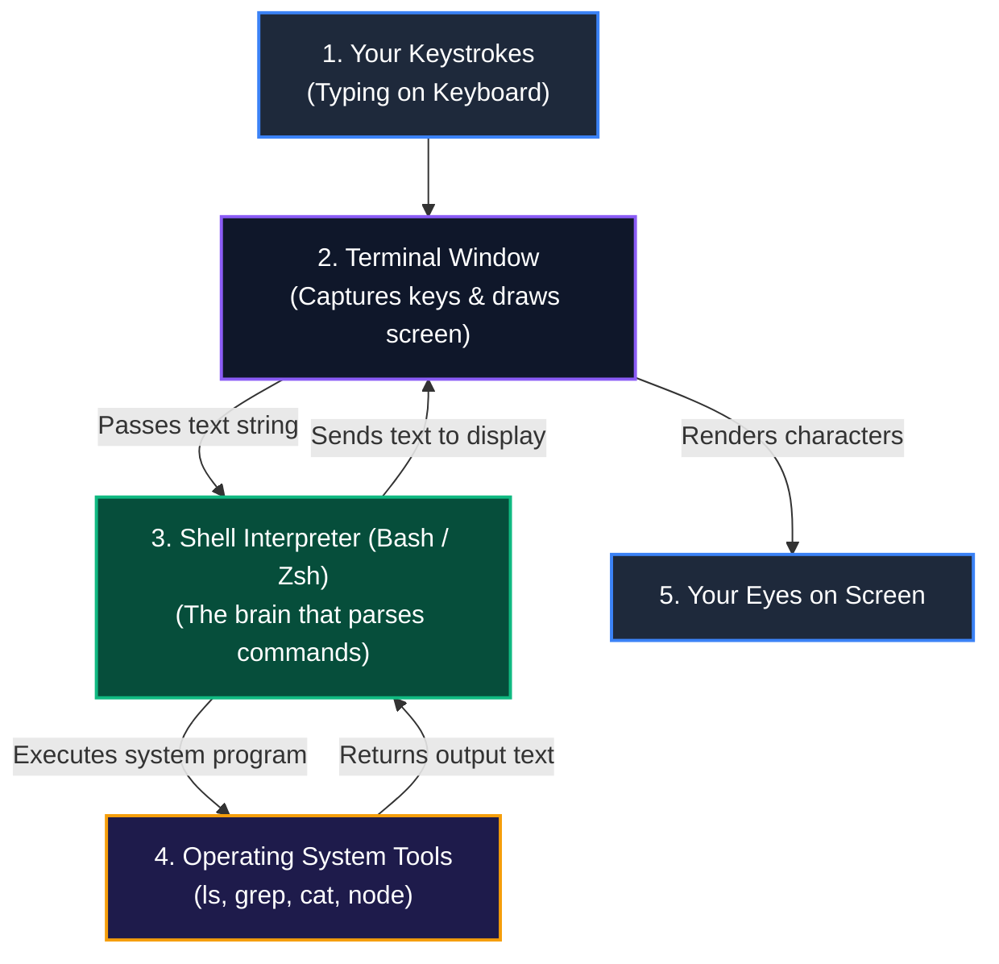
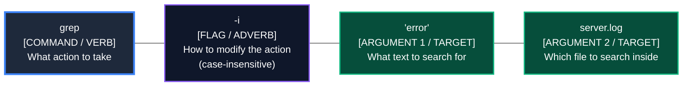
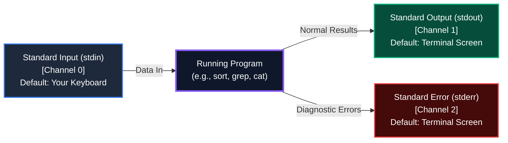

# LES-00-02: The Command-Line Interface (CLI) & Shell Streams

**Module:** MOD-00 Digital Foundations  
**Phase:** Phase 1 (Month 1, Week 1)  
**Target Competency:** `DEV-00` (Tooling & Development Environment)  
**Estimated Time:** 60–90 minutes  
**Prerequisites:** `LES-00-01` (Files, Folders & The POSIX Filesystem Mental Model)

---

## 1. Why This Matters: The Industrial Hook

### The Story of the Silent Backup Failure

In 2021, a high-growth fintech startup believed their customer database was safely backing up every night at midnight. 

The engineering team had set up a routine command to generate the database backup and save the confirmation message into a file called `backup.log`:

```bash
run_backup > backup.log
```

For six consecutive months, the team glanced at the `backup.log` file, saw that it was updated with a fresh timestamp every night, and assumed all customer transactions were completely safe.

Then, a cloud hardware failure occurred. The database crashed.

When the lead engineer opened the database backups to restore customer balances, the backup folder was completely empty. The system had lost six months of financial records.

What happened?

The backup tool had failed on Day 1 because of an expired security certificate. When the program encountered the error, it sent its warning message through **Standard Error (`stderr`)**, while the `>` symbol *only captured* **Standard Output (`stdout`)**. 

Because the error message was printed to a separate channel that nobody was recording, the failure remained completely invisible. The system was crying for help every single night on an unmonitored channel.

```
┌────────────────────────────────────────────────────────────────────────────────────────┐
│                              THE LESSON OF STREAM ISOLATION                            │
├────────────────────────────────────────────────────────────────────────────────────────┤
│ In graphical apps (like a web browser or word processor), errors, normal text, and     │
│ user buttons are tangled together on a single screen.                                  │
│                                                                                        │
│ In professional software engineering, every tool communicates through clean, separated │
│ streams of text: one stream for normal data, and one dedicated stream for errors.      │
│                                                                                        │
│ Learning how to route, connect, and split these streams is the secret superpower of     │
│ every backend developer, DevOps engineer, and AI builder.                              │
└────────────────────────────────────────────────────────────────────────────────────────┘
```

---

## 2. Learning Outcomes

By the end of this lesson, you will be able to:

1. **Distinguish the Terminal from the Shell**: Explain the physical difference between the graphical window you look at (the Terminal emulator) and the interpreter program running inside it (the Shell).
2. **Deconstruct Command Anatomy**: Break any command-line instruction down into its three grammatical parts: **Command** (the action), **Flags** (the options), and **Arguments** (the target files or data).
3. **Trace the Three Standard Streams**: Follow how **Standard Input (`stdin`)**, **Standard Output (`stdout`)**, and **Standard Error (`stderr`)** flow into and out of running programs.
4. **Direct Output with Redirection**: Save clean results to a file with overwrite (`>`), add records with append (`>>`), and isolate warning messages (`2>`) without corrupting clean data.
5. **Chain Tools with Pipes (`|`)**: Connect multiple single-purpose tools together in memory so the output of one command instantly feeds the input of the next.

---

## 3. Core Concepts

### 3.1 The Terminal vs. The Shell: Screen vs. Brain

When beginners open a black window with white text, they often call the whole thing "the terminal" or "the command line."

In reality, two completely different software components are working together:

1. **The Terminal Emulator (The Screen & Glass)**:  
   The Terminal is just an ordinary window application (such as Terminal on macOS, Windows Terminal, or iTerm2). Its only job is to capture the keys you type on your keyboard and draw letters and colors on your screen. The terminal does not understand what `ls` or `copy` means.
2. **The Shell (The Brain & Interpreter)**:  
   Inside the terminal window lives a separate, background program called the **Shell** (common shells are named **Bash** or **Zsh**). The Shell is the conversational partner that reads the words you type, interprets what you want to do, asks the operating system to run programs, and sends the text results back to the terminal screen.



---

### 3.2 The Command Prompt: The Ready Signal

When you open a terminal, you will see a short line of text ending with a dollar sign (`$`) or percent sign (`%`), followed by a blinking cursor:

```text
alex@laptop:~$ █
```

This line is called the **Prompt**.

Think of the prompt like a **telephone dial tone**. It tells you: *"The shell is awake, standing inside your home directory (`~`), and waiting for your next instruction."*

Whenever you type a command and hit `Enter`, the shell executes the command. While the program runs, the prompt disappears. When the program finishes, the prompt reappears, letting you know the shell is ready for the next task.

---

### 3.3 The Anatomy of a Command: Verbs, Adverbs, and Nouns

Every command you type into a shell follows a clean, predictable grammatical structure:

```text
command   -flags   arguments
(Verb)   (Adverbs)  (Nouns)
```



```
┌────────────────────────────────────────────────────────────────────────────────────────┐
│                              THE 3 PARTS OF EVERY CLI COMMAND                          │
├──────────────┬────────────────────────────┬────────────────────────────────────────────┤
│ Part         │ Role & Function            │ Real-World Example                         │
├──────────────┼────────────────────────────┼────────────────────────────────────────────┤
│ 1. Command   │ The name of the tool you   │ `ls` (List files)                          │
│    (Verb)    │ want to execute.           │ `cat` (Display file contents)              │
│              │                            │ `grep` (Search text patterns)              │
├──────────────┼────────────────────────────┼────────────────────────────────────────────┤
│ 2. Flags     │ Modifiers or switches that │ `-l` (Show detailed long format)           │
│   (Options)  │ adjust how the tool behaves│ `-a` (Show all files, including dotfiles)  │
│              │ (usually start with `-`).  │ `-la` (Combine both modifiers together)    │
├──────────────┼────────────────────────────┼────────────────────────────────────────────┤
│ 3. Arguments │ The targets, file paths,   │ `/var/log` (Which folder to list)          │
│    (Nouns)   │ or text strings the tool   │ `notes.txt` (Which file to open)           │
│              │ will operate upon.         │ `"error"` (What word to search for)        │
└──────────────┴────────────────────────────┴────────────────────────────────────────────┘
```

> [!NOTE]
> **Spaces are crucial separators:** The shell uses spaces to know where the command ends, where flags begin, and where arguments start. If you write `ls-la` without a space, the shell looks for a nonexistent program called `ls-la`. Always put a space between words: `ls -la`.

---

### 3.4 The Three Standard Streams: The I/O Plumbing Model

Whenever any program runs in a POSIX operating system (Linux, macOS, Unix), the computer automatically attaches **three standard channels of communication** to it.

These channels are called **Streams**. You can picture them as three physical pipes connected to a water pump:



```
┌────────────────────────────────────────────────────────────────────────────────────────┐
│                              THE 3 STANDARD STREAMS                                    │
├──────────┬────────────────────────────┬──────────────────┬─────────────────────────────┤
│ Channel  │ Stream Name                │ Default Source   │ Purpose                     │
├──────────┼────────────────────────────┼──────────────────┼─────────────────────────────┤
│ 0        │ Standard Input (`stdin`)   │ Your Keyboard    │ Text sent into the program. │
├──────────┼────────────────────────────┼──────────────────┼─────────────────────────────┤
│ 1        │ Standard Output (`stdout`) │ Terminal Screen  │ The successful result of    │
│          │                            │                  │ the program's work.         │
├──────────┼────────────────────────────┼──────────────────┼─────────────────────────────┤
│ 2        │ Standard Error (`stderr`)  │ Terminal Screen  │ Diagnostic notices, alarms, │
│          │                            │                  │ and error messages.         │
└──────────┴────────────────────────────┴──────────────────┴─────────────────────────────┘
```

By default, both Channel 1 (`stdout`) and Channel 2 (`stderr`) print directly onto your terminal screen. But because they are separate channels, you can redirect them independently!

---

### 3.5 Redirection Operators: Saving Streams to Disk

Instead of letting a program's output spill onto the terminal screen and vanish, you can use **Redirection Operators** to funnel the stream directly into a file on your hard drive.

```
┌────────────────────────────────────────────────────────────────────────────────────────┐
│                              STREAM REDIRECTION OPERATORS                              │
├──────────┬───────────────────────────┬─────────────────────────────────────────────────┤
│ Operator │ Name                      │ What It Does                                    │
├──────────┼───────────────────────────┼─────────────────────────────────────────────────┤
│ `>`      │ Overwrite Redirection     │ Takes Channel 1 (`stdout`), wipes the target    │
│          │                           │ file completely clean, and writes the new text. │
├──────────┼───────────────────────────┼─────────────────────────────────────────────────┤
│ `>>`     │ Append Redirection        │ Takes Channel 1 (`stdout`) and neatly attaches  │
│          │                           │ the new text to the bottom of the existing file.│
├──────────┼───────────────────────────┼─────────────────────────────────────────────────┤
│ `2>`     │ Error Redirection         │ Takes Channel 2 (`stderr`) specifically and     │
│          │                           │ saves errors to a file, keeping stdout clean.   │
└──────────┴───────────────────────────┴─────────────────────────────────────────────────┘
```

> [!WARNING]
> **The Danger of `>` (Single Arrow)**:  
> The single arrow `>` is an **overwrite** command. If `report.txt` already has 10,000 lines of important notes, running `echo "Hello" > report.txt` will **erase all 10,000 lines** and leave only "Hello".  
> If you want to add to an existing file without deleting its history, always use `>>` (double arrow).

---

### 3.6 The Pipe Operator (`|`): In-Memory Conveyor Belts

One of the greatest design triumphs of computer science is the **UNIX Philosophy**:

> *"Write programs that do one thing and do it well. Write programs to work together. Write programs to handle text streams, because that is a universal interface."*

Instead of building giant, complicated programs that try to do everything, the command line gives you dozens of simple, sharp tools. You combine them using the **Pipe Operator (`|`)**.

The vertical bar (`|`) connects the **Standard Output (`stdout`)** of the tool on the left directly into the **Standard Input (`stdin`)** of the tool on the right—completely inside computer memory, without saving any slow temporary files to your disk.


---

## 4. Step-by-Step Worked Examples

### Worked Example 1: Deconstructing Real Commands

Let's look at two common commands you will use daily and break down their grammar.

#### Scenario A: Detailed Directory Listing
```bash
ls -la /var/log
```
- **Command (`ls`)**: "List directory contents."
- **Flags (`-la`)**:
  - `-l`: Format as a detailed list (shows permissions, owner, size, and date).
  - `-a`: Show *all* files (including hidden dotfiles).
- **Argument (`/var/log`)**: The absolute path of the target folder to inspect.

#### Scenario B: Finding High-Priority Errors
```bash
grep -i "critical" ./application.log
```
- **Command (`grep`)**: "Search for lines of text matching a pattern."
- **Flags (`-i`)**: Ignore uppercase vs lowercase (finds "CRITICAL", "Critical", or "critical").
- **Argument 1 (`"critical"`)**: The search pattern to look for.
- **Argument 2 (`./application.log`)**: The relative path to the file to search through.

---

### Worked Example 2: Stream Redirection and Error Isolation

Imagine you are running a diagnostic tool called `check_system` that checks your server's health.

#### Step 1: Default Behavior (Everything on Screen)
```bash
check_system
```
**Terminal Screen Shows:**
```text
[OK] Memory usage is normal (stdout)
[OK] Disk space is 45% (stdout)
[ERROR] Database connection failed on port 5432! (stderr)
[OK] Network latency 12ms (stdout)
```
*Notice:* Both normal status lines and error alarms are mixed together on your screen.

#### Step 2: Capturing Clean Output with `>`
```bash
check_system > health_report.txt
```
**Terminal Screen Shows:**
```text
[ERROR] Database connection failed on port 5432!
```
**File `health_report.txt` Contains:**
```text
[OK] Memory usage is normal
[OK] Disk space is 45%
[OK] Network latency 12ms
```
*Why did the error still print on the screen?*  
Because `>` only redirects Channel 1 (`stdout`). The error is on Channel 2 (`stderr`), so it remained on your screen.

#### Step 3: Isolating Output and Errors into Two Separate Files
```bash
check_system > health_report.txt 2> error_audit.txt
```
**Terminal Screen Shows:**
```text
(Completely quiet - nothing printed on screen)
```
- `health_report.txt` contains only the three clean `[OK]` status lines.
- `error_audit.txt` contains only the `[ERROR]` diagnostic line.

---

### Worked Example 3: Building a 3-Stage Data Pipeline

Imagine you manage a busy web server. A log file named `web_traffic.log` has 100,000 entries. You need to know: **"How many requests came from mobile devices?"**

Let's build a pipeline step by step:

#### Step 1: Read the Source File
```bash
cat web_traffic.log
```
*Result:* 100,000 lines scroll past your eyes in a blur.

#### Step 2: Filter for Mobile Requests Using a Pipe (`|`)
```bash
cat web_traffic.log | grep "Mobile"
```
*Result:* The pipe takes all 100,000 lines and feeds them into `grep`. `grep` filters out everything else and emits only the lines containing the word "Mobile".

#### Step 3: Count the Filtered Lines Using `wc -l`
```bash
cat web_traffic.log | grep "Mobile" | wc -l
```
*Result:* `wc -l` (word count - lines) counts the incoming lines from the stream and prints a single number:
```text
1420
```

#### Step 4: Save the Final Answer to a Summary File
```bash
cat web_traffic.log | grep "Mobile" | wc -l > mobile_count.txt
```
*Result:* The number `1420` is cleanly saved into `mobile_count.txt`. The entire 100,000-line processing task completed in less than one-tenth of a second without writing any temporary files to disk.

---

## 5. Common Beginner Traps & Misconceptions

```
┌────────────────────────────────────────────────────────────────────────────────────────┐
│                              COMMON BEGINNER TRAPS & FIXES                             │
├─────────────────────────┬───────────────────────────────┬──────────────────────────────┤
│ Beginner Trap           │ Why It Happens                │ The Professional Fix         │
├─────────────────────────┼───────────────────────────────┼──────────────────────────────┤
│ Accidental File Wipe    │ Using `>` instead of `>>`     │ When appending log lines or  │
│                         │ when writing to an existing   │ notes, always double-check   │
│                         │ file.                         │ for double arrows (`>>`).    │
├─────────────────────────┼───────────────────────────────┼──────────────────────────────┤
│ The "Broken Command"    │ Forgetting to put a space     │ Treat spaces as essential    │
│ Panic                   │ between the command and flags │ word boundaries (`ls -l`,    │
│                         │ (e.g., `ls-l` or `catnotes`). │ not `ls-l`).                 │
├─────────────────────────┼───────────────────────────────┼──────────────────────────────┤
│ Error Leaks on Screen   │ Assuming `>` captures every-  │ Remember `>` only redirects  │
│                         │ thing; errors still show up.  │ stdout (1). Use `2>` if you  │
│                         │                               │ need to capture errors (2).  │
├─────────────────────────┼───────────────────────────────┼──────────────────────────────┤
│ Memorization Anxiety    │ Feeling overwhelmed by the    │ Real engineers do not        │
│                         │ hundreds of possible flags.   │ memorize flags. They run     │
│                         │                               │ `--help` or `man command`.   │
└─────────────────────────┴───────────────────────────────┴──────────────────────────────┘
```

---

## 6. Guided Practice & Mental Drills

### Drill 1: The Command Anatomy Dissector

Look at the following four commands. Identify the **[Command]**, the **[Flags]**, and the **[Arguments]** for each:

1. `mkdir -p ./projects/web-app/src`
2. `head -n 25 /var/log/syslog`
3. `rm -r ./temporary_folder`
4. `wc -l customers.csv`

<details>
<summary>👉 Click to Reveal the Answer Breakdown</summary>

1. **`mkdir -p ./projects/web-app/src`**:
   - **Command:** `mkdir` (Make Directory)
   - **Flag:** `-p` (Create parent folders if they don't exist yet)
   - **Argument:** `./projects/web-app/src` (The relative path to create)
2. **`head -n 25 /var/log/syslog`**:
   - **Command:** `head` (View the top lines of a file)
   - **Flag:** `-n 25` (Option to show exactly 25 lines)
   - **Argument:** `/var/log/syslog` (The absolute path to the target file)
3. **`rm -r ./temporary_folder`**:
   - **Command:** `rm` (Remove/delete)
   - **Flag:** `-r` (Recursive - deletes the folder and everything inside it)
   - **Argument:** `./temporary_folder` (The target folder to delete)
4. **`wc -l customers.csv`**:
   - **Command:** `wc` (Word count)
   - **Flag:** `-l` (Count lines instead of words)
   - **Argument:** `customers.csv` (The target file to count)
</details>

---

### Drill 2: Predicting Stream Destinations

For each command below, predict where the **normal output** and any **error messages** will go:

1. `grep "Alice" staff.txt > results.txt`
2. `compile_code 2> build_errors.log`
3. `echo "New Entry" >> daily_journal.txt`
4. `find_files /root > file_list.txt 2> permission_denied.log`

<details>
<summary>👉 Click to Reveal the Stream Analysis</summary>

1. **`grep "Alice" staff.txt > results.txt`**:
   - *Normal Output (stdout):* Overwrites `results.txt`.
   - *Errors (stderr):* Prints on the terminal screen.
2. **`compile_code 2> build_errors.log`**:
   - *Normal Output (stdout):* Prints on the terminal screen.
   - *Errors (stderr):* Saved into `build_errors.log`.
3. **`echo "New Entry" >> daily_journal.txt`**:
   - *Normal Output (stdout):* Appended to the end of `daily_journal.txt` without erasing prior entries.
   - *Errors (stderr):* Prints on the terminal screen.
4. **`find_files /root > file_list.txt 2> permission_denied.log`**:
   - *Normal Output (stdout):* Overwrites `file_list.txt`.
   - *Errors (stderr):* Overwrites `permission_denied.log`.
   - *Terminal Screen:* Completely quiet.
</details>

---

## 7. Cognitive Self-Reflection

Take 60 seconds to reflect on these two questions before moving to the Knowledge Check:

1. **The Water Pipe Mental Model**: *Why is connecting tools with pipes (`|`) much safer and faster than saving intermediate results into temporary files on your hard drive?*  
   *(Hint: Think about disk space, file clutter, and memory speed).*
2. **Stream Separation in Cloud Services**: *If an automated server script runs in the cloud with no human looking at the screen, what happens to error messages if you only redirect `>` and ignore `2>`?*

---

## 8. Knowledge Check

### Question 1
What is the core functional difference between the Terminal and the Shell?
- **A)** The Terminal is for Linux, while the Shell is for Windows.
- **B)** The Terminal is the graphical window that displays characters; the Shell is the program that interprets commands and executes them.
- **C)** The Terminal is used for writing code; the Shell is used for compiling code.
- **D)** There is no difference; they are two names for the exact same program.

<details>
<summary>👉 Click for Answer & Explanation</summary>

**Correct Answer:** **B**  
**Explanation:** The Terminal emulator is the presentation layer (displaying text on screen and capturing keyboard input). The Shell (like Bash or Zsh) is the command language interpreter running inside that window.
</details>

---

### Question 2
You have a file called `servers.log` containing 50 lines of notes. You run the following command:
```bash
echo "Server restart initiated" > servers.log
```
What will `servers.log` contain after this command runs?
- **A)** 51 lines: the original 50 lines plus the new line at the bottom.
- **B)** 51 lines: the new line at the top plus the original 50 lines.
- **C)** Exactly 1 line: `"Server restart initiated"`, because `>` overwrites the entire file.
- **D)** An error message stating that the file already exists.

<details>
<summary>👉 Click for Answer & Explanation</summary>

**Correct Answer:** **C**  
**Explanation:** The single redirection operator `>` overwrites existing file contents. To add a line to the end of an existing file without deleting it, you must use the append operator `>>`.
</details>

---

### Question 3
Which stream channel number is assigned to Standard Error (`stderr`) in POSIX operating systems?
- **A)** Channel 0
- **B)** Channel 1
- **C)** Channel 2
- **D)** Channel 3

<details>
<summary>👉 Click for Answer & Explanation</summary>

**Correct Answer:** **C**  
**Explanation:** Channel 0 is Standard Input (`stdin`), Channel 1 is Standard Output (`stdout`), and Channel 2 is Standard Error (`stderr`).
</details>

---

### Question 4
What does the Pipe operator (`|`) do when placed between two commands, like `tool_a | tool_b`?
- **A)** It runs `tool_a`, waits for it to save a file, then opens `tool_b`.
- **B)** It connects the Standard Output (`stdout`) of `tool_a` directly into the Standard Input (`stdin`) of `tool_b` in memory.
- **C)** It compares the speed of both tools and runs the faster one.
- **D)** It combines the error messages of both tools.

<details>
<summary>👉 Click for Answer & Explanation</summary>

**Correct Answer:** **B**  
**Explanation:** The pipe operator creates an in-memory stream conduit that streams data directly from the upstream process's `stdout` into the downstream process's `stdin`.
</details>

---

## 9. Next Step & Coding Lab Bridge

```
┌────────────────────────────────────────────────────────────────────────────────────────┐
│                                   CORE TAKEAWAYS                                       │
├────────────────────────────────────────────────────────────────────────────────────────┤
│ 1. Terminal = Presentation screen. Shell = Command interpreter brain.                  │
│ 2. Command Anatomy = `command` (Verb) + `-flags` (Options) + `arguments` (Targets).   │
│ 3. Three Standard Streams: `stdin` (0), `stdout` (1), and `stderr` (2).               │
│ 4. `>` wipes and overwrites; `>>` appends to the end; `2>` isolates error diagnostics.│
│ 5. Pipes (`|`) stream data between tools in memory without slow disk files.            │
└────────────────────────────────────────────────────────────────────────────────────────┘
```

You now possess the foundational grammar and dataflow plumbing model of the command line.

You are ready for your next hands-on lab:

👉 Proceed to **`EXE-00-02: Shell Stream Processing & Log Grepping Pipeline`**, where you will enter the terminal sandbox to filter production server logs, count error frequencies, and build your first multi-stage stream pipelines!
