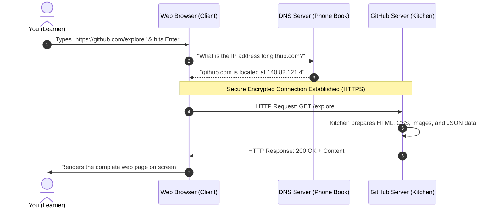
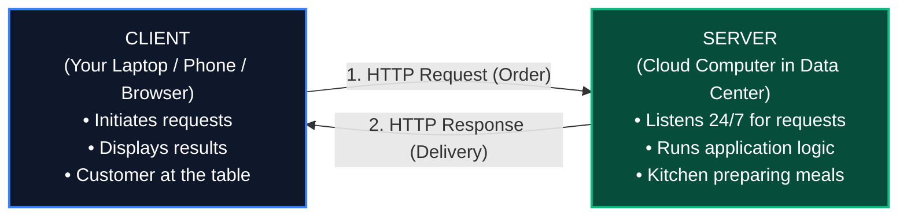
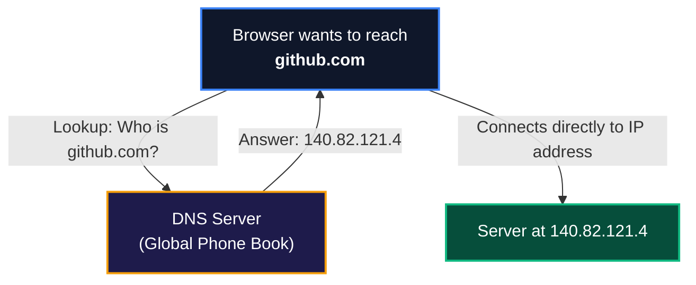
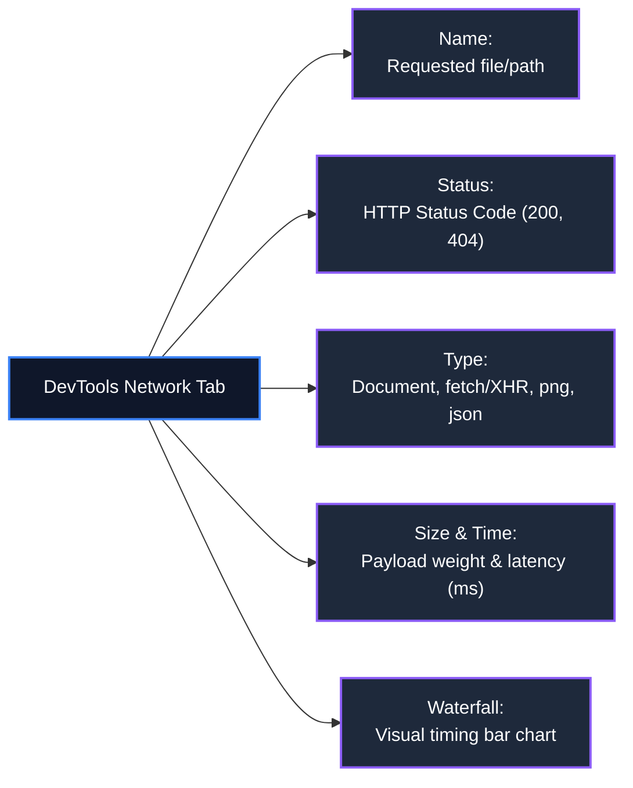

# LES-00-03: How the Web Works: HTTP, Networks & Browser DevTools

**Module:** MOD-00 Digital Foundations  
**Phase:** Phase 1 (Month 1, Week 1)  
**Target Competency:** `DEV-00` (Developer Environment & Tooling Fluency)  
**State Progression:** `Practicing` &rarr; `Reinforced`  
**Estimated Time:** 60–90 minutes  
**Prerequisites:** `LES-00-01` (Files, Folders & The POSIX Filesystem Mental Model), `LES-00-02` (The Command-Line Interface & Shell Streams)

---

### Prerequisites
- ✅ **Completed LES-00-01**: Files, Folders & The POSIX Filesystem Mental Model
- ✅ **Completed LES-00-02**: The Command-Line Interface (CLI) & Shell Streams
- ✅ **No prior web or API experience required**: Zero HTML, CSS, or JavaScript required

---

## 1. Why This Matters: The Invisible Machinery of the Internet

### Why Should You Care?
Every modern software engineer—whether building web applications, mobile apps, backend cloud systems, or AI agents—works on top of the web. 

When you use ChatGPT, push code to GitHub, stream video, or check a banking balance, your computer is not doing that work in isolation. It is holding a high-speed, structured conversation with servers thousands of miles away across oceans and continents.

```
┌────────────────────────────────────────────────────────────────────────────────────────┐
│                              THE INVISIBLE CONVERSATION                                │
├────────────────────────────────────────────────────────────────────────────────────────┤
│ To non-technical users, a website feels like a magical picture on a screen.            │
│                                                                                        │
│ To a software engineer, a website is a constant stream of lightweight, structured text │
│ messages flying back and forth between a client and a server across the globe.        │
│                                                                                        │
│ Once you can see, inspect, and understand these messages, the web stops being a black  │
│ box. You gain the power to debug broken apps, diagnose API failures, and understand   │
│ how modern cloud software really works.                                                │
└────────────────────────────────────────────────────────────────────────────────────────┘
```

When an application breaks in the real world:
- A button spins forever because a server returned a `504 Gateway Timeout`.
- A login screen rejects your credentials because an API returned `401 Unauthorized`.
- A page displays a broken image because the link pointed to a `404 Not Found` address.

Without understanding how web communication works, you are debugging in the dark. With this knowledge, you can open your browser's inspection tools, spot the exact failing message in five seconds, and know exactly what broke.

---

## 2. Lesson Introduction

In our first two lessons, you learned how files live on a computer's disk (`LES-00-01`) and how programs communicate through text streams on a single machine (`LES-00-02`).

Now, we take the next fundamental leap: **How do two separate computers talk to each other across the globe?**

In this lesson, you will learn the universal language of the internet: **HTTP** (HyperText Transfer Protocol). You will discover how a domain name turns into an IP address, how web browsers ask for data, how servers answer, and how to use the built-in **Developer Tools** inside your browser to see the live network traffic powering every website you visit.

---

## 3. What You Will Learn

By the end of this lesson, you will be able to:

1. **Trace the Story of a Web Request**: Explain step-by-step what happens under the hood from the moment you press Enter on a URL until pixels appear on your screen.
2. **Differentiate Clients and Servers**: Clearly explain the distinct roles of the computer asking for information (the client) and the computer serving it (the server).
3. **Decode URLs & Domains**: Break any web address into its protocol, domain, port, path, and query parameters.
4. **Understand DNS & IP Addresses**: Explain how Domain Name System (DNS) acts as the internet's global phone book to translate human-friendly names into numerical IP addresses.
5. **Read HTTP Requests & Responses**: Identify request methods (`GET`, `POST`), response status codes (`200`, `404`, `500`), and metadata headers.
6. **Recognize JSON Data**: Identify and read the universal, lightweight text format used by modern APIs to exchange structured data.
7. **Understand HTTPS & Security**: Explain the difference between unencrypted HTTP and encrypted HTTPS communication.
8. **Inspect Live Network Traffic in DevTools**: Open browser Developer Tools, use the Network Tab, filter requests, and inspect real headers and response payloads without writing code.

---

## 4. The Story of Visiting a Website

Imagine sitting at your laptop, opening a browser, typing `https://github.com/explore`, and pressing **Enter**. Within a third of a second, a rich page appears. 

What actually happened in those 300 milliseconds?



Behind the scenes, four major steps occurred:
1. **Name Lookup (DNS)**: Your browser asked a global directory service to translate the human name `github.com` into a machine address (`140.82.121.4`).
2. **Connection Establishment (TCP/TLS)**: Your browser established a secure, encrypted digital phone call with that specific computer.
3. **The Request (HTTP Request)**: Your browser sent a polite text message asking: *"Please send me the contents of `/explore`."*
4. **The Response (HTTP Response)**: GitHub's server processed your request, packaged the requested data, and sent back an answer saying: *"Here is your data (`200 OK`)."*

Let's dissect each of these building blocks step by step.

---

## 5. What Is the Web?

To understand web development, we must first dispel a common confusion: **The Internet and the World Wide Web are not the same thing.**

- **The Internet** is the physical and digital infrastructure: millions of computers, fiber-optic cables under the oceans, satellite links, and wireless routers connected together like a global highway system.
- **The Web (World Wide Web)** is a specific service that runs *on top of* the internet highway. It is a vast collection of linked documents, images, videos, and data that computers share using standard protocols (primarily HTTP).

Think of the **Internet** as the global network of roads and tracks, and the **Web** as the delivery trucks driving on those roads carrying packages of text and images.

---

## 6. Clients & Servers: The Universal Architecture

All communication on the web follows a simple, two-party conversation model called **Client–Server Architecture**.



### The Restaurant Analogy
To remember client–server communication, think of dining at a restaurant:
- **The Client is the Customer**: You sit at the table. You want food, but you don't have the ingredients or the stoves. You place an order.
- **The Server is the Kitchen**: The kitchen sits waiting 24/7. When an order arrives, chefs process the recipe, assemble the dish, and deliver the meal back to your table.
- **The Protocol (HTTP) is the Menu & Waiter**: The standardized format both parties agree upon so the customer and the kitchen understand each other without confusion.

### Who Is the Client?
The client is any device or program that initiates a request for data:
- Your desktop browser (Google Chrome, Firefox, Safari, Edge).
- A mobile application on your smartphone (Spotify, Instagram).
- A command-line program (`curl`, `git`).
- An AI coding assistant requesting documentation.

### Who Is the Server?
A server is simply a computer connected to the internet running specialized software that listens continuously for incoming client requests, processes them, and returns answers. Servers usually operate in temperature-controlled data centers without screens or keyboards.

---

## 7. Domains, DNS & IP Addresses: The Internet's Phone Book

Computers do not natively understand English words like `google.com` or `github.com`. Computers route network traffic using numbers called **IP Addresses** (Internet Protocol Addresses).

An IP address looks like:
- **IPv4**: `142.250.190.46` (four numbers separated by dots)
- **IPv6**: `2607:f8b0:4005:805::200e` (longer hexadecimal addresses)

Imagine having to memorize `140.82.121.4` every time you wanted to visit GitHub, and `157.240.22.35` every time you wanted to visit Instagram. Humans are terrible at memorizing random strings of digits, but great at remembering names.

To solve this, the internet uses the **Domain Name System (DNS)**.



### The Phone Book Analogy
- When you want to call your friend **Sarah**, you don't dial the letters S-A-R-A-H on your phone keypad.
- You look up "Sarah" in your phone contacts. Your phone translates "Sarah" into her phone number (`+1-555-0199`) and dials the number.
- **DNS is the world's contacts list.** It maps human-friendly **Domain Names** (`github.com`) to machine-routable **IP Addresses** (`140.82.121.4`).

---

## 8. URLs Explained: The Web's Coordinate System

A **URL** (Uniform Resource Locator) is the complete address used to find a specific resource on the web. Just like a postal address specifies a Country, City, Street, and Apartment Number, a URL tells your browser exactly where to go and what to ask for.

Let's dissect a complete URL:

```
https://api.github.com:443/repos/octocat/Hello-World/issues?state=open&sort=created#comments
└──┬──┘  └──────┬──────┘ └─┬─┘ └──────────────┬──────────────┘ └───────────┬───────────┘ └───┬────┘
Scheme       Domain      Port               Path                     Query String         Fragment
```

### The 6 Parts of a URL:

| Component | Example in URL Above | Purpose & Explanation | Real-World Analogy |
| :--- | :--- | :--- | :--- |
| **1. Scheme / Protocol** | `https://` | The communication rulebook being used (`http` or secure `https`). | The language of the conversation (e.g. English). |
| **2. Domain / Host** | `api.github.com` | The human-friendly name of the server computer hosting the resource. | The building name (e.g. "GitHub HQ"). |
| **3. Port** | `:443` | The specific numbered doorway on the server handling this traffic (default for HTTPS is 443; for HTTP is 80). | The specific room or suite number. |
| **4. Path** | `/repos/octocat/Hello-World/issues` | The exact hierarchical file or resource location on the server (just like POSIX paths from `LES-00-01`!). | The folder path inside the building's filing cabinet. |
| **5. Query Parameters** | `?state=open&sort=created` | Key-value filter settings starting with `?` and joined with `&` to narrow down results. | Filter instructions (e.g. "only show open boxes"). |
| **6. Fragment / Anchor** | `#comments` | Starts with `#`; tells the browser to jump directly to a specific section on the page. | A bookmark inside a chapter. |

---

## 9. HTTP Requests: Asking for Data

When your browser wants something from a server, it sends an **HTTP Request**. 

An HTTP request is not binary magic—it is simply a plain-text message structured into three parts:
1. **The Request Line**: The action (Method) and target (Path).
2. **Headers**: Key-value metadata about the client.
3. **Body (Optional)**: Data sent to the server (e.g., when submitting a form or JSON payload).

```mermaid
graph TD
    classDef req fill:#0f172a,stroke:#3b82f6,stroke-width:2px,color:#fff;
    classDef parts fill:#1e293b,stroke:#8b5cf6,stroke-width:2px,color:#fff;

    R["HTTP REQUEST"]:::req --> M["1. METHOD & PATH<br/>GET /api/v1/users/alex HTTP/1.1"]:::parts
    R --> H["2. HEADERS (Metadata)<br/>Host: example.com<br/>User-Agent: Chrome/120.0<br/>Accept: application/json"]:::parts
    R --> B["3. BODY (Optional Payload)<br/>{\"theme\": \"dark\"}"]:::parts
```

### The Common HTTP Methods (Verbs)
HTTP defines specific action verbs that state what the client wants to do:

- **`GET`**: *"Please fetch and give me this data."* (Used when loading web pages, searching, or viewing profiles. `GET` requests never modify server data).
- **`POST`**: *"Please accept this new data and create a new record."* (Used when creating an account, posting a tweet, or submitting a payment).
- **`PUT` / `PATCH`**: *"Please update an existing record with new information."* (Used when editing your profile or updating your bio).
- **`DELETE`**: *"Please remove this record permanently."* (Used when deleting a repository or message).

### Example of a Real Raw HTTP GET Request:
```http
GET /explore HTTP/1.1
Host: github.com
User-Agent: Mozilla/5.0 (Macintosh; Intel Mac OS X 10_15_7)
Accept: text/html,application/xhtml+xml
Accept-Language: en-US,en;q=0.9
```

---

## 10. HTTP Responses: The Server's Answer

Once the server processes the client's request, it sends back an **HTTP Response**.

Just like the request, an HTTP response is a structured plain-text message containing:
1. **Status Line**: The protocol version and **Status Code** indicating success or failure.
2. **Headers**: Metadata about the response (content type, caching rules, date).
3. **Body**: The actual requested payload (HTML code, image binary, or JSON data).

```mermaid
graph TD
    classDef res fill:#064e3b,stroke:#10b981,stroke-width:2px,color:#fff;
    classDef parts fill:#1e293b,stroke:#14b8a6,stroke-width:2px,color:#fff;

    R["HTTP RESPONSE"]:::res --> S["1. STATUS LINE<br/>HTTP/1.1 200 OK"]:::parts
    R --> H["2. HEADERS (Metadata)<br/>Content-Type: application/json<br/>Content-Length: 142<br/>Date: Wed, 30 Sep 2026 14:00:00 GMT"]:::parts
    R --> B["3. BODY (Payload)<br/>{\"status\": \"active\", \"score\": 100}"]:::parts
```

### Example of a Real Raw HTTP Response:
```http
HTTP/1.1 200 OK
Date: Wed, 30 Sep 2026 14:00:00 GMT
Content-Type: application/json; charset=utf-8
Content-Length: 48

{"message": "Hello World", "authenticated": true}
```

---

## 11. Status Codes: The Universal Traffic Lights of the Web

Every HTTP response begins with a 3-digit **Status Code**. These codes tell the client immediately whether the request succeeded, failed, or requires further action.

Status codes are grouped into five distinct families based on their first digit:

```
┌────────────────────────────────────────────────────────────────────────────────────────┐
│                              HTTP STATUS CODE FAMILIES                                 │
├───────┬──────────────────────┬─────────────────────────────────────────────────────────┤
│ Range │ Category             │ Meaning in Plain English                                │
├───────┼──────────────────────┼─────────────────────────────────────────────────────────┤
│ 1xx   │ Informational        │ "Hold on, I am processing your request."                │
│ 2xx   │ Success              │ "Everything worked! Here is what you asked for."        │
│ 3xx   │ Redirection          │ "The resource has moved to a different address."        │
│ 4xx   │ Client Error         │ "You (the client) made a mistake in your request."      │
│ 5xx   │ Server Error         │ "We (the server) crashed or failed to process this."   │
└───────┴──────────────────────┴─────────────────────────────────────────────────────────┘
```

### The 8 Status Codes Every Software Engineer Must Know:

| Code | Name | Meaning | Common Scenario |
| :--- | :--- | :--- | :--- |
| **`200 OK`** | Standard Success | The request succeeded and data is returned in the response body. | You loaded a homepage successfully. |
| **`201 Created`** | Resource Created | A new record was successfully created on the server. | You submitted a signup form and created an account. |
| **`301 Moved Permanently`** | Permanent Redirect | The URL has changed permanently; go to the new address. | Visiting `http://github.com` redirects to `https://github.com`. |
| **`400 Bad Request`** | Invalid Request | The client sent malformed data that the server cannot parse. | Missing a required field in a signup form. |
| **`401 Unauthorized`** | Authentication Required | You must be logged in with valid credentials to view this. | Attempting to view a private repository while logged out. |
| **`403 Forbidden`** | Permission Denied | The server knows who you are, but you do not have permission. | A standard user attempting to access an admin dashboard. |
| **`404 Not Found`** | Missing Resource | The server could not locate any file or record at that URL path. | Mistyping a URL path (`/profle` instead of `/profile`). |
| **`500 Internal Server Error`** | Server Crash | An unhandled exception or bug crashed the server program. | A server database query failed or crashed. |
| **`502 Bad Gateway`** / **`504 Gateway Timeout`** | Upstream Server Failure | An intermediary proxy server could not get a response in time. | A cloud server is overloaded or completely down. |

---

## 12. Headers: The Metadata Envelope

**HTTP Headers** are key-value pairs attached to requests and responses. They act like the stamps, postmarks, and shipping labels on a physical postal envelope.

Headers describe *how* to handle the data, without being the data itself.

```
┌────────────────────────────────────────────────────────────────────────────────────────┐
│                               COMMON HTTP HEADERS                                      │
├───────────────────────┬──────────────────────────────────┬─────────────────────────────┤
│ Header Name           │ Example Value                    │ What It Tells the Recipient │
├───────────────────────┼──────────────────────────────────┼─────────────────────────────┤
│ `Content-Type`        │ `application/json`               │ "The body format is JSON."  │
│ `Content-Type`        │ `text/html; charset=UTF-8`       │ "The body is an HTML page." │
│ `User-Agent`          │ `Mozilla/5.0 Chrome/120.0`       │ "I am Google Chrome."       │
│ `Authorization`       │ `Bearer eyJhbGciOi...`           │ "Here is my security token."│
│ `Accept`              │ `application/json`               │ "I prefer JSON responses."  │
│ `Cache-Control`       │ `max-age=3600`                   │ "Save this copy for 1 hour."│
└───────────────────────┴──────────────────────────────────┴─────────────────────────────┘
```

---

## 13. JSON Data: The Universal Language of Web APIs

When websites display pages to humans, they send **HTML** and **CSS** (markup for formatting visual boxes and text).

When modern applications and servers talk to other programs, mobile apps, or frontend dashboards, they don't want visual layout—they want pure structured data. The universal format for exchanging data on the web is **JSON** (JavaScript Object Notation).

Despite having "JavaScript" in its name, JSON is simply **plain text** structured with curly braces (`{}`) and square brackets (`[]`). Every programming language on earth can read and write JSON.

### A Real JSON Payload Example:
```json
{
  "user_id": "usr_48291",
  "username": "alex_engineer",
  "is_active": true,
  "reputation_score": 95,
  "enrolled_courses": [
    "MOD-00 Digital Foundations",
    "MOD-01 Software Architecture"
  ],
  "profile": {
    "role": "Learner",
    "country": "Germany"
  }
}
```

### The 6 Data Types Allowed in JSON:
1. **String**: Text wrapped in double quotes (`"alex"`).
2. **Number**: Integers or decimals (`95`, `3.14`).
3. **Boolean**: Exactly `true` or `false` (no quotes).
4. **Array**: An ordered list enclosed in brackets (`["apple", "banana"]`).
5. **Object**: A collection of key-value pairs enclosed in braces (`{"key": "value"}`).
6. **Null**: Represents empty or non-existent value (`null`).

---

## 14. HTTPS & Encryption: Protecting the Wire

When the web was first created in the 1990s, all traffic used **HTTP**.

In plain HTTP, all messages travel across the internet as unencrypted cleartext. Anyone sitting between your computer and the server (like an untrusted public Wi-Fi network at a café or an internet service provider) can inspect, read, and tamper with your passwords, cookies, and credit card numbers.

```mermaid
graph TD
    classDef plain fill:#7f1d1d,stroke:#ef4444,stroke-width:2px,color:#fff;
    classDef crypt fill:#064e3b,stroke:#10b981,stroke-width:2px,color:#fff;

    subgraph Plain HTTP (Insecure)
        C1["Browser"] -->|"GET /login Password=secret123 (Cleartext!)"| S1["Server"]
    end
    
    subgraph Secure HTTPS (TLS Encrypted)
        C2["Browser"] -->|"🔒 Encrypted Ciphertext: %9A#f8!k2... (Unreadable!)"| S2["Server"]
    end
```

**HTTPS** (HyperText Transfer Protocol Secure) wraps standard HTTP inside an encryption layer called **TLS** (Transport Layer Security).

When you see the padlock icon 🔒 in your browser address bar:
1. **Confidentiality (Encryption)**: No eavesdropper between you and the server can read the data.
2. **Integrity**: No one can alter or inject malicious code into the response in transit.
3. **Authentication**: Digital certificates guarantee you are talking to the genuine server (e.g. `github.com`) and not an impostor.

---

## 15. Browser Developer Tools (DevTools)

Every modern web browser comes equipped with a built-in professional inspection suite called **Developer Tools** (DevTools).

You do not need to install extra software to inspect the web; the tools used by senior engineers at Google, Meta, and Netflix are already built directly into Chrome, Edge, Firefox, and Safari.

### How to Open DevTools on Any Web Page:
- **Shortcut (Windows/Linux)**: Press `F12` or `Ctrl + Shift + I`
- **Shortcut (macOS)**: Press `Cmd + Option + I`
- **Mouse**: Right-click anywhere on any web page and select **"Inspect"**

```
┌────────────────────────────────────────────────────────────────────────────────────────┐
│                              THE DEVTOOLS TAB ECOSYSTEM                                │
├─────────────┬──────────────────────────────────────────────────────────────────────────┤
│ Tab Name    │ What It Inspects & Controls                                              │
├─────────────┼──────────────────────────────────────────────────────────────────────────┤
│ Elements    │ Inspects the visual HTML structure and CSS styling rules.                │
│ Console     │ Logs diagnostic messages, system notices, and runtime errors.           │
│ Sources     │ Displays loaded source code files and debugging breakpoints.             │
│ Network     │ Records every live HTTP request and response transmitted over the wire.  │
│ Application │ Inspects local browser storage, cookies, and cached data.                │
└─────────────┴──────────────────────────────────────────────────────────────────────────┘
```

---

## 16. The Network Tab: Your Window into the Wire

The **Network Tab** inside DevTools is the most critical tool for understanding web communication. It records every single HTTP request your browser makes in real-time.



### What You See in the Network Log:
When you open the Network Tab and refresh a page, you will see a waterfall list where each row represents one distinct HTTP request:
1. **Name**: The file or API endpoint requested (e.g. `explore`, `logo.svg`, `user.json`).
2. **Status**: The HTTP response code returned by the server (e.g., `200`, `304`, `404`).
3. **Type**: The format of the returned resource (`document`, `stylesheet`, `script`, `png`, `fetch`).
4. **Size**: The number of bytes transferred over the network.
5. **Time**: How many milliseconds the request took from start to finish.
6. **Waterfall**: A horizontal bar chart illustrating when each connection started, waited, and completed.

---

## 17. Step-by-Step Request Investigation

Let's walk through an interactive, zero-code investigation you can perform right now on any computer:

### Step 1: Open the Network Tab
Open your browser, navigate to any website (e.g. `https://news.ycombinator.com` or `https://github.com`), and press `F12` (or `Cmd + Option + I` on Mac). Click on the **Network** tab at the top of the DevTools pane.

### Step 2: Reload the Page
With the Network tab open, press `Ctrl + R` (or `Cmd + R`) to refresh the page. Watch as the empty table immediately fills with dozens of network requests.

### Step 3: Filter for Data (Fetch/XHR)
At the top of the Network tab, click the **Fetch/XHR** filter button. This hides images and styling files, leaving only raw data and API requests.

### Step 4: Inspect Request Details
Click on any single request row in the list. A detail drawer will open on the right side with several tabs:
- **Headers Tab**: Look at the **General** section to see the Request URL, Request Method (`GET`/`POST`), and Status Code (`200 OK`). Scroll down to view Request Headers and Response Headers.
- **Payload Tab**: If the request was a `POST` or `PUT`, view the exact parameters or JSON sent to the server.
- **Preview / Response Tab**: Click **Preview** or **Response** to see the raw text or JSON data the server returned!

```
┌────────────────────────────────────────────────────────────────────────────────────────┐
│                              INSPECTING A REQUEST IN DEVTOOLS                          │
├────────────────────────────────────────────────────────────────────────────────────────┤
│  Headers   Payload   [Preview]   Response   Initiator   Timing                         │
├────────────────────────────────────────────────────────────────────────────────────────┤
│ ▼ General                                                                              │
│   Request URL: https://api.github.com/users/octocat                                    │
│   Request Method: GET                                                                  │
│   Status Code: 200 OK                                                                  │
│   Remote Address: 140.82.121.4:443                                                     │
│                                                                                        │
│ ▼ Response Headers                                                                     │
│   content-type: application/json; charset=utf-8                                        │
│   cache-control: public, max-age=60                                                    │
│                                                                                        │
│ ▼ Response Body Preview                                                                │
│   {                                                                                    │
│     "login": "octocat",                                                                │
│     "id": 583231,                                                                      │
│     "name": "The Octocat",                                                             │
│     "public_repos": 8                                                                  │
│   }                                                                                    │
└────────────────────────────────────────────────────────────────────────────────────────┘
```

---

## 18. Common Beginner Misconceptions

| Misconception | The Reality | Why It Matters |
| :--- | :--- | :--- |
| **"The browser is the internet."** | The browser is simply a local client application that renders text and images sent by servers. | You can use other clients like terminals, mobile apps, or AI bots without any browser. |
| **"Google is the internet."** | Google is a company running web servers and a search index. It is one of millions of destinations on the web. | If Google's search engine goes down, the rest of the internet continues operating. |
| **"A website is a physical computer."** | A website is a collection of files and data hosted on a server computer (or distributed cloud). | One server can host hundreds of websites; one website can be served by thousands of clustered servers. |
| **"DNS hosts the website."** | DNS only translates domain names into IP addresses. It does not store or serve the website's contents. | A DNS failure prevents your browser from finding the server's IP, even if the website server is healthy. |
| **"HTTPS means the website is safe from scams."** | HTTPS only guarantees your connection to that specific server is encrypted. It does not mean the website owner is trustworthy. | A phishing scam site can still use HTTPS encryption. HTTPS encrypts the transport; it does not vouch for morality. |
| **"JSON is programming code."** | JSON is pure text formatted according to simple structure rules. It contains no executable instructions. | JSON cannot run programs or harm your machine; it is purely data storage and transfer. |

---

## 19. Key Takeaways

1. **Client–Server Model**: The web operates on a question-and-answer model: Clients initiate requests, and Servers return responses.
2. **DNS Translation**: Humans use Domain Names (`github.com`); computers use IP Addresses (`140.82.121.4`). DNS is the global directory translating between the two.
3. **URL Coordinates**: URLs tell browsers the Protocol (`https`), Host (`github.com`), Port (`443`), Resource Path (`/explore`), and Query Filters (`?state=open`).
4. **HTTP Messages**:
   - **Requests** contain a Method (`GET`, `POST`), a Path, Headers, and optional Body.
   - **Responses** contain a Status Code (`200 OK`, `404 Not Found`), Headers, and a Body.
5. **Status Code Families**: `2xx` = Success, `3xx` = Redirection, `4xx` = Client Error, `5xx` = Server Error.
6. **JSON Universality**: JSON is the standard plain-text format used by modern web applications and APIs to exchange structured data.
7. **DevTools Transparency**: The Network Tab gives you complete visibility into every request, status code, header, and response payload flowing across the wire.

---

## 20. Reflection Questions

Take a moment to test your mental model. Can you answer these without looking back at the lesson?

1. **The Navigation Sequence**: When you type `https://wikipedia.org` into your browser and press Enter, what must happen *before* your browser can send its first HTTP request?
2. **Status Code Analysis**: A user clicks a "Submit Order" button on a shopping site. The button spins, and the screen displays an error. You open DevTools and see an HTTP `500` status code on `/api/checkout`. Is the problem on the user's laptop, or in the merchant's backend code?
3. **Method Matching**: If an application wants to retrieve a user's profile picture, which HTTP method should it use? If it wants to upload a brand-new profile picture, which method should it use?
4. **Redirection Mechanics**: Why does visiting `http://example.com` (plain HTTP) often return a `301 Moved Permanently` status code pointing to `https://example.com`?

---

## 21. Bridge to EXE-00-03: Network Request Investigation & HTTP Diagnostics

You now possess the complete conceptual mental model of how data travels across the World Wide Web.

In the upcoming practical exercise, **`EXE-00-03: Network Request Investigation & HTTP Diagnostics`**, you will step into the role of a Web Systems Diagnostics Engineer. 

Using an interactive network simulation workbench, you will:
- Inspect simulated HTTP request and response streams.
- Diagnose network failures using status codes (`401`, `404`, `502`, `504`).
- Validate request headers and JSON payloads.
- Trace client–server communication bottlenecks without writing code.

Get ready to inspect the wire!
