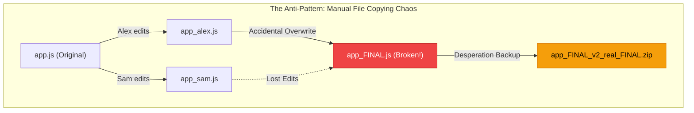
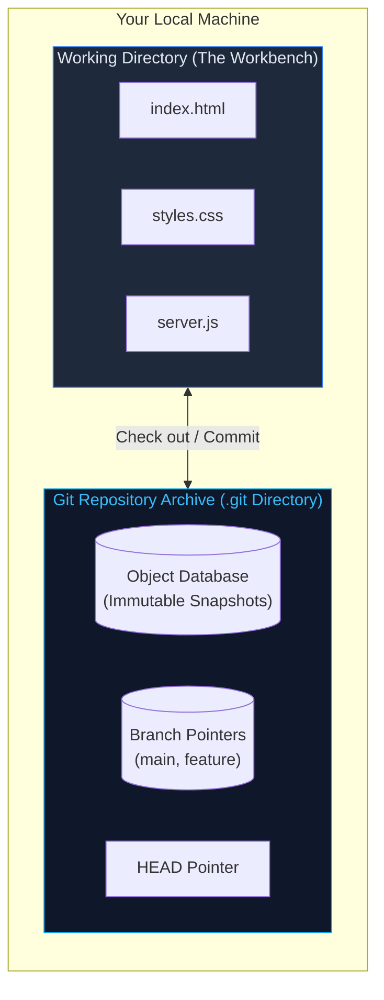
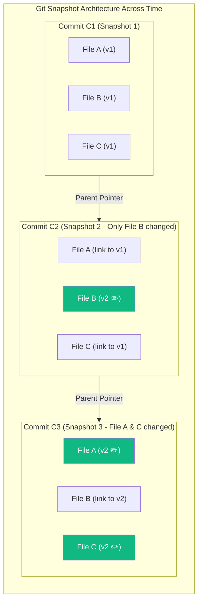
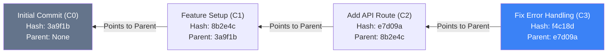
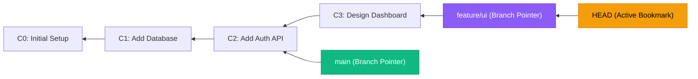
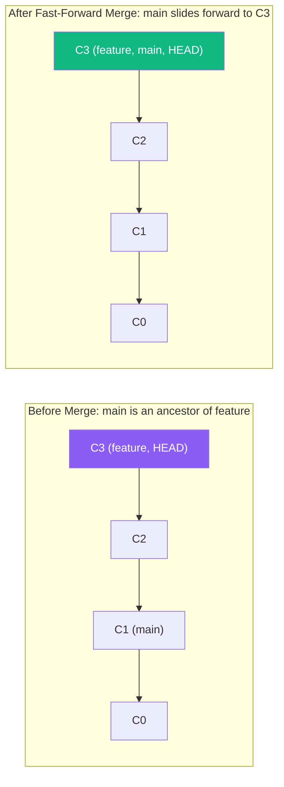
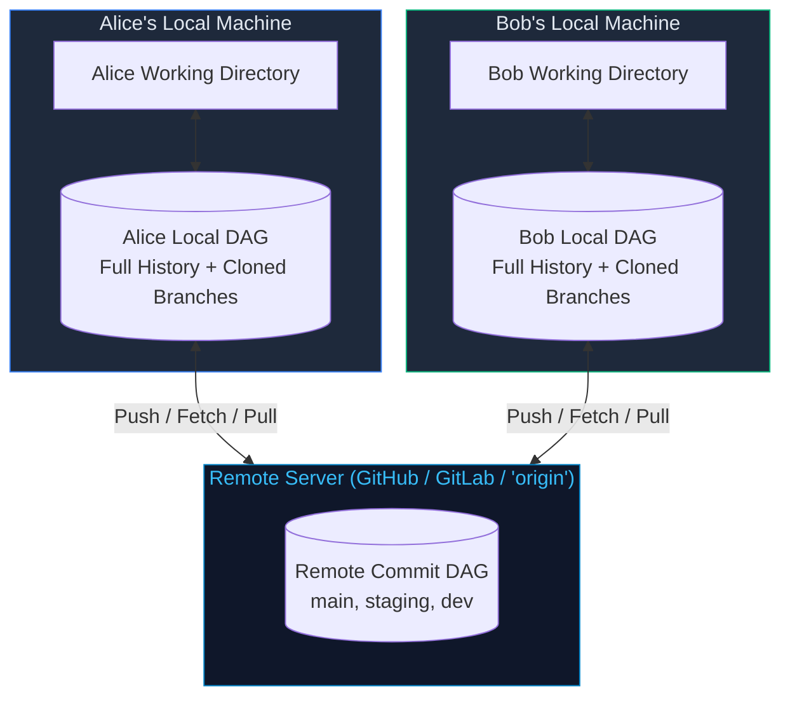
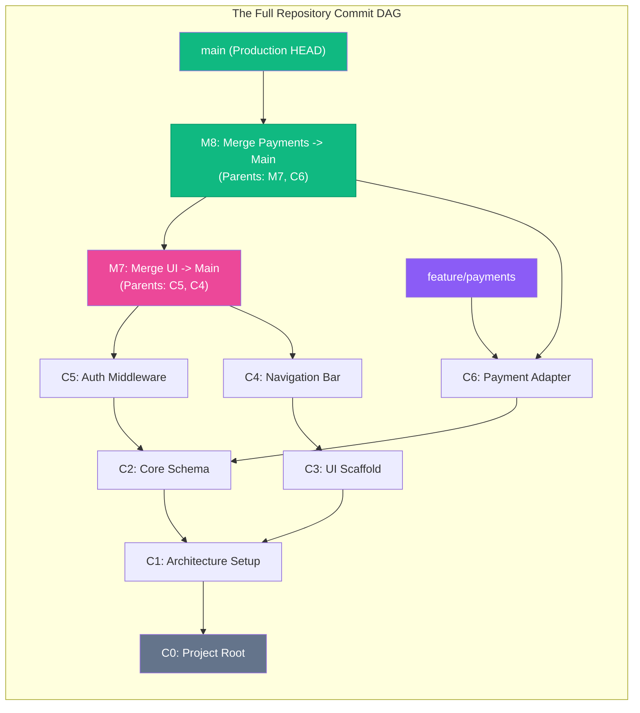

# LES-00-04: Git & Version Control from First Principles: Snapshots, Repositories, Branches & DAG Thinking

**Module:** MOD-00 Digital Foundations  
**Phase:** Phase 1 (Month 1, Week 1)  
**Target Competency:** `DEV-00` (Developer Environment & Tooling Fluency)  
**State Progression:** `Verified` &rarr; `Advanced Practicing`  
**Estimated Time:** 90 minutes  
**Prerequisites:** `LES-00-01` (POSIX Filesystem), `LES-00-02` (CLI & Shell Streams), `LES-00-03` (Web & Networks)  

---

## Executive Overview & Mental Model Anchors

In modern software engineering, code is never written once in a single uninterrupted burst. Software evolves continuously through experimentation, collaboration, refactoring, and emergency debugging. Multiple developers must work on the exact same codebase simultaneously without destroying each other's contributions or destabilizing the working production system.

**Version Control Systems (VCS)** provide the mathematical and architectural foundation for this collaborative work. Among modern tools, **Git** is the industry-standard distributed version control system.

> [!IMPORTANT]
> **The First-Principles Mindset**:
> Many beginners struggle with Git because they try to memorize dozens of terminal commands (`git commit`, `git checkout`, `git merge`, `git pull`) as magical incantations. In this lesson, you will not memorize commands. Instead, you will build a robust **mental model** of what Git actually is: an immutable ledger of whole-project snapshots linked together as a **Directed Acyclic Graph (DAG)** with movable reference pointers called **branches**. Once you understand the graph, Git becomes visual, intuitive, and predictable.

---

### Core Analogies Matrix

| Concept | Everyday Analogy | What It Actually Is in Git |
| :--- | :--- | :--- |
| **Git Repository** | The Project Vault / Time Capsule | A hidden `.git` database tracking the full history of every file across time. |
| **Working Directory** | The Physical Workbench | The visible files and folders on your computer disk that you actively edit. |
| **Commit** | A High-Resolution Photograph Snapshot | An immutable, cryptographically hashed record capturing the exact state of all files at a point in time, with author metadata and parent pointer(s). |
| **Branch** | An Alternate Timeline Bookmark | A lightweight, movable named pointer (a 40-character text reference) that advances when new commits are created. |
| **HEAD** | The "You Are Here" Map Pin | A special pointer that designates which commit and branch you are currently viewing on your workbench. |
| **Merge** | Merging Two Rivers into One Stream | Combining changes from two divergent branch timelines into a unified new commit having **two parent pointers**. |
| **Remote (origin)** | The Central Cloud Archive | A copy of the commit graph hosted on an external server (e.g. GitHub/GitLab) used to synchronize distributed team members. |
| **The Git DAG** | A Family Tree of Engineering Decisions | A Directed Acyclic Graph where every commit node points strictly backward to its parent ancestor(s). |

---

## Card 1: The Problem Git Solves

### The Opening Scenario: The Chaotic Project Nightmare

Imagine you and three fellow engineers are building a university project or a startup web app. Without version control, file collaboration typically begins like this:

```
project_folder/
├── index.html
├── style.css
├── app.js
├── app_backup.js
├── app_backup_FINAL.js
├── app_backup_FINAL_real.js
├── app_alex_working.js
└── app_FINAL_DO_NOT_DELETE_v2.zip
```

Within 48 hours, chaos ensues:
1. **Accidental Overwrites**: Alex edits `app.js` while Sam is fixing a login bug in their own copy. Sam uploads their version and completely erases Alex's work without any warning.
2. **Loss of Causality & Attribution**: At 3:00 AM, the checkout button breaks. Nobody knows who changed what, why the change was made, or which file version was working yesterday afternoon.
3. **Destructive Experimentation**: Maria wants to try a radical database refactor. To test it safely, she copies the entire 5 GB folder to her desktop. Three days later, her changes are completely disconnected from the rest of the team's updates.
4. **Storage Explosion**: Every manual `.zip` backup duplicates thousands of unchanged files, consuming gigabytes of disk space and creating massive confusion.



---

### Why Manual Backups Are NOT Version Control

A true Version Control System must satisfy four non-negotiable architectural mandates:

1. **Atomic Whole-Project Snapshots**: It must record the state of the *entire project* as a coherent unit, rather than tracking loose, uncoordinated files.
2. **Cryptographic Provenance & Attribution**: Every single change must record **who** made it, **when** it occurred, and **why** it was done (via a descriptive commit message).
3. **Non-Destructive Branching**: Developers must be able to branch off into isolated, risk-free experimental timelines without duplicating project folders on disk.
4. **Deterministic Merging**: When two developers finish separate tasks, the system must mathematically compare both timelines against their common ancestor and fuse them back together reliably.

Git was engineered specifically to solve this fundamental distributed coordination problem.

---

## Card 2: Repositories & Snapshots

### The Mental Model: Working Directory vs. The Git Repository

When you turn a standard folder on your computer into a Git-managed project, your folder is divided into two distinct conceptual zones:



- **The Working Directory (The Workbench)**: These are the tangible files and folders visible in your POSIX file manager or code editor. You modify, save, compile, and run these files. This is your temporary workbench.
- **The Git Repository (The Vault)**: A hidden directory named `.git` located at the root of your project. The repository is a complete, self-contained, highly optimized database containing the entire chronological history, all historical versions of every file, all commit records, and all branch pointers.

---

### The Fundamental Difference: Deltas vs. Snapshots

Older version control systems (such as CVS or Subversion) stored history as **deltas** (a sequence of line-by-line differences or file patches). To reconstruct file state at Version 5, the system had to replay Patch 1 &rarr; Patch 2 &rarr; Patch 3 &rarr; Patch 4 &rarr; Patch 5 sequentially, which was slow and fragile.

**Git uses a Snapshot Model**:
Whenever you record a commit in Git, Git takes a full **photograph snapshot** of what all your project files look like at that exact millisecond. 



> [!TIP]
> **Storage Efficiency via Content Addressing**:
> Does taking whole snapshots make Git waste disk space? **No!** If a file has not changed between Commit 1 and Commit 2 (like `File A` above), Git does not store a duplicate copy. Instead, Commit 2 simply stores a fast cryptographic pointer to the existing file object already in the database. Git is lightning-fast because inspecting any historical state is an instant pointer lookup rather than a patch calculation.

---

## Card 3: Commits & History

### Anatomy of a Git Commit

A **commit** is the fundamental atomic unit of history in Git. Think of a commit as an **immutable, sealed container**. Once written to the database, a commit can never be edited or altered without changing its unique identity.

Every commit contains four essential components:

```
+-----------------------------------------------------------------------+
|  COMMIT OBJECT: a1b2c3d4e5f6... (40-character SHA hash)               |
+-----------------------------------------------------------------------+
|  1. TREE SNAPSHOT     -> Root directory pointer to all project files  |
|  2. AUTHOR & DATE     -> Jane Doe <jane@octo.org> | 2026-09-30 14:22  |
|  3. COMMIT MESSAGE    -> "Fix checkout race condition in orders table"|
|  4. PARENT POINTER(S) -> Parent: 9f8e7d6c... (Points backward in time)|
+-----------------------------------------------------------------------+
```

1. **Tree Snapshot**: A cryptographic pointer to the exact directory state and file contents captured by this commit.
2. **Author & Timestamp**: The verified identity of the engineer who authored the change and the exact timestamp it was recorded.
3. **Commit Message**: A human-readable statement explaining *why* the change was made. A great commit message provides context that cannot be inferred from code alone.
4. **Parent Pointer(s)**: A pointer referencing the commit that immediately preceded this one.

---

### The Arrow of Time: Parent Pointers Point Backward

In a Git history graph, commit arrows point **backward to the past (to parents)**, not forward to the future.



Why do arrows point backward?
- When `C0` was created, `C1` did not exist yet! `C0` has no knowledge of what will happen in the future.
- When you create `C1`, Git looks at where you are currently standing (`C0`) and writes `Parent: C0` inside `C1`'s immutable record.
- Therefore, each commit knows its ancestry, forming an unbroken chain from the newest commit all the way back to the project's genesis.

---

## Card 4: Branches: Alternate Timelines as Lightweight Bookmarks

### Demystifying Branches: It's Just a Pointer!

In many traditional tools, creating a "branch" meant copying an entire folder containing gigabytes of files. In Git, creating a branch takes 1 millisecond and consumes only **41 bytes** of disk space.

> [!IMPORTANT]
> **What a Branch Actually Is**:
> A branch in Git is **NOT** a container of commits and is **NOT** a duplicate directory of files. A branch is simply a **lightweight, movable named pointer (a bookmark)** that holds the 40-character commit hash of the latest commit on that line of development.



### The Role of `HEAD`

How does Git know which branch and commit you are currently looking at on your workbench?
Git uses a special pointer called **`HEAD`**:
- `HEAD` is the "You Are Here" indicator on a map.
- When `HEAD` points to a branch (e.g. `HEAD -> main`), creating a new commit causes the `main` pointer to automatically slide forward to the new commit.
- If you switch to `feature/ui` (`HEAD -> feature/ui`), your working directory files instantly transform to match `C3`. When you make a new commit `C4`, `feature/ui` moves to `C4`, while `main` stays safely at `C2`!

---

## Card 5: Merging: Combining Parallel Work

When you and a collaborator finish work on separate branches, or when a feature branch is tested and ready to integrate into production (`main`), you perform a **merge**.

Git analyzes the commit graph to determine how to combine the two timelines.

---

### 1. The Fast-Forward Merge (No Divergence)

If the target branch (`main`) has had **no new commits** since the feature branch branched off, Git does not need to perform any complex calculations. It simply slides the `main` pointer forward along the existing chain.



---

### 2. The Three-Way Merge (Divergent History)

When both branches have progressed independently since they split, history has **diverged**:
- `main` has new commits: `C1 -> C2`
- `feature` has new commits: `C1 -> C3 -> C4`
- Both branches share **`C1` as their Common Ancestor (Base Commit)**.

Git performs a **Three-Way Merge**:
1. Compares Base (`C1`) with `main`'s latest commit (`C2`).
2. Compares Base (`C1`) with `feature`'s latest commit (`C4`).
3. Automatically blends the non-overlapping changes and creates a new **Merge Commit (`M5`)**.

```mermaid
graph RL
    C0["C0: Genesis"]
    C1["C1: Common Ancestor (Base)"]
    C2["C2: Hotfix on Main"]
    C3["C3: UI Component"]
    C4["C4: UI Styling"]
    M5["M5: Merge Commit<br/>(Parent 1: C2, Parent 2: C4)"]

    C1 --> C0
    C2 --> C1
    C3 --> C1
    C4 --> C3

    M5 -->|Parent 1 (main)| C2
    M5 -->|Parent 2 (feature)| C4

    MainPtr["main (HEAD)"] --> M5
    FeaturePtr["feature/ui"] --> C4

    style C1 fill:#64748b,color:#fff
    style M5 fill:#ec4899,color:#fff,stroke:#be185d
    style MainPtr fill:#10b981,color:#fff
    style FeaturePtr fill:#8b5cf6,color:#fff
```

> [!IMPORTANT]
> **The Anatomy of a Merge Commit**:
> What makes a merge commit special? **It has two parent pointers!**
> `Parent 1` points to the branch you were standing on (`main`), and `Parent 2` points to the branch being brought in (`feature`). This dual-parent link preserves the complete evolutionary history of both branches forever.

---

## Card 6: Local vs. Remote Repositories

### Centralized vs. Distributed Architecture

In older centralized systems (like SVN), the repository lived solely on a central corporate server. If your internet disconnected or the server went down, you could not commit, inspect history, or branch.

**Git is Fully Distributed**:
When you clone a repository from GitHub or GitLab, you download a **100% complete, standalone copy of the entire repository database** onto your local computer.



---

### What "Push" and "Pull" Mean Conceptually

Because both you and the remote server have your own local commit DAGs, collaboration is simply the process of **synchronizing two graph databases**:

- **`push` (Upload Graph Nodes)**: You created new commits (`C3`, `C4`) on your local machine. Pushing sends those commit objects over the network and updates the remote branch pointer to include them.
- **`fetch` / `pull` (Download Graph Nodes)**: Your teammate pushed new commits to the remote. Pulling downloads those missing commit objects into your local database and merges them into your active branch.

---

## Card 7: The Git DAG Mental Model & Synthesis

### What is a Directed Acyclic Graph (DAG)?

Everything in Git converges on a single elegant mathematical data structure: the **Directed Acyclic Graph (DAG)**.

```
       D - I - R - E - C - T - E - D
       Every connection is an arrow with direction (pointing to parent ancestors).
       
       A - C - Y - C - L - I - C
       No loops! You can never traverse parent arrows and end up back at the same commit.
       
       G - R - A - P - H
       A network of nodes (commits) and edges (parent references) that can branch and join.
```



---

### Summary Checklist for Reading Any Git Graph

When you look at a commit graph in Git, ask these four questions:

1. **Where is `HEAD`?** &rarr; Identifies the active commit currently checked out on your workbench.
2. **Where are the branch pointers?** &rarr; Identifies the latest tip of each named line of development.
3. **Where do branch lines fork?** &rarr; Identifies the **Common Ancestor** where two features parted ways.
4. **Which commits have two parent arrows?** &rarr; Identifies **Merge Commits** that fused divergent history streams back together.

---

## Formative Checkpoint Review

Test your mental model comprehension against the 5 core conceptual checkpoints:

1. **Why Backups Are Not VCS**: Manual `.zip` archives lack atomic whole-project tracking, author provenance, message rationales, and deterministic branch merging.
2. **Commit as a Snapshot**: A commit is an immutable, cryptographically identified photograph of the entire project state, not an isolated delta patch.
3. **Branches as Pointers**: A branch is a lightweight, 41-byte named reference bookmark pointing to a commit hash.
4. **Merge Commit Anatomy**: A merge commit has two parent pointers, connecting separate historical paths.
5. **The DAG Invariant**: Git history is a Directed Acyclic Graph because time flows in one direction and no commit can ever be its own ancestor.

---

## Next Steps: Practical Assessment

You are now prepared for **`EXE-00-04: Visual Git Graph Reconstruction & Version Control Diagnostics`**, where you will inspect visual commit DAGs, trace branch ancestry, identify common ancestors, and diagnose merge topologies without writing code.
