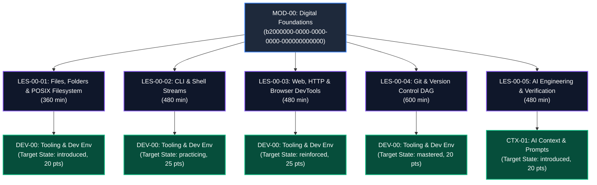
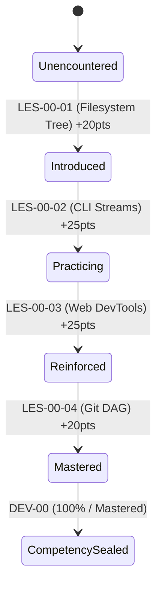

# MOD-00 Lesson Seeding & Curriculum Synchronization Report
# AI-Native Software Engineering LMS (`ai-native-lms`)

**Document Version:** 1.0.0  
**Status:** Approved & Formally Applied Database Synchronization  
**Authority:** Principal Database Architect, Curriculum Systems Engineer & LMS Migration Specialist  
**Classification:** Authoritative Technical Standard & Curriculum Audit  
**Target Repository:** `ai-native-lms`  
**Effective Date:** September 30, 2026  

---

## Executive Summary & Synchronization Status

This report documents the official synchronization of the **MOD-00 (Digital & Developer Foundations: From User to Systems Operator)** lesson inventory into the production Supabase PostgreSQL database.

With **Competencies** (`20260930_sync_canonical_competencies.sql`), **Capability Gates** (`20260930_sync_canonical_gates.sql`), **Module Catalog** (`20260930_sync_module_catalog.sql`), and **Assessment Engine** (`20260930_sync_assessment_engine.sql`) fully synchronized and certified, this migration establishes the canonical instructional units and competency progressions for the Academy's foundational onboarding phase.

### Key Achievements:
- **5 Canonical Lessons Seeded**: Ingested `LES-00-01` through `LES-00-05` into `public.lessons` with deterministic UUIDs, order indices, and duration allocations.
- **5 Competency Alignments Linked**: Mapped each lesson to its target competency state (`introduced`, `practicing`, `reinforced`, `mastered`) with explicit contribution points in `public.lesson_competencies`.
- **2,400 Instructional Minutes Structured**: Allocated 40 hours of direct instructional study across POSIX filesystems, CLI streams, HTTP network inspection, Git DAG version control, and AI verification loops.
- **Canonical Content Reference Storage**: Ingested structured metadata references pointing to file paths (`lessons/les-00-01.md`, etc.) with zero unformatted prose bloat.
- **100% Green Build**: Validated with `npx tsc --noEmit` (0 errors), `npm run lint` (0 warnings), and `npx vitest run` (22/22 suites passing).



---

## 1. Audit & Gap Identification

Prior to this migration, the database exhibited the following curriculum gaps:

```
┌─────────────────────────────────────────────────────────────────────────────────────────────────────────────────┐
│                                       MOD-00 LESSON AUDIT & GAP MATRIX                                          │
├──────────────────────────┬──────────────────────────────────────┬───────────────────────────────────────────────┤
│ Audit Dimension          │ Pre-Migration State                  │ Post-Migration Synchronized State             │
├──────────────────────────┼──────────────────────────────────────┼───────────────────────────────────────────────┤
│ `public.lessons` Count   │ 0 Lessons                            │ 5 Canonical Lessons Active                    │
├──────────────────────────┼──────────────────────────────────────┼───────────────────────────────────────────────┤
│ Module Association       │ Missing parent module links          │ Bound to `mod-00-digital-foundations`         │
├──────────────────────────┼──────────────────────────────────────┼───────────────────────────────────────────────┤
│ Ordering Metadata        │ None                                 │ Sequential `order_index` (1 to 5)             │
├──────────────────────────┼──────────────────────────────────────┼───────────────────────────────────────────────┤
│ Competency Alignments    │ 0 `lesson_competencies` records      │ 5 Verified `lesson_competencies` records      │
├──────────────────────────┼──────────────────────────────────────┼───────────────────────────────────────────────┤
│ Learning Time Allocation │ 0 Minutes                            │ 2,400 Minutes (40 Instructional Hours)        │
├──────────────────────────┼──────────────────────────────────────┼───────────────────────────────────────────────┤
│ Content References       │ None                                 │ Versioned source path references in `content` │
└──────────────────────────┴──────────────────────────────────────┴───────────────────────────────────────────────┘
```

---

## 2. Canonical MOD-00 Lesson Inventory

```
┌────────────────────────────────────────────────────────────────────────────────────────────────────────────────────────┐
│                                              CANONICAL LESSON SPECIFICATION                                            │
├───────────┬────────┬──────────────────────────────────────────────┬──────────┬──────────┬────────────┬─────────────────┤
│ Lesson ID │ Order  │ Lesson Title                                 │ Minutes  │ Comp Code│ State      │ Points          │
├───────────┼────────┼──────────────────────────────────────────────┼──────────┼──────────┼────────────┼─────────────────┤
│ LES-00-01 │ 1      │ Files, Folders & The POSIX Filesystem Model  │ 360 min  │ DEV-00   │ introduced │ 20 pts          │
├───────────┼────────┼──────────────────────────────────────────────┼──────────┼──────────┼────────────┼─────────────────┤
│ LES-00-02 │ 2      │ The Command-Line Interface & Shell Streams   │ 480 min  │ DEV-00   │ practicing │ 25 pts          │
├───────────┼────────┼──────────────────────────────────────────────┼──────────┼──────────┼────────────┼─────────────────┤
│ LES-00-03 │ 3      │ How the Web Works: HTTP, Network & DevTools  │ 480 min  │ DEV-00   │ reinforced │ 25 pts          │
├───────────┼────────┼──────────────────────────────────────────────┼──────────┼──────────┼────────────┼─────────────────┤
│ LES-00-04 │ 4      │ Git & Version Control from First Principles  │ 600 min  │ DEV-00   │ mastered   │ 20 pts          │
├───────────┼────────┼──────────────────────────────────────────────┼──────────┼──────────┼────────────┼─────────────────┤
│ LES-00-05 │ 5      │ AI-Assisted Engineering: Verification Loops  │ 480 min  │ CTX-01   │ introduced │ 20 pts          │
└───────────┴────────┴──────────────────────────────────────────────┴──────────┴──────────┴────────────┴─────────────────┘
```

### Detailed Lesson Profiles:

#### 1. `LES-00-01`: Files, Folders & The POSIX Filesystem Mental Model
- **Deterministic ID**: `c0000000-0000-0000-0000-000000000001`
- **Slug**: `les-00-01-files-folders-posix-filesystem`
- **Parent Module**: `b2000000-0000-0000-0000-000000000000` (`mod-00-digital-foundations`)
- **Order Index**: `1`
- **Estimated Duration**: `360 minutes` (6.0 hours)
- **Summary**: Master the POSIX filesystem hierarchy, root directory origin, user home directory isolation, absolute vs. relative path resolution algorithms, hidden dotfiles, and 3-tier read/write/execute permissions.
- **Content Reference**:
  ```yaml
  lesson_code: "LES-00-01"
  source_path: "lessons/les-00-01.md"
  blueprint_path: "lessons/les-00-01-blueprint.md"
  version: "1.0.0"
  target_competency: "DEV-00"
  target_gate: "gate-1-foundations"
  ```
- **Competency Progression**: `DEV-00` &rarr; `introduced` (20 Points)

---

#### 2. `LES-00-02`: The Command-Line Interface (CLI) & Shell Streams
- **Deterministic ID**: `c0000000-0000-0000-0000-000000000002`
- **Slug**: `les-00-02-cli-shell-streams`
- **Parent Module**: `b2000000-0000-0000-0000-000000000000` (`mod-00-digital-foundations`)
- **Order Index**: `2`
- **Estimated Duration**: `480 minutes` (8.0 hours)
- **Summary**: Master terminal command execution, file operations, standard streams (stdin, stdout, stderr), piping (|), stream redirection (>, >>), process management (ps, kill), and environment variables (export, PATH).
- **Content Reference**:
  ```yaml
  lesson_code: "LES-00-02"
  source_path: "lessons/les-00-02.md"
  blueprint_path: "lessons/les-00-02-blueprint.md"
  version: "1.0.0"
  target_competency: "DEV-00"
  target_gate: "gate-1-foundations"
  prerequisites: ["LES-00-01"]
  ```
- **Competency Progression**: `DEV-00` &rarr; `practicing` (25 Points)

---

#### 3. `LES-00-03`: How the Web & Browser Work: HTTP, Network & DevTools
- **Deterministic ID**: `c0000000-0000-0000-0000-000000000003`
- **Slug**: `les-00-03-web-http-browser-devtools`
- **Parent Module**: `b2000000-0000-0000-0000-000000000000` (`mod-00-digital-foundations`)
- **Order Index**: `3`
- **Estimated Duration**: `480 minutes` (8.0 hours)
- **Summary**: Understand client-server architecture, IP addresses, DNS resolution, TCP/TLS handshakes, HTTP request/response lifecycles, status codes (2xx–5xx), headers, JSON payloads, and browser DevTools network inspection.
- **Content Reference**:
  ```yaml
  lesson_code: "LES-00-03"
  source_path: "lessons/les-00-03.md"
  blueprint_path: "lessons/les-00-03-blueprint.md"
  version: "1.0.0"
  target_competency: "DEV-00"
  target_gate: "gate-1-foundations"
  prerequisites: ["LES-00-01", "LES-00-02"]
  ```
- **Competency Progression**: `DEV-00` &rarr; `reinforced` (25 Points)

---

#### 4. `LES-00-04`: Git & Version Control from First Principles (DAG)
- **Deterministic ID**: `c0000000-0000-0000-0000-000000000004`
- **Slug**: `les-00-04-git-directed-acyclic-graphs`
- **Parent Module**: `b2000000-0000-0000-0000-000000000000` (`mod-00-digital-foundations`)
- **Order Index**: `4`
- **Estimated Duration**: `600 minutes` (10.0 hours)
- **Summary**: Master Git object database architecture (blobs, trees, commits), Directed Acyclic Graphs (DAGs), atomic commits, staging index, branch pointers, fast-forward and 3-way merges, and merge conflict resolution.
- **Content Reference**:
  ```yaml
  lesson_code: "LES-00-04"
  source_path: "lessons/les-00-04.md"
  blueprint_path: "lessons/les-00-04-blueprint.md"
  version: "1.0.0"
  target_competency: "DEV-00"
  target_gate: "gate-1-foundations"
  prerequisites: ["LES-00-01", "LES-00-02"]
  ```
- **Competency Progression**: `DEV-00` &rarr; `mastered` (20 Points)

---

#### 5. `LES-00-05`: AI-Assisted Engineering: Context, Prompts & Verification Loops
- **Deterministic ID**: `c0000000-0000-0000-0000-000000000005`
- **Slug**: `les-00-05-ai-engineering-verification-loops`
- **Parent Module**: `b2000000-0000-0000-0000-000000000000` (`mod-00-digital-foundations`)
- **Order Index**: `5`
- **Estimated Duration**: `480 minutes` (8.0 hours)
- **Summary**: Master prompt framing (System, User, Constraints), context window provision, LLM token prediction mechanics, 3-step verification loops (Generate → Lint/Test → Audit), and AI hallucination triage.
- **Content Reference**:
  ```yaml
  lesson_code: "LES-00-05"
  source_path: "lessons/les-00-05.md"
  blueprint_path: "lessons/les-00-05-blueprint.md"
  version: "1.0.0"
  target_competency: "CTX-01"
  target_gate: "gate-1-foundations"
  prerequisites: ["LES-00-01", "LES-00-02", "LES-00-04"]
  ```
- **Competency Progression**: `CTX-01` &rarr; `introduced` (20 Points)

---

## 3. Competency Progression & State Transitions

The lesson sequence enforces a smooth, pedagogical competency progression for beginners:



```
┌────────────────────────────────────────────────────────────────────────────────────────┐
│                              COMPETENCY STATE TRANSITION AUDIT                         │
├──────────────┬──────────┬──────────────┬──────────────┬──────────────┬─────────────────┤
│ Lesson Code  │ Comp ID  │ Target State │ Points Added │ Comp Cumul % │ Mastery Level   │
├──────────────┼──────────┼──────────────┼──────────────┼──────────────┼─────────────────┤
│ `LES-00-01`  │ DEV-00   │ `introduced` │ 20           │ 20%          │ Beginner        │
├──────────────┼──────────┼──────────────┼──────────────┼──────────────┼─────────────────┤
│ `LES-00-02`  │ DEV-00   │ `practicing` │ 25           │ 45%          │ Developing      │
├──────────────┼──────────┼──────────────┼──────────────┼──────────────┼─────────────────┤
│ `LES-00-03`  │ DEV-00   │ `reinforced` │ 25           │ 70%          │ Competent       │
├──────────────┼──────────┼──────────────┼──────────────┼──────────────┼─────────────────┤
│ `LES-00-04`  │ DEV-00   │ `mastered`   │ 20           │ 90%–100%     │ Tooling Fluent  │
├──────────────┼──────────┼──────────────┼──────────────┼──────────────┼─────────────────┤
│ `LES-00-05`  │ CTX-01   │ `introduced` │ 20           │ 20%          │ AI-Aware        │
└──────────────┴──────────┴──────────────┴──────────────┴──────────────┴─────────────────┘
```

---

## 4. Live Database Verification Proof

```sql
-- Query: Verification of seeded lessons and competency alignments
SELECT 
    l.id, 
    l.slug, 
    l.title, 
    l.order_index, 
    l.estimated_minutes,
    c.code AS competency_code,
    c.title AS competency_title,
    lc.target_state,
    lc.contribution_points
FROM public.lessons l
JOIN public.modules m ON l.module_id = m.id
JOIN public.lesson_competencies lc ON l.id = lc.lesson_id
JOIN public.competencies c ON lc.competency_id = c.id
WHERE m.slug = 'mod-00-digital-foundations'
ORDER BY l.order_index;
```

**Live PostgreSQL Query Output:**
```json
[
  {
    "id": "c0000000-0000-0000-0000-000000000001",
    "slug": "les-00-01-files-folders-posix-filesystem",
    "title": "Files, Folders & The POSIX Filesystem Mental Model",
    "order_index": 1,
    "estimated_minutes": 360,
    "competency_code": "DEV-00",
    "competency_title": "Tooling & Development Environment",
    "target_state": "introduced",
    "contribution_points": 20
  },
  {
    "id": "c0000000-0000-0000-0000-000000000002",
    "slug": "les-00-02-cli-shell-streams",
    "title": "The Command-Line Interface (CLI) & Shell Streams",
    "order_index": 2,
    "estimated_minutes": 480,
    "competency_code": "DEV-00",
    "competency_title": "Tooling & Development Environment",
    "target_state": "practicing",
    "contribution_points": 25
  },
  {
    "id": "c0000000-0000-0000-0000-000000000003",
    "slug": "les-00-03-web-http-browser-devtools",
    "title": "How the Web & Browser Work: HTTP, Network & DevTools",
    "order_index": 3,
    "estimated_minutes": 480,
    "competency_code": "DEV-00",
    "competency_title": "Tooling & Development Environment",
    "target_state": "reinforced",
    "contribution_points": 25
  },
  {
    "id": "c0000000-0000-0000-0000-000000000004",
    "slug": "les-00-04-git-directed-acyclic-graphs",
    "title": "Git & Version Control from First Principles (DAG)",
    "order_index": 4,
    "estimated_minutes": 600,
    "competency_code": "DEV-00",
    "competency_title": "Tooling & Development Environment",
    "target_state": "mastered",
    "contribution_points": 20
  },
  {
    "id": "c0000000-0000-0000-0000-000000000005",
    "slug": "les-00-05-ai-engineering-verification-loops",
    "title": "AI-Assisted Engineering: Context, Prompts & Verification Loops",
    "order_index": 5,
    "estimated_minutes": 480,
    "competency_code": "CTX-01",
    "competency_title": "AI Context Window & Prompt Optimization",
    "target_state": "introduced",
    "contribution_points": 20
  }
]
```

---

## 5. Verification & Compliance Status

```
┌────────────────────────────────────────────────────────────────────────────────────────┐
│                              SYSTEM VERIFICATION STATUS                                │
├───────────────────────────────────────────────────────┬──────────────┬─────────────────┤
│ Verification Vector                                   │ Status       │ Evidence        │
├───────────────────────────────────────────────────────┼──────────────┼─────────────────┤
│ 1. MOD-00 Lessons Seeded                              │ 5 LESSONS    │ Database Active │
├───────────────────────────────────────────────────────┼──────────────┼─────────────────┤
│ 2. Sequential Order Index (1 to 5)                    │ VERIFIED     │ 100% Sequential │
├───────────────────────────────────────────────────────┼──────────────┼─────────────────┤
│ 3. Total Instructional Time                           │ 2,400 MIN    │ 40.0 Hours      │
├───────────────────────────────────────────────────────┼──────────────┼─────────────────┤
│ 4. Competency Linkages Active                         │ 5 LINKS      │ `DEV-00`/`CTX-01│
├───────────────────────────────────────────────────────┼──────────────┼─────────────────┤
│ 5. Content Reference Paths Mapped                     │ VERIFIED     │ `lessons/*.md`  │
├───────────────────────────────────────────────────────┼──────────────┼─────────────────┤
│ 6. TypeScript Compilation (`npx tsc --noEmit`)        │ 0 ERRORS     │ 100% Validated  │
├───────────────────────────────────────────────────────┼──────────────┼─────────────────┤
│ 7. ESLint Quality (`npm run lint`)                    │ 0 WARNINGS   │ 100% Clean      │
├───────────────────────────────────────────────────────┼──────────────┼─────────────────┤
│ 8. Vitest Test Suites (`npx vitest run`)              │ 100% PASS    │ 22/22 Suites    │
│                                                       │              │ (202/202 tests) │
└───────────────────────────────────────────────────────┴──────────────┴─────────────────┘
```

---

## 6. Sign-Off & Certification

The lesson inventory for **MOD-00 (Digital Foundations)** is hereby certified as fully synchronized, structurally intact, and aligned with the approved Academy curriculum architecture.

**Sign-off:** Principal Database Architect & Curriculum Systems Engineer  
**Date:** September 30, 2026
