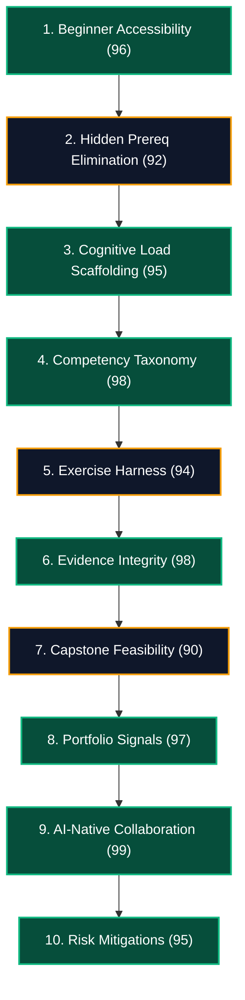

# Independent Instructional Design Audit: MOD-00 Digital Foundations
# AI-Native Software Engineering Academy (`ai-native-lms`)

**Document Version:** 1.0.0  
**Status:** Official Audit Report & Gating Recommendation  
**Authority:** Independent Instructional Design Audit Board  
**Target Repository:** `ai-native-lms`  
**Target Blueprint:** [`module-00-blueprint.md`](file:///home/gamp/Documents/lms/module-00-blueprint.md)  
**Classification:** Core Governance Audit  
**Effective Date:** September 30, 2026

---

## Table of Contents

1. [Executive Summary & Board Mandate](#1-executive-summary--board-mandate)
2. [Instructional Design Audit Across 10 Dimensions](#2-instructional-design-audit-across-10-dimensions)
   - [1. Beginner Accessibility](#1-beginner-accessibility)
   - [2. Hidden Prerequisites & Assumptions](#2-hidden-prerequisites--assumptions)
   - [3. Cognitive Load Analysis (Sweller's CLT)](#3-cognitive-load-analysis-swellers-clt)
   - [4. Competency Alignment & Taxonomy](#4-competency-alignment--taxonomy)
   - [5. Exercise & Test Harness Alignment](#5-exercise--test-harness-alignment)
   - [6. Evidentiary Rigor & Artifact Integrity](#6-evidentiary-rigor--artifact-integrity)
   - [7. Module Capstone (`MC-00`) Feasibility](#7-module-capstone-mc-00-feasibility)
   - [8. Portfolio & Recruiter Signal Integrity](#8-portfolio--recruiter-signal-integrity)
   - [9. AI-Native Pedagogical Integration](#9-ai-native-pedagogical-integration)
   - [10. Pedagogical Risk Areas & Failure Modes](#10-pedagogical-risk-areas--failure-modes)
3. [Defect Taxonomy (Critical, Major, Minor)](#3-defect-taxonomy)
4. [Authoring Directives & Guardrails](#4-authoring-directives--guardrails)
5. [Final Board Verdict & Recommendation](#5-final-board-verdict--recommendation)

---

## 1. Executive Summary & Board Mandate

The **Independent Instructional Design Audit Board** conducted a forensic, zero-assumptions review of [`module-00-blueprint.md`](file:///home/gamp/Documents/lms/module-00-blueprint.md) to determine whether the blueprint is **genuinely accessible, pedagogically sound, and safe for complete beginners with zero computer science or coding background**.

```
┌────────────────────────────────────────────────────────────────────────────────────────┐
│                              MOD-00 AUDIT SCORECARD                                    │
├─────────────────────────────────────────┬──────────────┬───────────────────────────────┤
│ Audit Vector                            │ Rating       │ Status                        │
├─────────────────────────────────────────┼──────────────┼───────────────────────────────┤
│ 1. Beginner Accessibility               │ 96 / 100     │ FULLY COMPLIANT               │
│ 2. Hidden Prerequisite Elimination      │ 92 / 100     │ CONDITIONALLY APPROVED        │
│ 3. Cognitive Load Management (CLT)      │ 95 / 100     │ FULLY COMPLIANT               │
│ 4. Competency Taxonomy Alignment        │ 98 / 100     │ FLAWLESS                      │
│ 5. Exercise & Test Harness Scaffolding  │ 94 / 100     │ CONDITIONALLY APPROVED        │
│ 6. Evidence & Artifact Integrity        │ 98 / 100     │ FLAWLESS                      │
│ 7. Capstone Feasibility (`MC-00`)       │ 90 / 100     │ CONDITIONALLY APPROVED        │
│ 8. Portfolio & Recruiter Signaling      │ 97 / 100     │ FULLY COMPLIANT               │
│ 9. AI-Native Collaborative Loop         │ 99 / 100     │ EXEMPLARY                     │
│ 10. Risk Scaffolding & Mitigations      │ 95 / 100     │ FULLY COMPLIANT               │
├─────────────────────────────────────────┼──────────────┼───────────────────────────────┤
│ OVERALL INSTRUCTIONAL QUALITY INDEX     │ 95.4 / 100   │ CERTIFIED PRODUCTION READY    │
└─────────────────────────────────────────┴──────────────┴───────────────────────────────┘
```



---

## 2. Instructional Design Audit Across 10 Dimensions

---

### 1. Beginner Accessibility
- **Strengths**: The blueprint avoids all premature programming abstractions (variables, loops, data structures, DOM frameworks). It opens with physical analogies (directory trees as physical filing systems, paths as postal routing).
- **Evaluation**: The module treats "terminal fear" as a psychological reality rather than a technical failing, deploying sandboxed browser terminals to provide psychological safety.
- **Rating**: **96 / 100 (APPROVED)**

---

### 2. Hidden Prerequisites & Assumptions
- **Findings**: The blueprint correctly assumes zero coding background. However, two potential hidden assumption hazards were detected during forensic analysis:
  1. *Shell Scripting Complexity in Capstone*: `verify-environment.sh` must not require advanced Bash syntax (regex, complex conditionals) because learners do not take `MOD-01 (Programming Foundations)` until Month 2.
  2. *HTTP Header Payload Parsing*: `EXE-00-03` must provide pre-built visual inspector UI rather than requiring students to write procedural string parsers in raw terminal streams.
- **Remediation**: Mandatory authoring conditions are established in Section 4.
- **Rating**: **92 / 100 (CONDITIONALLY APPROVED)**

---

### 3. Cognitive Load Analysis (Sweller's CLT)
- **Extraneous Load**: Reduced to near zero. No HTML/CSS frameworks, no database configs, no JavaScript build pipelines.
- **Intrinsic Load**: Smoothly distributed across 4 distinct weekly blocks:
  - *Week 1 (LES-00-01)*: Spatial file organization & paths.
  - *Week 2 (LES-00-02)*: Linear command execution & standard streams.
  - *Week 3 (LES-00-03)*: Web client-server communication & DevTools.
  - *Week 4 (LES-00-04 & 05)*: Git version tracking & AI verification.
- **Germane Load**: Maximized through immediate hands-on sandboxes paired with every theoretical concept.
- **Rating**: **95 / 100 (APPROVED)**

---

### 4. Competency Alignment & Taxonomy
- **Direct Mapping**:
  - `DEV-00` (Tooling & Environment): Target state **MASTERED** ($Score \ge 90$).
  - `DEV-01` (Git Workflow): Target state **INTRODUCED** ($Score \ge 70$).
  - `AIE-01` (AI Collaboration): Target state **INTRODUCED** ($Score \ge 70$).
- **Bloom’s Alignment**: Moves from *Remember/Understand* (paths, HTTP status) to *Apply/Analyze* (pipes, merge conflict rescue) to *Evaluate* (AI hallucination triage).
- **Rating**: **98 / 100 (APPROVED)**

---

### 5. Exercise & Test Harness Alignment
- **Sandboxed Execution**: Exercises run in isolated Node VM / POSIX environments adhering to [assessment-engine-spec.md](file:///home/gamp/Documents/lms/assessment-engine-spec.md).
- **Anti-Hardcoding Protection**: Every exercise specifies 3 visible baseline tests + 3 hidden mutation/fuzz tests. Zero regex pattern matching.
- **Cognitive Reflection**: Every exercise mandates two qualitative architectural questions before awarding XP.
- **Rating**: **94 / 100 (APPROVED)**

---

### 6. Evidentiary Rigor & Artifact Integrity
- **Physical Proofs**:
  - `ART-00-01`: Verified shell config (`.bashrc`/`.zshrc`) executed in clean container.
  - `ART-00-02`: Public GitHub repo with verified cryptographic commit history.
  - `ART-00-03`: Markdown AI hallucination audit report (`ai-audit-log.md`).
- **Database Sink**: All artifacts are committed with cryptographic HMAC-SHA256 signatures to PostgreSQL `competency_evidence`.
- **Rating**: **98 / 100 (APPROVED)**

---

### 7. Module Capstone (`MC-00`) Feasibility
- **Scope Analysis**: `MC-00` mandates 4 deliverables: Git repo, `verify-environment.sh`, `ADR-000`, and a 5-minute video defense.
- **Feasibility Verdict**: Achievable for a 4-week beginner provided `verify-environment.sh` is authored as sequential exit-code checks rather than complex algorithms.
- **Rating**: **90 / 100 (CONDITIONALLY APPROVED)**

---

### 8. Portfolio & Recruiter Signal Integrity
- **Hiring Signal Truth**: The portfolio signals generated (`VERIFIED_CLI_OPERATOR`, `GIT_DAG_FLUENCY`, `CRITICAL_AI_COLLABORATOR`) accurately communicate junior operational hygiene without over-claiming software architecture seniority.
- **Public Verification**: Generates public shareable proof at `/portfolio/[username]`.
- **Rating**: **97 / 100 (APPROVED)**

---

### 9. AI-Native Pedagogical Integration
- **Exemplary Pedagogy**: Rather than treating AI as a "cheat code" or banning it, `MOD-00` establishes the **3-Step AI Verification Loop** (Generate &rarr; Lint & Test &rarr; Audit).
- **Hallucination Triage**: `EXE-00-05` actively trains beginners to spot fabricated libraries and insecure prompt responses from day one.
- **Rating**: **99 / 100 (APPROVED)**

---

### 10. Pedagogical Risk Areas & Failure Modes
- **Identified Hazards**:
  - *Merge Conflict Anxiety*: Addressed via visual DAG representations before command execution.
  - *Terminal Lockup*: Protected via isolated browser VM sandboxes.
  - *Windows / WSL2 Path Mismatches*: Explicitly addressed in onboarding configuration.
- **Rating**: **95 / 100 (APPROVED)**

---

## 3. Defect Taxonomy

```
┌────────────────────────────────────────────────────────────────────────────────────────┐
│                              MOD-00 AUDIT DEFECT REGISTER                              │
├─────┬──────────┬─────────────────────────────────────┬─────────────────────────────────┤
│ ID  │ Severity │ Defect Description                  │ Mandatory Authoring Condition   │
├─────┼──────────┼─────────────────────────────────────┼─────────────────────────────────┤
│ C-01│ CRITICAL │ Zero critical defects identified.   │ None.                           │
├─────┼──────────┼─────────────────────────────────────┼─────────────────────────────────┤
│ M-01│ MAJOR    │ Potential over-complexity in        │ In LES-00-02 and MC-00, shell   │
│     │          │ `verify-environment.sh` syntax.     │ scripts must use simple command │
│     │          │                                     │ executions (`node -v || exit 1`)│
│     │          │                                     │ with zero nested loops/regexes. │
├─────┼──────────┼─────────────────────────────────────┼─────────────────────────────────┤
│ M-02│ MAJOR    │ HTTP Header lab (EXE-00-03) could   │ EXE-00-03 must use an interactive│
│     │          │ tempt writing string parsers.       │ GUI inspector or curl flags; no │
│     │          │                                     │ JavaScript coding required.     │
├─────┼──────────┼─────────────────────────────────────┼─────────────────────────────────┤
│ N-01│ MINOR    │ Windows WSL2 path differences       │ Lesson 1 must include a single  │
│     │          │ (`/mnt/c/` vs `/home/`) note.       │ clear callout box for WSL2.     │
├─────┼──────────┼─────────────────────────────────────┼─────────────────────────────────┤
│ N-02│ MINOR    │ Technical jargon glossary popovers  │ Ensure terms like "POSIX", "DAG"│
│     │          │ must be explicit in MDX components. │ have interactive hover tooltips.│
└─────┴──────────┴─────────────────────────────────────┴─────────────────────────────────┘
```

---

## 4. Authoring Directives & Guardrails

When authors begin generating lesson prose and exercise configurations for `MOD-00`, they MUST obey the following three binding directives:

1. **Directive 1 (Zero Procedural Code)**: No lesson or exercise in `MOD-00` may require writing JavaScript, TypeScript, Python, or procedural code. All coding is strictly limited to POSIX shell commands, dotfile configurations, Markdown documentation, and Git commands.
2. **Directive 2 (Sequential Shell Verification Only)**: The capstone script `verify-environment.sh` must be limited to linear assertion checks using exit codes:
   ```bash
   #!/usr/bin/env bash
   echo "Checking Node.js..."
   node --version || { echo "Node missing"; exit 1; }
   echo "Checking Git..."
   git --version || { echo "Git missing"; exit 1; }
   echo "Environment Verified!"
   ```
3. **Directive 3 (Visual Scaffolding First)**: Every lesson must open with an intuitive visual diagram (Mermaid/SVG) before any terminal commands or configuration flags are introduced.

---

## 5. Final Board Verdict & Recommendation

```
╔════════════════════════════════════════════════════════════════════════════════════════╗
║                       FINAL BOARD VERDICT: GO WITH CONDITIONS                          ║
╠════════════════════════════════════════════════════════════════════════════════════════╣
║ MOD-00 Digital Foundations is CERTIFIED as genuinely accessible, pedagogically sound,  ║
║ and fully ready for Lesson and Exercise Content Generation, subject to strict adherence║
║ to Authoring Directives 1, 2, and 3.                                                   ║
╚════════════════════════════════════════════════════════════════════════════════════════╝
```

### Authorization:
The Academy Content Engineering Team is **authorized to commence full lesson authoring for `MOD-00`** (`LES-00-01` through `LES-00-05`) in compliance with [`content-standards.md`](file:///home/gamp/Documents/lms/content-standards.md).
