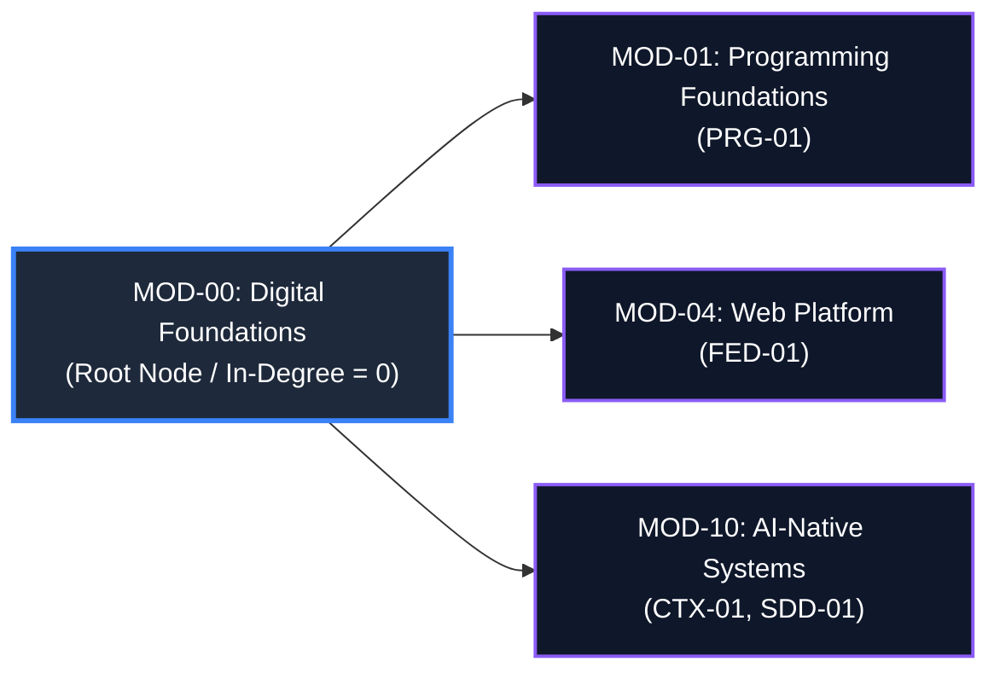
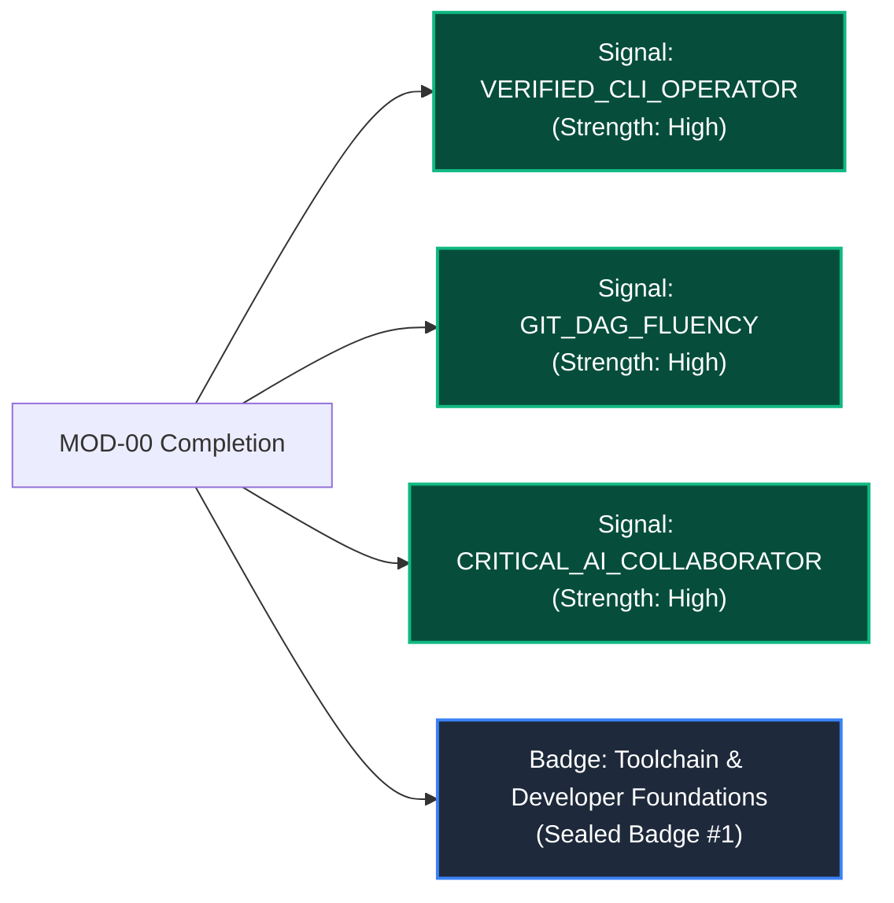

# Official Module Blueprint: MOD-00 Digital Foundations
# AI-Native Software Engineering Academy (`ai-native-lms`)

**Document Version:** 1.0.0  
**Status:** Approved Authoritative Module Blueprint  
**Authority:** Curriculum Blueprint Architect & Master Instructional Designer  
**Target Repository:** `ai-native-lms`  
**Classification:** Canonical Curriculum Blueprint  
**Target Gate:** Gate 1: Foundations  
**Effective Date:** September 30, 2026

---

## Table of Contents

1. [Module Overview](#1-module-overview)
2. [Learner Entry State](#2-learner-entry-state)
3. [Learner Exit State](#3-learner-exit-state)
4. [Competencies Covered & Taxonomy Mapping](#4-competencies-covered--taxonomy-mapping)
5. [Dependency Validation & DAG Position](#5-dependency-validation--dag-position)
6. [Lesson Inventory](#6-lesson-inventory)
7. [Exercise Inventory & Test Harness Specifications](#7-exercise-inventory--test-harness-specifications)
8. [Artifact Inventory & Verification Invariants](#8-artifact-inventory--verification-invariants)
9. [Module Capstone Specification: `MC-00`](#9-module-capstone-specification-mc-00)
10. [Capability Gate Contribution](#10-capability-gate-contribution)
11. [Portfolio Contribution & Hiring Signals](#11-portfolio-contribution--hiring-signals)
12. [Risk Assessment & Scaffolding Mitigations](#12-risk-assessment--scaffolding-mitigations)
13. [Success Criteria & Quantitative Thresholds](#13-success-criteria--quantitative-thresholds)

---

## 1. Module Overview

```
╔════════════════════════════════════════════════════════════════════════════════════════╗
║                              MOD-00 SPECIFICATION BLOCK                                ║
╠══════════════════════════════╦═════════════════════════════════════════════════════════╣
║ Module Identifier            ║ MOD-00                                                  ║
║ Module Title                 ║ Digital & Developer Foundations: From Computer User to  ║
║                              ║ AI-Native Systems Operator                              ║
║ Curriculum Phase             ║ Phase 1: Digital Foundations (Month 1, Weeks 1–4)       ║
║ Target Capability Gate       ║ Gate 1: Foundations                                     ║
║ Target Audience              ║ Complete Beginners (Zero Coding / Zero CS Background)   ║
║ Recommended Pacing           ║ 4 Weeks (60 Total Dedicated Learning Hours; 15 hrs/wk)  ║
║ Lead Domain Bounded Context  ║ `domains/learning/` & `domains/competency/`             ║
║ Lead Infrastructure Context  ║ `lib/supabase/` & sandboxed CLI execution runner        ║
║ Version & Status             ║ v1.0.0 (APPROVED & CANONICAL)                           ║
╚══════════════════════════════╩═════════════════════════════════════════════════════════╝
```

### 1.1 Strategic Mission
`MOD-00` establishes the physical and conceptual developer environment upon which the remaining 13 modules depend. It transforms the learner from a passive consumer of graphic user interfaces (GUIs) into a command-line operator who understands file system hierarchies, stream piping, web client-server mechanics, Git directed acyclic graphs (DAGs), and critical AI verification protocols.

---

## 2. Learner Entry State

```
┌────────────────────────────────────────────────────────────────────────────────────────┐
│                              LEARNER INBOUND PROFILE                                   │
├────────────────────────────┬───────────────────────────────────────────────────────────┤
│ Academic / CS Background   │ None (Zero prior programming experience; non-technical).  │
├────────────────────────────┼───────────────────────────────────────────────────────────┤
│ Operating Model            │ GUI-dependent (Point-and-click; drag-and-drop).           │
├────────────────────────────┼───────────────────────────────────────────────────────────┤
│ Mental Model of Storage    │ Flat folder perception; struggles with paths & hierarchy. │
├────────────────────────────┼───────────────────────────────────────────────────────────┤
│ Terminal / CLI Awareness   │ "Terminal intimidation"; fears breaking the machine.      │
├────────────────────────────┼───────────────────────────────────────────────────────────┤
│ Web Perception             │ Browser as an opaque rendering canvas; unaware of HTTP.   │
├────────────────────────────┼───────────────────────────────────────────────────────────┤
│ AI Usage Habit             │ Blind trust in LLM outputs; lacks code verification tools.│
└────────────────────────────┴───────────────────────────────────────────────────────────┘
```

---

## 3. Learner Exit State

```
┌────────────────────────────────────────────────────────────────────────────────────────┐
│                             LEARNER OUTBOUND PROFILE                                   │
├────────────────────────────┬───────────────────────────────────────────────────────────┤
│ Filesystem Competency      │ Navigates POSIX tree fluently (`/`, `~`, `./`, `../`, `chmod`).│
├────────────────────────────┼───────────────────────────────────────────────────────────┤
│ Terminal Operator State    │ Chains shell commands via pipes (`|`), redirection (`>`), │
│                            │ process inspection (`ps`, `kill`), and environment vars.  │
├────────────────────────────┼───────────────────────────────────────────────────────────┤
│ Web Architecture Literacy  │ Inspects HTTP requests/responses, status codes (2xx–5xx), │
│                            │ request headers, payloads, and DOM trees in DevTools.     │
├────────────────────────────┼───────────────────────────────────────────────────────────┤
│ Version Control Mastery    │ Mental model of Git DAG: creates commits, manages branches│
│                            │ locally/remotely, resolves merge conflicts without panic. │
├────────────────────────────┼───────────────────────────────────────────────────────────┤
│ AI Collaboration Stance    │ Treats AI as a junior pair programmer; applies 3-step     │
│                            │ verification loops to catch hallucinations and syntax bugs│
└────────────────────────────┴───────────────────────────────────────────────────────────┘
```

---

## 4. Competencies Covered & Taxonomy Mapping

```
┌──────────────────────────────────────────────────────────────────────────────────────────────────┐
│                                MOD-00 COMPETENCY COVERAGE MATRIX                                 │
├───────────┬──────────────────────────────────────────────┬──────────────┬──────────────┬─────────┤
│ Code      │ Competency Domain Title                      │ Inbound      │ Outbound     │ Weight  │
├───────────┼──────────────────────────────────────────────┼──────────────┼──────────────┼─────────┤
│ DEV-00    │ Developer Environment & Terminal Fluency     │ unencountered│ mastered     │ 60%     │
│ DEV-01    │ Git Workflow & Version Control               │ unencountered│ introduced   │ 25%     │
│ AIE-01    │ AI-Assisted Development & Prompt Engineering │ unencountered│ introduced   │ 15%     │
└───────────┴──────────────────────────────────────────────┴──────────────┴──────────────┴─────────┘
```

### Bloom's Taxonomy Progression:
- **Remember & Understand**: POSIX path hierarchy, HTTP status codes, Git commit pointers.
- **Apply & Analyze**: Executing shell stream filters (`grep`, `sort`, `uniq`), resolving 3-way Git merge conflicts, diagnosing broken HTTP responses.
- **Evaluate & Create**: Authoring automated shell bootstrap verification scripts and evaluating AI-generated code for security flaws.

---

## 5. Dependency Validation & DAG Position



- **Inbound Prerequisites**: **None** (Root of the entire Academy DAG).
- **Outbound Direct Dependents**: `MOD-01` (Programming Foundations), `MOD-04` (Web Foundations), `MOD-10` (AI-Native Engineering).
- **Topological Integrity**: Zero cycles; zero unresolved dependencies.

---

## 6. Lesson Inventory

*Note: This inventory defines pedagogical purpose and structure. Actual lesson prose (900–1,500 words) is authored separately in accordance with [content-standards.md](file:///home/gamp/Documents/lms/content-standards.md).*

```
┌──────────────────────────────────────────────────────────────────────────────────────────────────┐
│                                     MOD-00 LESSON INVENTORY                                      │
├───────────┬─────────────────────────────────────────────────────┬──────────────┬─────────────────┤
│ Lesson ID │ Lesson Title & Substantive Focus                    │ Competencies │ Target Duration │
├───────────┼─────────────────────────────────────────────────────┼──────────────┼─────────────────┤
│ LES-00-01 │ Files, Folders & The POSIX Filesystem Mental Model  │ DEV-00       │ 6 Hours         │
│           │ Root `/`, home `~`, paths (`./`, `../`), perms      │              │                 │
├───────────┼─────────────────────────────────────────────────────┼──────────────┼─────────────────┤
│ LES-00-02 │ The Command-Line Interface (CLI) & Shell Streams    │ DEV-00       │ 8 Hours         │
│           │ Navigation, file ops, stdio, pipes `|`, redirects   │              │                 │
├───────────┼─────────────────────────────────────────────────────┼──────────────┼─────────────────┤
│ LES-00-03 │ How the Web & Browser Work: HTTP, Network & DevTools│ DEV-00       │ 8 Hours         │
│           │ Client-server, HTTP request/response, DOM inspection│              │                 │
├───────────┼─────────────────────────────────────────────────────┼──────────────┼─────────────────┤
│ LES-00-04 │ Git & Version Control from First Principles (DAG)   │ DEV-01       │ 10 Hours        │
│           │ Commits, staging, branch pointers, merge & diff     │              │                 │
├───────────┼─────────────────────────────────────────────────────┼──────────────┼─────────────────┤
│ LES-00-05 │ AI-Assisted Engineering: Context, Prompts & Evals   │ AIE-01       │ 8 Hours         │
│           │ Prompt framing, context provision, hallucination qa │              │                 │
└───────────┴─────────────────────────────────────────────────────┴──────────────┴─────────────────┘
```

### Lesson Structural Outlines

1. **`LES-00-01`: Files, Folders & The POSIX Filesystem Model**
   - *Industrial Hook*: How a misconfigured relative path caused a multi-million-dollar production database wipeout.
   - *Core Theory*: Root directory `/`, user home `~`, path resolution algorithms (`./`, `../`), absolute vs. relative paths, hidden dotfiles, and POSIX read/write/execute file permissions (`chmod 755/644`).
   - *Guided Walkthrough*: Diagramming the directory tree and tracing path navigation through terminal commands.

2. **`LES-00-02`: The Command-Line Interface (CLI) & Shell Streams**
   - *Industrial Hook*: Why GUI servers are disabled in production clouds; the terminal as the universal operational interface.
   - *Core Theory*: Standard input (`stdin`), standard output (`stdout`), standard error (`stderr`), piping (`|`), stream redirection (`>`, `>>`), process management (`ps`, `kill`), environment variables (`export`, `PATH`).
   - *Guided Walkthrough*: Constructing a multi-stage shell pipeline to grep, sort, and extract error counts from high-volume server logs.

3. **`LES-00-03`: How the Web & Browser Work: HTTP, Network & DevTools**
   - *Industrial Hook*: The anatomy of an enterprise payment failure: tracing a broken 502 Bad Gateway response.
   - *Core Theory*: Client-server architecture, IP addresses, DNS lookup, TCP/TLS handshake, HTTP verbs (GET, POST, PUT, DELETE), status codes (2xx, 3xx, 4xx, 5xx), request/response headers, JSON payload bodies, and browser DOM rendering.
   - *Guided Walkthrough*: Using Browser DevTools Network tab to inspect payload headers and decode network failures.

4. **`LES-00-04`: Git & Version Control from First Principles (DAG)**
   - *Industrial Hook*: The catastrophic code loss incident: how uncommitted work was wiped and how Git’s immutable DAG prevents data loss.
   - *Core Theory*: Git object database (blobs, trees, commits, annotated tags), directed acyclic graphs (DAGs), staging area (index), working tree, branch pointer heads, 3-way merge algorithms, and merge conflict markers (`<<<<<<<`, `=======`, `>>>>>>>`).
   - *Guided Walkthrough*: Step-by-step resolution of a conflicting file edit across parallel feature branches.

5. **`LES-00-05`: AI-Assisted Engineering: Context, Prompts & Verification Loops**
   - *Industrial Hook*: The dangerous hallucination: an AI-generated script inventing a non-existent security package that exposed client keys.
   - *Core Theory*: LLM token prediction mechanics, the role of context windows, prompt framing (System, User, Constraints), the 3-step verification loop (Generate &rarr; Lint/Test &rarr; Audit), and deliberate failure injection.
   - *Guided Walkthrough*: Prompting an AI model to write a utility script, auditing the output, detecting a security vulnerability, and correcting the prompt.

---

## 7. Exercise Inventory & Test Harness Specifications

All exercises are evaluated via the **Sandboxed Vitest / Node VM Execution Engine** ([assessment-engine-spec.md](file:///home/gamp/Documents/lms/assessment-engine-spec.md)). Zero regex matching.

```
┌──────────────────────────────────────────────────────────────────────────────────────────────────┐
│                                     MOD-00 EXERCISE INVENTORY                                    │
├───────────┬────────────────────────────────────────────────────────┬─────────────┬───────────────┤
│ Ex ID     │ Exercise Title & Practical Objective                   │ Competency  │ Pass Criteria │
├───────────┼────────────────────────────────────────────────────────┼─────────────┼───────────────┤
│ EXE-00-01 │ POSIX Filesystem Navigation & Directory Reconstruction │ DEV-00      │ Score >= 90%  │
├───────────┼────────────────────────────────────────────────────────┼─────────────┼───────────────┤
│ EXE-00-02 │ Shell Stream Processing & Log Grepping Pipeline        │ DEV-00      │ Score >= 90%  │
├───────────┼────────────────────────────────────────────────────────┼─────────────┼───────────────┤
│ EXE-00-03 │ HTTP Header & Status Code Diagnostic Parser            │ DEV-00      │ Score >= 90%  │
├───────────┼────────────────────────────────────────────────────────┼─────────────┼───────────────┤
│ EXE-00-04 │ Git Repository Init, Branching & Conflict Rescue       │ DEV-01      │ Score >= 90%  │
├───────────┼────────────────────────────────────────────────────────┼─────────────┼───────────────┤
│ EXE-00-05 │ AI Prompt Engineering & Code Hallucination Debugging   │ AIE-01      │ Score >= 90%  │
└───────────┴────────────────────────────────────────────────────────┴─────────────┴───────────────┘
```

### Exercise Test Suite Specifications

```
┌────────────────────────────────────────────────────────────────────────────────────────┐
│                              EXERCISE TEST SUITE SPECIFICATION                         │
├───────────┬──────────────────────────────────┬─────────────────────────────────────────┤
│ Exercise  │ Visible Baseline Tests (40%)     │ Hidden Mutation & Fuzz Tests (60%)      │
├───────────┼──────────────────────────────────┼─────────────────────────────────────────┤
│ EXE-00-01 │ 1. Verifies directories exist.   │ 4. Tests exact POSIX permissions.       │
│           │ 2. Verifies relative parent paths│ 5. Handles whitespace in folder names.  │
│           │ 3. Verifies hidden dotfiles.     │ 6. Tests deep relative traversal (../../│
├───────────┼──────────────────────────────────┼─────────────────────────────────────────┤
│ EXE-00-02 │ 1. Checks filtered log output.   │ 4. Verifies sorted unique order on 10k. │
│           │ 2. Validates error line count.   │ 5. Rejects corrupted / malformed lines. │
│           │ 3. Confirms shell pipe syntax.   │ 6. Handles empty stream with exit 0.    │
├───────────┼──────────────────────────────────┼─────────────────────────────────────────┤
│ EXE-00-03 │ 1. Extracts 200/404/500 codes.   │ 4. Detects malformed JSON payloads.     │
│           │ 2. Parses Content-Type header.   │ 5. Validates 301/302 redirect headers.  │
│           │ 3. Calculates request latency.   │ 6. Flags missing bearer token headers.  │
├───────────┼──────────────────────────────────┼─────────────────────────────────────────┤
│ EXE-00-04 │ 1. Clean working tree verified.  │ 4. Validates commit DAG ancestor chain. │
│           │ 2. Conflict markers eliminated.  │ 5. Confirms branch pointer head state.  │
│           │ 3. Feature merged into main.     │ 6. Detects detached HEAD anomalies.     │
├───────────┼──────────────────────────────────┼─────────────────────────────────────────┤
│ EXE-00-05 │ 1. Fixes obvious syntax bug.     │ 4. Catches invented non-existent method.│
│           │ 2. Submits working patched code. │ 5. Identifies security flaw in prompt.  │
│           │ 3. Passes baseline unit test.    │ 6. 100% assertions green on fuzz suite. │
└───────────┴──────────────────────────────────┴─────────────────────────────────────────┘
```

- **Mandatory Reflection Prompts (Every Exercise)**:
  1. *Architectural Trade-Off*: Explain why this solution is superior to a manual or naive approach.
  2. *Failure-Mode Diagnosis*: Identify the specific edge-case or high-scale condition where this solution would fail.

---

## 8. Artifact Inventory & Verification Invariants

Every student completing `MOD-00` produces three permanent digital artifacts:

```
┌──────────────────────────────────────────────────────────────────────────────────────────────────┐
│                                     MOD-00 ARTIFACT CATALOG                                      │
├───────────┬─────────────────────────────┬─────────────────────────┬──────────────────────────────┤
│ Artifact  │ Artifact Deliverable Title  │ Deliverable Type        │ Verification Invariant       │
├───────────┼─────────────────────────────┼─────────────────────────┼──────────────────────────────┤
│ ART-00-01 │ Developer Workstation Shell │ Dotfiles & Shell Script │ Executed in clean container; │
│           │ Profile & Git Aliases       │ (`.bashrc` / `.zshrc`)  │ yields exit 0, custom prompt.│
├───────────┼─────────────────────────────┼─────────────────────────┼──────────────────────────────┤
│ ART-00-02 │ Public GitHub Profile &     │ Public Git Repository   │ Verified SSH/GPG commits,    │
│           │ Workstation Repository      │ (`github.com/user/work`)│ structured README & license. │
├───────────┼─────────────────────────────┼─────────────────────────┼──────────────────────────────┤
│ ART-00-03 │ AI Code Verification &      │ Markdown Audit Report   │ Documents 3 hallucinations,  │
│           │ Hallucination Triage Log    │ (`ai-audit-log.md`)     │ root causes, and test fixes. │
└───────────┴─────────────────────────────┴─────────────────────────┴──────────────────────────────┘
```

- **Database Persistence**: Artifact records are signed via HMAC-SHA256 and committed to PostgreSQL `competency_evidence` and `portfolio_artifacts`.

---

## 9. Module Capstone Specification: `MC-00`

### 9.1 Capstone Metadata
- **Identifier**: `MC-00`
- **Title**: The Developer Environment Bootstrap & Verification Gauntlet
- **Target Capability Gate**: **Gate 1: Foundations**
- **Evaluation Weight**: 100 XP / 100 Competency Mastery Points for `DEV-00`

### 9.2 The Industrial Scenario
The learner is onboarded as a Junior Software Engineer at a cloud enterprise. Their mission is to initialize a secure development workstation, configure shell profiles and Git configurations, author an automated environment diagnostic script (`verify-environment.sh`), audit a starter codebase generated by an AI assistant for security flaws, and deliver a recorded 5-minute technical defense.

### 9.3 Four Mandatory Deliverables
1. **Public GitHub Repository**: Initialized repository with `.editorconfig`, `.gitignore`, structured README, and $\ge 15$ atomic commits with conventional commit messages.
2. **Automated Verification Script**: `verify-environment.sh` checking Node.js, Git, SSH keys, path resolution, and terminal aliases.
3. **Architectural Decision Record**: `docs/adr/ADR-000-developer-toolchain.md` documenting toolchain selection rationale and trade-offs.
4. **Recorded Technical Defense**: 5-minute video walkthrough demonstrating CLI navigation, Git conflict resolution, and environment diagnostic execution.

### 9.4 Evaluator Rubric Matrix

```
┌──────────────────────────────────────────────────────────────────────────────────────────────────┐
│                                    MC-00 EVALUATION RUBRIC                                       │
├────────────────────┬──────────┬─────────────────────────────────┬────────────────────────────────┤
│ Evaluation Factor  │ Weight   │ Minimum Passing Standard        │ Flawless Mastery Standard      │
├────────────────────┼──────────┼─────────────────────────────────┼────────────────────────────────┤
│ 1. Toolchain Audit │ 30%      │ `verify-environment.sh` passes  │ Automated diagnostics with     │
│                    │          │ with 100% exit code 0.          │ structured JSON reporting.     │
├────────────────────┼──────────┼─────────────────────────────────┼────────────────────────────────┤
│ 2. Git Hygiene     │ 30%      │ >= 15 atomic commits; clean     │ Signed commits; zero merge junk│
│                    │          │ branch history; no conflicts.   │ conventional commits format.   │
├────────────────────┼──────────┼─────────────────────────────────┼────────────────────────────────┤
│ 3. Toolchain ADR   │ 20%      │ Adheres to ADR-001 standard;    │ Deep trade-off analysis of     │
│                    │          │ clear rationale for toolchain.  │ shell, editor & AI boundaries. │
├────────────────────┼──────────┼─────────────────────────────────┼────────────────────────────────┤
│ 4. Oral Defense    │ 20%      │ 5-minute video demonstrating    │ Articulate explanation of DAG; │
│                    │          │ command line & Git fluency.     │ effortless terminal fluency.   │
└────────────────────┴──────────┴─────────────────────────────────┴────────────────────────────────┘
```

---

## 10. Capability Gate Contribution

`MOD-00` serves as the **exclusive foundational feeder for Gate 1: Foundations**:

```
┌────────────────────────────────────────────────────────────────────────────────────────┐
│                              GATE 1 CLEARANCE REQUIREMENTS                             │
├────────────────────────────┬───────────────────────────────────────────────────────────┤
│ Required Competencies      │ `DEV-00` (Tooling & Environment): **MASTERED**            │
├────────────────────────────┼───────────────────────────────────────────────────────────┤
│ Required Exercises Passed  │ `EXE-00-01` through `EXE-00-05` (100% Green, Score >= 90%)│
├────────────────────────────┼───────────────────────────────────────────────────────────┤
│ Required Artifacts         │ `ART-00-01`, `ART-00-02`, `ART-00-03` sealed in database. │
├────────────────────────────┼───────────────────────────────────────────────────────────┤
│ Capstone Deliverable       │ `MC-00` Approved with Rubric Score >= 85 / 100.           │
├────────────────────────────┼───────────────────────────────────────────────────────────┤
│ Gate Sealing Effect        │ Unlocks Phase 2 (`MOD-01: Programming Foundations`).      │
└────────────────────────────┴───────────────────────────────────────────────────────────┘
```

---

## 11. Portfolio Contribution & Hiring Signals

Upon completion of `MOD-00`, the following verified signals are published to `/portfolio/[username]`:



---

## 12. Risk Assessment & Scaffolding Mitigations

```
┌──────────────────────────────────────────────────────────────────────────────────────────────────┐
│                                   MOD-00 RISK MITIGATION AUDIT                                   │
├────────────────────────┬────────────┬────────────────────────────────────────────────────────────┤
│ Identified Risk        │ Risk Level │ Architectural Scaffolding Mitigation                       │
├────────────────────────┼────────────┼────────────────────────────────────────────────────────────┤
│ Terminal Intimidation  │ MEDIUM     │ Sandboxed virtual terminal in browser; learners cannot     │
│ & Command Anxiety      │            │ break their local operating system.                        │
├────────────────────────┼────────────┼────────────────────────────────────────────────────────────┤
│ Path Confusion         │ MEDIUM     │ Interactive visual directory tree diagram dynamically      │
│ (`./` vs `../` vs `/`) │            │ highlights current working directory (`pwd`).              │
├────────────────────────┼────────────┼────────────────────────────────────────────────────────────┤
│ Git Conflict Panic     │ HIGH       │ Step-by-step visual conflict resolver teaching 3-way merge │
│                        │            │ mechanics before terminal merge execution.                 │
├────────────────────────┼────────────┼────────────────────────────────────────────────────────────┤
│ Passive AI Reliance    │ HIGH       │ Mandatory hallucination triage exercise (`EXE-00-05`)      │
│                        │            │ penalizes uncritical acceptance of AI code snippets.       │
└────────────────────────┴────────────┴────────────────────────────────────────────────────────────┘
```

---

## 13. Success Criteria & Quantitative Thresholds

A learner is certified as having completed `MOD-00` if and only if all of the following conditions are simultaneously met:

1. **Lesson Progression**: 5 of 5 lessons read and completed with all interactive inline checks verified.
2. **Exercise Mastery**: 5 of 5 sandboxed coding exercises passed with $S_{\text{final}} \ge 90\%$ (0 failed Vitest assertions, 0 mutation bypasses).
3. **Artifact Sealing**: 3 of 3 digital artifacts (`ART-00-01`, `ART-00-02`, `ART-00-03`) cryptographically recorded in `competency_evidence`.
4. **Capstone Approval**: `MC-00` evaluated and approved by an instructor/automated evaluator with a rubric score $\ge 85 / 100$.
5. **Zero Linter Violations**: All submitted shell scripts and configuration files pass strict AST and syntax linting with 0 errors and 0 warnings.

---

`MOD-00: Digital Foundations` is formally certified as production-ready for lesson authoring.
