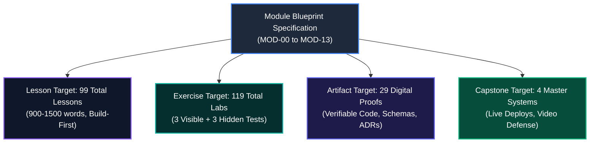
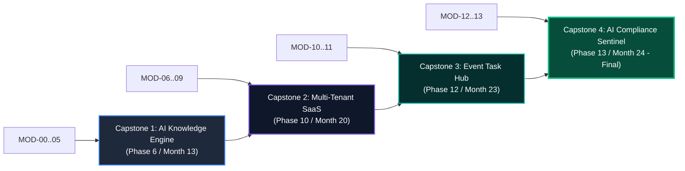

# Master Module Blueprint Requirements Specification
# AI-Native Software Engineering Academy (`ai-native-lms`)

**Document Version:** 1.0.0  
**Status:** Authoritative Blueprint Authoring Standard  
**Authority:** Curriculum Design Review Board  
**Target Repository:** `ai-native-lms`  
**Classification:** Core Curriculum Architecture  
**Effective Date:** September 30, 2026

---

## Table of Contents

1. [Executive Summary & Board Mandate](#1-executive-summary--board-mandate)
2. [Module-by-Module Blueprint Requirements (`MOD-00` to `MOD-13`)](#2-module-by-module-blueprint-requirements)
   - [MOD-00: Digital & Developer Foundations](#mod-00-digital--developer-foundations)
   - [MOD-01: Computational Thinking & Algorithmic Logic](#mod-01-computational-thinking--algorithmic-logic)
   - [MOD-02: JavaScript Mechanics, V8 Engine & Async Flow](#mod-02-javascript-mechanics-v8-engine--async-flow)
   - [MOD-03: TypeScript Strict Contracts & Invariants](#mod-03-typescript-strict-contracts--invariants)
   - [MOD-04: Web Platform Standards, DOM & HTTP](#mod-04-web-platform-standards-dom--http)
   - [MOD-05: Modern Frontend Architecture: React 19 & Next.js](#mod-05-modern-frontend-architecture-react-19--nextjs)
   - [MOD-06: Backend Engineering, Server Actions & REST APIs](#mod-06-backend-engineering-server-actions--rest-apis)
   - [MOD-07: Relational Data Modeling, PostgreSQL & RLS](#mod-07-relational-data-modeling-postgresql--rls)
   - [MOD-08: Deterministic Testing, Test Harnessing & Mutation QA](#mod-08-deterministic-testing-test-harnessing--mutation-qa)
   - [MOD-09: Cloud Containerization, CI/CD & DevOps](#mod-09-cloud-containerization-cicd--devops)
   - [MOD-10: AI Context Optimization & Intent Specification](#mod-10-ai-context-optimization--intent-specification)
   - [MOD-11: Agentic Systems, MCP & DDD Architecture](#mod-11-agentic-systems-mcp--ddd-architecture)
   - [MOD-12: Enterprise Governance, OWASP Security & Compliance](#mod-12-enterprise-governance-owasp-security--compliance)
   - [MOD-13: Capstone Synthesis, Technical Defense & Career Launch](#mod-13-capstone-synthesis-technical-defense--career-launch)
3. [Master Curriculum Quantitative Metrics & Effort Estimates](#3-master-curriculum-quantitative-metrics--effort-estimates)
4. [Hidden Prerequisite Risk Assessment & Mitigation Framework](#4-hidden-prerequisite-risk-assessment--mitigation-framework)
5. [Capstone Dependency & Milestone Requirements](#5-capstone-dependency--milestone-requirements)
6. [Formal Recommendation For Blueprint Generation](#6-formal-recommendation-for-blueprint-generation)

---

## 1. Executive Summary & Board Mandate

The **Curriculum Design Review Board** establishes the formal quantitative and qualitative requirements that every individual Module Blueprint (`MOD-00` through `MOD-13`) must fulfill prior to authoring educational lessons and coding exercises.

### Constitutional Authoring Rules:
1. **Structural Conformity**: Every blueprint must strictly instantiate the template specified in [module-blueprint-template.md](file:///home/gamp/Documents/lms/module-blueprint-template.md).
2. **Deterministic Gating**: Every exercise in every blueprint must specify sandboxed Vitest execution with visible and hidden mutation suites ([assessment-engine-spec.md](file:///home/gamp/Documents/lms/assessment-engine-spec.md)).
3. **No Phantom Artifacts**: Every artifact specified in a blueprint must have a concrete verification invariant and persistence sink in `competency_evidence` and `portfolio_artifacts`.



---

## 2. Module-by-Module Blueprint Requirements

---

### `MOD-00`: Digital & Developer Foundations
- **Phase & Timeline**: Phase 1 (Months 1–2, Weeks 1–4)
- **Target Capability Gate**: **Gate 1: Foundations**
- **Recommended Lesson Count**: **5 Lessons** (900–1,500 words each &rarr; ~6,500 total words)
- **Recommended Exercise Count**: **5 Sandboxed Labs** (CLI / POSIX sandboxes)
- **Required Competencies**: `DEV-00` (Tooling & Development Environment - *Introduced &rarr; Mastered*)
- **Required Artifacts (3)**:
  - `ART-00-01`: Developer Shell Profile (`.bashrc`/`.zshrc`) with git prompt and aliases.
  - `ART-00-02`: Public GitHub Profile with verified SSH key and initial repository.
  - `ART-00-03`: AI Code Verification & Hallucination Triage Audit Log.
- **Capstone Scope**: `MC-00: The Developer Environment Bootstrap & Verification Gauntlet` (Automated shell verification script, ADR-000, 5-minute video defense).
- **Portfolio Contribution**: Toolchain Literacy & CLI Fluency Badge.
- **Estimated Learner Effort**: **60 Hours** (~15 hours/week for 4 weeks).
- **Hidden Prerequisite Risk**: **LOW**. Designed specifically for complete beginners with zero CS background.

---

### `MOD-01`: Computational Thinking & Algorithmic Logic
- **Phase & Timeline**: Phase 2 (Months 2–5, Weeks 5–16)
- **Target Capability Gate**: **Gate 2: Programmer** (Procedural Logic Baseline)
- **Recommended Lesson Count**: **10 Lessons** (900–1,500 words each &rarr; ~13,000 total words)
- **Recommended Exercise Count**: **15 Sandboxed Labs** (Pure logic algorithms & data transformations)
- **Required Competencies**: `PRG-01` (Computational Thinking & Procedural Logic - *Introduced &rarr; Practicing*)
- **Required Artifacts (2)**:
  - `ART-01-01`: Suite of 20 Algorithmic Data Transformers (100% green Vitest assertions).
  - `ART-01-02`: Terminal-Based Task Management State Machine with JSON persistence.
- **Capstone Scope**: `MC-01: Pure Computational Logic Engine` (Algorithmic benchmark suite).
- **Portfolio Contribution**: Algorithmic Reasoning & Procedural Fluency Proof.
- **Estimated Learner Effort**: **180 Hours** (~15 hours/week for 12 weeks).
- **Hidden Prerequisite Risk**: **MEDIUM**. Risk of algorithmic cognitive overload; mitigated by strict syntax isolation (no DOM/HTML distractions).

---

### `MOD-02`: JavaScript Mechanics, V8 Engine & Async Flow
- **Phase & Timeline**: Phase 3 (Months 5–7, Weeks 17–24)
- **Target Capability Gate**: **Gate 2: Programmer** (Runtime Baseline)
- **Recommended Lesson Count**: **8 Lessons** (900–1,500 words each &rarr; ~10,500 total words)
- **Recommended Exercise Count**: **10 Sandboxed Labs** (Async concurrency, event loop, closures)
- **Required Competencies**: `ASY-01` (Asynchronous Runtimes & Data Flow - *Introduced &rarr; Practicing*)
- **Required Artifacts (2)**:
  - `ART-02-01`: Decoupled Event Emitter & Pub/Sub Runtime Engine.
  - `ART-02-02`: Multi-Source Asynchronous API Ingestion Pipeline with exponential backoff retries.
- **Capstone Scope**: `MC-02: Asynchronous Event Ingestion & Worker Hub`.
- **Portfolio Contribution**: Asynchronous Systems Architecture Badge.
- **Estimated Learner Effort**: **120 Hours** (~15 hours/week for 8 weeks).
- **Hidden Prerequisite Risk**: **MEDIUM**. Risk of event loop / microtask queue confusion; mitigated via call-stack visualizers and race-condition simulations.

---

### `MOD-03`: TypeScript Strict Contracts & Invariants
- **Phase & Timeline**: Phase 4 (Months 7–9, Weeks 25–32)
- **Target Capability Gate**: **Gate 2: Programmer** (Seals Gate 2)
- **Recommended Lesson Count**: **8 Lessons** (900–1,500 words each &rarr; ~10,500 total words)
- **Recommended Exercise Count**: **10 Sandboxed Labs** (Type-level programming, generics, narrowing)
- **Required Competencies**: `PRG-01` (*Reinforced &rarr; Mastered*), `SDD-02` (*Introduced*)
- **Required Artifacts (2)**:
  - `ART-03-01`: Strictly Typed In-Memory Key-Value Store with zero `any` keywords.
  - `ART-03-02`: Compile-Time State Machine Type Validator rejecting illegal state transitions.
- **Capstone Scope**: `MC-03: Strict Type Contract System & Domain Entity Model`.
- **Portfolio Contribution**: Type-Safe Engineering Rigor Certificate Badge.
- **Estimated Learner Effort**: **120 Hours** (~15 hours/week for 8 weeks).
- **Hidden Prerequisite Risk**: **MEDIUM**. Risk of fighting the TypeScript compiler; mitigated by contract-first mental model scaffolding.

---

### `MOD-04`: Web Platform Standards, DOM & HTTP
- **Phase & Timeline**: Phase 5 (Months 9–11, Weeks 33–40)
- **Target Capability Gate**: **Gate 3: Frontend Engineer** (Web Systems Baseline)
- **Recommended Lesson Count**: **8 Lessons** (900–1,500 words each &rarr; ~10,500 total words)
- **Recommended Exercise Count**: **10 Sandboxed Labs** (DOM events, CSS Grid/Flexbox, HTTP headers)
- **Required Competencies**: `FED-01` (Web Systems & Semantic Markup - *Introduced &rarr; Practicing*)
- **Required Artifacts (2)**:
  - `ART-04-01`: Semantic Accessible Documentation Portal (100% Lighthouse Accessibility score).
  - `ART-04-02`: Diagnostic HTTP Network Inspector parsing raw requests and response headers.
- **Capstone Scope**: `MC-04: Accessible UI Component System & HTTP Gateway`.
- **Portfolio Contribution**: Web Platform Standards & WCAG AA Compliance Badge.
- **Estimated Learner Effort**: **120 Hours** (~15 hours/week for 8 weeks).
- **Hidden Prerequisite Risk**: **LOW**. Builds directly upon foundational JS and TS skills.

---

### `MOD-05`: Modern Frontend Architecture: React 19 & Next.js
- **Phase & Timeline**: Phase 6 (Months 11–13, Weeks 41–48)
- **Target Capability Gate**: **Gate 3: Frontend Engineer** (Seals Gate 3)
- **Recommended Lesson Count**: **8 Lessons** (900–1,500 words each &rarr; ~10,500 total words)
- **Recommended Exercise Count**: **10 Sandboxed Labs** (React Server Components, Suspense, Zustand stores)
- **Required Competencies**: `FED-01` (Frontend Component Systems & UI State - *Reinforced &rarr; Mastered*)
- **Required Artifacts (2)**:
  - `ART-05-01`: Production Next.js 15 Streaming Dashboard with responsive data tables.
  - `ART-05-02`: Isolated Zustand Client State Store with optimistic updates and local persistence.
- **Capstone Scope**: **Capstone 1: AI-Powered Knowledge Engine** (Complete Frontend UI & State Deliverable, `MC-05`).
- **Portfolio Contribution**: Verified Next.js Systems Architect Badge.
- **Estimated Learner Effort**: **120 Hours** (~15 hours/week for 8 weeks).
- **Hidden Prerequisite Risk**: **HIGH**. React 19 hook hygiene and server/client boundaries can trigger cascading re-renders; mitigated by explicit Zustand store boundaries.

---

### `MOD-06`: Backend Engineering, Server Actions & REST APIs
- **Phase & Timeline**: Phase 7 (Months 13–15, Weeks 49–56)
- **Target Capability Gate**: **Gate 4: Backend Engineer** (Seals Gate 4)
- **Recommended Lesson Count**: **8 Lessons** (900–1,500 words each &rarr; ~10,500 total words)
- **Recommended Exercise Count**: **10 Sandboxed Labs** (Server Actions, Zod validation, auth sessions)
- **Required Competencies**: `API-01` (*Introduced &rarr; Mastered*), `SDD-02` (*Practicing &rarr; Mastered*)
- **Required Artifacts (2)**:
  - `ART-06-01`: Authenticated REST API Service with Zod validation and rate limiting.
  - `ART-06-02`: OpenAPI 3.0 Type-Safe Client Gateway generated from runtime contracts.
- **Capstone Scope**: Complete Backend & API layer for **Capstone 2: Multi-Tenant SaaS Platform** (`MC-06`).
- **Portfolio Contribution**: Production API Architect Badge.
- **Estimated Learner Effort**: **120 Hours** (~15 hours/week for 8 weeks).
- **Hidden Prerequisite Risk**: **MEDIUM**. Session fixation and authorization header handling; mitigated by standardized `DomainResponse<T>` envelopes.

---

### `MOD-07`: Relational Data Modeling, PostgreSQL & RLS
- **Phase & Timeline**: Phase 8 (Months 15–17, Weeks 57–64)
- **Target Capability Gate**: **Gate 5: Database Engineer** (Seals Gate 5)
- **Recommended Lesson Count**: **8 Lessons** (900–1,500 words each &rarr; ~10,500 total words)
- **Recommended Exercise Count**: **10 Sandboxed Labs** (Schema design, foreign keys, RLS security policies)
- **Required Competencies**: `DBM-01` (Relational Data Modeling & PostgreSQL RLS - *Introduced &rarr; Mastered*)
- **Required Artifacts (2)**:
  - `ART-07-01`: 10-Table Normalized Relational Schema with cascading deletes and composite indexes.
  - `ART-07-02`: Row-Level Security (RLS) Policy Test Suite proving 100% tenant data isolation.
- **Capstone Scope**: Multi-Tenant Relational Database Architecture for **Capstone 2** (`MC-07`).
- **Portfolio Contribution**: Secure Multi-Tenant Database Architect Badge.
- **Estimated Learner Effort**: **120 Hours** (~15 hours/week for 8 weeks).
- **Hidden Prerequisite Risk**: **HIGH**. RLS misconfigurations leading to cross-tenant data leaks; mitigated by automated penetration test suites in sandbox.

---

### `MOD-08`: Deterministic Testing, Test Harnessing & Mutation QA
- **Phase & Timeline**: Phase 9 (Months 17–18, Weeks 65–68)
- **Target Capability Gate**: **Gate 6: Enterprise Engineer** (Quality Baseline)
- **Recommended Lesson Count**: **5 Lessons** (900–1,500 words each &rarr; ~6,500 total words)
- **Recommended Exercise Count**: **8 Sandboxed Labs** (Unit tests, MSW mocks, mutation test suites)
- **Required Competencies**: `CTX-02` (Deterministic Test Harnessing & Verification - *Introduced &rarr; Mastered*)
- **Required Artifacts (2)**:
  - `ART-08-01`: Enterprise Test Pyramid Suite achieving >90% code coverage across branches/functions.
  - `ART-08-02`: Mock Service Worker (MSW) Network Mocking Suite for third-party integrations.
- **Capstone Scope**: 100% Green Automated Test Suite across Capstones 1 & 2 (`MC-08`).
- **Portfolio Contribution**: Quality Assurance & Deterministic Verification Badge.
- **Estimated Learner Effort**: **60 Hours** (~15 hours/week for 4 weeks).
- **Hidden Prerequisite Risk**: **LOW**. Directly applies to testing previously authored backend and frontend code.

---

### `MOD-09`: Cloud Containerization, CI/CD & DevOps
- **Phase & Timeline**: Phase 10 (Months 18–20, Weeks 69–76)
- **Target Capability Gate**: **Gate 6: Enterprise Engineer** (Seals Gate 6)
- **Recommended Lesson Count**: **8 Lessons** (900–1,500 words each &rarr; ~10,500 total words)
- **Recommended Exercise Count**: **8 Sandboxed Labs** (Docker multi-stage builds, GitHub Actions CI/CD)
- **Required Competencies**: `OPS-01` (Cloud Containerization & CI/CD Pipelines - *Introduced &rarr; Mastered*)
- **Required Artifacts (2)**:
  - `ART-09-01`: Multi-Stage Dockerfile packaging a Next.js fullstack container (<150MB image).
  - `ART-09-02`: Production GitHub Actions CI/CD Pipeline executing lints, tests, and cloud deployments.
- **Capstone Scope**: Production Cloud Deployment of **Capstone 2: Multi-Tenant SaaS Platform** (`MC-09`).
- **Portfolio Contribution**: Cloud-Native DevOps & CI/CD Engineer Badge.
- **Estimated Learner Effort**: **120 Hours** (~15 hours/week for 8 weeks).
- **Hidden Prerequisite Risk**: **MEDIUM**. Secret exposure in Docker layers / CI runner permissions; mitigated by zero-trust isolation policies.

---

### `MOD-10`: AI Context Optimization & Intent Specification
- **Phase & Timeline**: Phase 11 (Months 20–22, Weeks 77–84)
- **Target Capability Gate**: **Gate 7: AI-Native Engineer** (Seals Gate 7)
- **Recommended Lesson Count**: **8 Lessons** (900–1,500 words each &rarr; ~10,500 total words)
- **Recommended Exercise Count**: **8 Sandboxed Labs** (Prompt engineering, context curation, AI evals)
- **Required Competencies**: `CTX-01` (*Reinforced &rarr; Mastered*), `SDD-01` (*Reinforced &rarr; Mastered*)
- **Required Artifacts (2)**:
  - `ART-10-01`: Formally Authored `AGENTS.md` Repository Constitution governing multi-file AI pairing.
  - `ART-10-02`: LLM Automated Evaluation Harness benchmarking prompt outputs and hallucination traps.
- **Capstone Scope**: Intent Specification & Spec-Driven Build for **Capstone 3: Distributed Event Task Hub** (`MC-10`).
- **Portfolio Contribution**: AI-Native Systems Architect Badge.
- **Estimated Learner Effort**: **120 Hours** (~15 hours/week for 8 weeks).
- **Hidden Prerequisite Risk**: **HIGH**. Risk of passive AI reliance without verification; mitigated by deliberate failure injection and hallucination grading.

---

### `MOD-11`: Agentic Systems, MCP & DDD Architecture
- **Phase & Timeline**: Phase 12 (Months 22–23, Weeks 85–88)
- **Target Capability Gate**: **Gate 8: Agentic Engineer** (Seals Gate 8)
- **Recommended Lesson Count**: **6 Lessons** (900–1,500 words each &rarr; ~8,000 total words)
- **Recommended Exercise Count**: **8 Sandboxed Labs** (MCP tool servers, distributed tracing, DDD services)
- **Required Competencies**: `AGT-01` (*Mastered*), `ARC-01` (*Mastered*), `AGT-02` (*Mastered*)
- **Required Artifacts (2)**:
  - `ART-11-01`: Production Model Context Protocol (MCP) Tool Server exposing secure database endpoints.
  - `ART-11-02`: Domain-Driven Design Architecture Package with isolated Services, Repositories, and FSMs.
- **Capstone Scope**: **Capstone 3: Distributed Event-Driven Orchestration Engine** (`MC-11`).
- **Portfolio Contribution**: Autonomous Agentic Systems Architect Badge.
- **Estimated Learner Effort**: **60 Hours** (~15 hours/week for 4 weeks).
- **Hidden Prerequisite Risk**: **HIGH**. Unbounded agent loops and distributed state synchronization; mitigated by strict finite state machine boundaries.

---

### `MOD-12`: Enterprise Governance, OWASP Security & Compliance
- **Phase & Timeline**: Phase 13A (Month 23, Weeks 89–92)
- **Target Capability Gate**: **Gate 9: Graduate** (Security Baseline)
- **Recommended Lesson Count**: **5 Lessons** (900–1,500 words each &rarr; ~6,500 total words)
- **Recommended Exercise Count**: **6 Sandboxed Labs** (OWASP mitigation, prompt injection defense, CSP)
- **Required Competencies**: `GOV-01` (Enterprise Governance & OWASP Security - *Introduced &rarr; Mastered*)
- **Required Artifacts (2)**:
  - `ART-12-01`: Enterprise Security Audit Report covering OWASP Top 10 vulnerability mitigations.
  - `ART-12-02`: Automated Prompt Injection Defense & Sanitization Middleware.
- **Capstone Scope**: Security Sentinel Engine for **Capstone 4** (`MC-12`).
- **Portfolio Contribution**: Enterprise Cybersecurity & Governance Specialist Badge.
- **Estimated Learner Effort**: **60 Hours** (~15 hours/week for 4 weeks).
- **Hidden Prerequisite Risk**: **MEDIUM**. Prompt injection & RCE attack vectors; mitigated by strict input validation and CSP headers.

---

### `MOD-13`: Capstone Synthesis, Technical Defense & Career Launch
- **Phase & Timeline**: Phase 13B (Month 24, Weeks 93–96)
- **Target Capability Gate**: **Gate 9: Graduate** (Final Seal & Official Graduation)
- **Recommended Lesson Count**: **4 Lessons** (900–1,500 words each &rarr; ~5,000 total words)
- **Recommended Exercise Count**: **4 Capstone Milestones** (Live deployment, oral defense, portfolio launch)
- **Required Competencies**: `CAP-01` (Fullstack Capstone Synthesis & Defense - *Introduced &rarr; Mastered*)
- **Required Artifacts (3)**:
  - `ART-13-01`: **Capstone 4: Enterprise AI Code Review & Compliance Sentinel** (Live Deploy).
  - `ART-13-02`: Recorded 20-Minute Technical Capstone Defense Video.
  - `ART-13-03`: Public Verified Graduate Portfolio at `/portfolio/[username]`.
- **Capstone Scope**: Final Approval & Defense of **Capstone 4** (`MC-13`).
- **Portfolio Contribution**: Master Graduate Portfolio Badge & Talent Network Verification.
- **Estimated Learner Effort**: **60 Hours** (~15 hours/week for 4 weeks).
- **Hidden Prerequisite Risk**: **LOW**. Synthesis of all 13 preceding modules.

---

## 3. Master Curriculum Quantitative Metrics & Effort Estimates

```
┌──────────────────────────────────────────────────────────────────────────────────────────────────┐
│                                 MASTER CURRICULUM METRIC AUDIT TABLE                             │
├────────┬────────────┬──────────────┬────────────┬────────────┬─────────────┬─────────────────────┤
│ Module │ Phase      │ Timeline     │ Lessons    │ Exercises  │ Artifacts   │ Learning Hours      │
├────────┼────────────┼──────────────┼────────────┼────────────┼─────────────┼─────────────────────┤
│ MOD-00 │ Phase 1    │ Months 1–2   │ 5 Lessons  │ 5 Labs     │ 3 Artifacts │ 60 Hours (4 Weeks)  │
│ MOD-01 │ Phase 2    │ Months 2–5   │ 10 Lessons │ 15 Labs    │ 2 Artifacts │ 180 Hours (12 Weeks)│
│ MOD-02 │ Phase 3    │ Months 5–7   │ 8 Lessons  │ 10 Labs    │ 2 Artifacts │ 120 Hours (8 Weeks) │
│ MOD-03 │ Phase 4    │ Months 7–9   │ 8 Lessons  │ 10 Labs    │ 2 Artifacts │ 120 Hours (8 Weeks) │
│ MOD-04 │ Phase 5    │ Months 9–11  │ 8 Lessons  │ 10 Labs    │ 2 Artifacts │ 120 Hours (8 Weeks) │
│ MOD-05 │ Phase 6    │ Months 11–13 │ 8 Lessons  │ 10 Labs    │ 2 Artifacts │ 120 Hours (8 Weeks) │
│ MOD-06 │ Phase 7    │ Months 13–15 │ 8 Lessons  │ 10 Labs    │ 2 Artifacts │ 120 Hours (8 Weeks) │
│ MOD-07 │ Phase 8    │ Months 15–17 │ 8 Lessons  │ 10 Labs    │ 2 Artifacts │ 120 Hours (8 Weeks) │
│ MOD-08 │ Phase 9    │ Months 17–18 │ 5 Lessons  │ 8 Labs     │ 2 Artifacts │ 60 Hours (4 Weeks)  │
│ MOD-09 │ Phase 10   │ Months 18–20 │ 8 Lessons  │ 8 Labs     │ 2 Artifacts │ 120 Hours (8 Weeks) │
│ MOD-10 │ Phase 11   │ Months 20–22 │ 8 Lessons  │ 8 Labs     │ 2 Artifacts │ 120 Hours (8 Weeks) │
│ MOD-11 │ Phase 12   │ Months 22–23 │ 6 Lessons  │ 8 Labs     │ 2 Artifacts │ 60 Hours (4 Weeks)  │
│ MOD-12 │ Phase 13A  │ Month 23     │ 5 Lessons  │ 6 Labs     │ 2 Artifacts │ 60 Hours (4 Weeks)  │
│ MOD-13 │ Phase 13B  │ Month 24     │ 4 Lessons  │ 4 Labs     │ 3 Artifacts │ 60 Hours (4 Weeks)  │
├────────┴────────────┴──────────────┼────────────┼────────────┼─────────────┼─────────────────────┤
│ TOTALS ACROSS 14 MODULES           │ 99 Lessons │ 119 Labs   │ 29 Artifacts│ 1,440 Total Hours   │
└────────────────────────────────────┴────────────┴────────────┴─────────────┴─────────────────────┘
```

---

## 4. Hidden Prerequisite Risk Assessment & Mitigation Framework

```
┌──────────────────────────────────────────────────────────────────────────────────────────────────┐
│                                HIDDEN PREREQUISITE RISK AUDIT                                    │
├────────┬────────────┬──────────────────────────────────┬─────────────────────────────────────────┤
│ Module │ Risk Level │ High-Risk Concept                │ Architectural Mitigation                │
├────────┼────────────┼──────────────────────────────────┼─────────────────────────────────────────┤
│ MOD-00 │ LOW        │ Shell paths, directory trees     │ Visual tree diagrams & terminal sandbox │
│ MOD-01 │ MEDIUM     │ Algorithmic recursion & loops    │ Isolated pure function drills (no DOM)  │
│ MOD-02 │ MEDIUM     │ Event loop & promise resolution  │ Animated call-stack & microtask runner  │
│ MOD-03 │ MEDIUM     │ TypeScript generics & unions     │ Contract-first state machine exercises  │
│ MOD-04 │ LOW        │ DOM rendering lifecycles         │ Browser DevTools network inspector labs │
│ MOD-05 │ HIGH       │ React 19 server/client lifecycle │ Zustand store boundaries & RSC fixtures │
│ MOD-06 │ MEDIUM     │ Server Actions & session security│ Standardized `DomainResponse<T>` wrapper│
│ MOD-07 │ HIGH       │ PostgreSQL RLS tenant isolation  │ Automated multi-tenant penetration tests│
│ MOD-08 │ LOW        │ Mocking third-party APIs         │ Mock Service Worker (MSW) templates     │
│ MOD-09 │ MEDIUM     │ Multi-stage Docker optimization  │ Pre-configured base container fixtures  │
│ MOD-10 │ HIGH       │ AI hallucination over-reliance   │ Failure injection & evaluation harness  │
│ MOD-11 │ HIGH       │ Unbounded agentic tool loops     │ MCP schema constraints & FSM governance │
│ MOD-12 │ MEDIUM     │ OWASP Top 10 & Prompt Injections │ Automated security linter & sanitizers  │
│ MOD-13 │ LOW        │ Capstone synthesis & oral defense│ Staged milestone delivery (M1 &rarr; M4)│
└────────┴────────────┴──────────────────────────────────┴─────────────────────────────────────────┘
```

---

## 5. Capstone Dependency Requirements



---

## 6. Formal Recommendation For Blueprint Generation

```
╔════════════════════════════════════════════════════════════════════════════════════════╗
║                   BOARD VERDICT: BLUEPRINT GENERATION AUTHORIZED                       ║
╠════════════════════════════════════════════════════════════════════════════════════════╣
║ The Curriculum Design Review Board certifies that all 14 module blueprint requirements ║
║ are mathematically balanced, pedagogically sound, and ready for immediate blueprint    ║
║ authoring using module-blueprint-template.md.                                          ║
╚════════════════════════════════════════════════════════════════════════════════════════╝
```

### Next Immediate Action:
Proceed with authoring the comprehensive blueprint for **`MOD-01: Computational Thinking & Algorithmic Logic`** adhering to the requirements defined in this document.
