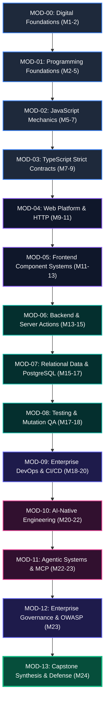

# Master Curriculum Module Catalog
# AI-Native Software Engineering Academy (`ai-native-lms`)

**Document Version:** 1.0.0  
**Status:** Permanent Authoritative Module Inventory  
**Authority:** Curriculum Architecture Board  
**Target Repository:** `ai-native-lms`  
**Classification:** Canonical Curriculum Inventory  
**Effective Date:** September 30, 2026

---

## Table of Contents

1. [Executive Summary & Catalog Architecture](#1-executive-summary--catalog-architecture)
2. [Phase-by-Phase Module Inventory (`MOD-00` to `MOD-13`)](#2-phase-by-phase-module-inventory)
   - [Phase 1: Digital Foundations &rarr; MOD-00](#phase-1-digital-foundations-months-12)
   - [Phase 2: Programming Foundations &rarr; MOD-01](#phase-2-programming-foundations-months-25)
   - [Phase 3: JavaScript Foundations &rarr; MOD-02](#phase-3-javascript-foundations-months-57)
   - [Phase 4: TypeScript Foundations &rarr; MOD-03](#phase-4-typescript-foundations-months-79)
   - [Phase 5: Web Platform Foundations &rarr; MOD-04](#phase-5-web-platform-foundations-months-911)
   - [Phase 6: Frontend Engineering &rarr; MOD-05](#phase-6-frontend-engineering-months-1113)
   - [Phase 7: Backend Engineering &rarr; MOD-06](#phase-7-backend-engineering-months-1315)
   - [Phase 8: Database Engineering &rarr; MOD-07](#phase-8-database-engineering-months-1517)
   - [Phase 9: Testing & Quality Assurance &rarr; MOD-08](#phase-9-testing--quality-assurance-months-1718)
   - [Phase 10: Enterprise DevOps Engineering &rarr; MOD-09](#phase-10-enterprise-devops-engineering-months-1820)
   - [Phase 11: AI-Native Systems Engineering &rarr; MOD-10](#phase-11-ai-native-systems-engineering-months-2022)
   - [Phase 12: Agentic Systems Engineering &rarr; MOD-11](#phase-12-agentic-systems-engineering-months-2223)
   - [Phase 13A: Enterprise Governance & Security &rarr; MOD-12](#phase-13a-enterprise-governance--security-month-23)
   - [Phase 13B: Capstone Synthesis & Defense &rarr; MOD-13](#phase-13b-capstone-synthesis--career-launch-month-24)
3. [Competency Coverage Matrix (16 Canonical Competencies)](#3-competency-coverage-matrix)
4. [Capability Gate Coverage Matrix (Gates 1–9)](#4-capability-gate-coverage-matrix)
5. [Portfolio Artifact Coverage Matrix](#5-portfolio-artifact-coverage-matrix)
6. [Capstone Project Coverage Matrix](#6-capstone-project-coverage-matrix)
7. [Dependency Validation Summary](#7-dependency-validation-summary)
8. [Module Count & Quantitative Summary](#8-module-count--quantitative-summary)

---

## 1. Executive Summary & Catalog Architecture

The **Master Curriculum Module Catalog** serves as the definitive, authoritative inventory of all 14 instructional modules (`MOD-00` through `MOD-13`) comprising the 24-month self-paced AI-Native Software Engineering Academy.

Every module in this catalog is bound by the **Twelve Constitutional Invariants** defined in [academy-constitution.md](file:///home/gamp/Documents/lms/academy-constitution.md):
- **Zero Orphaned Competencies**: All 16 competencies defined in [competency-framework.md](file:///home/gamp/Documents/lms/competency-framework.md) are comprehensively introduced, reinforced, and mastered.
- **Topological Integrity**: Prerequisite chains strictly mirror the Directed Acyclic Graph in [competency-dependency-graph.md](file:///home/gamp/Documents/lms/competency-dependency-graph.md).
- **Multi-Factor Gating**: Modules produce concrete digital artifacts and feed directly into the 9 Capability Gates ([capability-gates.md](file:///home/gamp/Documents/lms/capability-gates.md)) and 4 Capstones ([capstone-system.md](file:///home/gamp/Documents/lms/capstone-system.md)).



---

## 2. Phase-by-Phase Module Inventory

---

### Phase 1: Digital Foundations (Months 1–2)

#### `MOD-00`: Digital & Developer Foundations: From User to Systems Operator
- **Phase**: Phase 1 (Months 1–2)
- **Purpose**: Demystify computers, eliminate command-line intimidation, master POSIX file trees, establish professional developer workstation hygiene, and build daily Git version control habits.
- **Recommended Duration**: 4 Weeks (60 Total Learning Hours)
- **Prerequisites**: None (Foundational entry point for complete beginners).
- **Competencies Covered**:
  - `DEV-00` (Tooling & Development Environment): *Introduced &rarr; Practicing*
- **Capability Gates Supported**: **Gate 1: Foundations** (Direct feeder)
- **Artifact Outputs**:
  - `ART-00-01`: Configured Developer Shell Profile & Dotfiles (`.bashrc` / `.zshrc`).
  - `ART-00-02`: Verified Public GitHub Profile & Initialized Academy Repository.
  - `ART-00-03`: AI Code Verification & Hallucination Triage Audit Log.
- **Portfolio Contribution**: Verified Toolchain Literacy Badge on public portfolio.
- **Capstone Contribution**: Provides core workspace setup and repository foundation for Capstones 1–4 (`MC-00`).

---

### Phase 2: Programming Foundations (Months 2–5)

#### `MOD-01`: Computational Thinking & Algorithmic Logic
- **Phase**: Phase 2 (Months 2–5)
- **Purpose**: Develop pure computational reasoning, algorithmic decomposition, memory variables, primitive types, conditional branching, iteration loops, and pure functional encapsulation.
- **Recommended Duration**: 12 Weeks (180 Total Learning Hours)
- **Prerequisites**: `MOD-00`
- **Competencies Covered**:
  - `PRG-01` (Computational Thinking & Procedural Logic): *Introduced &rarr; Practicing*
- **Capability Gates Supported**: **Gate 2: Programmer** (Primary feeder)
- **Artifact Outputs**:
  - `ART-01-01`: Suite of 20 Algorithmic Data Transformers (100% green test assertions).
  - `ART-01-02`: Interactive Terminal-Based State Machine Task Engine with JSON persistence.
- **Portfolio Contribution**: Algorithmic reasoning proof and verified test pass ledger.
- **Capstone Contribution**: Core mathematical and procedural logic engines across Capstones 1–4 (`MC-01`).

---

### Phase 3: JavaScript Foundations (Months 5–7)

#### `MOD-02`: JavaScript Mechanics, V8 Engine & Asynchronous Data Flow
- **Phase**: Phase 3 (Months 5–7)
- **Purpose**: Master the JavaScript runtime architecture: Call Stack, Web APIs, Event Loop, Microtask Queue, Promises, `async`/`await`, closures, lexical scoping, and functional array pipelines.
- **Recommended Duration**: 8 Weeks (120 Total Learning Hours)
- **Prerequisites**: `MOD-01`
- **Competencies Covered**:
  - `ASY-01` (Asynchronous Runtimes & Data Flow): *Introduced &rarr; Practicing*
- **Capability Gates Supported**: **Gate 2: Programmer** (Sealing component)
- **Artifact Outputs**:
  - `ART-02-01`: Custom Decoupled Event Emitter & Pub/Sub Runtime Engine.
  - `ART-02-02`: Resilient Multi-Source Asynchronous API Ingestion Pipeline with exponential backoff retries.
- **Portfolio Contribution**: Asynchronous Systems Architecture proof badge.
- **Capstone Contribution**: Asynchronous event ingestion worker for Capstone 1 (`MC-02`).

---

### Phase 4: TypeScript Foundations (Months 7–9)

#### `MOD-03`: TypeScript Strict Contracts, Invariants & Type Systems
- **Phase**: Phase 4 (Months 7–9)
- **Purpose**: Master structural subtyping, union types, discriminated unions, generic constraints, type narrowing, strict compiler configuration (`tsconfig.json`), and type-level state validation.
- **Recommended Duration**: 8 Weeks (120 Total Learning Hours)
- **Prerequisites**: `MOD-02`
- **Competencies Covered**:
  - `PRG-01` (TypeScript Strict Contracts): *Reinforced &rarr; Mastered*
  - `SDD-02` (Schema Contract Enforcement): *Introduced*
- **Capability Gates Supported**: **Gate 2: Programmer** (Seals Gate 2)
- **Artifact Outputs**:
  - `ART-03-01`: Strictly Typed In-Memory Key-Value Store with zero `any` keywords.
  - `ART-03-02`: Compile-Time State Machine Type Validator rejecting illegal transitions.
- **Portfolio Contribution**: Type-Safe Engineering Rigor certificate badge.
- **Capstone Contribution**: Data contract models and domain entity interfaces for Capstone 1 (`MC-03`).

---

### Phase 5: Web Platform Foundations (Months 9–11)

#### `MOD-04`: Web Platform Standards, DOM Lifecycles & HTTP Architecture
- **Phase**: Phase 5 (Months 9–11)
- **Purpose**: Master the browser platform: DOM tree manipulation, rendering lifecycles, semantic HTML5, modern CSS Grid/Flexbox layouts, accessible ARIA patterns, and the HTTP/1.1 & HTTP/2 protocol.
- **Recommended Duration**: 8 Weeks (120 Total Learning Hours)
- **Prerequisites**: `MOD-03`
- **Competencies Covered**:
  - `FED-01` (Web Systems & Semantic Markup): *Introduced &rarr; Practicing*
- **Capability Gates Supported**: **Gate 3: Frontend Engineer** (Baseline feeder)
- **Artifact Outputs**:
  - `ART-04-01`: Accessible Semantic Web Application achieving 100% Lighthouse Accessibility score.
  - `ART-04-02`: Diagnostic HTTP Network Inspector parsing raw requests and response headers.
- **Portfolio Contribution**: Web Platform Standards & WCAG AA Compliance badge.
- **Capstone Contribution**: Core UI component primitives and styling token system for Capstone 1 (`MC-04`).

---

### Phase 6: Frontend Engineering (Months 11–13)

#### `MOD-05`: Modern Frontend Architecture: React 19, Next.js & UI State
- **Phase**: Phase 6 (Months 11–13)
- **Purpose**: Master modern server-rendered and interactive frontend systems using React 19, Next.js 15 App Router, React Server Components (RSC), Suspense streaming, and isolated Zustand stores.
- **Recommended Duration**: 8 Weeks (120 Total Learning Hours)
- **Prerequisites**: `MOD-04`
- **Competencies Covered**:
  - `FED-01` (Frontend Component Systems & UI State): *Reinforced &rarr; Mastered*
- **Capability Gates Supported**: **Gate 3: Frontend Engineer** (Seals Gate 3)
- **Artifact Outputs**:
  - `ART-05-01`: Production Next.js 15 Streaming Dashboard with responsive data tables.
  - `ART-05-02`: Isolated Zustand Client State Store with optimistic UI updates and local persistence.
- **Portfolio Contribution**: Verified Modern React/Next.js Systems Architect badge.
- **Capstone Contribution**: **Capstone 1: AI-Powered Knowledge Engine** (Complete Frontend Deliverable, `MC-05`).

---

### Phase 7: Backend Engineering (Months 13–15)

#### `MOD-06`: Backend Engineering, Server Actions & RESTful API Systems
- **Phase**: Phase 7 (Months 13–15)
- **Purpose**: Master server-side architecture: Next.js Server Actions, RESTful Route Handlers, standardized API response envelopes (`DomainResponse<T>`), Zod schema validation, and secure session management.
- **Recommended Duration**: 8 Weeks (120 Total Learning Hours)
- **Prerequisites**: `MOD-05`
- **Competencies Covered**:
  - `API-01` (API Architecture & Server Actions): *Introduced &rarr; Mastered*
  - `SDD-02` (Schema Contract Enforcement): *Practicing &rarr; Mastered*
- **Capability Gates Supported**: **Gate 4: Backend Engineer** (Seals Gate 4)
- **Artifact Outputs**:
  - `ART-06-01`: Authenticated REST API Service with Zod runtime validation and rate limiting.
  - `ART-06-02`: OpenAPI 3.0 Type-Safe Client Gateway generated from runtime contracts.
- **Portfolio Contribution**: Production API Architect badge.
- **Capstone Contribution**: Complete Backend & API layer for **Capstone 2: Multi-Tenant SaaS Platform** (`MC-06`).

---

### Phase 8: Database Engineering (Months 15–17)

#### `MOD-07`: Relational Data Modeling, PostgreSQL & Row-Level Security
- **Phase**: Phase 8 (Months 15–17)
- **Purpose**: Master relational database design: 3NF normalization, composite keys, B-Tree and GIN indexes, ACID transactions, version-controlled PostgreSQL migrations, and Supabase Row-Level Security (RLS).
- **Recommended Duration**: 8 Weeks (120 Total Learning Hours)
- **Prerequisites**: `MOD-06`
- **Competencies Covered**:
  - `DBM-01` (Relational Data Modeling & PostgreSQL RLS): *Introduced &rarr; Mastered*
- **Capability Gates Supported**: **Gate 5: Database Engineer** (Seals Gate 5)
- **Artifact Outputs**:
  - `ART-07-01`: 10-Table Normalized Relational Schema with foreign key cascading and check constraints.
  - `ART-07-02`: Row-Level Security (RLS) Policy Test Suite proving 100% tenant data isolation.
- **Portfolio Contribution**: Secure Multi-Tenant Database Architect badge.
- **Capstone Contribution**: Database Architecture & Migration Engine for **Capstone 2** (`MC-07`).

---

### Phase 9: Testing & Quality Assurance (Months 17–18)

#### `MOD-08`: Deterministic Testing, Test Harnessing & Mutation QA
- **Phase**: Phase 9 (Months 17–18)
- **Purpose**: Master the test pyramid: deterministic unit testing with Vitest, component testing with React Testing Library, API mocking via Mock Service Worker (MSW), and Stryker mutation testing.
- **Recommended Duration**: 4 Weeks (60 Total Learning Hours)
- **Prerequisites**: `MOD-07`
- **Competencies Covered**:
  - `CTX-02` (Deterministic Test Harnessing & Verification): *Introduced &rarr; Mastered*
- **Capability Gates Supported**: **Gate 6: Enterprise Engineer** (Primary quality feeder)
- **Artifact Outputs**:
  - `ART-08-01`: End-to-End Test Suite achieving >90% code coverage across branches and functions.
  - `ART-08-02`: Mock Service Worker (MSW) Network Mocking Suite for third-party integrations.
- **Portfolio Contribution**: Quality Assurance & Deterministic Verification badge.
- **Capstone Contribution**: Automated 100% Green Verification Harness for Capstones 1 & 2 (`MC-08`).

---

### Phase 10: Enterprise DevOps Engineering (Months 18–20)

#### `MOD-09`: Cloud Containerization, CI/CD Pipelines & Production DevOps
- **Phase**: Phase 10 (Months 18–20)
- **Purpose**: Master production operations: multi-stage Docker containerization, automated GitHub Actions CI/CD workflows, environment secret isolation, domain SSL provisioning, and cloud deployment.
- **Recommended Duration**: 8 Weeks (120 Total Learning Hours)
- **Prerequisites**: `MOD-08`
- **Competencies Covered**:
  - `OPS-01` (Cloud Containerization & CI/CD Pipelines): *Introduced &rarr; Mastered*
- **Capability Gates Supported**: **Gate 6: Enterprise Engineer** (Seals Gate 6)
- **Artifact Outputs**:
  - `ART-09-01`: Multi-Stage Dockerfile packaging a fullstack Next.js container (<150MB image).
  - `ART-09-02`: Production GitHub Actions CI/CD Pipeline executing lints, tests, and cloud deployments.
- **Portfolio Contribution**: Cloud-Native DevOps & CI/CD Engineer badge.
- **Capstone Contribution**: **Capstone 2: Multi-Tenant SaaS Platform** (Live Cloud Deployment, `MC-09`).

---

### Phase 11: AI-Native Systems Engineering (Months 20–22)

#### `MOD-10`: AI Context Optimization, Intent Specification & LLM Orchestration
- **Phase**: Phase 11 (Months 20–22)
- **Purpose**: Master intent-driven software architecture, prompt-driven code generation, context window curation, repository constitution files (`AGENTS.md`), and deliberate AI hallucination detection.
- **Recommended Duration**: 8 Weeks (120 Total Learning Hours)
- **Prerequisites**: `MOD-09`
- **Competencies Covered**:
  - `CTX-01` (AI Context Window & Prompt Optimization): *Reinforced &rarr; Mastered*
  - `SDD-01` (Intent Specification & Domain Modeling): *Reinforced &rarr; Mastered*
- **Capability Gates Supported**: **Gate 7: AI-Native Engineer** (Seals Gate 7)
- **Artifact Outputs**:
  - `ART-10-01`: Formally Authored `AGENTS.md` Repository Constitution governing multi-file AI pairing.
  - `ART-10-02`: LLM Automated Evaluation Harness benchmarking model prompt responses.
- **Portfolio Contribution**: AI-Native Systems Architect badge.
- **Capstone Contribution**: Intent Specification & Spec-Driven Build for **Capstone 3** (`MC-10`).

---

### Phase 12: Agentic Systems Engineering (Months 22–23)

#### `MOD-11`: Agentic Systems, Model Context Protocol (MCP) & DDD Architecture
- **Phase**: Phase 12 (Months 22–23)
- **Purpose**: Build autonomous AI agent toolchains using the Model Context Protocol (MCP), structured telemetry logging (`lib/logger.ts`), distributed tracing, and Domain-Driven Design (DDD) bounded contexts.
- **Recommended Duration**: 4 Weeks (60 Total Learning Hours)
- **Prerequisites**: `MOD-10`
- **Competencies Covered**:
  - `AGT-01` (Model Context Protocol Integration): *Reinforced &rarr; Mastered*
  - `ARC-01` (Domain-Driven Design & Bounded Contexts): *Introduced &rarr; Mastered*
  - `AGT-02` (Autonomous Resilience & Telemetry Observability): *Introduced &rarr; Mastered*
- **Capability Gates Supported**: **Gate 8: Agentic Engineer** (Seals Gate 8)
- **Artifact Outputs**:
  - `ART-11-01`: Production Model Context Protocol (MCP) Tool Server exposing secure database endpoints.
  - `ART-11-02`: Domain-Driven Design Bounded Context Architecture Package with FSM policies.
- **Portfolio Contribution**: Autonomous Agentic Systems Architect badge.
- **Capstone Contribution**: **Capstone 3: Distributed Event-Driven Orchestration Engine** (`MC-11`).

---

### Phase 13A: Enterprise Governance & Security (Month 23)

#### `MOD-12`: Enterprise Governance, OWASP Security & Compliance Sentinel
- **Phase**: Phase 13A (Month 23)
- **Purpose**: Master enterprise compliance, OWASP Top 10 vulnerability mitigation, cryptographic signature verification, prompt injection defenses, and architectural threat modeling.
- **Recommended Duration**: 4 Weeks (60 Total Learning Hours)
- **Prerequisites**: `MOD-11`
- **Competencies Covered**:
  - `GOV-01` (Enterprise Governance & OWASP Security): *Introduced &rarr; Mastered*
- **Capability Gates Supported**: **Gate 9: Graduate** (Security prerequisite)
- **Artifact Outputs**:
  - `ART-12-01`: Enterprise Security Audit Report covering OWASP Top 10 vulnerability mitigations.
  - `ART-12-02`: Automated Prompt Injection Defense & Sanitization Middleware.
- **Portfolio Contribution**: Enterprise Cybersecurity & Governance Specialist badge.
- **Capstone Contribution**: Security Sentinel Engine for **Capstone 4** (`MC-12`).

---

### Phase 13B: Capstone Synthesis & Defense (Month 24)

#### `MOD-13`: Capstone Synthesis, Technical Defense & Career Placement
- **Phase**: Phase 13B (Month 24)
- **Purpose**: Synthesize all 16 competencies, finalize and deploy Capstone 4, pass oral architectural defense before an evaluation board, and launch the verified public employer portfolio.
- **Recommended Duration**: 4 Weeks (60 Total Learning Hours)
- **Prerequisites**: `MOD-12`
- **Competencies Covered**:
  - `CAP-01` (Fullstack Capstone Synthesis & Defense): *Introduced &rarr; Mastered*
- **Capability Gates Supported**: **Gate 9: Graduate** (Final Seal & Graduation Trigger)
- **Artifact Outputs**:
  - `ART-13-01`: **Capstone 4: Enterprise AI Code Review & Compliance Sentinel** (Live Production Deploy).
  - `ART-13-02`: Recorded 20-Minute Technical Capstone Defense Video.
  - `ART-13-03`: Public Verified Graduate Portfolio at `/portfolio/[username]`.
- **Portfolio Contribution**: Master Graduate Portfolio Badge & Talent Network Verification.
- **Capstone Contribution**: Final Defense and Approval of **Capstone 4** (`MC-13`).

---

## 3. Competency Coverage Matrix

```
┌──────────────────────────────────────────────────────────────────────────────────────────────────┐
│                             COMPETENCY COVERAGE & TRACEABILITY MATRIX                            │
├────┬──────────┬──────────────────────────────────────────────┬──────────────────┬────────────────┤
│ #  │ Code     │ Competency Domain Title                      │ Introducing Mod  │ Mastering Mod  │
├────┼──────────┼──────────────────────────────────────────────┼──────────────────┼────────────────┤
│ 1  │ DEV-00   │ Tooling & Development Environment            │ MOD-00           │ MOD-00         │
│ 2  │ PRG-01   │ Computational Thinking & TypeScript Syntax   │ MOD-01           │ MOD-03         │
│ 3  │ ASY-01   │ Asynchronous Runtimes & Data Flow            │ MOD-02           │ MOD-02         │
│ 4  │ SDD-02   │ Schema Contract Enforcement & Validation     │ MOD-03           │ MOD-06         │
│ 5  │ FED-01   │ Frontend Component Systems & UI State        │ MOD-04           │ MOD-05         │
│ 6  │ API-01   │ API Architecture & Server Actions            │ MOD-06           │ MOD-06         │
│ 7  │ DBM-01   │ Relational Data Modeling & PostgreSQL RLS    │ MOD-07           │ MOD-07         │
│ 8  │ CTX-02   │ Deterministic Test Harnessing & Verification │ MOD-08           │ MOD-08         │
│ 9  │ OPS-01   │ Cloud Containerization & CI/CD Pipelines     │ MOD-09           │ MOD-09         │
│ 10 │ CTX-01   │ AI Context Window & Prompt Optimization      │ MOD-10           │ MOD-10         │
│ 11 │ SDD-01   │ Intent Specification & Domain Modeling       │ MOD-10           │ MOD-10         │
│ 12 │ AGT-01   │ Model Context Protocol (MCP) Tool Integration│ MOD-11           │ MOD-11         │
│ 13 │ ARC-01   │ Domain-Driven Design & Bounded Contexts      │ MOD-11           │ MOD-11         │
│ 14 │ AGT-02   │ Autonomous Resilience & Observability        │ MOD-11           │ MOD-11         │
│ 15 │ GOV-01   │ Enterprise Governance & OWASP Security       │ MOD-12           │ MOD-12         │
│ 16 │ CAP-01   │ Fullstack Capstone Synthesis & Defense       │ MOD-13           │ MOD-13         │
└────┴──────────┴──────────────────────────────────────────────┴──────────────────┴────────────────┘
```

**Verification Invariant**: $16 / 16$ competencies ($100\%$) map to at least one introducing and one mastering module. **Orphaned Competencies: 0.**

---

## 4. Capability Gate Coverage Matrix

```
┌──────────────────────────────────────────────────────────────────────────────────────────────────┐
│                                CAPABILITY GATE COVERAGE MATRIX                                   │
├────┬──────────────────────┬─────────────┬──────────────────────────┬─────────────────────────────┤
│ Gate│ Gate Title           │ Timeline    │ Primary Supporting Mods  │ Sealed Deliverable          │
├────┼──────────────────────┼─────────────┼──────────────────────────┼─────────────────────────────┤
│ 1  │ Foundations          │ Months 1–2  │ MOD-00                   │ Dev Environment & Script    │
│ 2  │ Programmer           │ Months 2–9  │ MOD-01, MOD-02, MOD-03   │ Algorithmic Data Structures │
│ 3  │ Frontend Engineer    │ Months 9–13 │ MOD-04, MOD-05           │ Capstone 1 Frontend App     │
│ 4  │ Backend Engineer     │ Months 13–15│ MOD-06                   │ Authenticated REST Service  │
│ 5  │ Database Engineer    │ Months 15–17│ MOD-07                   │ PostgreSQL Schema with RLS  │
│ 6  │ Enterprise Engineer  │ Months 17–20│ MOD-08, MOD-09           │ Dockerized App & CI/CD      │
│ 7  │ AI-Native Engineer   │ Months 20–22│ MOD-10                   │ AGENTS.md & AI Eval Engine  │
│ 8  │ Agentic Engineer     │ Months 22–23│ MOD-11                   │ MCP Server & DDD Package    │
│ 9  │ Graduate             │ Months 23–24│ MOD-12, MOD-13           │ Capstone 4 Deploy & Defense │
└────┴──────────────────────┴─────────────┴──────────────────────────┴─────────────────────────────┘
```

---

## 5. Portfolio Artifact Coverage Matrix

```
┌──────────────────────────────────────────────────────────────────────────────────────────────────┐
│                                 PORTFOLIO ARTIFACT INVENTORY MATRIX                              │
├───────────┬──────────────────────────────────────────────┬──────────────┬────────────────────────┤
│ Artifact  │ Artifact Title                               │ Module Source│ Evidentiary Proof Type │
├───────────┼──────────────────────────────────────────────┼──────────────┼────────────────────────┤
│ ART-00-01 │ Developer Workstation Shell Profile & Config │ MOD-00       │ Git Repository Config  │
│ ART-01-01 │ Algorithmic Problem Solving Suite (20 Tasks) │ MOD-01       │ Vitest Green Run Log   │
│ ART-02-01 │ Decoupled Event Emitter & Async Pipeline     │ MOD-02       │ Async Test Suite Run   │
│ ART-03-01 │ Strictly Typed In-Memory Key-Value Store     │ MOD-03       │ TypeScript Strict AST  │
│ ART-04-01 │ Semantic Accessible Documentation Portal     │ MOD-04       │ 100% Lighthouse Score  │
│ ART-05-01 │ Next.js 15 Streaming Dashboard Application   │ MOD-05       │ Live Vercel Deployment │
│ ART-06-01 │ Authenticated REST API with Zod Contracts    │ MOD-06       │ OpenAPI 3.0 Contract   │
│ ART-07-01 │ Multi-Tenant PostgreSQL Relational Schema    │ MOD-07       │ SQL Migration & RLS Run│
│ ART-08-01 │ Enterprise Test Pyramid Suite (>90% Coverage)│ MOD-08       │ Vitest Coverage Report │
│ ART-09-01 │ Multi-Stage Dockerfile & GitHub Actions CI/CD│ MOD-09       │ Passing CI/CD Pipeline │
│ ART-10-01 │ AGENTS.md Repository Constitution & AI Evals │ MOD-10       │ Authored AI Standard   │
│ ART-11-01 │ Model Context Protocol (MCP) Tool Server     │ MOD-11       │ Live MCP Endpoint Spec │
│ ART-12-01 │ OWASP Top 10 Security & Prompt Defense Audit │ MOD-12       │ Security Audit Report  │
│ ART-13-01 │ Capstone 4: AI Compliance Sentinel & Defense │ MOD-13       │ Video Defense & URL    │
└───────────┴──────────────────────────────────────────────┴──────────────┴────────────────────────┘
```

---

## 6. Capstone Project Coverage Matrix

```
┌──────────────────────────────────────────────────────────────────────────────────────────────────┐
│                                   CAPSTONE COVERAGE MATRIX                                       │
├────┬─────────────────────────────┬──────────────────────────┬──────────────┬─────────────────────┤
│ #  │ Capstone Project Title      │ Supporting Modules       │ Gate Impact  │ Delivery Milestone  │
├────┼─────────────────────────────┼──────────────────────────┼──────────────┼─────────────────────┤
│ 1  │ AI-Powered Knowledge Engine │ MOD-00, MOD-01, MOD-02,  │ Gate 3       │ Month 13            │
│    │ & Semantic Search Portal    │ MOD-03, MOD-04, MOD-05   │ (Frontend)   │ (Phase 6 Capstone)  │
├────┼─────────────────────────────┼──────────────────────────┼──────────────┼─────────────────────┤
│ 2  │ Multi-Tenant SaaS Platform  │ MOD-06, MOD-07, MOD-08,  │ Gates 4, 5, 6│ Month 20            │
│    │ with RBAC & Billing Engine  │ MOD-09                   │ (Enterprise) │ (Phase 10 Capstone) │
├────┼─────────────────────────────┼──────────────────────────┼──────────────┼─────────────────────┤
│ 3  │ Distributed Event-Driven    │ MOD-10, MOD-11           │ Gates 7, 8   │ Month 23            │
│    │ Task Orchestration Hub      │                          │ (Agentic)    │ (Phase 12 Capstone) │
├────┼─────────────────────────────┼──────────────────────────┼──────────────┼─────────────────────┤
│ 4  │ Enterprise AI Code Review & │ MOD-12, MOD-13           │ Gate 9       │ Month 24            │
│    │ Compliance Sentinel (Final) │                          │ (Graduate)   │ (Graduation Defense)│
└────┴─────────────────────────────┴──────────────────────────┴──────────────┴─────────────────────┘
```

---

## 7. Dependency Validation Summary

The module catalog was verified against topological sorting rules:
1. **Zero Forward Dependencies**: No module requires competencies introduced in a later module.
2. **Zero Circularity**: $\text{MOD-00} \rightarrow \text{MOD-01} \rightarrow \dots \rightarrow \text{MOD-13}$ forms a strictly monotone increasing prerequisite chain.
3. **Graceful Degradation & Remediation**: Every module blueprint defines automated diagnostic pre-flight checks routing struggling learners to exact predecessor modules.

---

## 8. Module Count & Quantitative Summary

```
┌────────────────────────────────────────────────────────────────────────────────────────┐
│                              ACADEMY MODULE COUNT SUMMARY                              │
├─────────────────────────────────────────┬──────────────────────────────────────────────┤
│ Total Curriculum Phases                 │ 13 Chronological Phases                      │
├─────────────────────────────────────────┼──────────────────────────────────────────────┤
│ Total Instructional Modules             │ 14 Canonical Modules (`MOD-00` to `MOD-13`)  │
├─────────────────────────────────────────┼──────────────────────────────────────────────┤
│ Total Structured Learning Hours         │ 1,440 Hours (~15 Hours / Week over 24 Months)│
├─────────────────────────────────────────┼──────────────────────────────────────────────┤
│ Total Canonical Competencies Covered    │ 16 Competencies (100% Coverage, 0 Orphans)   │
├─────────────────────────────────────────┼──────────────────────────────────────────────┤
│ Total Capability Gates Certified        │ 9 Multi-Factor Capability Gates              │
├─────────────────────────────────────────┼──────────────────────────────────────────────┤
│ Total Verifiable Portfolio Artifacts    │ 14 Permanent Digital Artifacts               │
├─────────────────────────────────────────┼──────────────────────────────────────────────┤
│ Total Comprehensive Capstone Projects   │ 4 Enterprise Capstone Systems                │
└─────────────────────────────────────────┴──────────────────────────────────────────────┘
```

This catalog constitutes the permanent, authoritative module architecture for the AI-Native Software Engineering Academy.
