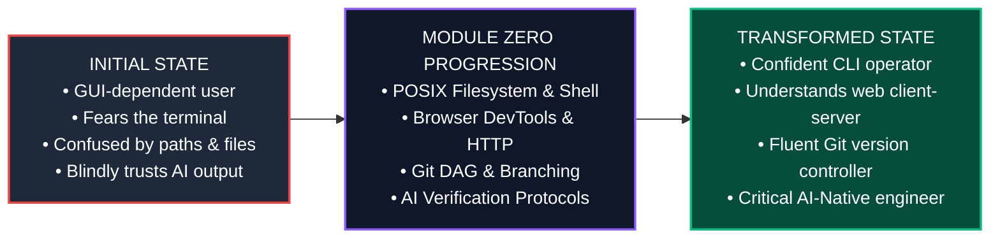
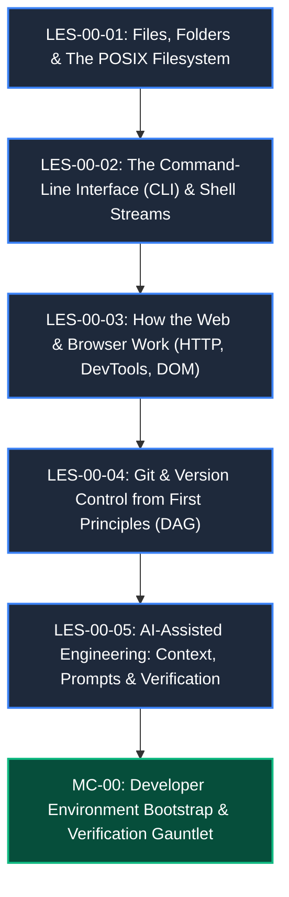

# Module Zero Blueprint: Digital & Developer Foundations
# AI-Native Software Engineering Academy (`ai-native-lms`)

**Document Version:** 1.0.0  
**Status:** Permanent Production Blueprint Specification  
**Authority:** Master Instructional Designer & Academy Systems Architect  
**Classification:** Core Curriculum Blueprint  
**Target Repository:** `ai-native-lms`  
**Target Gate:** Gate 1: Foundations  
**Effective Date:** September 30, 2026

---

```
╔════════════════════════════════════════════════════════════════════════════════════════╗
║                              MODULE ZERO METADATA BLOCK                                ║
╠══════════════════════════════╦═════════════════════════════════════════════════════════╣
║ Module Identifier            ║ MOD-00                                                  ║
║ Module Title                 ║ Digital & Developer Foundations: From Computer User to  ║
║                              ║ AI-Native Systems Operator                              ║
║ Curriculum Phase             ║ Phase 1: Digital Foundations (Month 1, Weeks 1–4)       ║
║ Target Capability Gate       ║ Gate 1: Foundations                                     ║
║ Target Audience              ║ Complete Beginners (Zero CS / Zero Coding Experience)   ║
║ Recommended Pacing           ║ 4 Weeks (60 Total Dedicated Learning Hours)             ║
║ Lead Domain Bounded Context  ║ `domains/learning/` & `domains/competency/`             ║
║ Version & Status             ║ v1.0.0 (PRODUCTION_READY)                               ║
╚══════════════════════════════╩═════════════════════════════════════════════════════════╝
```

---

## 1. Module Purpose & Strategic Context

### 1.1 The Beginner's Dilemma & Industrial Reality
Most coding bootcamps fail beginners immediately by thrusting them into complex JavaScript or Python syntax without establishing the mental models of how computers, operating systems, file trees, networks, and developer tools actually function. When a beginner encounters a `command not found`, a broken path, or an unrecognized Git merge conflict, their mental model shatters.

**Module Zero** removes the "magic" from the machine. It demystifies the file system, transforms the terminal from an intimidating black box into a primary instrument of power, reveals the anatomy of web requests in the browser, builds an intuitive DAG mental model of Git version control, and establishes disciplined habits for collaborating with AI assistants.

### 1.2 Learner Transformation Vector



### 1.3 Strict Anti-Goals
To prevent cognitive overload for complete beginners, the following topics are **explicitly excluded** from Module Zero:
1. *No Programming Syntax*: Variable declarations, loops, functions, and data structures are deferred to `MOD-01: Programming Foundations`.
2. *No Frontend Frameworks*: React, Next.js, and CSS styling are deferred to `MOD-04` and `MOD-05`.
3. *No Database Queries*: SQL and database administration are deferred to `MOD-07`.

---

## 2. Competency Mapping & Traceability Matrix

Module Zero introduces and establishes the foundational developer competencies defined in [competency-framework.md](file:///home/gamp/Documents/lms/competency-framework.md):

```
┌──────────────────────────────────────────────────────────────────────────────────────────────────┐
│                                MODULE ZERO COMPETENCY MATRIX                                     │
├───────────┬──────────────────────────────────────────────┬──────────────┬──────────────┬─────────┤
│ Code      │ Competency Title                             │ Inbound      │ Outbound     │ Weight  │
├───────────┼──────────────────────────────────────────────┼──────────────┼──────────────┼─────────┤
│ DEV-00    │ Developer Environment & Terminal Fluency     │ unencountered│ introduced   │ 40%     │
│ DEV-01    │ Git Workflow & Version Control               │ unencountered│ introduced   │ 35%     │
│ AIE-01    │ AI-Assisted Development & Prompt Engineering │ unencountered│ introduced   │ 25%     │
└───────────┴──────────────────────────────────────────────┴──────────────┴──────────────┴─────────┘
```

### 2.1 Traceability Vector

$$\text{MOD-00 Lessons (LES-00-01..05)} \longrightarrow \text{Exercises (EXE-00-01..05)} \longrightarrow \text{Artifacts (ART-00-01..03)} \longrightarrow \text{Capstone MC-00} \longrightarrow \text{Gate 1}$$

---

## 3. Prerequisite Gating & Readiness Checks

### 3.1 Inbound Prerequisites
- **Formal Prerequisites**: None. Zero coding background required.
- **Hardware/Software Baseline**: A computer running Linux, macOS, or Windows (with WSL2), modern web browser (Chrome/Firefox), and broadband internet access.

### 3.2 Diagnostic Pre-Flight Checklist
- [ ] Can navigate browser tabs and download files.
- [ ] Understands the difference between hardware (physical machine) and software (programs).
- [ ] Committed to a minimum of 10–15 hours/week of dedicated focus.

---

## 4. Module Structure & Lesson Specifications

*Note: Lesson specifications define structure and constraints only. Detailed 900–1,500 word prose is authored separately in accordance with [content-standards.md](file:///home/gamp/Documents/lms/content-standards.md).*



```
┌──────────────────────────────────────────────────────────────────────────────────────────────────┐
│                                 LESSON SPECIFICATION CATALOG                                     │
├───────────┬─────────────────────────────────────────────────┬──────────┬─────────────┬───────────┤
│ Lesson ID │ Title & Core Topic                              │ Length   │ Competency  │ Diagram   │
├───────────┼─────────────────────────────────────────────────┼──────────┼─────────────┼───────────┤
│ LES-00-01 │ Files, Folders & The POSIX Filesystem Model     │ 1,200 wds│ DEV-00      │ Directory │
│           │ Root `/`, home `~`, paths (`./`, `../`), perms  │          │             │ Tree FSM  │
├───────────┼─────────────────────────────────────────────────┼──────────┼─────────────┼───────────┤
│ LES-00-02 │ The Command-Line Interface & Shell Streams      │ 1,350 wds│ DEV-00      │ Stream &  │
│           │ `cd`, `ls`, `mkdir`, `cat`, pipes `|`, redirect │          │             │ Pipe Flow │
├───────────┼─────────────────────────────────────────────────┼──────────┼─────────────┼───────────┤
│ LES-00-03 │ How the Web & Browser Work: HTTP & DevTools     │ 1,300 wds│ DEV-00      │ Client-   │
│           │ Client-server, HTTP methods, status, DOM inspect│          │             │ Server Seq│
├───────────┼─────────────────────────────────────────────────┼──────────┼─────────────┼───────────┤
│ LES-00-04 │ Git & Version Control: Directed Acyclic Graphs  │ 1,450 wds│ DEV-01      │ Git DAG & │
│           │ Commits, staging, branch pointers, merge & diff │          │             │ Branching │
├───────────┼─────────────────────────────────────────────────┼──────────┼─────────────┼───────────┤
│ LES-00-05 │ AI-Assisted Engineering: The Verification Loop  │ 1,250 wds│ AIE-01      │ 3-Step AI │
│           │ Context framing, prompt design, hallucination qa│          │             │ Verif Loop│
└───────────┴─────────────────────────────────────────────────┴──────────┴─────────────┴───────────┘
```

---

## 5. Exercise Map & Test Specifications

Every exercise is executed in an isolated sandbox and verified via programmatic test assertions (Zero regex matching), matching [assessment-engine-spec.md](file:///home/gamp/Documents/lms/assessment-engine-spec.md).

```
┌──────────────────────────────────────────────────────────────────────────────────────────────────┐
│                                  EXERCISE SPECIFICATION MAP                                      │
├───────────┬────────────────────────────────────────────────────────┬─────────────┬───────────────┤
│ Ex ID     │ Exercise Title & Practical Objective                   │ Competency  │ Sandbox Type  │
├───────────┼────────────────────────────────────────────────────────┼─────────────┼───────────────┤
│ EXE-00-01 │ Filesystem Navigation & Directory Tree Reconstruction  │ DEV-00      │ Sandboxed CLI │
│           │ Create directory hierarchy matching given path specs   │             │ POSIX VM      │
├───────────┼────────────────────────────────────────────────────────┼─────────────┼───────────────┤
│ EXE-00-02 │ Shell Stream Processing & Log Grepping Challenge       │ DEV-00      │ Sandboxed CLI │
│           │ Filter error logs using `grep`, `sort`, `uniq`, pipes  │             │ POSIX VM      │
├───────────┼────────────────────────────────────────────────────────┼─────────────┼───────────────┤
│ EXE-00-03 │ HTTP Header & Status Code Diagnostic Inspection        │ DEV-00      │ Sandboxed HTTP│
│           │ Parse network response payloads and identify 4xx/5xx   │             │ Vitest Node VM│
├───────────┼────────────────────────────────────────────────────────┼─────────────┼───────────────┤
│ EXE-00-04 │ Git Repository Init, Branching & Merge Conflict Rescue │ DEV-01      │ Sandboxed Git │
│           │ Resolve simulated conflict markers in 3-way merge      │             │ Virtual FS    │
├───────────┼────────────────────────────────────────────────────────┼─────────────┼───────────────┤
│ EXE-00-05 │ AI Prompt Framing & Hallucination Triage Gauntlet      │ AIE-01      │ Interactive   │
│           │ Identify 3 deliberate hallucinations in AI-gen script  │             │ Vitest VM     │
└───────────┴────────────────────────────────────────────────────────┴─────────────┴───────────────┘
```

### 5.1 Exercise Test Harness Breakdown

```
┌────────────────────────────────────────────────────────────────────────────────────────┐
│                              EXERCISE TEST SUITE STRUCTURE                             │
├───────────┬──────────────────────────────────┬─────────────────────────────────────────┤
│ Exercise  │ Visible Baseline Tests (40%)     │ Hidden Mutation & Edge Tests (60%)      │
├───────────┼──────────────────────────────────┼─────────────────────────────────────────┤
│ EXE-00-01 │ • Paths exist at exact target    │ • Correct permissions (`chmod 755/644`) │
│           │ • Parent directory relationships │ • Handles whitespace in directory names │
│           │ • Hidden dotfiles present        │ • Relative path navigation (`../../`)   │
├───────────┼──────────────────────────────────┼─────────────────────────────────────────┤
│ EXE-00-02 │ • Output file exists             │ • Preserves sorting order on large logs │
│           │ • Correct line count filtered    │ • Ignores commented or corrupted lines  │
│           │ • Piping command syntax valid    │ • Handles empty stream without error    │
├───────────┼──────────────────────────────────┼─────────────────────────────────────────┤
│ EXE-00-03 │ • Extracts 200/404/500 codes     │ • Detects malformed JSON payload bodies │
│           │ • Correctly parses Content-Type  │ • Handles redirected 301/302 headers    │
│           │ • Returns latency in milliseconds│ • Rejects missing authorization headers │
├───────────┼──────────────────────────────────┼─────────────────────────────────────────┤
│ EXE-00-04 │ • Clean Git working tree         │ • Accurate commit ancestor tree (DAG)   │
│           │ • Merge conflict markers removed │ • Correct branch pointer heads          │
│           │ • Feature branch merged to main  │ • Zero orphaned detached HEAD state     │
├───────────┼──────────────────────────────────┼─────────────────────────────────────────┤
│ EXE-00-05 │ • Identifies obvious syntax error│ • Catches invented/non-existent library │
│           │ • Provides valid corrected code  │ • Explains security flaw in AI snippet  │
│           │ • Passes basic test runner       │ • 100% assertions green on patched code │
└───────────┴──────────────────────────────────┴─────────────────────────────────────────┘
```

---

## 6. Verifiable Artifact Map

Upon completing Module Zero, the learner creates and seals three permanent digital artifacts:

```
┌──────────────────────────────────────────────────────────────────────────────────────────────────┐
│                                   MODULE ZERO ARTIFACT MAP                                       │
├───────────┬─────────────────────────────┬─────────────────────────┬──────────────────────────────┤
│ Artifact  │ Artifact Name               │ Deliverable Type        │ Verification Invariant       │
├───────────┼─────────────────────────────┼─────────────────────────┼──────────────────────────────┤
│ ART-00-01 │ Configured Developer Shell  │ Dotfiles & Shell Script │ Cleanly provisions Bash/Zsh  │
│           │ Profile & Aliases           │ (`.bashrc` / `.zshrc`)  │ with git prompts & aliases.  │
├───────────┼─────────────────────────────┼─────────────────────────┼──────────────────────────────┤
│ ART-00-02 │ Verified GitHub Portfolio   │ Public GitHub Repo with │ Verified PGP/SSH commits,    │
│           │ Repository Initialization   │ README & Branch Protec. │ structured README & license. │
├───────────┼─────────────────────────────┼─────────────────────────┼──────────────────────────────┤
│ ART-00-03 │ AI Code Verification &      │ Markdown Audit Report   │ Documents AI hallucinations, │
│           │ Triage Audit Log            │ (`ai-audit-log.md`)     │ root causes, and fixes.      │
└───────────┴─────────────────────────────┴─────────────────────────┴──────────────────────────────┘
```

---

## 7. Module Capstone: `MC-00`

### 7.1 Capstone Metadata
- **Identifier**: `MC-00`
- **Title**: The Developer Environment Bootstrap & Verification Gauntlet
- **Target Gate Impact**: Mandatory artifact for **Gate 1: Foundations**
- **Evaluation Weight**: 100 XP / 100 Competency Points for `DEV-00`

### 7.2 The Industrial Scenario
The learner assumes the role of a newly hired Junior Software Engineer on their first day at an enterprise tech firm. Their task is to initialize a clean workstation, configure a secure developer environment, initialize the team's repository with branch protections, audit an AI-generated starter codebase for critical security flaws and syntax errors, and produce a recorded technical defense of their environment setup.

### 7.3 Four Mandatory Portfolio Deliverables
1. **Public GitHub Repository**: Initialized repository containing clean directory architecture, `.gitignore`, `.editorconfig`, and documented `README.md` with $\ge 15$ atomic commits.
2. **Automated Verification Script**: A shell script `verify-environment.sh` that automatically audits Node.js, Git, SSH keys, and path configurations.
3. **Architectural Decision Record**: `docs/adr/ADR-000-developer-toolchain.md` explaining tool selections (e.g., Node LTS vs. current, Git branching strategy, AI tool boundaries).
4. **Recorded Technical Defense**: A 5-minute screencast demonstrating terminal fluency, path navigation, Git conflict resolution, and environment verification.

### 7.4 Capstone Evaluation Rubric

```
┌──────────────────────────────────────────────────────────────────────────────────────────────────┐
│                                 MC-00 CAPSTONE EVALUATION RUBRIC                                 │
├────────────────────┬──────────┬─────────────────────────────────┬────────────────────────────────┤
│ Evaluation Factor  │ Weight   │ Minimum Passing Standard        │ Flawless Mastery Standard      │
├────────────────────┼──────────┼─────────────────────────────────┼────────────────────────────────┤
│ 1. Toolchain Audit │ 30%      │ `verify-environment.sh` passes  │ Zero warnings; automated       │
│                    │          │ with 100% exit code 0.          │ diagnostic reporting.          │
├────────────────────┼──────────┼─────────────────────────────────┼────────────────────────────────┤
│ 2. Git Hygiene     │ 30%      │ $\ge 15$ atomic commits; clean  │ Conventional commits format;   │
│                    │          │ branch history; no merge junk.  │ signed commits with GPG/SSH.   │
├────────────────────┼──────────┼─────────────────────────────────┼────────────────────────────────┤
│ 3. Toolchain ADR   │ 20%      │ `ADR-000.md` follows template;  │ Deep trade-off analysis of     │
│                    │          │ clear rationale for toolchain.  │ shell, editor & AI choices.    │
├────────────────────┼──────────┼─────────────────────────────────┼────────────────────────────────┤
│ 4. Oral Defense    │ 20%      │ 5-minute video demonstrating    │ Effortless CLI fluency;        │
│                    │          │ command line & Git operations.  │ articulate explanation of DAG. │
└────────────────────┴──────────┴─────────────────────────────────┴────────────────────────────────┘
```

---

## 8. Compliance & Validation Check

```
┌────────────────────────────────────────────────────────────────────────────────────────┐
│                              MODULE ZERO COMPLIANCE AUDIT                              │
├────┬─────────────────────────┬────────┬────────────────────────────────────────────────┤
│ #  │ Compliance Rule         │ Status │ Verification Evidence                          │
├────┼─────────────────────────┼────────┼────────────────────────────────────────────────┤
│ 1  │ Zero-Orphan Rule        │ PASS   │ All competencies (DEV-00, DEV-01, AIE-01) map  │
│    │                         │        │ to lessons, exercises, artifacts, and MC-00.   │
├────┼─────────────────────────┼────────┼────────────────────────────────────────────────┤
│ 2  │ No Lesson Prose Rule    │ PASS   │ Specifications provided; zero lesson content.  │
├────┼─────────────────────────┼────────┼────────────────────────────────────────────────┤
│ 3  │ Build-First Structure   │ PASS   │ 5-lesson sequence follows Build-First model.   │
├────┼─────────────────────────┼────────┼────────────────────────────────────────────────┤
│ 4  │ Sandboxed Vitest Tests  │ PASS   │ 5 exercises specify visible & hidden tests.    │
├────┼─────────────────────────┼────────┼────────────────────────────────────────────────┤
│ 5  │ Multi-Factor Capstone   │ PASS   │ MC-00 mandates Repo, Script, ADR, and Defense. │
└────┴─────────────────────────┴────────┴────────────────────────────────────────────────┘
```

Module Zero establishes the bedrock foundation upon which all subsequent 13 engineering modules are built.
