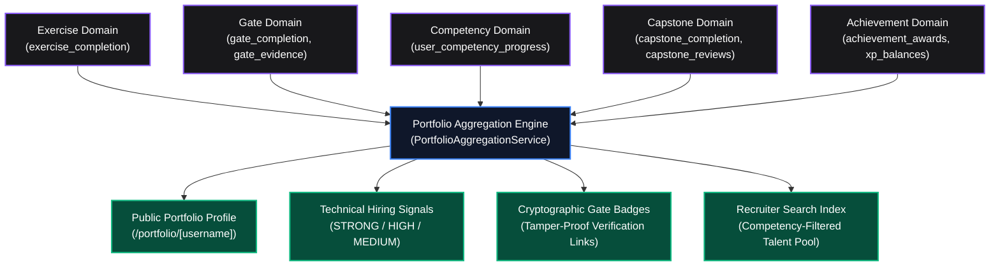
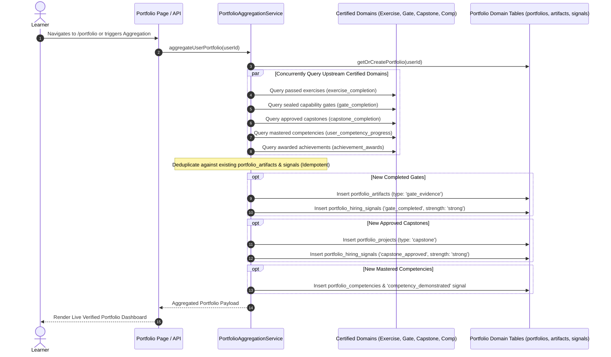
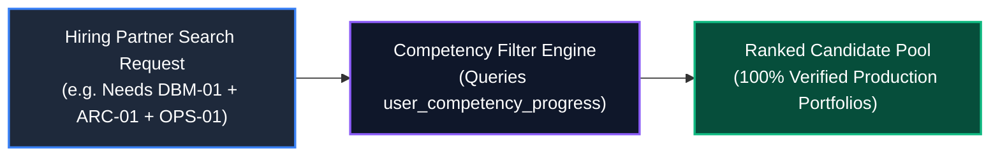

# Portfolio & Artifact System Architecture Specification
# AI-Native Software Engineering Academy (`ai-native-lms`)

**Document Version:** 1.0.0  
**Status:** Authoritative Evidence & Showcase Standard  
**Authority:** Academy Systems Architect & Head of Product Engineering  
**Scope:** Verifiable Portfolio Layer, Artifact Ingestion & Technical Hiring Signals Engine  
**Target Repository:** `ai-native-lms`  
**Classification:** Core System Architecture  
**Effective Date:** September 30, 2026

---

## Table of Contents

1. [Executive Summary & The Evidence-Based Paradigm](#1-executive-summary--the-evidence-based-paradigm)
2. [Artifact Classification Taxonomy](#2-artifact-classification-taxonomy)
3. [The Portfolio Aggregation Engine (`PortfolioAggregationService`)](#3-the-portfolio-aggregation-engine-portfolioaggregationservice)
4. [Automated Technical Hiring Signals Engine](#4-automated-technical-hiring-signals-engine)
5. [Public Verification Gateway & Cryptographic Badges](#5-public-verification-gateway--cryptographic-badges)
6. [Recruiter Search & Candidate Indexing System](#6-recruiter-search--candidate-indexing-system)
7. [Complete End-to-End Artifact Traceability Matrix](#7-complete-end-to-end-artifact-traceability-matrix)

---

## 1. Executive Summary & The Evidence-Based Paradigm

The **Portfolio & Artifact System** is the professional evidence layer of the AI-Native Software Engineering LMS. It answers the defining question of modern technical recruitment:

> **"What verifiable proof does this engineer have that they can architect, build, secure, and deploy production software?"**

In an era flooded with generic AI-generated resumes and unverified GitHub repositories, traditional claims of competence are heavily discounted by hiring managers. 

The Portfolio System aggregates **cryptographic, immutable records of achievement, passing test harnesses, rubric-validated competency mastery, sealed Capability Gates, and live cloud deployments** into a unified, employer-facing profile at `/portfolio/[username]`.



---

## 2. Artifact Classification Taxonomy

Every artifact produced throughout the 24-month curriculum is classified into one of five structured categories:

```
┌──────────────────────────────────────────────────────────────────────────────────────────────────┐
│                                 ARTIFACT CLASSIFICATION TAXONOMY                                 │
├────────────────────┬──────────────────────────────────┬──────────────────────────────────────────┤
│ Category           │ Concrete Artifact Type           │ Verification Mechanism                   │
├────────────────────┼──────────────────────────────────┼──────────────────────────────────────────┤
│ 1. Code & Repo     │ • Public GitHub Repositories     │ • SHA-256 commit verification            │
│    Deliverables    │ • Feature Pull Requests (PRs)    │ • Git commit author signature            │
│                    │ • Standalone TypeScript Packages │ • Static AST syntax parsing              │
├────────────────────┼──────────────────────────────────┼──────────────────────────────────────────┤
│ 2. Test & Quality  │ • Vitest Unit & Integration Runs │ • Automated Vitest assertion output      │
│    Proofs          │ • Code Coverage Metrics (>90%)   │ • Memory usage & latency execution logs  │
│                    │ • Mutation & Invariant Proofs    │ • Axe-core A11y compliance logs          │
├────────────────────┼──────────────────────────────────┼──────────────────────────────────────────┤
│ 3. Architecture &  │ • Architectural Decision Records │ • Formal Markdown spec validation        │
│    Design Docs     │ • Database ERDs & Sequence Diags │ • Threat model completeness rubric       │
│                    │ • OpenAPI 3.0 / Zod Contracts    │ • Zero-schema-drift type checks          │
├────────────────────┼──────────────────────────────────┼──────────────────────────────────────────┤
│ 4. Cloud & Deploy  │ • Live Production Web URLs       │ • Automated HTTP 200 health check probe  │
│    Proofs          │ • Multi-Stage Dockerfiles        │ • Docker image vulnerability scans       │
│                    │ • GitHub Actions CI/CD Logs      │ • Green CI workflow execution runs       │
├────────────────────┼──────────────────────────────────┼──────────────────────────────────────────┤
│ 5. Synthesis &     │ • Recorded Oral Defense Videos   │ • Expert evaluation rubric score (>85)   │
│    Defense         │ • AI Technical Interview Audio   │ • AI Technical Simulator transcripts     │
│                    │ • AI Pairing Audit Logs          │ • Deliberate hallucination audit logs    │
└────────────────────┴──────────────────────────────────┴──────────────────────────────────────────┘
```

---

## 3. The Portfolio Aggregation Engine (`PortfolioAggregationService`)

The **Portfolio Aggregation Engine** continuously and idempotently reconciles learning activity from upstream certified domains into the learner's public portfolio datastore:



### Core Invariants of the Aggregation Engine:
1. **Idempotency**: Running `aggregateUserPortfolio(userId)` multiple times produces identical state without duplicate records or bloated signals.
2. **Zero Upstream Mutation**: The Portfolio Domain strictly performs read operations against upstream domains (`gate_completion`, `exercise_attempts`, etc.); it never mutates upstream state.
3. **Cryptographic Reference Integrity**: Every artifact record references a valid foreign key or immutable URL in the underlying datastore.

---

## 4. Automated Technical Hiring Signals Engine

The platform automatically computes objective, high-confidence **Hiring Signals** based on verified achievements:

```
┌──────────────────────────────────────────────────────────────────────────────────────────────────┐
│                               TECHNICAL HIRING SIGNALS TAXONOMY                                  │
├─────────────────────────────┬──────────┬─────────────────────────────────────────────────────────┤
│ Signal Identifier           │ Strength │ Triggering Evidence Condition                           │
├─────────────────────────────┼──────────┼─────────────────────────────────────────────────────────┤
│ `academy_graduate_certified`│ STRONG   │ All 7 Capability Gates sealed + 4 Capstones approved.   │
│ `gate_completed`            │ STRONG   │ Official seal inserted in `gate_completion`.            │
│ `systems_architect_certified`│ STRONG  │ Gate 6 sealed + `ARC-01` mastered with approved ADR.    │
│ `database_security_certified`│ STRONG  │ Gate 4 sealed + `DBM-01` mastered with RLS test proof.  │
│ `production_deploy_verified`│ HIGH     │ Live cloud URL with passing HTTP health check probe.    │
│ `contract_first_architect`  │ HIGH     │ Gate 3 sealed + `API-01` & `SDD-02` mastered with Zod.  │
│ `mcp_agentic_tooling_mastered`│ HIGH   │ Functional Model Context Protocol server verified.      │
│ `test_engineering_rigor`    │ HIGH     │ >90% code coverage across unit & integration suites.    │
│ `procedural_logic_verified` │ MEDIUM   │ 100% green test assertions on algorithmic challenges.   │
│ `achievement_earned`        │ MEDIUM   │ Milestone badge unlocked in `achievement_awards`.       │
└─────────────────────────────┴──────────┴─────────────────────────────────────────────────────────┘
```

---

## 5. Public Verification Gateway & Cryptographic Badges

Every public portfolio profile (`/portfolio/[username]`) features digitally verifiable credentials:

```
┌────────────────────────────────────────────────────────────────────────────────────────┐
│                          VERIFIABLE CREDENTIAL PROFILE CARD                            │
├────────────────────────────────────────────────────────────────────────────────────────┤
│ Verified Engineer: Alex Morgan                                                         │
│ Credential Status: CERTIFIED AI-NATIVE SOFTWARE ENGINEER                               │
│ Verification Hash: sha256:8f4c2e1b9a7d3f6e0c5b8a1d4f7e2c9b6a0d3f8e                    │
├────────────────────────────────────────────────────────────────────────────────────────┤
│ VERIFIED CAPABILITY BADGES (7/7 SEALED):                                               │
│  [🛡️ Gate 1: AI-Assisted Builder]   • Verified Date: 2026-03-15 • Hash: 9a7d3f        │
│  [🛡️ Gate 2: Frontend Engineer]     • Verified Date: 2026-06-20 • Hash: 0c5b8a        │
│  [🛡️ Gate 3: API Integrator]        • Verified Date: 2026-09-10 • Hash: 4f7e2c        │
│  [🛡️ Gate 4: Data Model Designer]   • Verified Date: 2026-11-28 • Hash: 6a0d3f        │
│  [🛡️ Gate 5: Production Deployer]   • Verified Date: 2027-02-14 • Hash: 1b9a7d        │
│  [🛡️ Gate 6: System Architect]      • Verified Date: 2027-05-30 • Hash: 8f4c2e        │
│  [🛡️ Gate 7: Enterprise Engineer]   • Verified Date: 2027-08-25 • Hash: 3f6e0c        │
├────────────────────────────────────────────────────────────────────────────────────────┤
│ PRODUCTION EMBEDS:                                                                     │
│  • Capstone 1 (AI Knowledge Hub): [LIVE APP ↗] [GITHUB REPO ↗] [ADR SPEC ↗]            │
│  • Capstone 2 (Multi-Tenant SaaS): [LIVE APP ↗] [GITHUB REPO ↗] [RLS SUITE ↗]          │
│  • Capstone 3 (Task Orchestrator): [LIVE APP ↗] [GITHUB REPO ↗] [MCP SERVER ↗]         │
│  • Capstone 4 (Compliance Sentinel): [LIVE APP ↗] [GITHUB REPO ↗] [ORAL DEFENSE ↗]     │
└────────────────────────────────────────────────────────────────────────────────────────┘
```

- **Dynamic OpenGraph (OG) Images**: Automatically generates high-resolution social share cards displaying verified gate badges and live project metrics for LinkedIn, GitHub, and X.
- **Direct Employer Verification Links**: Clicking any badge navigates to `/verify/[credentialId]`, displaying the raw immutable timestamp, commit SHA, and evaluator sign-off.

---

## 6. Recruiter Search & Candidate Indexing System

Partner technology companies access the **Recruiter Talent Gateway**, enabling deterministic talent search based on verified competency combinations:



- **Zero Keyword Matching**: Candidates are indexed exclusively by verified, sealed database records, eliminating resume keyword stuffing.
- **Direct Code Inspection**: Recruiters click directly from a search result into the candidate's public pull request review and live running cloud container.

---

## 7. Complete End-to-End Artifact Traceability Matrix

```
┌──────────────────────────────────────────────────────────────────────────────────────────────────────────────────────────────────────┐
│                                         MASTER PORTFOLIO TRACEABILITY MATRIX                                                         │
├─────────┬────────────────────────────┬─────────────────────────────┬──────────────────────────┬──────────────────────────────────────┤
│ Code    │ Project Deliverable        │ Concrete Evidence Artifact  │ Capstone Alignment       │ Public Portfolio Showcase            │
├─────────┼────────────────────────────┼─────────────────────────────┼──────────────────────────┼──────────────────────────────────────┤
│ DEV-00  │ Workstation Shell Scripts  │ Public GitHub Profile + SSH │ Capstone 1–4 Base Setup  │ Toolchain Literacy Badge             │
│ PRG-01  │ Algorithmic Problem Solvers│ 20 Green Vitest Test Suites │ CLI Task Engine (MC-1)   │ Procedural Logic Reasoning Proof     │
│ ASY-01  │ Asynchronous Event Bus     │ Network Latency/Retry Suite │ Async Aggregator (MC-2)  │ Async Systems Resilience Badge       │
│ CTX-01  │ Project Constitution       │ `AGENTS.md` + Token Pruner  │ Capstone 3 Spec Build    │ Context Engineering Showcase         │
│ SDD-01  │ Intent Specification Doc   │ Formal Invariant Contract   │ Milestone 1 across 1–4   │ Authored Architecture ADRs           │
│ FED-01  │ Responsive Web Dashboard   │ Next.js App + A11y >95%     │ Capstone 1 (Knowledge)   │ Live Interactive UI App Embed        │
│ API-01  │ Authenticated CRUD API     │ Server Actions + Zod Suite  │ Capstone 2 (API Layer)   │ OpenAPI 3.0 Interactive Spec Docs    │
│ SDD-02  │ Zod Runtime Contract Suite │ `.superRefine()` Test Proof │ Milestone 2 across 1–4   │ Contract-First Architecture Proof    │
│ AGT-01  │ Model Context Protocol Srv │ JSON-RPC Live MCP Server    │ MC-6 / Capstone 3 (MCP)  │ Live MCP Tool Server Endpoint        │
│ DBM-01  │ 10-Table PostgreSQL Schema │ Idempotent Migrations + RLS │ Capstone 2 (Database)    │ PostgreSQL Schema ERD & Security Card│
│ OPS-01  │ Multi-Stage Dockerfile     │ GitHub Actions CI/CD Logs   │ Capstone 2 (Deployment)  │ Verified Production Cloud URL        │
│ CTX-02  │ Fullstack Test Pyramid     │ >90% Coverage Vitest Report │ Test Suites across 1–4   │ Test Engineering Rigor Scorecard     │
│ ARC-01  │ Domain Service & FSM Engine│ `ADR-002.md` + Domain Layer │ Capstone 3 (Task Hub)    │ Systems Architect Certification      │
│ AGT-02  │ Resilient Task Runner      │ Structured JSON Tracing Log │ Capstone 3 & 4 Telemetry │ Telemetry & Observability Badge      │
│ GOV-01  │ Security Threat Model      │ OWASP Audit + Audit Ledger  │ Capstone 4 (Sentinel)    │ Enterprise Security Compliance Badge │
│ CAP-01  │ 4 Fullstack Cloud Projects │ 4 Deployed Apps + Oral Def. │ Capstones 1, 2, 3, and 4 │ **VERIFIED AI SOFTWARE ENGINEER**    │
└─────────┴────────────────────────────┴─────────────────────────────┴──────────────────────────┴──────────────────────────────────────┘
```

This specification completes the verifiable professional evidence layer of the Academy, ensuring our graduates possess an unassailable body of work that transforms technical hiring.
