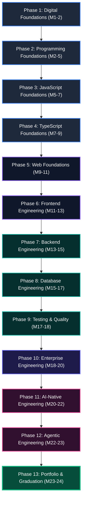
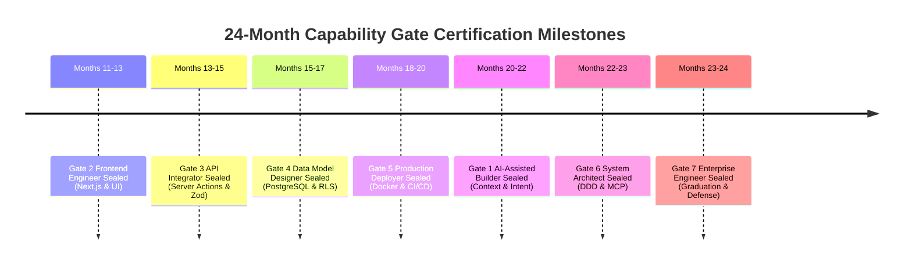

# Master 24-Month Programme Map
# AI-Native Software Engineering Academy (`ai-native-lms`)

**Document Version:** 1.0.0  
**Status:** Authoritative 24-Month Curriculum Programme Specification  
**Authority:** Academy Dean, Systems Architect & Lead Instructional Designer  
**Scope:** 24-Month Self-Paced Competency Transformation Roadmap  
**Target Learner Profile:** Complete Beginner (Zero Prior Background) &rarr; Job-Ready AI-Native Software Engineer  
**Classification:** Core Academy Architecture  
**Target Repository:** `ai-native-lms`  
**Effective Date:** September 30, 2026

---

## Table of Contents

1. [Executive Overview & 24-Month Pacing Architecture](#1-executive-overview--24-month-pacing-architecture)
2. [Master Programme Pacing Matrix](#2-master-programme-pacing-matrix)
3. [Phase-by-Phase Comprehensive Architecture](#3-phase-by-phase-comprehensive-architecture)
   - [Phase 1: Digital Foundations (Months 1–2)](#phase-1-digital-foundations-months-12)
   - [Phase 2: Programming Foundations (Months 2–5)](#phase-2-programming-foundations-months-25)
   - [Phase 3: JavaScript Foundations (Months 5–7)](#phase-3-javascript-foundations-months-57)
   - [Phase 4: TypeScript Foundations (Months 7–9)](#phase-4-typescript-foundations-months-79)
   - [Phase 5: Web Foundations (Months 9–11)](#phase-5-web-foundations-months-911)
   - [Phase 6: Frontend Engineering (Months 11–13)](#phase-6-frontend-engineering-months-1113)
   - [Phase 7: Backend Engineering (Months 13–15)](#phase-7-backend-engineering-months-1315)
   - [Phase 8: Database Engineering (Months 15–17)](#phase-8-database-engineering-months-1517)
   - [Phase 9: Testing & Quality (Months 17–18)](#phase-9-testing--quality-months-1718)
   - [Phase 10: Enterprise Engineering (Months 18–20)](#phase-10-enterprise-engineering-months-1820)
   - [Phase 11: AI-Native Engineering (Months 20–22)](#phase-11-ai-native-engineering-months-2022)
   - [Phase 12: Agentic Engineering (Months 22–23)](#phase-12-agentic-engineering-months-2223)
   - [Phase 13: Portfolio & Graduation (Months 23–24)](#phase-13-portfolio--graduation-months-2324)
4. [Capstone Milestone Integration Timeline](#4-capstone-milestone-integration-timeline)
5. [Capability Gate Sealing Schedule (Gates 1–7)](#5-capability-gate-sealing-schedule-gates-17)

---

## 1. Executive Overview & 24-Month Pacing Architecture

The **Master Programme Map** establishes the chronological operational blueprint for the 24-month self-paced AI-Native Software Engineering Academy.

The curriculum is structured across **13 discrete phases** engineered to take a learner with zero background through cognitive scaffolding, foundational computer literacy, fullstack engineering, and advanced enterprise AI systems.



### Self-Paced Pacing Dynamics:
- **Nominal Benchmark**: 12–15 hours/week &rarr; 24-Month Completion.
- **Accelerated Mode (Full-Time)**: 30–40 hours/week &rarr; 9–12 Month Completion.
- **Elastic Retention Invariant**: Progress never expires; sealed Capability Gates remain permanently valid.

---

## 2. Master Programme Pacing Matrix

```
┌───────────────────────────────────────────────────────────────────────────────────────────────────┐
│                                   MASTER 24-MONTH PROGRAMME MATRIX                                │
├───────┬────────────────────────────┬─────────────┬──────────────────────────┬─────────────────────┤
│ Phase │ Phase Title                │ Timeline    │ Core Focus Domain        │ Gate Milestone      │
├───────┼────────────────────────────┼─────────────┼──────────────────────────┼─────────────────────┤
│   1   │ Digital Foundations        │ Months 1–2  │ Terminal, CLI, Git, IDEs │ Baseline Tooling    │
│   2   │ Programming Foundations    │ Months 2–5  │ Computational Logic & Flow│ Procedural Baseline │
│   3   │ JavaScript Foundations     │ Months 5–7  │ Event Loop & DOM Systems │ Web Runtime Baseline│
│   4   │ TypeScript Foundations     │ Months 7–9  │ Static Types & Invariants│ Type-Safe Baseline  │
│   5   │ Web Foundations            │ Months 9–11 │ HTTP, CSS, Responsive UI │ Web Systems Baseline│
│   6   │ Frontend Engineering       │ Months 11–13│ React 19, Next.js, State │ Gate 2: Frontend    │
│   7   │ Backend Engineering        │ Months 13–15│ Server Actions & REST API│ Gate 3: API Integ.  │
│   8   │ Database Engineering       │ Months 15–17│ PostgreSQL, Schema & RLS │ Gate 4: Data Model  │
│   9   │ Testing & Quality          │ Months 17–18│ Vitest, MSW, Pyramids    │ Quality Verification│
│  10   │ Enterprise Engineering     │ Months 18–20│ Docker, CI/CD & Deploy   │ Gate 5: Deployer    │
│  11   │ AI-Native Engineering      │ Months 20–22│ Context, Prompts & Specs │ Gate 1: AI Builder  │
│  12   │ Agentic Engineering        │ Months 22–23│ MCP, Subagents & DDD     │ Gate 6: Architect   │
│  13   │ Portfolio & Graduation     │ Months 23–24│ Capstone Defense & Placement│ Gate 7: Enterprise│
└───────┴────────────────────────────┴─────────────┴──────────────────────────┴─────────────────────┘
```

---

## 3. Phase-by-Phase Comprehensive Architecture

---

### Phase 1: Digital Foundations (Months 1–2)
- **Purpose**: Demystify computers, eliminate command-line intimidation, establish professional developer workstation hygiene, and build daily Git version control habits.
- **Competencies**:
  - `DEV-00` (Tooling & Development Environment): *Introduced &rarr; Practicing*
- **Artifacts**:
  - Personal GitHub profile configured with SSH keypairs and verified commit signing.
  - Personal Dotfiles repository configuring modern terminal shell and VS Code/Cursor editor.
  - Initialized Markdown technical journal tracking weekly learning synthesis.
- **Capstones**: Initial repository setup and workspace tooling for Capstone 1.
- **Graduation Impact**: Establishes foundational technical hygiene; eliminates terminal fear and unlocks independent project management.

---

### Phase 2: Programming Foundations (Months 2–5)
- **Purpose**: Develop robust computational thinking, algorithmic decomposition, variables, memory models, conditional branches, loops, and functional encapsulation.
- **Competencies**:
  - `PRG-01` (Computational Thinking & Procedural Logic): *Introduced &rarr; Practicing*
- **Artifacts**:
  - Suite of 20 algorithmic problem solvers (sorting, search, string manipulation, data formatting) with 100% green test assertions.
  - Interactive Command-Line Task Manager with state persistence to local JSON files.
- **Capstones**: Core business calculation engine for Capstone 1.
- **Graduation Impact**: Builds the procedural and logical foundation required for all future software architecture.

---

### Phase 3: JavaScript Foundations (Months 5–7)
- **Purpose**: Deep dive into the JavaScript runtime: Call Stack, Web APIs, Event Loop, Microtask Queue, Promises, async/await, closures, and functional array pipelines (`map`, `filter`, `reduce`).
- **Competencies**:
  - `ASY-01` (Asynchronous Runtimes & Data Flow): *Introduced &rarr; Practicing*
- **Artifacts**:
  - Custom Event Emitter implementation demonstrating decoupled pub/sub dataflow.
  - Asynchronous Weather Data Aggregator consuming 3 third-party REST APIs concurrently with exponential backoff retries.
- **Capstones**: Asynchronous data ingestion worker for Capstone 1.
- **Graduation Impact**: Enables non-blocking asynchronous thinking, essential for modern cloud, web, and agentic workflows.

---

### Phase 4: TypeScript Foundations (Months 7–9)
- **Purpose**: Master static typing, structural subtyping, union types, discriminated unions, generic constraints, type narrowing, and compiler configuration (`tsconfig.json`).
- **Competencies**:
  - `PRG-01` (TypeScript Strict Contracts): *Reinforced &rarr; Mastered*
  - `SDD-02` (Type Inference & Invariants): *Introduced*
- **Artifacts**:
  - Strictly typed In-Memory Key-Value Store library with generic types and zero `any` keywords.
  - Compile-time State Machine validator rejecting illegal state transitions at the type-checker level.
- **Capstones**: Type contract models and entity interfaces for Capstone 1.
- **Graduation Impact**: Inoculates the learner against runtime type errors; establishes contract-first engineering discipline.

---

### Phase 5: Web Foundations (Months 9–11)
- **Purpose**: Master the web platform: DOM manipulation, browser rendering lifecycles, semantic HTML5, modern CSS layout (Flexbox/Grid), accessible ARIA standards, and the HTTP protocol (methods, headers, status codes).
- **Competencies**:
  - `FED-01` (Web Systems & Semantic Markup): *Introduced &rarr; Practicing*
- **Artifacts**:
  - Accessible, responsive documentation website built with semantic HTML and Tailwind CSS achieving 100% Lighthouse Accessibility score.
  - Interactive Browser Canvas application with touch and keyboard navigation support.
- **Capstones**: UI design system and component primitives for Capstone 1.
- **Graduation Impact**: Guarantees that the learner understands the browser platform natively before adopting high-level frontend frameworks.

---

### Phase 6: Frontend Engineering (Months 11–13)
- **Purpose**: Master modern single-page and server-rendered frontend architecture using React 19, Next.js 15 (App Router, Server Components, Client Components), and isolated Zustand state stores.
- **Competencies**:
  - `FED-01` (Frontend Component Systems & UI State): *Reinforced &rarr; Mastered*
- **Artifacts**:
  - Production Next.js 15 Dashboard application with server-side rendered layouts, streaming suspense, and responsive data tables.
  - Zustand state store module with optimistic UI updates and localStorage synchronization.
- **Capstones**: Complete Frontend Client for **Capstone 1 (AI Knowledge Engine)**.
- **Graduation Impact**: **Seals Competency Gate 2 (Frontend Engineer)**; establishes fullstack UI capability.

---

### Phase 7: Backend Engineering (Months 13–15)
- **Purpose**: Master server-side architecture: Next.js Server Actions, RESTful Route Handlers, standardized API envelopes (`{ success, data, error }`), Zod runtime schema contracts, and Supabase Auth session security.
- **Competencies**:
  - `API-01` (API Architecture & Server Actions): *Introduced &rarr; Mastered*
  - `SDD-02` (Schema Contract Enforcement): *Practicing &rarr; Mastered*
- **Artifacts**:
  - Authenticated Fullstack API with Zod payload validation, rate limiting, and HTTP-only cookie session management.
  - OpenAPI 3.0 specification auto-generated from runtime Zod schemas.
- **Capstones**: Complete Backend & API layer for **Capstone 2 (Multi-Tenant SaaS Engine)**.
- **Graduation Impact**: **Seals Competency Gate 3 (API Integrator)**; enables autonomous fullstack slice authoring.

---

### Phase 8: Database Engineering (Months 15–17)
- **Purpose**: Master relational database design: normalization (1NF–3NF), primary/foreign keys, indexing strategies (B-Tree, GIN), ACID transactions, PostgreSQL schema migrations, and Supabase Row-Level Security (RLS) policies.
- **Competencies**:
  - `DBM-01` (Relational Data Modeling & PostgreSQL RLS): *Introduced &rarr; Mastered*
- **Artifacts**:
  - 10-table normalized relational schema migration with composite unique indexes and foreign key constraints.
  - Comprehensive Row-Level Security (RLS) policy test suite proving 100% multi-tenant data isolation.
- **Capstones**: Multi-Tenant Relational Database Architecture for **Capstone 2**.
- **Graduation Impact**: **Seals Competency Gate 4 (Data Model Designer)**; guarantees enterprise data integrity and security.

---

### Phase 9: Testing & Quality (Months 17–18)
- **Purpose**: Master the test pyramid: deterministic unit testing with Vitest, component testing with React Testing Library, API contract testing with Mock Service Worker (MSW), and test coverage metrics.
- **Competencies**:
  - `CTX-02` (Deterministic Test Harnessing & Verification): *Introduced &rarr; Mastered*
- **Artifacts**:
  - Comprehensive test suite for a fullstack application achieving >90% code coverage across branch, line, and function metrics.
  - Mock Service Worker (MSW) integration mocking external third-party payment gateways.
- **Capstones**: 100% Green Automated Test Suite across Capstones 1 & 2.
- **Graduation Impact**: Eliminates brittle code; trains the learner to build ground-truth verification harnesses for AI generation.

---

### Phase 10: Enterprise Engineering (Months 18–20)
- **Purpose**: Master production operations: multi-stage Docker containerization, automated GitHub Actions CI/CD workflows, environment secret isolation, domain SSL provisioning, and cloud deployment.
- **Competencies**:
  - `OPS-01` (Cloud Containerization & CI/CD Pipelines): *Introduced &rarr; Mastered*
- **Artifacts**:
  - Production-optimized multi-stage Dockerfile packaging a Next.js fullstack container (<150MB image size).
  - GitHub Actions CI/CD pipeline executing linting, type-checking, automated tests, and cloud staging deployment on every PR.
- **Capstones**: Production Cloud Deployment of **Capstone 2 (Multi-Tenant SaaS Platform)**.
- **Graduation Impact**: **Seals Competency Gate 5 (Production Deployer)**; certifies production DevOps and cloud delivery.

---

### Phase 11: AI-Native Engineering (Months 20–22)
- **Purpose**: Master intent-driven software architecture, prompt-driven code generation, context window token curation, repository constitution files (`AGENTS.md`, `.cursorrules`), and deliberate AI hallucination detection.
- **Competencies**:
  - `CTX-01` (AI Context Window & Prompt Optimization): *Reinforced &rarr; Mastered*
  - `SDD-01` (Intent Specification & Domain Modeling): *Reinforced &rarr; Mastered*
- **Artifacts**:
  - Formally authored `AGENTS.md` repository constitution governing multi-file AI pairing.
  - Recorded pairing session log demonstrating multi-turn prompt refinement and rejection/correction of an LLM security defect.
- **Capstones**: AI-Assisted Architecture & Spec-Driven Build of **Capstone 3 (Distributed Event Task Hub)**.
- **Graduation Impact**: **Seals Competency Gate 1 (AI-Assisted Builder)**; elevates the engineer from syntax typist to AI orchestrator.

---

### Phase 12: Agentic Engineering (Months 22–23)
- **Purpose**: Build autonomous AI agent toolchains using the Model Context Protocol (MCP), structured telemetry logging (`lib/logger.ts`), distributed tracing, and Domain-Driven Design (DDD) bounded contexts.
- **Competencies**:
  - `AGT-01` (Model Context Protocol Integration): *Reinforced &rarr; Mastered*
  - `ARC-01` (Domain-Driven Design & Bounded Contexts): *Introduced &rarr; Mastered*
  - `AGT-02` (Autonomous Resilience & Observability): *Introduced &rarr; Mastered*
- **Artifacts**:
  - Live Model Context Protocol (MCP) server exposing tools for database querying and file manipulation.
  - Domain-Driven Design architecture package with isolated Services, Repositories, and State Machine policies.
- **Capstones**: Complete Implementation of **Capstone 3 (Distributed Event-Driven Orchestration Engine)**.
- **Graduation Impact**: **Seals Competency Gate 6 (System Architect)**; certifies high-level distributed systems capabilities.

---

### Phase 13: Portfolio & Graduation (Months 23–24)
- **Purpose**: Complete terminal enterprise governance audits (OWASP Top 10, prompt injection defense), deploy the final Capstone 4 project, defend architecture before an evaluation panel, and launch the employer portfolio.
- **Competencies**:
  - `GOV-01` (Enterprise Governance & OWASP Security): *Introduced &rarr; Mastered*
  - `CAP-01` (Fullstack Capstone Synthesis & Defense): *Introduced &rarr; Mastered*
- **Artifacts**:
  - Completed **Capstone 4: Enterprise AI Code Review & Compliance Sentinel**.
  - Recorded 20-minute Capstone Architecture Defense presentation.
  - Public Verified Portfolio live at `/portfolio/[username]` showcasing 4 deployed applications and 7 sealed gate badges.
- **Capstones**: Final approval of all 4 Capstones.
- **Graduation Impact**: **Seals Competency Gate 7 (Enterprise Engineer)**; triggers Official Academy Graduation & verified talent network placement.

---

## 4. Capstone Milestone Integration Timeline

```
┌──────────────────────────────────────────────────────────────────────────────────────────────────┐
│                                CAPSTONE MILESTONE INTEGRATION MAP                                │
├────┬─────────────────────────────┬─────────────┬───────────┬─────────────────────────────────────┤
│ #  │ Capstone Project Title      │ Active Phase│ Gate Level│ Primary Architecture Deliverable    │
├────┼─────────────────────────────┼─────────────┼───────────┼─────────────────────────────────────┤
│ 1  │ AI-Powered Knowledge Engine │ Months 9–13 │ Gates 1–2 │ Next.js 15 App Router, UI State,    │
│    │ & Semantic Search Service   │             │           │ Vector Embeddings & Component Tests.│
├────┼─────────────────────────────┼─────────────┼───────────┼─────────────────────────────────────┤
│ 2  │ Multi-Tenant SaaS Platform  │ Months 13–20│ Gates 3–5 │ PostgreSQL Schema, Supabase RLS,    │
│    │ with RBAC & Billing Engine  │             │           │ Docker Containers & CI/CD Pipelines.│
├────┼─────────────────────────────┼─────────────┼───────────┼─────────────────────────────────────┤
│ 3  │ Distributed Event-Driven    │ Months 20–23│ Gate 6    │ Domain-Driven Design, Bounded Con-  │
│    │ Task Orchestration Engine   │             │           │ texts, State Machines & Telemetry.  │
├────┼─────────────────────────────┼─────────────┼───────────┼─────────────────────────────────────┤
│ 4  │ Enterprise AI Code Review & │ Months 23–24│ Gate 7    │ OWASP Top 10 Security Audit, Prompt │
│    │ Compliance Sentinel (Final) │             │ (Grad)    │ Injection Defense & Oral Defense.   │
└────┴─────────────────────────────┴─────────────┴───────────┴─────────────────────────────────────┘
```

---

## 5. Capability Gate Sealing Schedule (Gates 1–7)



By adhering to this master programme map, the Academy transforms complete beginners into elite, production-verified software engineers capable of driving AI-augmented engineering workflows in any technology organization worldwide.
