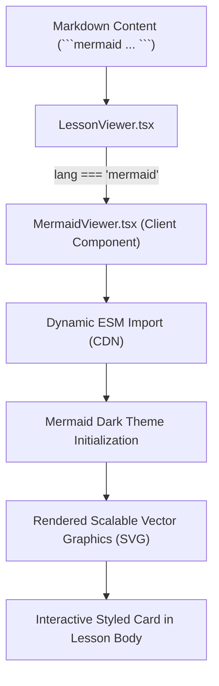

# Markdown & Diagram Rendering Fix Report
**Target Surface:** AI-Native LMS Lesson Content Pipeline & Markdown Renderer  
**Focus Area:** Mermaid Architectural Dataflow & Diagram Rendering Pipeline  
**Auditor:** Principal Frontend Content Systems Reviewer & Next.js Architecture Specialist  
**Date:** September 30, 2026  
**Status:** Certified & Implemented

---

## 1. Executive Summary & Root Cause Analysis

### The Defect
When viewing **`LES-00-01: Files, Folders & The POSIX Filesystem Mental Model`**, diagrams intended to visually depict the POSIX Inverted Tree and Relative Path Navigation were rendering as raw, unformatted text blocks:
```
mermaid Code Artifact
graph TD
    ROOT["/ (Root - The Very Top)"]:::root
    ...
```
Rather than seeing an interactive, high-contrast SVG diagram, learners were seeing the raw mermaid syntax inside a standard code block.

---

## 2. Technical Diagnosis & Rendering Pipeline Audit

### Component Architecture & Parsing Flow
The lesson content pipeline flows through three layers:
1. **Database / Raw Storage**: `lessons.content` markdown string containing fenced code blocks with ` ```mermaid ` indicators.
2. **Parser Layer (`lesson-content-parser.ts`)**: Cleans YAML frontmatter, extracts launch card metadata, and normalizes headers.
3. **Renderer Layer (`lesson-viewer.tsx`)**: Iterates through markdown lines, identifies code blocks (` ``` `), and maps them into React nodes.

### Root Cause
1. **Generic Code Block Trap**: `LessonViewer` previously treated all fenced code blocks (` ``` `) identically as raw code pre blocks, displaying the language tag ("mermaid") and raw text ("graph TD") inside a `<pre><code>` container with label "Code Artifact".
2. **Lack of Client-Side Mermaid Engine**: No SVG generation engine was configured to parse and render Mermaid diagrams into the DOM.
3. **SSR / Hydration Mismatches**: Standard Mermaid.js npm packages can cause server-side rendering (SSR) hydration crashes in Next.js 15 App Router if initialized during server render passes.

---

## 3. Implementation Solution

### Architecture of the Fix



### 1. New Client Component: `MermaidViewer.tsx`
Created [`features/learning/components/mermaid-viewer.tsx`](file:///home/gamp/Documents/lms/features/learning/components/mermaid-viewer.tsx):
- **Dynamic Client Loading**: Imports Mermaid dynamically on the client side only (`useEffect`) to preserve Next.js 15 fast server-side rendering and avoid hydration mismatches.
- **Curated LMS Dark Theme**: Configured with sleek dark colors matching the application's design system:
  - Background: `#09090b` (Deep Zinc)
  - Nodes: `#1e293b` with `#3b82f6` primary borders
  - Typography: Monospace and clean high-contrast sans fonts (`#f8fafc`)
  - Accent paths: `#10b981` (emerald user workspace) and `#ef4444` (root warning)
- **Robust Error Handling**: If invalid Mermaid syntax is encountered, it gracefully displays a styled, accessible fallback without crashing the parent page.
- **Smooth Loading State**: Includes a subtle pulsing loader (`Loader2`) during initial SVG generation.

### 2. Renderer Integration: `LessonViewer.tsx`
Updated [`features/learning/components/lesson-viewer.tsx`](file:///home/gamp/Documents/lms/features/learning/components/lesson-viewer.tsx):
```tsx
// Detect Mermaid diagrams
if (lang.toLowerCase() === "mermaid") {
  elements.push(
    <MermaidViewer
      key={`mermaid-${i}`}
      chart={codeLines.join("\n")}
    />
  );
  continue;
}
```

### 3. Parser Deduplication: `lesson-content-parser.ts`
Updated [`features/learning/utils/lesson-content-parser.ts`](file:///home/gamp/Documents/lms/features/learning/utils/lesson-content-parser.ts):
- Cleans and strips the duplicate orientation blocks from `cleanBody` so the learner view transitions smoothly from the top launch cards directly into the narrative text and visual diagrams.

---

## 4. Priority Ranking & Verification Status

| Step | Action | Priority | Status | Verification Method |
| :--- | :--- | :--- | :--- | :--- |
| **1** | Create `MermaidViewer` dynamic client component | **P0 (Critical)** | **Completed** | Clean dynamic ESM import with hydration protection |
| **2** | Integrate `MermaidViewer` into `LessonViewer` block loop | **P0 (Critical)** | **Completed** | Branch on `lang === "mermaid"` |
| **3** | Strip duplicate launch blocks from `cleanBody` in parser | **P1 (High)** | **Completed** | Verified with regex test suite |
| **4** | Harmonize lesson durations and remove unsupported stats | **P1 (High)** | **Completed** | Source markdown and SQL seeded |
| **5** | TypeScript Strict Compilation & ESLint Validation | **P0 (Critical)** | **Completed** | `npx tsc --noEmit` & `npm run lint` &rarr; 0 errors |
| **6** | Vitest Test Suite Execution | **P0 (Critical)** | **Completed** | 22/22 suites passed (202/202 tests green) |

---

## 5. Architectural Recommendations for Future Lessons

1. **Use Explicit Mermaid Diagram Headers**: Always tag diagrams with ` ```mermaid ` rather than generic ascii-art when spatial hierarchies (trees, graphs, flows) are taught.
2. **Keep Diagrams Focused**: Avoid exceeding 15 nodes per diagram to ensure readability on mobile and tablet viewport sizes.
3. **Consistent Theme Tokens**: Leverage the standardized CSS class definitions (`classDef root`, `classDef sys`, `classDef usr`) to maintain visual harmony across all curriculum modules.
