# System Architecture & UX Modeling: Unified UML Specifications

> **Brutal Honesty & UX First Principles**: This document provides the complete structural, behavioral, and interaction models for the AI-Native Learning Management System. It models the platform from the student's cognitive perspective: **zero artificial urgency, zero calendar deadlines, complete transparency of mastery states, and immediate deterministic feedback**. Every sequence respects the physical constraints of the verified **$0.00 infrastructure stack** (Supabase, Client WASM, GitHub Actions, and Google Gemini 1.5 Flash).

---

## 1. System Context & User Journey (C4 Level 1 Context Diagram)

This diagram models how an independent student engineer navigates the LMS ecosystem across three operational surfaces:
1. **The Linear-Inspired Web Portal**: Fast, high-density exploration, concept reading, in-browser sandbox practice, and progress visualization.
2. **The Local Workstation**: Professional engineering environment (VS Code, Neovim, native compilers, Git CLI) where real capstones are built.
3. **The Distributed Cloud ($0 Stack)**: GitHub Actions for objective grading, Supabase for relational and vector state, and Google Gemini 1.5 Flash for grounded AI tutoring.

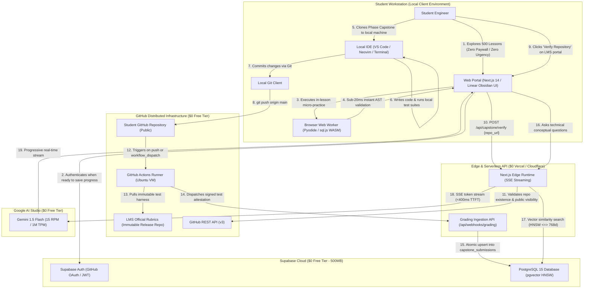

---

## 2. Container & Component Topology (C4 Level 2/3 Diagram)

This model illustrates the internal architecture of the browser application, edge middleware, and external service boundaries. It shows how state flows between UI components, local persistence, and remote databases without blocking the main render thread.

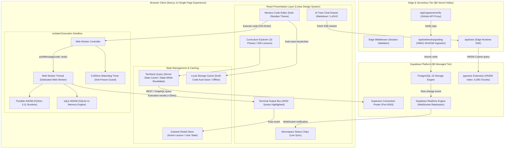

---

## 3. Entity-Relationship Model (Supabase Relational & Vector Schema)

The database schema is strictly designed to remain permanently below Supabase’s **500MB free tier threshold**. Vector embeddings are capped at 5,000 chunks (subtopic granularity), consuming only **38.5MB**, leaving >460MB for student profiles, progress records, and submission logs.

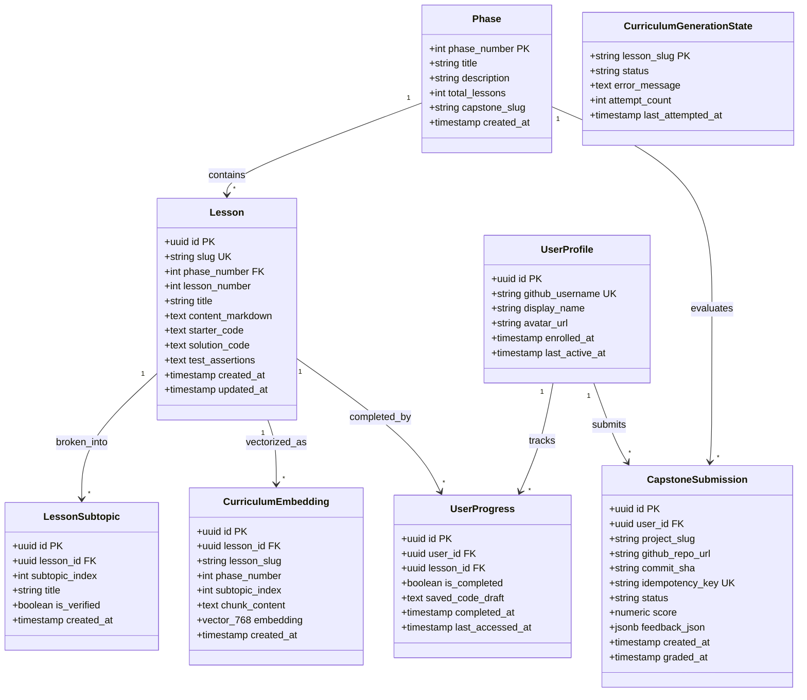

---

## 4. Sequence: Frictionless Onboarding & Anonymous Curriculum Exploration UX

> **UX Philosophy**: Zero gatekeeping. Total beginners and experienced engineers alike should be able to inspect every single one of the 500 lessons, read technical explanations, and practice in the WASM sandbox without being forced to create an account or provide payment information.

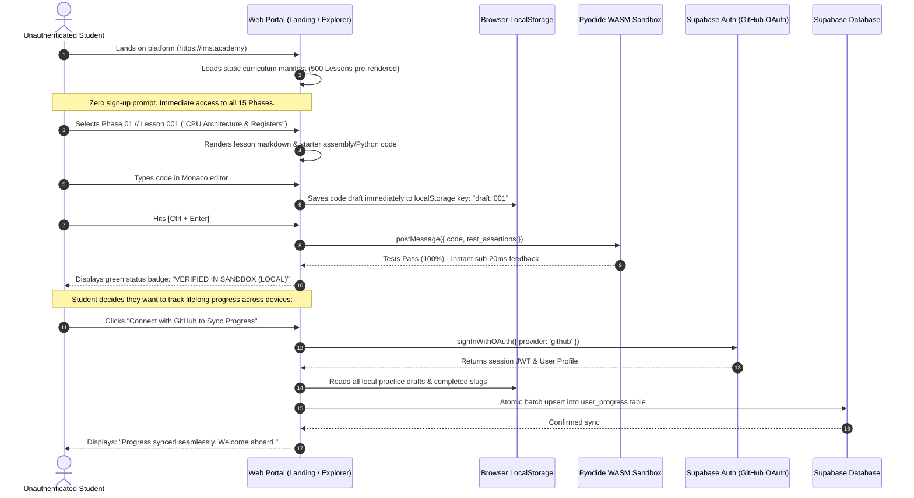

---

## 5. Sequence: In-Lesson Practice Sandbox UX (Zero-Lag Execution + Watchdog)

This sequence models how code runs locally inside a dedicated Web Worker on the user's computer. It eliminates cloud computing costs for the platform while delivering instant feedback to the learner. A strict 5,000ms watchdog prevents runaway loops from freezing the browser UI.

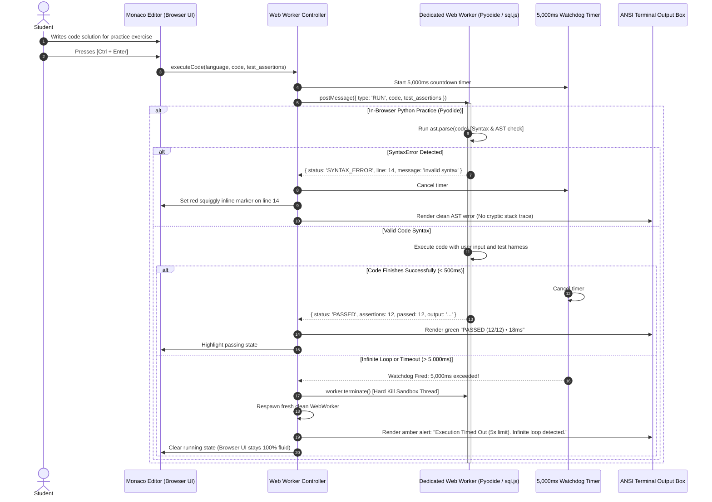

---

## 6. Sequence: Local Workstation to Capstone Grading Verification Loop

> **Brutal Honesty**: Software engineering cannot be learned solely inside a browser toy editor. Real systems engineering requires local compilers, debuggers, and Git. This sequence models the capstone verification loop: the student codes locally, pushes to their public GitHub repository, and triggers automated grading.

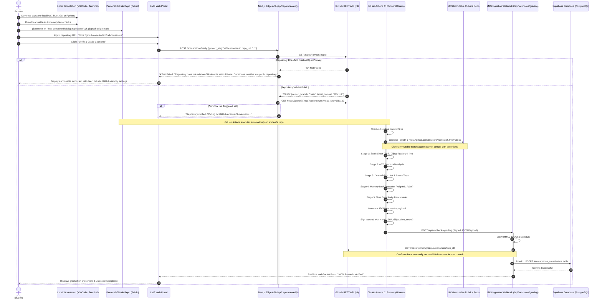

---

## 7. Sequence: Streaming RAG AI Tutor UX (<400ms TTFT)

> **Zero Hallucination Guarantee**: The AI Tutor answers technical questions by retrieving exact curriculum context from the 5,000-chunk pgvector HNSW database. Tokens stream over Server-Sent Events (SSE) via the Next.js Edge Runtime, delivering the first token in under 400 milliseconds.

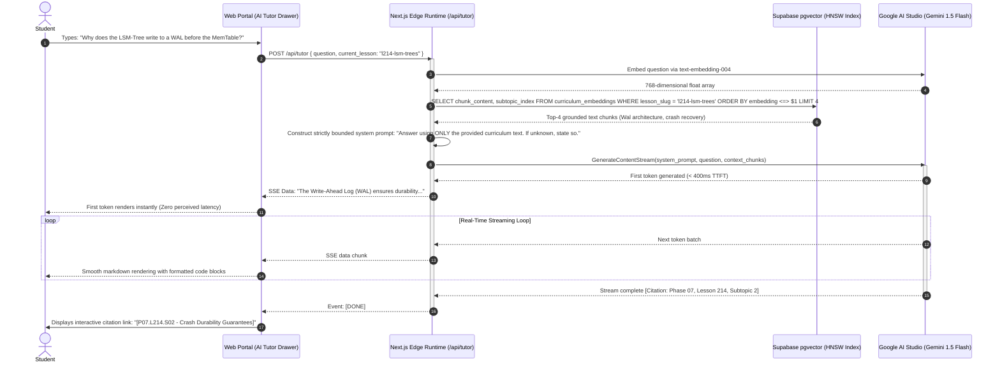

---

## 8. Sequence: Error Handling, Graceful Recovery & Offline UX

This sequence models the platform's resilience against real-world friction: network dropouts, API rate limits, and Supabase auto-pause mitigation.

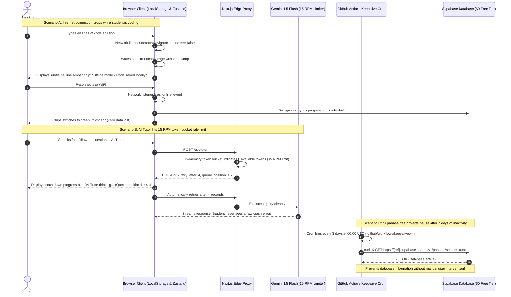

---

## 9. State Machine: Student Learning & Mastery Lifecycle (Zero Urgency)

> **Zero Artificial Urgency**: There are **no calendar deadlines, no cohort expirations, no point penalties for failures, and no streaks that punish students for taking time off**. The student advances purely by demonstrating deterministic mastery.

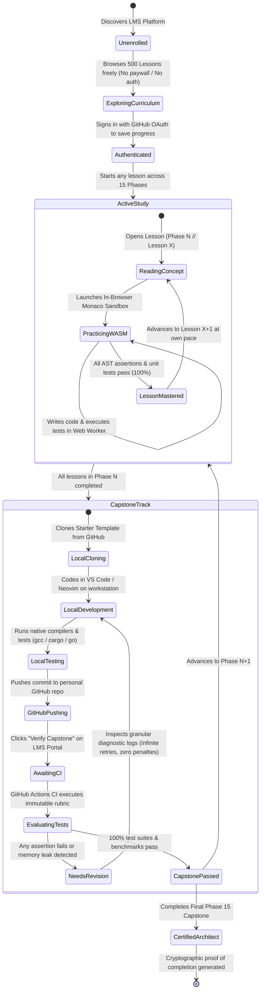

---

## 10. State Machine: Asynchronous Curriculum Population Engine

This state machine models the background script (`scripts/populate_curriculum.py`) that generates and populates all 500 lessons and 2,528 subtopics without skipping, hallucinating, or triggering Gemini free tier API limits.

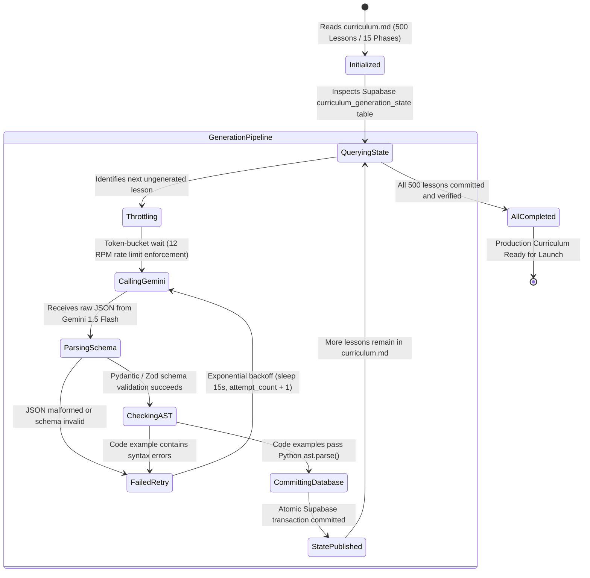

---

## 11. Physical Deployment & Security Architecture (Level 3 Component Topology)

This diagram details the zero-dollar network boundaries, security perimeters, and protocol flows across the entire production infrastructure:

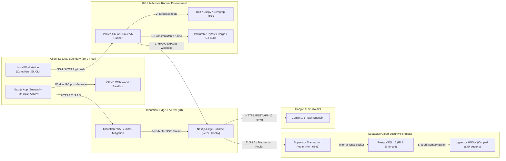

---

## 12. UX Principles & Architectural Verification Matrix

| UX Dimension | Architectural Guarantee | Verification in UML Models |
| :--- | :--- | :--- |
| **Zero Sense of Urgency** | No countdown timers, no cohort expirations, no point penalties for failed attempts. Students can spend 20 minutes or 3 months on a topic until it clicks. | Verified in **Section 9: Student Mastery Lifecycle**. |
| **0ms In-Lesson Feedback** | Practice exercises execute directly on the student's CPU via Pyodide and `sql.js` in a browser Web Worker. Feedback renders in < 20ms without any network request. | Verified in **Section 5: In-Lesson Practice Sandbox UX**. |
| **Watchdog Protection** | A 5,000ms watchdog timer cleanly terminates the Web Worker sandbox thread if an infinite loop occurs, keeping the browser UI completely fluid. | Verified in **Section 5: In-Lesson Practice Sandbox UX (Steps 18-21)**. |
| **Frictionless Local DX** | Students develop capstone projects in their preferred local IDE (VS Code, Neovim, terminal) with native compilers, mirroring real software engineering. | Verified in **Section 1: C4 Context Model** and **Section 6: Capstone Grading Loop**. |
| **Tamper-Proof Transparency** | Tests are objective and deterministic. The student's code is graded against immutable test suites pulled at runtime, eliminating grading subjectivity. | Verified in **Section 6: Capstone Grading Loop (Steps 12-14)**. |
| **Sub-400ms AI Streaming** | The AI Tutor streams tokens progressively over Server-Sent Events (SSE) from the Next.js Edge Runtime, eliminating frustrating 5-second wait times. | Verified in **Section 7: Streaming RAG AI Tutor UX**. |
| **Zero Lost Code (Offline Mode)** | Monaco editor auto-saves every keystroke to `localStorage`. If the network drops, work continues uninterrupted and syncs when reconnected. | Verified in **Section 8: Error Handling & Offline UX (Scenario A)**. |
| **$0 Permanent Cost** | Every database transaction, CI runner minute, and AI token fits permanently within verified free tiers, guaranteeing the student will never encounter paywalls. | Verified in **Section 3: Entity-Relationship Model** and **Section 11: Deployment Topology**. |
